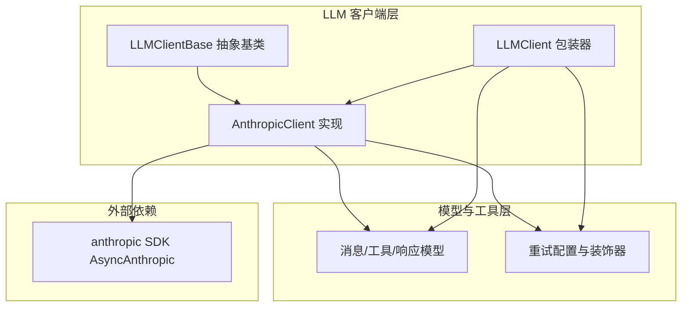
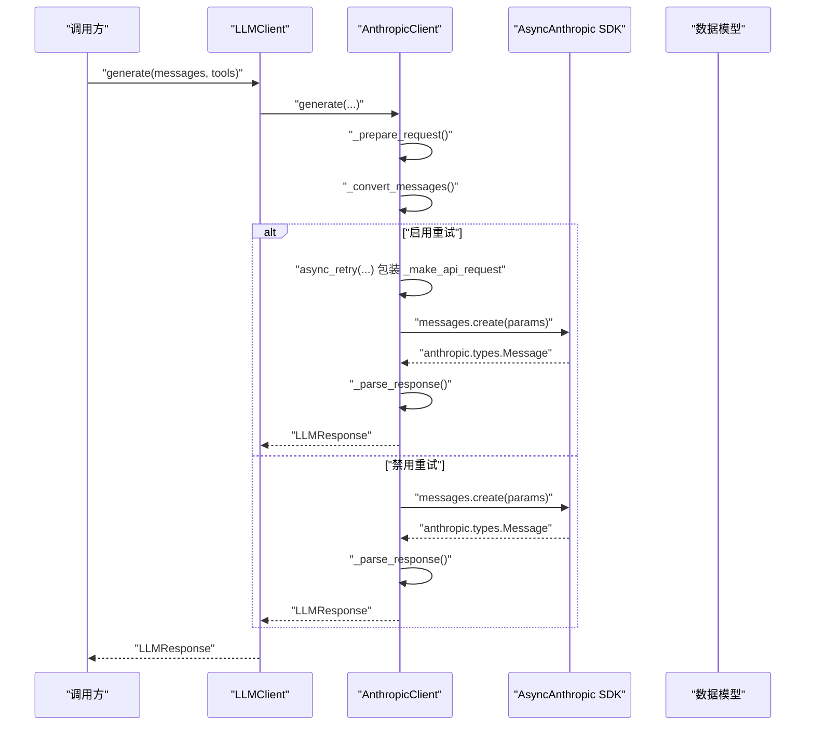
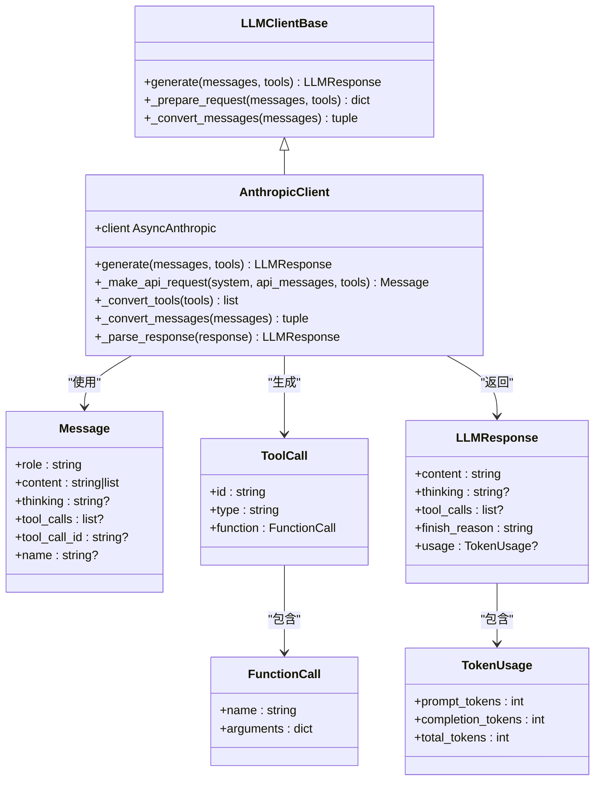
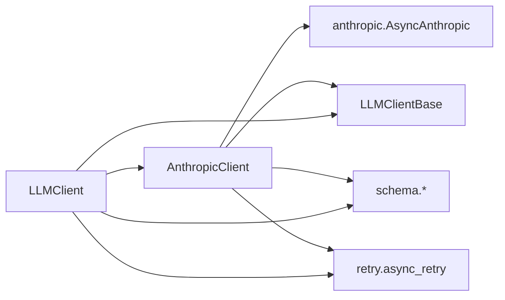

# Anthropic 客户端

<cite>
**本文引用的文件**
- [anthropic_client.py](file://mini_agent/llm/anthropic_client.py)
- [base.py](file://mini_agent/llm/base.py)
- [llm_wrapper.py](file://mini_agent/llm/llm_wrapper.py)
- [schema.py](file://mini_agent/schema/schema.py)
- [retry.py](file://mini_agent/retry.py)
- [config-example.yaml](file://mini_agent/config/config-example.yaml)
- [test_llm_clients.py](file://tests/test_llm_clients.py)
- [__init__.py](file://mini_agent/llm/__init__.py)
</cite>

## 目录
1. [简介](#简介)
2. [项目结构](#项目结构)
3. [核心组件](#核心组件)
4. [架构总览](#架构总览)
5. [详细组件分析](#详细组件分析)
6. [依赖关系分析](#依赖关系分析)
7. [性能考量](#性能考量)
8. [故障排除指南](#故障排除指南)
9. [结论](#结论)
10. [附录](#附录)

## 简介
本文件系统化阐述 Anthropic 客户端的实现架构与 API 兼容性设计，重点覆盖：
- 认证机制与密钥管理
- 请求头设置与连接初始化
- 消息格式转换（含扩展思考内容）
- 工具调用处理与响应解析
- 异步请求、连接管理与错误重试
- 使用示例（基础调用、工具调用、多轮对话）
- 与 Anthropic API 的兼容性差异与注意事项
- 性能优化建议与故障排除

## 项目结构
Anthropic 客户端位于 LLM 子模块中，采用“抽象基类 + 具体实现 + 包装器”的分层设计，配合统一的模型数据结构与重试机制，形成可插拔、可扩展的客户端体系。

图表来源
- [anthropic_client.py:15-46](file://mini_agent/llm/anthropic_client.py#L15-L46)
- [base.py:10-85](file://mini_agent/llm/base.py#L10-L85)
- [llm_wrapper.py:18-128](file://mini_agent/llm/llm_wrapper.py#L18-L128)
- [schema.py:7-56](file://mini_agent/schema/schema.py#L7-L56)
- [retry.py:23-139](file://mini_agent/retry.py#L23-L139)

章节来源
- [anthropic_client.py:1-294](file://mini_agent/llm/anthropic_client.py#L1-L294)
- [base.py:1-85](file://mini_agent/llm/base.py#L1-L85)
- [llm_wrapper.py:1-128](file://mini_agent/llm/llm_wrapper.py#L1-L128)
- [schema.py:1-56](file://mini_agent/schema/schema.py#L1-L56)
- [retry.py:1-139](file://mini_agent/retry.py#L1-L139)

## 核心组件
- AnthropicClient：基于官方 Anthropic SDK 的异步实现，支持扩展思考内容、工具调用与重试逻辑。
- LLMClientBase：定义统一接口，确保不同提供商客户端的一致行为契约。
- LLMClient：多提供商包装器，自动根据提供商选择正确的底层客户端，并对 MiniMax API 自动拼接端点后缀。
- 数据模型：Message、ToolCall、FunctionCall、LLMResponse、TokenUsage，用于内部消息与响应的标准化表示。
- 重试机制：RetryConfig 与 async_retry 装饰器，提供指数退避与可配置重试策略。

章节来源
- [anthropic_client.py:15-294](file://mini_agent/llm/anthropic_client.py#L15-L294)
- [base.py:10-85](file://mini_agent/llm/base.py#L10-L85)
- [llm_wrapper.py:18-128](file://mini_agent/llm/llm_wrapper.py#L18-L128)
- [schema.py:14-56](file://mini_agent/schema/schema.py#L14-L56)
- [retry.py:23-139](file://mini_agent/retry.py#L23-L139)

## 架构总览
下图展示 Anthropic 客户端从初始化到生成响应的关键流程，以及与 SDK、模型与重试机制的交互。

图表来源
- [llm_wrapper.py:113-127](file://mini_agent/llm/llm_wrapper.py#L113-L127)
- [anthropic_client.py:180-294](file://mini_agent/llm/anthropic_client.py#L180-L294)
- [anthropic_client.py:48-81](file://mini_agent/llm/anthropic_client.py#L48-L81)
- [schema.py:29-56](file://mini_agent/schema/schema.py#L29-L56)

## 详细组件分析

### AnthropicClient 类
- 初始化与认证
  - 通过传入的 api_key、api_base、model 与可选的 retry_config 初始化父类。
  - 基于官方 SDK 创建异步客户端实例，设置 base_url、api_key 与默认 Authorization 头。
- 请求准备与消息转换
  - 将内部 Message 列表转换为 Anthropic 协议的消息数组；支持 system、user、assistant、tool 四种角色。
  - 对 assistant 的思考内容与工具调用进行分块处理，构建 content_blocks。
  - 对 tool 角色消息映射为 user 角色下的 tool_result 内容块。
- 工具调用转换
  - 支持工具对象具备 to_schema 方法或直接为字典格式；不支持的类型会抛出异常。
- API 调用与重试
  - 组装参数（model、max_tokens、messages、可选 system 与 tools），调用 SDK 的异步消息创建方法。
  - 若启用重试，则使用 async_retry 装饰器包裹核心请求方法，按指数退避策略重试。
- 响应解析
  - 解析文本内容、扩展思考内容与工具调用列表。
  - 提取 token 使用统计（输入、输出、缓存读取与创建），封装为 TokenUsage。
  - 返回标准化的 LLMResponse。

图表来源
- [anthropic_client.py:15-294](file://mini_agent/llm/anthropic_client.py#L15-L294)
- [base.py:10-85](file://mini_agent/llm/base.py#L10-L85)
- [schema.py:14-56](file://mini_agent/schema/schema.py#L14-L56)

章节来源
- [anthropic_client.py:15-294](file://mini_agent/llm/anthropic_client.py#L15-L294)
- [schema.py:14-56](file://mini_agent/schema/schema.py#L14-L56)

### LLMClient 包装器
- 功能概述
  - 提供统一接口，根据 provider 参数自动选择 Anthropic 或 OpenAI 客户端。
  - 对 MiniMax API 自动拼接端点后缀：Anthropic 使用 /anthropic，OpenAI 使用 /v1。
  - 透传 api_key、api_base、model、retry_config 等参数。
- 关键点
  - 对 api_base 进行尾斜杠清理与后缀剥离，避免重复拼接。
  - 不支持的提供商将抛出异常，保证运行期安全。

章节来源
- [llm_wrapper.py:18-128](file://mini_agent/llm/llm_wrapper.py#L18-L128)

### 数据模型与工具链
- Message：统一的消息载体，支持扩展思考内容与工具调用字段。
- ToolCall/FunctionCall：工具调用的结构化表示。
- LLMResponse：标准化的响应结构，包含内容、思考、工具调用、结束原因与用量统计。
- TokenUsage：令牌用量统计，聚合输入、输出与缓存相关用量。

章节来源
- [schema.py:14-56](file://mini_agent/schema/schema.py#L14-L56)

### 重试机制
- RetryConfig：配置启用开关、最大重试次数、初始延迟、最大延迟与指数基数。
- async_retry：装饰器，对异步函数执行指数退避重试，支持回调与日志记录。
- 在 AnthropicClient 中，当 retry_config 启用时，对核心请求方法进行包装，提升稳定性。

章节来源
- [retry.py:23-139](file://mini_agent/retry.py#L23-L139)
- [anthropic_client.py:275-290](file://mini_agent/llm/anthropic_client.py#L275-L290)

## 依赖关系分析
- 组件耦合
  - AnthropicClient 依赖 LLMClientBase 接口、数据模型与重试机制。
  - LLMClient 包装器依赖具体提供商客户端与枚举类型。
- 外部依赖
  - anthropic SDK 的 AsyncAnthropic 作为异步 HTTP 客户端。
- 可能的循环依赖
  - 当前文件间无循环导入；各模块职责清晰，接口稳定。

图表来源
- [anthropic_client.py:6-10](file://mini_agent/llm/anthropic_client.py#L6-L10)
- [anthropic_client.py:8-9](file://mini_agent/llm/anthropic_client.py#L8-L9)
- [llm_wrapper.py:11-13](file://mini_agent/llm/llm_wrapper.py#L11-L13)

章节来源
- [anthropic_client.py:1-294](file://mini_agent/llm/anthropic_client.py#L1-L294)
- [llm_wrapper.py:1-128](file://mini_agent/llm/llm_wrapper.py#L1-L128)

## 性能考量
- 异步并发
  - 使用 AsyncAnthropic 与 async_retry，适合高并发场景；注意合理设置最大重试次数与延迟上限，避免资源浪费。
- 消息与工具转换
  - 避免在高频调用中重复构造大型消息列表；尽量复用已转换的数据结构。
- 令牌用量统计
  - 合理利用 TokenUsage 进行成本控制与预算监控；关注缓存读取与创建对输入用量的影响。
- 端点与网络
  - 优先选择就近的 MiniMax 平台（全球/中国）以降低延迟；必要时开启连接池与超时配置（由 SDK 控制）。

## 故障排除指南
- 认证失败
  - 确认 api_key 正确且未过期；检查默认 Authorization 头是否被覆盖。
- 端点错误
  - 使用 LLMClient 时，若 api_base 指向 MiniMax 平台，包装器会自动拼接 /anthropic 或 /v1；若指向第三方平台，请确保 api_base 已包含完整路径。
- 工具格式不支持
  - 工具必须为字典或具备 to_schema 方法的对象；否则会触发类型错误。
- 多轮对话未生效
  - 确保在第二轮及后续对话中正确添加 assistant 与 tool 结果消息，以便模型继续推理。
- 重试耗尽
  - 检查 retry_config 的最大重试次数与指数基数；查看日志中的重试警告信息定位问题根因。

章节来源
- [anthropic_client.py:83-112](file://mini_agent/llm/anthropic_client.py#L83-L112)
- [llm_wrapper.py:66-78](file://mini_agent/llm/llm_wrapper.py#L66-L78)
- [retry.py:107-134](file://mini_agent/retry.py#L107-L134)

## 结论
Anthropic 客户端通过清晰的分层设计与标准化的数据模型，实现了对 Anthropic 协议的高效适配，同时提供了工具调用、扩展思考内容与稳健的重试机制。结合 LLMClient 包装器，可在多提供商环境下保持一致的调用体验。建议在生产环境中合理配置重试策略与令牌用量监控，并遵循端点与认证的最佳实践以获得稳定与高性能的推理能力。

## 附录

### 使用示例与最佳实践

- 基础调用
  - 通过 LLMClient 初始化，指定 provider 为 anthropic，传入 api_key、api_base 与 model。
  - 准备 Message 列表（包含 system 与 user 消息），调用 generate 获取 LLMResponse。
  - 参考测试用例中的简单补全流程，验证响应内容与结束原因。

- 工具调用
  - 准备工具列表（字典或具备 to_schema 的对象），在 generate 调用中传入 tools。
  - 若模型返回工具调用，需在后续对话中加入 assistant 与 tool 结果消息，再发起最终请求以获取总结性回答。

- 多轮对话
  - 第一轮：用户提问，模型可能返回工具调用。
  - 第二轮：追加 assistant 消息与工具调用结果，再次调用 generate 获取最终答案。

- 流式响应处理
  - 当前实现使用 SDK 的同步消息创建接口；如需流式响应，可在 SDK 层面切换至流式 API 并在应用层进行事件解析与聚合。

- 配置参考
  - 使用配置文件设置 api_key、api_base、model、provider 与重试参数；包装器会根据 provider 自动拼接端点后缀。

章节来源
- [test_llm_clients.py:25-63](file://tests/test_llm_clients.py#L25-L63)
- [test_llm_clients.py:108-164](file://tests/test_llm_clients.py#L108-L164)
- [test_llm_clients.py:228-304](file://tests/test_llm_clients.py#L228-L304)
- [config-example.yaml:14-35](file://mini_agent/config/config-example.yaml#L14-L35)
- [llm_wrapper.py:66-78](file://mini_agent/llm/llm_wrapper.py#L66-L78)

### 与 Anthropic API 的兼容性差异与注意事项
- 端点与提供商
  - 通过 LLMClient 包装器，可自动为 MiniMax 平台拼接 /anthropic 或 /v1 后缀；第三方平台请直接提供完整 api_base。
- 请求参数
  - 默认 max_tokens 设置为较大值，满足复杂任务需求；可根据实际需要调整。
- 工具调用
  - 仅支持字典或具备 to_schema 的工具对象；确保工具模式与 Anthropic 的工具规范一致。
- 扩展思考内容
  - 支持 assistant 的 thinking 内容块；解析时将其合并为响应的 thinking 字段。
- 错误与重试
  - 使用指数退避策略提升鲁棒性；建议在业务层捕获 RetryExhaustedError 并进行降级处理。

章节来源
- [llm_wrapper.py:66-78](file://mini_agent/llm/llm_wrapper.py#L66-L78)
- [anthropic_client.py:67-71](file://mini_agent/llm/anthropic_client.py#L67-L71)
- [anthropic_client.py:83-112](file://mini_agent/llm/anthropic_client.py#L83-L112)
- [anthropic_client.py:134-178](file://mini_agent/llm/anthropic_client.py#L134-L178)
- [retry.py:64-71](file://mini_agent/retry.py#L64-L71)