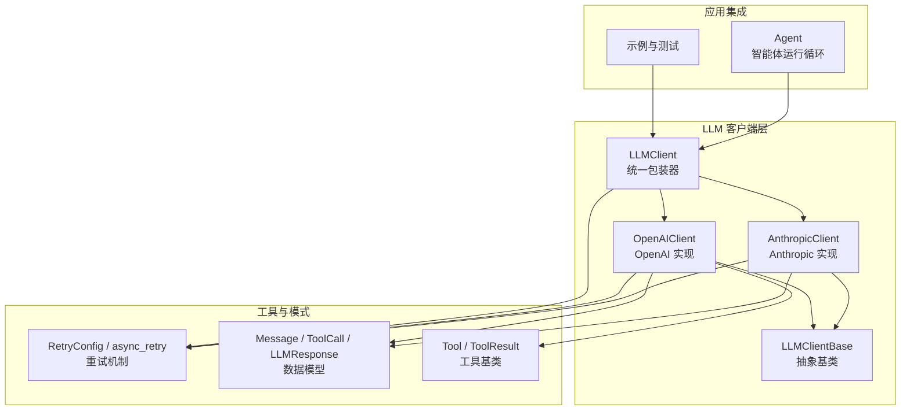
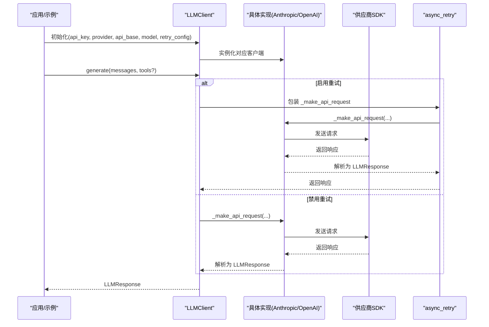
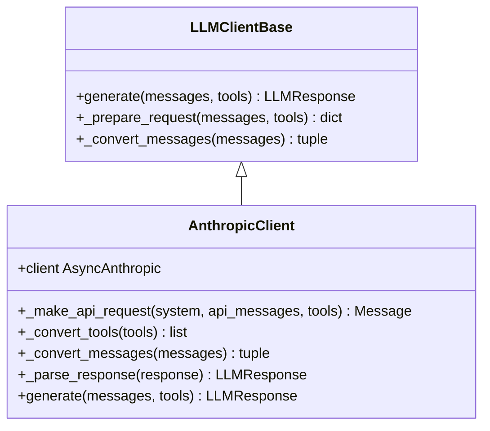
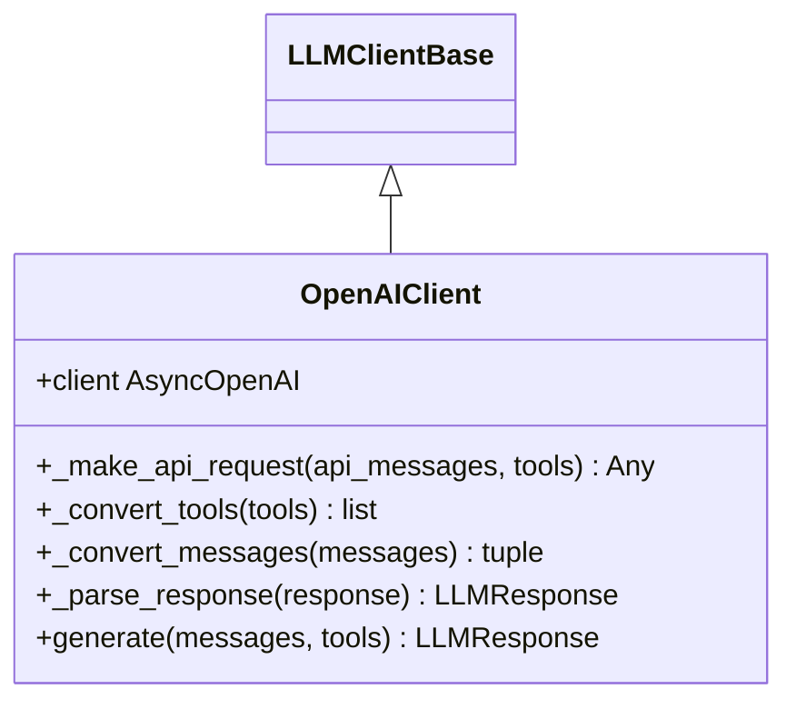
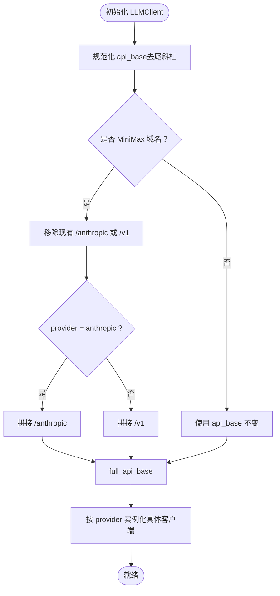
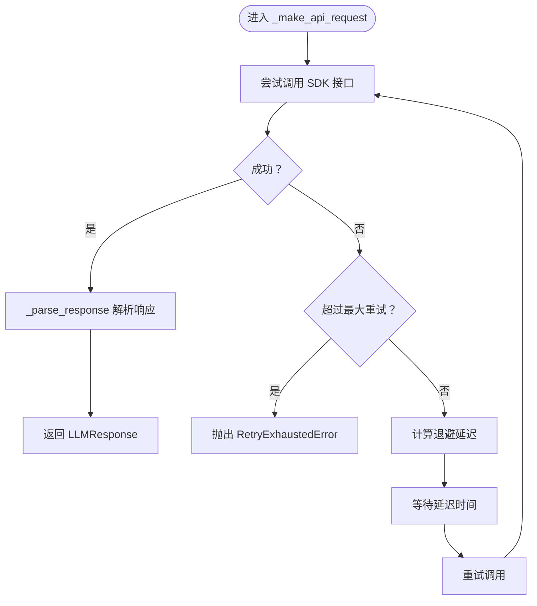
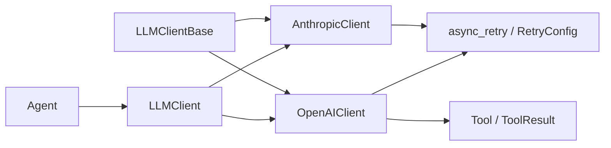
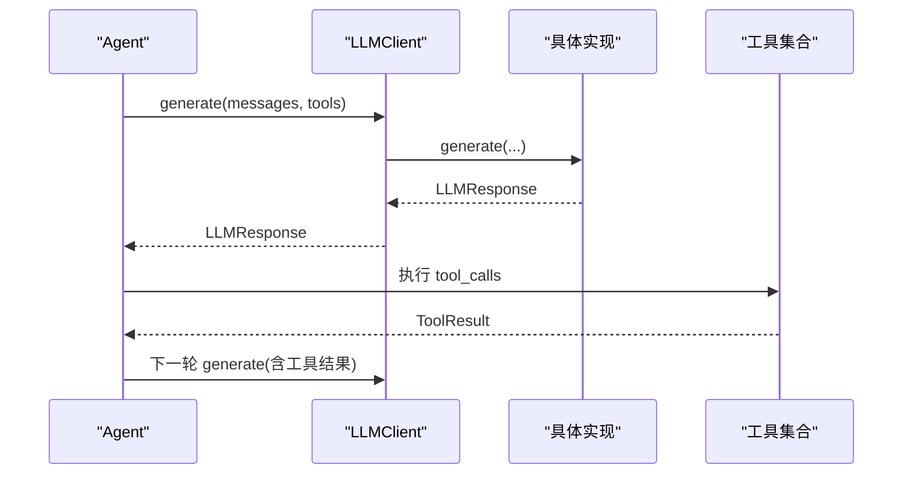

# LLM 客户端

<cite>
**本文引用的文件**
- [mini_agent/llm/__init__.py](file://mini_agent/llm/__init__.py)
- [mini_agent/llm/base.py](file://mini_agent/llm/base.py)
- [mini_agent/llm/anthropic_client.py](file://mini_agent/llm/anthropic_client.py)
- [mini_agent/llm/openai_client.py](file://mini_agent/llm/openai_client.py)
- [mini_agent/llm/llm_wrapper.py](file://mini_agent/llm/llm_wrapper.py)
- [mini_agent/retry.py](file://mini_agent/retry.py)
- [mini_agent/schema/schema.py](file://mini_agent/schema/schema.py)
- [mini_agent/config/config-example.yaml](file://mini_agent/config/config-example.yaml)
- [examples/05_provider_selection.py](file://examples/05_provider_selection.py)
- [tests/test_llm_clients.py](file://tests/test_llm_clients.py)
- [mini_agent/tools/base.py](file://mini_agent/tools/base.py)
- [mini_agent/agent.py](file://mini_agent/agent.py)
</cite>

## 目录
1. [简介](#简介)
2. [项目结构](#项目结构)
3. [核心组件](#核心组件)
4. [架构总览](#架构总览)
5. [详细组件分析](#详细组件分析)
6. [依赖关系分析](#依赖关系分析)
7. [性能考量](#性能考量)
8. [故障排除指南](#故障排除指南)
9. [结论](#结论)
10. [附录](#附录)

## 简介
本文件面向 LLM 客户端系统，系统性阐述统一客户端包装器的设计理念与架构模式，详解 Anthropic 客户端实现（含 API 兼容性、认证机制、请求处理），介绍 OpenAI 客户端支持与差异对比，说明工厂模式的动态选择与配置管理，解释异步请求、连接池与重试机制，提供配置指南（API 密钥、超时、代理）、性能优化与监控指标，以及与智能体系统的集成与数据流。

## 项目结构
LLM 客户端相关代码位于 mini_agent/llm 目录，采用“抽象基类 + 多实现 + 统一包装器”的分层设计：
- 抽象基类定义统一接口，确保不同供应商实现的一致行为契约
- Anthropic 与 OpenAI 分别实现各自协议的消息格式转换、工具调用与响应解析
- LLMClient 包装器通过工厂模式按供应商动态选择底层客户端
- retry 模块提供可配置的异步重试装饰器
- schema 定义消息、工具调用、响应与令牌用量等通用数据模型
- 配置示例与示例脚本展示如何在实际场景中使用

图表来源
- [mini_agent/llm/llm_wrapper.py:18-128](file://mini_agent/llm/llm_wrapper.py#L18-L128)
- [mini_agent/llm/anthropic_client.py:15-294](file://mini_agent/llm/anthropic_client.py#L15-L294)
- [mini_agent/llm/openai_client.py:16-296](file://mini_agent/llm/openai_client.py#L16-L296)
- [mini_agent/retry.py:23-139](file://mini_agent/retry.py#L23-L139)
- [mini_agent/schema/schema.py:7-56](file://mini_agent/schema/schema.py#L7-L56)
- [mini_agent/tools/base.py:16-56](file://mini_agent/tools/base.py#L16-L56)
- [mini_agent/agent.py:45-524](file://mini_agent/agent.py#L45-L524)

章节来源
- [mini_agent/llm/__init__.py:1-10](file://mini_agent/llm/__init__.py#L1-L10)
- [mini_agent/llm/llm_wrapper.py:18-128](file://mini_agent/llm/llm_wrapper.py#L18-L128)

## 核心组件
- 抽象基类 LLMClientBase：定义统一接口 generate、_prepare_request、_convert_messages，保证不同供应商实现一致性
- AnthropicClient：基于官方 SDK 的异步实现，支持 thinking 内容、工具调用与缓存统计的令牌用量
- OpenAIClient：基于官方 SDK 的异步实现，支持 reasoning_split 将思考内容分离到 reasoning_details
- LLMClient：工厂包装器，根据 provider 自动选择 Anthropic 或 OpenAI 客户端；对 MiniMax 域名自动追加 /anthropic 或 /v1 后缀
- RetryConfig / async_retry：可配置指数退避重试，支持异常类型过滤与回调
- 数据模型：Message、ToolCall、FunctionCall、LLMResponse、TokenUsage，统一消息与响应结构
- 工具基类：Tool/ToolResult，提供 to_schema 与 to_openai_schema 转换，便于跨供应商工具传递

章节来源
- [mini_agent/llm/base.py:10-85](file://mini_agent/llm/base.py#L10-L85)
- [mini_agent/llm/anthropic_client.py:15-294](file://mini_agent/llm/anthropic_client.py#L15-L294)
- [mini_agent/llm/openai_client.py:16-296](file://mini_agent/llm/openai_client.py#L16-L296)
- [mini_agent/llm/llm_wrapper.py:18-128](file://mini_agent/llm/llm_wrapper.py#L18-L128)
- [mini_agent/retry.py:23-139](file://mini_agent/retry.py#L23-L139)
- [mini_agent/schema/schema.py:14-56](file://mini_agent/schema/schema.py#L14-L56)
- [mini_agent/tools/base.py:16-56](file://mini_agent/tools/base.py#L16-L56)

## 架构总览
统一客户端包装器通过工厂模式在运行时选择具体供应商实现，屏蔽供应商差异，向上提供一致的异步 generate 接口。供应商实现内部完成消息格式转换、工具调用序列化、响应解析与令牌用量提取，并通过统一的数据模型返回结果。重试机制以装饰器形式注入，既可全局启用也可按需关闭。

图表来源
- [mini_agent/llm/llm_wrapper.py:82-128](file://mini_agent/llm/llm_wrapper.py#L82-L128)
- [mini_agent/llm/anthropic_client.py:257-294](file://mini_agent/llm/anthropic_client.py#L257-L294)
- [mini_agent/llm/openai_client.py:261-296](file://mini_agent/llm/openai_client.py#L261-L296)
- [mini_agent/retry.py:73-139](file://mini_agent/retry.py#L73-L139)

## 详细组件分析

### 抽象基类与统一接口
- 设计要点：统一 async generate、_prepare_request、_convert_messages 三个方法，确保实现类只需关注协议细节
- 参数与返回：generate 接收消息列表与工具列表，返回统一的 LLMResponse；_convert_messages 输出供应商特定的消息数组与系统消息
- 扩展性：新增供应商仅需继承并实现上述方法

章节来源
- [mini_agent/llm/base.py:10-85](file://mini_agent/llm/base.py#L10-L85)

### Anthropic 客户端实现
- 认证与初始化：通过 base_url、api_key 与默认头 Authorization 初始化异步客户端
- 请求参数：固定 max_tokens，按需附加 system、tools；消息转换支持 thinking 与 tool_use 块
- 工具格式转换：支持 dict 与具备 to_schema 方法的对象；不支持类型抛出异常
- 响应解析：聚合 text/thinking/tool_use 块，提取 usage 并合并缓存读写与创建的输入令牌
- 重试：通过 async_retry 装饰器包裹 _make_api_request，结合 RetryConfig 控制退避策略

图表来源
- [mini_agent/llm/base.py:10-85](file://mini_agent/llm/base.py#L10-L85)
- [mini_agent/llm/anthropic_client.py:15-294](file://mini_agent/llm/anthropic_client.py#L15-L294)

章节来源
- [mini_agent/llm/anthropic_client.py:15-294](file://mini_agent/llm/anthropic_client.py#L15-L294)

### OpenAI 客户端实现
- 认证与初始化：通过 api_key 与 base_url 初始化异步 OpenAI 客户端
- 请求参数：启用 extra_body.reasoning_split 以分离思考内容；按需附加 tools
- 工具格式转换：支持 dict（若为 function 类型则直接使用，否则转换）与具备 to_openai_schema 方法的对象
- 消息转换：系统消息直接放入消息数组；助手消息包含 content、tool_calls 与 reasoning_details（当存在 thinking）
- 响应解析：从 choices[0].message 提取 content 与 tool_calls（JSON 反序列化 arguments），usage 字段来自完整响应对象
- 重试：同 Anthropic 客户端

图表来源
- [mini_agent/llm/base.py:10-85](file://mini_agent/llm/base.py#L10-L85)
- [mini_agent/llm/openai_client.py:16-296](file://mini_agent/llm/openai_client.py#L16-L296)

章节来源
- [mini_agent/llm/openai_client.py:16-296](file://mini_agent/llm/openai_client.py#L16-L296)

### 工厂包装器与动态选择
- 功能：根据 provider（anthropic/openai）实例化对应客户端；对 MiniMax 域名自动拼接 /anthropic 或 /v1
- 配置：支持传入 api_base、model、retry_config；对 api_base 去除尾随斜杠并做域名匹配
- 代理：第三方 API 直接透传 api_base；MiniMax 通过后缀区分供应商端点
- 透明转发：generate 直接委托给底层客户端，保持接口一致

图表来源
- [mini_agent/llm/llm_wrapper.py:36-102](file://mini_agent/llm/llm_wrapper.py#L36-L102)

章节来源
- [mini_agent/llm/llm_wrapper.py:18-128](file://mini_agent/llm/llm_wrapper.py#L18-L128)

### 异步请求、连接池与重试机制
- 异步：所有客户端均使用异步 SDK 调用，generate 为异步方法
- 连接池：由各供应商 SDK 内部管理；本项目未自建连接池
- 重试：通过 async_retry 装饰器实现指数退避；可配置最大重试次数、初始延迟、最大延迟与可重试异常类型
- 回调：支持 on_retry 回调，用于记录重试事件

图表来源
- [mini_agent/retry.py:73-139](file://mini_agent/retry.py#L73-L139)
- [mini_agent/llm/anthropic_client.py:274-294](file://mini_agent/llm/anthropic_client.py#L274-L294)
- [mini_agent/llm/openai_client.py:278-296](file://mini_agent/llm/openai_client.py#L278-L296)

章节来源
- [mini_agent/retry.py:23-139](file://mini_agent/retry.py#L23-L139)
- [mini_agent/llm/anthropic_client.py:257-294](file://mini_agent/llm/anthropic_client.py#L257-L294)
- [mini_agent/llm/openai_client.py:261-296](file://mini_agent/llm/openai_client.py#L261-L296)

### 数据模型与工具转换
- 模型：Message（role/content/thinking/tool_calls/tool_call_id/name）、ToolCall/FunctionCall、LLMResponse（content/thinking/tool_calls/finish_reason/usage）、TokenUsage
- 工具：Tool 提供 to_schema（Anthropic）与 to_openai_schema（OpenAI）两种格式转换，便于在不同供应商间复用

章节来源
- [mini_agent/schema/schema.py:14-56](file://mini_agent/schema/schema.py#L14-L56)
- [mini_agent/tools/base.py:16-56](file://mini_agent/tools/base.py#L16-L56)

## 依赖关系分析
- 组件耦合：LLMClientBase 作为抽象契约，AnthropicClient 与 OpenAIClient 依赖其接口；LLMClient 依赖具体实现
- 外部依赖：anthropic 与 openai SDK；tiktoken 用于智能体侧令牌估算
- 循环依赖：无明显循环；包装器仅单向依赖实现类
- 可扩展性：新增供应商只需实现 LLMClientBase 并在 LLMClient 中注册

图表来源
- [mini_agent/llm/base.py:10-85](file://mini_agent/llm/base.py#L10-L85)
- [mini_agent/llm/llm_wrapper.py:82-128](file://mini_agent/llm/llm_wrapper.py#L82-L128)
- [mini_agent/llm/anthropic_client.py:15-294](file://mini_agent/llm/anthropic_client.py#L15-L294)
- [mini_agent/llm/openai_client.py:16-296](file://mini_agent/llm/openai_client.py#L16-L296)
- [mini_agent/retry.py:23-139](file://mini_agent/retry.py#L23-L139)
- [mini_agent/tools/base.py:16-56](file://mini_agent/tools/base.py#L16-L56)
- [mini_agent/agent.py:45-524](file://mini_agent/agent.py#L45-L524)

章节来源
- [mini_agent/llm/__init__.py:1-10](file://mini_agent/llm/__init__.py#L1-L10)
- [mini_agent/llm/llm_wrapper.py:18-128](file://mini_agent/llm/llm_wrapper.py#L18-L128)

## 性能考量
- 令牌估算：智能体侧使用 tiktoken 编码器估算上下文长度，避免超出模型上下文窗口；当本地估算或 API 报告的 total_tokens 超限时触发摘要压缩
- 重试退避：指数退避降低瞬时峰值压力，避免雪崩效应
- 工具调用：在生成阶段一次性携带工具列表，减少往返次数
- 日志与可观测性：Agent 在每次 LLM 请求前后记录日志，便于定位耗时与失败原因

章节来源
- [mini_agent/agent.py:123-200](file://mini_agent/agent.py#L123-L200)
- [mini_agent/retry.py:51-62](file://mini_agent/retry.py#L51-L62)

## 故障排除指南
- API 密钥无效或过期：检查配置文件中的 api_key 是否正确；确认 api_base 与供应商端点匹配
- 供应商域名问题：MiniMax 域名会自动追加 /anthropic 或 /v1，非 MiniMax 域名直接透传；如出现 404/路径错误，请确认 api_base
- 工具格式不兼容：OpenAI 需要 function 类型工具；Anthropic 支持 dict schema 或具备 to_schema 的对象
- 重试耗尽：当达到最大重试次数仍未成功，会抛出 RetryExhaustedError；检查网络、限流与异常类型配置
- 上下文溢出：当本地估算或 API 报告的 tokens 超限，Agent 会自动进行摘要压缩；必要时降低消息复杂度或缩短历史

章节来源
- [mini_agent/llm/llm_wrapper.py:63-102](file://mini_agent/llm/llm_wrapper.py#L63-L102)
- [mini_agent/llm/openai_client.py:80-112](file://mini_agent/llm/openai_client.py#L80-L112)
- [mini_agent/llm/anthropic_client.py:83-112](file://mini_agent/llm/anthropic_client.py#L83-L112)
- [mini_agent/retry.py:64-71](file://mini_agent/retry.py#L64-L71)
- [mini_agent/agent.py:200-261](file://mini_agent/agent.py#L200-L261)

## 结论
该 LLM 客户端系统通过抽象基类与工厂包装器实现了供应商无关的统一接口，Anthropic 与 OpenAI 客户端分别针对其协议特性完成消息转换、工具调用与响应解析，并内置可配置的异步重试机制。配合智能体系统的令牌估算与摘要压缩，整体具备良好的可扩展性、稳定性与可观测性。

## 附录

### 使用示例与最佳实践
- 示例脚本展示了如何通过 LLMClient 选择 Anthropic 或 OpenAI 供应商，并进行简单问答与多轮对话
- 测试用例覆盖了简单补全、工具调用与多轮对话流程，便于验证集成效果

章节来源
- [examples/05_provider_selection.py:15-189](file://examples/05_provider_selection.py#L15-L189)
- [tests/test_llm_clients.py:25-337](file://tests/test_llm_clients.py#L25-L337)

### 配置指南
- API 密钥与基础地址：在配置文件中设置 api_key 与 api_base；MiniMax 提供全球与国内平台，分别对应不同域名
- 供应商选择：provider 字段选择 anthropic 或 openai；MiniMax 会自动追加 /anthropic 或 /v1
- 重试配置：可调整启用开关、最大重试次数、初始延迟、最大延迟与可重试异常类型
- 代理与第三方 API：第三方 API 直接使用 api_base；如需代理，请在运行环境或 SDK 层面配置

章节来源
- [mini_agent/config/config-example.yaml:13-35](file://mini_agent/config/config-example.yaml#L13-L35)
- [mini_agent/llm/llm_wrapper.py:63-102](file://mini_agent/llm/llm_wrapper.py#L63-L102)

### 与智能体系统的集成与数据流
- Agent 将当前消息历史与工具列表传递给 LLMClient.generate
- LLM 返回统一的 LLMResponse（包含 content、thinking、tool_calls、usage）
- Agent 根据响应更新消息历史，执行工具调用并将结果回填至消息历史，再进行下一步推理

图表来源
- [mini_agent/agent.py:361-524](file://mini_agent/agent.py#L361-L524)
- [mini_agent/llm/llm_wrapper.py:113-128](file://mini_agent/llm/llm_wrapper.py#L113-L128)