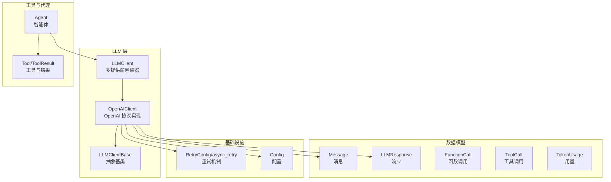
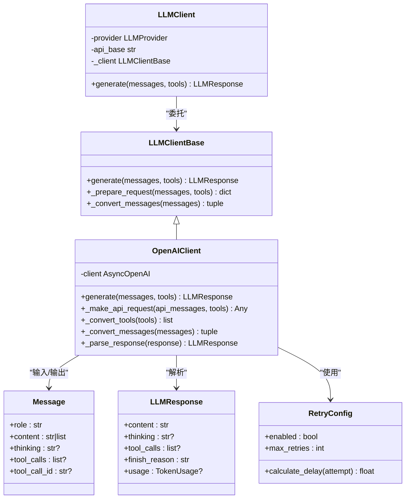
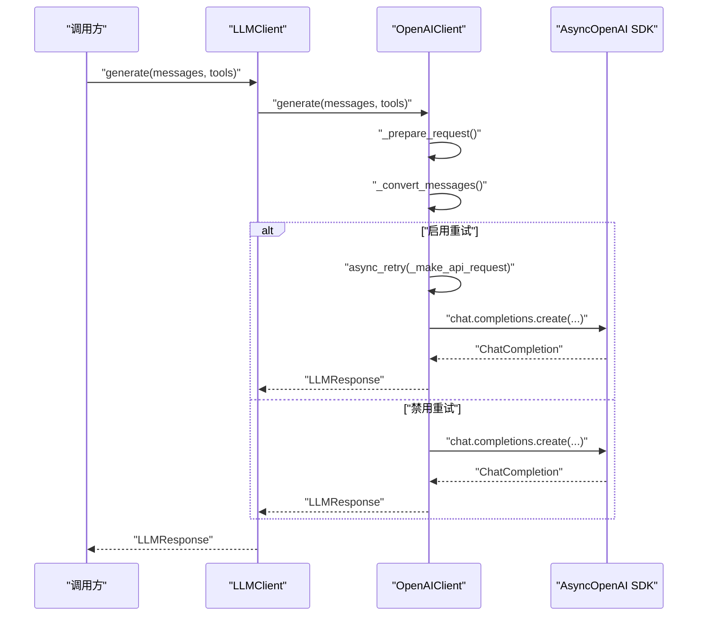
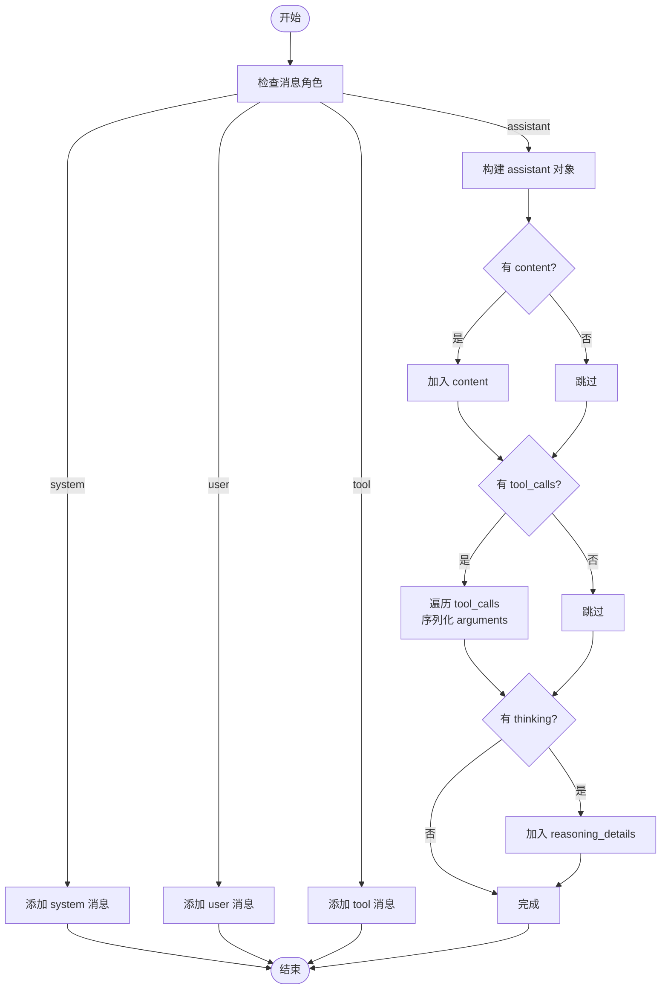
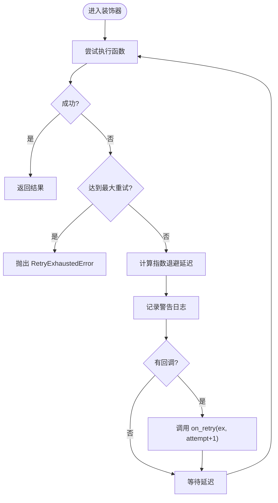
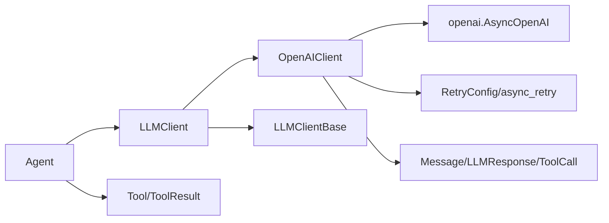

# OpenAI 客户端

<cite>
**本文引用的文件**
- [openai_client.py](file://mini_agent/llm/openai_client.py)
- [base.py](file://mini_agent/llm/base.py)
- [llm_wrapper.py](file://mini_agent/llm/llm_wrapper.py)
- [schema.py](file://mini_agent/schema/schema.py)
- [retry.py](file://mini_agent/retry.py)
- [agent.py](file://mini_agent/agent.py)
- [config.py](file://mini_agent/config.py)
- [test_llm_clients.py](file://tests/test_llm_clients.py)
- [02_simple_agent.py](file://examples/02_simple_agent.py)
- [__init__.py](file://mini_agent/llm/__init__.py)
</cite>

## 目录
1. [简介](#简介)
2. [项目结构](#项目结构)
3. [核心组件](#核心组件)
4. [架构总览](#架构总览)
5. [详细组件分析](#详细组件分析)
6. [依赖关系分析](#依赖关系分析)
7. [性能考量](#性能考量)
8. [故障排查指南](#故障排查指南)
9. [结论](#结论)
10. [附录](#附录)

## 简介
本文件系统化阐述 OpenAI 客户端在本项目中的实现架构与 OpenAI API 兼容性设计，覆盖认证方式、请求格式与响应解析、消息格式转换、工具调用与函数调用处理、异步请求与重试机制、流式响应支持现状、错误处理策略，并提供可直接参考的使用示例与最佳实践建议。OpenAIClient 基于官方 AsyncOpenAI SDK 实现，通过统一的 LLMClient 包装器对外暴露一致接口，同时保留对推理内容（reasoning）与工具调用的完整支持。

## 项目结构
OpenAI 客户端位于 LLM 子模块中，采用“抽象基类 + 具体实现 + 包装器”的分层设计，配合统一的数据模型与重试机制，形成可扩展、可测试、可维护的客户端体系。

图示来源
- [llm_wrapper.py:18-128](file://mini_agent/llm/llm_wrapper.py#L18-L128)
- [openai_client.py:16-296](file://mini_agent/llm/openai_client.py#L16-L296)
- [base.py:10-85](file://mini_agent/llm/base.py#L10-L85)
- [schema.py:29-56](file://mini_agent/schema/schema.py#L29-L56)
- [retry.py:23-139](file://mini_agent/retry.py#L23-L139)
- [agent.py:45-524](file://mini_agent/agent.py#L45-L524)

章节来源
- [llm_wrapper.py:18-128](file://mini_agent/llm/llm_wrapper.py#L18-L128)
- [openai_client.py:16-296](file://mini_agent/llm/openai_client.py#L16-L296)
- [base.py:10-85](file://mini_agent/llm/base.py#L10-L85)
- [schema.py:29-56](file://mini_agent/schema/schema.py#L29-L56)
- [retry.py:23-139](file://mini_agent/retry.py#L23-L139)
- [agent.py:45-524](file://mini_agent/agent.py#L45-L524)

## 核心组件
- OpenAIClient：基于 AsyncOpenAI SDK 的 OpenAI 协议实现，负责消息格式转换、工具格式转换、请求构造、响应解析与重试集成。
- LLMClientBase：定义统一的异步生成接口与消息转换规范，确保不同提供商客户端的一致行为契约。
- LLMClient：多提供商包装器，根据 provider 自动选择 Anthropic 或 OpenAI 客户端实例，支持 MiniMax API 的自动路径后缀处理。
- 数据模型：Message、LLMResponse、FunctionCall、ToolCall、TokenUsage 提供跨提供商的统一数据结构。
- 重试机制：RetryConfig 与 async_retry 装饰器，提供指数退避与可配置重试策略。
- Agent：使用 LLMClient 进行多轮对话、工具调用与消息历史管理，内置令牌估算与摘要机制。

章节来源
- [openai_client.py:16-296](file://mini_agent/llm/openai_client.py#L16-L296)
- [base.py:10-85](file://mini_agent/llm/base.py#L10-L85)
- [llm_wrapper.py:18-128](file://mini_agent/llm/llm_wrapper.py#L18-L128)
- [schema.py:14-56](file://mini_agent/schema/schema.py#L14-L56)
- [retry.py:23-139](file://mini_agent/retry.py#L23-L139)
- [agent.py:45-524](file://mini_agent/agent.py#L45-L524)

## 架构总览
OpenAIClient 通过继承 LLMClientBase，复用统一的消息与响应模型，内部使用 AsyncOpenAI SDK 发起请求；LLMClient 包装器负责提供商选择与 API 基址规范化；Agent 将 LLM 与工具链路整合，形成完整的智能体工作流。

图示来源
- [openai_client.py:16-296](file://mini_agent/llm/openai_client.py#L16-L296)
- [base.py:10-85](file://mini_agent/llm/base.py#L10-L85)
- [llm_wrapper.py:18-128](file://mini_agent/llm/llm_wrapper.py#L18-L128)
- [schema.py:29-56](file://mini_agent/schema/schema.py#L29-L56)
- [retry.py:23-139](file://mini_agent/retry.py#L23-L139)

## 详细组件分析

### OpenAIClient 实现要点
- 认证与初始化
  - 使用传入的 api_key 与 api_base 初始化 AsyncOpenAI 客户端。
  - 默认 model 为 MiniMax-M2.5，可通过配置覆盖。
- 请求构建
  - 在消息数组中包含 system 内容（OpenAI 支持将 system 作为消息项）。
  - 启用 extra_body 中的 reasoning_split 以分离思考内容。
  - 工具参数通过 tools 字段传递，内部会将工具转换为 OpenAI function schema。
- 响应解析
  - 提取 choices[0].message 的 content 与 reasoning_details。
  - 解析 tool_calls 并反序列化 arguments。
  - 读取 usage 统计信息。
- 错误与重试
  - 当启用重试时，使用 async_retry 装饰器包裹 _make_api_request，按指数退避重试。
  - 未启用重试时直接发起请求。

图示来源
- [llm_wrapper.py:113-128](file://mini_agent/llm/llm_wrapper.py#L113-L128)
- [openai_client.py:261-296](file://mini_agent/llm/openai_client.py#L261-L296)
- [openai_client.py:48-78](file://mini_agent/llm/openai_client.py#L48-L78)
- [retry.py:73-139](file://mini_agent/retry.py#L73-L139)

章节来源
- [openai_client.py:25-47](file://mini_agent/llm/openai_client.py#L25-L47)
- [openai_client.py:48-78](file://mini_agent/llm/openai_client.py#L48-L78)
- [openai_client.py:80-112](file://mini_agent/llm/openai_client.py#L80-L112)
- [openai_client.py:114-180](file://mini_agent/llm/openai_client.py#L114-L180)
- [openai_client.py:203-259](file://mini_agent/llm/openai_client.py#L203-L259)
- [openai_client.py:261-296](file://mini_agent/llm/openai_client.py#L261-L296)

### 消息格式转换与工具调用支持
- 消息转换
  - system：作为消息数组中的 role="system" 项。
  - user：role="user"。
  - assistant：role="assistant"，可包含 content、tool_calls、reasoning_details（当存在 thinking 时）。
  - tool：role="tool"，携带 tool_call_id 与 content。
- 工具转换
  - 若工具为字典且 type="function"，视为 OpenAI schema 直接使用。
  - 若工具为字典但非 OpenAI schema，则按 Anthropic schema 转换为 OpenAI function schema。
  - 若工具对象具有 to_openai_schema 方法，则直接调用生成 OpenAI schema。
- 函数调用解析
  - 从响应 message.tool_calls 中提取 id、name 与 arguments（JSON 字符串），解析为 ToolCall(FunctionCall)。
  - reasoning_details 用于恢复模型的链式思维，需在后续轮次中回传至消息历史。

图示来源
- [openai_client.py:114-180](file://mini_agent/llm/openai_client.py#L114-L180)
- [openai_client.py:80-112](file://mini_agent/llm/openai_client.py#L80-L112)
- [openai_client.py:203-259](file://mini_agent/llm/openai_client.py#L203-L259)

章节来源
- [openai_client.py:80-112](file://mini_agent/llm/openai_client.py#L80-L112)
- [openai_client.py:114-180](file://mini_agent/llm/openai_client.py#L114-L180)
- [openai_client.py:203-259](file://mini_agent/llm/openai_client.py#L203-L259)

### 异步请求管理与重试机制
- 异步执行
  - 所有 LLM 调用均为异步，底层通过 AsyncOpenAI SDK 发起请求。
- 重试策略
  - 可配置 enabled、max_retries、initial_delay、max_delay、exponential_base。
  - 指数退避延迟计算，最大延迟不超过 max_delay。
  - 支持指定可重试异常类型，默认对所有异常重试。
  - 装饰器在捕获可重试异常后记录警告日志并等待相应时间再重试。
- 重试耗尽
  - 达到最大重试次数后抛出 RetryExhaustedError，包含最后异常与尝试次数。

图示来源
- [retry.py:73-139](file://mini_agent/retry.py#L73-L139)
- [retry.py:23-62](file://mini_agent/retry.py#L23-L62)

章节来源
- [retry.py:23-139](file://mini_agent/retry.py#L23-L139)
- [openai_client.py:278-292](file://mini_agent/llm/openai_client.py#L278-L292)

### 流式响应处理
- 当前实现
  - OpenAIClient 使用 AsyncOpenAI SDK 的 chat.completions.create 接口，该接口返回完整响应对象，不直接支持流式增量事件。
- 兼容性建议
  - 如需流式输出，请改用 AsyncOpenAI 的流式接口或自定义适配器以逐块解析响应。
  - 本项目未提供 OpenAI 流式响应的专用解析逻辑。

章节来源
- [openai_client.py:75-78](file://mini_agent/llm/openai_client.py#L75-L78)

### 错误处理机制
- LLM 层
  - LLMClient 包装器在调用底层 _client.generate 时捕获异常，区分 RetryExhaustedError 并给出明确提示。
- 工具层
  - Agent 在执行工具时捕获任意异常，封装为 ToolResult(success=False)，并记录详细错误与堆栈。
- 日志与可观测性
  - 重试装饰器记录每次失败与延迟等待的日志，便于问题定位。

章节来源
- [llm_wrapper.py:113-128](file://mini_agent/llm/llm_wrapper.py#L113-L128)
- [agent.py:454-475](file://mini_agent/agent.py#L454-L475)
- [retry.py:115-129](file://mini_agent/retry.py#L115-L129)

### 使用示例与最佳实践

- 基础聊天补全
  - 示例参考：[test_llm_clients.py:66-104](file://tests/test_llm_clients.py#L66-L104)
  - 步骤概要：加载配置 → 创建 OpenAIClient → 组装 system 与 user 消息 → 调用 generate → 输出 content。
- 函数/工具调用
  - 示例参考：[test_llm_clients.py:167-224](file://tests/test_llm_clients.py#L167-L224)
  - 步骤概要：准备工具 schema（支持 dict 或 Tool 对象）→ 用户提问 → 生成响应 → 解析 tool_calls → 执行工具 → 回传 tool 结果消息 → 再次生成最终答案。
- 多轮对话与思考链
  - 示例参考：[test_llm_clients.py:227-304](file://tests/test_llm_clients.py#L227-L304)
  - 关键点：assistant 的 thinking 内容需保留并在下一轮消息历史中回传，以维持模型的链式思维。
- 代理驱动的任务执行
  - 示例参考：[02_simple_agent.py:19-113](file://examples/02_simple_agent.py#L19-L113)
  - 步骤概要：加载配置 → 初始化 LLMClient（OpenAI）→ 注册工具 → 创建 Agent → 添加用户任务 → 运行 Agent → 查看结果与生成文件。

最佳实践
- 配置管理
  - 使用 Config.from_yaml 加载配置，确保 api_key、api_base、model、provider 正确设置。
- 工具 schema
  - 优先使用 Tool.to_openai_schema 生成标准 OpenAI function schema；若传入 dict，需保证 type="function"。
- 思考链保持
  - assistant 的 thinking 必须写入 LLMResponse，并在后续消息中以 reasoning_details 形式回传。
- 重试策略
  - 对网络波动与临时服务不可用场景启用重试；合理设置初始延迟与最大重试次数。
- 令牌控制
  - Agent 内置令牌估算与摘要机制，避免上下文溢出；必要时降低模型上下文长度或提高摘要阈值。

章节来源
- [test_llm_clients.py:66-104](file://tests/test_llm_clients.py#L66-L104)
- [test_llm_clients.py:167-224](file://tests/test_llm_clients.py#L167-L224)
- [test_llm_clients.py:227-304](file://tests/test_llm_clients.py#L227-L304)
- [02_simple_agent.py:19-113](file://examples/02_simple_agent.py#L19-L113)
- [config.py:66-164](file://mini_agent/config.py#L66-L164)

## 依赖关系分析
- 组件耦合
  - OpenAIClient 依赖 AsyncOpenAI SDK、RetryConfig/async_retry、Message/LLMResponse 等数据模型。
  - LLMClient 通过工厂模式在运行时选择具体提供商客户端，降低上层耦合。
- 外部依赖
  - openai.AsyncOpenAI：用于 OpenAI 协议的异步调用。
  - pydantic：用于数据模型校验与序列化。
  - tiktoken：Agent 中用于消息历史的令牌估算（非 OpenAIClient 直接依赖）。

图示来源
- [openai_client.py:7-11](file://mini_agent/llm/openai_client.py#L7-L11)
- [llm_wrapper.py:9-13](file://mini_agent/llm/llm_wrapper.py#L9-L13)
- [agent.py:11-16](file://mini_agent/agent.py#L11-L16)

章节来源
- [openai_client.py:7-11](file://mini_agent/llm/openai_client.py#L7-L11)
- [llm_wrapper.py:9-13](file://mini_agent/llm/llm_wrapper.py#L9-L13)
- [agent.py:11-16](file://mini_agent/agent.py#L11-L16)

## 性能考量
- 异步并发
  - 使用异步 SDK 与 asyncio 事件循环，适合高并发场景；注意避免阻塞操作。
- 令牌估算与摘要
  - Agent 的消息摘要可显著降低上下文长度，减少 API 调用成本与延迟。
- 重试退避
  - 指数退避可缓解瞬时峰值压力；建议结合限流与熔断策略。
- 工具调用批处理
  - 合理规划工具 schema，减少不必要的多次往返调用。

## 故障排查指南
- API 认证失败
  - 检查配置文件中的 api_key 是否正确；确认 api_base 与 provider 组合是否匹配。
- 请求超时或不稳定
  - 启用重试并适当增大 initial_delay 与 max_retries；观察日志中的警告信息。
- 工具调用未触发
  - 确认工具 schema 正确（type="function"），参数 schema 完整；检查提示词是否明确要求使用工具。
- 思考链中断
  - assistant 的 thinking 必须在后续轮次中以 reasoning_details 回传，否则模型链式思维会被打断。
- 令牌溢出
  - 观察 Agent 的摘要日志；必要时降低 token_limit 或缩短历史消息。

章节来源
- [config.py:107-121](file://mini_agent/config.py#L107-L121)
- [retry.py:115-129](file://mini_agent/retry.py#L115-L129)
- [openai_client.py:160-167](file://mini_agent/llm/openai_client.py#L160-L167)
- [agent.py:180-260](file://mini_agent/agent.py#L180-L260)

## 结论
OpenAIClient 在本项目中提供了与 OpenAI API 兼容的异步客户端实现，具备完善的工具调用、推理内容支持与可配置重试机制。通过 LLMClient 包装器，用户可在 Anthropic 与 OpenAI 之间无缝切换；配合 Agent 的消息摘要与令牌估算，能够稳定地处理长对话与复杂任务。对于流式响应需求，建议基于 AsyncOpenAI 的流式接口进行扩展。

## 附录

### OpenAI API 兼容性与差异
- 兼容特性
  - 支持 OpenAI chat.completions 接口的 messages、tools、extra_body(reasoning_split) 参数。
  - 支持 tool_calls 与 function schema 格式。
  - 返回 usage 用量统计。
- 已知差异
  - 不直接支持 OpenAI 的流式 SSE 增量事件；如需流式输出，需另行适配。
  - reasoning_details 仅在 assistant 消息中携带，需在后续轮次显式回传以保持链式思维。

章节来源
- [openai_client.py:65-78](file://mini_agent/llm/openai_client.py#L65-L78)
- [openai_client.py:160-167](file://mini_agent/llm/openai_client.py#L160-L167)
- [openai_client.py:244-251](file://mini_agent/llm/openai_client.py#L244-L251)

### 配置选项速览
- LLMConfig
  - api_key：API 密钥
  - api_base：基础地址（支持 MiniMax 自动后缀）
  - model：模型名称
  - provider：提供商（openai）
  - retry：重试配置
- RetryConfig
  - enabled、max_retries、initial_delay、max_delay、exponential_base
- AgentConfig
  - max_steps、workspace_dir、system_prompt_path
- ToolsConfig
  - 工具开关与 MCP 超时配置

章节来源
- [config.py:22-64](file://mini_agent/config.py#L22-L64)
- [retry.py:23-49](file://mini_agent/retry.py#L23-L49)
- [config.py:32-64](file://mini_agent/config.py#L32-L64)