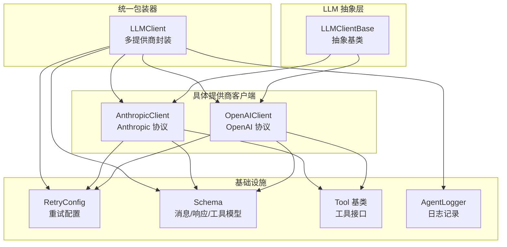
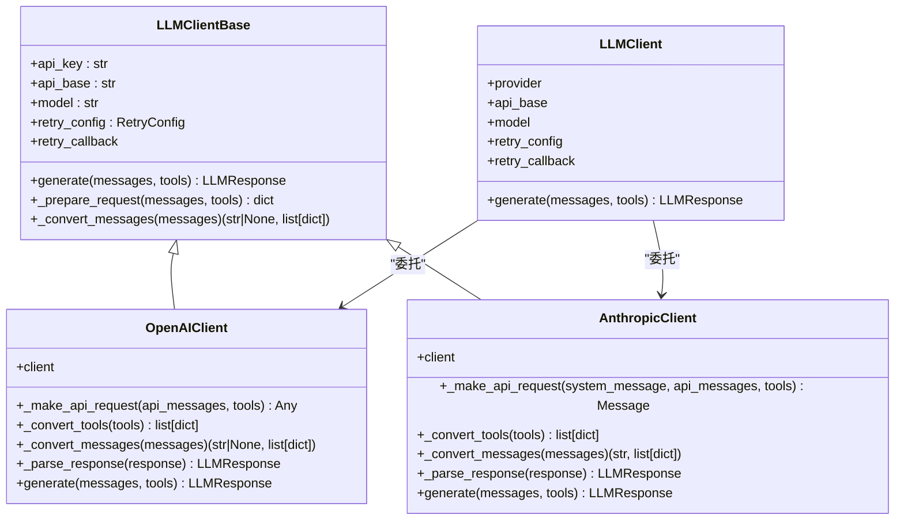
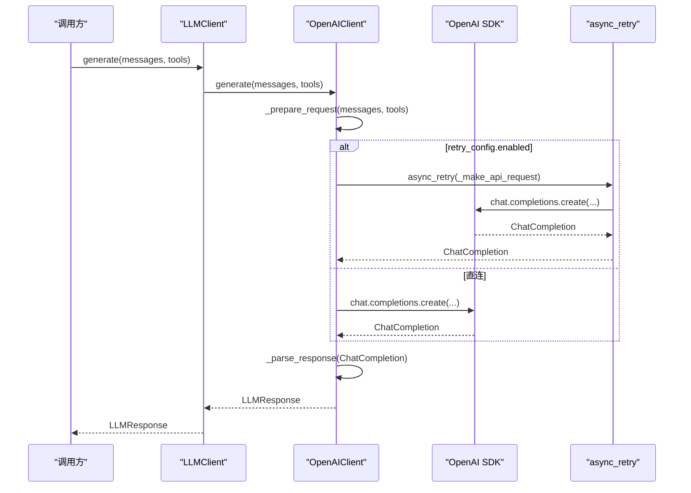
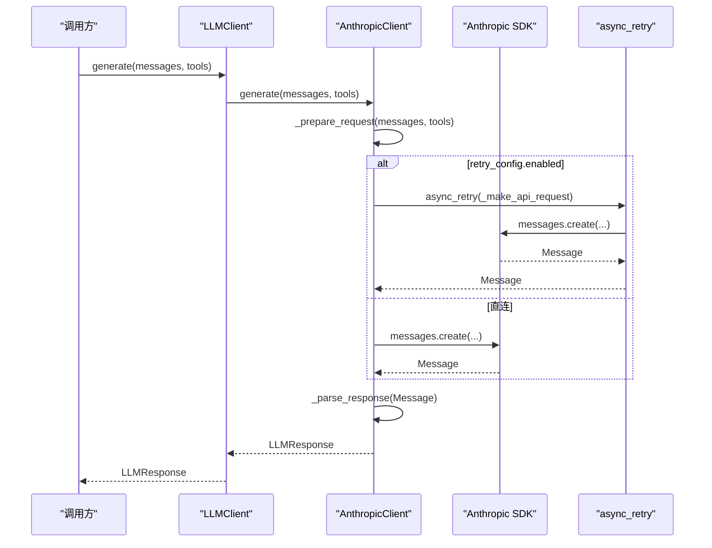
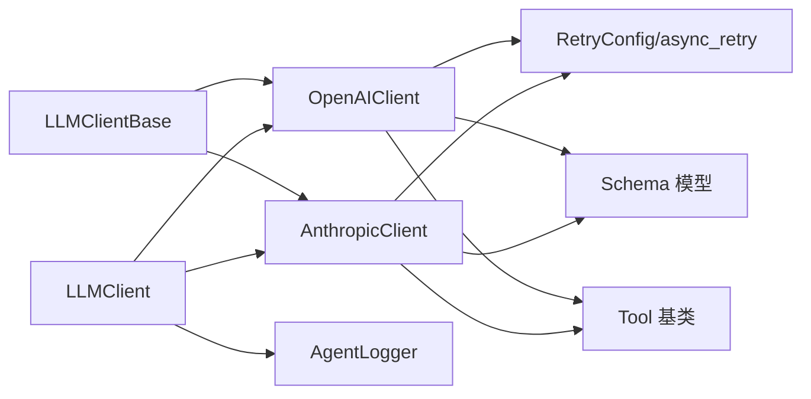

# 基础抽象类

<cite>
**本文档引用的文件**
- [mini_agent/llm/base.py](file://mini_agent/llm/base.py)
- [mini_agent/llm/openai_client.py](file://mini_agent/llm/openai_client.py)
- [mini_agent/llm/anthropic_client.py](file://mini_agent/llm/anthropic_client.py)
- [mini_agent/llm/llm_wrapper.py](file://mini_agent/llm/llm_wrapper.py)
- [mini_agent/retry.py](file://mini_agent/retry.py)
- [mini_agent/schema/schema.py](file://mini_agent/schema/schema.py)
- [mini_agent/tools/base.py](file://mini_agent/tools/base.py)
- [mini_agent/logger.py](file://mini_agent/logger.py)
- [examples/05_provider_selection.py](file://examples/05_provider_selection.py)
- [tests/test_llm_clients.py](file://tests/test_llm_clients.py)
- [mini_agent/config/config-example.yaml](file://mini_agent/config/config-example.yaml)
</cite>

## 目录
1. [简介](#简介)
2. [项目结构](#项目结构)
3. [核心组件](#核心组件)
4. [架构总览](#架构总览)
5. [详细组件分析](#详细组件分析)
6. [依赖分析](#依赖分析)
7. [性能考虑](#性能考虑)
8. [故障排查指南](#故障排查指南)
9. [结论](#结论)
10. [附录](#附录)

## 简介
本文件系统性阐述 LLM 基础抽象类 LLMClientBase 的设计理念、接口规范与实现约束，并结合 OpenAI 与 Anthropic 具体客户端实现，说明统一客户端接口如何在不同提供商之间保持一致性。文档还涵盖错误处理与重试机制、日志记录规范、自定义客户端扩展指南、与工具系统的协作关系以及最佳实践。

## 项目结构
围绕 LLM 抽象层的关键文件组织如下：
- 抽象基类：mini_agent/llm/base.py
- 具体提供商客户端：mini_agent/llm/openai_client.py、mini_agent/llm/anthropic_client.py
- 统一包装器：mini_agent/llm/llm_wrapper.py
- 数据模型与工具基类：mini_agent/schema/schema.py、mini_agent/tools/base.py
- 重试机制：mini_agent/retry.py
- 日志记录：mini_agent/logger.py
- 示例与测试：examples/05_provider_selection.py、tests/test_llm_clients.py
- 配置示例：mini_agent/config/config-example.yaml

图表来源
- [mini_agent/llm/base.py:10-85](file://mini_agent/llm/base.py#L10-L85)
- [mini_agent/llm/openai_client.py:16-296](file://mini_agent/llm/openai_client.py#L16-L296)
- [mini_agent/llm/anthropic_client.py:15-294](file://mini_agent/llm/anthropic_client.py#L15-L294)
- [mini_agent/llm/llm_wrapper.py:18-128](file://mini_agent/llm/llm_wrapper.py#L18-L128)
- [mini_agent/retry.py:23-139](file://mini_agent/retry.py#L23-L139)
- [mini_agent/schema/schema.py:7-56](file://mini_agent/schema/schema.py#L7-L56)
- [mini_agent/tools/base.py:16-56](file://mini_agent/tools/base.py#L16-L56)
- [mini_agent/logger.py:11-179](file://mini_agent/logger.py#L11-L179)

章节来源
- [mini_agent/llm/base.py:10-85](file://mini_agent/llm/base.py#L10-L85)
- [mini_agent/llm/openai_client.py:16-296](file://mini_agent/llm/openai_client.py#L16-L296)
- [mini_agent/llm/anthropic_client.py:15-294](file://mini_agent/llm/anthropic_client.py#L15-L294)
- [mini_agent/llm/llm_wrapper.py:18-128](file://mini_agent/llm/llm_wrapper.py#L18-L128)
- [mini_agent/retry.py:23-139](file://mini_agent/retry.py#L23-L139)
- [mini_agent/schema/schema.py:7-56](file://mini_agent/schema/schema.py#L7-L56)
- [mini_agent/tools/base.py:16-56](file://mini_agent/tools/base.py#L16-L56)
- [mini_agent/logger.py:11-179](file://mini_agent/logger.py#L11-L179)

## 核心组件
- LLMClientBase 抽象基类：定义统一的异步 generate 接口与三个关键抽象方法（请求准备、消息转换、内部工具转换），并提供重试配置与回调钩子。
- OpenAIClient：基于 OpenAI 协议的实现，支持 reasoning 分离、工具调用与完整 token 使用统计解析。
- AnthropicClient：基于 Anthropic 协议的实现，支持 thinking 内容与 tool_use 结构，兼容工具 schema 转换。
- LLMClient：多提供商统一包装器，根据 provider 自动选择底层客户端，负责 API 基址后缀规范化与代理转发。
- RetryConfig/async_retry：可配置指数退避重试策略，支持可插拔异常类型与回调。
- Schema 模型：Message、LLMResponse、ToolCall、FunctionCall、TokenUsage 等，确保跨提供商的数据一致性。
- 工具基类：Tool/ToolResult，提供 to_schema 与 to_openai_schema 转换，便于在不同提供商间复用工具定义。
- AgentLogger：用于记录请求、响应与工具执行过程，便于调试与审计。

章节来源
- [mini_agent/llm/base.py:10-85](file://mini_agent/llm/base.py#L10-L85)
- [mini_agent/llm/openai_client.py:16-296](file://mini_agent/llm/openai_client.py#L16-L296)
- [mini_agent/llm/anthropic_client.py:15-294](file://mini_agent/llm/anthropic_client.py#L15-L294)
- [mini_agent/llm/llm_wrapper.py:18-128](file://mini_agent/llm/llm_wrapper.py#L18-L128)
- [mini_agent/retry.py:23-139](file://mini_agent/retry.py#L23-L139)
- [mini_agent/schema/schema.py:7-56](file://mini_agent/schema/schema.py#L7-L56)
- [mini_agent/tools/base.py:16-56](file://mini_agent/tools/base.py#L16-L56)
- [mini_agent/logger.py:11-179](file://mini_agent/logger.py#L11-L179)

## 架构总览
LLMClientBase 作为统一抽象，屏蔽不同提供商协议差异；OpenAIClient 与 AnthropicClient 各自实现 _prepare_request、_convert_messages、_convert_tools 等方法；LLMClient 通过 provider 参数在运行时选择具体实现；RetryConfig 提供统一的重试策略；Schema 与 Tool 基类保证消息与工具在不同提供商间的互操作性。

图表来源
- [mini_agent/llm/base.py:10-85](file://mini_agent/llm/base.py#L10-L85)
- [mini_agent/llm/openai_client.py:16-296](file://mini_agent/llm/openai_client.py#L16-L296)
- [mini_agent/llm/anthropic_client.py:15-294](file://mini_agent/llm/anthropic_client.py#L15-L294)
- [mini_agent/llm/llm_wrapper.py:18-128](file://mini_agent/llm/llm_wrapper.py#L18-L128)

## 详细组件分析

### LLMClientBase 抽象类
- 设计理念
  - 通过抽象方法隔离协议差异，统一对外 generate 接口，确保上层业务无需关心具体提供商细节。
  - 将“消息格式转换”“请求参数准备”“工具格式转换”等职责拆分到不同抽象方法，便于子类按需覆盖。
- 接口定义
  - generate(messages: list[Message], tools: list[Any] | None = None) -> LLMResponse
  - _prepare_request(messages: list[Message], tools: list[Any] | None = None) -> dict[str, Any]
  - _convert_messages(messages: list[Message]) -> tuple[str | None, list[dict[str, Any]]]
- 实现要求与扩展点
  - 必须实现 generate 并在其中调用 _prepare_request 与提供商 SDK 请求方法，最终将返回值解析为 LLMResponse。
  - _prepare_request 返回的参数应能直接传入核心请求方法（如 OpenAI 的 chat.completions.create 或 Anthropic 的 messages.create）。
  - _convert_messages 应正确处理 system、user、assistant、tool 等角色的消息，并在必要时拆分 system 信息。
  - 可选：实现 _convert_tools 以支持工具 schema 转换或复用通用工具格式。
- 错误处理与重试
  - 通过 RetryConfig 控制是否启用重试、最大次数、初始延迟、指数倍数与可重试异常类型。
  - 支持 on_retry 回调，可在 LLMClient 层设置 retry_callback 以追踪重试状态。
- 日志记录
  - 建议在 generate 中记录请求与响应摘要，便于问题定位与审计。

章节来源
- [mini_agent/llm/base.py:10-85](file://mini_agent/llm/base.py#L10-L85)
- [mini_agent/retry.py:23-139](file://mini_agent/retry.py#L23-L139)
- [mini_agent/logger.py:43-121](file://mini_agent/logger.py#L43-L121)

### OpenAIClient 实现要点
- 请求准备与消息转换
  - _prepare_request 将内部消息转换为 OpenAI 消息数组，并保留 tools 列表。
  - _convert_messages 支持 system、user、assistant、tool 角色；assistant 可携带 reasoning_details 与 tool_calls。
- 工具转换
  - _convert_tools 支持 dict 与具备 to_openai_schema 方法的对象；若输入为 Anthropic 格式则进行转换。
- 响应解析
  - _parse_response 解析 content、thinking（reasoning_details）、tool_calls、usage，并构造 LLMResponse。
- 重试集成
  - 当 retry_config.enabled 为真时，使用 async_retry 装饰核心请求方法；否则直连 SDK。

章节来源
- [mini_agent/llm/openai_client.py:16-296](file://mini_agent/llm/openai_client.py#L16-L296)
- [mini_agent/schema/schema.py:14-56](file://mini_agent/schema/schema.py#L14-L56)
- [mini_agent/tools/base.py:46-56](file://mini_agent/tools/base.py#L46-L56)

### AnthropicClient 实现要点
- 请求准备与消息转换
  - _prepare_request 返回 system_message 与 api_messages；assistant 消息可包含 thinking 与 tool_use 块。
  - _convert_messages 将 thinking 与 tool_use 作为内容块处理，tool 结果以 user 角色的 tool_result 块形式传递。
- 工具转换
  - _convert_tools 支持 dict 与具备 to_schema 方法的对象。
- 响应解析
  - _parse_response 遍历 content 块提取 text、thinking、tool_use，并解析 usage（含缓存相关 token）。
- 重试集成
  - 同 OpenAIClient，通过 async_retry 对核心请求方法进行装饰。

章节来源
- [mini_agent/llm/anthropic_client.py:15-294](file://mini_agent/llm/anthropic_client.py#L15-L294)
- [mini_agent/schema/schema.py:14-56](file://mini_agent/schema/schema.py#L14-L56)
- [mini_agent/tools/base.py:38-56](file://mini_agent/tools/base.py#L38-L56)

### LLMClient 统一包装器
- 功能
  - 根据 provider 自动实例化 AnthropicClient 或 OpenAIClient。
  - 对 MiniMax API 域名自动追加 /anthropic 或 /v1 后缀，第三方 API 直接透传 api_base。
  - 代理 generate 调用至底层客户端，同时暴露 retry_callback 设置。
- 使用场景
  - 在不修改上层调用逻辑的情况下切换提供商。
  - 通过配置文件集中管理 api_base、provider、model 与 retry 参数。

章节来源
- [mini_agent/llm/llm_wrapper.py:18-128](file://mini_agent/llm/llm_wrapper.py#L18-L128)
- [mini_agent/config/config-example.yaml:13-26](file://mini_agent/config/config-example.yaml#L13-L26)

### 生成流程时序图（OpenAI）

图表来源
- [mini_agent/llm/llm_wrapper.py:113-128](file://mini_agent/llm/llm_wrapper.py#L113-L128)
- [mini_agent/llm/openai_client.py:261-296](file://mini_agent/llm/openai_client.py#L261-L296)
- [mini_agent/retry.py:73-139](file://mini_agent/retry.py#L73-L139)

### 生成流程时序图（Anthropic）

图表来源
- [mini_agent/llm/llm_wrapper.py:113-128](file://mini_agent/llm/llm_wrapper.py#L113-L128)
- [mini_agent/llm/anthropic_client.py:257-294](file://mini_agent/llm/anthropic_client.py#L257-L294)
- [mini_agent/retry.py:73-139](file://mini_agent/retry.py#L73-L139)

### 重试机制与异常处理
- RetryConfig
  - 支持启用/禁用、最大重试次数、初始延迟、最大延迟、指数倍数与可重试异常类型集合。
  - 提供 calculate_delay 计算指数退避延迟。
- async_retry
  - 对目标函数进行装饰，捕获指定异常类型并在达到最大重试次数前持续重试。
  - 记录警告日志并触发 on_retry 回调（可用于更新 retry_callback）。
- 异常类型
  - RetryExhaustedError：当所有重试均失败后抛出，包含最后一次异常与尝试次数。
- 日志记录
  - 重试过程中记录尝试次数、延迟时间与错误信息；建议在上层记录请求与响应摘要。

章节来源
- [mini_agent/retry.py:23-139](file://mini_agent/retry.py#L23-L139)
- [mini_agent/logger.py:119-134](file://mini_agent/logger.py#L119-L134)

### 数据模型与工具协作
- 消息与响应
  - Message：role、content、thinking、tool_calls、tool_call_id、name 等字段，支持多模态内容列表。
  - LLMResponse：content、thinking、tool_calls、finish_reason、usage。
  - TokenUsage：prompt_tokens、completion_tokens、total_tokens。
- 工具
  - Tool/ToolResult：提供 to_schema 与 to_openai_schema 转换，便于在不同提供商间复用工具定义。
  - OpenAIClient/AnthropicClient 内部工具转换方法分别处理 dict 与对象工具，必要时进行格式转换。

章节来源
- [mini_agent/schema/schema.py:7-56](file://mini_agent/schema/schema.py#L7-L56)
- [mini_agent/tools/base.py:16-56](file://mini_agent/tools/base.py#L16-L56)
- [mini_agent/llm/openai_client.py:80-112](file://mini_agent/llm/openai_client.py#L80-L112)
- [mini_agent/llm/anthropic_client.py:83-112](file://mini_agent/llm/anthropic_client.py#L83-L112)

### 自定义客户端实现指南
- 继承关系
  - 新客户端类继承 LLMClientBase，并实现以下方法：
    - generate：调用 _prepare_request 准备参数，执行提供商 SDK 请求，再调用内部解析方法生成 LLMResponse。
    - _prepare_request：将内部消息与工具转换为提供商请求参数字典。
    - _convert_messages：将内部 Message 列表转换为提供商消息数组（必要时分离 system）。
    - _convert_tools：将工具转换为提供商期望的 schema（可选，若复用通用工具则可沿用）。
- 扩展点
  - 可在 generate 中集成 async_retry 装饰核心请求方法，或在 _make_api_request 中实现幂等与重试策略。
  - 可在 _parse_response 中补充 finish_reason、usage 等字段。
- 最佳实践
  - 明确消息角色映射与特殊内容块（如 thinking、reasoning_details、tool_use）的处理。
  - 统一工具 schema 转换，减少重复适配成本。
  - 在 generate 中记录请求摘要与响应摘要，便于问题定位。

章节来源
- [mini_agent/llm/base.py:40-85](file://mini_agent/llm/base.py#L40-L85)
- [mini_agent/llm/openai_client.py:182-296](file://mini_agent/llm/openai_client.py#L182-L296)
- [mini_agent/llm/anthropic_client.py:180-294](file://mini_agent/llm/anthropic_client.py#L180-L294)

### 与具体提供商客户端的协作关系与数据流转
- LLMClient 根据 provider 选择 AnthropicClient 或 OpenAIClient。
- 两者均通过 LLMClientBase 的 generate 接口对外提供一致能力。
- 数据流从 Message 列表经 _convert_messages 转换为提供商消息数组，再经 SDK 请求返回，最后由 _parse_response 统一解析为 LLMResponse。
- 工具链路：tools 由 _convert_tools 转换为提供商 schema，随请求下发并在响应中携带 tool_calls。

章节来源
- [mini_agent/llm/llm_wrapper.py:82-101](file://mini_agent/llm/llm_wrapper.py#L82-L101)
- [mini_agent/llm/openai_client.py:114-296](file://mini_agent/llm/openai_client.py#L114-L296)
- [mini_agent/llm/anthropic_client.py:114-294](file://mini_agent/llm/anthropic_client.py#L114-L294)

## 依赖分析
- 抽象层与具体实现
  - LLMClientBase 是 OpenAIClient 与 AnthropicClient 的共同父类，二者通过覆写抽象方法实现协议适配。
- 统一包装器
  - LLMClient 通过 provider 决策底层客户端实例化，避免上层耦合。
- 基础设施
  - RetryConfig/async_retry 为所有客户端提供一致的重试策略。
  - Schema 与 Tool 基类确保消息与工具在不同提供商间的互操作性。
- 外部依赖
  - OpenAI SDK 与 Anthropic SDK 作为提供商客户端的底层依赖。

图表来源
- [mini_agent/llm/base.py:10-85](file://mini_agent/llm/base.py#L10-L85)
- [mini_agent/llm/openai_client.py:16-296](file://mini_agent/llm/openai_client.py#L16-L296)
- [mini_agent/llm/anthropic_client.py:15-294](file://mini_agent/llm/anthropic_client.py#L15-L294)
- [mini_agent/llm/llm_wrapper.py:18-128](file://mini_agent/llm/llm_wrapper.py#L18-L128)
- [mini_agent/retry.py:23-139](file://mini_agent/retry.py#L23-L139)
- [mini_agent/schema/schema.py:7-56](file://mini_agent/schema/schema.py#L7-L56)
- [mini_agent/tools/base.py:16-56](file://mini_agent/tools/base.py#L16-L56)
- [mini_agent/logger.py:11-179](file://mini_agent/logger.py#L11-L179)

章节来源
- [mini_agent/llm/base.py:10-85](file://mini_agent/llm/base.py#L10-L85)
- [mini_agent/llm/openai_client.py:16-296](file://mini_agent/llm/openai_client.py#L16-L296)
- [mini_agent/llm/anthropic_client.py:15-294](file://mini_agent/llm/anthropic_client.py#L15-L294)
- [mini_agent/llm/llm_wrapper.py:18-128](file://mini_agent/llm/llm_wrapper.py#L18-L128)
- [mini_agent/retry.py:23-139](file://mini_agent/retry.py#L23-L139)
- [mini_agent/schema/schema.py:7-56](file://mini_agent/schema/schema.py#L7-L56)
- [mini_agent/tools/base.py:16-56](file://mini_agent/tools/base.py#L16-L56)
- [mini_agent/logger.py:11-179](file://mini_agent/logger.py#L11-L179)

## 性能考虑
- 指数退避重试
  - 合理设置 initial_delay 与 exponential_base，避免频繁重试导致资源浪费。
  - 通过 max_delay 限制最大等待时间，防止长时间阻塞。
- 请求批量化与并发
  - 在上层调用中控制并发度，避免对同一提供商造成瞬时压力。
- 消息长度与上下文管理
  - 结合会话摘要与分页策略，控制消息长度，提升响应速度与稳定性。
- 工具调用优化
  - 精简工具 schema，减少不必要的参数与描述，降低模型解析负担。

## 故障排查指南
- 常见问题
  - SSL 证书验证失败：参考配置文件中的 SSL 修复建议，生产环境建议升级证书或配置代理。
  - 工具类型不支持：检查工具是否实现了 to_schema 或 to_openai_schema，或为 dict 格式。
  - 重试耗尽：关注 RetryExhaustedError，检查网络状况与提供商限流策略。
- 日志与调试
  - 使用 AgentLogger 记录请求与响应摘要，定位消息格式与工具 schema 问题。
  - 在 LLMClient 层设置 retry_callback，跟踪重试次数与异常详情。
- 测试验证
  - 通过测试用例验证简单补全、工具调用与多轮对话流程，确保消息与工具在不同提供商下行为一致。

章节来源
- [mini_agent/logger.py:43-121](file://mini_agent/logger.py#L43-L121)
- [mini_agent/retry.py:64-71](file://mini_agent/retry.py#L64-L71)
- [tests/test_llm_clients.py:25-337](file://tests/test_llm_clients.py#L25-L337)
- [examples/05_provider_selection.py:15-189](file://examples/05_provider_selection.py#L15-L189)

## 结论
LLMClientBase 通过清晰的抽象与职责分离，成功屏蔽了不同提供商协议差异，使上层业务能够以统一接口与一致数据模型进行交互。OpenAIClient 与 AnthropicClient 的实现展示了如何在各自协议下完成消息与工具的转换、请求与响应解析，并通过统一的重试机制与日志体系保障可靠性与可观测性。对于扩展新提供商，遵循 generate、_prepare_request、_convert_messages、_convert_tools 的实现约定即可快速接入。

## 附录
- 配置示例
  - 在 config-example.yaml 中配置 api_key、api_base、model 与 provider，LLMClient 将据此选择正确的后端与域名后缀。
- 示例与测试
  - 通过 examples/05_provider_selection.py 与 tests/test_llm_clients.py 验证不同提供商的行为与工具调用链路。

章节来源
- [mini_agent/config/config-example.yaml:13-26](file://mini_agent/config/config-example.yaml#L13-L26)
- [examples/05_provider_selection.py:15-189](file://examples/05_provider_selection.py#L15-L189)
- [tests/test_llm_clients.py:18-337](file://tests/test_llm_clients.py#L18-L337)