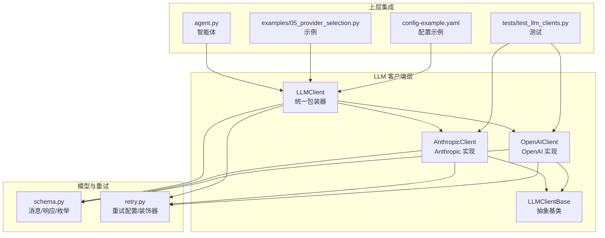
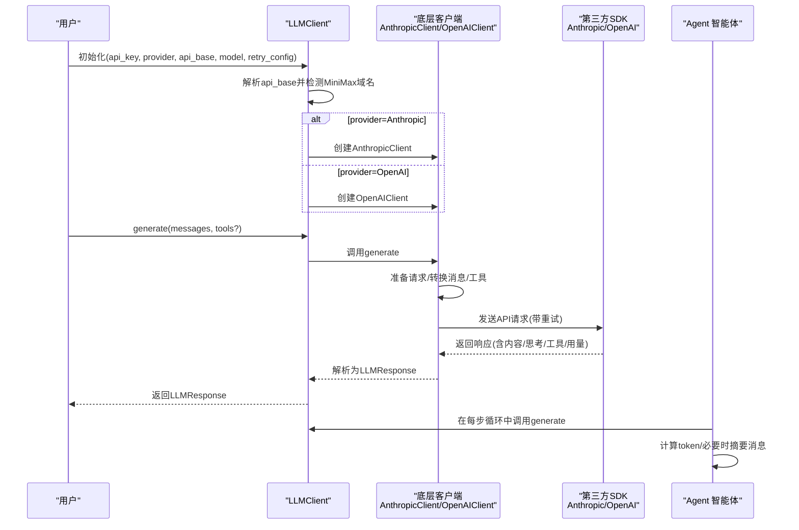
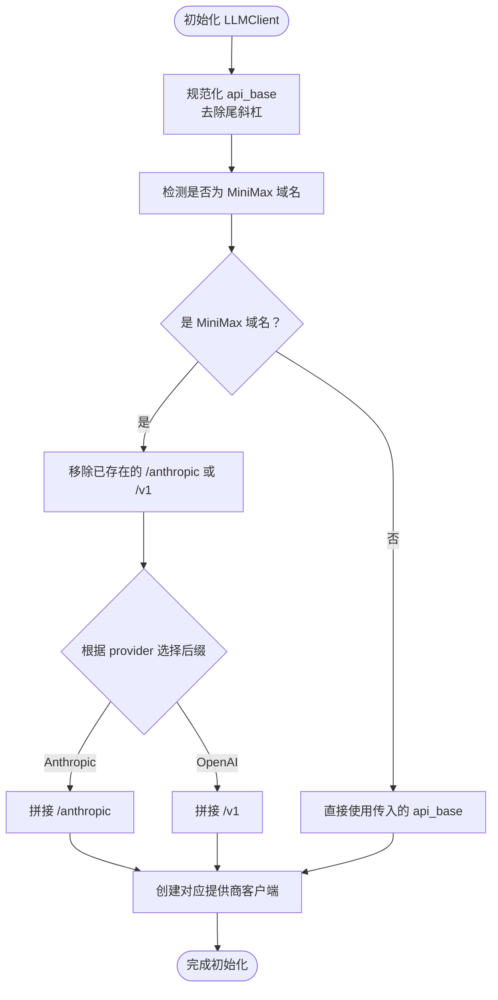
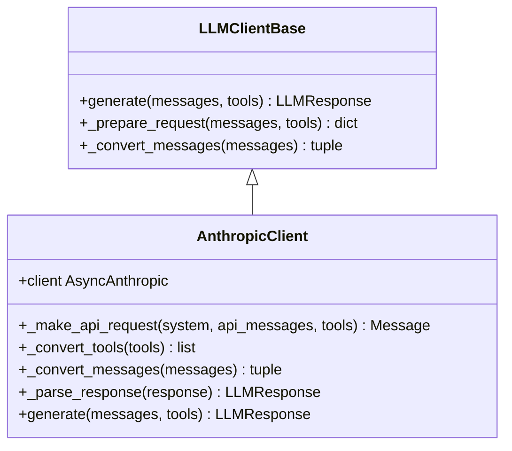
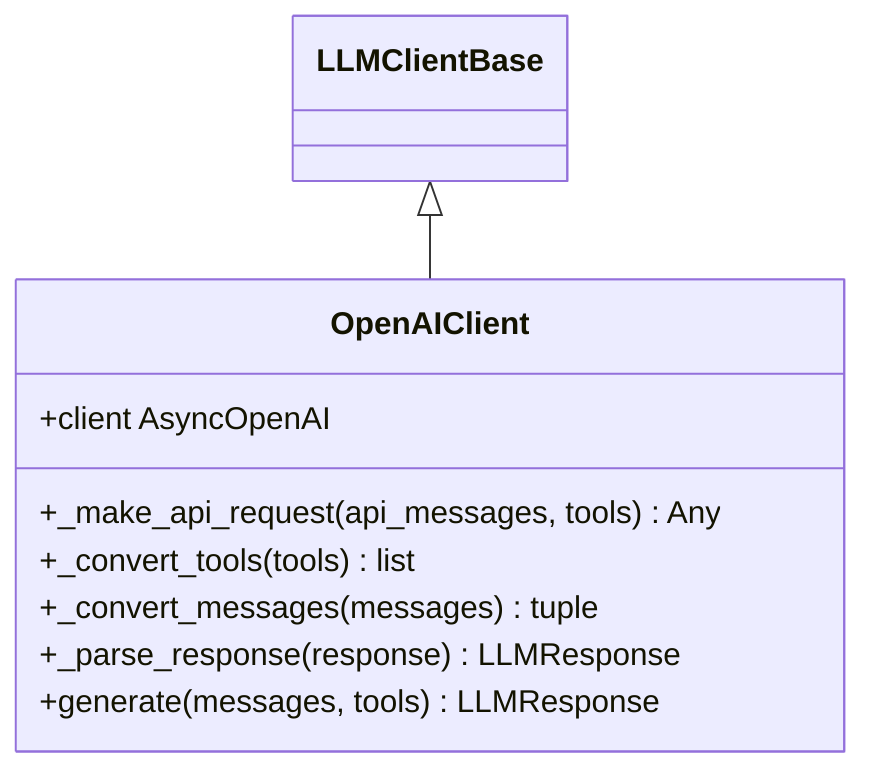
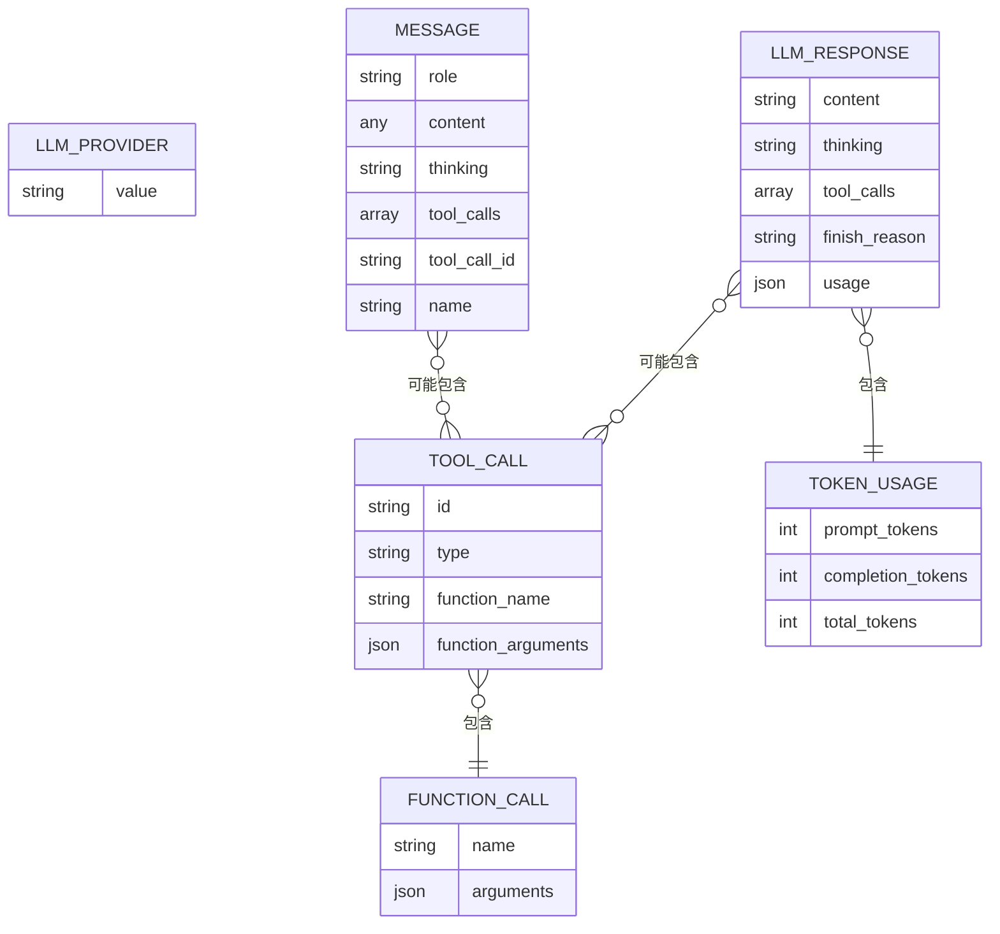
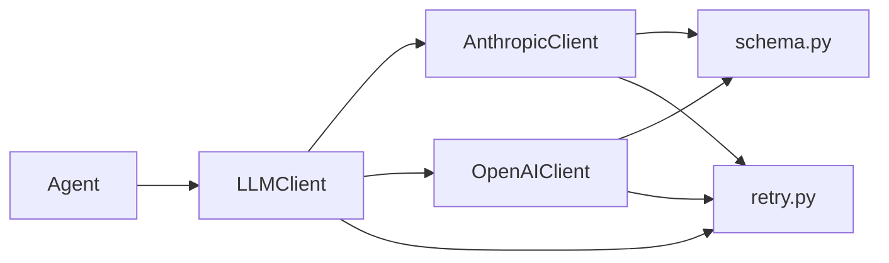
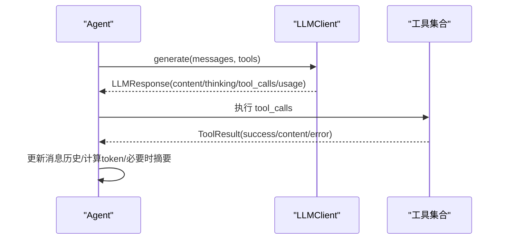

# 统一客户端包装器

<cite>
**本文引用的文件列表**
- [llm_wrapper.py](file://mini_agent/llm/llm_wrapper.py)
- [anthropic_client.py](file://mini_agent/llm/anthropic_client.py)
- [openai_client.py](file://mini_agent/llm/openai_client.py)
- [base.py](file://mini_agent/llm/base.py)
- [schema.py](file://mini_agent/schema/schema.py)
- [retry.py](file://mini_agent/retry.py)
- [agent.py](file://mini_agent/agent.py)
- [05_provider_selection.py](file://examples/05_provider_selection.py)
- [test_llm_clients.py](file://tests/test_llm_clients.py)
- [config-example.yaml](file://mini_agent/config/config-example.yaml)
</cite>

## 目录
1. [简介](#简介)
2. [项目结构](#项目结构)
3. [核心组件](#核心组件)
4. [架构总览](#架构总览)
5. [详细组件分析](#详细组件分析)
6. [依赖关系分析](#依赖关系分析)
7. [性能考量](#性能考量)
8. [故障排查指南](#故障排查指南)
9. [结论](#结论)
10. [附录](#附录)

## 简介
本文件面向“统一客户端包装器”的设计与实现，重点解释 LLMClient 类的设计理念与工厂模式实现，详述多提供商支持机制（Anthropic 与 OpenAI 的自动切换逻辑），以及 MiniMax API 的特殊处理（域名检测与端点后缀自动添加）。文档还涵盖客户端初始化流程、配置参数校验与错误处理策略，并提供具体使用示例，说明如何创建不同提供商的客户端实例。最后，文档阐述与智能体系统的集成方式与数据流转过程，并给出配置最佳实践与性能优化建议。

## 项目结构
统一客户端包装器位于 LLM 子模块中，采用“抽象基类 + 具体实现 + 包装器”的分层设计：
- 抽象基类定义统一接口，确保不同提供商实现的一致性
- 具体提供商客户端分别封装 Anthropic 与 OpenAI 的协议细节
- 包装器 LLMClient 负责根据提供商参数选择底层客户端，并对 MiniMax 域名进行特殊处理

图表来源
- [llm_wrapper.py:18-128](file://mini_agent/llm/llm_wrapper.py#L18-L128)
- [anthropic_client.py:15-294](file://mini_agent/llm/anthropic_client.py#L15-L294)
- [openai_client.py:16-296](file://mini_agent/llm/openai_client.py#L16-L296)
- [base.py:10-85](file://mini_agent/llm/base.py#L10-L85)
- [schema.py:7-56](file://mini_agent/schema/schema.py#L7-L56)
- [retry.py:23-139](file://mini_agent/retry.py#L23-L139)
- [agent.py:45-524](file://mini_agent/agent.py#L45-L524)
- [05_provider_selection.py:1-189](file://examples/05_provider_selection.py#L1-L189)
- [test_llm_clients.py:1-337](file://tests/test_llm_clients.py#L1-L337)
- [config-example.yaml:14-26](file://mini_agent/config/config-example.yaml#L14-L26)

章节来源
- [llm_wrapper.py:1-128](file://mini_agent/llm/llm_wrapper.py#L1-L128)
- [anthropic_client.py:1-294](file://mini_agent/llm/anthropic_client.py#L1-L294)
- [openai_client.py:1-296](file://mini_agent/llm/openai_client.py#L1-L296)
- [base.py:1-85](file://mini_agent/llm/base.py#L1-L85)
- [schema.py:1-56](file://mini_agent/schema/schema.py#L1-L56)
- [retry.py:1-139](file://mini_agent/retry.py#L1-L139)
- [agent.py:1-524](file://mini_agent/agent.py#L1-L524)
- [05_provider_selection.py:1-189](file://examples/05_provider_selection.py#L1-L189)
- [test_llm_clients.py:1-337](file://tests/test_llm_clients.py#L1-L337)
- [config-example.yaml:1-61](file://mini_agent/config/config-example.yaml#L1-L61)

## 核心组件
- LLMClient：统一包装器，负责根据提供商参数选择底层客户端，并对 MiniMax 域名进行后缀自动补全
- AnthropicClient：基于官方 SDK 的 Anthropic 协议实现，支持思考内容、工具调用与重试
- OpenAIClient：基于官方 SDK 的 OpenAI 协议实现，支持推理拆分、工具调用与重试
- LLMClientBase：抽象基类，定义统一接口（生成、请求准备、消息转换）
- schema 模块：定义 LLMProvider 枚举、Message、LLMResponse、TokenUsage 等数据结构
- retry 模块：提供可配置的异步重试机制（指数退避、回调、耗尽异常）

章节来源
- [llm_wrapper.py:18-128](file://mini_agent/llm/llm_wrapper.py#L18-L128)
- [anthropic_client.py:15-294](file://mini_agent/llm/anthropic_client.py#L15-L294)
- [openai_client.py:16-296](file://mini_agent/llm/openai_client.py#L16-L296)
- [base.py:10-85](file://mini_agent/llm/base.py#L10-L85)
- [schema.py:7-56](file://mini_agent/schema/schema.py#L7-L56)
- [retry.py:23-139](file://mini_agent/retry.py#L23-L139)

## 架构总览
统一客户端包装器通过工厂模式在运行时选择合适的底层客户端，同时对 MiniMax API 的域名进行特殊处理，保证端点后缀与提供商类型一致。上层智能体通过 LLMClient 发起对话与工具调用，消息历史在上下文窗口紧张时由智能体进行摘要压缩。

图表来源
- [llm_wrapper.py:36-101](file://mini_agent/llm/llm_wrapper.py#L36-L101)
- [anthropic_client.py:180-294](file://mini_agent/llm/anthropic_client.py#L180-L294)
- [openai_client.py:182-296](file://mini_agent/llm/openai_client.py#L182-L296)
- [agent.py:321-524](file://mini_agent/agent.py#L321-L524)

## 详细组件分析

### LLMClient 包装器（工厂模式与 MiniMax 特殊处理）
- 设计理念
  - 通过 provider 参数在运行时选择底层客户端，隐藏提供商差异
  - 对 MiniMax 域名进行自动识别与端点后缀补全，避免用户手动拼接错误
- 工厂模式实现
  - 根据 provider 分支创建 AnthropicClient 或 OpenAIClient
  - 对于不支持的提供商抛出明确错误
- MiniMax 特殊处理
  - 支持域名检测：api.minimax.io 与 api.minimaxi.com
  - 自动去除已有后缀（/anthropic 或 /v1），再按提供商类型追加正确后缀
  - 第三方 API（如 https://api.siliconflow.cn/v1）直接使用传入的 api_base
- 初始化流程与参数校验
  - 规范化 api_base（去除尾部斜杠）
  - 校验 provider 是否在受支持范围内
  - 将 retry_config 注入底层客户端
- 错误处理
  - 不支持的提供商类型抛出异常
  - 日志记录初始化信息，便于问题定位

图表来源
- [llm_wrapper.py:60-101](file://mini_agent/llm/llm_wrapper.py#L60-L101)

章节来源
- [llm_wrapper.py:18-128](file://mini_agent/llm/llm_wrapper.py#L18-L128)

### AnthropicClient（思考内容、工具调用、重试）
- 协议适配
  - 使用官方 SDK 异步客户端
  - 支持 system 消息、assistant 的 thinking 与 tool_use 块
- 请求准备与消息转换
  - 将内部 Message 结构转换为 Anthropic 的消息数组与 system 字段
  - 对 assistant 的 thinking 与 tool_use 进行复合内容块构建
- 工具格式转换
  - 接受 dict 或具备 to_schema 方法的对象
  - 将工具 schema 转换为 Anthropic 所需格式
- 响应解析
  - 提取文本、思考内容、工具调用与 token 使用
  - 合并缓存读取与缓存创建的输入令牌
- 重试机制
  - 可选的异步重试装饰器，支持指数退避与回调

图表来源
- [anthropic_client.py:15-294](file://mini_agent/llm/anthropic_client.py#L15-L294)
- [base.py:10-85](file://mini_agent/llm/base.py#L10-L85)

章节来源
- [anthropic_client.py:15-294](file://mini_agent/llm/anthropic_client.py#L15-L294)

### OpenAIClient（推理拆分、工具调用、重试）
- 协议适配
  - 使用官方 SDK 异步客户端
  - 通过 extra_body 开启 reasoning_split，分离思考内容
- 请求准备与消息转换
  - system 消息以独立条目形式进入消息数组
  - assistant 的 thinking 通过 reasoning_details 保留链式思维
  - tool_calls 以函数调用格式传递
- 工具格式转换
  - 接受 dict 或具备 to_openai_schema 方法的对象
  - 若为 Anthropic 格式则转换为 OpenAI function schema
- 响应解析
  - 提取文本、思考内容（reasoning_details）、工具调用与 token 使用
- 重试机制
  - 可选的异步重试装饰器，支持指数退避与回调

图表来源
- [openai_client.py:16-296](file://mini_agent/llm/openai_client.py#L16-L296)
- [base.py:10-85](file://mini_agent/llm/base.py#L10-L85)

章节来源
- [openai_client.py:16-296](file://mini_agent/llm/openai_client.py#L16-L296)

### 数据模型与重试机制
- 数据模型
  - LLMProvider：枚举值 "anthropic" 与 "openai"
  - Message：角色、内容、思考、工具调用、工具调用 ID 等
  - LLMResponse：内容、思考、工具调用、结束原因、用量统计
  - TokenUsage：提示词、补全、总计 token 数
- 重试机制
  - RetryConfig：启用开关、最大重试次数、初始延迟、最大延迟、指数基数、可重试异常类型
  - async_retry：异步重试装饰器，支持回调与耗尽异常
  - RetryExhaustedError：重试耗尽时抛出的异常

图表来源
- [schema.py:7-56](file://mini_agent/schema/schema.py#L7-L56)

章节来源
- [schema.py:1-56](file://mini_agent/schema/schema.py#L1-L56)
- [retry.py:23-139](file://mini_agent/retry.py#L23-L139)

## 依赖关系分析
- LLMClient 依赖
  - LLMProvider、LLMResponse、Message、TokenUsage（来自 schema）
  - RetryConfig（来自 retry）
  - AnthropicClient、OpenAIClient（来自同目录）
- AnthropicClient 依赖
  - anthropic SDK、RetryConfig、async_retry、Message、LLMResponse、TokenUsage、ToolCall、FunctionCall
- OpenAIClient 依赖
  - openai SDK、RetryConfig、async_retry、Message、LLMResponse、TokenUsage、ToolCall、FunctionCall
- 上层集成
  - Agent 通过 LLMClient 进行对话与工具调用，消息历史在 token 超限时进行摘要

图表来源
- [llm_wrapper.py:11-13](file://mini_agent/llm/llm_wrapper.py#L11-L13)
- [anthropic_client.py:8-10](file://mini_agent/llm/anthropic_client.py#L8-L10)
- [openai_client.py:7-11](file://mini_agent/llm/openai_client.py#L7-L11)
- [agent.py:11-14](file://mini_agent/agent.py#L11-L14)

章节来源
- [llm_wrapper.py:1-128](file://mini_agent/llm/llm_wrapper.py#L1-L128)
- [anthropic_client.py:1-294](file://mini_agent/llm/anthropic_client.py#L1-L294)
- [openai_client.py:1-296](file://mini_agent/llm/openai_client.py#L1-L296)
- [agent.py:1-524](file://mini_agent/agent.py#L1-L524)

## 性能考量
- 重试策略
  - 合理设置最大重试次数与初始延迟，避免网络抖动导致的资源浪费
  - 使用指数退避，防止雪崩效应
- MiniMax 域名处理
  - 自动补全端点后缀减少配置错误带来的失败重试
- 消息历史管理
  - 智能体侧使用本地 token 估算与 API 报告 token 双重阈值触发摘要，降低上下文开销
- 工具调用
  - 仅在需要时传递工具 schema，避免不必要的序列化成本

[本节为通用性能建议，无需特定文件来源]

## 故障排查指南
- 常见错误与定位
  - 不支持的提供商：检查 provider 是否为 "anthropic" 或 "openai"
  - MiniMax 域名后缀错误：确认 api_base 是否为 api.minimax.io 或 api.minimaxi.com，并由包装器自动补全
  - 工具类型不匹配：AnthropicClient 期望 dict 或具备 to_schema 的对象；OpenAIClient 期望 dict 或具备 to_openai_schema 的对象
  - 重试耗尽：查看 RetryExhaustedError 的最后一次异常与尝试次数
- 日志与调试
  - 包装器初始化会输出提供商与最终 api_base，便于核对
  - 重试装饰器会在每次重试前记录警告日志
- 测试与示例
  - 使用示例脚本与测试用例验证 Anthropic 与 OpenAI 的简单补全、工具调用与多轮对话

章节来源
- [llm_wrapper.py:98-101](file://mini_agent/llm/llm_wrapper.py#L98-L101)
- [anthropic_client.py:104-112](file://mini_agent/llm/anthropic_client.py#L104-L112)
- [openai_client.py:89-112](file://mini_agent/llm/openai_client.py#L89-L112)
- [retry.py:64-139](file://mini_agent/retry.py#L64-L139)
- [05_provider_selection.py:1-189](file://examples/05_provider_selection.py#L1-L189)
- [test_llm_clients.py:1-337](file://tests/test_llm_clients.py#L1-L337)

## 结论
统一客户端包装器通过工厂模式实现了对 Anthropic 与 OpenAI 的无缝切换，并针对 MiniMax API 提供了域名检测与端点后缀自动补全，显著降低了配置复杂度与出错概率。结合可配置的异步重试机制与清晰的数据模型，该设计既保证了扩展性，又提升了稳定性。与智能体系统的集成路径清晰，消息历史与 token 管理策略有效缓解了长对话的上下文压力。

[本节为总结性内容，无需特定文件来源]

## 附录

### 使用示例与最佳实践
- 示例脚本展示了如何创建不同提供商的客户端实例，并进行简单问答与比较
- 配置文件提供了 MiniMax API 的基础配置项，包括 api_key、api_base、model 与 provider
- 最佳实践
  - 优先使用包装器 LLMClient，避免直接实例化底层客户端
  - 对于 MiniMax API，保持 api_base 为域名即可，由包装器自动补全后缀
  - 根据网络环境选择 api.minimax.io（全球）或 api.minimaxi.com（中国）
  - 合理配置重试参数，平衡成功率与资源消耗

章节来源
- [05_provider_selection.py:15-189](file://examples/05_provider_selection.py#L15-L189)
- [config-example.yaml:14-26](file://mini_agent/config/config-example.yaml#L14-L26)

### 与智能体系统的集成与数据流
- Agent 在每一步循环中调用 LLMClient.generate 获取响应
- 响应中的 thinking 与 tool_calls 会被记录到消息历史
- 当 token 超限时，Agent 会进行摘要生成，减少上下文长度
- 工具执行结果以 tool 角色消息回写至历史，形成完整的多轮对话与工具调用闭环

图表来源
- [agent.py:321-524](file://mini_agent/agent.py#L321-L524)
- [llm_wrapper.py:113-128](file://mini_agent/llm/llm_wrapper.py#L113-L128)