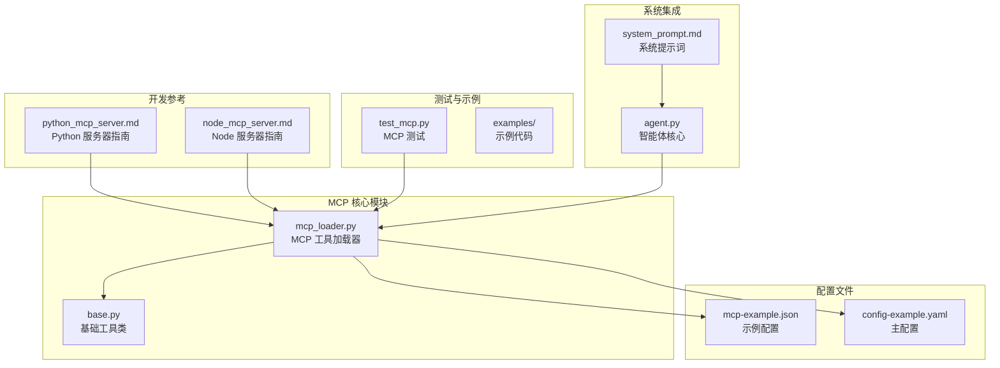
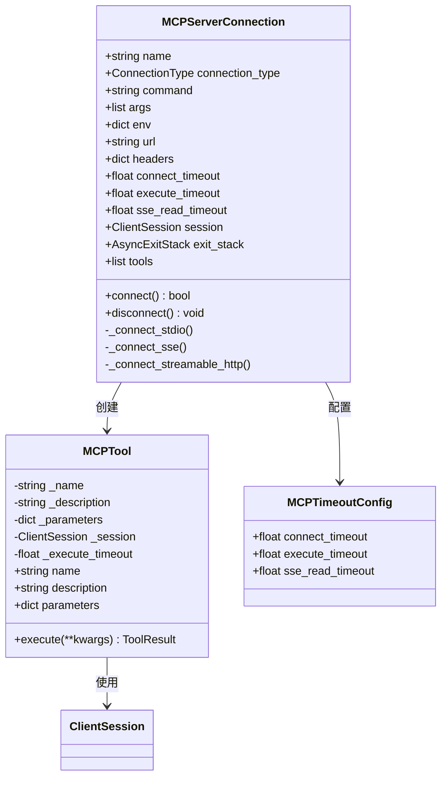
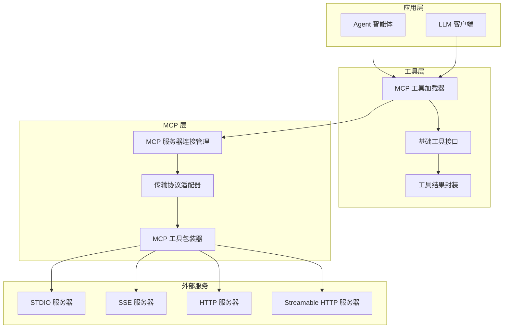
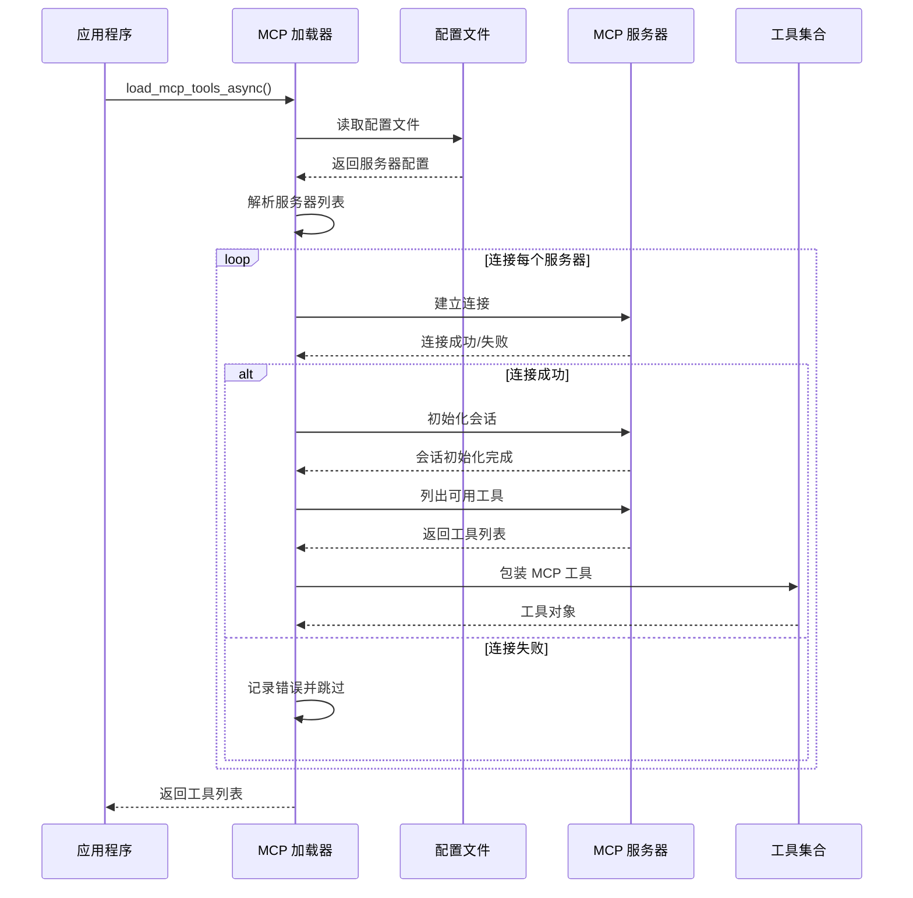
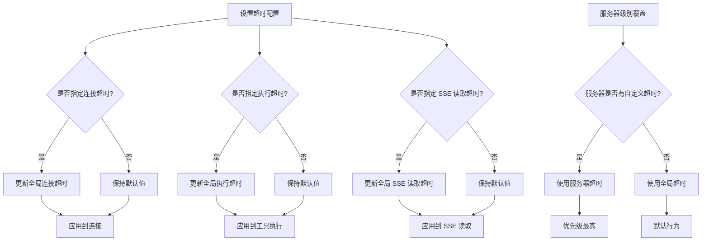
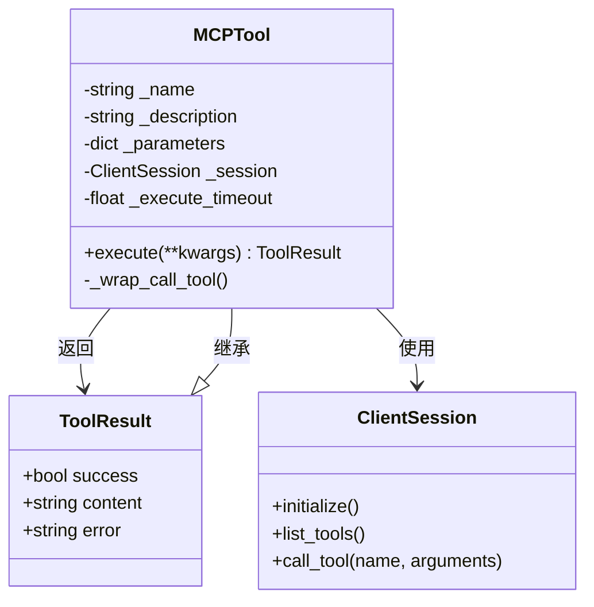
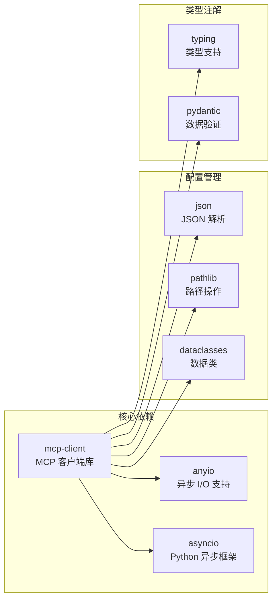
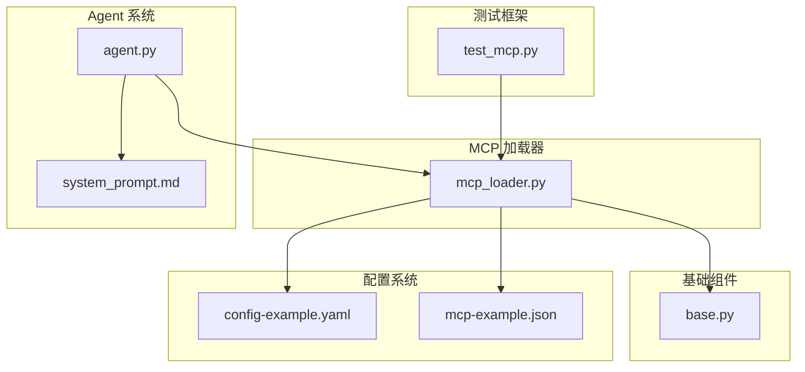
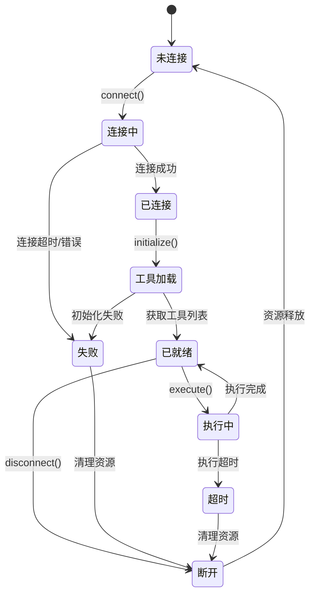

# MCP 工具集成

<cite>
**本文档引用的文件**
- [mcp_loader.py](file://mini_agent/tools/mcp_loader.py)
- [mcp-example.json](file://mini_agent/config/mcp-example.json)
- [python_mcp_server.md](file://mini_agent/skills/mcp-builder/reference/python_mcp_server.md)
- [node_mcp_server.md](file://mini_agent/skills/mcp-builder/reference/node_mcp_server.md)
- [test_mcp.py](file://tests/test_mcp.py)
- [config-example.yaml](file://mini_agent/config/config-example.yaml)
- [base.py](file://mini_agent/tools/base.py)
- [system_prompt.md](file://mini_agent/config/system_prompt.md)
- [agent.py](file://mini_agent/agent.py)
</cite>

## 目录
1. [简介](#简介)
2. [项目结构](#项目结构)
3. [核心组件](#核心组件)
4. [架构概览](#架构概览)
5. [详细组件分析](#详细组件分析)
6. [依赖关系分析](#依赖关系分析)
7. [性能考虑](#性能考虑)
8. [故障排除指南](#故障排除指南)
9. [结论](#结论)
10. [附录](#附录)

## 简介

MCP（Model Context Protocol）是一个开放协议，旨在为大语言模型（LLM）与其工具生态系统之间提供标准化的通信接口。在 MiniAgent 项目中，MCP 工具集成提供了强大的扩展能力，允许用户通过标准协议访问各种外部工具和服务。

本项目实现了完整的 MCP 客户端功能，支持多种传输方式（STDIO、SSE、HTTP、Streamable HTTP），并提供了完善的工具加载、连接管理和错误处理机制。

## 项目结构

MiniAgent 项目中的 MCP 集成主要分布在以下目录和文件中：



**图表来源**
- [mcp_loader.py:1-434](file://mini_agent/tools/mcp_loader.py#L1-L434)
- [mcp-example.json:1-29](file://mini_agent/config/mcp-example.json#L1-L29)
- [python_mcp_server.md:1-752](file://mini_agent/skills/mcp-builder/reference/python_mcp_server.md#L1-L752)

**章节来源**
- [mcp_loader.py:1-434](file://mini_agent/tools/mcp_loader.py#L1-L434)
- [config-example.yaml:1-61](file://mini_agent/config/config-example.yaml#L1-L61)

## 核心组件

### MCP 工具加载器

MCP 工具加载器是整个 MCP 集成的核心组件，负责管理 MCP 服务器连接、工具发现和执行。

#### 主要功能特性

1. **多传输协议支持**：支持 STDIO、SSE、HTTP 和 Streamable HTTP 四种传输方式
2. **自动配置检测**：智能识别服务器类型和配置参数
3. **超时管理**：提供全局和服务器级别的超时配置
4. **工具包装**：将 MCP 工具转换为统一的工具接口

#### 关键数据结构



**图表来源**
- [mcp_loader.py:60-282](file://mini_agent/tools/mcp_loader.py#L60-L282)

**章节来源**
- [mcp_loader.py:60-282](file://mini_agent/tools/mcp_loader.py#L60-L282)

### 基础工具接口

所有 MCP 工具都遵循统一的工具接口规范，确保与 Agent 系统的无缝集成。

#### 工具接口规范

| 属性 | 类型 | 描述 |
|------|------|------|
| name | string | 工具名称，用于标识和调用 |
| description | string | 工具功能描述，用于 LLM 理解 |
| parameters | dict | JSON Schema 格式的参数定义 |
| execute | function | 异步执行函数，返回 ToolResult |

**章节来源**
- [base.py:8-56](file://mini_agent/tools/base.py#L8-L56)

## 架构概览

MiniAgent 的 MCP 集成采用分层架构设计，确保了良好的可扩展性和维护性。



**图表来源**
- [mcp_loader.py:1-434](file://mini_agent/tools/mcp_loader.py#L1-L434)
- [agent.py:45-200](file://mini_agent/agent.py#L45-L200)

## 详细组件分析

### MCP 工具加载流程

MCP 工具的加载过程遵循严格的步骤顺序，确保系统的稳定性和可靠性。



**图表来源**
- [mcp_loader.py:330-426](file://mini_agent/tools/mcp_loader.py#L330-L426)

#### 连接类型检测机制

系统支持自动检测和手动指定的连接类型，确保兼容性：

| 连接类型 | 自动检测条件 | 手动指定 | 适用场景 |
|----------|-------------|----------|----------|
| stdio | 无 URL 字段且有 command 字段 | `"type": "stdio"` | 本地命令行工具 |
| sse | 有 URL 且 type 为 "sse" | `"type": "sse"` | 实时更新服务 |
| http | 有 URL 且 type 为 "http" | `"type": "http"` | 标准 HTTP API |
| streamable_http | 有 URL 且 type 为 "streamable_http" | `"type": "streamable_http"` | 流式 HTTP 服务 |

**章节来源**
- [mcp_loader.py:288-296](file://mini_agent/tools/mcp_loader.py#L288-L296)

### 超时配置管理

系统提供了灵活的超时配置机制，支持全局和服务器级别的超时设置。



**图表来源**
- [mcp_loader.py:21-57](file://mini_agent/tools/mcp_loader.py#L21-L57)

#### 默认超时值

| 超时类型 | 默认值 | 单位 | 用途 |
|----------|--------|------|------|
| connect_timeout | 10.0 | 秒 | 连接建立超时 |
| execute_timeout | 60.0 | 秒 | 工具执行超时 |
| sse_read_timeout | 120.0 | 秒 | SSE 读取超时 |

**章节来源**
- [mcp_loader.py:21-57](file://mini_agent/tools/mcp_loader.py#L21-L57)

### MCP 工具包装机制

每个 MCP 工具都会被包装为统一的工具接口，确保与 Agent 系统的一致性。



**图表来源**
- [mcp_loader.py:89-120](file://mini_agent/tools/mcp_loader.py#L89-L120)
- [base.py:8-14](file://mini_agent/tools/base.py#L8-L14)

**章节来源**
- [mcp_loader.py:89-120](file://mini_agent/tools/mcp_loader.py#L89-L120)

## 依赖关系分析

### 外部依赖

MCP 集成依赖于以下关键外部库：



**图表来源**
- [mcp_loader.py:1-16](file://mini_agent/tools/mcp_loader.py#L1-L16)

### 内部依赖关系



**图表来源**
- [mcp_loader.py:1-16](file://mini_agent/tools/mcp_loader.py#L1-L16)
- [agent.py:1-200](file://mini_agent/agent.py#L1-L200)

**章节来源**
- [mcp_loader.py:1-16](file://mini_agent/tools/mcp_loader.py#L1-L16)

## 性能考虑

### 连接池管理

系统采用了高效的连接管理策略，避免资源泄漏和连接耗尽问题。

#### 连接生命周期



**图表来源**
- [mcp_loader.py:171-232](file://mini_agent/tools/mcp_loader.py#L171-L232)

### 资源清理机制

系统实现了完善的资源清理机制，确保在异常情况下也能正确释放资源。

#### 清理流程

1. **异常安全关闭**：使用 AsyncExitStack 确保资源按正确顺序释放
2. **超时保护**：防止长时间阻塞导致的资源泄漏
3. **重试机制**：在网络不稳定时提供合理的重试策略

**章节来源**
- [mcp_loader.py:269-282](file://mini_agent/tools/mcp_loader.py#L269-L282)

## 故障排除指南

### 常见连接问题

#### 连接超时问题

**症状**：MCP 服务器连接超时，日志显示连接超时错误

**可能原因**：
1. 网络连接不稳定或防火墙阻止
2. 服务器地址配置错误
3. 服务器负载过高
4. 超时时间设置过短

**解决方案**：
1. 检查网络连接和服务器可达性
2. 验证服务器配置的 URL 和端口
3. 增加连接超时时间配置
4. 检查服务器状态和资源使用情况

#### 认证失败问题

**症状**：连接成功但工具调用返回认证错误

**可能原因**：
1. API 密钥配置错误
2. 环境变量未正确设置
3. 服务器端认证配置问题

**解决方案**：
1. 验证 API 密钥的有效性
2. 检查环境变量配置
3. 确认服务器端的认证设置
4. 查看服务器日志获取详细错误信息

#### 工具执行失败

**症状**：连接成功但工具执行返回错误

**可能原因**：
1. 工具参数格式不正确
2. 服务器端业务逻辑错误
3. 网络中断导致请求失败

**解决方案**：
1. 检查工具参数的 JSON Schema
2. 验证服务器端的业务逻辑
3. 实现重试机制和错误恢复
4. 记录详细的错误日志

### 配置问题诊断

#### 配置文件格式错误

**症状**：MCP 配置文件无法解析或加载

**诊断步骤**：
1. 验证 JSON 格式正确性
2. 检查必需字段是否存在
3. 确认字段类型和值范围
4. 验证服务器配置的逻辑一致性

**修复建议**：
1. 使用 JSON 验证工具检查格式
2. 参考示例配置文件进行对比
3. 逐步注释配置项定位问题
4. 确保所有必需字段都有有效值

#### 服务器不可达问题

**症状**：MCP 服务器无法访问或响应缓慢

**诊断方法**：
1. 使用网络工具测试服务器连通性
2. 检查服务器端口和防火墙设置
3. 验证 DNS 解析和路由配置
4. 监控网络延迟和丢包率

**解决策略**：
1. 配置代理或 VPN 连接
2. 调整网络路由和 DNS 设置
3. 实现连接池和负载均衡
4. 设置合理的重试和退避策略

**章节来源**
- [test_mcp.py:492-523](file://tests/test_mcp.py#L492-L523)
- [test_mcp.py:526-559](file://tests/test_mcp.py#L526-L559)

## 结论

MiniAgent 的 MCP 工具集成为大语言模型提供了强大而灵活的工具扩展能力。通过标准化的协议接口和完善的错误处理机制，系统能够稳定地集成各种外部工具和服务。

### 主要优势

1. **协议标准化**：基于 MCP 协议，确保与其他 MCP 兼容系统的互操作性
2. **多传输支持**：支持多种传输方式，适应不同的部署场景
3. **配置灵活**：提供丰富的配置选项，满足不同需求
4. **错误处理完善**：实现全面的错误检测和恢复机制
5. **性能优化**：采用异步编程和连接池管理，提升系统性能

### 发展方向

1. **增强监控**：添加更详细的性能指标和健康检查
2. **扩展协议**：支持更多 MCP 协议特性和扩展
3. **自动化管理**：实现 MCP 服务器的自动发现和管理
4. **安全增强**：加强认证和授权机制
5. **文档完善**：提供更多使用示例和最佳实践

## 附录

### MCP 配置示例

#### 基本 STDIO 配置

```json
{
  "mcpServers": {
    "my_server": {
      "description": "我的 MCP 服务器",
      "type": "stdio",
      "command": "npx",
      "args": ["-y", "@my-org/my-mcp-server"],
      "env": {
        "API_KEY": "your-api-key"
      },
      "disabled": false
    }
  }
}
```

#### URL 基础配置

```json
{
  "mcpServers": {
    "web_search": {
      "description": "Web 搜索服务",
      "url": "https://api.example.com/mcp",
      "type": "streamable_http",
      "headers": {
        "Authorization": "Bearer your-token"
      },
      "connect_timeout": 15.0,
      "execute_timeout": 120.0
    }
  }
}
```

### MCP 服务器开发指南

#### Python MCP 服务器

参考 [python_mcp_server.md](file://mini_agent/skills/mcp-builder/reference/python_mcp_server.md) 获取完整的 Python MCP 服务器开发指南，包括：

- FastMCP 框架使用
- 工具注册模式
- 输入验证和错误处理
- 多种输出格式支持
- 分页实现和字符限制

#### Node.js MCP 服务器

参考 [node_mcp_server.md](file://mini_agent/skills/mcp-builder/reference/node_mcp_server.md) 获取完整的 Node.js MCP 服务器开发指南，包括：

- TypeScript SDK 使用
- Zod 模式验证
- 项目结构和最佳实践
- 资源注册和传输选择
- 完整的示例实现

### 高级配置选项

#### 全局超时配置

在主配置文件中可以设置全局超时参数：

```yaml
mcp:
  connect_timeout: 10.0    # 连接超时（秒）
  execute_timeout: 60.0    # 执行超时（秒）
  sse_read_timeout: 120.0  # SSE 读取超时（秒）
```

#### 服务器特定配置

每个 MCP 服务器可以有自己的超时配置：

```json
{
  "mcpServers": {
    "slow_server": {
      "url": "https://slow.example.com/mcp",
      "connect_timeout": 30.0,
      "execute_timeout": 180.0,
      "sse_read_timeout": 300.0
    }
  }
}
```

**章节来源**
- [config-example.yaml:56-61](file://mini_agent/config/config-example.yaml#L56-L61)
- [mcp-example.json:1-29](file://mini_agent/config/mcp-example.json#L1-L29)