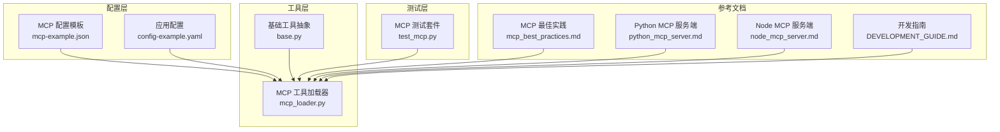
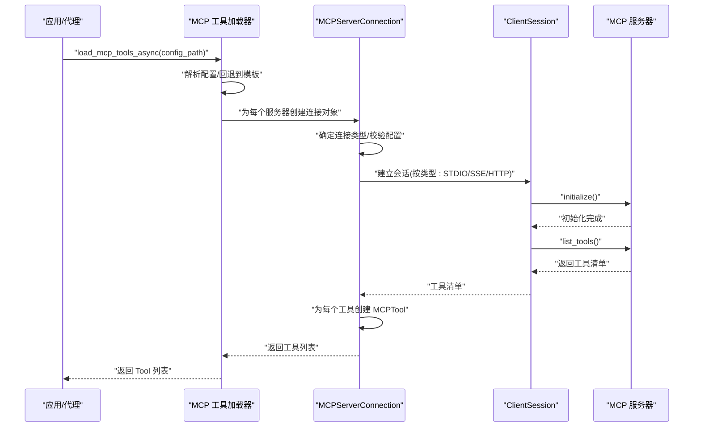
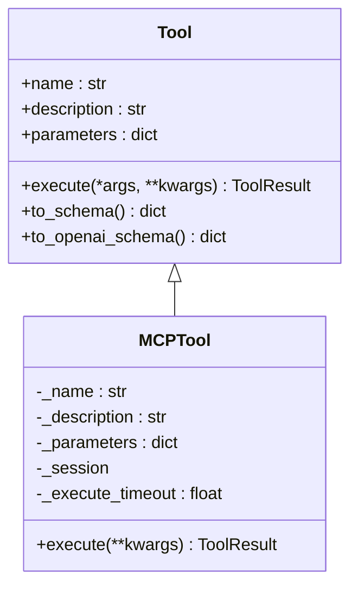
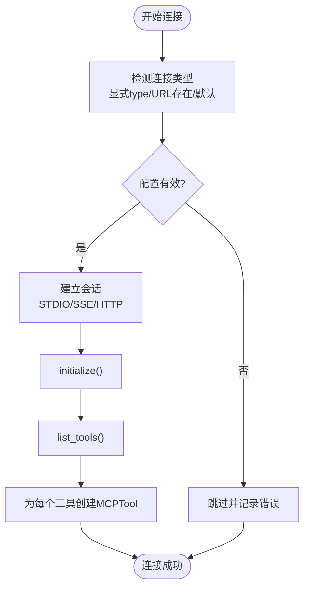
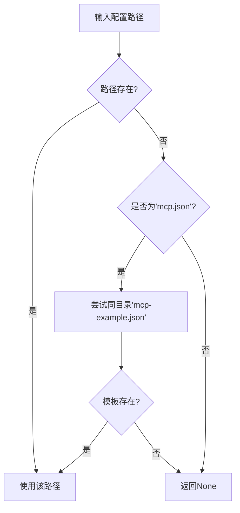
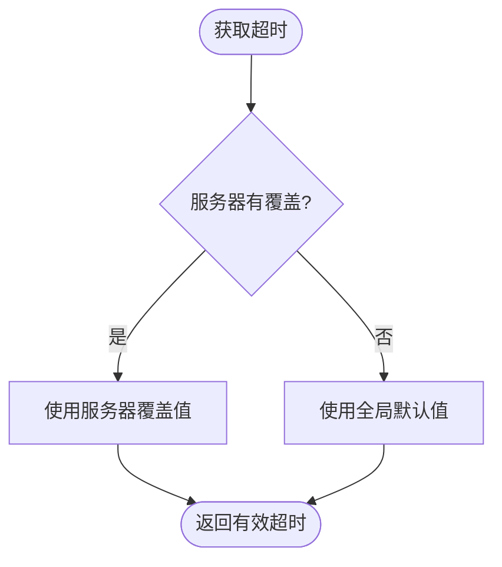
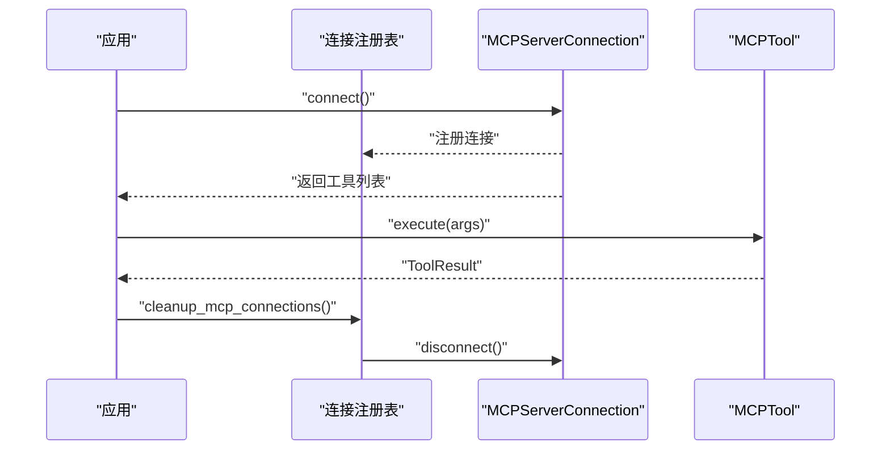
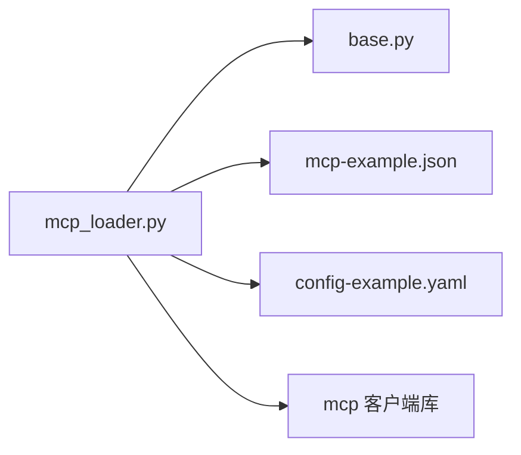
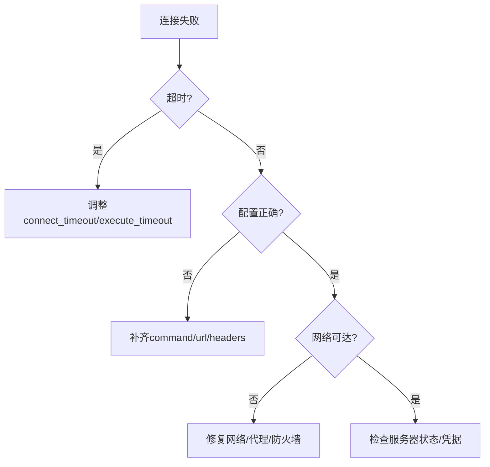

# MCP 工具加载器

<cite>
**本文档引用的文件**
- [mcp_loader.py](file://mini_agent/tools/mcp_loader.py)
- [base.py](file://mini_agent/tools/base.py)
- [mcp-example.json](file://mini_agent/config/mcp-example.json)
- [config-example.yaml](file://mini_agent/config/config-example.yaml)
- [test_mcp.py](file://tests/test_mcp.py)
- [mcp_best_practices.md](file://mini_agent/skills/mcp-builder/reference/mcp_best_practices.md)
- [python_mcp_server.md](file://mini_agent/skills/mcp-builder/reference/python_mcp_server.md)
- [node_mcp_server.md](file://mini_agent/skills/mcp-builder/reference/node_mcp_server.md)
- [DEVELOPMENT_GUIDE.md](file://docs/DEVELOPMENT_GUIDE.md)
- [agent.py](file://mini_agent/agent.py)
</cite>

## 目录
1. [简介](#简介)
2. [项目结构](#项目结构)
3. [核心组件](#核心组件)
4. [架构总览](#架构总览)
5. [详细组件分析](#详细组件分析)
6. [依赖关系分析](#依赖关系分析)
7. [性能考虑](#性能考虑)
8. [故障排除指南](#故障排除指南)
9. [结论](#结论)
10. [附录](#附录)

## 简介
本文件系统性阐述 MiniAgent 中的 MCP（Model Context Protocol）工具加载器的设计与实现，涵盖 MCP 协议支持、服务器发现与连接机制（本地 STDIO 与远程 HTTP/SSE）、工具清单获取、参数验证与调用路由、动态注册与生命周期管理、配置与认证、统一接口设计与性能优化、实际使用案例与故障排除，以及扩展性与自定义工具开发流程。文档面向不同技术背景的读者，既提供高层概览也包含代码级细节与可视化图示。

## 项目结构
MCP 工具加载器位于工具模块中，配合基础工具抽象、配置文件与测试用例共同构成完整的 MCP 集成体系：
- 工具层：MCP 工具包装类与通用工具基类
- 配置层：mcp.json（服务器配置）与 config.yaml（全局配置）
- 测试层：针对连接类型检测、超时控制、Git MCP 加载等场景的测试
- 参考文档：MCP 最佳实践、Python/Node MCP 服务端开发指南

**图表来源**
- [mcp_loader.py:1-434](file://mini_agent/tools/mcp_loader.py#L1-L434)
- [base.py:1-56](file://mini_agent/tools/base.py#L1-L56)
- [mcp-example.json:1-29](file://mini_agent/config/mcp-example.json#L1-L29)
- [config-example.yaml:1-61](file://mini_agent/config/config-example.yaml#L1-L61)
- [test_mcp.py:1-580](file://tests/test_mcp.py#L1-L580)
- [mcp_best_practices.md:1-916](file://mini_agent/skills/mcp-builder/reference/mcp_best_practices.md#L1-L916)
- [python_mcp_server.md:500-720](file://mini_agent/skills/mcp-builder/reference/python_mcp_server.md#L500-L720)
- [node_mcp_server.md:577-778](file://mini_agent/skills/mcp-builder/reference/node_mcp_server.md#L577-L778)
- [DEVELOPMENT_GUIDE.md:201-224](file://docs/DEVELOPMENT_GUIDE.md#L201-L224)

**章节来源**
- [mcp_loader.py:1-434](file://mini_agent/tools/mcp_loader.py#L1-L434)
- [base.py:1-56](file://mini_agent/tools/base.py#L1-L56)
- [mcp-example.json:1-29](file://mini_agent/config/mcp-example.json#L1-L29)
- [config-example.yaml:1-61](file://mini_agent/config/config-example.yaml#L1-L61)
- [test_mcp.py:1-580](file://tests/test_mcp.py#L1-L580)
- [mcp_best_practices.md:1-916](file://mini_agent/skills/mcp-builder/reference/mcp_best_practices.md#L1-L916)
- [python_mcp_server.md:500-720](file://mini_agent/skills/mcp-builder/reference/python_mcp_server.md#L500-L720)
- [node_mcp_server.md:577-778](file://mini_agent/skills/mcp-builder/reference/node_mcp_server.md#L577-L778)
- [DEVELOPMENT_GUIDE.md:201-224](file://docs/DEVELOPMENT_GUIDE.md#L201-L224)

## 核心组件
- MCPTool：对 MCP 工具进行封装，提供统一的异步执行接口，并内置执行超时保护与错误处理。
- MCPServerConnection：负责单个 MCP 服务器的连接管理（STDIO、SSE、HTTP、Streamable HTTP），自动发现工具清单并为每个工具创建 MCPTool 实例。
- 全局连接注册表：维护已建立的连接，便于统一清理。
- 配置解析与路径回退：优先读取用户配置，若缺失则回退到模板配置；支持每服务器超时覆盖。
- 超时配置：全局默认超时与按服务器覆盖的超时设置，确保网络异常时快速失败。

**章节来源**
- [mcp_loader.py:60-120](file://mini_agent/tools/mcp_loader.py#L60-L120)
- [mcp_loader.py:122-282](file://mini_agent/tools/mcp_loader.py#L122-L282)
- [mcp_loader.py:284-327](file://mini_agent/tools/mcp_loader.py#L284-L327)
- [mcp_loader.py:330-426](file://mini_agent/tools/mcp_loader.py#L330-L426)

## 架构总览
MCP 工具加载器通过配置驱动，自动识别连接类型并建立会话，随后拉取工具清单并动态包装为统一的 Tool 接口实例，供代理或上层系统直接调用。

**图表来源**
- [mcp_loader.py:330-426](file://mini_agent/tools/mcp_loader.py#L330-L426)
- [mcp_loader.py:171-232](file://mini_agent/tools/mcp_loader.py#L171-L232)
- [mcp_loader.py:194-208](file://mini_agent/tools/mcp_loader.py#L194-L208)

## 详细组件分析

### 组件一：MCPTool（工具封装与执行）
- 角色：将 MCP 工具调用包装为统一的 Tool 接口，支持超时保护与错误归一化。
- 关键点：
  - 执行超时：基于构造函数或全局配置的执行超时。
  - 结果处理：遍历内容项，拼接文本；根据 isError 字段判定成功与否。
  - 错误处理：捕获超时与异常，返回标准化 ToolResult。

**图表来源**
- [base.py:16-56](file://mini_agent/tools/base.py#L16-L56)
- [mcp_loader.py:60-120](file://mini_agent/tools/mcp_loader.py#L60-L120)

**章节来源**
- [mcp_loader.py:60-120](file://mini_agent/tools/mcp_loader.py#L60-L120)
- [base.py:16-56](file://mini_agent/tools/base.py#L16-L56)

### 组件二：MCPServerConnection（服务器连接与工具发现）
- 角色：管理单个 MCP 服务器的连接生命周期，自动发现工具并生成 MCPTool。
- 连接类型与参数：
  - STDIO：命令、参数、环境变量。
  - SSE/HTTP/Streamable HTTP：URL、请求头、超时参数。
- 自动检测与校验：
  - 未显式指定类型时，URL 存在默认为 streamable_http，否则 stdio。
  - 校验必要字段（STDIO 需 command，URL 类型需 url）。
- 工具发现与包装：
  - initialize 后 list_tools 获取工具清单。
  - 为每个工具创建 MCPTool 并注入执行超时。

**图表来源**
- [mcp_loader.py:122-232](file://mini_agent/tools/mcp_loader.py#L122-L232)
- [mcp_loader.py:194-208](file://mini_agent/tools/mcp_loader.py#L194-L208)
- [mcp_loader.py:288-296](file://mini_agent/tools/mcp_loader.py#L288-L296)

**章节来源**
- [mcp_loader.py:122-232](file://mini_agent/tools/mcp_loader.py#L122-L232)
- [mcp_loader.py:288-296](file://mini_agent/tools/mcp_loader.py#L288-L296)
- [mcp_loader.py:194-208](file://mini_agent/tools/mcp_loader.py#L194-L208)

### 组件三：配置解析与路径回退
- 优先级：
  - 指定路径存在则直接使用。
  - 若查找 mcp.json 且不存在，则尝试同目录下的 mcp-example.json。
- 返回值：未找到配置时返回空列表，避免中断主流程。

**图表来源**
- [mcp_loader.py:299-327](file://mini_agent/tools/mcp_loader.py#L299-L327)

**章节来源**
- [mcp_loader.py:299-327](file://mini_agent/tools/mcp_loader.py#L299-L327)
- [mcp-example.json:1-29](file://mini_agent/config/mcp-example.json#L1-L29)

### 组件四：超时配置与覆盖
- 全局默认超时：连接、执行、SSE 读取。
- 每服务器覆盖：可在 mcp.json 的服务器条目中单独设置超时。
- 作用域选择：连接超时用于建立会话阶段，执行超时用于工具调用阶段，SSE 读取超时用于 SSE 场景。

**图表来源**
- [mcp_loader.py:159-169](file://mini_agent/tools/mcp_loader.py#L159-L169)
- [mcp_loader.py:344-347](file://mini_agent/tools/mcp_loader.py#L344-L347)

**章节来源**
- [mcp_loader.py:159-169](file://mini_agent/tools/mcp_loader.py#L159-L169)
- [mcp_loader.py:344-347](file://mini_agent/tools/mcp_loader.py#L344-L347)

### 组件五：统一接口设计与生命周期管理
- 统一接口：所有 MCP 工具均实现 Tool 基类，提供 name/description/parameters/schema 转换与异步 execute。
- 生命周期：
  - 连接建立：connect
  - 工具注册：list_tools 后批量包装为 MCPTool
  - 使用：execute 异步调用
  - 清理：cleanup_mcp_connections 统一断开

**图表来源**
- [mcp_loader.py:428-434](file://mini_agent/tools/mcp_loader.py#L428-L434)
- [mcp_loader.py:269-282](file://mini_agent/tools/mcp_loader.py#L269-L282)
- [base.py:16-56](file://mini_agent/tools/base.py#L16-L56)

**章节来源**
- [mcp_loader.py:428-434](file://mini_agent/tools/mcp_loader.py#L428-L434)
- [mcp_loader.py:269-282](file://mini_agent/tools/mcp_loader.py#L269-L282)
- [base.py:16-56](file://mini_agent/tools/base.py#L16-L56)

## 依赖关系分析
- 外部依赖：mcp 客户端库（ClientSession、stdio_client、sse_client、streamablehttp_client）。
- 内部依赖：Tool 基类、ToolResult 数据模型。
- 配置依赖：mcp.json（服务器配置）、config-example.yaml（全局开关与超时）。

**图表来源**
- [mcp_loader.py:1-16](file://mini_agent/tools/mcp_loader.py#L1-L16)
- [base.py:1-56](file://mini_agent/tools/base.py#L1-L56)
- [mcp-example.json:1-29](file://mini_agent/config/mcp-example.json#L1-L29)
- [config-example.yaml:52-61](file://mini_agent/config/config-example.yaml#L52-L61)

**章节来源**
- [mcp_loader.py:1-16](file://mini_agent/tools/mcp_loader.py#L1-L16)
- [base.py:1-56](file://mini_agent/tools/base.py#L1-L56)
- [mcp-example.json:1-29](file://mini_agent/config/mcp-example.json#L1-L29)
- [config-example.yaml:52-61](file://mini_agent/config/config-example.yaml#L52-L61)

## 性能考虑
- 超时控制：连接超时、执行超时、SSE 读取超时，防止阻塞与资源泄漏。
- 并发与会话：每个服务器独立会话，工具调用在各自会话内进行，避免跨服务器干扰。
- 日志与诊断：连接成功/失败输出详细信息，便于定位问题。
- 资源清理：统一断开连接，避免子任务组关闭异常导致的 RuntimeError。

**章节来源**
- [mcp_loader.py:21-57](file://mini_agent/tools/mcp_loader.py#L21-L57)
- [mcp_loader.py:171-232](file://mini_agent/tools/mcp_loader.py#L171-L232)
- [mcp_loader.py:269-282](file://mini_agent/tools/mcp_loader.py#L269-L282)

## 故障排除指南
- 连接超时：检查网络连通性、服务器可达性与超时设置；可缩短 per-server connect_timeout 验证行为。
- 不支持的连接类型：确认 mcp.json 中 type 是否为 stdio/sse/http/streamable_http。
- 缺少必要字段：STDIO 缺少 command，URL 类型缺少 url 将被跳过。
- Git MCP 服务器：minimax_search 示例需要 SSH/Git 认证或网络可达性，失败时可跳过测试。
- 执行失败：查看 ToolResult.error 与日志输出，确认参数与权限。

**图表来源**
- [test_mcp.py:492-522](file://tests/test_mcp.py#L492-L522)
- [test_mcp.py:262-331](file://tests/test_mcp.py#L262-L331)
- [mcp_best_practices.md:285-295](file://mini_agent/skills/mcp-builder/reference/mcp_best_practices.md#L285-L295)

**章节来源**
- [test_mcp.py:492-522](file://tests/test_mcp.py#L492-L522)
- [test_mcp.py:262-331](file://tests/test_mcp.py#L262-L331)
- [mcp_best_practices.md:285-295](file://mini_agent/skills/mcp-builder/reference/mcp_best_practices.md#L285-L295)

## 结论
MCP 工具加载器以配置驱动的方式实现了对本地与远程 MCP 服务器的统一接入，提供了完善的连接管理、工具发现与包装、超时控制与错误处理。通过与基础工具抽象的结合，MCP 工具可以无缝融入代理工作流，同时具备良好的可扩展性与安全性实践指导。建议在生产环境中合理设置超时、启用必要的认证与安全措施，并定期评估工具清单与性能表现。

## 附录

### MCP 服务器配置与认证指南
- 配置文件位置与回退：优先使用用户 mcp.json，不存在时回退到 mcp-example.json。
- 连接类型选择：
  - STDIO：适合本地命令行工具或子进程集成。
  - SSE/HTTP/Streamable HTTP：适合远程服务，支持多客户端与实时推送。
- 认证与安全：
  - 在 mcp.json 中通过 headers 注入认证头（如 Authorization）。
  - 服务器侧应实施 OAuth 2.1、API Key 管理与输入验证等安全最佳实践。
- 环境变量：STDIO 环境变量可用于传递密钥与配置。

**章节来源**
- [mcp-example.json:1-29](file://mini_agent/config/mcp-example.json#L1-L29)
- [config-example.yaml:52-61](file://mini_agent/config/config-example.yaml#L52-L61)
- [mcp_best_practices.md:320-336](file://mini_agent/skills/mcp-builder/reference/mcp_best_practices.md#L320-L336)

### 工具清单获取、参数验证与调用路由
- 工具清单获取：initialize 后调用 list_tools，遍历工具元数据（名称、描述、输入模式）。
- 参数验证：MCPTool.execute 接收任意关键字参数，最终传入 session.call_tool；具体参数校验由服务器端工具定义的 inputSchema 负责。
- 调用路由：每个工具对应唯一的 name，客户端通过 name 与参数发起调用，服务器返回内容项与错误标记。

**章节来源**
- [mcp_loader.py:194-208](file://mini_agent/tools/mcp_loader.py#L194-L208)
- [mcp_loader.py:89-120](file://mini_agent/tools/mcp_loader.py#L89-L120)

### 动态注册与生命周期管理
- 动态注册：服务器启动后通过 list_tools 提供工具清单，加载器将其包装为 MCPTool 并加入工具集合。
- 生命周期：连接建立、工具可用、使用期间、统一清理断开。
- 清理：cleanup_mcp_connections 逐个断开连接并清空注册表。

**章节来源**
- [mcp_loader.py:397-418](file://mini_agent/tools/mcp_loader.py#L397-L418)
- [mcp_loader.py:428-434](file://mini_agent/tools/mcp_loader.py#L428-L434)

### 与本地工具的统一接口设计
- 统一抽象：所有工具实现 Tool 接口，提供 to_schema/to_openai_schema 以便不同 LLM 平台使用。
- 执行模型：异步 execute 返回 ToolResult，包含 success/content/error，便于上层统一处理。
- 与代理集成：Agent 维护工具字典，按名称分发调用。

**章节来源**
- [base.py:16-56](file://mini_agent/tools/base.py#L16-L56)
- [agent.py:48-80](file://mini_agent/agent.py#L48-L80)

### MCP 工具使用的实际案例
- 基础工具演示：文件读写、编辑、Bash 执行等，展示 Tool 接口的使用方式。
- MCP 工具加载：从 mcp.json 加载工具，显示工具数量与描述。
- Git MCP 服务器：从 Git 仓库加载 minimax_search 服务器，验证工具可用性。
- 执行测试：对内存服务器的 create_entities 工具进行执行测试（如可用）。

**章节来源**
- [examples/01_basic_tools.py:1-138](file://examples/01_basic_tools.py#L1-L138)
- [test_mcp.py:333-445](file://tests/test_mcp.py#L333-L445)
- [test_mcp.py:360-418](file://tests/test_mcp.py#L360-L418)

### MCP 协议的扩展性与自定义工具开发流程
- 扩展性：支持多种传输（STDIO/SSE/HTTP/Streamable HTTP），工具命名与注解遵循规范，便于客户端组合与去重。
- 自定义工具开发：
  - 使用 Python/Node MCP SDK 定义工具与输入模式。
  - 实现输入验证、错误处理、进度报告与资源访问。
  - 遵循命名约定、响应格式、分页与字符限制等最佳实践。
  - 在服务器端实现认证与安全策略，确保合规与监控。

**章节来源**
- [mcp_best_practices.md:1-916](file://mini_agent/skills/mcp-builder/reference/mcp_best_practices.md#L1-L916)
- [python_mcp_server.md:500-720](file://mini_agent/skills/mcp-builder/reference/python_mcp_server.md#L500-L720)
- [node_mcp_server.md:577-778](file://mini_agent/skills/mcp-builder/reference/node_mcp_server.md#L577-L778)
- [DEVELOPMENT_GUIDE.md:201-224](file://docs/DEVELOPMENT_GUIDE.md#L201-L224)