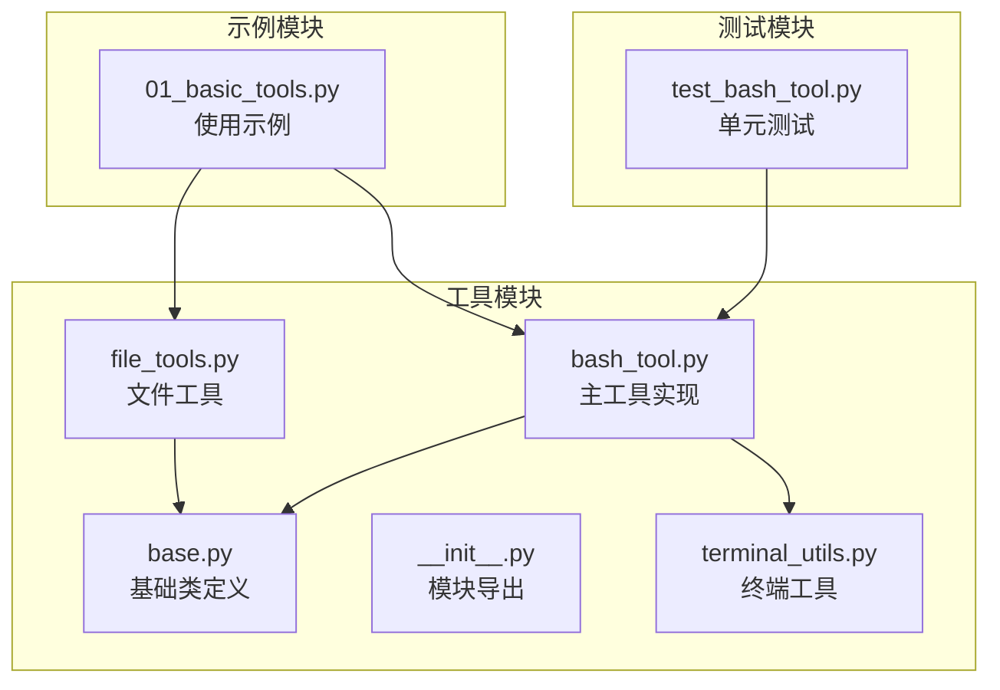
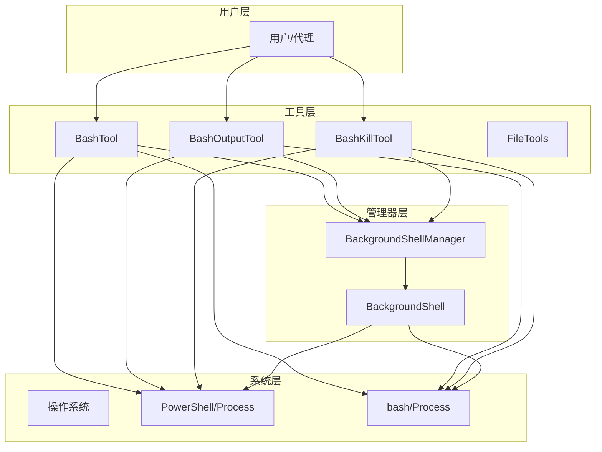
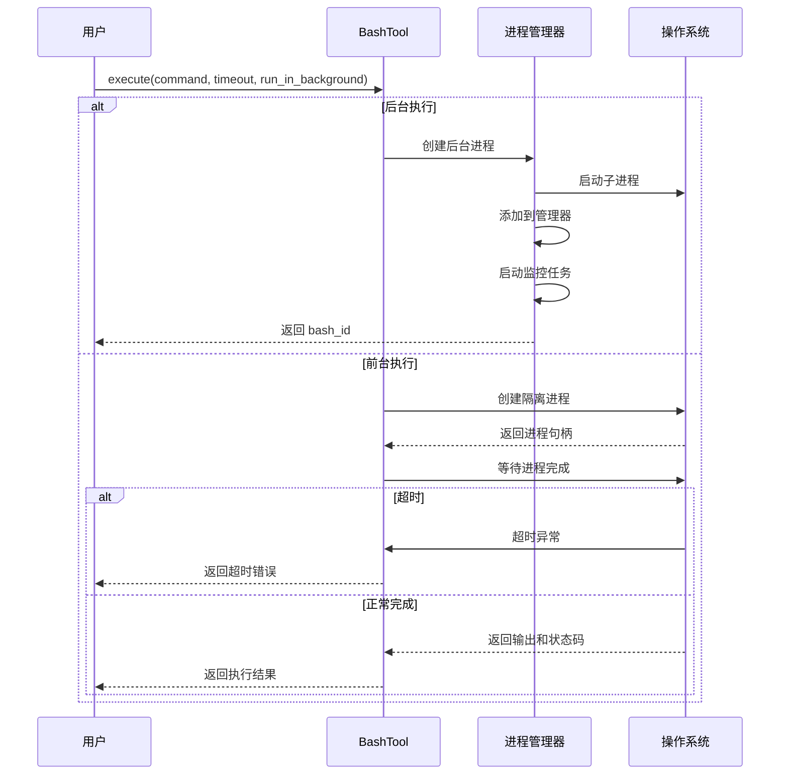
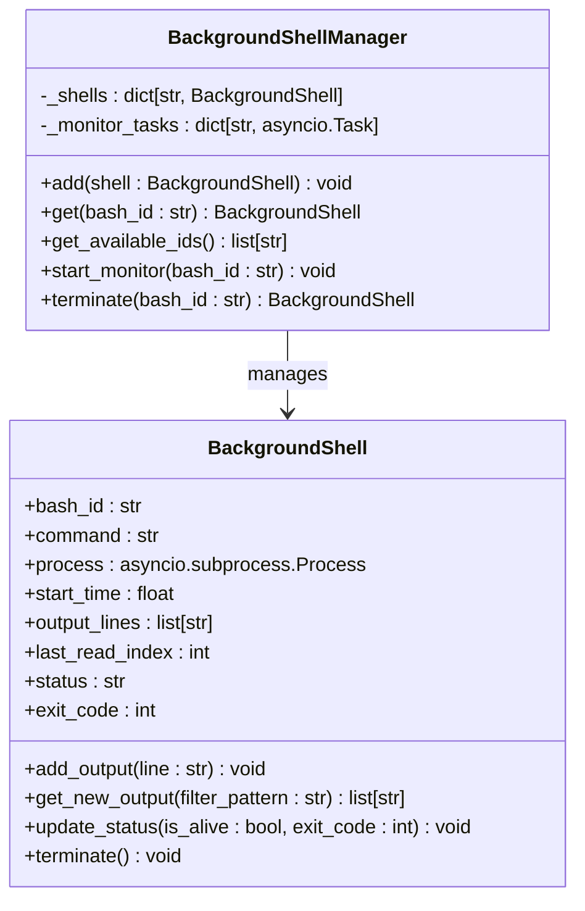
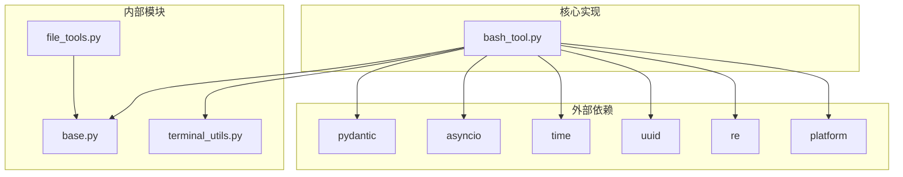

# Shell 命令工具

<cite>
**本文档引用的文件**
- [bash_tool.py](file://mini_agent/tools/bash_tool.py)
- [base.py](file://mini_agent/tools/base.py)
- [file_tools.py](file://mini_agent/tools/file_tools.py)
- [terminal_utils.py](file://mini_agent/utils/terminal_utils.py)
- [test_bash_tool.py](file://tests/test_bash_tool.py)
- [01_basic_tools.py](file://examples/01_basic_tools.py)
- [__init__.py](file://mini_agent/tools/__init__.py)
- [system_prompt.md](file://mini_agent/config/system_prompt.md)
</cite>

## 目录
1. [简介](#简介)
2. [项目结构](#项目结构)
3. [核心组件](#核心组件)
4. [架构概览](#架构概览)
5. [详细组件分析](#详细组件分析)
6. [依赖关系分析](#依赖关系分析)
7. [性能考虑](#性能考虑)
8. [故障排除指南](#故障排除指南)
9. [结论](#结论)
10. [附录](#附录)

## 简介

Shell 命令工具是 MiniAgent 项目中的核心功能模块，提供了跨平台的命令执行能力。该工具支持同步和异步执行模式，能够自动检测操作系统并选择合适的 shell（Windows 使用 PowerShell，Unix/Linux/macOS 使用 bash）。它不仅能够执行前台命令，还提供了完整的后台进程管理系统，包括输出监控、进程终止和资源清理等功能。

本工具的设计充分考虑了安全性、可靠性和易用性，为系统管理、文件操作和网络任务等常见场景提供了强大的支持。

## 项目结构

Shell 命令工具位于 `mini_agent/tools/` 目录下，主要包含以下文件：



**图表来源**
- [bash_tool.py:1-618](file://mini_agent/tools/bash_tool.py#L1-L618)
- [base.py:1-56](file://mini_agent/tools/base.py#L1-L56)
- [file_tools.py:1-286](file://mini_agent/tools/file_tools.py#L1-L286)
- [terminal_utils.py:1-157](file://mini_agent/utils/terminal_utils.py#L1-L157)

**章节来源**
- [bash_tool.py:1-618](file://mini_agent/tools/bash_tool.py#L1-L618)
- [base.py:1-56](file://mini_agent/tools/base.py#L1-L56)
- [file_tools.py:1-286](file://mini_agent/tools/file_tools.py#L1-L286)
- [terminal_utils.py:1-157](file://mini_agent/utils/terminal_utils.py#L1-L157)

## 核心组件

Shell 命令工具由三个核心组件构成：

### 1. BashTool 主工具
负责命令执行的核心逻辑，支持前台和后台两种执行模式。

### 2. BashOutputTool 输出工具
用于监控和获取后台进程的输出结果。

### 3. BashKillTool 终止工具
用于优雅地终止后台进程并清理相关资源。

每个组件都继承自基础的 `Tool` 类，遵循统一的接口规范。

**章节来源**
- [bash_tool.py:217-618](file://mini_agent/tools/bash_tool.py#L217-L618)
- [base.py:16-56](file://mini_agent/tools/base.py#L16-L56)

## 架构概览



**图表来源**
- [bash_tool.py:217-618](file://mini_agent/tools/bash_tool.py#L217-L618)
- [bash_tool.py:108-215](file://mini_agent/tools/bash_tool.py#L108-L215)

## 详细组件分析

### BashTool 主工具

BashTool 是整个 Shell 命令工具的核心，负责命令的执行和管理。

#### 关键特性

1. **跨平台支持**：自动检测操作系统并选择合适的 shell
2. **双执行模式**：支持前台同步执行和后台异步执行
3. **资源管理**：提供完整的过程生命周期管理
4. **错误处理**：完善的异常捕获和错误报告机制

#### 执行流程



**图表来源**
- [bash_tool.py:309-439](file://mini_agent/tools/bash_tool.py#L309-L439)

#### 参数处理

| 参数名 | 类型 | 默认值 | 描述 |
|--------|------|--------|------|
| command | string | 必需 | 要执行的 shell 命令 |
| timeout | integer | 120 | 前台执行超时时间（秒） |
| run_in_background | boolean | false | 是否以后台模式运行 |

**章节来源**
- [bash_tool.py:285-307](file://mini_agent/tools/bash_tool.py#L285-L307)
- [bash_tool.py:309-439](file://mini_agent/tools/bash_tool.py#L309-L439)

### BackgroundShellManager 管理器

BackgroundShellManager 是后台进程的中央控制器，负责进程的创建、监控、管理和清理。

#### 核心功能

1. **进程注册**：跟踪所有活跃的后台进程
2. **输出监控**：持续读取进程输出并缓存
3. **状态管理**：维护进程的运行状态
4. **资源清理**：确保进程终止后的资源释放



**图表来源**
- [bash_tool.py:108-215](file://mini_agent/tools/bash_tool.py#L108-L215)

**章节来源**
- [bash_tool.py:108-215](file://mini_agent/tools/bash_tool.py#L108-L215)

### BashOutputTool 输出工具

BashOutputTool 提供了对后台进程输出的增量获取能力，支持正则表达式过滤。

#### 功能特性

1. **增量输出**：只返回自上次检查以来的新输出
2. **正则过滤**：支持基于正则表达式的输出筛选
3. **状态查询**：提供进程的当前状态信息
4. **错误处理**：优雅处理不存在的进程标识符

**章节来源**
- [bash_tool.py:441-533](file://mini_agent/tools/bash_tool.py#L441-L533)

### BashKillTool 终止工具

BashKillTool 提供了进程的优雅终止能力，确保资源的正确清理。

#### 终止策略

1. **优雅终止**：首先尝试发送终止信号
2. **强制终止**：如果优雅终止失败，则强制杀死进程
3. **资源清理**：确保移除监控任务和进程记录
4. **状态更新**：返回终止前的最后输出和最终状态

**章节来源**
- [bash_tool.py:535-618](file://mini_agent/tools/bash_tool.py#L535-L618)

## 依赖关系分析



**图表来源**
- [bash_tool.py:6-15](file://mini_agent/tools/bash_tool.py#L6-L15)
- [base.py:3-6](file://mini_agent/tools/base.py#L3-L6)

### 内部依赖关系

| 文件 | 导入模块 | 用途 |
|------|----------|------|
| bash_tool.py | asyncio, platform, re, time, uuid | 异步执行、平台检测、正则表达式、时间管理、唯一标识 |
| bash_tool.py | pydantic | 数据验证和序列化 |
| bash_tool.py | base.Tool, ToolResult | 工具基类和结果格式化 |
| terminal_utils.py | re, unicodedata | 终端显示宽度计算 |
| file_tools.py | pathlib.Path, tiktoken | 路径处理和令牌计数 |

**章节来源**
- [bash_tool.py:6-15](file://mini_agent/tools/bash_tool.py#L6-L15)
- [terminal_utils.py:7-11](file://mini_agent/utils/terminal_utils.py#L7-L11)

## 性能考虑

### 资源管理

1. **内存优化**：后台进程输出采用增量存储，避免内存无限增长
2. **并发控制**：使用 asyncio 实现非阻塞 I/O 操作
3. **进程隔离**：每个命令在独立的进程中执行，避免相互影响

### 超时机制

- **前台命令**：默认超时时间为 120 秒，最大可设置为 600 秒
- **后台监控**：监控任务使用非阻塞 I/O，避免长时间阻塞
- **优雅终止**：提供 5 秒的优雅终止窗口，然后强制终止

### 输出处理

- **编码处理**：使用 UTF-8 编码解码输出，错误字符替换为占位符
- **缓冲区管理**：合理设置 I/O 缓冲区大小，平衡性能和响应性

## 故障排除指南

### 常见问题及解决方案

#### 1. 命令执行失败

**症状**：命令返回非零退出码
**原因**：命令语法错误、权限不足、依赖缺失
**解决**：
- 检查命令语法和参数
- 验证目标文件或目录存在
- 确认必要的权限已授予

#### 2. 命令超时

**症状**：前台命令执行超过指定时间被终止
**原因**：命令执行时间过长或死循环
**解决**：
- 增加 timeout 参数值
- 优化命令执行逻辑
- 将长任务改为后台执行

#### 3. 后台进程无法找到

**症状**：使用 bash_id 查询输出时返回 "not found"
**原因**：进程已结束或 bash_id 错误
**解决**：
- 检查可用的 bash_id 列表
- 确认进程仍在运行
- 重新启动后台命令

#### 4. 输出过滤无效

**症状**：正则表达式过滤不生效
**原因**：正则表达式语法错误
**解决**：
- 验证正则表达式语法
- 使用简单的匹配模式进行测试
- 检查输出内容是否符合预期

**章节来源**
- [test_bash_tool.py:10-273](file://tests/test_bash_tool.py#L10-L273)

## 结论

Shell 命令工具为 MiniAgent 提供了强大而灵活的系统交互能力。通过精心设计的架构和完善的错误处理机制，该工具能够在保证安全性的同时提供高效的命令执行体验。

主要优势包括：
- **跨平台兼容**：自动适配不同操作系统
- **双执行模式**：满足从简单脚本到复杂服务的各种需求
- **完整的生命周期管理**：从创建到清理的全流程支持
- **强大的监控能力**：实时跟踪后台进程状态和输出
- **安全可靠的执行**：防止命令注入和资源泄漏

该工具为系统管理、文件操作和网络任务等场景提供了坚实的基础，是构建智能代理的重要组成部分。

## 附录

### 使用示例

#### 基础命令执行

```python
# 前台执行简单命令
result = await bash_tool.execute(command="ls -la")

# 设置超时时间
result = await bash_tool.execute(command="sleep 10", timeout=30)

# 后台执行长任务
result = await bash_tool.execute(
    command="python3 -m http.server 8080", 
    run_in_background=True
)
```

#### 后台进程管理

```python
# 获取后台进程输出
output_result = await bash_output_tool.execute(bash_id=bash_id)

# 终止后台进程
kill_result = await bash_kill_tool.execute(bash_id=bash_id)
```

#### 与文件工具协作

```python
# 先读取配置文件，再执行相关命令
read_tool = ReadTool()
file_result = await read_tool.execute(path="config.yaml")

bash_tool = BashTool()
command_result = await bash_tool.execute(
    command="cat config.yaml | grep 'setting'"
)
```

### 最佳实践

1. **优先使用前台执行**：对于短时间任务使用前台执行，获得即时反馈
2. **合理设置超时**：根据任务复杂度设置合适的超时时间
3. **监控后台进程**：定期检查后台进程的输出和状态
4. **优雅终止**：使用 bash_kill 工具优雅终止长任务
5. **错误处理**：始终检查执行结果的 success 字段和 error 信息