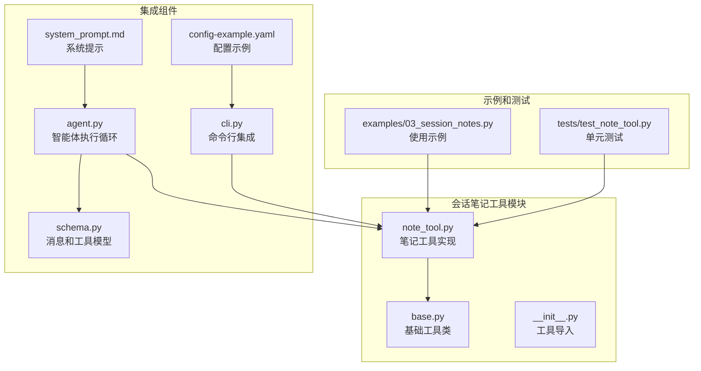
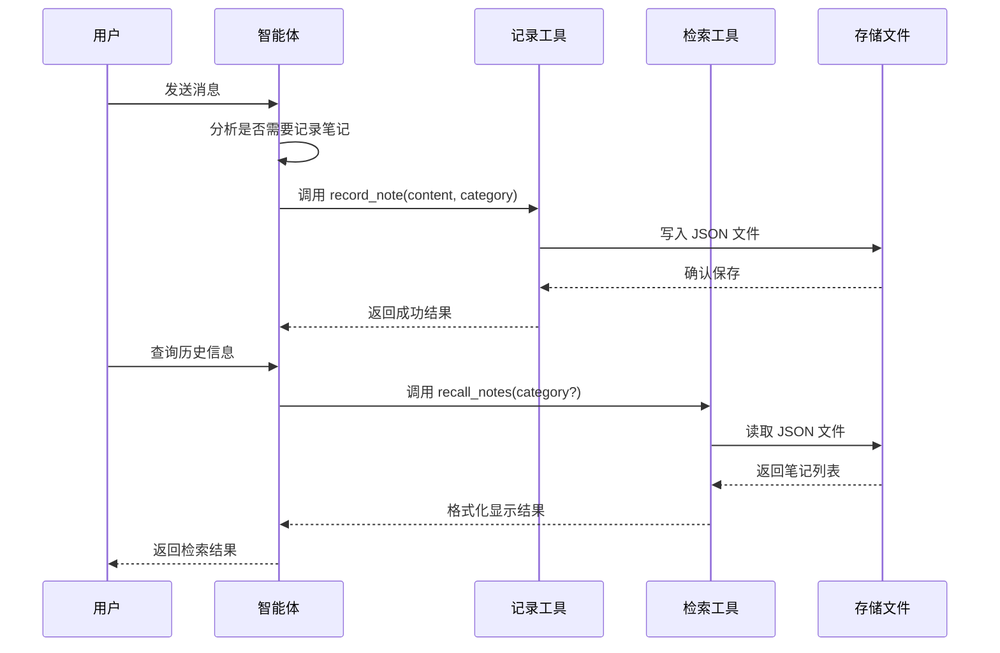
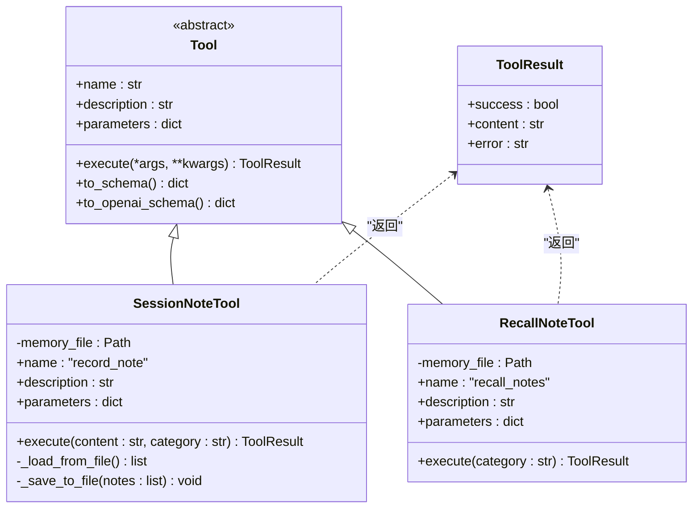
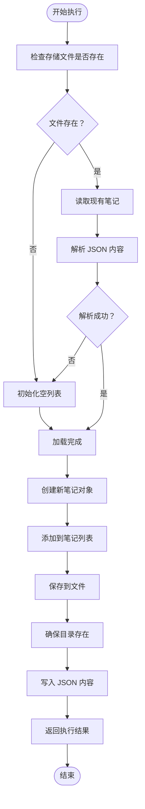
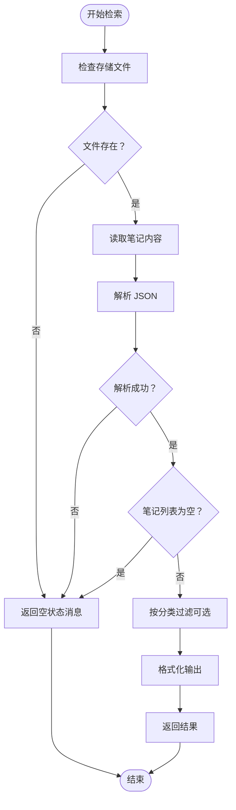
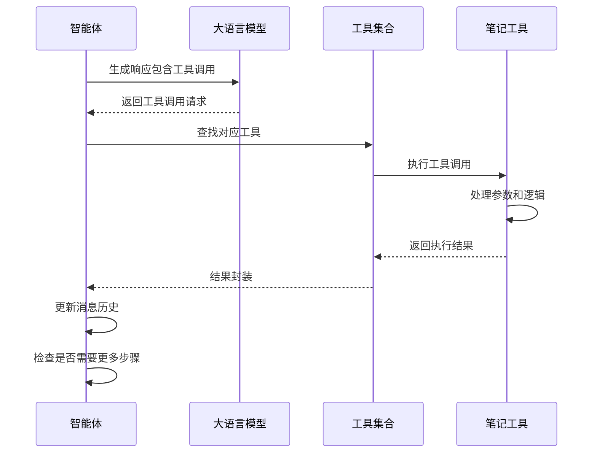
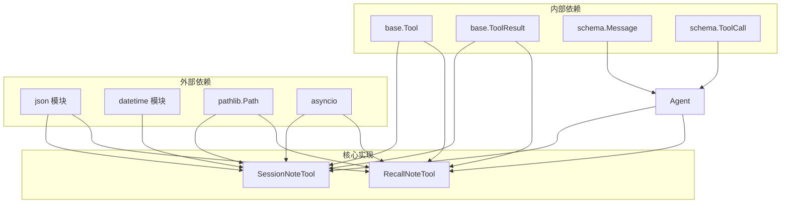

# 会话笔记工具

<cite>
**本文档引用的文件**
- [examples/03_session_notes.py](file://examples/03_session_notes.py)
- [mini_agent/tools/note_tool.py](file://mini_agent/tools/note_tool.py)
- [mini_agent/tools/base.py](file://mini_agent/tools/base.py)
- [mini_agent/agent.py](file://mini_agent/agent.py)
- [mini_agent/schema/schema.py](file://mini_agent/schema/schema.py)
- [mini_agent/config/system_prompt.md](file://mini_agent/config/system_prompt.md)
- [mini_agent/config/config-example.yaml](file://mini_agent/config/config-example.yaml)
- [mini_agent/tools/__init__.py](file://mini_agent/tools/__init__.py)
- [mini_agent/cli.py](file://mini_agent/cli.py)
- [tests/test_note_tool.py](file://tests/test_note_tool.py)
- [docs/DEVELOPMENT_GUIDE.md](file://docs/DEVELOPMENT_GUIDE.md)
- [docs/PRODUCTION_GUIDE.md](file://docs/PRODUCTION_GUIDE.md)
</cite>

## 目录
1. [简介](#简介)
2. [项目结构](#项目结构)
3. [核心组件](#核心组件)
4. [架构概览](#架构概览)
5. [详细组件分析](#详细组件分析)
6. [依赖关系分析](#依赖关系分析)
7. [性能考虑](#性能考虑)
8. [故障排除指南](#故障排除指南)
9. [结论](#结论)
10. [附录](#附录)

## 简介

会话笔记工具是 Mini-Agent 框架中的核心记忆组件，允许智能体在多个会话之间保持上下文和知识。该工具提供了简单而强大的笔记记录和检索功能，支持分类管理、时间戳跟踪和跨会话持久化。

该工具的主要特性包括：
- 基于 JSON 文件的简单持久化存储
- 支持分类标签的笔记管理
- 时间戳自动记录
- 跨会话上下文保持
- 异步执行支持
- 标准化的工具接口

## 项目结构

会话笔记工具在项目中的组织结构如下：



**图表来源**
- [mini_agent/tools/note_tool.py:1-214](file://mini_agent/tools/note_tool.py#L1-L214)
- [mini_agent/tools/base.py:1-56](file://mini_agent/tools/base.py#L1-L56)
- [examples/03_session_notes.py:1-251](file://examples/03_session_notes.py#L1-L251)

**章节来源**
- [mini_agent/tools/note_tool.py:1-214](file://mini_agent/tools/note_tool.py#L1-L214)
- [mini_agent/tools/base.py:1-56](file://mini_agent/tools/base.py#L1-L56)
- [examples/03_session_notes.py:1-251](file://examples/03_session_notes.py#L1-L251)

## 核心组件

会话笔记工具由两个主要组件构成：

### 1. SessionNoteTool（记录工具）
负责将重要信息作为会话笔记进行记录，支持分类标记和时间戳自动添加。

### 2. RecallNoteTool（检索工具）
用于检索之前记录的所有笔记，支持按分类过滤和格式化显示。

### 3. 基础工具类
提供标准化的工具接口，包括参数验证、结果封装和工具模式转换。

**章节来源**
- [mini_agent/tools/note_tool.py:17-126](file://mini_agent/tools/note_tool.py#L17-L126)
- [mini_agent/tools/note_tool.py:128-214](file://mini_agent/tools/note_tool.py#L128-L214)
- [mini_agent/tools/base.py:16-56](file://mini_agent/tools/base.py#L16-L56)

## 架构概览

会话笔记工具在整个智能体系统中的架构位置：



**图表来源**
- [mini_agent/agent.py:321-524](file://mini_agent/agent.py#L321-L524)
- [mini_agent/tools/note_tool.py:91-125](file://mini_agent/tools/note_tool.py#L91-L125)
- [mini_agent/tools/note_tool.py:163-213](file://mini_agent/tools/note_tool.py#L163-L213)

## 详细组件分析

### SessionNoteTool 组件分析



**图表来源**
- [mini_agent/tools/base.py:16-56](file://mini_agent/tools/base.py#L16-L56)
- [mini_agent/tools/note_tool.py:17-214](file://mini_agent/tools/note_tool.py#L17-L214)

#### 数据存储机制

会话笔记采用 JSON 文件存储，每个笔记包含以下字段：
- `timestamp`: ISO 格式的时间戳
- `category`: 笔记分类标签
- `content`: 笔记内容

存储策略特点：
- **懒加载**: 文件仅在首次记录笔记时创建
- **原子写入**: 完整覆盖整个文件内容
- **目录自动创建**: 写入前确保父目录存在

#### 执行流程分析



**图表来源**
- [mini_agent/tools/note_tool.py:69-89](file://mini_agent/tools/note_tool.py#L69-L89)
- [mini_agent/tools/note_tool.py:91-125](file://mini_agent/tools/note_tool.py#L91-L125)

**章节来源**
- [mini_agent/tools/note_tool.py:17-126](file://mini_agent/tools/note_tool.py#L17-L126)

### RecallNoteTool 组件分析

检索工具提供灵活的笔记查询功能：

#### 检索功能特性
- **全量检索**: 返回所有已记录的笔记
- **分类过滤**: 支持按分类标签筛选
- **格式化输出**: 自动生成编号和时间戳格式
- **智能空状态**: 处理无笔记或空文件的情况

#### 检索流程



**图表来源**
- [mini_agent/tools/note_tool.py:163-213](file://mini_agent/tools/note_tool.py#L163-L213)

**章节来源**
- [mini_agent/tools/note_tool.py:128-214](file://mini_agent/tools/note_tool.py#L128-L214)

### 智能体执行循环集成

会话笔记工具与智能体执行循环的深度集成：



**图表来源**
- [mini_agent/agent.py:321-524](file://mini_agent/agent.py#L321-L524)
- [mini_agent/tools/base.py:34-36](file://mini_agent/tools/base.py#L34-L36)

**章节来源**
- [mini_agent/agent.py:321-524](file://mini_agent/agent.py#L321-L524)

## 依赖关系分析

会话笔记工具的依赖关系图：



**图表来源**
- [mini_agent/tools/note_tool.py:9-14](file://mini_agent/tools/note_tool.py#L9-L14)
- [mini_agent/tools/base.py:3-5](file://mini_agent/tools/base.py#L3-L5)
- [mini_agent/schema/schema.py:29-37](file://mini_agent/schema/schema.py#L29-L37)

**章节来源**
- [mini_agent/tools/note_tool.py:9-14](file://mini_agent/tools/note_tool.py#L9-L14)
- [mini_agent/tools/base.py:3-5](file://mini_agent/tools/base.py#L3-L5)
- [mini_agent/schema/schema.py:29-37](file://mini_agent/schema/schema.py#L29-L37)

## 性能考虑

### 存储性能
- **文件大小**: 每个会话的笔记文件通常很小，适合频繁读写
- **I/O 操作**: 采用完整的文件覆盖写入，避免部分更新的复杂性
- **内存使用**: 整个笔记列表加载到内存中，适合中小规模笔记集

### 并发安全
- **单文件锁**: 当前实现假设单实例访问，多实例并发可能产生竞态条件
- **建议改进**: 在生产环境中考虑使用文件锁或数据库事务

### 扩展性建议
- **分片存储**: 对于大量笔记，可考虑按日期或分类分文件存储
- **索引机制**: 添加基于分类和时间的索引以提高查询性能
- **缓存层**: 在内存中维护最近使用的笔记以减少磁盘访问

## 故障排除指南

### 常见问题及解决方案

#### 1. 文件权限问题
**症状**: 记录失败，返回权限错误
**原因**: 存储目录没有写权限
**解决方案**: 
- 确保存储路径存在且可写
- 检查父目录权限设置

#### 2. JSON 解析错误
**症状**: 检索时出现 JSON 解析异常
**原因**: 存储文件损坏或被其他进程修改
**解决方案**:
- 删除损坏的文件
- 检查是否有其他进程同时访问同一文件

#### 3. 路径不存在
**症状**: 工具初始化失败
**原因**: 指定的存储路径不存在
**解决方案**:
- 确保工作目录存在
- 使用绝对路径避免相对路径问题

**章节来源**
- [tests/test_note_tool.py:11-135](file://tests/test_note_tool.py#L11-L135)
- [mini_agent/tools/note_tool.py:74-80](file://mini_agent/tools/note_tool.py#L74-L80)

## 结论

会话笔记工具为 Mini-Agent 框架提供了简洁而有效的上下文管理能力。其设计特点包括：

**优势**:
- 实现简单，易于理解和维护
- 持久化可靠，基于标准 JSON 格式
- 与智能体执行循环无缝集成
- 支持异步操作，适应现代应用需求

**局限性**:
- 单文件存储限制了并发性能
- 缺少高级搜索和索引功能
- 不支持复杂的版本控制和审计追踪

**适用场景**:
- 开发和测试环境
- 小规模知识管理
- 基础的上下文保持需求

对于生产环境，建议考虑扩展到支持分布式存储、并发控制和高级搜索功能的解决方案。

## 附录

### 使用示例

#### 基础使用模式
```python
# 创建笔记工具实例
record_tool = SessionNoteTool(memory_file="./workspace/.agent_memory.json")
recall_tool = RecallNoteTool(memory_file="./workspace/.agent_memory.json")

# 记录笔记
await record_tool.execute(
    content="用户偏好：简洁明了的响应",
    category="user_preference"
)

# 检索笔记
result = await recall_tool.execute(category="user_preference")
```

#### 集成到智能体
```python
# 在智能体初始化时添加笔记工具
tools = [
    SessionNoteTool(memory_file=str(workspace_dir / ".agent_memory.json")),
    RecallNoteTool(memory_file=str(workspace_dir / ".agent_memory.json"))
]

agent = Agent(
    llm_client=llm_client,
    system_prompt=system_prompt,
    tools=tools,
    max_steps=50
)
```

### 最佳实践

1. **合理的分类策略**: 使用有意义的分类标签，如 `user_info`、`project_info`、`decision` 等
2. **定期清理**: 定期清理过期或重复的笔记
3. **备份策略**: 对重要的笔记文件进行定期备份
4. **监控告警**: 监控存储空间和文件完整性
5. **性能优化**: 对于大量笔记，考虑分片存储或迁移至数据库

### 配置选项

| 配置项 | 类型 | 默认值 | 描述 |
|--------|------|--------|------|
| memory_file | 字符串 | "./workspace/.agent_memory.json" | 笔记存储文件路径 |
| category | 字符串 | "general" | 笔记分类，默认分类 |
| max_steps | 整数 | 50 | 智能体最大执行步数 |

**章节来源**
- [examples/03_session_notes.py:21-251](file://examples/03_session_notes.py#L21-L251)
- [mini_agent/config/config-example.yaml:42-46](file://mini_agent/config/config-example.yaml#L42-L46)