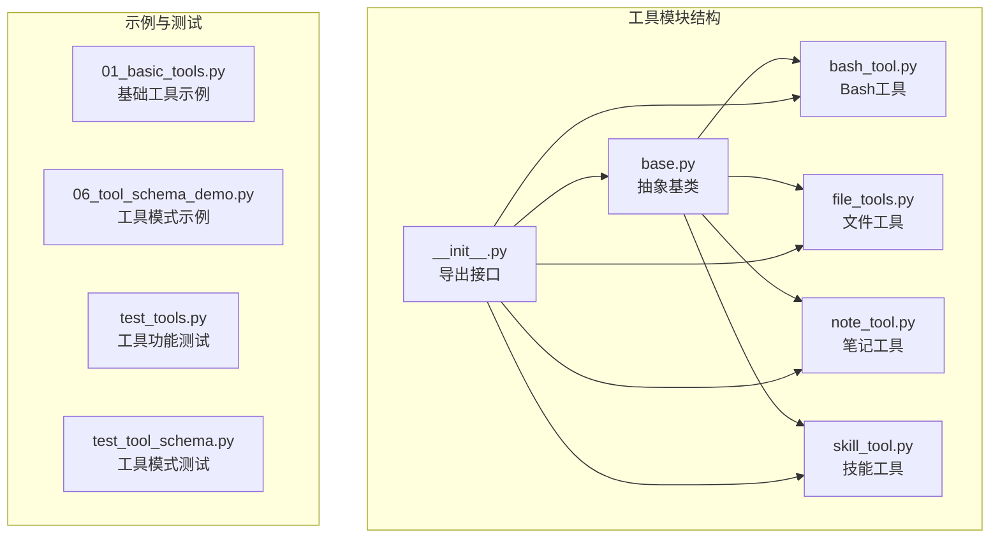
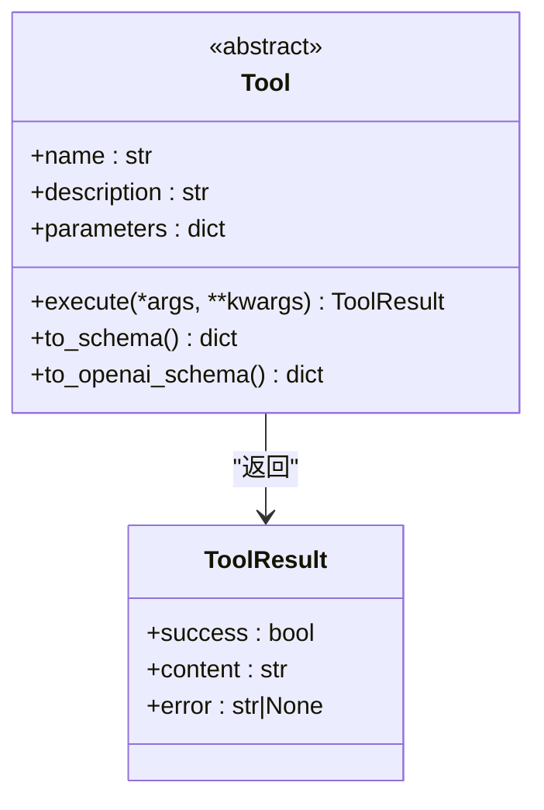
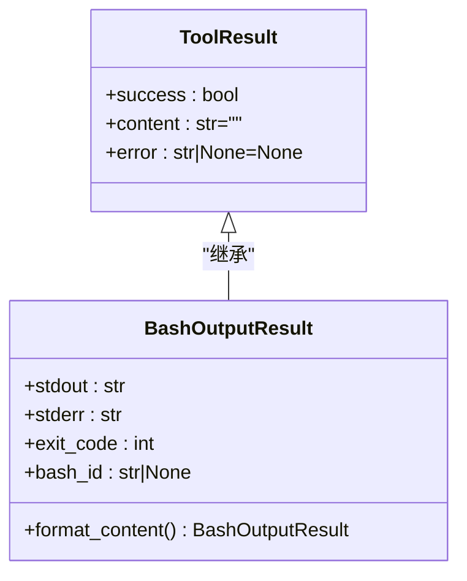
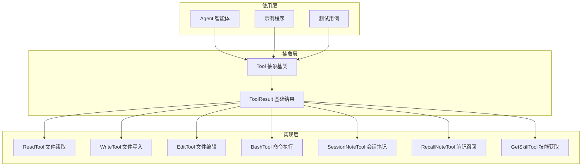
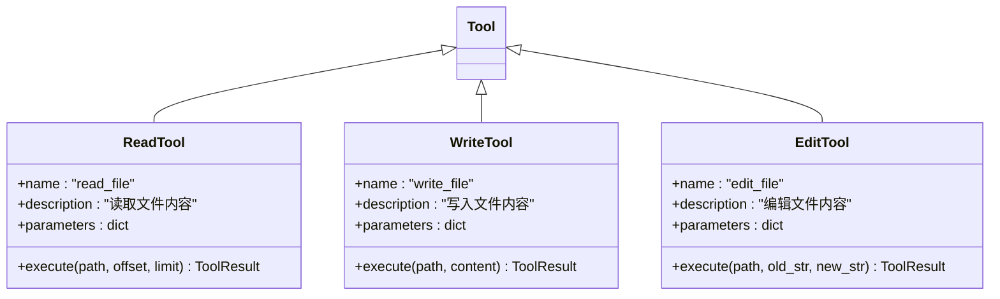
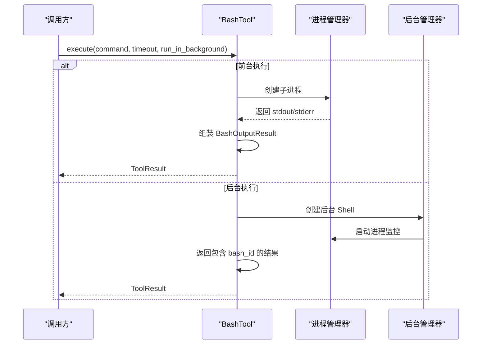
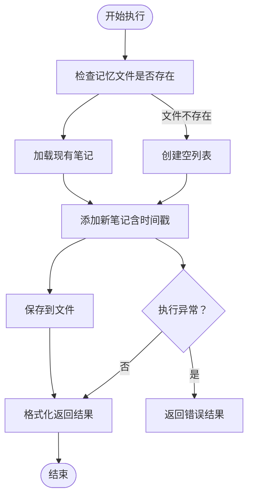
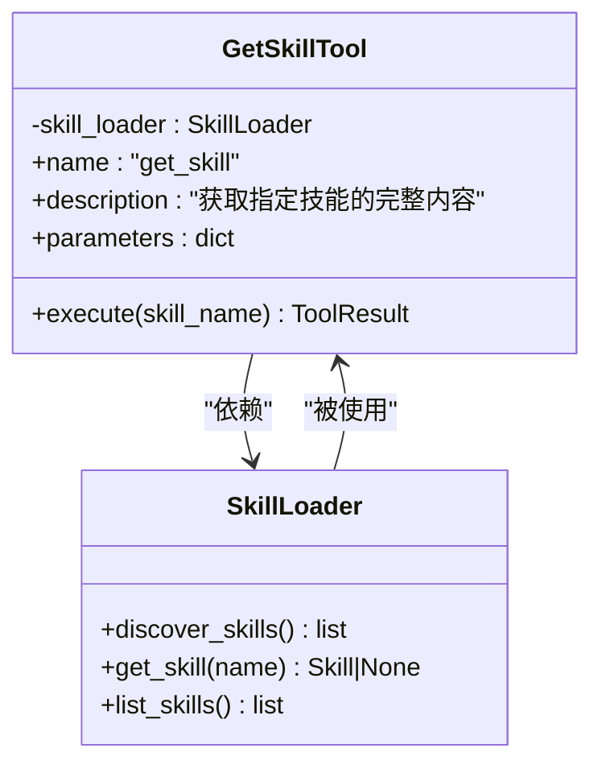
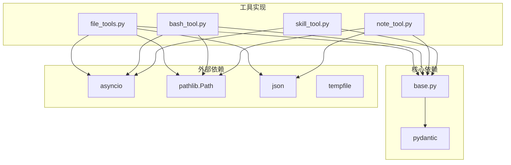
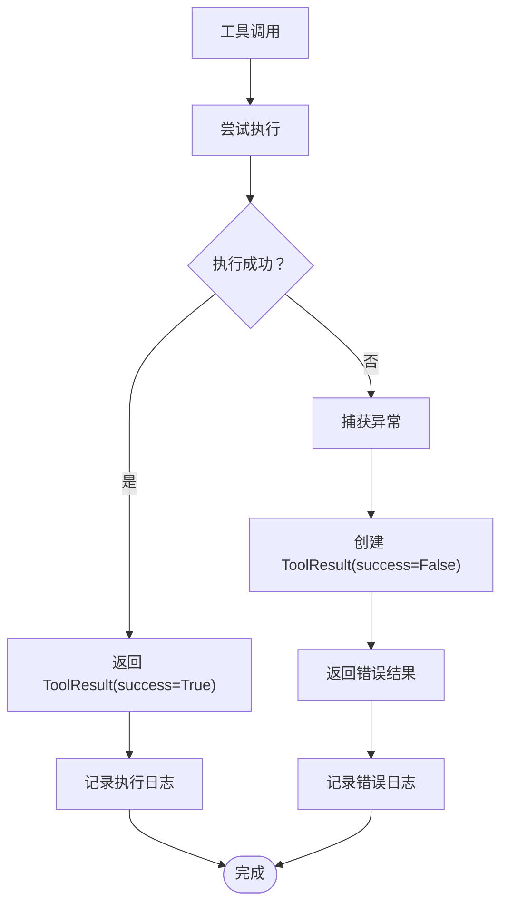

# 工具基类设计

<cite>
**本文档引用的文件**
- [base.py](file://mini_agent/tools/base.py)
- [__init__.py](file://mini_agent/tools/__init__.py)
- [bash_tool.py](file://mini_agent/tools/bash_tool.py)
- [file_tools.py](file://mini_agent/tools/file_tools.py)
- [note_tool.py](file://mini_agent/tools/note_tool.py)
- [skill_tool.py](file://mini_agent/tools/skill_tool.py)
- [01_basic_tools.py](file://examples/01_basic_tools.py)
- [06_tool_schema_demo.py](file://examples/06_tool_schema_demo.py)
- [test_tools.py](file://tests/test_tools.py)
- [test_tool_schema.py](file://tests/test_tool_schema.py)
- [agent.py](file://mini_agent/agent.py)
</cite>

## 目录
1. [简介](#简介)
2. [项目结构](#项目结构)
3. [核心组件](#核心组件)
4. [架构概览](#架构概览)
5. [详细组件分析](#详细组件分析)
6. [依赖分析](#依赖分析)
7. [性能考虑](#性能考虑)
8. [故障排除指南](#故障排除指南)
9. [结论](#结论)
10. [附录](#附录)

## 简介

本文件深入解析 MiniAgent 项目中的工具基类设计，重点阐述 Tool 抽象基类的设计理念、接口规范以及 ToolResult 结果模型的结构与用途。文档详细说明了工具执行接口 execute 的异步设计和参数传递机制，并解释了工具模式转换方法 to_schema 和 to_openai_schema 的实现原理与使用场景。最后提供工具基类的最佳实践和扩展指南，帮助开发者正确继承和实现自定义工具。

## 项目结构

工具系统位于 `mini_agent/tools/` 目录下，采用模块化设计，包含抽象基类和多种具体工具实现：

**图表来源**
- [base.py:1-56](file://mini_agent/tools/base.py#L1-L56)
- [__init__.py:1-18](file://mini_agent/tools/__init__.py#L1-L18)

**章节来源**
- [base.py:1-56](file://mini_agent/tools/base.py#L1-L56)
- [__init__.py:1-18](file://mini_agent/tools/__init__.py#L1-L18)

## 核心组件

### Tool 抽象基类

Tool 抽象基类是所有工具的统一接口定义，采用属性抽象和方法抽象相结合的设计：

**图表来源**
- [base.py:16-55](file://mini_agent/tools/base.py#L16-L55)

核心设计理念：
- **属性抽象**：name、description、parameters 属性强制子类实现
- **异步执行**：execute 方法采用 async/await 设计，支持并发执行
- **模式兼容**：提供 to_schema 和 to_openai_schema 方法适配不同 LLM 提供商
- **结果标准化**：统一使用 ToolResult 返回格式

**章节来源**
- [base.py:16-55](file://mini_agent/tools/base.py#L16-L55)

### ToolResult 结果模型

ToolResult 是工具执行的标准结果封装，采用 Pydantic BaseModel 设计：

**图表来源**
- [base.py:8-14](file://mini_agent/tools/base.py#L8-L14)
- [bash_tool.py:18-50](file://mini_agent/tools/bash_tool.py#L18-L50)

设计特点：
- **字段验证**：Pydantic 自动进行类型检查和默认值设置
- **可选错误**：error 字段允许为 None，便于区分成功和失败状态
- **扩展性**：支持继承以满足特定工具的复杂返回需求

**章节来源**
- [base.py:8-14](file://mini_agent/tools/base.py#L8-L14)
- [bash_tool.py:18-50](file://mini_agent/tools/bash_tool.py#L18-L50)

## 架构概览

工具系统的整体架构采用分层设计，从抽象基类到具体实现再到使用场景：

**图表来源**
- [base.py:16-55](file://mini_agent/tools/base.py#L16-L55)
- [file_tools.py:63-286](file://mini_agent/tools/file_tools.py#L63-L286)
- [bash_tool.py:217-618](file://mini_agent/tools/bash_tool.py#L217-L618)
- [note_tool.py:17-214](file://mini_agent/tools/note_tool.py#L17-L214)
- [skill_tool.py:13-85](file://mini_agent/tools/skill_tool.py#L13-L85)

## 详细组件分析

### 文件操作工具链

文件操作工具链提供了完整的文件系统操作能力，每个工具都严格遵循 Tool 接口规范：

**图表来源**
- [file_tools.py:63-286](file://mini_agent/tools/file_tools.py#L63-L286)

#### 参数模式设计

文件工具的参数模式体现了 JSON Schema 的完整表达：

| 参数名 | 类型 | 必填 | 描述 |
|--------|------|------|------|
| path | string | 是 | 文件路径（绝对或相对） |
| offset | integer | 否 | 起始行号（1-indexed） |
| limit | integer | 否 | 读取行数 |
| content | string | 是 | 写入内容 |

**章节来源**
- [file_tools.py:87-106](file://mini_agent/tools/file_tools.py#L87-L106)
- [file_tools.py:178-193](file://mini_agent/tools/file_tools.py#L178-L193)
- [file_tools.py:235-254](file://mini_agent/tools/file_tools.py#L235-L254)

### Bash 命令执行工具

Bash 工具提供了跨平台的命令执行能力，支持前台和后台两种执行模式：

**图表来源**
- [bash_tool.py:309-439](file://mini_agent/tools/bash_tool.py#L309-L439)

#### 异步执行机制

Bash 工具的异步设计体现在多个层面：

1. **进程异步管理**：使用 asyncio.subprocess 处理 I/O 操作
2. **监控任务分离**：后台进程通过独立的监控任务实时收集输出
3. **超时控制**：前台执行支持超时机制，防止长时间阻塞

**章节来源**
- [bash_tool.py:309-439](file://mini_agent/tools/bash_tool.py#L309-L439)
- [bash_tool.py:108-215](file://mini_agent/tools/bash_tool.py#L108-L215)

### 笔记工具

笔记工具实现了智能体的记忆功能，支持会话级别的信息记录和召回：

**图表来源**
- [note_tool.py:91-126](file://mini_agent/tools/note_tool.py#L91-L126)

**章节来源**
- [note_tool.py:91-126](file://mini_agent/tools/note_tool.py#L91-L126)
- [note_tool.py:163-214](file://mini_agent/tools/note_tool.py#L163-L214)

### 技能工具

技能工具实现了按需加载的渐进式披露机制：

**图表来源**
- [skill_tool.py:13-85](file://mini_agent/tools/skill_tool.py#L13-L85)

**章节来源**
- [skill_tool.py:13-85](file://mini_agent/tools/skill_tool.py#L13-L85)

## 依赖分析

工具系统内部的依赖关系清晰明确，遵循单一职责原则：

**图表来源**
- [base.py:3-5](file://mini_agent/tools/base.py#L3-L5)
- [file_tools.py:3-8](file://mini_agent/tools/file_tools.py#L3-L8)
- [bash_tool.py:6-15](file://mini_agent/tools/bash_tool.py#L6-L15)
- [note_tool.py:9-14](file://mini_agent/tools/note_tool.py#L9-L14)
- [skill_tool.py:7-10](file://mini_agent/tools/skill_tool.py#L7-L10)

**章节来源**
- [base.py:3-5](file://mini_agent/tools/base.py#L3-L5)
- [file_tools.py:3-8](file://mini_agent/tools/file_tools.py#L3-L8)
- [bash_tool.py:6-15](file://mini_agent/tools/bash_tool.py#L6-L15)
- [note_tool.py:9-14](file://mini_agent/tools/note_tool.py#L9-L14)
- [skill_tool.py:7-10](file://mini_agent/tools/skill_tool.py#L7-L10)

## 性能考虑

### 异步执行优化

工具系统在设计上充分考虑了性能优化：

1. **并发执行**：所有工具的 execute 方法都是异步的，支持并发调用
2. **资源管理**：Bash 工具使用后台管理器统一管理进程资源
3. **内存优化**：文件工具支持分块读取，避免大文件一次性加载

### 错误处理策略

**图表来源**
- [agent.py:461-474](file://mini_agent/agent.py#L461-L474)

**章节来源**
- [agent.py:461-474](file://mini_agent/agent.py#L461-L474)

## 故障排除指南

### 常见问题诊断

1. **工具未找到**：检查工具名称是否正确注册到工具字典中
2. **参数验证失败**：确认 JSON Schema 定义的必填参数是否完整
3. **权限问题**：文件操作需要适当的文件系统权限
4. **进程超时**：调整 Bash 工具的 timeout 参数

### 调试技巧

- 使用示例程序验证工具基本功能
- 通过测试用例覆盖边界条件
- 在智能体中启用详细的日志记录

**章节来源**
- [test_tools.py:12-112](file://tests/test_tools.py#L12-L112)
- [test_tool_schema.py:137-243](file://tests/test_tool_schema.py#L137-L243)

## 结论

MiniAgent 的工具基类设计体现了以下优秀特性：

1. **统一接口**：Tool 抽象基类提供了清晰一致的工具接口
2. **灵活扩展**：支持多种工具类型的实现和组合
3. **标准结果**：ToolResult 统一了工具执行结果的表示方式
4. **跨平台兼容**：Bash 工具支持多操作系统环境
5. **异步设计**：充分利用 Python 异步特性提升性能

这套设计为构建复杂的智能体工具系统奠定了坚实的基础，既保证了代码的可维护性，又提供了足够的灵活性来适应不同的应用场景。

## 附录

### 最佳实践指南

#### 继承实现建议

1. **属性实现**：确保 name、description、parameters 属性的准确性
2. **参数验证**：在 execute 方法中添加必要的输入验证
3. **错误处理**：使用 ToolResult 标准化错误报告
4. **文档注释**：为每个工具提供详细的使用说明

#### 扩展开发流程

1. **需求分析**：明确工具的功能定位和使用场景
2. **接口设计**：参考现有工具的参数模式设计
3. **实现验证**：编写单元测试和集成测试
4. **文档完善**：更新相关文档和示例代码

**章节来源**
- [01_basic_tools.py:19-138](file://examples/01_basic_tools.py#L19-L138)
- [06_tool_schema_demo.py:24-151](file://examples/06_tool_schema_demo.py#L24-L151)