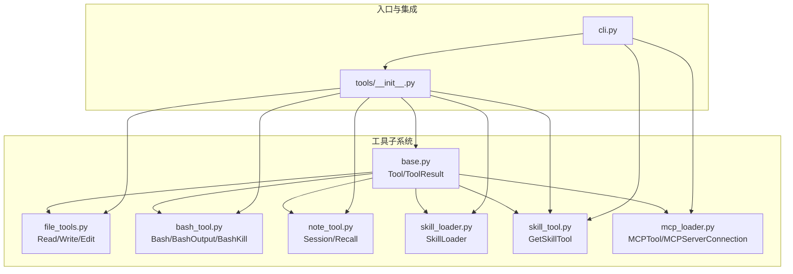
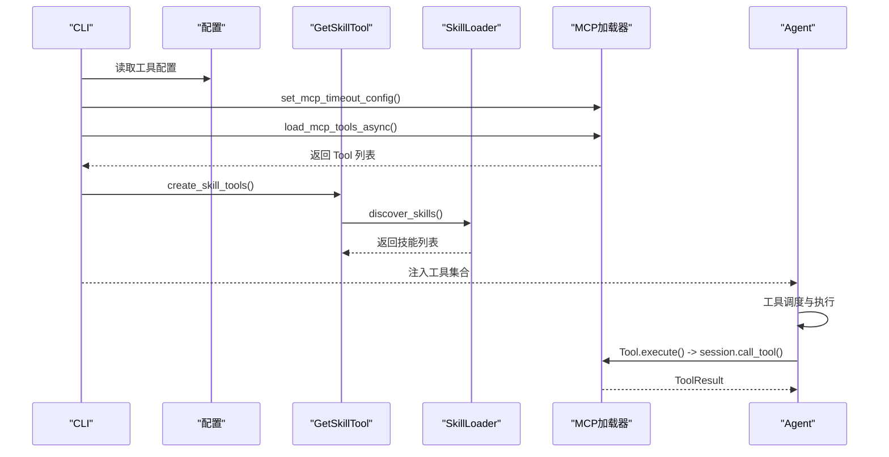
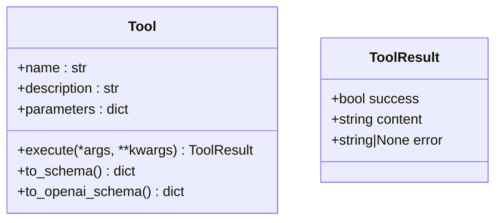
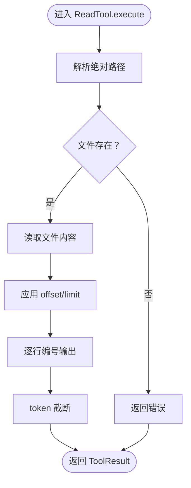
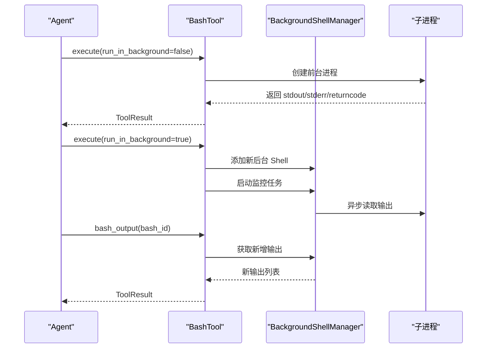
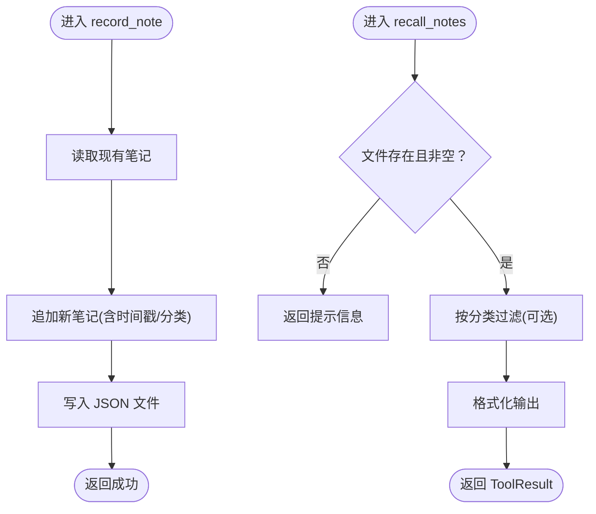
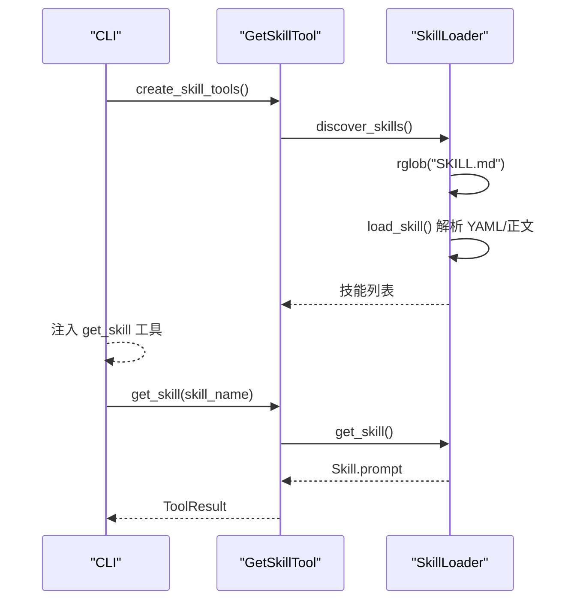
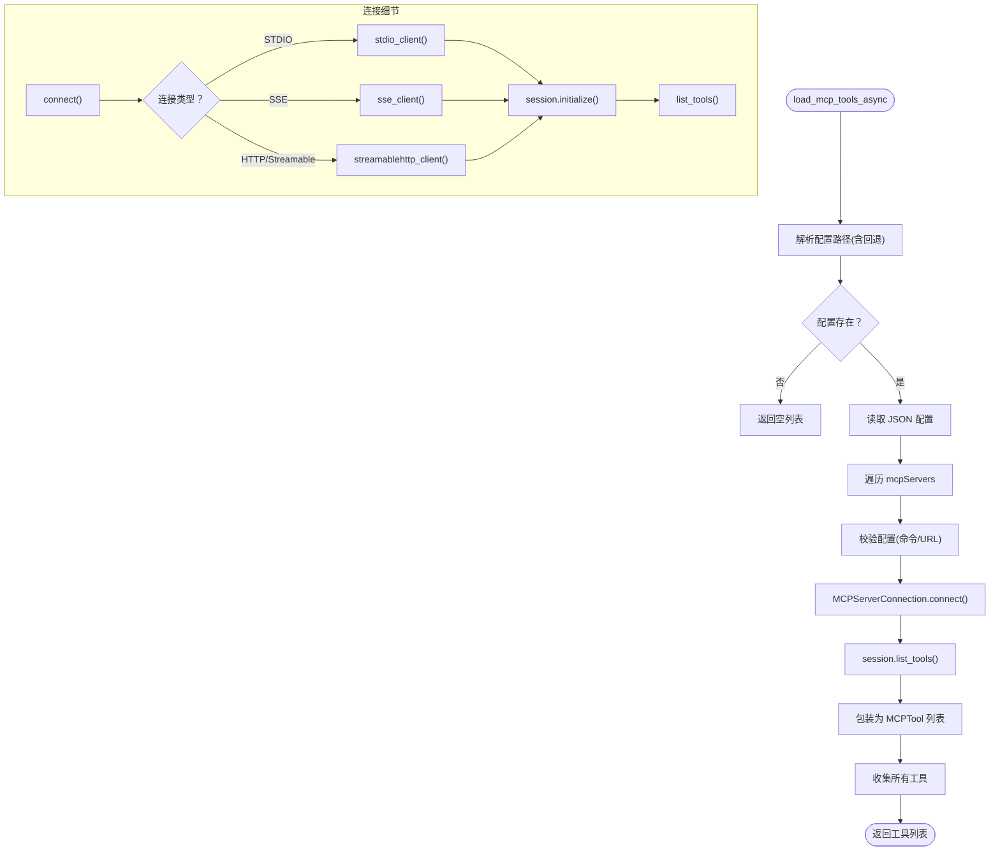
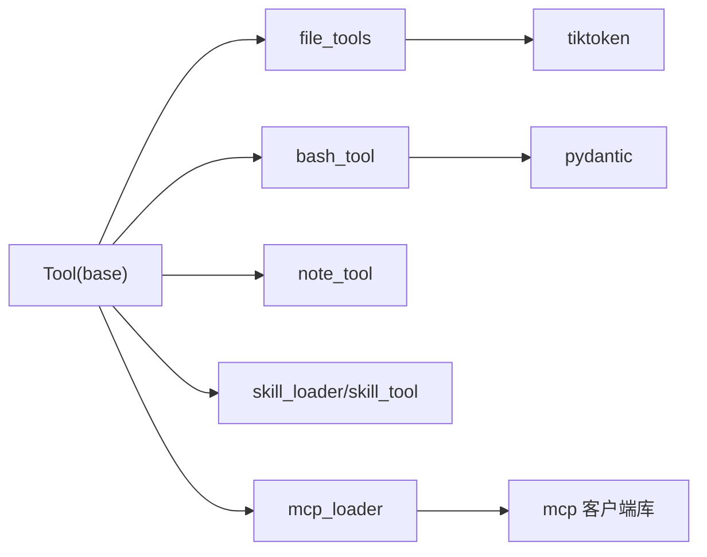

# 工具注册与管理

<cite>
**本文档引用的文件**
- [mini_agent/tools/__init__.py](file://mini_agent/tools/__init__.py)
- [mini_agent/tools/base.py](file://mini_agent/tools/base.py)
- [mini_agent/tools/skill_loader.py](file://mini_agent/tools/skill_loader.py)
- [mini_agent/tools/skill_tool.py](file://mini_agent/tools/skill_tool.py)
- [mini_agent/tools/mcp_loader.py](file://mini_agent/tools/mcp_loader.py)
- [mini_agent/tools/bash_tool.py](file://mini_agent/tools/bash_tool.py)
- [mini_agent/tools/file_tools.py](file://mini_agent/tools/file_tools.py)
- [mini_agent/tools/note_tool.py](file://mini_agent/tools/note_tool.py)
- [mini_agent/cli.py](file://mini_agent/cli.py)
- [examples/01_basic_tools.py](file://examples/01_basic_tools.py)
- [examples/06_tool_schema_demo.py](file://examples/06_tool_schema_demo.py)
- [tests/test_mcp.py](file://tests/test_mcp.py)
</cite>

## 目录
1. [简介](#简介)
2. [项目结构](#项目结构)
3. [核心组件](#核心组件)
4. [架构总览](#架构总览)
5. [详细组件分析](#详细组件分析)
6. [依赖关系分析](#依赖关系分析)
7. [性能考虑](#性能考虑)
8. [故障排查指南](#故障排查指南)
9. [结论](#结论)
10. [附录](#附录)

## 简介
本文件系统性阐述 MiniAgent 的工具注册与管理体系，覆盖以下主题：
- 动态加载：技能（Skill）与 MCP 工具的发现与加载
- 类型识别与接口适配：统一的 Tool 基类与多供应商工具模式
- 工具管理器：工具索引、查找与调度机制
- 依赖管理与冲突解决：路径解析、命名冲突与超时控制
- 配置与参数传递：统一的 JSON Schema 参数模型
- 生命周期管理：初始化、运行时管理与清理
- 缓存与性能优化：输出截断、后台进程监控与资源回收
- 最佳实践与常见问题：安全、并发与错误处理
- 自定义工具开发与集成：从基类到 CLI 注册的完整流程

## 项目结构
工具子系统位于 mini_agent/tools 目录，采用“按功能模块分层”的组织方式：
- base.py 定义 Tool 抽象基类与 ToolResult 结果模型
- 具体工具模块：bash_tool.py、file_tools.py、note_tool.py、mcp_loader.py、skill_loader.py、skill_tool.py
- 工具聚合入口：tools/__init__.py 汇总导出
- CLI 集成：cli.py 负责在启动时加载各类工具并注入 Agent

图表来源
- [mini_agent/tools/__init__.py:1-18](file://mini_agent/tools/__init__.py#L1-L18)
- [mini_agent/tools/base.py:16-56](file://mini_agent/tools/base.py#L16-L56)
- [mini_agent/tools/file_tools.py:63-286](file://mini_agent/tools/file_tools.py#L63-L286)
- [mini_agent/tools/bash_tool.py:217-618](file://mini_agent/tools/bash_tool.py#L217-L618)
- [mini_agent/tools/note_tool.py:17-214](file://mini_agent/tools/note_tool.py#L17-L214)
- [mini_agent/tools/skill_loader.py:47-257](file://mini_agent/tools/skill_loader.py#L47-L257)
- [mini_agent/tools/skill_tool.py:13-85](file://mini_agent/tools/skill_tool.py#L13-L85)
- [mini_agent/tools/mcp_loader.py:60-434](file://mini_agent/tools/mcp_loader.py#L60-L434)
- [mini_agent/cli.py:391-445](file://mini_agent/cli.py#L391-L445)

章节来源
- [mini_agent/tools/__init__.py:1-18](file://mini_agent/tools/__init__.py#L1-L18)
- [mini_agent/tools/base.py:16-56](file://mini_agent/tools/base.py#L16-L56)
- [mini_agent/cli.py:391-445](file://mini_agent/cli.py#L391-L445)

## 核心组件
- Tool 抽象基类：定义 name/description/parameters/schema 转换与异步 execute 接口
- ToolResult：统一的成功/失败、内容与错误信息载体
- 文件工具：读取、写入、编辑文件，支持行号格式化与 token 截断
- Bash 工具：跨平台命令执行，支持前台/后台、输出过滤与进程终止
- 会话笔记工具：记录与召回会话级记忆，持久化存储
- 技能加载器：从 SKILL.md 解析元数据与内容，支持路径规范化
- 技能工具：按需加载技能内容（渐进披露）
- MCP 加载器：连接远程 MCP 服务器，动态发现工具并包装为 Tool

章节来源
- [mini_agent/tools/base.py:16-56](file://mini_agent/tools/base.py#L16-L56)
- [mini_agent/tools/file_tools.py:63-286](file://mini_agent/tools/file_tools.py#L63-L286)
- [mini_agent/tools/bash_tool.py:217-618](file://mini_agent/tools/bash_tool.py#L217-L618)
- [mini_agent/tools/note_tool.py:17-214](file://mini_agent/tools/note_tool.py#L17-L214)
- [mini_agent/tools/skill_loader.py:47-257](file://mini_agent/tools/skill_loader.py#L47-L257)
- [mini_agent/tools/skill_tool.py:13-85](file://mini_agent/tools/skill_tool.py#L13-L85)
- [mini_agent/tools/mcp_loader.py:60-434](file://mini_agent/tools/mcp_loader.py#L60-L434)

## 架构总览
工具注册与管理的总体流程：
- 启动阶段：CLI 读取配置，设置 MCP 超时，加载技能工具与 MCP 工具
- 运行阶段：Agent 通过统一的 Tool 接口调用 execute；MCP 工具经由会话封装执行
- 清理阶段：关闭所有 MCP 连接，释放资源

图表来源
- [mini_agent/cli.py:391-445](file://mini_agent/cli.py#L391-L445)
- [mini_agent/tools/skill_tool.py:57-85](file://mini_agent/tools/skill_tool.py#L57-L85)
- [mini_agent/tools/skill_loader.py:194-257](file://mini_agent/tools/skill_loader.py#L194-L257)
- [mini_agent/tools/mcp_loader.py:330-434](file://mini_agent/tools/mcp_loader.py#L330-L434)

## 详细组件分析

### Tool 基类与结果模型
- 统一接口：name/description/parameters/schema 转换方法；异步 execute
- 结果模型：success/content/error 字段，便于上层统一处理
- 供应商适配：提供 to_schema()/to_openai_schema() 将工具暴露给不同 LLM

图表来源
- [mini_agent/tools/base.py:16-56](file://mini_agent/tools/base.py#L16-L56)

章节来源
- [mini_agent/tools/base.py:16-56](file://mini_agent/tools/base.py#L16-L56)

### 文件工具（Read/Write/Edit）
- 读取：支持偏移与限制行数，格式化为带行号的文本；超过 token 上限自动截断
- 写入：绝对/相对路径解析，自动创建父目录
- 编辑：精确字符串替换，要求唯一匹配以避免误改

图表来源
- [mini_agent/tools/file_tools.py:108-153](file://mini_agent/tools/file_tools.py#L108-L153)

章节来源
- [mini_agent/tools/file_tools.py:63-286](file://mini_agent/tools/file_tools.py#L63-L286)

### Bash 工具（前台/后台执行）
- 前台：设置超时，等待完成，返回 stdout/stderr/exit_code
- 后台：创建独立进程，分配 bash_id，持续监控输出，支持过滤与终止
- 资源管理：BackgroundShellManager 统一管理生命周期，确保退出清理

图表来源
- [mini_agent/tools/bash_tool.py:309-439](file://mini_agent/tools/bash_tool.py#L309-L439)
- [mini_agent/tools/bash_tool.py:441-533](file://mini_agent/tools/bash_tool.py#L441-L533)
- [mini_agent/tools/bash_tool.py:535-618](file://mini_agent/tools/bash_tool.py#L535-L618)

章节来源
- [mini_agent/tools/bash_tool.py:217-618](file://mini_agent/tools/bash_tool.py#L217-L618)

### 会话笔记工具（记录与召回）
- 记录：将带时间戳与分类的笔记追加到 JSON 文件
- 召回：可选按分类过滤，格式化输出
- 存储：惰性初始化，首次写入才创建目录与文件

图表来源
- [mini_agent/tools/note_tool.py:91-126](file://mini_agent/tools/note_tool.py#L91-L126)
- [mini_agent/tools/note_tool.py:163-214](file://mini_agent/tools/note_tool.py#L163-L214)

章节来源
- [mini_agent/tools/note_tool.py:17-214](file://mini_agent/tools/note_tool.py#L17-L214)

### 技能加载器与技能工具
- 技能加载：扫描 skills 目录下的 SKILL.md，解析 YAML 头部与正文，规范化相对路径
- 渐进披露：仅提供 get_skill 工具，系统提示中列出可用技能，按需加载
- 元数据提示：生成仅包含名称与描述的提示，实现第一级渐进披露

图表来源
- [mini_agent/tools/skill_tool.py:57-85](file://mini_agent/tools/skill_tool.py#L57-L85)
- [mini_agent/tools/skill_loader.py:194-257](file://mini_agent/tools/skill_loader.py#L194-L257)

章节来源
- [mini_agent/tools/skill_loader.py:47-257](file://mini_agent/tools/skill_loader.py#L47-L257)
- [mini_agent/tools/skill_tool.py:13-85](file://mini_agent/tools/skill_tool.py#L13-L85)

### MCP 工具加载与连接管理
- 配置解析：优先使用用户配置，不存在则回退到示例模板
- 连接类型：STDIO、SSE、HTTP、Streamable HTTP，自动检测或显式指定
- 工具发现：连接后调用 list_tools，逐个包装为 MCPTool
- 超时控制：全局默认与每服务器覆盖，分别用于连接、执行与 SSE 读取
- 清理机制：统一断开连接，释放资源

图表来源
- [mini_agent/tools/mcp_loader.py:330-434](file://mini_agent/tools/mcp_loader.py#L330-L434)
- [mini_agent/tools/mcp_loader.py:122-282](file://mini_agent/tools/mcp_loader.py#L122-L282)

章节来源
- [mini_agent/tools/mcp_loader.py:60-434](file://mini_agent/tools/mcp_loader.py#L60-L434)

### CLI 集成与工具注册
- 技能工具：create_skill_tools 发现并注入 get_skill 工具
- MCP 工具：set_mcp_timeout_config 应用配置，load_mcp_tools_async 加载
- 工作区工具：根据工作目录创建需要上下文的工具实例
- 统一注入：最终合并为工具列表供 Agent 使用

章节来源
- [mini_agent/cli.py:391-445](file://mini_agent/cli.py#L391-L445)
- [mini_agent/cli.py:416-445](file://mini_agent/cli.py#L416-L445)

## 依赖关系分析
- 组件内聚：各工具模块围绕单一职责（文件、Bash、笔记、技能、MCP）设计
- 组件耦合：均依赖 base.Tool 作为统一抽象；MCP 依赖外部 mcp 客户端库；文件工具依赖 tiktoken
- 外部依赖：mcp、tiktoken、pydantic（模型验证）

图表来源
- [mini_agent/tools/base.py:16-56](file://mini_agent/tools/base.py#L16-L56)
- [mini_agent/tools/file_tools.py:1-286](file://mini_agent/tools/file_tools.py#L1-L286)
- [mini_agent/tools/bash_tool.py:1-618](file://mini_agent/tools/bash_tool.py#L1-L618)
- [mini_agent/tools/mcp_loader.py:1-434](file://mini_agent/tools/mcp_loader.py#L1-L434)

## 性能考虑
- 输出截断：大文件读取时基于 token 数量进行智能截断，保留首尾并标注中间省略
- 后台进程监控：异步读取 stdout，低频轮询与超时保护，避免阻塞
- 超时控制：连接、执行与 SSE 读取分别设置超时，防止长时间阻塞
- 并发执行：文件读取支持并行多次调用，提升吞吐
- 资源回收：后台进程终止时清理监控任务与状态，MCP 断开连接统一清理

章节来源
- [mini_agent/tools/file_tools.py:11-61](file://mini_agent/tools/file_tools.py#L11-L61)
- [mini_agent/tools/bash_tool.py:136-190](file://mini_agent/tools/bash_tool.py#L136-L190)
- [mini_agent/tools/mcp_loader.py:21-57](file://mini_agent/tools/mcp_loader.py#L21-L57)

## 故障排查指南
- MCP 配置缺失：若未找到配置文件，自动回退到示例模板；仍失败则检查路径与权限
- 连接超时：调整 set_mcp_timeout_config 或在配置中为服务器单独设置超时
- 工具名冲突：MCP 规范建议使用前缀策略区分同名工具；客户端应避免重复注册
- Bash 执行失败：检查命令合法性、路径与权限；必要时增大超时或改为后台执行
- 文件读取异常：确认路径解析（相对/绝对）、编码与权限；注意大文件的 token 截断
- 笔记存储：首次写入会创建目录，若失败检查工作目录权限

章节来源
- [mini_agent/tools/mcp_loader.py:329-371](file://mini_agent/tools/mcp_loader.py#L329-L371)
- [mini_agent/tools/mcp_loader.py:217-232](file://mini_agent/tools/mcp_loader.py#L217-L232)
- [mini_agent/tools/bash_tool.py:327-439](file://mini_agent/tools/bash_tool.py#L327-L439)
- [mini_agent/tools/file_tools.py:108-153](file://mini_agent/tools/file_tools.py#L108-L153)
- [mini_agent/tools/note_tool.py:82-90](file://mini_agent/tools/note_tool.py#L82-L90)

## 结论
MiniAgent 的工具体系以 Tool 抽象为核心，结合文件、Bash、笔记、技能与 MCP 工具，形成统一的动态加载与调度框架。通过 JSON Schema 参数模型与多供应商适配方法，实现了跨 LLM 的工具兼容；通过超时控制、后台进程管理与资源回收，保障了运行时稳定性与性能。CLI 层负责装配与注入，测试用例验证了 MCP 工具的加载与可用性。

## 附录

### 工具注册最佳实践
- 明确工具职责：每个工具聚焦单一能力，参数使用严格 JSON Schema
- 输入验证：在工具内部进行参数校验与安全检查（如路径、URL、命令）
- 错误处理：将错误信息放入 ToolResult.error，避免抛出未捕获异常
- 渐进披露：技能工具仅暴露元数据，按需加载详细内容
- 命名规范：避免同名冲突，必要时使用前缀策略
- 超时与重试：为耗时操作设置合理超时，必要时在上层进行重试

章节来源
- [mini_agent/tools/skill_loader.py:237-257](file://mini_agent/tools/skill_loader.py#L237-L257)
- [mini_agent/tools/mcp_loader.py:639-646](file://mini_agent/tools/mcp_loader.py#L639-L646)

### 自定义工具开发与集成流程
- 继承 Tool：实现 name/description/parameters/execute
- 参数模型：使用 JSON Schema 描述输入，声明必填字段
- 结果模型：返回 ToolResult，success/content/error
- 适配多供应商：使用 to_schema()/to_openai_schema() 导出
- 注册到 CLI：在 tools/__init__.py 汇总导出，并在 cli.py 中注入
- 示例参考：基础工具使用与工具 Schema 转换示例

章节来源
- [examples/01_basic_tools.py:19-138](file://examples/01_basic_tools.py#L19-L138)
- [examples/06_tool_schema_demo.py:24-151](file://examples/06_tool_schema_demo.py#L24-L151)
- [mini_agent/tools/__init__.py:1-18](file://mini_agent/tools/__init__.py#L1-L18)
- [mini_agent/cli.py:391-445](file://mini_agent/cli.py#L391-L445)

### 工具生命周期管理
- 初始化：构造函数中准备上下文（如工作目录、连接参数）
- 运行时：execute 中执行业务逻辑，注意异步与超时
- 清理：MCP 连接断开；后台进程终止与监控清理；文件句柄关闭

章节来源
- [mini_agent/tools/mcp_loader.py:428-434](file://mini_agent/tools/mcp_loader.py#L428-L434)
- [mini_agent/tools/bash_tool.py:191-214](file://mini_agent/tools/bash_tool.py#L191-L214)

### 工具依赖管理与冲突解决
- 路径解析：统一使用绝对路径，避免相对路径导致的不确定性
- 命名冲突：使用服务器名/URI 前缀或随机前缀区分同名工具
- 并发与隔离：后台 Bash 进程独立管理，避免相互干扰

章节来源
- [mini_agent/tools/skill_loader.py:119-193](file://mini_agent/tools/skill_loader.py#L119-L193)
- [mini_agent/tools/mcp_loader.py:639-646](file://mini_agent/tools/mcp_loader.py#L639-L646)
- [mini_agent/tools/bash_tool.py:108-190](file://mini_agent/tools/bash_tool.py#L108-L190)

### 工具配置与参数传递
- 配置优先级：用户配置优先，不存在时回退示例模板
- 参数传递：统一使用 JSON Schema，CLI 与工具内部保持一致
- 测试验证：通过测试用例验证 MCP 工具加载与可用性

章节来源
- [mini_agent/tools/mcp_loader.py:299-328](file://mini_agent/tools/mcp_loader.py#L299-L328)
- [tests/test_mcp.py:366-399](file://tests/test_mcp.py#L366-L399)