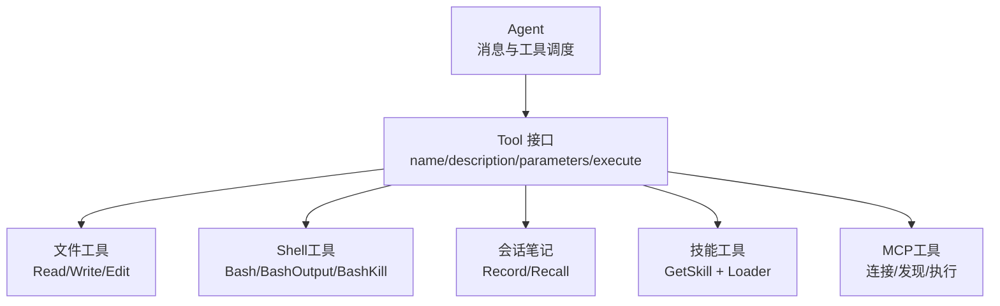
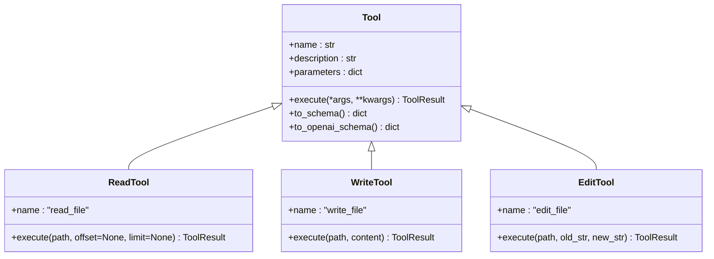
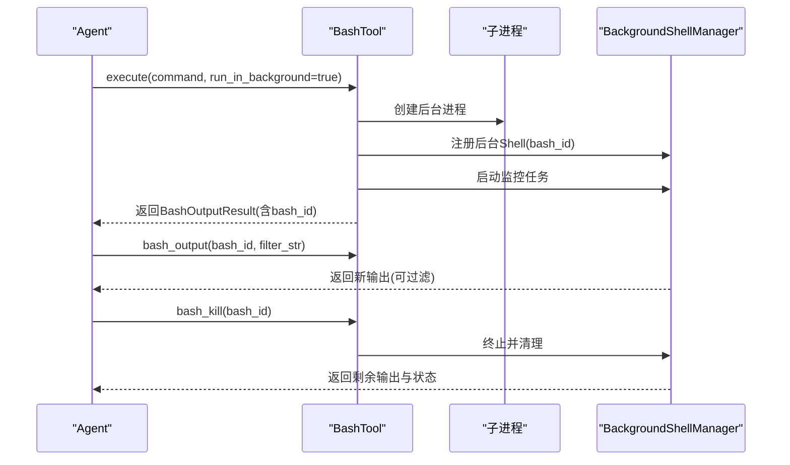
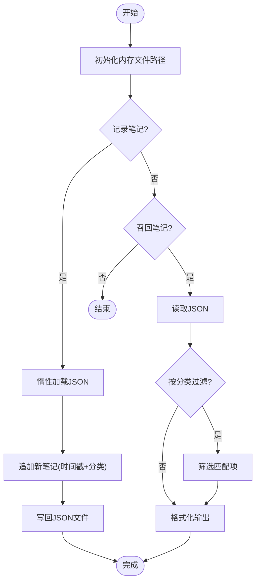
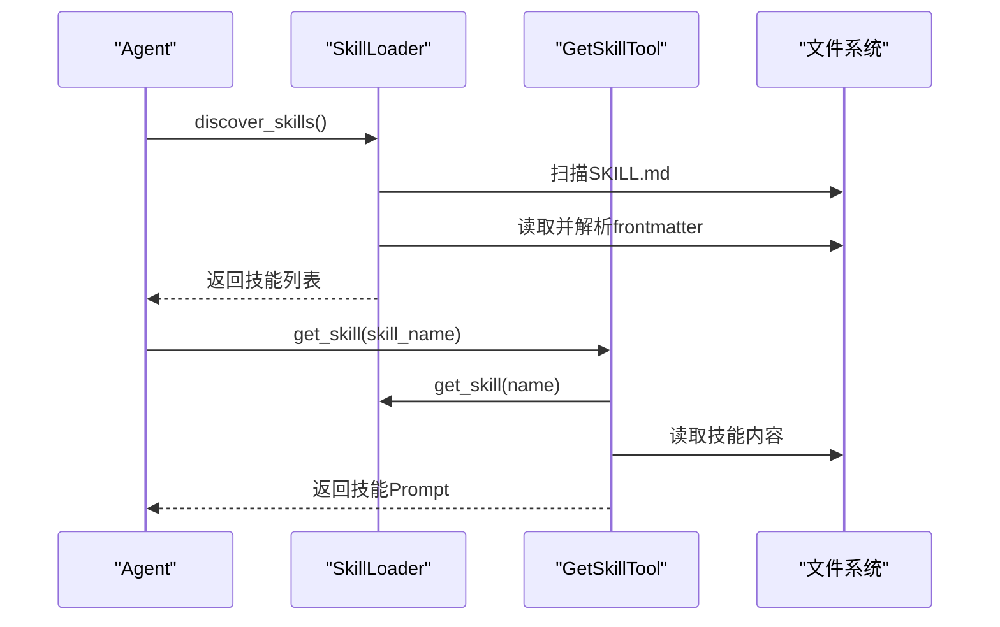
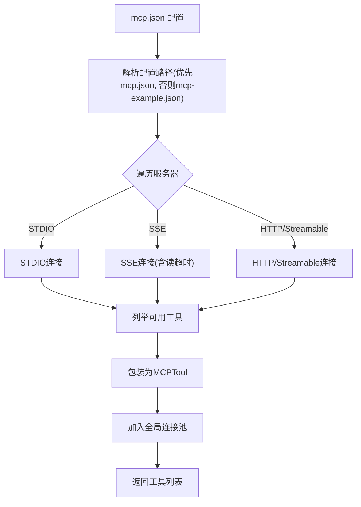
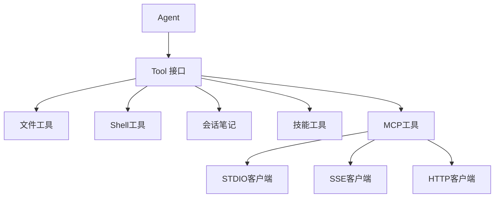

# 工具系统

<cite>
**本文引用的文件**
- [mini_agent/tools/base.py](file://mini_agent/tools/base.py)
- [mini_agent/tools/__init__.py](file://mini_agent/tools/__init__.py)
- [mini_agent/tools/file_tools.py](file://mini_agent/tools/file_tools.py)
- [mini_agent/tools/bash_tool.py](file://mini_agent/tools/bash_tool.py)
- [mini_agent/tools/note_tool.py](file://mini_agent/tools/note_tool.py)
- [mini_agent/tools/skill_loader.py](file://mini_agent/tools/skill_loader.py)
- [mini_agent/tools/skill_tool.py](file://mini_agent/tools/skill_tool.py)
- [mini_agent/tools/mcp_loader.py](file://mini_agent/tools/mcp_loader.py)
- [examples/01_basic_tools.py](file://examples/01_basic_tools.py)
- [examples/03_session_notes.py](file://examples/03_session_notes.py)
- [mini_agent/config/config-example.yaml](file://mini_agent/config/config-example.yaml)
- [mini_agent/config/mcp-example.json](file://mini_agent/config/mcp-example.json)
- [mini_agent/agent.py](file://mini_agent/agent.py)
- [tests/test_tools.py](file://tests/test_tools.py)
- [mini_agent/skills/agent_skills_spec.md](file://mini_agent/skills/agent_skills_spec.md)
- [mini_agent/skills/algorithmic-art/SKILL.md](file://mini_agent/skills/algorithmic-art/SKILL.md)
</cite>

## 目录
1. [简介](#简介)
2. [项目结构](#项目结构)
3. [核心组件](#核心组件)
4. [架构总览](#架构总览)
5. [详细组件分析](#详细组件分析)
6. [依赖关系分析](#依赖关系分析)
7. [性能考量](#性能考量)
8. [故障排查指南](#故障排查指南)
9. [结论](#结论)
10. [附录](#附录)

## 简介
本文件系统化阐述工具系统的整体设计与实现，覆盖抽象基类与接口规范、内置工具（文件操作、Shell 命令、会话笔记）、工具注册与管理机制、Claude Skills 集成、MCP 工具集成、以及自定义工具开发指南。文档以循序渐进的方式呈现，既适合快速上手，也便于深入理解系统架构与扩展点。

## 项目结构
工具系统位于 mini_agent/tools 模块中，围绕统一的 Tool 抽象基类构建，提供文件读写编辑、Shell 命令执行、会话记忆、技能加载与 MCP 远程工具等能力。入口模块导出常用工具，便于在 Agent 中直接组合使用。

```mermaid
graph TB
subgraph "工具模块"
base["base.py<br/>抽象基类与结果模型"]
file["file_tools.py<br/>文件读写编辑"]
bash["bash_tool.py<br/>Shell命令与后台进程"]
note["note_tool.py<br/>会话笔记"]
skill_loader["skill_loader.py<br/>技能加载器"]
skill_tool["skill_tool.py<br/>技能工具"]
mcp_loader["mcp_loader.py<br/>MCP工具加载器"]
tools_init["__init__.py<br/>工具导出"]
end
base --> file
base --> bash
base --> note
base --> skill_loader
base --> skill_tool
base --> mcp_loader
tools_init --> base
tools_init --> file
tools_init --> bash
tools_init --> note
```

**图表来源**
- [mini_agent/tools/base.py:1-56](file://mini_agent/tools/base.py#L1-L56)
- [mini_agent/tools/file_tools.py:1-286](file://mini_agent/tools/file_tools.py#L1-L286)
- [mini_agent/tools/bash_tool.py:1-618](file://mini_agent/tools/bash_tool.py#L1-L618)
- [mini_agent/tools/note_tool.py:1-214](file://mini_agent/tools/note_tool.py#L1-L214)
- [mini_agent/tools/skill_loader.py:1-257](file://mini_agent/tools/skill_loader.py#L1-L257)
- [mini_agent/tools/skill_tool.py:1-85](file://mini_agent/tools/skill_tool.py#L1-L85)
- [mini_agent/tools/mcp_loader.py:1-434](file://mini_agent/tools/mcp_loader.py#L1-L434)
- [mini_agent/tools/__init__.py:1-18](file://mini_agent/tools/__init__.py#L1-L18)

**章节来源**
- [mini_agent/tools/__init__.py:1-18](file://mini_agent/tools/__init__.py#L1-L18)

## 核心组件
- 抽象基类与结果模型
  - Tool：定义工具名称、描述、参数模式、异步执行接口，并提供转换为 Anthropic/OpenAI 工具模式的能力。
  - ToolResult：标准化工具执行结果，包含成功标志、内容与错误信息。
- 工具注册与导出
  - 通过 __init__.py 将常用工具集中导出，便于外部按需导入与组合。

**章节来源**
- [mini_agent/tools/base.py:8-56](file://mini_agent/tools/base.py#L8-L56)
- [mini_agent/tools/__init__.py:3-17](file://mini_agent/tools/__init__.py#L3-L17)

## 架构总览
工具系统采用“统一抽象 + 多实现”的分层设计：
- 上层：Agent 仅依赖 Tool 接口，通过工具列表进行调度。
- 中层：具体工具实现（文件、Shell、笔记、技能、MCP）遵循统一接口。
- 下层：外部系统（文件系统、子进程、网络服务、本地可执行程序）由各工具封装接入。

**图表来源**
- [mini_agent/agent.py:45-85](file://mini_agent/agent.py#L45-L85)
- [mini_agent/tools/base.py:16-56](file://mini_agent/tools/base.py#L16-L56)
- [mini_agent/tools/file_tools.py:63-286](file://mini_agent/tools/file_tools.py#L63-L286)
- [mini_agent/tools/bash_tool.py:217-618](file://mini_agent/tools/bash_tool.py#L217-L618)
- [mini_agent/tools/note_tool.py:17-214](file://mini_agent/tools/note_tool.py#L17-L214)
- [mini_agent/tools/skill_loader.py:47-257](file://mini_agent/tools/skill_loader.py#L47-L257)
- [mini_agent/tools/mcp_loader.py:60-434](file://mini_agent/tools/mcp_loader.py#L60-L434)

## 详细组件分析

### 文件操作工具
- ReadTool
  - 功能：读取文件内容，支持行号格式化输出；对大文件支持 offset/limit 分段读取；自动按 token 限额截断。
  - 参数：path（必填），offset（可选），limit（可选）。
  - 路径解析：相对路径基于工作目录解析，确保安全边界。
- WriteTool
  - 功能：写入完整内容到文件，覆盖式写入；自动创建父目录。
  - 参数：path（必填），content（必填）。
- EditTool
  - 功能：精确字符串替换；要求旧字符串在文件中唯一出现，否则失败；保留缩进与格式。
  - 参数：path（必填），old_str（必填），new_str（必填）。

**图表来源**
- [mini_agent/tools/base.py:16-56](file://mini_agent/tools/base.py#L16-L56)
- [mini_agent/tools/file_tools.py:63-286](file://mini_agent/tools/file_tools.py#L63-L286)

**章节来源**
- [mini_agent/tools/file_tools.py:11-286](file://mini_agent/tools/file_tools.py#L11-L286)

### Shell 命令工具
- BashTool
  - 功能：前台/后台执行命令；自动识别平台（Windows 使用 PowerShell，类 Unix 使用 bash）；支持超时控制。
  - 参数：command（必填），timeout（可选，默认 120，最大 600），run_in_background（可选）。
  - 结果：BashOutputResult，包含 stdout、stderr、exit_code、bash_id（后台时）。
- BashOutputTool
  - 功能：获取后台 Shell 的新输出，支持正则过滤。
  - 参数：bash_id（必填），filter_str（可选）。
- BashKillTool
  - 功能：终止后台 Shell，清理资源。
  - 参数：bash_id（必填）。
- 后台管理
  - BackgroundShell：存储进程状态与输出缓冲。
  - BackgroundShellManager：集中管理后台 Shell，监控输出、终止进程、清理资源。

**图表来源**
- [mini_agent/tools/bash_tool.py:217-618](file://mini_agent/tools/bash_tool.py#L217-L618)

**章节来源**
- [mini_agent/tools/bash_tool.py:18-618](file://mini_agent/tools/bash_tool.py#L18-L618)

### 会话笔记工具
- SessionNoteTool
  - 功能：记录带时间戳与分类的笔记，保存至 JSON 文件；首次写入时惰性创建目录。
  - 参数：content（必填），category（可选）。
- RecallNoteTool
  - 功能：召回所有或指定分类的笔记，格式化输出。
  - 参数：category（可选）。
- 存储策略：内存惰性加载，磁盘 JSON 文件持久化，避免不必要的 IO。

**图表来源**
- [mini_agent/tools/note_tool.py:17-214](file://mini_agent/tools/note_tool.py#L17-L214)

**章节来源**
- [mini_agent/tools/note_tool.py:17-214](file://mini_agent/tools/note_tool.py#L17-L214)

### Claude Skills 集成
- 技能发现与加载
  - SkillLoader：递归扫描 skills 目录下的 SKILL.md，解析 YAML frontmatter，处理内容中的相对路径，生成 Skill 对象。
  - 支持三种路径处理：目录引用（scripts/references/assets）、文档引用（forms.md）、Markdown 链接。
- 技能工具
  - GetSkillTool：按名称返回技能完整内容（Prompt 格式），用于按需加载。
  - create_skill_tools：创建技能工具集合（当前仅提供 get_skill），配合系统提示中的元数据提示实现“渐进披露”。
- 渐进披露（Progressive Disclosure）
  - Level 1：系统提示列出可用技能名称与描述。
  - Level 2：Agent 请求 get_skill 获取技能全文后再执行。

**图表来源**
- [mini_agent/tools/skill_loader.py:47-257](file://mini_agent/tools/skill_loader.py#L47-L257)
- [mini_agent/tools/skill_tool.py:13-85](file://mini_agent/tools/skill_tool.py#L13-L85)

**章节来源**
- [mini_agent/tools/skill_loader.py:47-257](file://mini_agent/tools/skill_loader.py#L47-L257)
- [mini_agent/tools/skill_tool.py:13-85](file://mini_agent/tools/skill_tool.py#L13-L85)
- [mini_agent/skills/agent_skills_spec.md:1-56](file://mini_agent/skills/agent_skills_spec.md#L1-L56)

### MCP 工具集成
- 连接类型
  - 支持 STDIO、SSE、HTTP、Streamable HTTP 四种传输方式；自动检测或显式指定。
- 连接管理
  - MCPServerConnection：建立会话、列举工具、包装为 Tool；支持连接/执行超时与 SSE 读超时。
  - 全局连接池：维护已连接服务器，统一断开清理。
- 工具包装
  - MCPTool：将远端工具封装为 Tool，统一执行接口与超时处理。
- 配置与加载
  - load_mcp_tools_async：从 mcp.json 加载服务器配置，连接并返回工具列表；支持用户拷贝示例配置文件。
  - set_mcp_timeout_config/get_mcp_timeout_config：全局超时配置。

**图表来源**
- [mini_agent/tools/mcp_loader.py:330-434](file://mini_agent/tools/mcp_loader.py#L330-L434)
- [mini_agent/config/mcp-example.json:1-29](file://mini_agent/config/mcp-example.json#L1-L29)

**章节来源**
- [mini_agent/tools/mcp_loader.py:60-434](file://mini_agent/tools/mcp_loader.py#L60-L434)
- [mini_agent/config/mcp-example.json:1-29](file://mini_agent/config/mcp-example.json#L1-L29)

### 工具注册与管理机制
- 导出与聚合
  - 通过 __init__.py 聚合导出常用工具，便于 Agent 组合使用。
- 生命周期管理
  - 文件/Shell/笔记：进程内对象，按需创建；MCP：连接池统一管理，退出时清理。
- 动态加载
  - 技能：运行时扫描目录、解析文件、按需加载。
  - MCP：按配置连接远程服务器，动态发现工具。

**章节来源**
- [mini_agent/tools/__init__.py:3-17](file://mini_agent/tools/__init__.py#L3-L17)
- [mini_agent/tools/mcp_loader.py:428-434](file://mini_agent/tools/mcp_loader.py#L428-L434)

## 依赖关系分析
- 组件耦合
  - Agent 仅依赖 Tool 接口，耦合度低，便于扩展新工具。
  - 各工具内部对第三方库（如 asyncio、pydantic、tiktoken）有少量依赖，但对外保持一致接口。
- 外部依赖
  - 文件系统：Read/Write/EditTool。
  - 子进程：BashTool 及其后台管理。
  - 网络：MCP 连接（STDIO/HTTP/SSE）。
  - 第三方技能：通过 SKILL.md 规范加载。

**图表来源**
- [mini_agent/agent.py:45-85](file://mini_agent/agent.py#L45-L85)
- [mini_agent/tools/base.py:16-56](file://mini_agent/tools/base.py#L16-L56)
- [mini_agent/tools/mcp_loader.py:10-15](file://mini_agent/tools/mcp_loader.py#L10-L15)

**章节来源**
- [mini_agent/agent.py:45-85](file://mini_agent/agent.py#L45-L85)

## 性能考量
- 文件读取
  - 大文件分段读取与 token 截断，避免单次输出过大导致上下文溢出。
- Shell 执行
  - 前台命令支持超时，后台命令通过独立进程与监控任务管理输出与资源。
- 技能加载
  - 惰性加载与路径预处理，减少不必要的 IO 与路径解析成本。
- MCP 连接
  - 连接/执行/读超时配置，防止阻塞与资源泄漏。

[本节为通用指导，无需特定文件引用]

## 故障排查指南
- 文件工具
  - 文件不存在：返回错误信息；检查路径是否相对工作目录正确。
  - 编辑失败：旧字符串未找到或不唯一；先读取确认再编辑。
- Shell 工具
  - 前台超时：调整 timeout 或改用后台执行；检查命令是否卡死。
  - 后台未找到：确认 bash_id 是否正确；查看可用 ID 列表。
- 会话笔记
  - 写入失败：检查磁盘权限与路径；确认 JSON 文件未被破坏。
- 技能加载
  - 缺少 YAML frontmatter：确保 SKILL.md 开头包含合法 frontmatter。
  - 路径引用无效：确认相对路径在技能根目录下存在。
- MCP 工具
  - 连接超时：检查服务器可达性与凭据；调整连接/执行超时。
  - 工具执行失败：查看远端返回的错误信息；确认参数 schema 与工具名一致。

**章节来源**
- [tests/test_tools.py:12-112](file://tests/test_tools.py#L12-L112)
- [mini_agent/tools/file_tools.py:108-153](file://mini_agent/tools/file_tools.py#L108-L153)
- [mini_agent/tools/bash_tool.py:309-438](file://mini_agent/tools/bash_tool.py#L309-L438)
- [mini_agent/tools/note_tool.py:91-125](file://mini_agent/tools/note_tool.py#L91-L125)
- [mini_agent/tools/skill_loader.py:60-117](file://mini_agent/tools/skill_loader.py#L60-L117)
- [mini_agent/tools/mcp_loader.py:330-425](file://mini_agent/tools/mcp_loader.py#L330-L425)

## 结论
工具系统以统一抽象为核心，结合文件、Shell、笔记、技能与 MCP 等多种实现，形成高内聚、低耦合的扩展框架。通过渐进披露与动态加载机制，系统在保证安全性的同时提供了强大的能力组合与远程扩展能力。建议在生产环境中合理设置超时与日志，严格管理工作目录与权限，并利用配置文件与示例模板快速集成 MCP 与技能生态。

[本节为总结，无需特定文件引用]

## 附录

### 使用示例与场景
- 基础工具示例
  - 展示如何直接调用 ReadTool/WriteTool/EditTool/BashTool，验证基本功能与错误处理。
- 会话笔记示例
  - 展示直接使用 SessionNoteTool/RecallNoteTool，以及在 Agent 中集成会话记忆的完整流程。

**章节来源**
- [examples/01_basic_tools.py:1-138](file://examples/01_basic_tools.py#L1-L138)
- [examples/03_session_notes.py:1-251](file://examples/03_session_notes.py#L1-L251)

### 配置参考
- 工具开关与默认路径
  - 在配置文件中启用/禁用各类工具，并设置工作目录与技能/MCP 配置路径。
- MCP 示例配置
  - 提供 STDIO 与禁用服务器示例，便于复制与定制。

**章节来源**
- [mini_agent/config/config-example.yaml:41-61](file://mini_agent/config/config-example.yaml#L41-L61)
- [mini_agent/config/mcp-example.json:1-29](file://mini_agent/config/mcp-example.json#L1-L29)

### 自定义工具开发指南
- 实现步骤
  - 继承 Tool，实现 name/description/parameters/execute。
  - 在 execute 中处理输入校验、调用外部能力、封装为 ToolResult。
  - 如需与 LLM 对接，可使用 to_schema()/to_openai_schema() 生成工具描述。
- 测试与发布
  - 单元测试：参考现有工具测试用例，覆盖成功/失败/边界场景。
  - 文档与示例：提供最小可运行示例，说明参数与预期行为。
  - 发布：遵循项目贡献规范，提交 PR 并附带变更说明。

**章节来源**
- [mini_agent/tools/base.py:16-56](file://mini_agent/tools/base.py#L16-L56)
- [tests/test_tools.py:12-112](file://tests/test_tools.py#L12-L112)