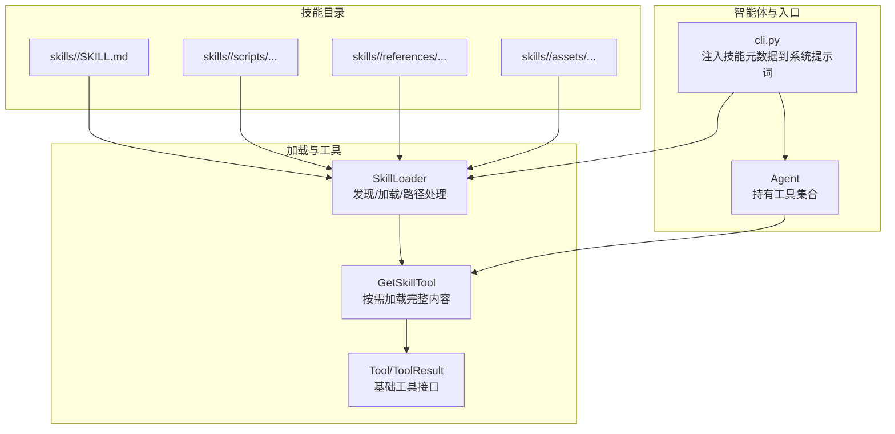
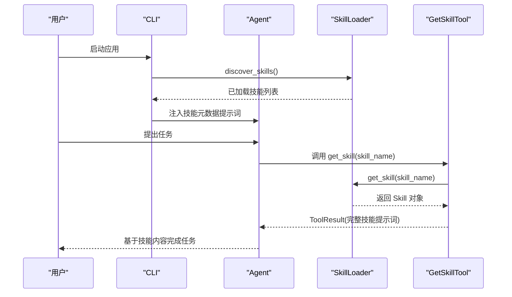
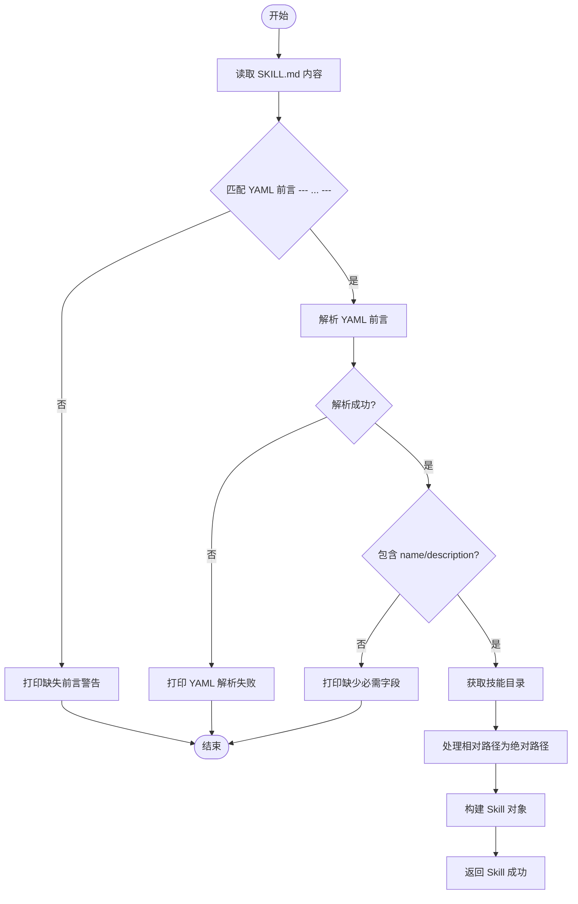
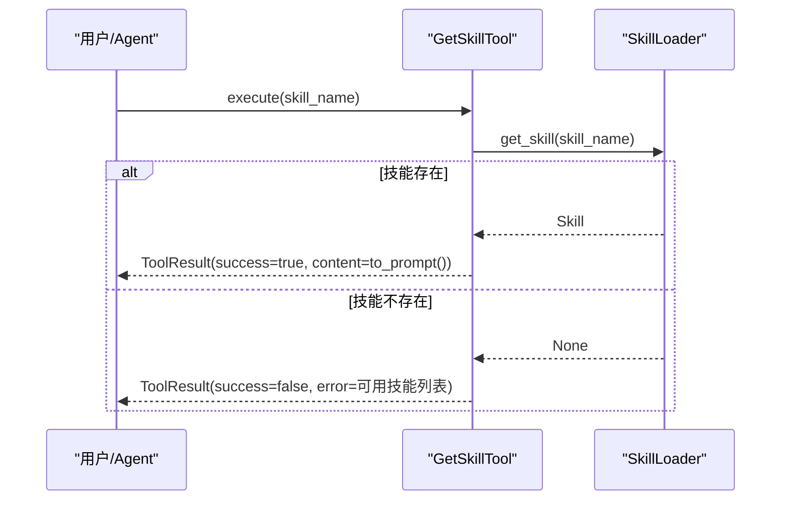
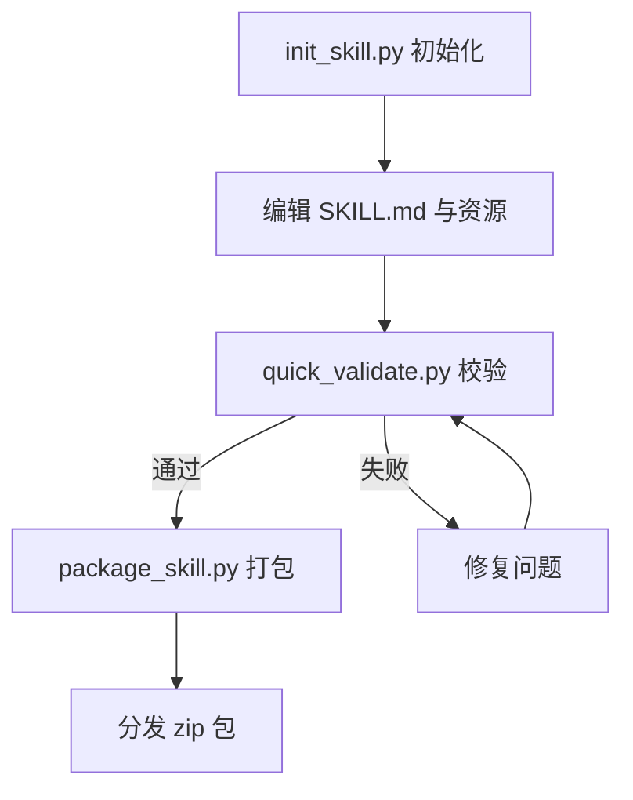
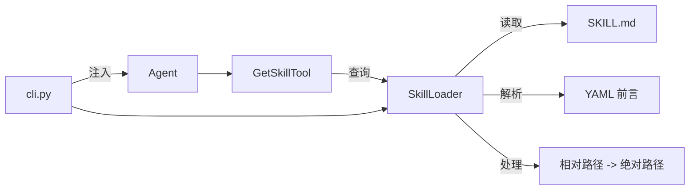

# 技能加载器

<cite>
**本文引用的文件**
- [mini_agent/tools/skill_loader.py](file://mini_agent/tools/skill_loader.py)
- [mini_agent/tools/skill_tool.py](file://mini_agent/tools/skill_tool.py)
- [mini_agent/tools/base.py](file://mini_agent/tools/base.py)
- [mini_agent/agent.py](file://mini_agent/agent.py)
- [mini_agent/cli.py](file://mini_agent/cli.py)
- [mini_agent/skills/agent_skills_spec.md](file://mini_agent/skills/agent_skills_spec.md)
- [mini_agent/skills/template-skill/SKILL.md](file://mini_agent/skills/template-skill/SKILL.md)
- [mini_agent/skills/document-skills/docx/SKILL.md](file://mini_agent/skills/document-skills/docx/SKILL.md)
- [mini_agent/skills/skill-creator/SKILL.md](file://mini_agent/skills/skill-creator/SKILL.md)
- [mini_agent/skills/skill-creator/scripts/init_skill.py](file://mini_agent/skills/skill-creator/scripts/init_skill.py)
- [mini_agent/skills/skill-creator/scripts/package_skill.py](file://mini_agent/skills/skill-creator/scripts/package_skill.py)
- [mini_agent/skills/skill-creator/scripts/quick_validate.py](file://mini_agent/skills/skill-creator/scripts/quick_validate.py)
- [tests/test_skill_loader.py](file://tests/test_skill_loader.py)
- [tests/test_skill_tool.py](file://tests/test_skill_tool.py)
</cite>

## 目录
1. [简介](#简介)
2. [项目结构](#项目结构)
3. [核心组件](#核心组件)
4. [架构总览](#架构总览)
5. [详细组件分析](#详细组件分析)
6. [依赖分析](#依赖分析)
7. [性能考虑](#性能考虑)
8. [故障排查指南](#故障排查指南)
9. [结论](#结论)
10. [附录](#附录)

## 简介
本文件系统性阐述 MiniAgent 中“技能加载器”的设计与实现，重点覆盖以下方面：
- Claude Skills 的发现与加载机制：目录扫描、元数据解析、内容路径处理
- 技能配置文件（SKILL.md）的 YAML/JSON 前言解析与校验
- 技能工具的动态注册与生命周期管理
- 技能参数验证与类型转换机制
- 技能开发与发布全流程：目录结构、配置文件编写、打包与测试
- 技能与智能体的集成方式：工具注册与按需调用
- 加载器扩展点与自定义配置选项

## 项目结构
技能体系围绕“技能目录”与“SKILL.md”展开，CLI 在启动时注入技能元数据到系统提示词，并在运行期通过工具按需加载完整技能内容。

图表来源
- [mini_agent/cli.py:589-601](file://mini_agent/cli.py#L589-L601)
- [mini_agent/tools/skill_loader.py:47-257](file://mini_agent/tools/skill_loader.py#L47-L257)
- [mini_agent/tools/skill_tool.py:13-84](file://mini_agent/tools/skill_tool.py#L13-L84)
- [mini_agent/agent.py:45-85](file://mini_agent/agent.py#L45-L85)

章节来源
- [mini_agent/cli.py:589-601](file://mini_agent/cli.py#L589-L601)
- [mini_agent/tools/skill_loader.py:47-257](file://mini_agent/tools/skill_loader.py#L47-L257)
- [mini_agent/tools/skill_tool.py:13-84](file://mini_agent/tools/skill_tool.py#L13-L84)
- [mini_agent/agent.py:45-85](file://mini_agent/agent.py#L45-L85)

## 核心组件
- SkillLoader：负责扫描技能目录、解析 SKILL.md 的 YAML 前言、处理相对路径为绝对路径、构建 Skill 对象、维护已加载技能字典、生成技能元数据提示词。
- Skill：技能数据结构，包含名称、描述、内容、许可证、允许工具列表、元数据映射、技能路径等；提供 to_prompt 将技能转为提示词格式。
- GetSkillTool：单工具实现，用于按需获取指定技能的完整内容；支持参数校验（必填字段）与错误返回。
- Tool/ToolResult：工具基类与执行结果模型，统一工具接口与输出格式。
- Agent：持有工具集合，按需调用工具执行；CLI 注入技能元数据到系统提示词后交由 Agent 使用。

章节来源
- [mini_agent/tools/skill_loader.py:15-45](file://mini_agent/tools/skill_loader.py#L15-L45)
- [mini_agent/tools/skill_loader.py:47-257](file://mini_agent/tools/skill_loader.py#L47-L257)
- [mini_agent/tools/skill_tool.py:13-84](file://mini_agent/tools/skill_tool.py#L13-L84)
- [mini_agent/tools/base.py:8-56](file://mini_agent/tools/base.py#L8-L56)
- [mini_agent/agent.py:45-85](file://mini_agent/agent.py#L45-L85)

## 架构总览
技能加载器采用“发现-解析-按需加载”的渐进式披露策略：
- Level 1：系统提示词中仅包含技能元数据（名称+描述）
- Level 2：注册 get_skill 工具，按需加载完整技能内容
- Level 3+：在技能内容中将相对路径替换为绝对路径，便于后续读取资源

图表来源
- [mini_agent/cli.py:589-601](file://mini_agent/cli.py#L589-L601)
- [mini_agent/tools/skill_loader.py:194-236](file://mini_agent/tools/skill_loader.py#L194-L236)
- [mini_agent/tools/skill_tool.py:40-54](file://mini_agent/tools/skill_tool.py#L40-L54)

## 详细组件分析

### SkillLoader 组件分析
职责与流程：
- 初始化：接收技能目录路径，维护已加载技能字典
- 发现技能：递归查找所有 SKILL.md 文件
- 加载单个技能：读取文件内容，提取 YAML 前言，解析必需字段，处理内容中的相对路径，构造 Skill 对象
- 路径处理：将 scripts/、references/、assets/ 目录引用以及文档链接转换为绝对路径，支持多类 Markdown 链接与自然语言引用
- 元数据提示词：生成仅包含技能名称与描述的提示词，供系统提示词使用

关键实现要点：
- YAML 解析与错误处理：使用安全解析，捕获解析异常并返回 None
- 必需字段校验：name 与 description 缺失则丢弃该技能
- 路径替换策略：针对目录引用、文档引用、Markdown 链接三类模式进行替换，并在必要时添加“使用 read_file 访问”的提示
- 错误日志：对缺失前言、缺少必需字段、IO 异常等情况打印警告或错误信息

图表来源
- [mini_agent/tools/skill_loader.py:60-117](file://mini_agent/tools/skill_loader.py#L60-L117)
- [mini_agent/tools/skill_loader.py:119-192](file://mini_agent/tools/skill_loader.py#L119-L192)

章节来源
- [mini_agent/tools/skill_loader.py:47-257](file://mini_agent/tools/skill_loader.py#L47-L257)

### Skill 数据结构与提示词
- 字段：name、description、content、license、allowed-tools、metadata、skill_path
- to_prompt：将技能包装为提示词，包含技能根目录上下文与内容正文
- 元数据提示词：仅列出技能名称与描述，作为系统提示词的一部分

章节来源
- [mini_agent/tools/skill_loader.py:15-45](file://mini_agent/tools/skill_loader.py#L15-L45)
- [mini_agent/tools/skill_loader.py:237-257](file://mini_agent/tools/skill_loader.py#L237-L257)

### GetSkillTool 组件分析
- 工具名与描述：用于按需加载技能完整内容
- 参数模式：要求 skill_name（字符串），必填
- 执行逻辑：从 SkillLoader 获取技能，若不存在则返回错误；否则将 Skill 转换为提示词并返回
- 结果模型：ToolResult(success、content、error)

图表来源
- [mini_agent/tools/skill_tool.py:40-54](file://mini_agent/tools/skill_tool.py#L40-L54)
- [mini_agent/tools/skill_loader.py:216-226](file://mini_agent/tools/skill_loader.py#L216-L226)

章节来源
- [mini_agent/tools/skill_tool.py:13-84](file://mini_agent/tools/skill_tool.py#L13-L84)
- [mini_agent/tools/base.py:8-56](file://mini_agent/tools/base.py#L8-L56)

### 工具注册与生命周期
- 注册时机：create_skill_tools 在初始化时创建 SkillLoader 并发现技能，随后仅注册 GetSkillTool
- 生命周期：随应用启动加载，贯穿 Agent 运行期；工具执行仅在需要时触发
- 与 Agent 集成：Agent 持有工具字典，按名称调用工具

章节来源
- [mini_agent/tools/skill_tool.py:57-84](file://mini_agent/tools/skill_tool.py#L57-L84)
- [mini_agent/agent.py:45-85](file://mini_agent/agent.py#L45-L85)

### 技能配置文件（SKILL.md）处理
- 规范来源：Agent Skills Spec 定义了最小目录结构与 SKILL.md 的 YAML 前言要求
- 前言字段：
  - 必填：name、description
  - 可选：license、allowed-tools、metadata
- 内容：Markdown 正文，可包含多种引用与链接
- 示例参考：template-skill、document-skills/docx 等

章节来源
- [mini_agent/skills/agent_skills_spec.md:1-56](file://mini_agent/skills/agent_skills_spec.md#L1-L56)
- [mini_agent/skills/template-skill/SKILL.md:1-7](file://mini_agent/skills/template-skill/SKILL.md#L1-L7)
- [mini_agent/skills/document-skills/docx/SKILL.md:1-197](file://mini_agent/skills/document-skills/docx/SKILL.md#L1-L197)

### 技能参数验证与类型转换
- 工具参数验证：GetSkillTool 的输入 schema 明确 skill_name 为必填字符串
- YAML 前言验证：SkillLoader 对必需字段进行检查；quick_validate 提供更严格的校验（名称格式、描述合法性等）
- 类型转换：工具参数在 JSON Schema 层面声明类型；SkillLoader 未做额外类型转换，保持 YAML 解析结果原样

章节来源
- [mini_agent/tools/skill_tool.py:27-38](file://mini_agent/tools/skill_tool.py#L27-L38)
- [mini_agent/tools/skill_loader.py:90-94](file://mini_agent/tools/skill_loader.py#L90-L94)
- [mini_agent/skills/skill-creator/scripts/quick_validate.py:11-56](file://mini_agent/skills/skill-creator/scripts/quick_validate.py#L11-L56)

### 技能开发与发布流程
- 初始化：使用 init_skill.py 生成模板目录结构（SKILL.md + scripts/ + references/ + assets/）
- 编写：完善 SKILL.md 前言与正文，组织脚本、参考与资源
- 校验：使用 quick_validate.py 进行基础校验
- 打包：使用 package_skill.py 将技能目录打包为 zip，便于分发
- 测试：单元测试覆盖加载与工具行为

图表来源
- [mini_agent/skills/skill-creator/scripts/init_skill.py:194-270](file://mini_agent/skills/skill-creator/scripts/init_skill.py#L194-L270)
- [mini_agent/skills/skill-creator/scripts/quick_validate.py:11-56](file://mini_agent/skills/skill-creator/scripts/quick_validate.py#L11-L56)
- [mini_agent/skills/skill-creator/scripts/package_skill.py:19-82](file://mini_agent/skills/skill-creator/scripts/package_skill.py#L19-L82)

章节来源
- [mini_agent/skills/skill-creator/SKILL.md:1-210](file://mini_agent/skills/skill-creator/SKILL.md#L1-L210)
- [mini_agent/skills/skill-creator/scripts/init_skill.py:1-304](file://mini_agent/skills/skill-creator/scripts/init_skill.py#L1-L304)
- [mini_agent/skills/skill-creator/scripts/package_skill.py:1-111](file://mini_agent/skills/skill-creator/scripts/package_skill.py#L1-L111)
- [mini_agent/skills/skill-creator/scripts/quick_validate.py:1-65](file://mini_agent/skills/skill-creator/scripts/quick_validate.py#L1-L65)
- [tests/test_skill_loader.py:1-52](file://tests/test_skill_loader.py#L1-L52)
- [tests/test_skill_tool.py:1-89](file://tests/test_skill_tool.py#L1-L89)

### 技能与智能体的集成
- 元数据注入：CLI 在系统提示词中注入技能元数据提示词（Level 1）
- 工具注册：仅注册 GetSkillTool（Level 2）
- 按需加载：Agent 根据任务需要调用 get_skill 获取完整技能内容

章节来源
- [mini_agent/cli.py:589-601](file://mini_agent/cli.py#L589-L601)
- [mini_agent/tools/skill_tool.py:57-84](file://mini_agent/tools/skill_tool.py#L57-L84)
- [mini_agent/agent.py:45-85](file://mini_agent/agent.py#L45-L85)

### 扩展点与自定义配置
- 自定义技能目录：SkillLoader 构造函数接受 skills_dir，默认 "./skills"
- 自定义工具：create_skill_tools 支持传入 skills_dir，返回工具与加载器实例
- 路径处理增强：可扩展 _process_skill_paths 支持更多引用模式
- 前言扩展：metadata 字段可用于客户端存储额外属性

章节来源
- [mini_agent/tools/skill_loader.py:50-58](file://mini_agent/tools/skill_loader.py#L50-L58)
- [mini_agent/tools/skill_tool.py:57-84](file://mini_agent/tools/skill_tool.py#L57-L84)
- [mini_agent/tools/skill_loader.py:119-192](file://mini_agent/tools/skill_loader.py#L119-L192)

## 依赖分析
- SkillLoader 依赖：
  - pathlib.Path：路径操作
  - yaml：YAML 前言解析
  - re：正则表达式处理路径与链接
- GetSkillTool 依赖：
  - SkillLoader：查询技能
  - Tool/ToolResult：工具接口与结果模型
- CLI 依赖：
  - SkillLoader：生成元数据提示词并注入系统提示词
  - Agent：创建智能体实例

图表来源
- [mini_agent/tools/skill_loader.py:60-117](file://mini_agent/tools/skill_loader.py#L60-L117)
- [mini_agent/tools/skill_tool.py:13-84](file://mini_agent/tools/skill_tool.py#L13-L84)
- [mini_agent/cli.py:589-601](file://mini_agent/cli.py#L589-L601)

章节来源
- [mini_agent/tools/skill_loader.py:1-257](file://mini_agent/tools/skill_loader.py#L1-L257)
- [mini_agent/tools/skill_tool.py:1-84](file://mini_agent/tools/skill_tool.py#L1-L84)
- [mini_agent/cli.py:589-601](file://mini_agent/cli.py#L589-L601)

## 性能考虑
- 渐进式披露（Progressive Disclosure）：
  - Level 1：仅元数据（~100 字）进入系统提示词
  - Level 2：按需加载完整技能内容（<5k 字）
  - Level 3+：脚本可直接执行无需加载到上下文窗口
- 路径处理成本：正则替换在内容较大时可能增加开销，建议控制 SKILL.md 体量与链接数量
- I/O 成本：发现技能时递归遍历目录，建议合理组织技能目录层级

## 故障排查指南
常见问题与定位：
- 缺少 YAML 前言或格式不正确：加载失败并返回 None，检查 SKILL.md 开头是否为 "---" 分隔
- 缺少必需字段（name/description）：打印警告并跳过该技能
- 路径引用无效：相对路径未被替换为绝对路径，导致后续读取失败
- 工具调用失败：技能名称拼写错误或大小写不一致，查看可用技能列表

章节来源
- [mini_agent/tools/skill_loader.py:74-94](file://mini_agent/tools/skill_loader.py#L74-L94)
- [mini_agent/tools/skill_tool.py:44-50](file://mini_agent/tools/skill_tool.py#L44-L50)
- [tests/test_skill_loader.py:26-46](file://tests/test_skill_loader.py#L26-L46)
- [tests/test_skill_tool.py:64-72](file://tests/test_skill_tool.py#L64-L72)

## 结论
技能加载器以“发现-解析-按需加载”为核心，结合渐进式披露策略，在保证上下文效率的同时，提供了灵活的技能扩展能力。通过规范化的 SKILL.md 前言、完善的路径处理与最小化工具集，系统实现了从开发、校验、打包到运行期调用的完整闭环。

## 附录
- 相关示例与规范：
  - Agent Skills Spec：技能目录与 SKILL.md 规范
  - template-skill：最小化示例
  - document-skills/docx：复杂技能示例，展示工作流与引用组织
  - skill-creator：技能创建与发布指南

章节来源
- [mini_agent/skills/agent_skills_spec.md:1-56](file://mini_agent/skills/agent_skills_spec.md#L1-L56)
- [mini_agent/skills/template-skill/SKILL.md:1-7](file://mini_agent/skills/template-skill/SKILL.md#L1-L7)
- [mini_agent/skills/document-skills/docx/SKILL.md:1-197](file://mini_agent/skills/document-skills/docx/SKILL.md#L1-L197)
- [mini_agent/skills/skill-creator/SKILL.md:1-210](file://mini_agent/skills/skill-creator/SKILL.md#L1-L210)