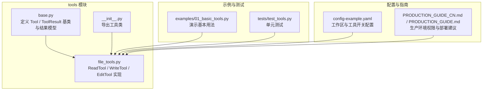
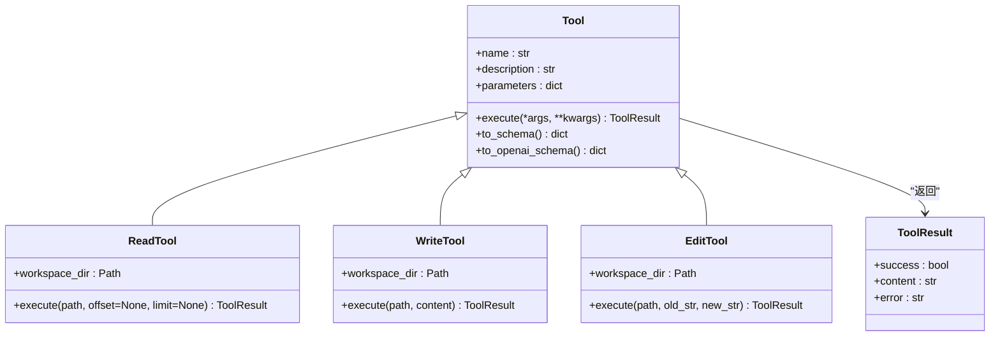
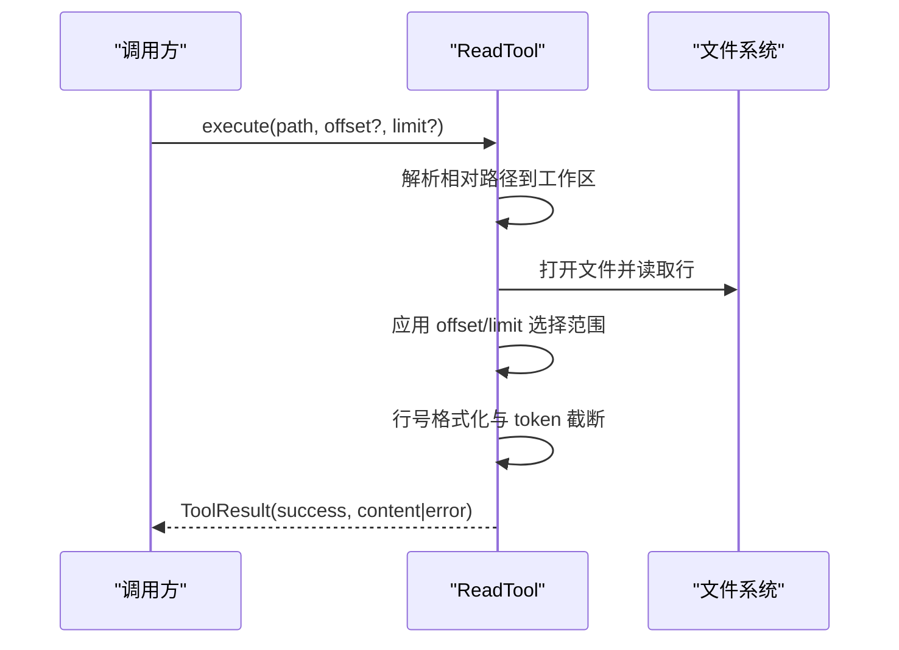
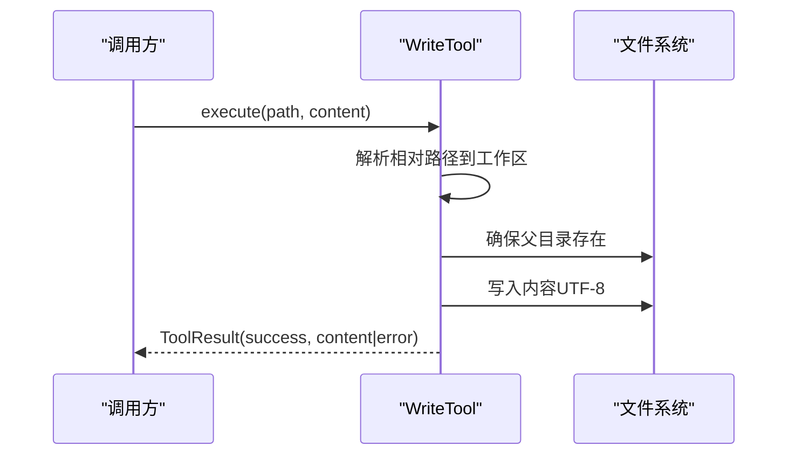
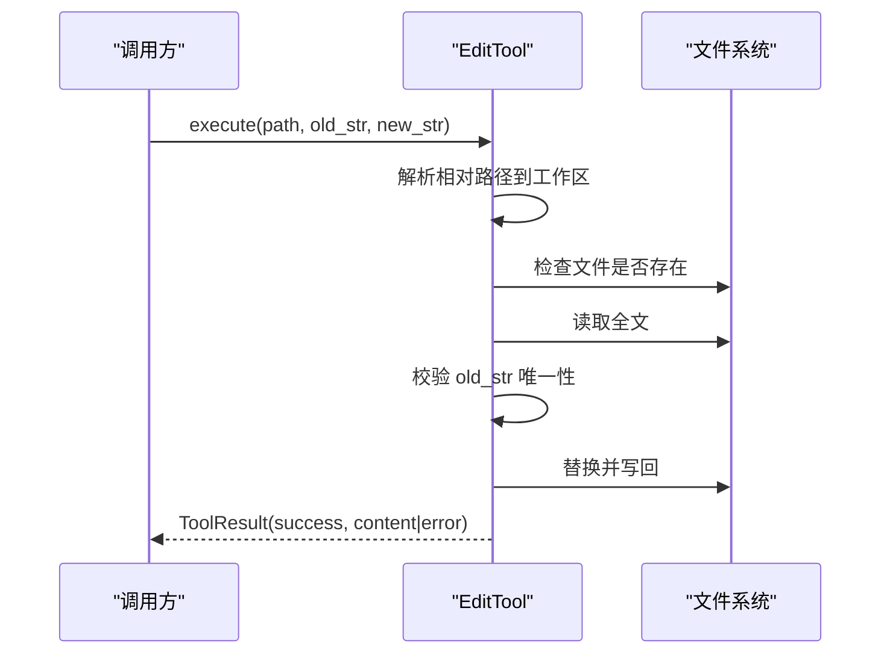
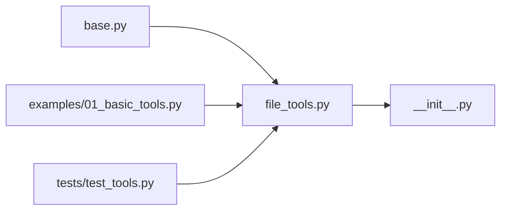

# 文件操作工具

<cite>
**本文引用的文件列表**
- [file_tools.py](file://mini_agent/tools/file_tools.py)
- [base.py](file://mini_agent/tools/base.py)
- [__init__.py](file://mini_agent/tools/__init__.py)
- [01_basic_tools.py](file://examples/01_basic_tools.py)
- [test_tools.py](file://tests/test_tools.py)
- [config-example.yaml](file://mini_agent/config/config-example.yaml)
- [PRODUCTION_GUIDE_CN.md](file://docs/PRODUCTION_GUIDE_CN.md)
- [PRODUCTION_GUIDE.md](file://docs/PRODUCTION_GUIDE.md)
</cite>

## 目录
1. [简介](#简介)
2. [项目结构](#项目结构)
3. [核心组件](#核心组件)
4. [架构总览](#架构总览)
5. [详细组件分析](#详细组件分析)
6. [依赖关系分析](#依赖关系分析)
7. [性能与大文件处理](#性能与大文件处理)
8. [安全与权限控制](#安全与权限控制)
9. [使用示例与最佳实践](#使用示例与最佳实践)
10. [故障排查指南](#故障排查指南)
11. [结论](#结论)

## 简介
本文件操作工具模块提供了对文件系统的读取、写入、编辑与删除能力，并围绕这些能力构建了统一的工具接口与结果模型。其设计目标是：
- 提供简洁一致的工具调用接口（异步执行）
- 支持相对路径解析与工作区隔离
- 对大文本进行基于 token 的截断，避免输出超限
- 统一的结果封装与错误处理
- 为上层智能体提供可被模型调用的工具能力

## 项目结构
文件操作工具位于 tools 子模块中，核心文件如下：
- 工具基类与结果模型：base.py
- 文件工具实现：file_tools.py
- 模块导出入口：__init__.py
- 使用示例与测试：examples/01_basic_tools.py、tests/test_tools.py
- 配置与生产指南：config-example.yaml、PRODUCTION_GUIDE_CN.md、PRODUCTION_GUIDE.md

图表来源
- [base.py:1-56](file://mini_agent/tools/base.py#L1-L56)
- [file_tools.py:1-286](file://mini_agent/tools/file_tools.py#L1-L286)
- [__init__.py:1-18](file://mini_agent/tools/__init__.py#L1-L18)
- [01_basic_tools.py:1-138](file://examples/01_basic_tools.py#L1-L138)
- [test_tools.py:1-112](file://tests/test_tools.py#L1-L112)
- [config-example.yaml:1-61](file://mini_agent/config/config-example.yaml#L1-L61)
- [PRODUCTION_GUIDE_CN.md:148-161](file://docs/PRODUCTION_GUIDE_CN.md#L148-L161)
- [PRODUCTION_GUIDE.md:148-163](file://docs/PRODUCTION_GUIDE.md#L148-L163)

章节来源
- [file_tools.py:1-286](file://mini_agent/tools/file_tools.py#L1-L286)
- [base.py:1-56](file://mini_agent/tools/base.py#L1-L56)
- [__init__.py:1-18](file://mini_agent/tools/__init__.py#L1-L18)
- [01_basic_tools.py:1-138](file://examples/01_basic_tools.py#L1-L138)
- [test_tools.py:1-112](file://tests/test_tools.py#L1-L112)
- [config-example.yaml:36-46](file://mini_agent/config/config-example.yaml#L36-L46)
- [PRODUCTION_GUIDE_CN.md:148-161](file://docs/PRODUCTION_GUIDE_CN.md#L148-L161)
- [PRODUCTION_GUIDE.md:148-163](file://docs/PRODUCTION_GUIDE.md#L148-L163)

## 核心组件
- 工具基类与结果模型
  - Tool：抽象基类，定义名称、描述、参数模式与异步执行接口
  - ToolResult：统一返回结构，包含 success、content、error 字段
- 文件工具
  - ReadTool：读取文件内容，支持行号格式化与分页读取
  - WriteTool：写入文件，自动创建父目录
  - EditTool：在文件内进行精确字符串替换，要求旧串唯一出现

章节来源
- [base.py:8-56](file://mini_agent/tools/base.py#L8-L56)
- [file_tools.py:63-286](file://mini_agent/tools/file_tools.py#L63-L286)

## 架构总览
文件工具通过统一的 Tool 接口暴露能力，内部以 pathlib.Path 进行路径解析与安全约束，采用 UTF-8 编码读写文本文件，并在输出侧进行 token 截断以适配上下文长度限制。

图表来源
- [base.py:16-56](file://mini_agent/tools/base.py#L16-L56)
- [file_tools.py:63-286](file://mini_agent/tools/file_tools.py#L63-L286)

## 详细组件分析

### ReadTool（读取文件）
- 职责
  - 解析相对路径到工作区根目录
  - 读取文件内容并按行编号输出（1-indexed）
  - 支持 offset/limit 分页读取，便于大文件处理
  - 输出前进行 token 截断，避免超限
- 关键行为
  - 路径解析：非绝对路径时拼接工作区目录
  - 行号格式化：每行输出“行号|内容”
  - 截断策略：基于 tiktoken 计算 token 数，保留首尾并插入截断提示
- 错误处理
  - 文件不存在或读取异常时返回 ToolResult(success=False, error=...)

图表来源
- [file_tools.py:108-152](file://mini_agent/tools/file_tools.py#L108-L152)

章节来源
- [file_tools.py:63-152](file://mini_agent/tools/file_tools.py#L63-L152)

### WriteTool（写入文件）
- 职责
  - 将完整内容写入指定文件
  - 自动创建缺失的父级目录
  - 默认 UTF-8 编码
- 关键行为
  - 路径解析：非绝对路径拼接工作区目录
  - 写入：直接覆盖原文件内容
- 错误处理
  - 异常捕获并返回 ToolResult(success=False, error=...)

图表来源
- [file_tools.py:195-210](file://mini_agent/tools/file_tools.py#L195-L210)

章节来源
- [file_tools.py:155-210](file://mini_agent/tools/file_tools.py#L155-L210)

### EditTool（编辑文件）
- 职责
  - 在文件中进行精确字符串替换
  - 要求旧字符串在文件中唯一出现，否则失败
- 关键行为
  - 路径解析：非绝对路径拼接工作区目录
  - 读取全文后进行一次性替换
  - 写回文件（UTF-8）
- 错误处理
  - 文件不存在或未找到旧串时返回失败

图表来源
- [file_tools.py:256-286](file://mini_agent/tools/file_tools.py#L256-L286)

章节来源
- [file_tools.py:212-286](file://mini_agent/tools/file_tools.py#L212-L286)

### 工具基类与结果模型
- Tool
  - 抽象属性：name、description、parameters
  - 抽象方法：execute（异步）
  - 辅助方法：to_schema、to_openai_schema
- ToolResult
  - 统一返回结构：success、content、error

章节来源
- [base.py:8-56](file://mini_agent/tools/base.py#L8-L56)

## 依赖关系分析
- 模块导出
  - __init__.py 导出 Tool、ToolResult、ReadTool、WriteTool、EditTool 等
- 工具实现
  - file_tools.py 依赖 base.py 的 Tool 与 ToolResult
  - 使用 pathlib.Path 进行路径解析
  - 使用 tiktoken 进行 token 截断
- 示例与测试
  - examples/01_basic_tools.py 展示如何实例化并调用工具
  - tests/test_tools.py 验证工具行为与错误处理

图表来源
- [base.py:1-56](file://mini_agent/tools/base.py#L1-L56)
- [file_tools.py:1-286](file://mini_agent/tools/file_tools.py#L1-L286)
- [__init__.py:1-18](file://mini_agent/tools/__init__.py#L1-L18)
- [01_basic_tools.py:1-138](file://examples/01_basic_tools.py#L1-L138)
- [test_tools.py:1-112](file://tests/test_tools.py#L1-L112)

章节来源
- [__init__.py:3-17](file://mini_agent/tools/__init__.py#L3-L17)
- [file_tools.py:8-8](file://mini_agent/tools/file_tools.py#L8-L8)
- [01_basic_tools.py:16-16](file://examples/01_basic_tools.py#L16-L16)
- [test_tools.py:9-9](file://tests/test_tools.py#L9-L9)

## 性能与大文件处理
- 行号分页读取
  - ReadTool 支持 offset/limit 参数，按行切片读取，避免一次性加载整文件
- token 截断
  - 通过 tiktoken 计算 token 数，保留首尾并插入截断提示，防止输出超限
- 编码与二进制文件
  - 当前实现默认 UTF-8 文本读写；如需处理二进制文件，应在上层进行适配（例如 base64 编解码或分块读取），并在调用前明确文件类型与编码

章节来源
- [file_tools.py:87-106](file://mini_agent/tools/file_tools.py#L87-L106)
- [file_tools.py:146-148](file://mini_agent/tools/file_tools.py#L146-L148)
- [file_tools.py:123-125](file://mini_agent/tools/file_tools.py#L123-L125)

## 安全与权限控制
- 路径解析与工作区隔离
  - 所有相对路径均解析到工作区根目录，避免越权访问外部路径
- 权限与部署建议
  - 生产环境建议限制 Agent 只能访问必要目录，设置合适的文件权限
  - 配置文件与敏感目录仅允许所有者访问
- 最佳实践
  - 明确 workspace_dir 并在启动时校验其存在性
  - 对外部输入的路径进行白名单校验（如仅允许特定扩展名或子目录）
  - 对写入操作进行幂等性与备份策略设计

章节来源
- [file_tools.py:66-72](file://mini_agent/tools/file_tools.py#L66-L72)
- [config-example.yaml:38-38](file://mini_agent/config/config-example.yaml#L38-L38)
- [PRODUCTION_GUIDE_CN.md:148-161](file://docs/PRODUCTION_GUIDE_CN.md#L148-L161)
- [PRODUCTION_GUIDE.md:148-163](file://docs/PRODUCTION_GUIDE.md#L148-L163)

## 使用示例与最佳实践

### 基本用法示例
- 写入新文件
  - 使用 WriteTool 创建文件并写入内容
- 读取文件
  - 使用 ReadTool 读取文件内容，支持行号格式化
- 编辑文件
  - 使用 EditTool 在文件中进行精确字符串替换，要求旧串唯一出现

章节来源
- [01_basic_tools.py:19-38](file://examples/01_basic_tools.py#L19-L38)
- [01_basic_tools.py:40-61](file://examples/01_basic_tools.py#L40-L61)
- [01_basic_tools.py:63-87](file://examples/01_basic_tools.py#L63-L87)

### 单元测试参考
- ReadTool：验证返回内容包含行号格式
- WriteTool：验证文件创建与内容一致性
- EditTool：验证替换后的内容正确性

章节来源
- [test_tools.py:12-32](file://tests/test_tools.py#L12-L32)
- [test_tools.py:35-50](file://tests/test_tools.py#L35-L50)
- [test_tools.py:52-73](file://tests/test_tools.py#L52-L73)

### 与其他工具的协作
- 与 BashTool 协作
  - 先用 BashTool 列出/定位文件，再用 ReadTool/WriteTool/EditTool 处理
- 与会话笔记工具协作
  - 在会话中记录文件操作结果，便于后续审计与回溯

章节来源
- [01_basic_tools.py:90-116](file://examples/01_basic_tools.py#L90-L116)

### 性能优化建议
- 大文件分页读取：使用 ReadTool 的 offset/limit
- 输出截断：利用内置 token 截断减少上下文负担
- 并发读取：ReadTool 支持并发调用不同文件

章节来源
- [file_tools.py:87-87](file://mini_agent/tools/file_tools.py#L87-L87)
- [file_tools.py:146-148](file://mini_agent/tools/file_tools.py#L146-L148)

## 故障排查指南
- 常见问题
  - 文件不存在：ReadTool/ EditTool 会在找不到文件时返回错误
  - 旧串不唯一：EditTool 会在未找到或重复出现时失败
  - 路径越权：相对路径会被解析到工作区根目录，避免跨目录访问
- 建议排查步骤
  - 确认 path 是否为相对路径且在工作区内
  - 对于大文件，使用 offset/limit 分段读取
  - 检查编码是否为 UTF-8
  - 查看 ToolResult.error 获取详细错误信息

章节来源
- [file_tools.py:116-121](file://mini_agent/tools/file_tools.py#L116-L121)
- [file_tools.py:264-278](file://mini_agent/tools/file_tools.py#L264-L278)
- [file_tools.py:151-152](file://mini_agent/tools/file_tools.py#L151-L152)

## 结论
文件操作工具通过统一的 Tool 接口与标准化的返回结构，为智能体提供了安全、可控且高效的文件读写能力。结合工作区隔离、路径解析与 token 截断等机制，能够在保证安全性的同时提升大文件处理的可用性。配合生产环境的权限与部署规范，可进一步降低风险并提升稳定性。