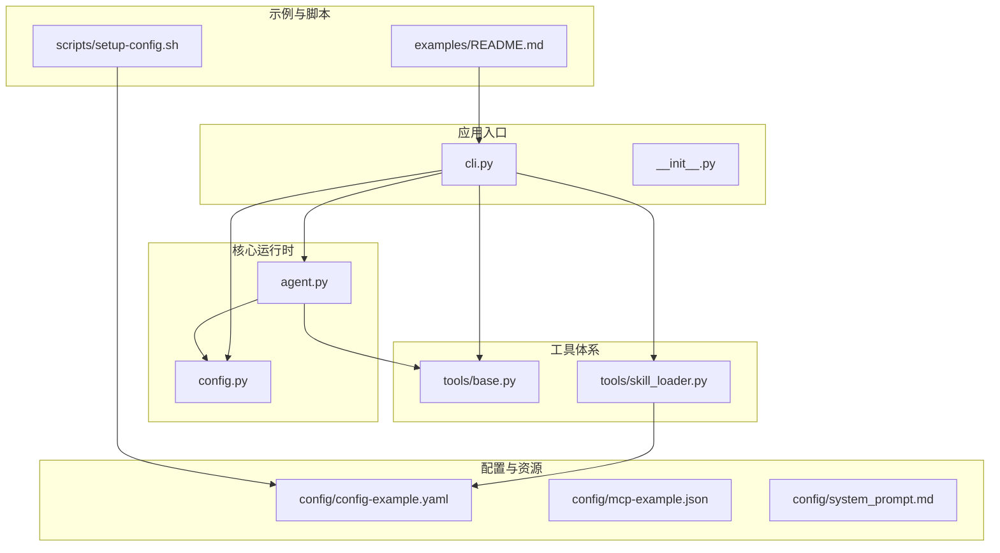
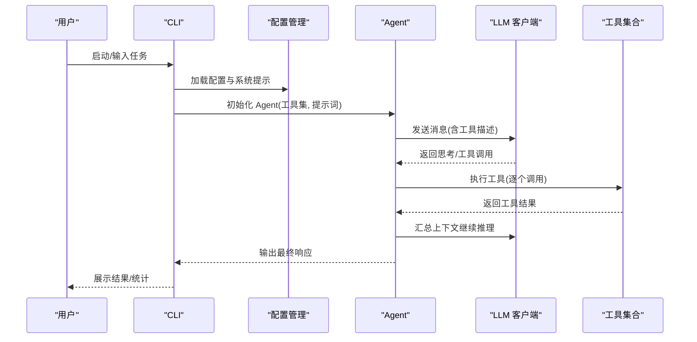
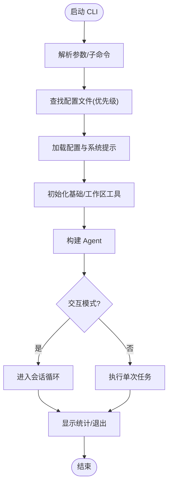
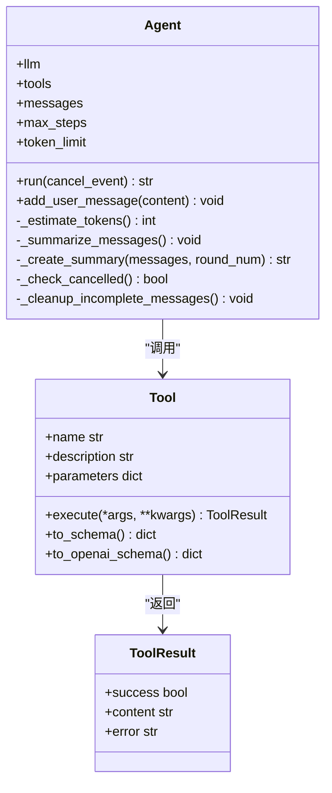
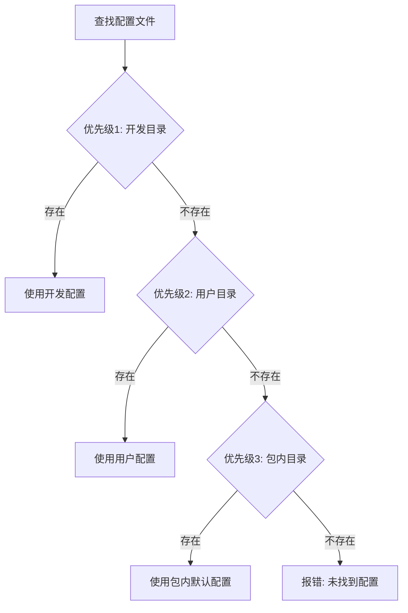
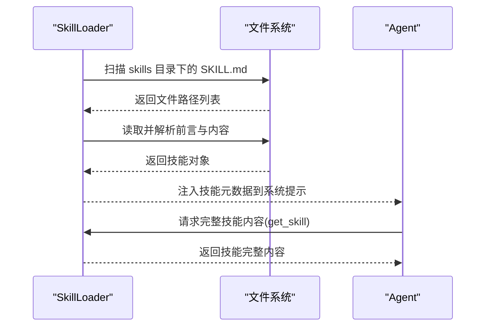
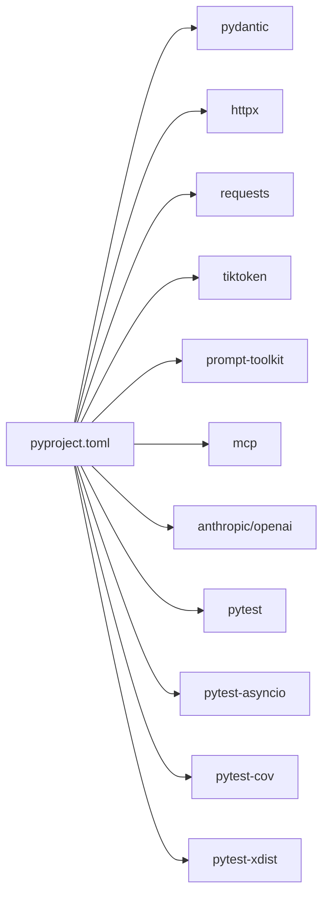

# 开发指南

<cite>
**本文引用的文件**
- [README.md](file://README.md)
- [CONTRIBUTING.md](file://CONTRIBUTING.md)
- [docs/DEVELOPMENT_GUIDE.md](file://docs/DEVELOPMENT_GUIDE.md)
- [pyproject.toml](file://pyproject.toml)
- [mini_agent/__init__.py](file://mini_agent/__init__.py)
- [mini_agent/cli.py](file://mini_agent/cli.py)
- [mini_agent/agent.py](file://mini_agent/agent.py)
- [mini_agent/tools/base.py](file://mini_agent/tools/base.py)
- [mini_agent/config.py](file://mini_agent/config.py)
- [scripts/setup-config.sh](file://scripts/setup-config.sh)
- [mini_agent/config/config-example.yaml](file://mini_agent/config/config-example.yaml)
- [mini_agent/config/mcp-example.json](file://mini_agent/config/mcp-example.json)
- [mini_agent/config/system_prompt.md](file://mini_agent/config/system_prompt.md)
- [examples/README.md](file://examples/README.md)
- [mini_agent/tools/skill_loader.py](file://mini_agent/tools/skill_loader.py)
</cite>

## 目录
1. [简介](#简介)
2. [项目结构](#项目结构)
3. [核心组件](#核心组件)
4. [架构总览](#架构总览)
5. [详细组件分析](#详细组件分析)
6. [依赖关系分析](#依赖关系分析)
7. [性能与可扩展性](#性能与可扩展性)
8. [调试与开发工具](#调试与开发工具)
9. [贡献指南](#贡献指南)
10. [开发工作流程](#开发工作流程)
11. [代码质量保障](#代码质量保障)
12. [常见问题与排错](#常见问题与排错)
13. [结论](#结论)
14. [附录](#附录)

## 简介
本指南面向希望参与 Mini Agent 项目开发的工程师，覆盖从环境搭建、代码结构与架构、开发流程到调试与质量保障的完整路径。项目以“最小可用”为原则，提供文件操作、命令执行、MCP 工具与 Claude Skills 的集成能力，支持交互式会话与非交互任务执行，并内置完善的日志与重试机制。

## 项目结构
项目采用按功能域分层的模块化组织方式：核心运行时（CLI、Agent）、工具体系（基础工具、MCP、技能）、配置与系统提示、示例与测试等。核心包入口导出对外可见的类型与类，便于外部复用。

图表来源
- [mini_agent/cli.py](file://mini_agent/cli.py)
- [mini_agent/agent.py](file://mini_agent/agent.py)
- [mini_agent/config.py](file://mini_agent/config.py)
- [mini_agent/tools/base.py](file://mini_agent/tools/base.py)
- [mini_agent/tools/skill_loader.py](file://mini_agent/tools/skill_loader.py)
- [mini_agent/config/config-example.yaml](file://mini_agent/config/config-example.yaml)
- [mini_agent/config/mcp-example.json](file://mini_agent/config/mcp-example.json)
- [mini_agent/config/system_prompt.md](file://mini_agent/config/system_prompt.md)
- [examples/README.md](file://examples/README.md)
- [scripts/setup-config.sh](file://scripts/setup-config.sh)

章节来源
- [pyproject.toml](file://pyproject.toml)
- [mini_agent/__init__.py](file://mini_agent/__init__.py)

## 核心组件
- CLI 交互与生命周期管理：负责参数解析、配置加载、工具初始化、会话循环与统计输出。
- Agent 执行引擎：封装消息历史、令牌估算与摘要、工具调用、日志记录与取消控制。
- 工具基类与结果模型：统一工具接口与返回结构，兼容不同 LLM 的函数调用协议。
- 配置管理：集中管理 LLM、Agent、工具与 MCP 的配置，支持多级优先查找策略。
- 技能加载器：解析 SKILL.md 前言元数据，实现“渐进披露”的技能内容注入。

章节来源
- [mini_agent/cli.py](file://mini_agent/cli.py)
- [mini_agent/agent.py](file://mini_agent/agent.py)
- [mini_agent/tools/base.py](file://mini_agent/tools/base.py)
- [mini_agent/config.py](file://mini_agent/config.py)
- [mini_agent/tools/skill_loader.py](file://mini_agent/tools/skill_loader.py)

## 架构总览
系统采用“配置驱动 + 工具插件 + 技能扩展”的架构。CLI 作为入口协调配置、工具与 Agent；Agent 负责与 LLM 协作，按需调用工具；技能通过 SkillLoader 动态注入到系统提示中，形成“元知识 + 工具 + 执行”的闭环。

图表来源
- [mini_agent/cli.py](file://mini_agent/cli.py)
- [mini_agent/agent.py](file://mini_agent/agent.py)
- [mini_agent/config.py](file://mini_agent/config.py)
- [mini_agent/tools/base.py](file://mini_agent/tools/base.py)

## 详细组件分析

### CLI 组件
职责与特性
- 参数解析与子命令：支持工作空间、任务执行、版本查询与日志子命令。
- 配置优先级搜索：按开发目录、用户目录、包内目录顺序查找配置文件。
- 工具装配：按配置启用 Bash、文件工具、会话笔记、MCP 与技能工具。
- 交互式会话：基于 prompt_toolkit 实现命令补全、历史、快捷键与 Esc 取消。
- 日志与统计：提供日志目录浏览、文件读取与会话统计展示。

图表来源
- [mini_agent/cli.py](file://mini_agent/cli.py)

章节来源
- [mini_agent/cli.py](file://mini_agent/cli.py)

### Agent 组件
职责与特性
- 上下文管理：维护系统提示、消息历史，自动进行“用户-执行过程”摘要以控制上下文长度。
- 令牌估算与摘要：使用 cl100k_base 编码估算令牌数，超过阈值触发摘要，避免上下文溢出。
- 工具调用：根据 LLM 返回的工具调用列表逐一执行，记录日志并处理异常。
- 取消与清理：支持在安全检查点中断执行，清理不完整消息，保持一致性。
- 日志记录：请求、响应、工具调用与结果均写入日志文件，便于调试与审计。

图表来源
- [mini_agent/agent.py](file://mini_agent/agent.py)
- [mini_agent/tools/base.py](file://mini_agent/tools/base.py)

章节来源
- [mini_agent/agent.py](file://mini_agent/agent.py)
- [mini_agent/tools/base.py](file://mini_agent/tools/base.py)

### 配置管理
职责与特性
- 分层配置：支持开发模式、用户目录与包内目录的优先查找。
- 结构化模型：LLM、Agent、Tools、MCP 的 Pydantic 模型定义清晰，字段校验严格。
- 默认值与校验：缺失必填项或无效值会抛出明确错误，便于早期发现配置问题。

图表来源
- [mini_agent/config.py](file://mini_agent/config.py)

章节来源
- [mini_agent/config.py](file://mini_agent/config.py)
- [mini_agent/config/config-example.yaml](file://mini_agent/config/config-example.yaml)

### 技能加载器
职责与特性
- 解析 SKILL.md 前言元数据，生成技能对象。
- 渐进披露：在系统提示中仅注入技能元数据（名称/描述），按需加载完整内容。
- 路径处理：将相对路径转换为绝对路径，确保资源可被 Agent 在任意工作目录访问。

图表来源
- [mini_agent/tools/skill_loader.py](file://mini_agent/tools/skill_loader.py)

章节来源
- [mini_agent/tools/skill_loader.py](file://mini_agent/tools/skill_loader.py)

## 依赖关系分析
- 运行时依赖：Pydantic、HTTPX、Requests、tiktoken、prompt-toolkit、mcp、anthropic/openai 等。
- 可选依赖：pytest、pytest-asyncio、pytest-cov、pytest-xdist（开发与测试）。
- 入口脚本：CLI 与 ACP 服务器分别注册为独立命令，便于在不同环境中运行。

图表来源
- [pyproject.toml](file://pyproject.toml)

章节来源
- [pyproject.toml](file://pyproject.toml)

## 性能与可扩展性
- 令牌控制：通过本地估算与 API 报告双通道监控，超过阈值自动摘要，降低上下文开销。
- 工具并发：当前实现串行执行工具调用，若需提升吞吐可在工具层引入异步批处理与超时控制。
- MCP 超时：提供连接、执行与 SSE 读取超时配置，防止网络阻塞导致进程卡死。
- 可扩展点：新增工具只需继承 Tool 基类并实现参数与执行逻辑；技能通过 SKILL.md 自动发现与注入。

章节来源
- [mini_agent/agent.py](file://mini_agent/agent.py)
- [mini_agent/tools/base.py](file://mini_agent/tools/base.py)
- [mini_agent/config.py](file://mini_agent/config.py)
- [mini_agent/tools/skill_loader.py](file://mini_agent/tools/skill_loader.py)

## 调试与开发工具
- 日志系统：Agent 将请求、响应、工具调用与结果写入日志文件，便于回溯。
- 交互式调试：CLI 支持 Esc 取消当前执行，便于快速终止长耗时步骤。
- 断点调试：可在 Agent 的工具调用处设置断点，观察参数与返回。
- 详细日志：可通过修改日志级别或在测试中开启 DEBUG 级别输出，定位问题。
- MCP 调试：参考开发指南中的 MCP 加载失败排查步骤，结合测试用例定位问题。

章节来源
- [docs/DEVELOPMENT_GUIDE.md](file://docs/DEVELOPMENT_GUIDE.md)
- [mini_agent/cli.py](file://mini_agent/cli.py)
- [mini_agent/agent.py](file://mini_agent/agent.py)

## 贡献指南
- 提交流程：Fork 仓库 → 新建分支 → 开发与测试 → 推送到远端 → 创建 PR。
- 提交信息规范：使用 feat/fix/docs/style/refactor/test/chore 前缀，语义化描述变更。
- 代码风格：遵循 PEP 8 与 Google Python 风格，类型注解齐全，必要处添加 docstring。
- 测试要求：新增功能必须配套单元/功能/集成测试，确保覆盖率与稳定性。
- 文档同步：更新 README 或相关文档，保持与代码一致。

章节来源
- [CONTRIBUTING.md](file://CONTRIBUTING.md)

## 开发工作流程
- 环境准备：安装 uv，使用 uv sync 安装依赖；如需技能，初始化子模块。
- 配置管理：使用 setup-config.sh 下载模板配置，编辑 config.yaml 与 mcp.json。
- 本地运行：可直接以模块方式运行 CLI，或以可编辑模式安装后全局使用。
- 分支策略：feature/* 用于新功能，fix/* 用于修复，遵循统一的提交与 PR 流程。
- 版本与发布：遵循语义化版本，变更日志随 PR 更新，必要时打标签并发布。

章节来源
- [README.md](file://README.md)
- [scripts/setup-config.sh](file://scripts/setup-config.sh)
- [pyproject.toml](file://pyproject.toml)

## 代码质量保障
- 静态分析：通过 pylint 控制工具方法签名差异警告，聚焦真正问题。
- 格式化：建议配合 black/isort 等工具统一格式（项目未显式声明，可在本地使用）。
- 测试：pytest 驱动，覆盖工具、Agent、MCP、技能与集成场景；可选 pytest-cov 生成覆盖率报告。
- 依赖锁定：使用 uv 管理依赖，确保可重现构建。

章节来源
- [pyproject.toml](file://pyproject.toml)

## 常见问题与排错
- API 密钥配置错误：检查配置文件中的 api_key 是否正确、无多余空格或引号。
- 依赖安装失败：升级 uv 并清理缓存后重试；确认网络可达。
- MCP 工具加载失败：检查 mcp.json 配置、Node.js 是否安装、所需密钥是否配置；查看测试用例输出定位问题。
- SSL 证书错误：开发阶段可临时关闭校验，生产环境请更新证书或配置代理。

章节来源
- [docs/DEVELOPMENT_GUIDE.md](file://docs/DEVELOPMENT_GUIDE.md)
- [README.md](file://README.md)

## 结论
本指南提供了从环境搭建到开发实践、从架构理解到质量保障的全景式指引。建议开发者先通过示例与 CLI 快速上手，再深入核心模块与配置体系，最后结合贡献流程与测试规范开展迭代开发。

## 附录

### 开发环境搭建步骤
- Python 版本：要求 Python >= 3.10。
- 依赖安装：推荐使用 uv，执行 uv sync 安装全部依赖；如需手动安装，参考 README 中的替代步骤。
- 配置生成：使用 scripts/setup-config.sh 下载模板配置至用户目录，编辑 config.yaml 与 mcp.json。
- 可选：初始化 Claude Skills 子模块以启用技能能力。

章节来源
- [README.md](file://README.md)
- [scripts/setup-config.sh](file://scripts/setup-config.sh)
- [pyproject.toml](file://pyproject.toml)

### 代码结构与命名约定
- 模块组织：按功能域划分（agent、tools、config、llm、schema、utils），入口统一导出。
- 命名约定：类名使用 PascalCase，方法与变量使用 snake_case；类型注解与 docstring 规范化。
- 设计模式：工具采用抽象基类 + 多态实现；配置采用 Pydantic 模型；Agent 使用职责链与状态机思想。

章节来源
- [mini_agent/__init__.py](file://mini_agent/__init__.py)
- [mini_agent/tools/base.py](file://mini_agent/tools/base.py)
- [mini_agent/config.py](file://mini_agent/config.py)

### 扩展开发方法
- 新增工具：继承 Tool 基类，实现 name/description/parameters/execute，注册到 Agent。
- 新增 MCP 工具：在 mcp.json 中新增服务条目，配置命令、参数与环境变量。
- 新增技能：在 skills 目录下创建 SKILL.md，按前言元数据规范编写，Agent 将自动发现与注入。
- 自定义系统提示：编辑 system_prompt.md，按需调整能力描述、工作指南与最佳实践。

章节来源
- [docs/DEVELOPMENT_GUIDE.md](file://docs/DEVELOPMENT_GUIDE.md)
- [mini_agent/tools/base.py](file://mini_agent/tools/base.py)
- [mini_agent/config/system_prompt.md](file://mini_agent/config/system_prompt.md)
- [mini_agent/config/mcp-example.json](file://mini_agent/config/mcp-example.json)
- [mini_agent/tools/skill_loader.py](file://mini_agent/tools/skill_loader.py)

### 示例与场景
- 基础工具示例：examples/01_basic_tools.py 展示文件与 Bash 工具的直接使用。
- 简单 Agent 示例：examples/02_simple_agent.py 展示 Agent 初始化与任务执行。
- 会话记忆示例：examples/03_session_notes.py 展示跨会话记忆的使用。
- 完整 Agent 示例：examples/04_full_agent.py 展示工具、MCP 与技能的组合使用。

章节来源
- [examples/README.md](file://examples/README.md)