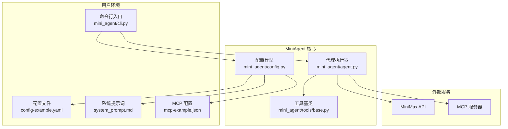
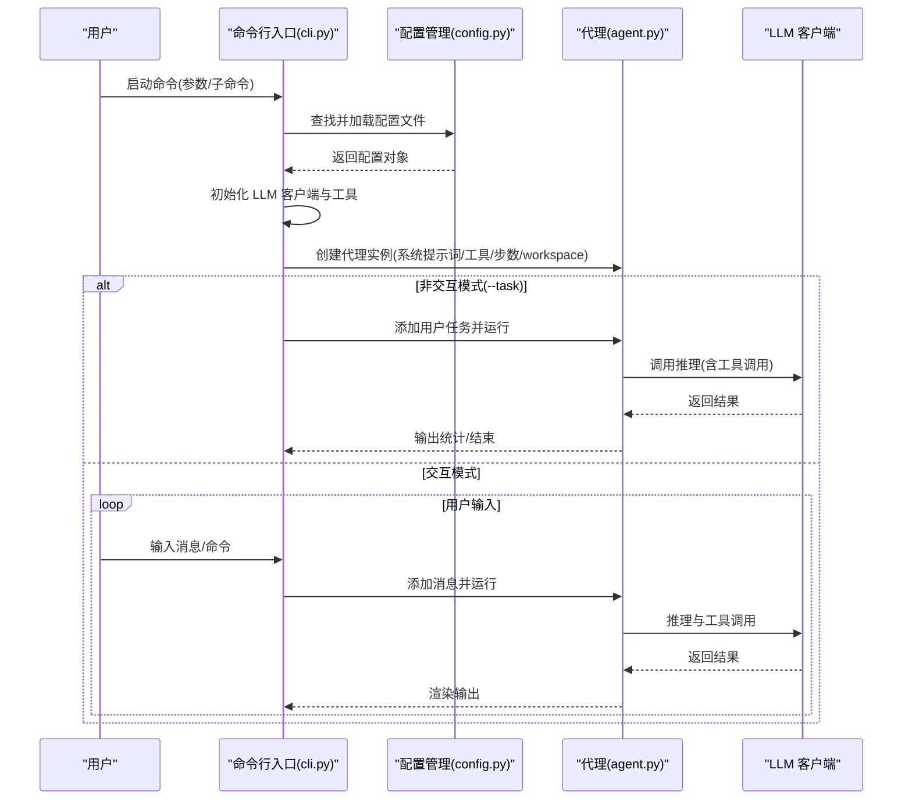
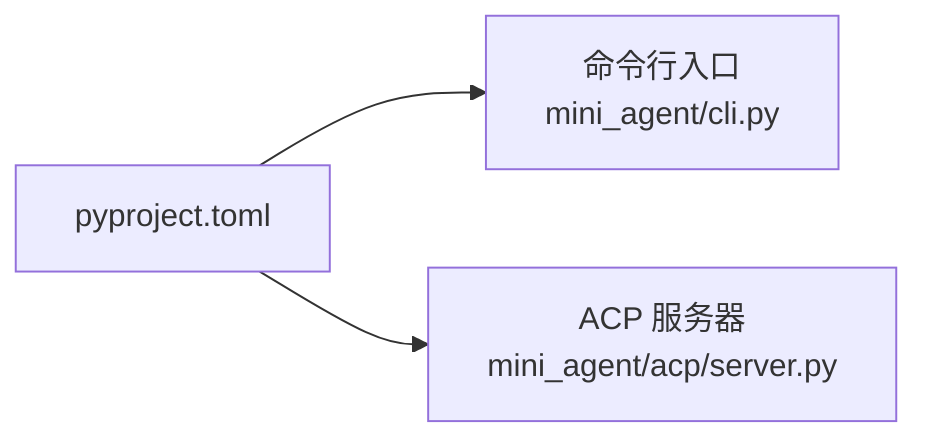

# 快速开始

<cite>
**本文引用的文件**   
- [README.md](file://README.md)
- [cli.py](file://mini_agent/cli.py)
- [config.py](file://mini_agent/config.py)
- [config-example.yaml](file://mini_agent/config/config-example.yaml)
- [system_prompt.md](file://mini_agent/config/system_prompt.md)
- [mcp-example.json](file://mini_agent/config/mcp-example.json)
- [setup-config.sh](file://scripts/setup-config.sh)
- [setup-config.ps1](file://scripts/setup-config.ps1)
- [pyproject.toml](file://pyproject.toml)
- [agent.py](file://mini_agent/agent.py)
- [base.py](file://mini_agent/tools/base.py)
- [test_agent.py](file://tests/test_agent.py)
</cite>

## 目录
1. [简介](#简介)
2. [项目结构](#项目结构)
3. [核心组件](#核心组件)
4. [架构总览](#架构总览)
5. [详细组件分析](#详细组件分析)
6. [依赖分析](#依赖分析)
7. [性能考虑](#性能考虑)
8. [故障排除指南](#故障排除指南)
9. [结论](#结论)
10. [附录](#附录)

## 简介
本指南面向初学者，帮助你在最短时间内上手 MiniAgent。你将学会两种使用模式：快速开始模式（适合新手）与开发模式（适合需要本地修改或二次开发的用户）。同时，你还将获得 API 密钥获取步骤、安装与配置流程、基础命令运行方式、配置文件详解以及常见问题的排查方法。

## 项目结构
MiniAgent 提供了 CLI、配置管理、工具集、代理执行循环与 MCP 集成等能力，并通过 uv 工具实现一键安装与运行。核心入口为命令行脚本，配置文件支持多级优先查找，系统提示词可动态注入技能元数据，便于快速上手。

**图表来源**
- [cli.py:285-335](file://mini_agent/cli.py#L285-L335)
- [config.py:66-221](file://mini_agent/config.py#L66-L221)
- [config-example.yaml:1-61](file://mini_agent/config/config-example.yaml#L1-L61)
- [system_prompt.md:1-76](file://mini_agent/config/system_prompt.md#L1-L76)
- [mcp-example.json:1-29](file://mini_agent/config/mcp-example.json#L1-L29)
- [agent.py:45-85](file://mini_agent/agent.py#L45-L85)
- [base.py:16-56](file://mini_agent/tools/base.py#L16-L56)

**章节来源**
- [README.md: 43-211:43-211](file://README.md#L43-L211)
- [pyproject.toml: 27-29:27-29](file://pyproject.toml#L27-L29)

## 核心组件
- 命令行入口：解析参数、初始化配置、加载工具与系统提示词、创建代理并进入交互或非交互执行流程。
- 配置管理：统一读取与校验配置，支持多级查找路径（开发、用户、包内），并提供默认值与类型约束。
- 代理执行器：维护消息历史、令牌估算与摘要、工具调用、取消机制与日志统计。
- 工具基类：定义工具接口与返回结构，便于扩展自定义工具。
- 系统提示词：可注入技能元数据，指导代理在不同复杂度下选择合适工具与策略。
- MCP 配置：可选的外部工具集成，通过 mcp.json 指定服务器与凭据。

**章节来源**
- [cli.py: 285-335:285-335](file://mini_agent/cli.py#L285-L335)
- [config.py: 66-221:66-221](file://mini_agent/config.py#L66-L221)
- [agent.py: 45-85:45-85](file://mini_agent/agent.py#L45-L85)
- [base.py: 16-56:16-56](file://mini_agent/tools/base.py#L16-L56)
- [system_prompt.md: 1-76:1-76](file://mini_agent/config/system_prompt.md#L1-L76)
- [mcp-example.json: 1-29:1-29](file://mini_agent/config/mcp-example.json#L1-L29)

## 架构总览
下面的时序图展示了从启动到完成一次任务的关键流程：解析参数 → 加载配置 → 初始化 LLM 客户端与工具 → 创建代理 → 运行任务或进入交互循环。

**图表来源**
- [cli.py: 486-630:486-630](file://mini_agent/cli.py#L486-L630)
- [config.py: 82-164:82-164](file://mini_agent/config.py#L82-L164)
- [agent.py: 45-120:45-120](file://mini_agent/agent.py#L45-L120)

**章节来源**
- [cli.py: 486-630:486-630](file://mini_agent/cli.py#L486-L630)
- [agent.py: 45-120:45-120](file://mini_agent/agent.py#L45-L120)

## 详细组件分析

### 使用模式：快速开始模式 vs 开发模式
- 快速开始模式（推荐新手）
  - 通过 uv 工具直接安装并自动下载配置模板，无需克隆仓库。
  - 适合快速试用与演示，不涉及本地代码修改。
- 开发模式
  - 克隆仓库后使用 uv 同步依赖，可选择可编辑安装以便即时生效。
  - 支持初始化子模块（Claude Skills）、手动复制配置模板、按需启用 MCP 与技能。

**章节来源**
- [README.md: 83-133:83-133](file://README.md#L83-L133)
- [README.md: 135-209:135-209](file://README.md#L135-L209)

### API 密钥获取与平台选择
- 平台与 API 基地址
  - 全球版：平台地址与 API 基地址分别为相应链接
  - 中国版：平台地址与 API 基地址分别为相应链接
- 获取步骤
  - 注册登录对应平台 → 账户管理 → API 密钥 → 新建密钥 → 复制保存
- 注意事项
  - 记住所选平台对应的 API 基地址，后续用于配置

**章节来源**
- [README.md: 45-61:45-61](file://README.md#L45-L61)

### 安装与配置流程
- 安装 uv（所有模式均需）
  - macOS/Linux/WSL：使用官方安装脚本
  - Windows：先安装 pipx，再重启终端
- 快速开始模式
  - 安装工具：直接从 GitHub 安装
  - 自动配置：执行脚本自动创建用户配置目录并下载模板文件
- 开发模式
  - 克隆仓库 → 安装 uv → 同步依赖 → 可选：初始化子模块 → 复制配置模板 → 编辑配置
- 配置文件位置与优先级
  - 开发模式：当前目录下的 mini_agent/config/config.yaml
  - 用户模式：~/.mini-agent/config/config.yaml
  - 包内模式：安装包内的配置文件（用于错误提示）

**章节来源**
- [README.md: 64-103:64-103](file://README.md#L64-L103)
- [README.md: 139-191:139-191](file://README.md#L139-L191)
- [config.py: 177-221:177-221](file://mini_agent/config.py#L177-L221)

### 基础命令与运行方式
- 启动智能体
  - 在任意目录运行：mini-agent
  - 指定工作空间：mini-agent --workspace /path/to/project
  - 非交互执行任务：mini-agent --task "你的任务描述"
  - 查看版本：mini-agent --version
  - 日志查看：mini-agent log 或 mini-agent log <文件名>
- 子进程 MCP 服务器
  - ACP 服务器命令：mini-agent-acp（由 pyproject.toml 注册）

**章节来源**
- [README.md: 122-133:122-133](file://README.md#L122-L133)
- [cli.py: 285-335:285-335](file://mini_agent/cli.py#L285-L335)
- [pyproject.toml: 27-29:27-29](file://pyproject.toml#L27-L29)

### 配置文件详解（config-example.yaml）
- LLM 配置
  - api_key：必填，从平台获取
  - api_base：根据平台选择（全球/中国）
  - model：模型名称（默认已配置）
  - provider：LLM 提供方（anthropic/openai）
  - retry：重试机制（启用、最大重试次数、初始延迟、最大延迟、指数基数）
- Agent 配置
  - max_steps：最大执行步数
  - workspace_dir：工作空间目录
  - system_prompt_path：系统提示词文件路径
- 工具配置
  - enable_file_tools / enable_bash / enable_note：基础工具开关
  - enable_skills / skills_dir：技能开关与目录
  - enable_mcp / mcp_config_path：MCP 开关与配置文件路径
  - mcp.timeout：连接超时、执行超时、SSE 读取超时

**章节来源**
- [config-example.yaml: 13-61:13-61](file://mini_agent/config/config-example.yaml#L13-L61)
- [config.py: 22-72:22-72](file://mini_agent/config.py#L22-L72)

### 系统提示词与技能注入
- 系统提示词文件支持占位符，启动时会将已启用技能的元数据注入其中，帮助代理在不同复杂度下选择合适工具。
- 技能使用建议：先查看元数据，再按需加载完整技能内容。

**章节来源**
- [system_prompt.md: 1-76:1-76](file://mini_agent/config/system_prompt.md#L1-L76)
- [cli.py: 589-602:589-602](file://mini_agent/cli.py#L589-L602)

### MCP 配置与示例
- MCP 配置文件（mcp.json）中可声明多个服务器，包含命令、参数、环境变量与禁用状态。
- 示例：MiniMax Search 与 Memory 服务器，可按需启用并配置第三方 API Key。

**章节来源**
- [mcp-example.json: 1-29:1-29](file://mini_agent/config/mcp-example.json#L1-L29)
- [cli.py: 400-431:400-431](file://mini_agent/cli.py#L400-L431)

### 示例与测试参考
- 示例脚本：examples/README.md 提供了从基础工具到完整代理的渐进式示例，便于理解各组件协作。
- 测试用例：tests/test_agent.py 展示了代理在真实配置下的文件创建与 Bash 执行流程，可作为集成验证参考。

**章节来源**
- [examples/README.md: 107-128:107-128](file://examples/README.md#L107-L128)
- [tests/test_agent.py: 15-95:15-95](file://tests/test_agent.py#L15-L95)

## 依赖分析
- 命令注册：pyproject.toml 将 mini-agent 与 mini-agent-acp 映射到具体模块入口。
- 运行时依赖：httpx、pydantic、prompt-toolkit、anthropic/openai 等，确保网络请求、配置校验与交互体验。
- 可选依赖：pytest、pytest-asyncio 等，用于测试与开发验证。

**图表来源**
- [pyproject.toml: 27-29:27-29](file://pyproject.toml#L27-L29)

**章节来源**
- [pyproject.toml: 11-25:11-25](file://pyproject.toml#L11-L25)
- [pyproject.toml: 27-29:27-29](file://pyproject.toml#L27-L29)

## 性能考虑
- 令牌估算与摘要：代理在消息历史接近阈值时进行摘要，避免上下文过长导致性能下降。
- 重试机制：可配置指数回退策略，提升网络波动下的稳定性。
- 工作空间隔离：每个任务在独立工作空间中执行，减少跨任务干扰。

**章节来源**
- [agent.py: 180-200:180-200](file://mini_agent/agent.py#L180-L200)
- [config.py: 12-20:12-20](file://mini_agent/config.py#L12-L20)

## 故障排除指南
- SSL 证书错误
  - 临时方案：在 LLM 客户端处关闭证书校验（仅测试用途）
  - 生产方案：升级证书包或配置系统代理/证书
- 模块未找到错误
  - 确保在项目根目录下运行，以正确解析包内资源与配置
- 配置文件缺失
  - 使用自动配置脚本创建用户配置目录并下载模板；或手动复制模板至优先级最高的位置

**章节来源**
- [README.md: 284-311:284-311](file://README.md#L284-L311)
- [cli.py: 495-524:495-524](file://mini_agent/cli.py#L495-L524)
- [setup-config.sh: 37-67:37-67](file://scripts/setup-config.sh#L37-L67)
- [setup-config.ps1: 56-93:56-93](file://scripts/setup-config.ps1#L56-L93)

## 结论
通过本指南，你可以快速完成 MiniAgent 的安装与配置，并掌握两种使用模式、基础命令与配置要点。建议先以快速开始模式体验核心能力，再按需切换到开发模式进行深度定制与二次开发。

## 附录
- 自动配置脚本
  - macOS/Linux：curl 下载并执行脚本，自动创建用户配置目录并下载模板
  - Windows：PowerShell 下载并执行脚本，同样完成配置准备
- 版本与升级
  - 查看版本：mini-agent --version
  - 升级工具：uv tool upgrade mini-agent
  - 列出工具：uv tool list

**章节来源**
- [README.md: 94-100:94-100](file://README.md#L94-L100)
- [README.md: 129-133:129-133](file://README.md#L129-L133)
- [setup-config.sh: 84-97:84-97](file://scripts/setup-config.sh#L84-L97)
- [setup-config.ps1: 112-124:112-124](file://scripts/setup-config.ps1#L112-L124)