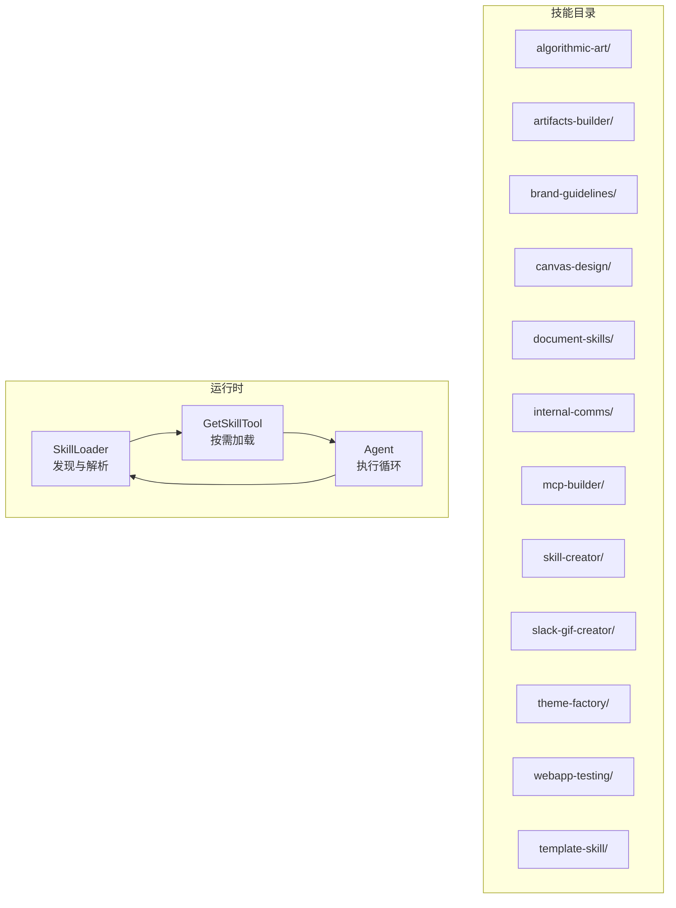
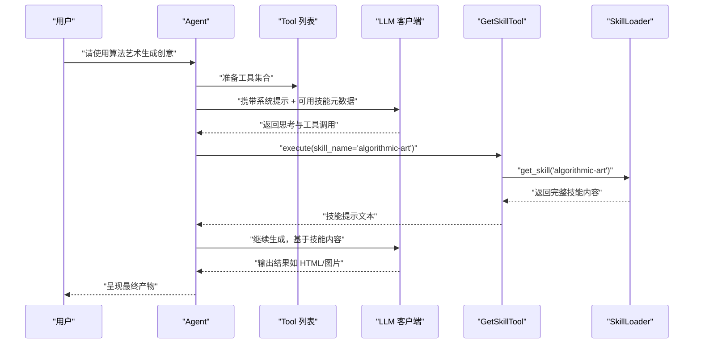
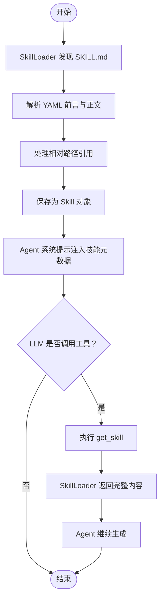

# 内置技能

<cite>
**本文引用的文件**
- [技能总览](file://mini_agent/skills/README.md)
- [Agent 技能规范](file://mini_agent/skills/agent_skills_spec.md)
- [技能加载器](file://mini_agent/tools/skill_loader.py)
- [技能工具](file://mini_agent/tools/skill_tool.py)
- [代理执行器](file://mini_agent/agent.py)
- [算法艺术 SKILL.md](file://mini_agent/skills/algorithmic-art/SKILL.md)
- [工件构建器 SKILL.md](file://mini_agent/skills/artifacts-builder/SKILL.md)
- [品牌指南 SKILL.md](file://mini_agent/skills/brand-guidelines/SKILL.md)
- [画布设计 SKILL.md](file://mini_agent/skills/canvas-design/SKILL.md)
- [内部通信 SKILL.md](file://mini_agent/skills/internal-comms/SKILL.md)
- [MCP 构建器 SKILL.md](file://mini_agent/skills/mcp-builder/SKILL.md)
- [技能创建器 SKILL.md](file://mini_agent/skills/skill-creator/SKILL.md)
- [Slack GIF 创建器 SKILL.md](file://mini_agent/skills/slack-gif-creator/SKILL.md)
- [主题工厂 SKILL.md](file://mini_agent/skills/theme-factory/SKILL.md)
- [Web 应用测试 SKILL.md](file://mini_agent/skills/webapp-testing/SKILL.md)
- [模板技能 SKILL.md](file://mini_agent/skills/template-skill/SKILL.md)
</cite>

## 目录
1. [简介](#简介)
2. [项目结构](#项目结构)
3. [核心组件](#核心组件)
4. [架构总览](#架构总览)
5. [详细组件分析](#详细组件分析)
6. [依赖关系分析](#依赖关系分析)
7. [性能考量](#性能考量)
8. [故障排查指南](#故障排查指南)
9. [结论](#结论)
10. [附录](#附录)

## 简介
本文件系统化梳理 MiniAgent 仓库中的“内置技能”，覆盖以下能力域：算法艺术（生成创意内容）、工件构建器（项目构建）、品牌指南（品牌一致性）、画布设计（视觉设计）、文档技能（PDF/DOCX/PPTX 处理）、内部通信（企业沟通）、MCP 构建器（工具集成）、技能创建器（开发辅助）、Slack GIF 创建器（动画制作）、主题工厂（UI 设计）、Web 应用测试（自动化测试）、模板技能（基础示例）。文档面向不同技术背景读者，既提供高层概览，也给出可操作的使用场景、配置与最佳实践，并附带集成与排错建议。

## 项目结构
内置技能以“技能包”形式组织在 mini_agent/skills 下，每个技能包包含一个 SKILL.md 元数据文件及可选的脚本、参考与资源目录。系统通过技能加载器动态发现并按需注入到代理上下文中，实现“渐进披露”的高效上下文管理。

图示来源
- [技能加载器](file://mini_agent/tools/skill_loader.py)
- [技能工具](file://mini_agent/tools/skill_tool.py)
- [代理执行器](file://mini_agent/agent.py)

章节来源
- [技能总览](file://mini_agent/skills/README.md)
- [Agent 技能规范](file://mini_agent/skills/agent_skills_spec.md)

## 核心组件
- 技能加载器（SkillLoader）
  - 负责递归发现 SKILL.md，解析 YAML 前言元数据，处理相对路径引用，生成 Skill 对象。
  - 支持“渐进披露”：仅在系统提示中列出技能元数据；按需加载完整内容。
- 技能工具（GetSkillTool）
  - 提供 get_skill 工具，允许代理在需要时加载指定技能的完整内容。
- 代理执行器（Agent）
  - 维护消息历史、令牌估算与摘要、工具调用执行、日志记录与取消控制。
  - 在每步推理前进行令牌检查与必要时的历史摘要，保障长对话稳定性。

章节来源
- [技能加载器](file://mini_agent/tools/skill_loader.py)
- [技能工具](file://mini_agent/tools/skill_tool.py)
- [代理执行器](file://mini_agent/agent.py)

## 架构总览
下图展示从用户请求到技能触发、内容加载与工具执行的端到端流程。

图示来源
- [技能工具](file://mini_agent/tools/skill_tool.py)
- [技能加载器](file://mini_agent/tools/skill_loader.py)
- [代理执行器](file://mini_agent/agent.py)

## 详细组件分析

### 算法艺术（Algorithmic Art）
- 使用场景
  - 需要基于 p5.js 的可交互生成式艺术，强调“过程优于产物”“参数化表达”“专家级工艺感”。
  - 适合创意工作坊、演示稿中的动态可视化、教学案例等。
- 关键流程
  - 第一阶段：生成“算法美学”（哲学），定义计算过程、噪声场、粒子系统、参数化变化等。
  - 第二阶段：基于模板 viewer.html 实现可交互 p5.js 演示，包含种子导航、参数控件、颜色选择、下载 PNG 等。
- 输出形态
  - 单文件自解释 HTML（内嵌 p5.js、算法、UI 控件），可在 claude.ai 或任意浏览器直接运行。
- 最佳实践
  - 固定 UI 结构与品牌风格（Anthropic 字体/配色），仅替换算法与参数部分。
  - 强化“受控混沌”与“可重现性”，确保相同种子产生一致结果。
  - 参数命名与范围应与哲学一致，避免无意义的随机性。
- 示例路径
  - [算法艺术 SKILL.md](file://mini_agent/skills/algorithmic-art/SKILL.md)

章节来源
- [算法艺术 SKILL.md](file://mini_agent/skills/algorithmic-art/SKILL.md)

### 工件构建器（Artifacts Builder）
- 使用场景
  - 构建复杂的 claude.ai HTML 工件（多组件、状态管理、路由），适合前端工程化产物。
- 核心步骤
  - 初始化：使用 init-artifact.sh 创建 React/Tailwind/shadcn/ui 项目骨架。
  - 开发：编辑生成代码。
  - 打包：使用 bundle-artifact.sh 将应用打包为单文件 HTML（内联 JS/CSS/资源）。
  - 分享：将 bundle.html 直接作为工件分享给用户。
- 最佳实践
  - 避免“AI 呆板风”，遵循设计指导，减少过度居中、统一圆角与特定字体。
  - 保持单一 HTML 包含所有依赖，便于在 claude.ai 中即时运行。
- 示例路径
  - [工件构建器 SKILL.md](file://mini_agent/skills/artifacts-builder/SKILL.md)

章节来源
- [工件构建器 SKILL.md](file://mini_agent/skills/artifacts-builder/SKILL.md)

### 品牌指南（Brand Guidelines）
- 使用场景
  - 为任何需要“Anthropic 风格”的工件添加品牌色彩与排版，确保跨平台一致性。
- 关键点
  - 主色/强调色、标题/正文字体、智能字体应用策略、颜色应用与可读性保障。
- 最佳实践
  - 优先使用系统已安装字体；若不可用则自动回退至 Arial/Georgia。
  - 形状与非文本元素使用强调色循环，维持视觉活力。
- 示例路径
  - [品牌指南 SKILL.md](file://mini_agent/skills/brand-guidelines/SKILL.md)

章节来源
- [品牌指南 SKILL.md](file://mini_agent/skills/brand-guidelines/SKILL.md)

### 画布设计（Canvas Design）
- 使用场景
  - 创建海报、艺术作品或静态设计，强调“视觉表达、空间传达、极简文字”。
- 关键流程
  - 第一阶段：生成“视觉哲学”（理念、形式、色彩、构图、节奏、层次）。
  - 第二阶段：在画布上表达，产出 .pdf/.png，遵循最小文字原则与专家级工艺感。
- 输出形态
  - 单页或多页 PDF 或 PNG，首页作为“咖啡书”开篇，后续页面作为独特变奏。
- 最佳实践
  - 文字作为情境元素，尽量稀少且融入视觉；排版留白充足，避免重叠。
  - 字体选择与搭配需与哲学一致，优先考虑可读性与情境契合。
- 示例路径
  - [画布设计 SKILL.md](file://mini_agent/skills/canvas-design/SKILL.md)

章节来源
- [画布设计 SKILL.md](file://mini_agent/skills/canvas-design/SKILL.md)

### 文档技能（Document Skills）
- 子技能概览
  - PDF：文本/表格提取、新建 PDF、合并/拆分、表单处理与注释填充。
  - DOCX：创建/编辑/分析 Word 文档，支持修订追踪、批注、格式保留与文本抽取。
  - PPTX：创建/编辑/分析 PowerPoint，支持布局、模板、图表与自动化幻灯片生成。
  - XLSX：创建/编辑/分析 Excel，支持公式、格式、数据分析与可视化。
- 使用建议
  - 作为参考示例学习复杂文件格式与二进制结构处理模式，结合实际业务定制。
  - 注意版本差异与维护状态，建议在生产环境自行封装适配。
- 示例路径
  - [PDF 技能 SKILL.md](file://mini_agent/skills/document-skills/pdf/SKILL.md)
  - [DOCX 技能 SKILL.md](file://mini_agent/skills/document-skills/docx/SKILL.md)
  - [PPTX 技能 SKILL.md](file://mini_agent/skills/document-skills/pptx/SKILL.md)
  - [XLSX 技能 SKILL.md](file://mini_agent/skills/document-skills/xlsx/SKILL.md)

章节来源
- [技能总览](file://mini_agent/skills/README.md)

### 内部通信（Internal Comms）
- 使用场景
  - 编写各类企业内部通讯：3P 更新、公司通讯、FAQ、状态报告、领导更新、项目更新、事件报告等。
- 使用方式
  - 识别通信类型 → 加载对应 examples 下的指导文件 → 按照格式、语调与内容收集要求完成写作。
- 示例路径
  - [内部通信 SKILL.md](file://mini_agent/skills/internal-comms/SKILL.md)

章节来源
- [内部通信 SKILL.md](file://mini_agent/skills/internal-comms/SKILL.md)

### MCP 构建器（MCP Builder）
- 使用场景
  - 为 LLM 构建高质量 MCP（模型上下文协议）服务器，连接外部服务与 API，提供可组合、可评估的工具集。
- 关键阶段
  - 深入研究与规划：理解以代理为中心的设计原则、上下文预算优化、错误消息可行动化、自然任务分解与评估驱动开发。
  - 实现：按语言（Python/Node）最佳实践搭建基础设施、共享工具、输入/输出设计与错误处理。
  - 审查与精炼：代码质量复核、测试与构建、安全与错误处理清单。
  - 评估：创建 10 个真实、复杂、可验证的问题集，形成 XML 评估套件。
- 示例路径
  - [MCP 构建器 SKILL.md](file://mini_agent/skills/mcp-builder/SKILL.md)

章节来源
- [MCP 构建器 SKILL.md](file://mini_agent/skills/mcp-builder/SKILL.md)

### 技能创建器（Skill Creator）
- 使用场景
  - 创建或迭代新的技能，扩展 Claude 的专业领域知识、工作流与工具集成。
- 技能组成
  - 必需：SKILL.md（含 YAML 前言与指令）
  - 可选：scripts/（可执行代码）、references/（按需加载的参考文档）、assets/（输出使用的资源）
- 渐进披露设计
  - 元数据（名称+描述）常驻上下文
  - SKILL.md 正文按需加载
  - 资源按需读取（脚本可直接执行，不占用上下文窗口）
- 示例路径
  - [技能创建器 SKILL.md](file://mini_agent/skills/skill-creator/SKILL.md)

章节来源
- [技能创建器 SKILL.md](file://mini_agent/skills/skill-creator/SKILL.md)

### Slack GIF 创建器（Slack GIF Creator）
- 使用场景
  - 为 Slack 创建动画 GIF，满足消息动图与表情动图的尺寸、帧率、色彩与时长约束。
- 工具体系
  - 校验器：文件大小、尺寸、整体合规性快速检查
  - 动画原语：抖动、弹跳、旋转、脉冲、淡入淡出、缩放、爆炸、摆动、滑动、翻转、变形、移动、万花筒等
  - 辅助工具：GIF 构建器（自动量化、去重帧、警告）、文本渲染（描边提升可读性）、色彩管理、视觉特效、缓动函数、帧合成
- 优化策略
  - 消息 GIF：降低帧数/颜色/分辨率，启用去重帧
  - 表情 GIF：严格限制帧数（10-12）、颜色（32-48）、简化设计、避免渐变
- 示例路径
  - [Slack GIF 创建器 SKILL.md](file://mini_agent/skills/slack-gif-creator/SKILL.md)

章节来源
- [Slack GIF 创建器 SKILL.md](file://mini_agent/skills/slack-gif-creator/SKILL.md)

### 主题工厂（Theme Factory）
- 使用场景
  - 为幻灯片、文档、报告、HTML 页面等应用专业主题，提供 10 套预设主题或在线生成自定义主题。
- 流程
  - 展示主题展示 PDF → 明确选择 → 读取主题文件 → 应用颜色与字体 → 确保对比度与可读性 → 跨页面一致性
- 示例路径
  - [主题工厂 SKILL.md](file://mini_agent/skills/theme-factory/SKILL.md)

章节来源
- [主题工厂 SKILL.md](file://mini_agent/skills/theme-factory/SKILL.md)

### Web 应用测试（Webapp Testing）
- 使用场景
  - 自动化测试本地 Web 应用，验证前端功能、调试 UI 行为、截图与查看浏览器日志。
- 决策树
  - 是否为静态 HTML？是 → 直接读取并定位选择器；否 → 判断服务器是否已启动
  - 未启动 → 使用 with_server.py 启动（支持多服务）→ 运行自动化脚本
  - 已启动 → 探测（等待 networkidle）→ 截图/DOM 检查 → 定位选择器 → 执行动作
- 最佳实践
  - 总是使用同步 Playwright，无头模式启动 Chromium
  - 先等待 networkidle 再检查 DOM
  - 使用描述性选择器（text/role/CSS/ID）与适当等待
- 示例路径
  - [Web 应用测试 SKILL.md](file://mini_agent/skills/webapp-testing/SKILL.md)

章节来源
- [Web 应用测试 SKILL.md](file://mini_agent/skills/webapp-testing/SKILL.md)

### 模板技能（Template Skill）
- 使用场景
  - 新建技能的基础模板，提供最小化的 SKILL.md 结构与 TODO 提示。
- 示例路径
  - [模板技能 SKILL.md](file://mini_agent/skills/template-skill/SKILL.md)

章节来源
- [模板技能 SKILL.md](file://mini_agent/skills/template-skill/SKILL.md)

## 依赖关系分析
- 技能发现与加载
  - SkillLoader 递归扫描 skills 目录，匹配 SKILL.md 并解析元数据与正文。
  - 路径处理：将相对路径转换为绝对路径，支持目录引用与文档链接增强。
- 工具调用链
  - Agent 在每轮推理中携带工具列表；当 LLM 返回工具调用时，执行对应工具（如 get_skill）。
  - get_skill 通过 SkillLoader 获取技能完整提示，再由 Agent 继续生成。
- 上下文与令牌管理
  - Agent 在每步前估算令牌并根据阈值进行历史摘要，避免上下文溢出。
  - 技能采用渐进披露：元数据常驻，正文按需加载，资源按需读取。

图示来源
- [技能加载器](file://mini_agent/tools/skill_loader.py)
- [技能工具](file://mini_agent/tools/skill_tool.py)
- [代理执行器](file://mini_agent/agent.py)

章节来源
- [技能加载器](file://mini_agent/tools/skill_loader.py)
- [技能工具](file://mini_agent/tools/skill_tool.py)
- [代理执行器](file://mini_agent/agent.py)

## 性能考量
- 上下文窗口与令牌估算
  - 使用 cl100k_base 编码器估算令牌，若失败则回退字符计数法。
  - 当本地估算或 API 报告令牌超过阈值时，触发消息摘要，减少冗余上下文。
- 渐进披露
  - 仅在系统提示中暴露技能元数据，正文与资源按需加载，显著降低初始上下文占用。
- 资源访问
  - 脚本可直接执行无需加载到上下文，提高确定性与效率；大文件建议放在 assets/references，按需读取。

## 故障排查指南
- 技能未被发现
  - 确认技能目录包含 SKILL.md，且文件名与目录名一致。
  - 检查 YAML 前言是否包含 name 与 description。
- 路径引用异常
  - 使用相对路径时，确认引用文件存在；系统会尝试转换为绝对路径并提示可用 read_file。
- 工具调用失败
  - 若 get_skill 返回技能不存在，请确认技能名称拼写与可用列表一致。
  - 检查工具参数是否符合定义（例如 skill_name 必填）。
- 令牌超限
  - 观察日志中的本地估算与 API 报告令牌；系统会自动触发摘要；必要时缩短提示或减少上下文。
- Web 应用测试
  - 动态页面务必先等待 networkidle 再检查 DOM；避免在 JS 执行前抓取空内容。
  - 使用 with_server.py 管理多服务生命周期，确保端口与命令正确。

章节来源
- [技能加载器](file://mini_agent/tools/skill_loader.py)
- [技能工具](file://mini_agent/tools/skill_tool.py)
- [代理执行器](file://mini_agent/agent.py)
- [Web 应用测试 SKILL.md](file://mini_agent/skills/webapp-testing/SKILL.md)

## 结论
内置技能体系通过“元数据常驻 + 正文按需 + 资源可选”的渐进披露机制，在保证上下文效率的同时，提供了从创意生成、前端工程、品牌设计、文档处理、企业沟通、MCP 集成、动画制作、主题设计到自动化测试的全栈能力。结合各技能的使用场景、配置要点与最佳实践，可在不同业务与技术背景下灵活组合，快速构建专业级代理工作流。

## 附录
- 快速索引
  - 算法艺术：[算法艺术 SKILL.md](file://mini_agent/skills/algorithmic-art/SKILL.md)
  - 工件构建器：[工件构建器 SKILL.md](file://mini_agent/skills/artifacts-builder/SKILL.md)
  - 品牌指南：[品牌指南 SKILL.md](file://mini_agent/skills/brand-guidelines/SKILL.md)
  - 画布设计：[画布设计 SKILL.md](file://mini_agent/skills/canvas-design/SKILL.md)
  - 文档技能：PDF/DOCX/PPTX/XLSX
    - [PDF 技能 SKILL.md](file://mini_agent/skills/document-skills/pdf/SKILL.md)
    - [DOCX 技能 SKILL.md](file://mini_agent/skills/document-skills/docx/SKILL.md)
    - [PPTX 技能 SKILL.md](file://mini_agent/skills/document-skills/pptx/SKILL.md)
    - [XLSX 技能 SKILL.md](file://mini_agent/skills/document-skills/xlsx/SKILL.md)
  - 内部通信：[内部通信 SKILL.md](file://mini_agent/skills/internal-comms/SKILL.md)
  - MCP 构建器：[MCP 构建器 SKILL.md](file://mini_agent/skills/mcp-builder/SKILL.md)
  - 技能创建器：[技能创建器 SKILL.md](file://mini_agent/skills/skill-creator/SKILL.md)
  - Slack GIF 创建器：[Slack GIF 创建器 SKILL.md](file://mini_agent/skills/slack-gif-creator/SKILL.md)
  - 主题工厂：[主题工厂 SKILL.md](file://mini_agent/skills/theme-factory/SKILL.md)
  - Web 应用测试：[Web 应用测试 SKILL.md](file://mini_agent/skills/webapp-testing/SKILL.md)
  - 模板技能：[模板技能 SKILL.md](file://mini_agent/skills/template-skill/SKILL.md)