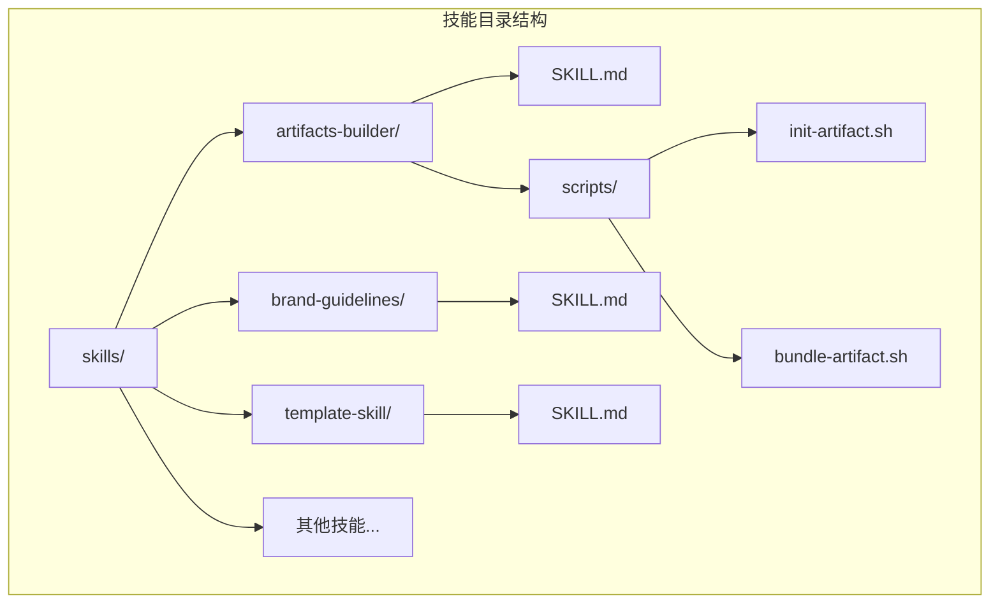
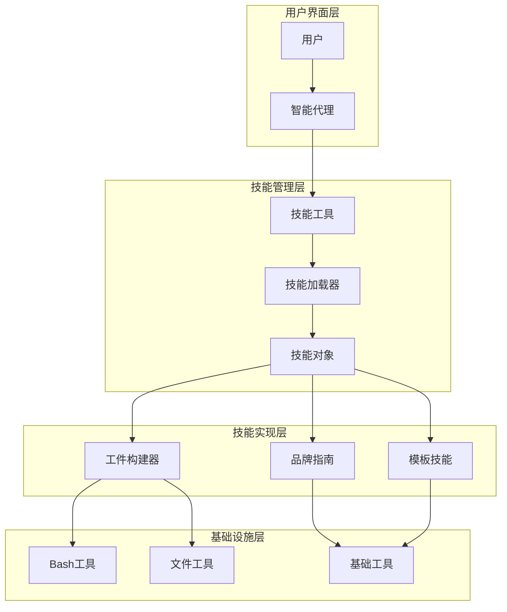
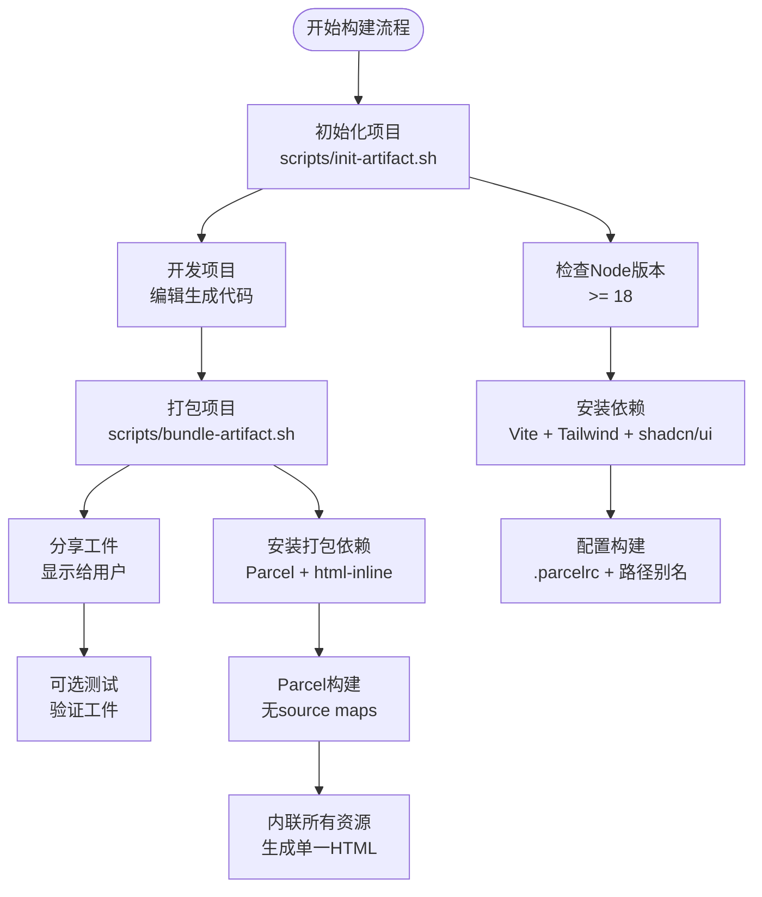
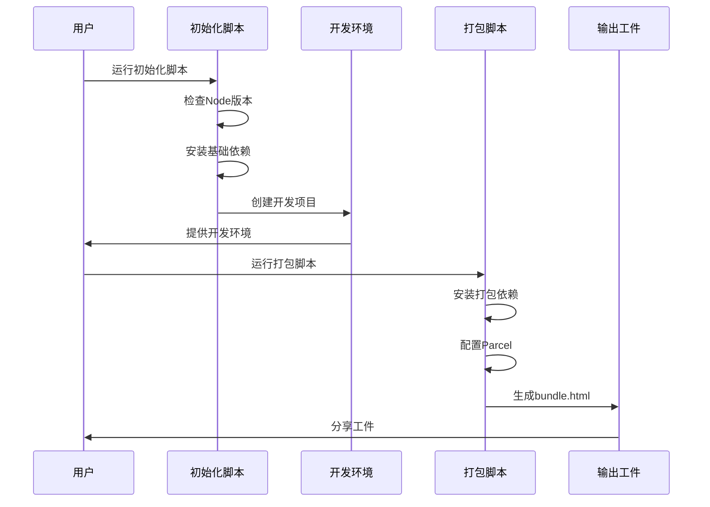
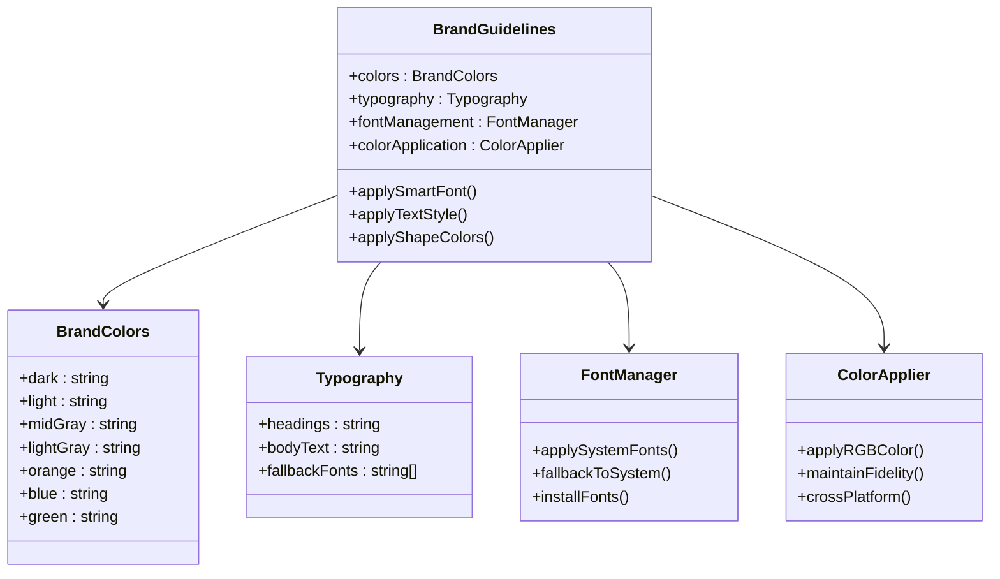
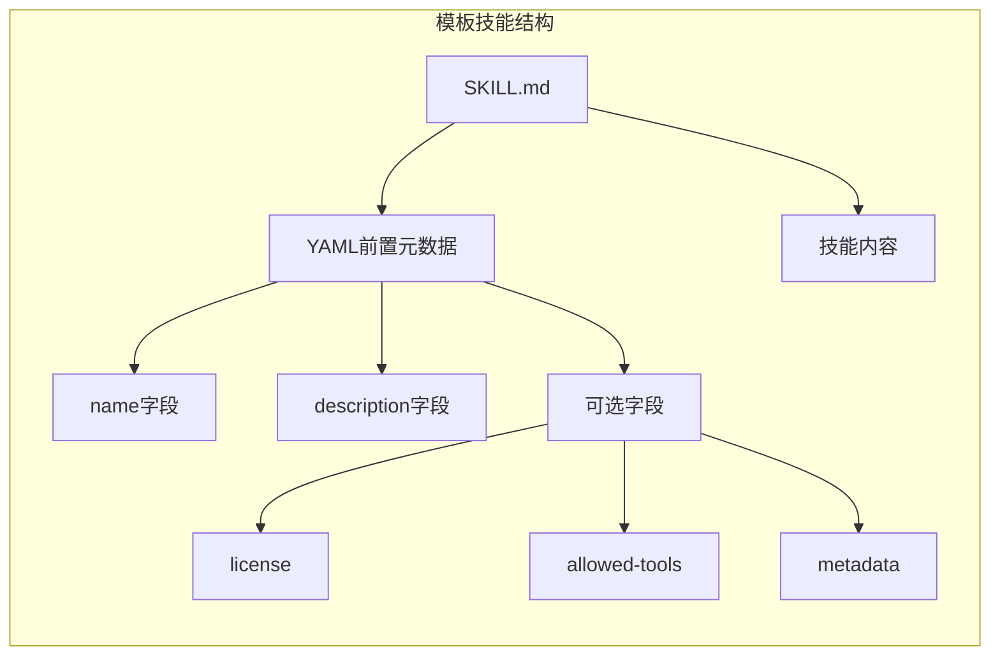
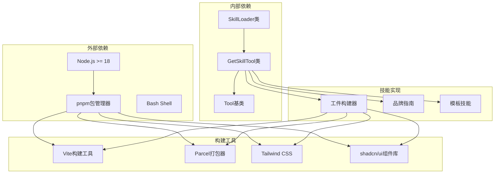

# 实用工具技能

<cite>
**本文档引用的文件**
- [artifacts-builder/SKILL.md](file://mini_agent/skills/artifacts-builder/SKILL.md)
- [artifacts-builder/scripts/bundle-artifact.sh](file://mini_agent/skills/artifacts-builder/scripts/bundle-artifact.sh)
- [artifacts-builder/scripts/init-artifact.sh](file://mini_agent/skills/artifacts-builder/scripts/init-artifact.sh)
- [brand-guidelines/SKILL.md](file://mini_agent/skills/brand-guidelines/SKILL.md)
- [template-skill/SKILL.md](file://mini_agent/skills/template-skill/SKILL.md)
- [agent_skills_spec.md](file://mini_agent/skills/agent_skills_spec.md)
- [skill_loader.py](file://mini_agent/tools/skill_loader.py)
- [skill_tool.py](file://mini_agent/tools/skill_tool.py)
- [base.py](file://mini_agent/tools/base.py)
</cite>

## 目录
1. [简介](#简介)
2. [项目结构](#项目结构)
3. [核心组件](#核心组件)
4. [架构概览](#架构概览)
5. [详细组件分析](#详细组件分析)
6. [依赖关系分析](#依赖关系分析)
7. [性能考虑](#性能考虑)
8. [故障排除指南](#故障排除指南)
9. [结论](#结论)
10. [附录](#附录)

## 简介

实用工具技能是MiniAgent项目中一组专门设计的技能模块，旨在为用户提供强大的工具化解决方案。本文档详细介绍三个核心实用工具技能：工件构建器(Artifacts Builder)、品牌指南(Brand Guidelines)和模板技能(Template Skill)，以及它们在项目管理和标准化流程中的重要作用。

这些技能通过标准化的接口和规范化的实现，为用户提供了可重复使用、可扩展的工具解决方案，显著提高了工作效率和质量标准。每个技能都遵循统一的Agent Skills规范，确保了良好的互操作性和一致性。

## 项目结构

实用工具技能位于项目的`mini_agent/skills/`目录下，采用模块化组织方式：

**图表来源**
- [agent_skills_spec.md:1-56](file://mini_agent/skills/agent_skills_spec.md#L1-L56)

每个技能目录都包含：
- **SKILL.md**: 技能的入口文件，包含YAML前置元数据和Markdown内容
- **脚本文件**: 实现具体功能的Shell脚本
- **许可证文件**: Apache 2.0许可证
- **文档资源**: 相关的技术文档和参考资料

**章节来源**
- [agent_skills_spec.md:17-47](file://mini_agent/skills/agent_skills_spec.md#L17-L47)

## 核心组件

实用工具技能系统由三个主要组件构成，每个组件都有其独特的功能特点和应用场景：

### 工件构建器(Artifacts Builder)
- **功能定位**: 复杂前端工件的创建和打包工具
- **技术栈**: React 18 + TypeScript + Vite + Parcel + Tailwind CSS + shadcn/ui
- **核心能力**: 项目初始化、开发支持、单文件打包、品牌一致性应用
- **适用场景**: 需要复杂交互状态管理、路由或UI组件的前端项目

### 品牌指南(Brand Guidelines)
- **功能定位**: Anthropic官方品牌风格的应用工具
- **核心特性**: 颜色系统、字体管理、智能文本样式、形状和强调色应用
- **技术实现**: 使用python-pptx的RGBColor类进行精确的颜色匹配
- **适用场景**: 需要保持品牌一致性的视觉设计和文档制作

### 模板技能(Template Skill)
- **功能定位**: 最小化的技能模板示例
- **设计目的**: 作为新技能开发的标准模板和参考
- **核心价值**: 提供标准化的技能开发框架和最佳实践

**章节来源**
- [artifacts-builder/SKILL.md:16-16](file://mini_agent/skills/artifacts-builder/SKILL.md#L16-L16)
- [brand-guidelines/SKILL.md:17-36](file://mini_agent/skills/brand-guidelines/SKILL.md#L17-L36)

## 架构概览

实用工具技能系统采用分层架构设计，通过统一的技能加载机制实现模块化管理：

**图表来源**
- [skill_loader.py:47-257](file://mini_agent/tools/skill_loader.py#L47-L257)
- [skill_tool.py:13-85](file://mini_agent/tools/skill_tool.py#L13-L85)

该架构实现了以下关键特性：
- **渐进式披露**: 仅在需要时加载完整技能内容
- **模块化设计**: 各技能独立部署，互不干扰
- **标准化接口**: 统一的工具调用和参数格式
- **可扩展性**: 支持新技能的动态发现和加载

## 详细组件分析

### 工件构建器组件分析

工件构建器是一个完整的前端项目构建生态系统，提供了从项目初始化到最终打包的一站式服务：

#### 核心功能架构

**图表来源**
- [artifacts-builder/SKILL.md:9-14](file://mini_agent/skills/artifacts-builder/SKILL.md#L9-L14)
- [artifacts-builder/scripts/init-artifact.sh:17-24](file://mini_agent/skills/artifacts-builder/scripts/init-artifact.sh#L17-L24)
- [artifacts-builder/scripts/bundle-artifact.sh:19-44](file://mini_agent/skills/artifacts-builder/scripts/bundle-artifact.sh#L19-L44)

#### 技术实现细节

工件构建器的核心实现基于以下关键技术：

1. **Node.js版本兼容性**: 自动检测Node版本并选择合适的Vite版本
2. **依赖管理系统**: 使用pnpm进行包管理，确保依赖版本一致性
3. **构建工具链**: 结合Vite进行开发构建，Parcel进行生产环境打包
4. **资源内联策略**: 将所有JavaScript、CSS和依赖项内联到单一HTML文件

#### 开发工作流程

**图表来源**
- [artifacts-builder/scripts/init-artifact.sh:58-75](file://mini_agent/skills/artifacts-builder/scripts/init-artifact.sh#L58-L75)
- [artifacts-builder/scripts/bundle-artifact.sh:38-44](file://mini_agent/skills/artifacts-builder/scripts/bundle-artifact.sh#L38-L44)

**章节来源**
- [artifacts-builder/SKILL.md:22-74](file://mini_agent/skills/artifacts-builder/SKILL.md#L22-L74)
- [artifacts-builder/scripts/init-artifact.sh:1-323](file://mini_agent/skills/artifacts-builder/scripts/init-artifact.sh#L1-L323)

### 品牌指南组件分析

品牌指南技能专注于Anthropic官方品牌风格的标准化应用，确保所有输出内容保持一致的品牌识别度：

#### 品牌元素系统

**图表来源**
- [brand-guidelines/SKILL.md:17-74](file://mini_agent/skills/brand-guidelines/SKILL.md#L17-L74)

#### 品牌一致性保证机制

品牌指南通过以下机制确保品牌一致性：

1. **颜色系统**: 定义主色调和强调色的精确RGB值
2. **字体管理**: 智能字体应用和自动回退机制
3. **文本样式**: 基于背景智能选择颜色的文本处理
4. **形状设计**: 循环使用强调色的非文本元素设计

#### 技术实现特点

- **精确色彩控制**: 使用python-pptx的RGBColor类确保跨平台色彩一致性
- **系统兼容性**: 自动检测和利用系统已安装字体
- **可访问性优先**: 智能颜色选择确保文本可读性
- **品牌保护**: 避免过度使用特定设计模式，防止"AI slop"

**章节来源**
- [brand-guidelines/SKILL.md:15-74](file://mini_agent/skills/brand-guidelines/SKILL.md#L15-L74)

### 模板技能组件分析

模板技能作为最小化的技能示例，提供了标准化的技能开发框架：

#### 模板结构设计

**图表来源**
- [template-skill/SKILL.md:1-7](file://mini_agent/skills/template-skill/SKILL.md#L1-L7)

#### 开发指导原则

模板技能体现了以下开发原则：
- **简洁性**: 最小化实现，突出核心概念
- **标准化**: 遵循Agent Skills规范的所有要求
- **可扩展性**: 为复杂技能提供清晰的扩展路径
- **文档驱动**: 通过SKILL.md文件提供完整的使用说明

**章节来源**
- [template-skill/SKILL.md:1-7](file://mini_agent/skills/template-skill/SKILL.md#L1-L7)

## 依赖关系分析

实用工具技能系统的依赖关系体现了清晰的层次结构和模块化设计：

**图表来源**
- [artifacts-builder/scripts/init-artifact.sh:7-37](file://mini_agent/skills/artifacts-builder/scripts/init-artifact.sh#L7-L37)
- [artifacts-builder/scripts/bundle-artifact.sh:21-21](file://mini_agent/skills/artifacts-builder/scripts/bundle-artifact.sh#L21-L21)
- [skill_loader.py:47-257](file://mini_agent/tools/skill_loader.py#L47-L257)

### 关键依赖特性

1. **版本兼容性**: Node.js 18+要求确保现代JavaScript特性的支持
2. **包管理策略**: pnpm提供确定性的依赖解析和安装
3. **构建工具链**: Vite用于开发环境，Parcel用于生产环境优化
4. **UI组件系统**: Tailwind CSS + shadcn/ui提供一致的UI设计语言

**章节来源**
- [artifacts-builder/scripts/init-artifact.sh:17-24](file://mini_agent/skills/artifacts-builder/scripts/init-artifact.sh#L17-L24)
- [skill_loader.py:47-85](file://mini_agent/tools/skill_loader.py#L47-L85)

## 性能考虑

实用工具技能系统在设计时充分考虑了性能优化和用户体验：

### 工件构建器性能优化

1. **增量构建**: 只在必要时重新安装依赖
2. **并行处理**: 利用pnpm的并行安装能力
3. **缓存策略**: 避免重复的构建步骤
4. **资源内联**: 减少HTTP请求次数，提高加载速度

### 品牌指南性能特性

1. **轻量级处理**: 基于CSS和HTML的样式应用，无额外运行时开销
2. **系统集成**: 利用系统字体，避免额外的字体加载时间
3. **静态配置**: 品牌参数预定义，无需运行时计算

### 模板技能优化

1. **最小化开销**: 最简单的实现确保最快的响应时间
2. **标准化结构**: 预定义的模板减少开发时间
3. **可预测行为**: 固定的接口确保稳定的性能表现

## 故障排除指南

### 工件构建器常见问题

#### Node.js版本问题
**症状**: 初始化脚本报错，提示Node.js版本过低
**解决方案**: 
- 升级到Node.js 18或更高版本
- 检查系统PATH环境变量
- 验证Node.js安装完整性

#### pnpm安装失败
**症状**: 包管理器安装过程中断
**解决方案**:
- 检查网络连接稳定性
- 清理npm缓存：`npm cache clean --force`
- 使用代理设置或更换镜像源

#### 构建失败
**症状**: Parcel构建过程中出现错误
**解决方案**:
- 检查index.html文件是否存在且格式正确
- 验证package.json配置
- 清理node_modules和dist目录后重试

### 品牌指南使用问题

#### 字体显示异常
**症状**: 文本未按预期使用指定字体
**解决方案**:
- 确认系统已安装所需字体
- 检查字体回退机制是否正常工作
- 验证CSS样式是否正确应用

#### 颜色显示不一致
**症状**: 不同平台上颜色显示差异较大
**解决方案**:
- 确保使用RGB颜色值而非十六进制
- 检查显示器色彩校准设置
- 验证跨平台兼容性

### 模板技能问题

#### 技能加载失败
**症状**: 系统无法识别或加载模板技能
**解决方案**:
- 验证SKILL.md文件格式正确
- 检查YAML前置元数据语法
- 确认技能目录命名符合规范

**章节来源**
- [artifacts-builder/scripts/init-artifact.sh:11-15](file://mini_agent/skills/artifacts-builder/scripts/init-artifact.sh#L11-L15)
- [artifacts-builder/scripts/bundle-artifact.sh:7-17](file://mini_agent/skills/artifacts-builder/scripts/bundle-artifact.sh#L7-L17)

## 结论

实用工具技能系统为MiniAgent项目提供了强大而灵活的工具化解决方案。通过工件构建器、品牌指南和模板技能三个核心组件，系统实现了：

### 主要优势

1. **标准化流程**: 统一的技能开发和部署标准
2. **模块化设计**: 独立的功能模块，便于维护和扩展
3. **自动化程度高**: 减少手动操作，提高工作效率
4. **质量保证**: 严格的品牌一致性和技术规范

### 应用价值

- **项目管理**: 标准化的构建流程和质量控制
- **品牌管理**: 确保所有输出内容的品牌一致性
- **开发效率**: 提供即用的工具和模板，加速开发进程
- **协作支持**: 统一的接口和规范促进团队协作

### 发展前景

实用工具技能系统为未来的功能扩展奠定了坚实基础。通过持续的优化和改进，该系统将继续提升用户体验，为企业级应用提供更强大的技术支持。

## 附录

### 最佳实践建议

1. **技能开发**: 遵循Agent Skills规范，确保标准化和一致性
2. **版本管理**: 定期更新依赖版本，保持技术栈的现代化
3. **文档维护**: 及时更新技能文档，确保信息的准确性
4. **测试覆盖**: 为重要功能编写单元测试和集成测试
5. **性能监控**: 建立性能指标监控，及时发现和解决问题

### 使用示例

#### 工件构建器使用流程
1. 运行初始化脚本创建新项目
2. 在生成的项目中添加业务逻辑
3. 使用打包脚本生成最终工件
4. 在Claude对话中分享生成的HTML文件

#### 品牌指南应用示例
1. 在需要品牌一致性的场景中启用品牌指南
2. 系统自动应用正确的颜色和字体
3. 验证输出内容的品牌合规性
4. 根据反馈调整品牌应用策略

#### 模板技能使用建议
1. 将模板技能作为新技能开发的起点
2. 参考现有技能的最佳实践
3. 保持技能功能的专注和简洁
4. 提供清晰的使用说明和示例