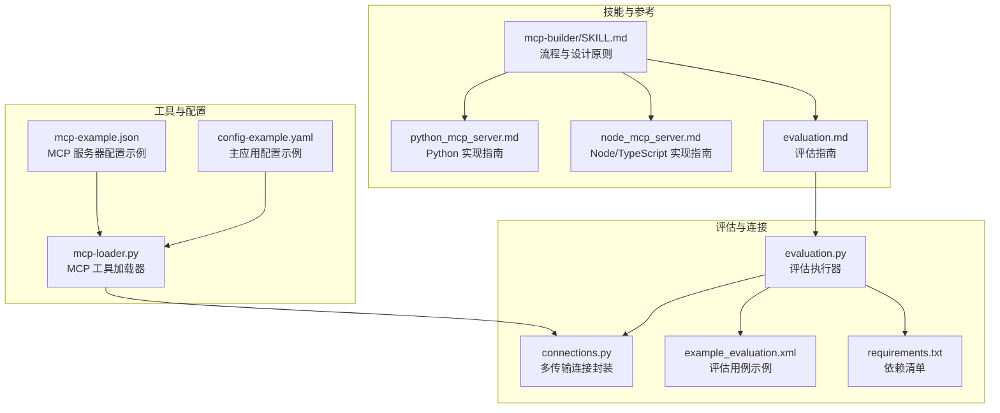
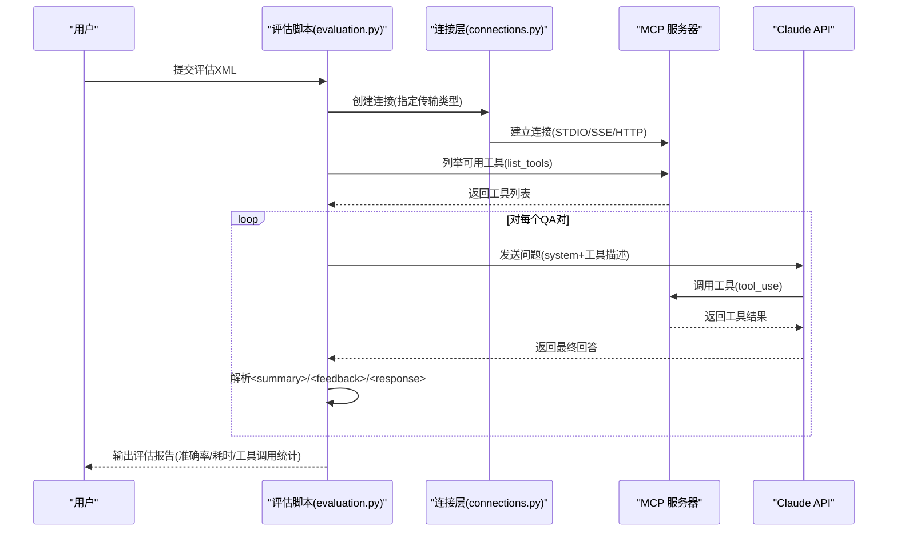
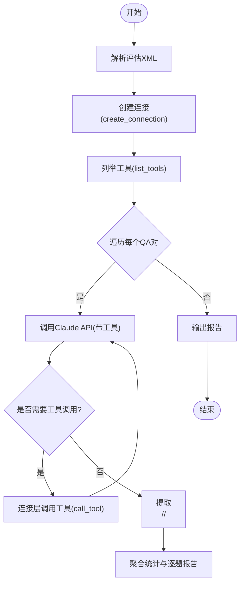
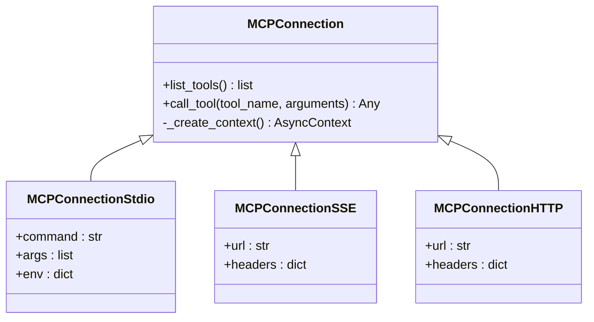
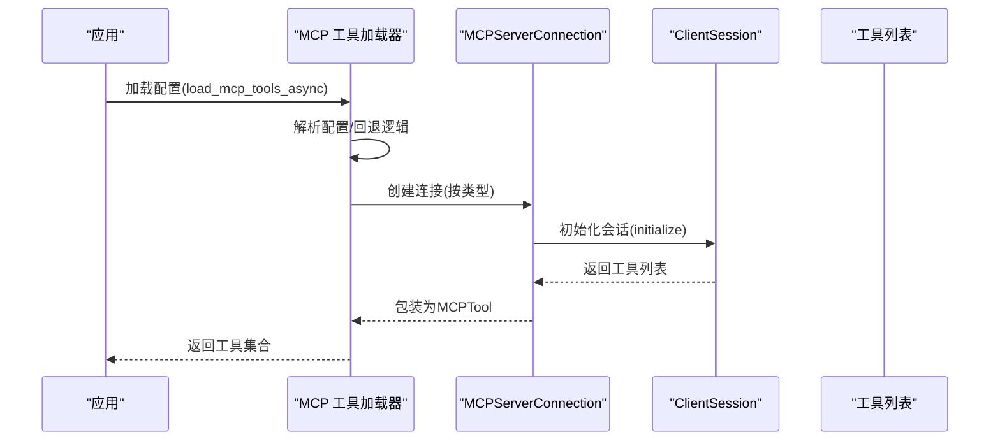
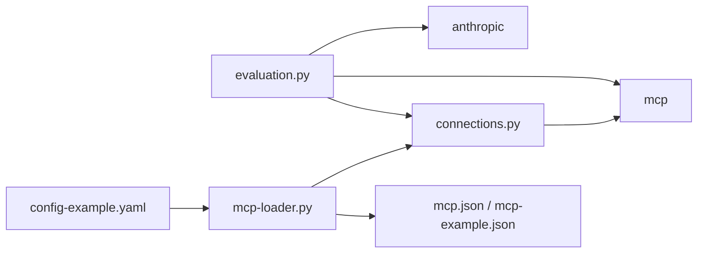

# MCP 构建器技能

<cite>
**本文引用的文件**
- [mcp-builder/SKILL.md](file://mini_agent/skills/mcp-builder/SKILL.md)
- [evaluation.md](file://mini_agent/skills/mcp-builder/reference/evaluation.md)
- [python_mcp_server.md](file://mini_agent/skills/mcp-builder/reference/python_mcp_server.md)
- [node_mcp_server.md](file://mini_agent/skills/mcp-builder/reference/node_mcp_server.md)
- [evaluation.py](file://mini_agent/skills/mcp-builder/scripts/evaluation.py)
- [connections.py](file://mini_agent/skills/mcp-builder/scripts/connections.py)
- [example_evaluation.xml](file://mini_agent/skills/mcp-builder/scripts/example_evaluation.xml)
- [requirements.txt](file://mini_agent/skills/mcp-builder/scripts/requirements.txt)
- [mcp-loader.py](file://mini_agent/tools/mcp_loader.py)
- [mcp-example.json](file://mini_agent/config/mcp-example.json)
- [config-example.yaml](file://mini_agent/config/config-example.yaml)
- [README.md](file://README.md)
</cite>

## 目录
1. [简介](#简介)
2. [项目结构](#项目结构)
3. [核心组件](#核心组件)
4. [架构总览](#架构总览)
5. [详细组件分析](#详细组件分析)
6. [依赖关系分析](#依赖关系分析)
7. [性能考量](#性能考量)
8. [故障排查指南](#故障排查指南)
9. [结论](#结论)
10. [附录](#附录)

## 简介
本技能面向希望基于 MCP（模型上下文协议）构建高质量 MCP 服务器的开发者，帮助你将外部服务与 API 无缝接入到智能体工具系统中。文档覆盖四阶段开发流程：深入研究与规划、实现、审查与改进、评估；并围绕代理中心设计原则、上下文限制优化、可操作错误消息设计等核心主题，提供 Python（FastMCP）与 Node/TypeScript（MCP SDK）两种实现路径的完整指导，包含项目结构设置、核心基础设施、工具系统设计、代码质量审查以及评估与测试方法（含 10 个评估问题的创建与 XML 输出规范）。

## 项目结构
该仓库提供了 MCP 构建器技能的完整参考与脚手架，重点模块如下：
- 技能文档与最佳实践：位于 mcp-builder 目录，包含流程指南、语言实现指南与评估指南
- 评估脚本与连接层：位于 mcp-builder/scripts，提供统一的评估执行器与多传输连接封装
- 工具加载器：位于 mini_agent/tools，提供 MCP 工具加载、超时控制与连接管理
- 配置模板：位于 mini_agent/config，提供 MCP 服务器配置样例与主应用配置

图表来源
- [mcp-builder/SKILL.md:1-329](file://mini_agent/skills/mcp-builder/SKILL.md#L1-L329)
- [evaluation.md:1-602](file://mini_agent/skills/mcp-builder/reference/evaluation.md#L1-L602)
- [python_mcp_server.md:1-752](file://mini_agent/skills/mcp-builder/reference/python_mcp_server.md#L1-L752)
- [node_mcp_server.md:1-916](file://mini_agent/skills/mcp-builder/reference/node_mcp_server.md#L1-L916)
- [evaluation.py:1-374](file://mini_agent/skills/mcp-builder/scripts/evaluation.py#L1-L374)
- [connections.py:1-152](file://mini_agent/skills/mcp-builder/scripts/connections.py#L1-L152)
- [example_evaluation.xml:1-23](file://mini_agent/skills/mcp-builder/scripts/example_evaluation.xml#L1-L23)
- [requirements.txt:1-3](file://mini_agent/skills/mcp-builder/scripts/requirements.txt#L1-L3)
- [mcp-loader.py:1-434](file://mini_agent/tools/mcp_loader.py#L1-L434)
- [mcp-example.json:1-29](file://mini_agent/config/mcp-example.json#L1-L29)
- [config-example.yaml:1-61](file://mini_agent/config/config-example.yaml#L1-L61)

章节来源
- [README.md:1-345](file://README.md#L1-L345)
- [mcp-builder/SKILL.md:1-329](file://mini_agent/skills/mcp-builder/SKILL.md#L1-L329)

## 核心组件
- 四阶段开发流程
  - 深入研究与规划：理解代理中心设计原则、MCP 协议与框架文档、目标 API 文档，制定实现计划
  - 实现：按语言最佳实践搭建项目结构、实现核心基础设施与工具系统
  - 审查与改进：代码质量评审、测试与构建、遵循语言特定检查清单
  - 评估：创建 10 个评估问题，输出符合规范的 XML 文件，运行评估脚本验证效果
- 设计原则
  - 代理中心：为工作流而非 API 端点构建工具；优化有限上下文；设计可操作错误消息；遵循自然任务细分；采用评估驱动开发
  - 上下文限制优化：提供“简洁/详细”响应选项、默认人类可读标识符、考虑上下文预算
  - 可操作错误消息：指导下一步行动、帮助学习正确用法
- 评估体系
  - 10 个独立、只读、非破坏性、幂等的问题，复杂度高、答案稳定且单一可验证
  - XML 输出格式严格规范，包含题目与标准答案对

章节来源
- [mcp-builder/SKILL.md:15-329](file://mini_agent/skills/mcp-builder/SKILL.md#L15-L329)
- [evaluation.md:1-602](file://mini_agent/skills/mcp-builder/reference/evaluation.md#L1-L602)

## 架构总览
MCP 服务器通过 MCP SDK 在不同传输层（STDIO、SSE、HTTP）暴露工具接口，评估脚本通过统一连接层与 MCP 客户端交互，自动列举工具、调用工具并汇总报告。

图表来源
- [evaluation.py:1-374](file://mini_agent/skills/mcp-builder/scripts/evaluation.py#L1-L374)
- [connections.py:1-152](file://mini_agent/skills/mcp-builder/scripts/connections.py#L1-L152)

## 详细组件分析

### 组件A：评估执行器（evaluation.py）
- 功能要点
  - 解析评估 XML，逐条执行
  - 通过 MCP 连接层列出工具、调用工具并记录指标
  - 使用 Claude API 执行工具调用循环，提取 
、<feedback>、<response>
  - 生成摘要统计与逐题报告
- 关键流程
  - 命令行参数解析（传输类型、模型、URL/命令、环境变量等）
  - 连接工厂 create_connection 创建具体连接
  - agent_loop 循环工具调用直至停止原因非 tool_use
  - 结果聚合与报告模板渲染

图表来源
- [evaluation.py:56-184](file://mini_agent/skills/mcp-builder/scripts/evaluation.py#L56-L184)
- [connections.py:55-71](file://mini_agent/skills/mcp-builder/scripts/connections.py#L55-L71)

章节来源
- [evaluation.py:1-374](file://mini_agent/skills/mcp-builder/scripts/evaluation.py#L1-L374)

### 组件B：连接层（connections.py）
- 支持三种传输
  - STDIO：本地子进程启动 MCP 服务器
  - SSE：Server-Sent Events
  - HTTP(Streamable HTTP)：HTTP 推流式传输
- 统一抽象 MCPConnection，派生 STDIO/SSE/HTTP 三类连接
- 提供 list_tools 与 call_tool 封装

图表来源
- [connections.py:13-152](file://mini_agent/skills/mcp-builder/scripts/connections.py#L13-L152)

章节来源
- [connections.py:1-152](file://mini_agent/skills/mcp-builder/scripts/connections.py#L1-L152)

### 组件C：MCP 工具加载器（mcp-loader.py）
- 功能要点
  - 从配置文件加载多个 MCP 服务器（支持 STDIO/URL）
  - 自动连接、列举工具并包装为通用 Tool 接口
  - 超时控制：连接超时、执行超时、SSE 读超时
  - 支持按服务器粒度覆盖超时参数
- 关键流程
  - 解析配置（支持 mcp.json 或回退到 mcp-example.json）
  - 根据类型自动判定（无 url 默认 streamable_http，否则 stdio）
  - 连接后列出工具并封装为 MCPTool 列表

图表来源
- [mcp-loader.py:330-434](file://mini_agent/tools/mcp_loader.py#L330-L434)
- [mcp-example.json:1-29](file://mini_agent/config/mcp-example.json#L1-L29)

章节来源
- [mcp-loader.py:1-434](file://mini_agent/tools/mcp_loader.py#L1-L434)
- [mcp-example.json:1-29](file://mini_agent/config/mcp-example.json#L1-L29)

### 组件D：评估指南与问题设计（evaluation.md）
- 评估目的：检验 MCP 服务器是否能让智能体仅凭工具完成真实复杂问题
- 评估要求
  - 10 个问题，只读、独立、非破坏性、幂等
  - 复杂度高（可能数十次工具调用）、答案稳定且单一可验证
  - 答案优先人类可读、避免复杂结构
- 输出格式：XML，包含若干 <qa_pair>，每个包含 <question> 与 <answer>
- 示例：提供多类良好/不良问题示例，帮助判断复杂度与稳定性

章节来源
- [evaluation.md:1-602](file://mini_agent/skills/mcp-builder/reference/evaluation.md#L1-L602)
- [example_evaluation.xml:1-23](file://mini_agent/skills/mcp-builder/scripts/example_evaluation.xml#L1-L23)

### 组件E：Python 实现指南（python_mcp_server.md）
- 快速参考：关键导入、服务器初始化、装饰器注册模式
- 命名约定：服务器名 {service}_mcp，工具名 snake_case
- 输入验证：Pydantic v2 模型 + Field 约束 + str_strip_whitespace + validate_assignment
- 输出格式：Markdown/JSON 双模，支持 ResponseFormat 枚举
- 分页与字符限制：limit/offset 参数 + CHARACTER_LIMIT 截断策略
- 错误处理：统一格式化错误消息，区分 404/403/429/超时等
- 共享工具：_make_api_request/_handle_api_error 等复用函数
- 最佳实践：异步/等待、类型提示、避免重复代码、资源注册、生命周期管理、多传输选择

章节来源
- [python_mcp_server.md:1-752](file://mini_agent/skills/mcp-builder/reference/python_mcp_server.md#L1-L752)

### 组件F：Node/TypeScript 实现指南（node_mcp_server.md）
- 快速参考：McpServer、StdioServerTransport、Zod 验证
- 命名约定：服务器名 {service}-mcp-server，工具名 snake_case
- 项目结构：src 下 index.ts、types.ts、tools/、services/、schemas/、constants.ts
- 输入验证：Zod strict schema + 类型推断 z.infer
- 输出格式：Markdown/JSON，枚举 ResponseFormat
- 分页与字符限制：limit/offset + CHARACTER_LIMIT
- 错误处理：AxiosError 分支处理 + handleApiError
- 最佳实践：严格 TS、避免 any、明确 Promise 返回类型、资源注册、多传输选择

章节来源
- [node_mcp_server.md:1-916](file://mini_agent/skills/mcp-builder/reference/node_mcp_server.md#L1-L916)

## 依赖关系分析
- 评估脚本依赖
  - anthropic：调用 Claude API
  - mcp：MCP 客户端会话与传输
- 运行时依赖
  - Python：pydantic、httpx、typing、enum
  - Node/TypeScript：@modelcontextprotocol/sdk、axios、zod
- 配置与加载
  - mcp.json（或回退 mcp-example.json）定义服务器连接参数
  - config-example.yaml 控制主应用工具开关与 MCP 超时参数

图表来源
- [evaluation.py:17-19](file://mini_agent/skills/mcp-builder/scripts/evaluation.py#L17-L19)
- [requirements.txt:1-3](file://mini_agent/skills/mcp-builder/scripts/requirements.txt#L1-L3)
- [mcp-loader.py:1-16](file://mini_agent/tools/mcp_loader.py#L1-L16)
- [mcp-example.json:1-29](file://mini_agent/config/mcp-example.json#L1-L29)
- [config-example.yaml:56-61](file://mini_agent/config/config-example.yaml#L56-L61)

章节来源
- [requirements.txt:1-3](file://mini_agent/skills/mcp-builder/scripts/requirements.txt#L1-L3)
- [config-example.yaml:56-61](file://mini_agent/config/config-example.yaml#L56-L61)

## 性能考量
- 上下文限制优化
  - 提供“简洁/详细”响应选项，优先人类可读标识符
  - 限制单次响应字符数（如 25000），必要时截断并提示分页/过滤
- 工具调用效率
  - 合理分页（limit/offset）与过滤参数，避免一次性返回海量数据
  - 复用共享工具函数，减少重复网络请求
- 传输与超时
  - 为不同传输设置合理超时（连接/执行/SSE 读），防止阻塞
  - 评估脚本中对工具调用次数与平均耗时进行统计，便于定位瓶颈

## 故障排查指南
- 连接错误
  - STDIO：确认命令与参数正确；确保服务器在子进程中运行
  - SSE/HTTP：检查 URL 可达性与认证头；确认所需 API Key 已注入
- 低准确率
  - 检查工具描述是否清晰完整；输入参数文档是否明确
  - 工具返回数据量过大导致上下文不足；调整响应格式或增加分页
- 超时问题
  - 提升模型能力；优化工具返回大小；确保分页与过滤生效
  - 调整 MCP 超时配置（连接/执行/SSE 读）

章节来源
- [evaluation.md:578-602](file://mini_agent/skills/mcp-builder/reference/evaluation.md#L578-L602)
- [config-example.yaml:57-61](file://mini_agent/config/config-example.yaml#L57-L61)

## 结论
通过本技能文档，你可以系统地完成 MCP 服务器的设计与实现：先以代理中心原则与上下文限制优化为指导，再依据语言最佳实践完成工程落地，随后以评估驱动持续改进，最终形成可验证、可扩展、可维护的 MCP 工具体系。评估脚本与连接层为质量保障提供了标准化手段，建议在团队内推广使用统一的评估流程与报告模板。

## 附录
- 评估问题创建步骤
  - 工具检查：列举工具、理解输入/输出与注解
  - 内容探索：使用只读工具探索数据，确定具体实体
  - 问题生成：创建 10 个独立、只读、非破坏性、幂等、复杂且稳定的题目
  - 答案验证：自行解答每个问题，确保答案唯一且可直接字符串比较
  - 输出格式：按照 XML 规范生成评估文件
- 评估运行
  - 安装依赖：pip install anthropic mcp
  - 设置 API Key：导出 ANTHROPIC_API_KEY
  - 运行评估：根据传输类型选择 stdio/sse/http，传入评估 XML 与必要参数
  - 查看报告：输出到文件或标准输出，包含准确率、平均耗时、工具调用统计与逐题摘要与反馈

章节来源
- [evaluation.md:378-577](file://mini_agent/skills/mcp-builder/reference/evaluation.md#L378-L577)
- [requirements.txt:1-3](file://mini_agent/skills/mcp-builder/scripts/requirements.txt#L1-L3)
- [config-example.yaml:19-26](file://mini_agent/config/config-example.yaml#L19-L26)