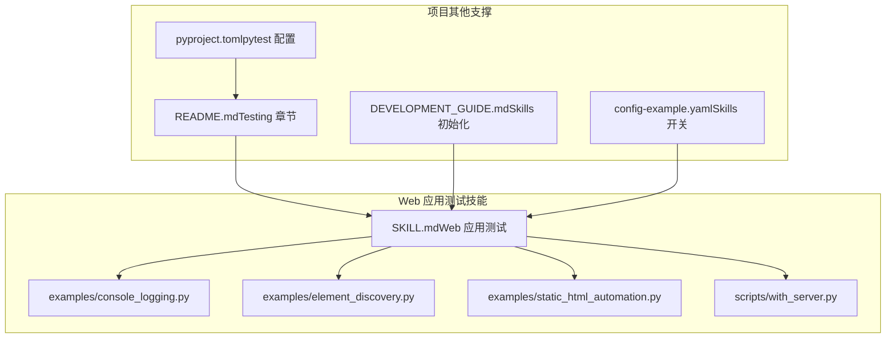
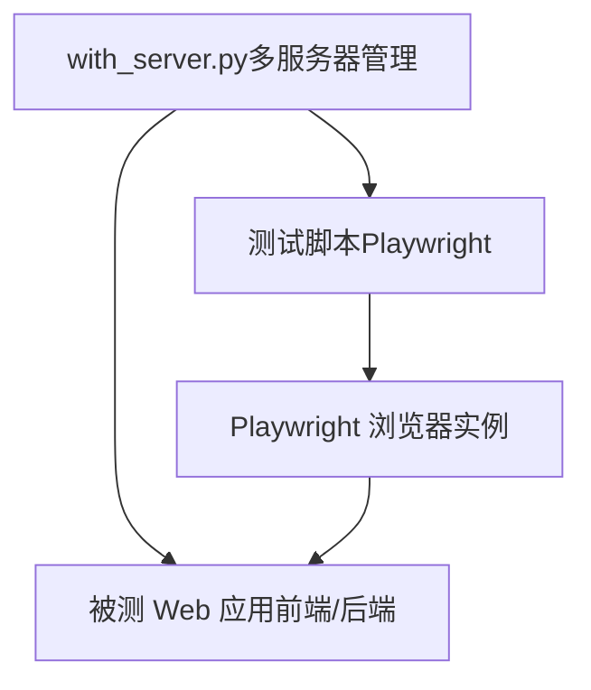
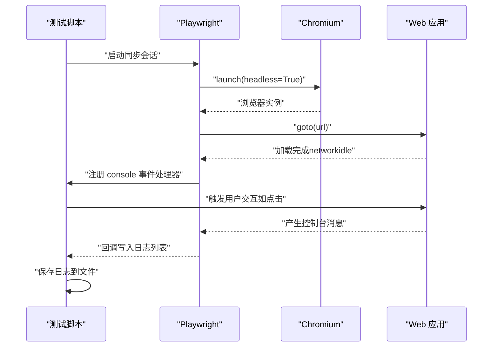
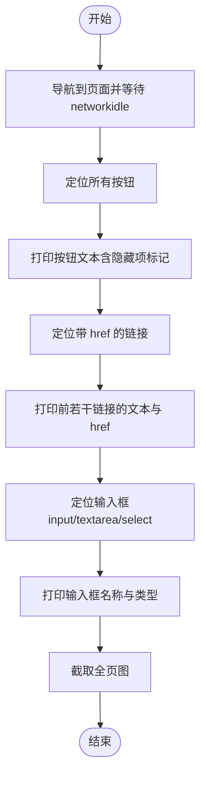
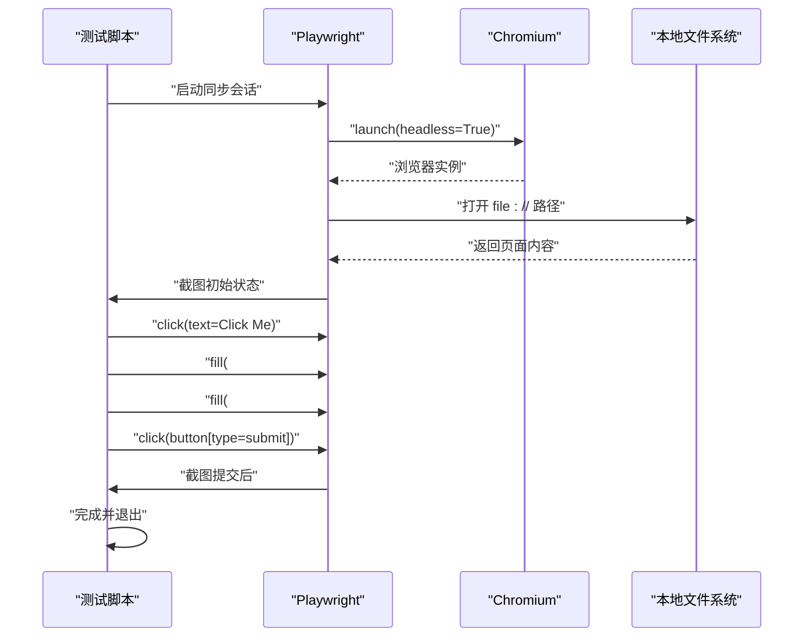
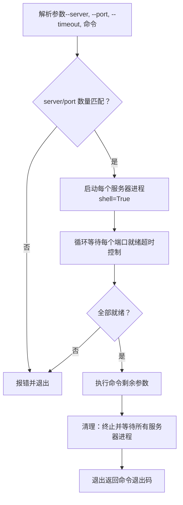
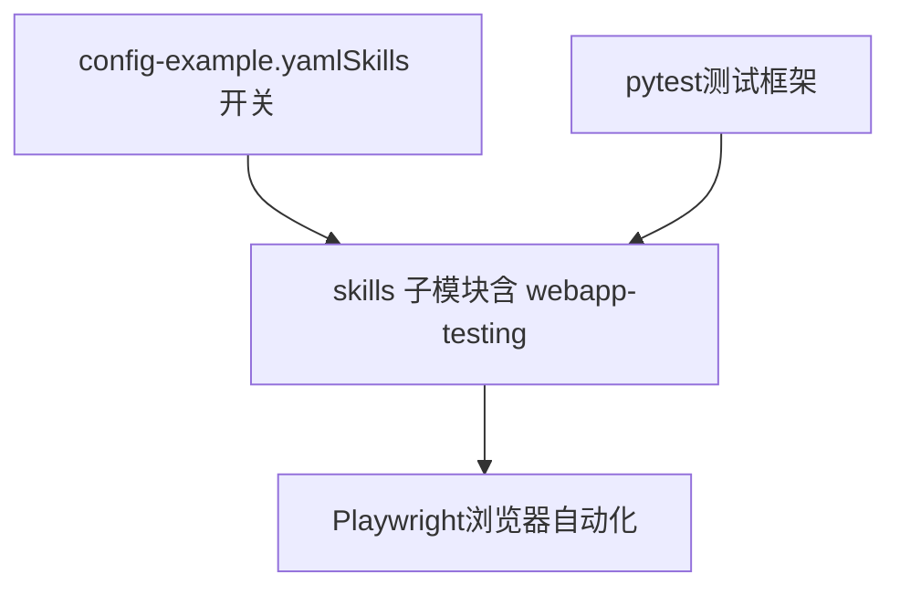

# Web 应用测试技能

<cite>
**本文引用的文件**
- [README.md](file://README.md)
- [DEVELOPMENT_GUIDE.md](file://docs/DEVELOPMENT_GUIDE.md)
- [pyproject.toml](file://pyproject.toml)
- [config-example.yaml](file://mini_agent/config/config-example.yaml)
- [SKILL.md（Web 应用测试）](file://mini_agent/skills/webapp-testing/SKILL.md)
- [with_server.py](file://mini_agent/skills/webapp-testing/scripts/with_server.py)
- [console_logging.py](file://mini_agent/skills/webapp-testing/examples/console_logging.py)
- [element_discovery.py](file://mini_agent/skills/webapp-testing/examples/element_discovery.py)
- [static_html_automation.py](file://mini_agent/skills/webapp-testing/examples/static_html_automation.py)
- [技能总览](file://mini_agent/skills/README.md)
- [示例总览](file://examples/README.md)
- [test_tools.py](file://tests/test_tools.py)
- [test_agent.py](file://tests/test_agent.py)
</cite>

## 目录
1. [简介](#简介)
2. [项目结构](#项目结构)
3. [核心组件](#核心组件)
4. [架构概览](#架构概览)
5. [详细组件分析](#详细组件分析)
6. [依赖分析](#依赖分析)
7. [性能考虑](#性能考虑)
8. [故障排查指南](#故障排查指南)
9. [结论](#结论)
10. [附录](#附录)

## 简介
本文件系统性介绍 Web 应用测试技能，围绕 Playwright 自动化与本地 Web 应用测试展开，覆盖以下主题：
- 使用 Playwright 进行控制台日志记录、元素发现、静态 HTML 自动化等核心测试场景
- with_server.py 的使用方法与服务器生命周期管理
- 测试脚本执行机制与最佳实践（用例设计、断言策略、错误处理）
- 持续集成集成建议（自动化测试流水线、测试报告、性能监控）
- 工具扩展与定制方法（按需调整测试策略）

该能力由 Claude Skills 子模块中的 webapp-testing 技能提供，配合 with_server.py 辅助脚本可实现“启动服务 → 执行自动化 → 清理”的完整闭环。

章节来源
- [README.md: “Testing” 部分:262-282](file://README.md#L262-L282)
- [技能总览: “webapp-testing” 描述](file://mini_agent/skills/README.md#L36)

## 项目结构
Web 应用测试技能位于 skills/webapp-testing 目录，包含：
- examples/：常见模式示例（控制台日志、元素发现、静态 HTML 自动化）
- scripts/with_server.py：多服务器生命周期管理脚本
- SKILL.md：技能说明、决策树、参考文件清单

下图展示与测试相关的核心文件与职责：

图表来源
- [SKILL.md（Web 应用测试）:1-96](file://mini_agent/skills/webapp-testing/SKILL.md#L1-L96)
- [with_server.py:1-106](file://mini_agent/skills/webapp-testing/scripts/with_server.py#L1-L106)
- [console_logging.py:1-35](file://mini_agent/skills/webapp-testing/examples/console_logging.py#L1-L35)
- [element_discovery.py:1-40](file://mini_agent/skills/webapp-testing/examples/element_discovery.py#L1-L40)
- [static_html_automation.py:1-33](file://mini_agent/skills/webapp-testing/examples/static_html_automation.py#L1-L33)
- [README.md: Testing 章节:262-282](file://README.md#L262-L282)
- [DEVELOPMENT_GUIDE.md: Skills 初始化:268-284](file://docs/DEVELOPMENT_GUIDE.md#L268-L284)
- [pyproject.toml: pytest 配置:53-56](file://pyproject.toml#L53-L56)
- [config-example.yaml: skills_dir 与 enable_skills:48-55](file://mini_agent/config/config-example.yaml#L48-L55)

章节来源
- [技能总览](file://mini_agent/skills/README.md#L36)
- [示例总览:1-220](file://examples/README.md#L1-L220)

## 核心组件
- 控制台日志捕获：通过 page.on("console", handler) 订阅浏览器控制台消息，结合 wait_for_load_state 等等待策略，确保在页面完全加载后再采集日志，便于调试与审计。
- 元素发现：使用 locator(...) 定位按钮、链接、输入框等，结合截图与内容提取辅助定位与断言。
- 静态 HTML 自动化：通过 file:// 协议直接打开本地 HTML 文件，进行点击、填充、提交等交互，并输出前后截图以验证状态变化。
- 服务器生命周期管理：with_server.py 支持单/多服务器启动、端口就绪检测、命令执行与进程清理，为动态 Web 应用提供稳定的测试环境。

章节来源
- [console_logging.py:1-35](file://mini_agent/skills/webapp-testing/examples/console_logging.py#L1-L35)
- [element_discovery.py:1-40](file://mini_agent/skills/webapp-testing/examples/element_discovery.py#L1-L40)
- [static_html_automation.py:1-33](file://mini_agent/skills/webapp-testing/examples/static_html_automation.py#L1-L33)
- [with_server.py:1-106](file://mini_agent/skills/webapp-testing/scripts/with_server.py#L1-L106)
- [SKILL.md（Web 应用测试）:16-33](file://mini_agent/skills/webapp-testing/SKILL.md#L16-L33)

## 架构概览
下图展示“测试脚本 + 服务器管理 + Playwright”三者协作的整体流程：

图表来源
- [with_server.py:35-106](file://mini_agent/skills/webapp-testing/scripts/with_server.py#L35-L106)
- [SKILL.md（Web 应用测试）:35-63](file://mini_agent/skills/webapp-testing/SKILL.md#L35-L63)

## 详细组件分析

### 组件一：控制台日志捕获（console_logging.py）
- 关键点
  - 启动 Chromium（headless），注册 console 事件处理器，收集并打印消息类型与文本
  - 导航到目标 URL，等待网络空闲后触发交互动作，再保存日志到文件
- 断言与验证
  - 可基于日志数量与内容进行断言；例如检查是否存在特定错误或警告
- 最佳实践
  - 在页面完全加载后再进行交互，避免遗漏异步日志
  - 将日志持久化以便后续分析

图表来源
- [console_logging.py:9-35](file://mini_agent/skills/webapp-testing/examples/console_logging.py#L9-L35)

章节来源
- [console_logging.py:1-35](file://mini_agent/skills/webapp-testing/examples/console_logging.py#L1-L35)
- [SKILL.md（Web 应用测试）:83-90](file://mini_agent/skills/webapp-testing/SKILL.md#L83-L90)

### 组件二：元素发现与选择器定位（element_discovery.py）
- 关键点
  - 发现按钮、链接、输入框等元素，读取可见文本、属性与名称
  - 截图用于可视化确认 DOM 结构与布局
- 断言与验证
  - 基于元素数量、可见性、属性值进行断言
- 最佳实践
  - 使用描述性强的选择器（text=、role=、CSS 选择器、ID）
  - 在等待网络空闲后再进行 DOM 检查

图表来源
- [element_discovery.py:5-40](file://mini_agent/skills/webapp-testing/examples/element_discovery.py#L5-L40)

章节来源
- [element_discovery.py:1-40](file://mini_agent/skills/webapp-testing/examples/element_discovery.py#L1-L40)
- [SKILL.md（Web 应用测试）:65-82](file://mini_agent/skills/webapp-testing/SKILL.md#L65-L82)

### 组件三：静态 HTML 自动化（static_html_automation.py）
- 关键点
  - 使用 file:// 协议打开本地 HTML 文件
  - 执行点击、填充、提交等操作，并输出前后截图
- 断言与验证
  - 通过最终截图与交互后的状态对比进行验证
- 最佳实践
  - 优先对静态页面采用直接文件协议，减少服务启动开销

图表来源
- [static_html_automation.py:9-33](file://mini_agent/skills/webapp-testing/examples/static_html_automation.py#L9-L33)

章节来源
- [static_html_automation.py:1-33](file://mini_agent/skills/webapp-testing/examples/static_html_automation.py#L1-L33)

### 组件四：服务器生命周期管理（with_server.py）
- 功能概述
  - 支持单/多服务器命令启动
  - 逐个端口轮询等待就绪
  - 执行指定命令（如自动化脚本）
  - 异常/正常退出时统一终止所有子进程
- 使用方式
  - 单服务器：传入 --server 与 --port，最后以 -- 分隔要执行的命令
  - 多服务器：重复传入 --server 与 --port，顺序等待各端口就绪后执行命令
- 超时与健壮性
  - 可配置超时时间，默认每 0.5 秒探测一次，超时则报错
  - finally 中保证进程回收，避免僵尸进程

图表来源
- [with_server.py:35-106](file://mini_agent/skills/webapp-testing/scripts/with_server.py#L35-L106)

章节来源
- [with_server.py:1-106](file://mini_agent/skills/webapp-testing/scripts/with_server.py#L1-L106)
- [SKILL.md（Web 应用测试）:35-63](file://mini_agent/skills/webapp-testing/SKILL.md#L35-L63)

## 依赖分析
- Playwright：作为浏览器自动化核心，提供页面导航、事件监听、元素定位与截图能力
- pytest：项目测试框架，支持异步测试与缓存目录配置
- Skills 子模块：通过 git submodule 引入，包含 webapp-testing 技能与示例
- 配置开关：config-example.yaml 中启用 skills_dir 与 enable_skills，使技能可被加载

图表来源
- [pyproject.toml: pytest 配置:53-56](file://pyproject.toml#L53-L56)
- [config-example.yaml: skills_dir 与 enable_skills:48-55](file://mini_agent/config/config-example.yaml#L48-L55)
- [技能总览](file://mini_agent/skills/README.md#L36)

章节来源
- [pyproject.toml:53-56](file://pyproject.toml#L53-L56)
- [config-example.yaml:48-55](file://mini_agent/config/config-example.yaml#L48-L55)
- [技能总览](file://mini_agent/skills/README.md#L36)

## 性能考虑
- 页面等待策略
  - 动态应用务必等待 networkidle 再进行 DOM 检查与交互，避免因 JS 未执行导致的定位失败
- 截图与日志
  - 截图成本较高，建议仅在关键节点输出；日志聚合后落盘，避免频繁 IO
- 并发与资源
  - 多服务器场景下，合理设置超时与并发度，避免端口冲突与资源争用
- 选择器优化
  - 优先使用稳定且语义明确的选择器，减少重试与误判

章节来源
- [SKILL.md（Web 应用测试）:65-82](file://mini_agent/skills/webapp-testing/SKILL.md#L65-L82)

## 故障排查指南
- 页面未完全加载即检查 DOM
  - 症状：元素定位失败、截图为空白
  - 解决：在导航后调用等待网络空闲
- 控制台日志缺失
  - 症状：日志数量异常
  - 解决：确认已注册 console 事件处理器并在交互后保存日志
- 服务器未就绪
  - 症状：with_server.py 报错“超时”
  - 解决：检查命令是否正确、端口是否被占用、超时时间是否过短
- 静态 HTML 无法打开
  - 症状：file:// 协议访问失败
  - 解决：确认路径为绝对路径，且文件存在

章节来源
- [with_server.py:23-32](file://mini_agent/skills/webapp-testing/scripts/with_server.py#L23-L32)
- [console_logging.py:14-18](file://mini_agent/skills/webapp-testing/examples/console_logging.py#L14-L18)
- [element_discovery.py:10-11](file://mini_agent/skills/webapp-testing/examples/element_discovery.py#L10-L11)
- [static_html_automation.py:6-7](file://mini_agent/skills/webapp-testing/examples/static_html_automation.py#L6-L7)

## 结论
Web 应用测试技能提供了从“服务器管理 → 页面自动化 → 日志与截图验证”的完整链路。通过 with_server.py 与 Playwright 示例脚本，可以快速搭建稳定可靠的自动化测试方案，并在此基础上扩展断言策略、错误处理与 CI 集成。

## 附录

### A. 测试脚本执行机制与最佳实践
- 执行机制
  - 动态应用：先用 with_server.py 启动/等待服务，再运行 Playwright 脚本
  - 静态页面：直接使用 file:// 协议，无需服务
- 最佳实践
  - 用例设计：以“导航 → 等待 → 截图/日志 → 交互 → 断言”为主线
  - 断言策略：结合元素数量、可见性、属性值与截图差异
  - 错误处理：统一捕获异常并输出上下文信息，确保可追溯

章节来源
- [SKILL.md（Web 应用测试）:83-90](file://mini_agent/skills/webapp-testing/SKILL.md#L83-L90)
- [示例总览:139-149](file://examples/README.md#L139-L149)

### B. 持续集成（CI）集成建议
- 自动化测试流水线
  - 安装依赖与 Playwright 二进制
  - 使用 with_server.py 启动后端/前端服务
  - 运行 Playwright 测试脚本，收集日志与截图
  - 上传测试报告与工件（日志、截图、视频）
- 测试报告与性能监控
  - 使用 pytest 的 junitxml 或自定义报告
  - 将截图与控制台日志作为附件归档
  - 对关键页面交互增加时延指标，形成性能基线

章节来源
- [pyproject.toml: pytest 配置:53-56](file://pyproject.toml#L53-L56)
- [README.md: Testing 快速运行与覆盖率:266-282](file://README.md#L266-L282)

### C. 工具扩展与定制
- 新增测试场景
  - 在 examples 下新增脚本，遵循现有模式（等待、截图、断言）
- 自定义服务器管理
  - 扩展 with_server.py：支持更多健康检查方式（HTTP 探针）、重试策略
- 选择器与断言策略
  - 引入更细粒度的断言（如表单校验、AJAX 成功状态）
- 与项目测试体系融合
  - 参考 tests/ 下的单元/集成测试风格，为 Playwright 场景编写对应测试

章节来源
- [DEVELOPMENT_GUIDE.md: Skills 初始化与添加新技能:268-284](file://docs/DEVELOPMENT_GUIDE.md#L268-L284)
- [test_tools.py:1-112](file://tests/test_tools.py#L1-L112)
- [test_agent.py:1-188](file://tests/test_agent.py#L1-L188)