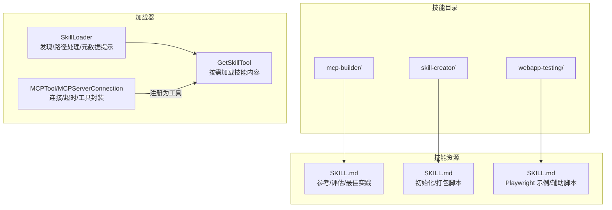
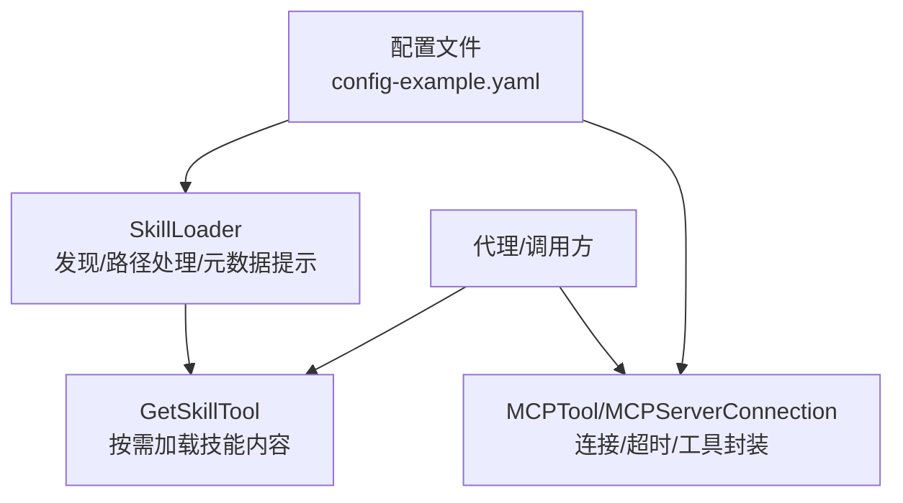
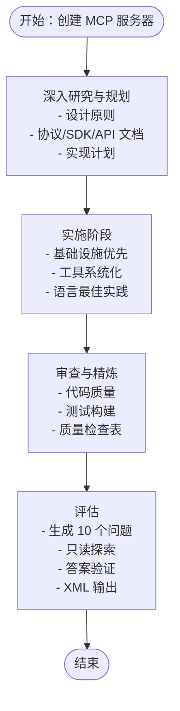
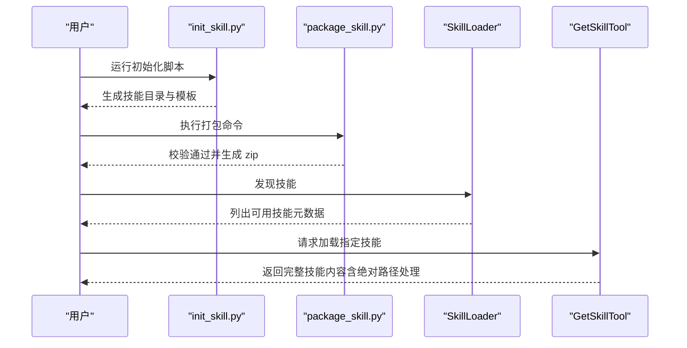
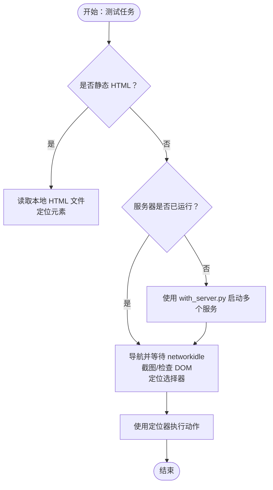
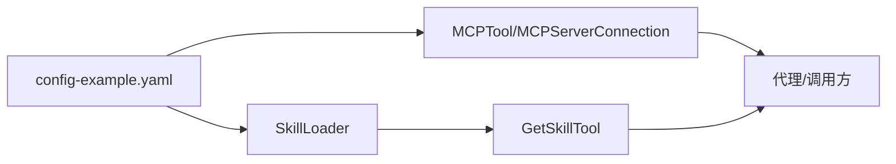

# 开发工具技能

<cite>
**本文引用的文件**
- [mcp-builder/SKILL.md](file://mini_agent/skills/mcp-builder/SKILL.md)
- [mcp-builder/reference/python_mcp_server.md](file://mini_agent/skills/mcp-builder/reference/python_mcp_server.md)
- [mcp-builder/reference/node_mcp_server.md](file://mini_agent/skills/mcp-builder/reference/node_mcp_server.md)
- [skill-creator/SKILL.md](file://mini_agent/skills/skill-creator/SKILL.md)
- [skill-creator/scripts/init_skill.py](file://mini_agent/skills/skill-creator/scripts/init_skill.py)
- [skill-creator/scripts/package_skill.py](file://mini_agent/skills/skill-creator/scripts/package_skill.py)
- [webapp-testing/SKILL.md](file://mini_agent/skills/webapp-testing/SKILL.md)
- [webapp-testing/scripts/with_server.py](file://mini_agent/skills/webapp-testing/scripts/with_server.py)
- [webapp-testing/examples/element_discovery.py](file://mini_agent/skills/webapp-testing/examples/element_discovery.py)
- [webapp-testing/examples/static_html_automation.py](file://mini_agent/skills/webapp-testing/examples/static_html_automation.py)
- [tools/skill_loader.py](file://mini_agent/tools/skill_loader.py)
- [tools/skill_tool.py](file://mini_agent/tools/skill_tool.py)
- [tools/mcp_loader.py](file://mini_agent/tools/mcp_loader.py)
- [config/config-example.yaml](file://mini_agent/config/config-example.yaml)
</cite>

## 目录
1. [简介](#简介)
2. [项目结构](#项目结构)
3. [核心组件](#核心组件)
4. [架构总览](#架构总览)
5. [详细组件分析](#详细组件分析)
6. [依赖分析](#依赖分析)
7. [性能考虑](#性能考虑)
8. [故障排查指南](#故障排查指南)
9. [结论](#结论)
10. [附录](#附录)

## 简介
本文件系统化梳理“开发工具技能”，围绕三大核心能力展开：MCP 构建器（MCP Builder）、技能创建器（Skill Creator）、Web 应用测试（Webapp Testing）。文档从架构与数据流入手，逐项解析各工具的配置要求、使用流程、生命周期与最佳实践，并给出在软件开发生命周期中的应用场景与集成建议，帮助提升开发效率、简化复杂任务并促进团队协作。

## 项目结构
开发工具技能以“技能包”形式组织，每个技能包含规范化的元数据与可选资源目录（scripts、references、assets），并通过加载器按需注入到代理中，实现渐进式披露与高效上下文管理。

图示来源
- [mcp-builder/SKILL.md:1-329](file://mini_agent/skills/mcp-builder/SKILL.md#L1-L329)
- [skill-creator/SKILL.md:1-210](file://mini_agent/skills/skill-creator/SKILL.md#L1-L210)
- [webapp-testing/SKILL.md:1-96](file://mini_agent/skills/webapp-testing/SKILL.md#L1-L96)
- [tools/skill_loader.py:1-257](file://mini_agent/tools/skill_loader.py#L1-L257)
- [tools/skill_tool.py:1-85](file://mini_agent/tools/skill_tool.py#L1-L85)
- [tools/mcp_loader.py:1-434](file://mini_agent/tools/mcp_loader.py#L1-L434)

章节来源
- [mcp-builder/SKILL.md:1-329](file://mini_agent/skills/mcp-builder/SKILL.md#L1-L329)
- [skill-creator/SKILL.md:1-210](file://mini_agent/skills/skill-creator/SKILL.md#L1-L210)
- [webapp-testing/SKILL.md:1-96](file://mini_agent/skills/webapp-testing/SKILL.md#L1-L96)
- [tools/skill_loader.py:1-257](file://mini_agent/tools/skill_loader.py#L1-L257)
- [tools/skill_tool.py:1-85](file://mini_agent/tools/skill_tool.py#L1-L85)
- [tools/mcp_loader.py:1-434](file://mini_agent/tools/mcp_loader.py#L1-L434)

## 核心组件
- MCP 构建器（MCP Builder）
  - 提供 MCP 服务器设计原则、协议参考、语言实现指南与评估流程，支撑将外部服务/API 转换为高质量工具集。
- 技能创建器（Skill Creator）
  - 提供技能模板初始化、资源组织、打包分发与迭代优化的完整工作流，确保技能模块化、可复用、可交付。
- Web 应用测试（Webapp Testing）
  - 提供 Playwright 自动化测试与本地服务器编排能力，覆盖静态页面与动态应用的端到端验证场景。

章节来源
- [mcp-builder/SKILL.md:1-329](file://mini_agent/skills/mcp-builder/SKILL.md#L1-L329)
- [skill-creator/SKILL.md:1-210](file://mini_agent/skills/skill-creator/SKILL.md#L1-L210)
- [webapp-testing/SKILL.md:1-96](file://mini_agent/skills/webapp-testing/SKILL.md#L1-L96)

## 架构总览
下图展示“技能加载器 + 工具注册 + 配置驱动”的整体架构，体现从配置到工具可用性的关键路径。

图示来源
- [config/config-example.yaml:1-61](file://mini_agent/config/config-example.yaml#L1-L61)
- [tools/skill_loader.py:1-257](file://mini_agent/tools/skill_loader.py#L1-L257)
- [tools/skill_tool.py:1-85](file://mini_agent/tools/skill_tool.py#L1-L85)
- [tools/mcp_loader.py:1-434](file://mini_agent/tools/mcp_loader.py#L1-L434)

## 详细组件分析

### MCP 构建器（MCP Builder）
- 设计原则
  - 以工作流为中心而非 API 封装；优化有限上下文；错误信息可指导下一步；遵循自然任务拆分；采用评估驱动开发。
- 协议与框架
  - MCP 协议规范与最佳实践；Python/Node 指南与 SDK 文档；API 文档研究清单。
- 实施阶段
  - 深入研究与规划（设计原则、协议/SDK/API 文档、实现计划）→ 实现（基础设施优先、工具系统化、语言最佳实践）→ 审查与精炼（代码质量、测试构建、质量检查表）→ 评估（问题生成、只读探索、答案验证、XML 输出）。
- 语言实现要点
  - Python：FastMCP、装饰器注册、Pydantic 输入校验、异步 I/O、响应格式（Markdown/JSON）、字符限制与截断策略、错误处理与工具注解。
  - Node/TypeScript：McpServer、registerTool、Zod 校验、严格类型、异步模式、资源与传输选择。
- 评估与质量
  - 使用评估指南创建 10 个独立、只读、复杂且可验证的问题；输出符合规范的 XML 结构。

图示来源
- [mcp-builder/SKILL.md:15-285](file://mini_agent/skills/mcp-builder/SKILL.md#L15-L285)
- [mcp-builder/reference/python_mcp_server.md:1-752](file://mini_agent/skills/mcp-builder/reference/python_mcp_server.md#L1-L752)
- [mcp-builder/reference/node_mcp_server.md:1-800](file://mini_agent/skills/mcp-builder/reference/node_mcp_server.md#L1-L800)

章节来源
- [mcp-builder/SKILL.md:1-329](file://mini_agent/skills/mcp-builder/SKILL.md#L1-L329)
- [mcp-builder/reference/python_mcp_server.md:1-752](file://mini_agent/skills/mcp-builder/reference/python_mcp_server.md#L1-L752)
- [mcp-builder/reference/node_mcp_server.md:1-800](file://mini_agent/skills/mcp-builder/reference/node_mcp_server.md#L1-L800)

### 技能创建器（Skill Creator）
- 技能本质
  - 模块化、自包含的扩展包，提供特定领域的专业知识、工作流与工具集成，作为“领域入门指南”。
- 技能组成
  - 必需：SKILL.md（含 YAML 头部元数据与正文说明）
  - 可选：scripts（可执行代码）、references（按需加载的参考文档）、assets（输出使用的资源文件）
- 渐进式披露
  - 元数据（名称+描述）始终在上下文中；SKILL.md 正文按触发加载；资源按需加载，避免上下文拥挤。
- 创建流程
  - 明确使用场景与示例 → 规划可复用内容（scripts/references/assets）→ 初始化技能（模板生成）→ 编辑 SKILL.md 与资源 → 打包分发（自动校验）→ 迭代优化。

图示来源
- [skill-creator/SKILL.md:1-210](file://mini_agent/skills/skill-creator/SKILL.md#L1-L210)
- [skill-creator/scripts/init_skill.py:1-304](file://mini_agent/skills/skill-creator/scripts/init_skill.py#L1-L304)
- [skill-creator/scripts/package_skill.py:1-111](file://mini_agent/skills/skill-creator/scripts/package_skill.py#L1-L111)
- [tools/skill_loader.py:1-257](file://mini_agent/tools/skill_loader.py#L1-L257)
- [tools/skill_tool.py:1-85](file://mini_agent/tools/skill_tool.py#L1-L85)

章节来源
- [skill-creator/SKILL.md:1-210](file://mini_agent/skills/skill-creator/SKILL.md#L1-L210)
- [skill-creator/scripts/init_skill.py:1-304](file://mini_agent/skills/skill-creator/scripts/init_skill.py#L1-L304)
- [skill-creator/scripts/package_skill.py:1-111](file://mini_agent/skills/skill-creator/scripts/package_skill.py#L1-L111)
- [tools/skill_loader.py:1-257](file://mini_agent/tools/skill_loader.py#L1-L257)
- [tools/skill_tool.py:1-85](file://mini_agent/tools/skill_tool.py#L1-L85)

### Web 应用测试（Webapp Testing）
- 能力概述
  - 使用 Playwright 与本地服务器编排脚本进行前端功能验证、UI 行为调试、截图与日志采集。
- 决策树
  - 是否为静态 HTML？是则直接读取文件并定位元素；否则判断服务器是否已启动，若未启动则通过 with_server.py 启动多服务后执行自动化。
- 使用示例
  - 元素发现：定位按钮、链接、输入框并截图辅助分析。
  - 静态页面自动化：打开本地 HTML 文件，填写表单并提交，截图对比前后状态。
- 最佳实践
  - 总是等待网络空闲后再检查 DOM；使用同步 Playwright；显式关闭浏览器；使用描述性选择器与适当等待。

图示来源
- [webapp-testing/SKILL.md:1-96](file://mini_agent/skills/webapp-testing/SKILL.md#L1-L96)
- [webapp-testing/scripts/with_server.py:1-106](file://mini_agent/skills/webapp-testing/scripts/with_server.py#L1-L106)
- [webapp-testing/examples/element_discovery.py:1-40](file://mini_agent/skills/webapp-testing/examples/element_discovery.py#L1-L40)
- [webapp-testing/examples/static_html_automation.py:1-33](file://mini_agent/skills/webapp-testing/examples/static_html_automation.py#L1-L33)

章节来源
- [webapp-testing/SKILL.md:1-96](file://mini_agent/skills/webapp-testing/SKILL.md#L1-L96)
- [webapp-testing/scripts/with_server.py:1-106](file://mini_agent/skills/webapp-testing/scripts/with_server.py#L1-L106)
- [webapp-testing/examples/element_discovery.py:1-40](file://mini_agent/skills/webapp-testing/examples/element_discovery.py#L1-L40)
- [webapp-testing/examples/static_html_automation.py:1-33](file://mini_agent/skills/webapp-testing/examples/static_html_automation.py#L1-L33)

## 依赖分析
- 配置驱动
  - 通过配置文件启用/禁用工具、设置工作目录、系统提示路径、MCP 连接参数与超时策略。
- 加载器耦合
  - SkillLoader 与 GetSkillTool 解耦于具体技能内容，仅负责发现、路径处理与按需加载。
  - MCPTool/MCPServerConnection 对外暴露统一工具接口，内部处理连接、超时与工具封装。
- 外部依赖
  - MCP 构建器依赖 MCP 协议与 SDK（Python/Node），Web 应用测试依赖 Playwright 与本地服务器脚本。

图示来源
- [config/config-example.yaml:1-61](file://mini_agent/config/config-example.yaml#L1-L61)
- [tools/skill_loader.py:1-257](file://mini_agent/tools/skill_loader.py#L1-L257)
- [tools/skill_tool.py:1-85](file://mini_agent/tools/skill_tool.py#L1-L85)
- [tools/mcp_loader.py:1-434](file://mini_agent/tools/mcp_loader.py#L1-L434)

章节来源
- [config/config-example.yaml:1-61](file://mini_agent/config/config-example.yaml#L1-L61)
- [tools/skill_loader.py:1-257](file://mini_agent/tools/skill_loader.py#L1-L257)
- [tools/skill_tool.py:1-85](file://mini_agent/tools/skill_tool.py#L1-L85)
- [tools/mcp_loader.py:1-434](file://mini_agent/tools/mcp_loader.py#L1-L434)

## 性能考虑
- 上下文与延迟
  - 技能采用渐进式披露，仅在需要时加载 SKILL.md 与资源，减少上下文占用与加载时间。
- 超时与稳定性
  - MCP 工具与连接均配置可调超时，避免长时间挂起；Web 应用测试强调等待网络空闲再检查 DOM，降低误判与重试成本。
- 并发与资源
  - 多服务器编排脚本支持并行启动与清理，缩短准备时间；Playwright 使用同步 API 时注意浏览器实例管理与资源释放。

## 故障排查指南
- 技能加载失败
  - 检查 SKILL.md 是否存在 YAML 头部、必要字段是否齐全；确认资源路径是否正确（加载器会将相对路径转换为绝对路径）。
- MCP 连接超时
  - 调整连接/执行超时配置；确认服务器命令或 URL 正确；查看连接类型（stdio/sse/http/streamable_http）与端口可达性。
- Web 应用测试不稳定
  - 确保在 networkidle 后再检查 DOM；避免在页面尚未渲染完成时进行元素交互；必要时增加等待或截图辅助定位问题。

章节来源
- [tools/skill_loader.py:60-193](file://mini_agent/tools/skill_loader.py#L60-L193)
- [tools/mcp_loader.py:171-232](file://mini_agent/tools/mcp_loader.py#L171-L232)
- [webapp-testing/SKILL.md:78-82](file://mini_agent/skills/webapp-testing/SKILL.md#L78-L82)

## 结论
开发工具技能通过“MCP 构建器 + 技能创建器 + Web 应用测试”的组合，覆盖了从外部服务集成、技能工程化到前端自动化验证的关键环节。借助渐进式披露、标准化配置与完善的评估/打包流程，这些工具能够显著提升开发效率、降低复杂度并增强团队协作能力。

## 附录

### 使用示例与集成指南

- MCP 构建器
  - 在“深入研究与规划”阶段，先加载 MCP 协议与 SDK 文档，再结合目标 API 的官方参考与认证信息制定实现计划。
  - 在“实施”阶段优先实现共享工具与基础设施，随后系统化地添加工具并遵循语言最佳实践。
  - 在“评估”阶段，基于真实业务场景生成 10 个独立、只读、复杂且可验证的问题，输出 XML 以便自动化评估。

- 技能创建器
  - 使用初始化脚本快速生成技能模板，明确技能用途与触发条件，规划 scripts/references/assets 的内容与边界。
  - 通过打包脚本进行自动校验与分发，确保技能结构与元数据符合规范。

- Web 应用测试
  - 使用决策树选择合适的自动化路径：静态 HTML 直接读取，动态应用通过 with_server.py 启动多服务后执行。
  - 在元素发现与静态页面自动化示例基础上，补充等待网络空闲、截图与日志采集等最佳实践。

章节来源
- [mcp-builder/SKILL.md:56-90](file://mini_agent/skills/mcp-builder/SKILL.md#L56-L90)
- [mcp-builder/reference/python_mcp_server.md:20-44](file://mini_agent/skills/mcp-builder/reference/python_mcp_server.md#L20-L44)
- [mcp-builder/reference/node_mcp_server.md:36-44](file://mini_agent/skills/mcp-builder/reference/node_mcp_server.md#L36-L44)
- [skill-creator/scripts/init_skill.py:1-304](file://mini_agent/skills/skill-creator/scripts/init_skill.py#L1-L304)
- [skill-creator/scripts/package_skill.py:1-111](file://mini_agent/skills/skill-creator/scripts/package_skill.py#L1-L111)
- [webapp-testing/SKILL.md:16-33](file://mini_agent/skills/webapp-testing/SKILL.md#L16-L33)
- [webapp-testing/examples/element_discovery.py:1-40](file://mini_agent/skills/webapp-testing/examples/element_discovery.py#L1-L40)
- [webapp-testing/examples/static_html_automation.py:1-33](file://mini_agent/skills/webapp-testing/examples/static_html_automation.py#L1-L33)