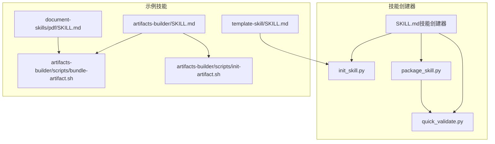
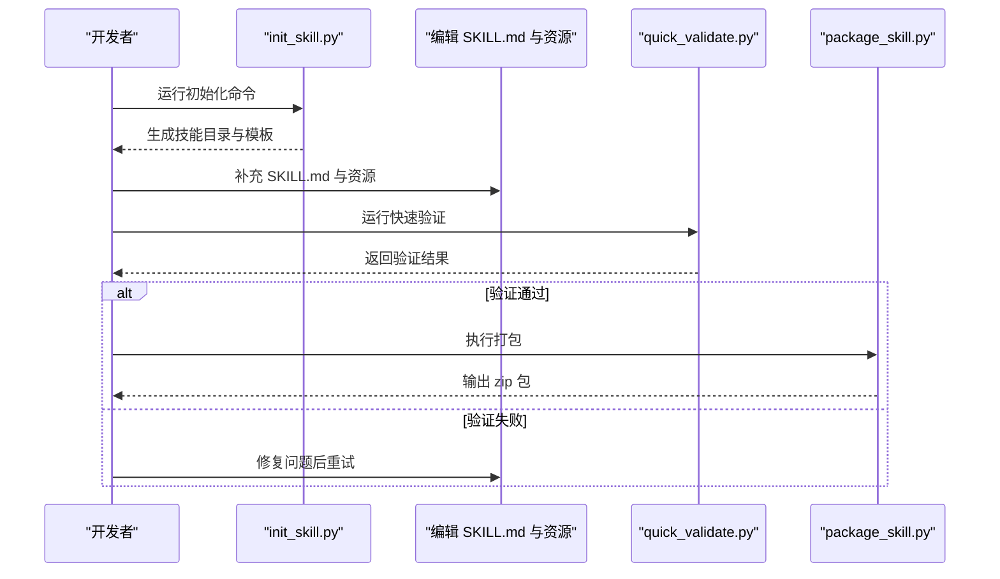
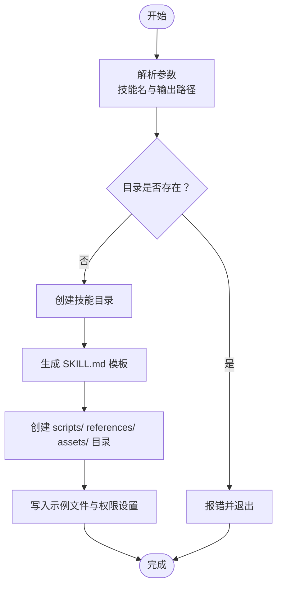
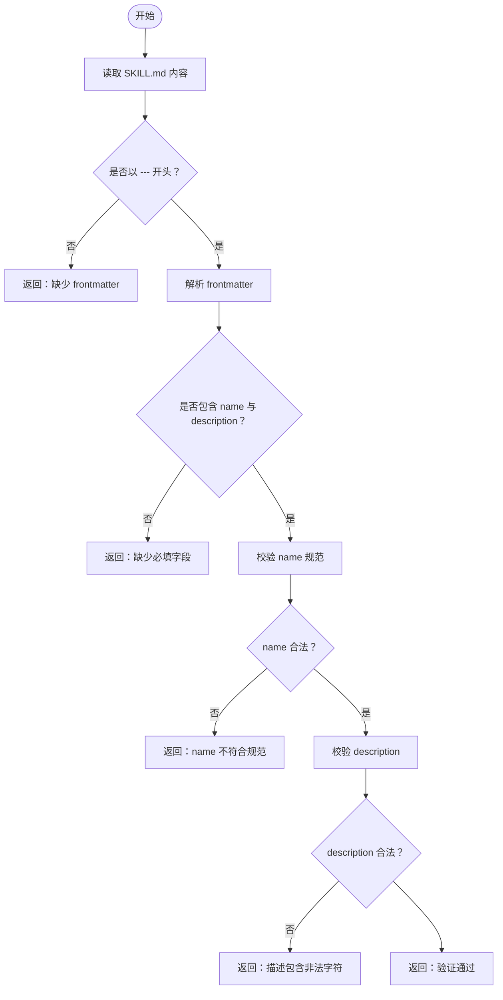
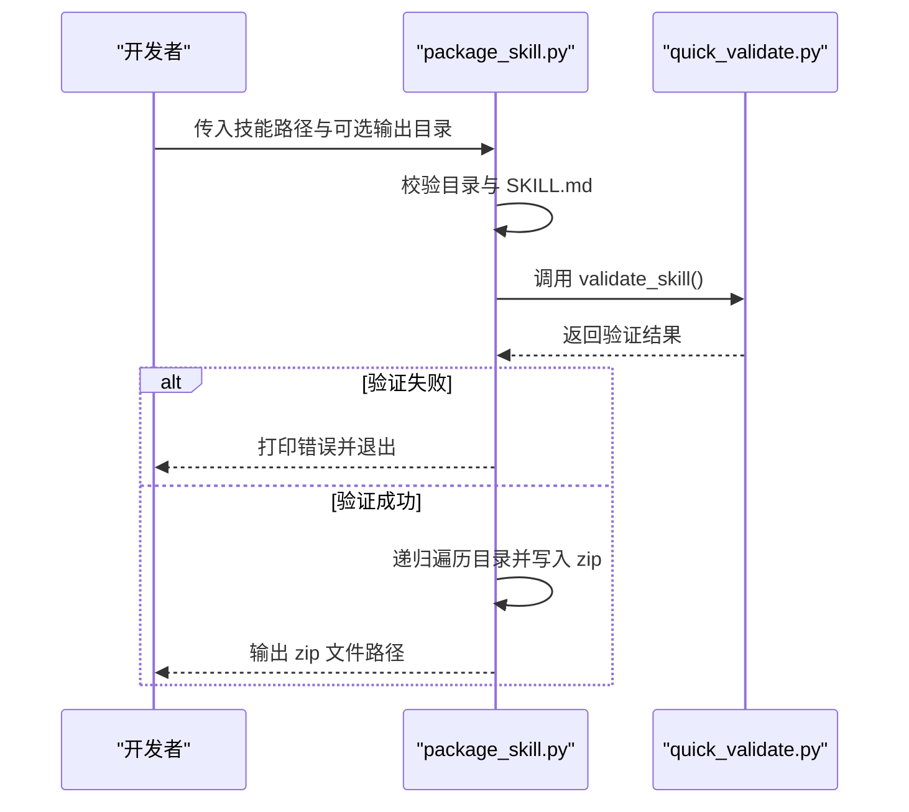
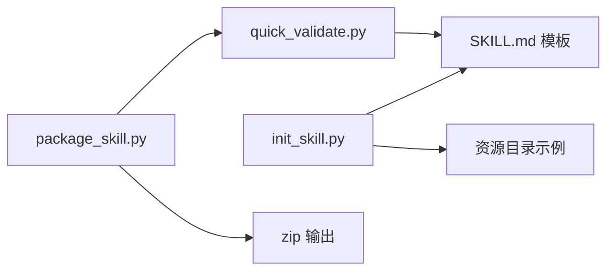

# 技能创建器技能

<cite>
**本文引用的文件**
- [SKILL.md（技能创建器）](file://mini_agent/skills/skill-creator/SKILL.md)
- [init_skill.py](file://mini_agent/skills/skill-creator/scripts/init_skill.py)
- [package_skill.py](file://mini_agent/skills/skill-creator/scripts/package_skill.py)
- [quick_validate.py](file://mini_agent/skills/skill-creator/scripts/quick_validate.py)
- [SKILL.md（artifacts-builder）](file://mini_agent/skills/artifacts-builder/SKILL.md)
- [bundle-artifact.sh](file://mini_agent/skills/artifacts-builder/scripts/bundle-artifact.sh)
- [init-artifact.sh](file://mini_agent/skills/artifacts-builder/scripts/init-artifact.sh)
- [SKILL.md（PDF 技能）](file://mini_agent/skills/document-skills/pdf/SKILL.md)
- [SKILL.md（模板技能）](file://mini_agent/skills/template-skill/SKILL.md)
- [README.md](file://README.md)
</cite>

## 目录
1. [简介](#简介)
2. [项目结构](#项目结构)
3. [核心组件](#核心组件)
4. [架构总览](#架构总览)
5. [详细组件分析](#详细组件分析)
6. [依赖分析](#依赖分析)
7. [性能考虑](#性能考虑)
8. [故障排查指南](#故障排查指南)
9. [结论](#结论)
10. [附录](#附录)

## 简介
本文件系统性介绍“技能创建器技能”的使用与实现，帮助开发者快速生成与打包 Claude Skills，并提供最佳实践、验证流程与发布分发建议。技能创建器技能本身是一个“元技能”，用于指导如何创建其他技能；其配套脚本包含初始化模板、快速验证与打包导出能力，覆盖从零到可分发的完整工作流。

## 项目结构
技能创建器位于技能目录下的 skill-creator 子模块中，包含：
- 元技能文档：SKILL.md（技能创建器），定义技能的结构、流程与最佳实践
- 脚本工具：
  - 初始化：init_skill.py
  - 快速验证：quick_validate.py
  - 打包导出：package_skill.py
- 示例技能参考：
  - artifacts-builder：展示如何组织 scripts/、references/、assets/ 及打包流程
  - PDF 技能：展示丰富的技术型技能内容组织方式
  - 模板技能：最小化示例，便于复制与定制

图表来源
- [SKILL.md（技能创建器）:1-210](file://mini_agent/skills/skill-creator/SKILL.md#L1-L210)
- [init_skill.py:1-304](file://mini_agent/skills/skill-creator/scripts/init_skill.py#L1-L304)
- [quick_validate.py:1-65](file://mini_agent/skills/skill-creator/scripts/quick_validate.py#L1-L65)
- [package_skill.py:1-111](file://mini_agent/skills/skill-creator/scripts/package_skill.py#L1-L111)
- [SKILL.md（artifacts-builder）:1-74](file://mini_agent/skills/artifacts-builder/SKILL.md#L1-L74)
- [bundle-artifact.sh:1-54](file://mini_agent/skills/artifacts-builder/scripts/bundle-artifact.sh#L1-L54)
- [init-artifact.sh:1-323](file://mini_agent/skills/artifacts-builder/scripts/init-artifact.sh#L1-L323)
- [SKILL.md（PDF 技能）:1-295](file://mini_agent/skills/document-skills/pdf/SKILL.md#L1-L295)
- [SKILL.md（模板技能）:1-7](file://mini_agent/skills/template-skill/SKILL.md#L1-L7)

章节来源
- [SKILL.md（技能创建器）:1-210](file://mini_agent/skills/skill-creator/SKILL.md#L1-L210)
- [README.md:1-345](file://README.md#L1-L345)

## 核心组件
- 元技能文档（SKILL.md）
  - 定义技能的组成、结构原则与创建流程，明确 frontmatter 元数据要求与资源目录组织方式
- 初始化脚本（init_skill.py）
  - 生成技能目录、模板 SKILL.md 与示例资源（scripts/、references/、assets/）
- 快速验证脚本（quick_validate.py）
  - 基础校验：frontmatter 格式、必填字段、命名规范、描述合法性
- 打包脚本（package_skill.py）
  - 在通过验证后，将技能目录打包为 zip 文件，便于分发与安装

章节来源
- [SKILL.md（技能创建器）:1-210](file://mini_agent/skills/skill-creator/SKILL.md#L1-L210)
- [init_skill.py:1-304](file://mini_agent/skills/skill-creator/scripts/init_skill.py#L1-L304)
- [quick_validate.py:1-65](file://mini_agent/skills/skill-creator/scripts/quick_validate.py#L1-L65)
- [package_skill.py:1-111](file://mini_agent/skills/skill-creator/scripts/package_skill.py#L1-L111)

## 架构总览
技能创建器的执行路径围绕“初始化 → 编辑 → 验证 → 打包”展开，验证在打包前自动执行，确保输出质量。

图表来源
- [init_skill.py:194-271](file://mini_agent/skills/skill-creator/scripts/init_skill.py#L194-L271)
- [quick_validate.py:11-57](file://mini_agent/skills/skill-creator/scripts/quick_validate.py#L11-L57)
- [package_skill.py:19-83](file://mini_agent/skills/skill-creator/scripts/package_skill.py#L19-L83)

## 详细组件分析

### 组件一：初始化脚本 init_skill.py
- 功能要点
  - 创建技能目录与 SKILL.md 模板（含 TODO 占位符与结构建议）
  - 自动创建 scripts/、references/、assets/ 三类资源目录，并写入示例文件
  - 提供清晰的下一步指引（编辑、自定义、运行验证）
- 关键行为
  - 目录存在性检查与异常处理
  - frontmatter 中 name 字段的命名规范校验（小写、连字符、长度限制）
  - 权限设置（示例脚本可执行）

图表来源
- [init_skill.py:194-271](file://mini_agent/skills/skill-creator/scripts/init_skill.py#L194-L271)

章节来源
- [init_skill.py:1-304](file://mini_agent/skills/skill-creator/scripts/init_skill.py#L1-L304)

### 组件二：快速验证脚本 quick_validate.py
- 功能要点
  - 校验 SKILL.md 是否存在
  - 校验 YAML frontmatter 格式与必填字段（name、description）
  - 校验 name 的命名规范（仅允许小写字母、数字、连字符，且不以连字符开头或结尾、不含连续连字符）
  - 校验 description 不得包含尖括号
- 错误处理
  - 逐项返回错误信息，便于定位修复

图表来源
- [quick_validate.py:11-57](file://mini_agent/skills/skill-creator/scripts/quick_validate.py#L11-L57)

章节来源
- [quick_validate.py:1-65](file://mini_agent/skills/skill-creator/scripts/quick_validate.py#L1-L65)

### 组件三：打包脚本 package_skill.py
- 功能要点
  - 校验技能目录与 SKILL.md 存在性
  - 调用验证逻辑（复用 quick_validate）
  - 将技能目录递归打包为 zip 文件，保持相对路径
- 输出
  - 成功时输出 zip 文件路径，失败时打印错误并退出

图表来源
- [package_skill.py:19-83](file://mini_agent/skills/skill-creator/scripts/package_skill.py#L19-L83)
- [quick_validate.py:11-57](file://mini_agent/skills/skill-creator/scripts/quick_validate.py#L11-L57)

章节来源
- [package_skill.py:1-111](file://mini_agent/skills/skill-creator/scripts/package_skill.py#L1-L111)

### 组件四：元技能文档 SKILL.md（技能创建器）
- 内容要点
  - 技能的定义与价值：模块化扩展 Claude 能力
  - 技能组成：SKILL.md（必填）、可选资源（scripts/、references/、assets/）
  - 渐进披露设计原则：metadata → SKILL.md → 资源按需加载
  - 创建流程：理解 → 规划 → 初始化 → 编辑 → 打包 → 迭代
- 使用建议
  - frontmatter 的 name 与 description 是触发条件的关键
  - 资源目录按需保留，避免冗余

章节来源
- [SKILL.md（技能创建器）:1-210](file://mini_agent/skills/skill-creator/SKILL.md#L1-L210)

### 组件五：示例技能参考
- artifacts-builder
  - 展示了前端构建与打包的完整流程，包含初始化脚本与打包脚本，适合学习如何组织 scripts/ 与 assets/
- PDF 技能
  - 展示了技术型技能的组织方式：概述、任务分类、代码示例、命令行工具、常见任务与参考链接
- 模板技能
  - 最小化示例，便于复制为新技能的基础模板

章节来源
- [SKILL.md（artifacts-builder）:1-74](file://mini_agent/skills/artifacts-builder/SKILL.md#L1-L74)
- [bundle-artifact.sh:1-54](file://mini_agent/skills/artifacts-builder/scripts/bundle-artifact.sh#L1-L54)
- [init-artifact.sh:1-323](file://mini_agent/skills/artifacts-builder/scripts/init-artifact.sh#L1-L323)
- [SKILL.md（PDF 技能）:1-295](file://mini_agent/skills/document-skills/pdf/SKILL.md#L1-L295)
- [SKILL.md（模板技能）:1-7](file://mini_agent/skills/template-skill/SKILL.md#L1-L7)

## 依赖分析
- 组件内聚与耦合
  - init_skill.py 与 quick_validate.py 低耦合，前者负责生成，后者负责校验
  - package_skill.py 依赖 quick_validate 的验证结果，形成“先校验再打包”的流水线
- 外部依赖
  - 打包使用标准库 zip 支持
  - 初始化脚本对文件系统操作与权限设置有直接依赖
- 循环依赖
  - 未发现循环依赖，脚本职责清晰

图表来源
- [init_skill.py:194-271](file://mini_agent/skills/skill-creator/scripts/init_skill.py#L194-L271)
- [quick_validate.py:11-57](file://mini_agent/skills/skill-creator/scripts/quick_validate.py#L11-L57)
- [package_skill.py:19-83](file://mini_agent/skills/skill-creator/scripts/package_skill.py#L19-L83)

章节来源
- [init_skill.py:1-304](file://mini_agent/skills/skill-creator/scripts/init_skill.py#L1-L304)
- [quick_validate.py:1-65](file://mini_agent/skills/skill-creator/scripts/quick_validate.py#L1-L65)
- [package_skill.py:1-111](file://mini_agent/skills/skill-creator/scripts/package_skill.py#L1-L111)

## 性能考虑
- 初始化阶段
  - 仅写入示例文件，开销极低
- 验证阶段
  - 正则匹配 frontmatter，时间复杂度近似 O(n)，n 为 SKILL.md 文本长度
- 打包阶段
  - 递归遍历目录并写入 zip，时间复杂度 O(N)，N 为技能文件总数
- 建议
  - 控制资源目录规模，避免不必要的大文件进入 zip
  - 对于大型资产，优先放在 assets/ 并在 SKILL.md 中说明使用方式，减少上下文占用

## 故障排查指南
- 初始化失败
  - 目标目录已存在：请更换路径或删除已有目录
  - 权限不足：检查父目录写权限
- 验证失败
  - 缺少 frontmatter 或格式不正确：确认 SKILL.md 顶部为 YAML frontmatter
  - name 不符合规范：仅允许小写字母、数字、连字符，且不以连字符开头或结尾、不含连续连字符
  - description 包含尖括号：移除尖括号
- 打包失败
  - 技能目录不存在或非目录：确认路径正确
  - 验证未通过：先修复验证问题再打包
  - zip 写入异常：检查磁盘空间与目标目录权限

章节来源
- [init_skill.py:208-261](file://mini_agent/skills/skill-creator/scripts/init_skill.py#L208-L261)
- [quick_validate.py:15-56](file://mini_agent/skills/skill-creator/scripts/quick_validate.py#L15-L56)
- [package_skill.py:32-82](file://mini_agent/skills/skill-creator/scripts/package_skill.py#L32-L82)

## 结论
技能创建器技能提供了从模板生成、内容编辑、自动化验证到打包分发的一体化工作流。通过遵循元技能文档中的结构与最佳实践，并结合 init_skill.py、quick_validate.py、package_skill.py 的工具链，开发者可以高效、稳定地创建与交付高质量的 Claude Skills。

## 附录

### A. 使用流程速查
- 初始化新技能
  - 运行初始化脚本，生成模板与示例资源
- 编辑 SKILL.md 与资源
  - 完成 frontmatter 与正文，按需保留 scripts/、references/、assets/
- 快速验证
  - 运行验证脚本，修复提示的问题
- 打包导出
  - 运行打包脚本，生成 zip 包用于分发

章节来源
- [SKILL.md（技能创建器）:132-210](file://mini_agent/skills/skill-creator/SKILL.md#L132-L210)
- [init_skill.py:273-304](file://mini_agent/skills/skill-creator/scripts/init_skill.py#L273-L304)
- [quick_validate.py:58-65](file://mini_agent/skills/skill-creator/scripts/quick_validate.py#L58-L65)
- [package_skill.py:85-111](file://mini_agent/skills/skill-creator/scripts/package_skill.py#L85-L111)

### B. 最佳实践清单
- 命名规范
  - 使用小写、连字符的 hyphen-case，避免连续连字符与首尾连字符
- frontmatter
  - 明确 name 与 description，描述中避免尖括号
- 内容组织
  - SKILL.md 保持精炼，细节放入 references/；assets/ 仅放最终产物所需资源
- 资源管理
  - scripts/ 适合可重复执行的脚本；assets/ 适合模板与素材；references/ 适合参考文档
- 测试与迭代
  - 先验证再打包；根据使用反馈持续优化 SKILL.md 与资源

章节来源
- [SKILL.md（技能创建器）:42-103](file://mini_agent/skills/skill-creator/SKILL.md#L42-L103)
- [quick_validate.py:42-56](file://mini_agent/skills/skill-creator/scripts/quick_validate.py#L42-L56)