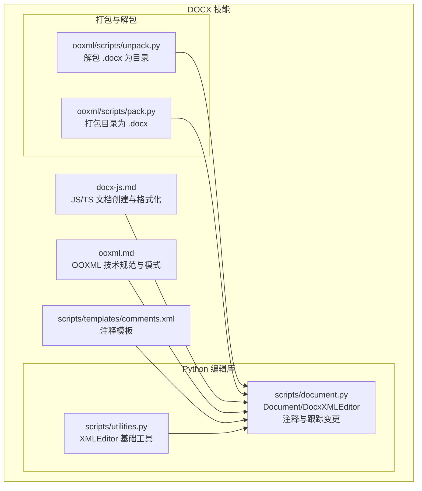
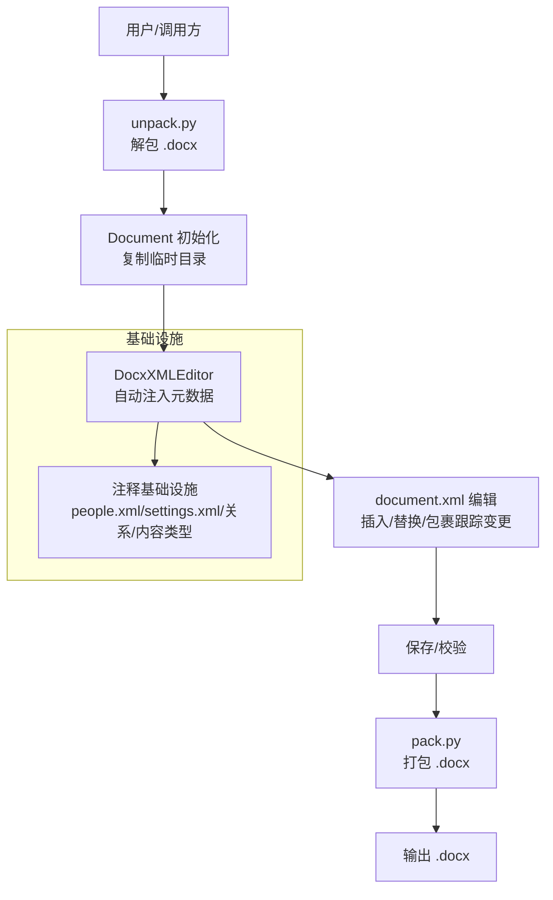
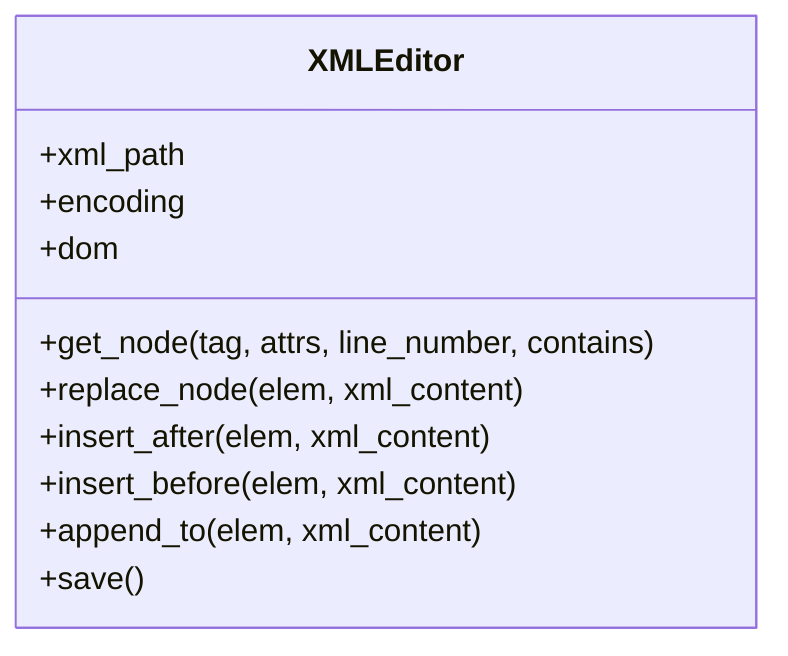
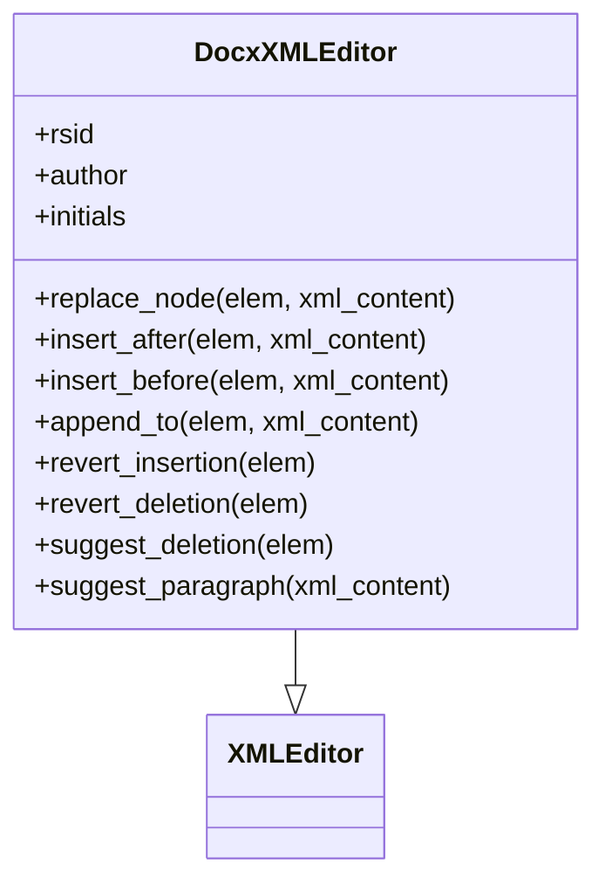
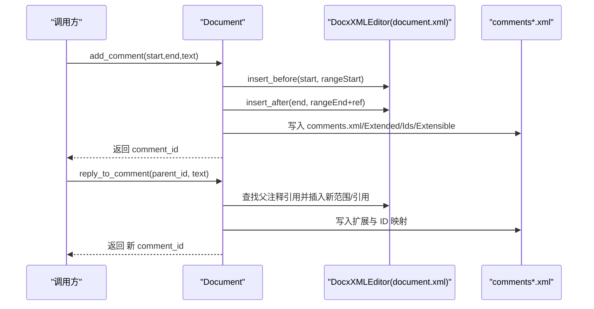
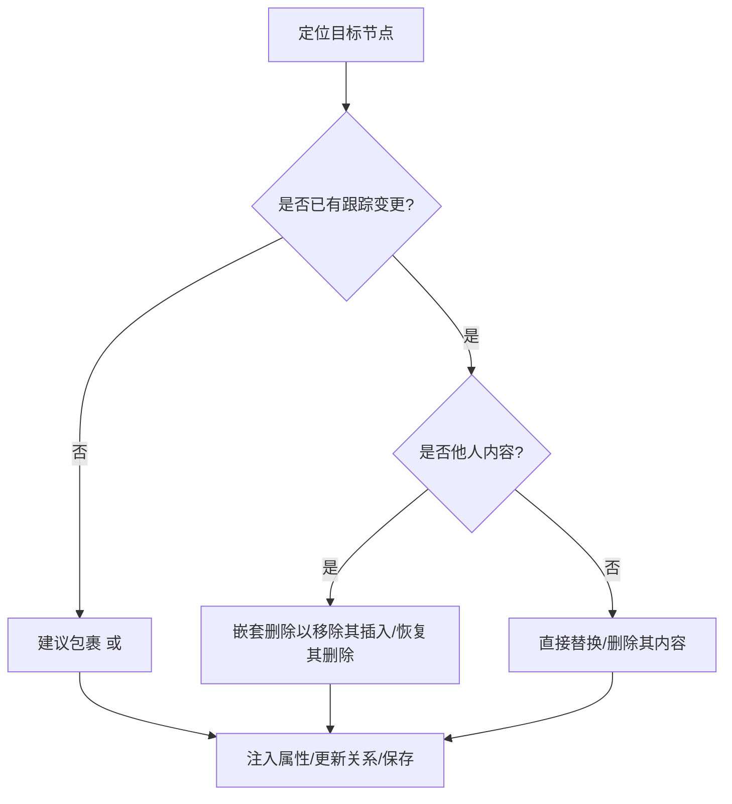
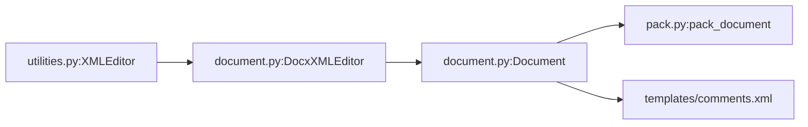
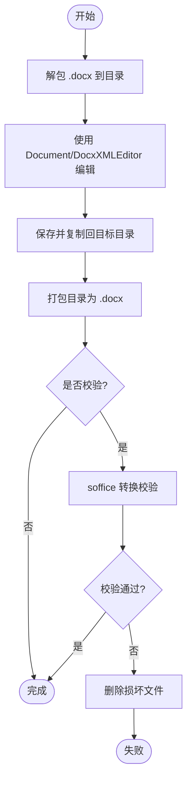

# DOCX 文档处理

<cite>
**本文引用的文件**
- [docx-js.md](file://mini_agent/skills/document-skills/docx/docx-js.md)
- [ooxml.md](file://mini_agent/skills/document-skills/docx/ooxml.md)
- [document.py](file://mini_agent/skills/document-skills/docx/scripts/document.py)
- [utilities.py](file://mini_agent/skills/document-skills/docx/scripts/utilities.py)
- [unpack.py](file://mini_agent/skills/document-skills/docx/ooxml/scripts/unpack.py)
- [pack.py](file://mini_agent/skills/document-skills/docx/ooxml/scripts/pack.py)
- [comments.xml](file://mini_agent/skills/document-skills/docx/scripts/templates/comments.xml)
</cite>

## 目录
1. [简介](#简介)
2. [项目结构](#项目结构)
3. [核心组件](#核心组件)
4. [架构总览](#架构总览)
5. [详细组件分析](#详细组件分析)
6. [依赖关系分析](#依赖关系分析)
7. [性能与可靠性考量](#性能与可靠性考量)
8. [故障排查指南](#故障排查指南)
9. [结论](#结论)
10. [附录：关键流程图与时序图](#附录关键流程图与时序图)

## 简介
本文件面向需要在系统中实现 DOCX 文档自动化处理的工程师与产品同学，系统性讲解 DOCX 文件结构、解包与打包、基于 docx-js 的文档创建、基于 Document 库的 OOXML 编辑、文本提取与跟踪变更（红字审阅）工作流，并给出可直接落地的实现路径与最佳实践。读者无需深入 XML 即可完成复杂编辑任务，同时也能在必要时通过底层 XML 模式进行精细控制。

## 项目结构
本技能位于文档处理子技能下的 docx 子目录，包含三类关键资产：
- 使用指南与参考：docx-js.md（JS/TS 创建与格式化）、ooxml.md（OOXML 技术规范与模式）
- Python 编辑库：scripts/document.py（Document 类与 DocxXMLEditor 扩展）、scripts/utilities.py（XMLEditor 基础工具）
- 打包与解包脚本：ooxml/scripts/unpack.py、ooxml/scripts/pack.py
- 模板与基础设施：scripts/templates/comments.xml 及相关注释模板

**图表来源**
- [document.py:1-120](file://mini_agent/skills/document-skills/docx/scripts/document.py#L1-L120)
- [utilities.py:1-60](file://mini_agent/skills/document-skills/docx/scripts/utilities.py#L1-L60)
- [unpack.py:1-30](file://mini_agent/skills/document-skills/docx/ooxml/scripts/unpack.py#L1-L30)
- [pack.py:1-60](file://mini_agent/skills/document-skills/docx/ooxml/scripts/pack.py#L1-L60)
- [comments.xml:1-3](file://mini_agent/skills/document-skills/docx/scripts/templates/comments.xml#L1-L3)

**章节来源**
- [document.py:1-120](file://mini_agent/skills/document-skills/docx/scripts/document.py#L1-L120)
- [utilities.py:1-60](file://mini_agent/skills/document-skills/docx/scripts/utilities.py#L1-L60)
- [unpack.py:1-30](file://mini_agent/skills/document-skills/docx/ooxml/scripts/unpack.py#L1-L30)
- [pack.py:1-60](file://mini_agent/skills/document-skills/docx/ooxml/scripts/pack.py#L1-L60)
- [comments.xml:1-3](file://mini_agent/skills/document-skills/docx/scripts/templates/comments.xml#L1-L3)

## 核心组件
- XMLEditor：提供按标签、属性、行号范围、包含文本等多维过滤定位节点的能力；支持插入、替换、追加等 DOM 操作；自动保存并保持原文件编码。
- DocxXMLEditor：在 XMLEditor 基础上，自动注入 RSID、作者、时间戳、注释初始人等元数据，确保 OOXML 合规；提供撤销插入/删除、建议插入/删除等高级方法。
- Document：封装注释与跟踪变更基础设施（people.xml、settings.xml、RSID、关系与内容类型），提供统一的注释添加、回复、保存与校验接口。
- 解包/打包脚本：将 .docx 解压为目录（含 XML 美化），或将目录重新打包为 .docx（去除美化、压缩），并可选进行 soffice 校验。

**章节来源**
- [utilities.py:41-182](file://mini_agent/skills/document-skills/docx/scripts/utilities.py#L41-L182)
- [document.py:47-120](file://mini_agent/skills/document-skills/docx/scripts/document.py#L47-L120)
- [document.py:612-712](file://mini_agent/skills/document-skills/docx/scripts/document.py#L612-L712)
- [unpack.py:1-30](file://mini_agent/skills/document-skills/docx/ooxml/scripts/unpack.py#L1-L30)
- [pack.py:45-87](file://mini_agent/skills/document-skills/docx/ooxml/scripts/pack.py#L45-L87)

## 架构总览
下图展示了从“解包”到“编辑”再到“保存”的完整链路，以及注释与跟踪变更的关键基础设施：

**图表来源**
- [unpack.py:14-29](file://mini_agent/skills/document-skills/docx/ooxml/scripts/unpack.py#L14-L29)
- [document.py:612-712](file://mini_agent/skills/document-skills/docx/scripts/document.py#L612-L712)
- [document.py:859-884](file://mini_agent/skills/document-skills/docx/scripts/document.py#L859-L884)
- [pack.py:45-87](file://mini_agent/skills/document-skills/docx/ooxml/scripts/pack.py#L45-L87)

## 详细组件分析

### 组件一：XMLEditor（基础 XML 编辑器）
- 功能要点
  - 行号追踪解析：通过自定义 SAX 解析器记录每个元素的原始行列位置，便于与“读取工具”输出的行号对齐。
  - 多维检索：支持按标签、属性、行号范围、包含文本内容等条件组合查找唯一节点。
  - DOM 操作：提供 replace_node、insert_after、insert_before、append_to 等安全插入/替换方法。
  - 编码保持：根据文件头检测编码（ASCII/UTF-8），保存时保持一致。
- 典型用法
  - 定位段落或运行级节点，再进行替换或插入。
  - 在大型文档中通过行号范围缩小匹配范围，提升稳定性。

**图表来源**
- [utilities.py:41-375](file://mini_agent/skills/document-skills/docx/scripts/utilities.py#L41-L375)

**章节来源**
- [utilities.py:41-182](file://mini_agent/skills/document-skills/docx/scripts/utilities.py#L41-L182)
- [utilities.py:206-288](file://mini_agent/skills/document-skills/docx/scripts/utilities.py#L206-L288)
- [utilities.py:302-344](file://mini_agent/skills/document-skills/docx/scripts/utilities.py#L302-L344)

### 组件二：DocxXMLEditor（OOXML 自动化编辑器）
- 功能要点
  - 自动属性注入：为新插入的 <w:p>/<w:r>/<w:t>/<w:ins>/<w:del>/<w:comment> 等元素自动补全 RSID、作者、时间戳、初始人等。
  - 跟踪变更操作：提供 revert_insertion、revert_deletion、suggest_deletion 等方法，保证嵌套结构与属性合规。
  - 段落建议包装：将整段内容包裹在 <w:ins> 中，用于新增段落的跟踪。
- 关键规则
  - 插入/删除必须以段落或运行为单位，且 <w:ins>/<w:del> 必须包裹完整的 <w:r>。
  - 不要修改他人插入/删除中的文本内容，应采用嵌套删除的方式进行修正。

**图表来源**
- [document.py:47-120](file://mini_agent/skills/document-skills/docx/scripts/document.py#L47-L120)
- [document.py:240-262](file://mini_agent/skills/document-skills/docx/scripts/document.py#L240-L262)
- [document.py:264-431](file://mini_agent/skills/document-skills/docx/scripts/document.py#L264-L431)
- [document.py:482-594](file://mini_agent/skills/document-skills/docx/scripts/document.py#L482-L594)

**章节来源**
- [document.py:116-239](file://mini_agent/skills/document-skills/docx/scripts/document.py#L116-L239)
- [document.py:240-262](file://mini_agent/skills/document-skills/docx/scripts/document.py#L240-L262)
- [document.py:264-431](file://mini_agent/skills/document-skills/docx/scripts/document.py#L264-L431)
- [document.py:433-481](file://mini_agent/skills/document-skills/docx/scripts/document.py#L433-L481)
- [document.py:482-594](file://mini_agent/skills/document-skills/docx/scripts/document.py#L482-L594)

### 组件三：Document（注释与跟踪变更管理）
- 功能要点
  - 初始化即设置注释基础设施：people.xml、settings.xml、关系与内容类型。
  - 注释生命周期：在 document.xml 中插入起止标记与引用，在 comments*.xml 系列文件中写入注释实体与扩展信息。
  - 保存与校验：保存前自动确保注释关系与内容类型存在，可选择执行 schema 与 redlining 校验。
- 关键流程
  - 添加注释：先在 document.xml 写入范围标记与引用，再写入 comments*.xml。
  - 回复注释：在父注释引用后插入新的范围标记、结束标记与引用。
  - 保存：写回所有已编辑的 XML，复制回目标目录，必要时进行校验。

**图表来源**
- [document.py:713-763](file://mini_agent/skills/document-skills/docx/scripts/document.py#L713-L763)
- [document.py:765-831](file://mini_agent/skills/document-skills/docx/scripts/document.py#L765-L831)
- [document.py:1068-1156](file://mini_agent/skills/document-skills/docx/scripts/document.py#L1068-L1156)

**章节来源**
- [document.py:612-712](file://mini_agent/skills/document-skills/docx/scripts/document.py#L612-L712)
- [document.py:713-831](file://mini_agent/skills/document-skills/docx/scripts/document.py#L713-L831)
- [document.py:838-884](file://mini_agent/skills/document-skills/docx/scripts/document.py#L838-L884)
- [document.py:1068-1277](file://mini_agent/skills/document-skills/docx/scripts/document.py#L1068-L1277)

### 组件四：解包与打包（unpack.py / pack.py）
- 解包（unpack.py）
  - 将 .docx 解压至指定目录，并对所有 XML/rels 文件进行“美化”输出（便于阅读与调试）。
  - 针对 .docx 输出一个建议的 RSID，供后续编辑会话使用。
- 打包（pack.py）
  - 将目录内容重新打包为 .docx，先去除美化空白与注释，再以 ZIP 压缩。
  - 可选通过 soffice 进行转换校验，若失败则删除损坏产物。

**图表来源**
- [unpack.py:14-29](file://mini_agent/skills/document-skills/docx/ooxml/scripts/unpack.py#L14-L29)
- [pack.py:45-87](file://mini_agent/skills/document-skills/docx/ooxml/scripts/pack.py#L45-L87)
- [pack.py:89-131](file://mini_agent/skills/document-skills/docx/ooxml/scripts/pack.py#L89-L131)

**章节来源**
- [unpack.py:1-30](file://mini_agent/skills/document-skills/docx/ooxml/scripts/unpack.py#L1-L30)
- [pack.py:1-160](file://mini_agent/skills/document-skills/docx/ooxml/scripts/pack.py#L1-L160)

### 组件五：OOXML 结构与模式（来自 ooxml.md）
- 关键文件与职责
  - document.xml：正文内容（段落、运行、文本、表格、图片、链接等）。
  - comments.xml / commentsExtended.xml / commentsIds.xml / commentsExtensible.xml：注释与回复的完整生态。
  - word/_rels/document.xml.rels 与 [Content_Types].xml：关系与内容类型声明。
  - settings.xml：启用修订跟踪、注入 RSID 等。
- 红字审阅（跟踪变更）关键规则
  - 插入/删除必须以段落或运行为单位，且 <w:ins>/<w:del> 包裹完整 <w:r>。
  - 不要修改他人插入/删除中的文本内容，应采用嵌套删除的方式进行修正。
  - 属性合规：w:id、w:author、w:date、w:rsid*、w16du:dateUtc 等。

**图表来源**
- [ooxml.md:554-610](file://mini_agent/skills/document-skills/docx/ooxml.md#L554-L610)
- [document.py:264-431](file://mini_agent/skills/document-skills/docx/scripts/document.py#L264-L431)

**章节来源**
- [ooxml.md:9-21](file://mini_agent/skills/document-skills/docx/ooxml.md#L9-L21)
- [ooxml.md:160-175](file://mini_agent/skills/document-skills/docx/ooxml.md#L160-L175)
- [ooxml.md:266-289](file://mini_agent/skills/document-skills/docx/ooxml.md#L266-L289)
- [ooxml.md:554-610](file://mini_agent/skills/document-skills/docx/ooxml.md#L554-L610)

## 依赖关系分析
- 外部依赖
  - defusedxml：安全解析 XML，避免 XXE 等风险。
  - zipfile：用于解包/打包 ZIP 归档。
  - soffice（可选）：用于文档转换校验。
- 内部依赖
  - utilities.XMLEditor 为 DocxXMLEditor 的基类。
  - document.Document 依赖 utilities.XMLEditor 与 pack.py 的打包能力。
  - comments*.xml 模板由 templates/comments.xml 提供。

**图表来源**
- [utilities.py:41-60](file://mini_agent/skills/document-skills/docx/scripts/utilities.py#L41-L60)
- [document.py:47-74](file://mini_agent/skills/document-skills/docx/scripts/document.py#L47-L74)
- [document.py:37-41](file://mini_agent/skills/document-skills/docx/scripts/document.py#L37-L41)
- [pack.py:1-20](file://mini_agent/skills/document-skills/docx/ooxml/scripts/pack.py#L1-L20)
- [comments.xml:1-3](file://mini_agent/skills/document-skills/docx/scripts/templates/comments.xml#L1-L3)

**章节来源**
- [document.py:36-41](file://mini_agent/skills/document-skills/docx/scripts/document.py#L36-L41)
- [utilities.py:37-38](file://mini_agent/skills/document-skills/docx/scripts/utilities.py#L37-L38)
- [pack.py:9-16](file://mini_agent/skills/document-skills/docx/ooxml/scripts/pack.py#L9-L16)

## 性能与可靠性考量
- 解包/打包阶段
  - 解包时对大量 XML 进行美化，适合本地调试；生产环境建议直接使用原始格式，减少 I/O。
  - 打包前去除美化空白与注释，降低体积并提升兼容性。
- 编辑阶段
  - 通过行号范围缩小匹配范围，避免全量扫描；优先使用 get_node 的组合过滤。
  - 批量插入/替换时，利用返回的节点列表维护顺序，避免多次 DOM 重排。
- 校验阶段
  - 保存前默认执行 schema 与 redlining 校验，确保生成的 .docx 可被 Office 正确打开。
  - 若 soffice 不可用，打包阶段会跳过校验但给出警告，需人工确认。

[本节为通用指导，不直接分析具体文件]

## 故障排查指南
- “找不到节点”
  - 症状：get_node 抛出“未找到”或“匹配多个”。
  - 排查：增加更严格的过滤条件（行号范围、属性、包含文本），或切换到更稳定的定位方式（如按段落样式）。
- “无法打开 .docx”
  - 症状：Office 报错或提示损坏。
  - 排查：检查是否正确包裹 <w:ins>/<w:del>，是否遗漏 w:id/w:author/w:date 等属性；确认 settings.xml 中已注入 RSID 与 trackRevisions（如启用）。
- “注释/回复无效”
  - 症状：注释未显示或回复无关联。
  - 排查：确认 comments*.xml 是否存在对应关系与内容类型；检查 document.xml 中的起止标记与引用是否正确插入。
- “soffice 校验失败”
  - 症状：打包后 soffice 转换失败。
  - 排查：检查 XML 是否存在非法字符、命名空间缺失或结构错误；必要时关闭校验仅做打包（不推荐）。

**章节来源**
- [utilities.py:147-181](file://mini_agent/skills/document-skills/docx/scripts/utilities.py#L147-L181)
- [document.py:838-858](file://mini_agent/skills/document-skills/docx/scripts/document.py#L838-L858)
- [pack.py:89-131](file://mini_agent/skills/document-skills/docx/ooxml/scripts/pack.py#L89-L131)

## 结论
通过本技能提供的工具链，可以在不直接手写复杂 OOXML 的前提下，完成 DOCX 的创建、编辑、注释与跟踪变更工作流。建议遵循以下原则：
- 优先使用 Document/DocxXMLEditor 的高层 API，确保属性与结构合规。
- 在需要时使用 XMLEditor 精确定位节点，结合行号范围与文本过滤。
- 解包用于调试，打包用于交付；生产环境尽量避免不必要的美化与注释。
- 保存前务必执行校验，确保生成文件可被 Office 正常打开。

[本节为总结性内容，不直接分析具体文件]

## 附录：关键流程图与时序图

### 时序图：添加注释与回复

**图表来源**
- [document.py:713-763](file://mini_agent/skills/document-skills/docx/scripts/document.py#L713-L763)
- [document.py:765-831](file://mini_agent/skills/document-skills/docx/scripts/document.py#L765-L831)
- [document.py:1068-1277](file://mini_agent/skills/document-skills/docx/scripts/document.py#L1068-L1277)

### 流程图：跟踪变更（插入/删除）策略

**图表来源**
- [ooxml.md:554-610](file://mini_agent/skills/document-skills/docx/ooxml.md#L554-L610)
- [document.py:264-431](file://mini_agent/skills/document-skills/docx/scripts/document.py#L264-L431)

### 流程图：解包/打包与校验

**图表来源**
- [unpack.py:14-29](file://mini_agent/skills/document-skills/docx/ooxml/scripts/unpack.py#L14-L29)
- [pack.py:45-87](file://mini_agent/skills/document-skills/docx/ooxml/scripts/pack.py#L45-L87)
- [pack.py:89-131](file://mini_agent/skills/document-skills/docx/ooxml/scripts/pack.py#L89-L131)