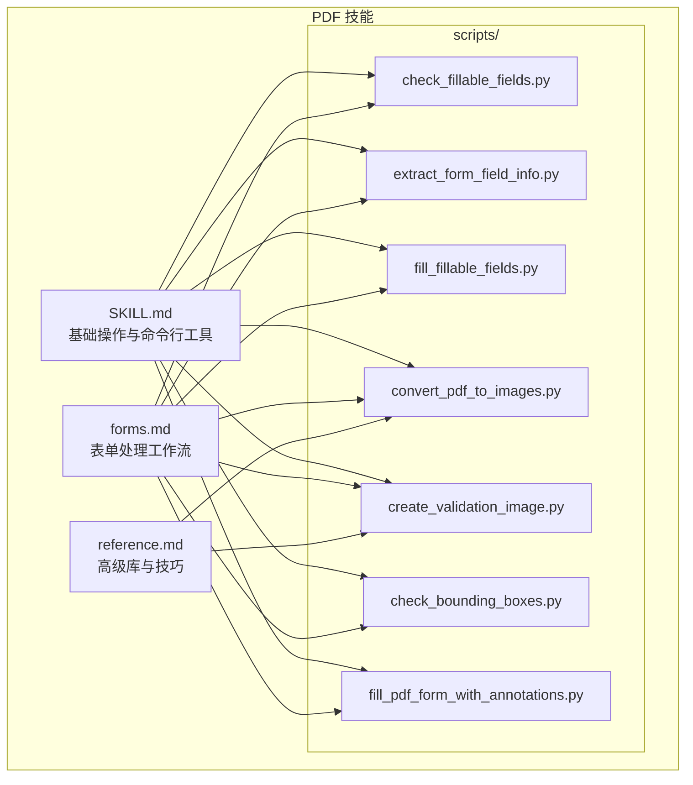
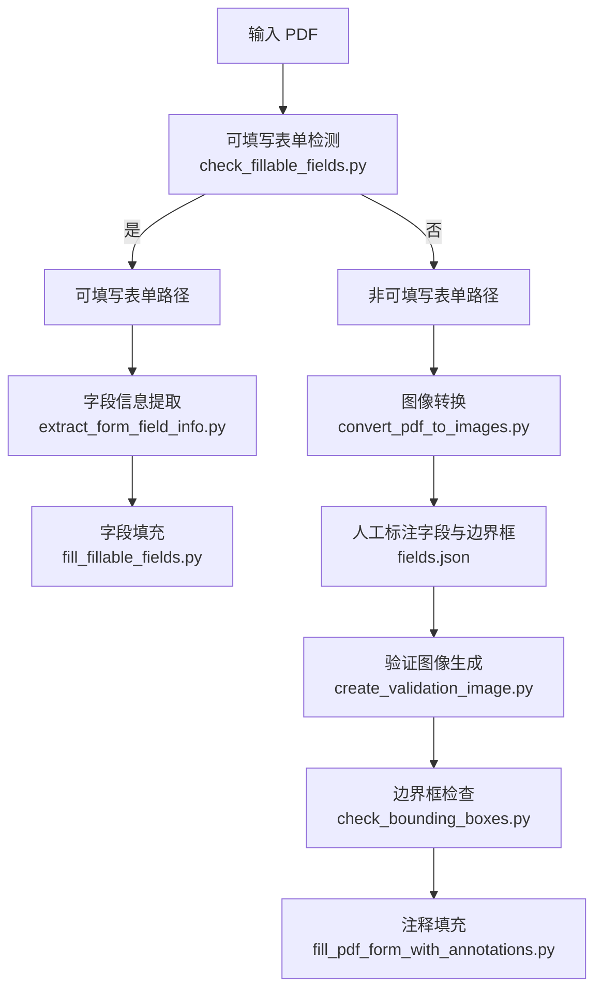
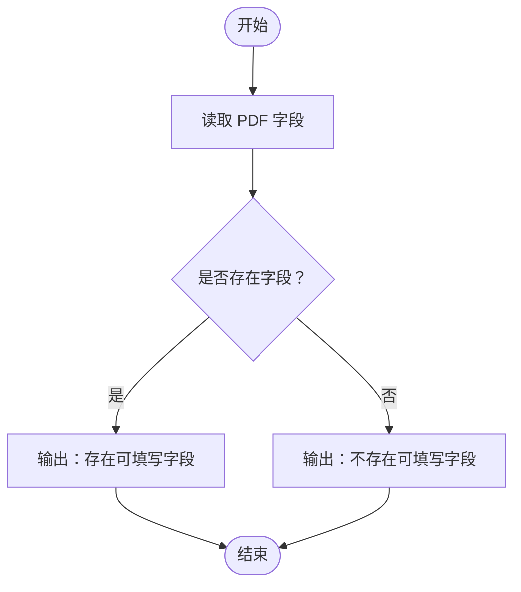
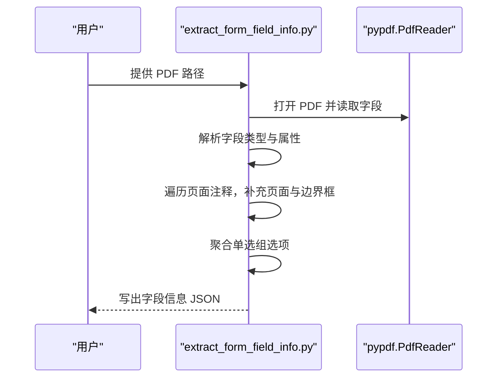
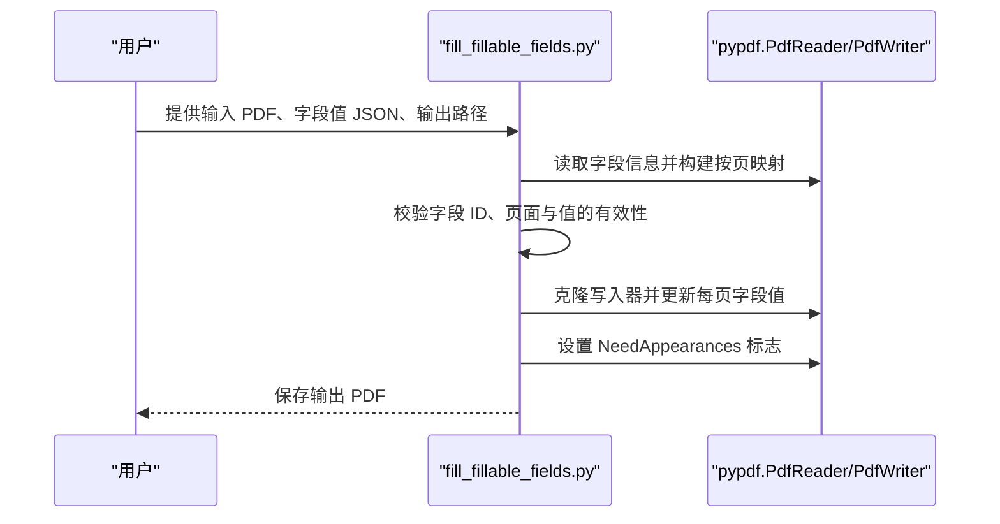
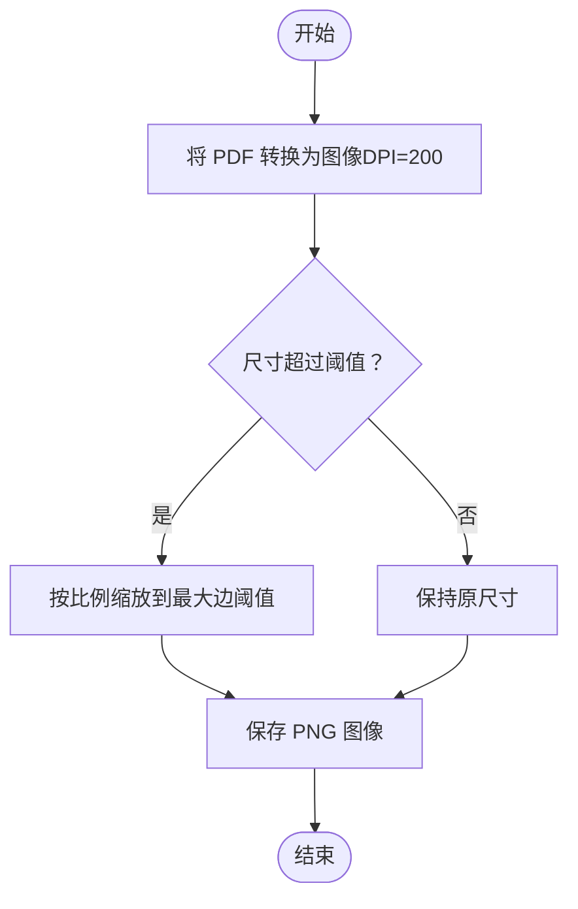
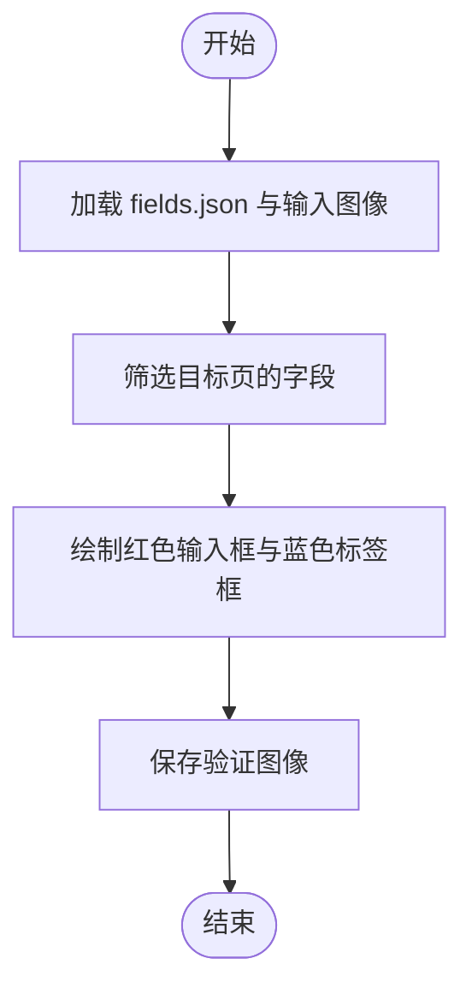
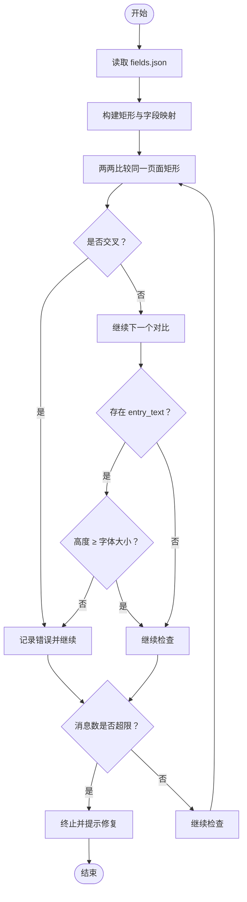
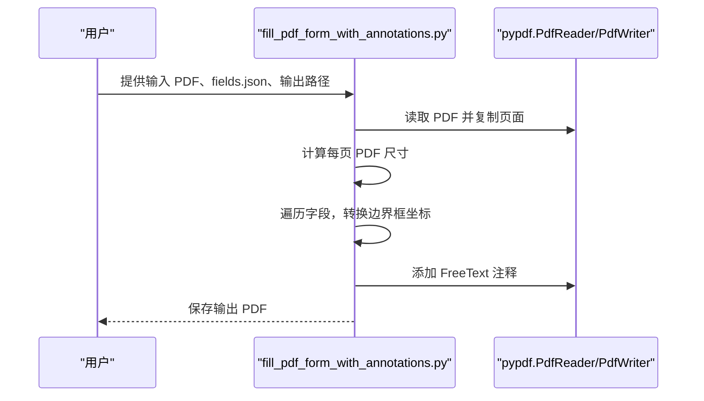
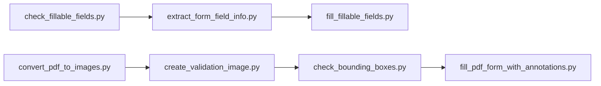

# PDF 处理

<cite>
**本文档引用的文件**
- [SKILL.md](file://mini_agent/skills/document-skills/pdf/SKILL.md)
- [forms.md](file://mini_agent/skills/document-skills/pdf/forms.md)
- [reference.md](file://mini_agent/skills/document-skills/pdf/reference.md)
- [check_fillable_fields.py](file://mini_agent/skills/document-skills/pdf/scripts/check_fillable_fields.py)
- [extract_form_field_info.py](file://mini_agent/skills/document-skills/pdf/scripts/extract_form_field_info.py)
- [fill_fillable_fields.py](file://mini_agent/skills/document-skills/pdf/scripts/fill_fillable_fields.py)
- [convert_pdf_to_images.py](file://mini_agent/skills/document-skills/pdf/scripts/convert_pdf_to_images.py)
- [create_validation_image.py](file://mini_agent/skills/document-skills/pdf/scripts/create_validation_image.py)
- [check_bounding_boxes.py](file://mini_agent/skills/document-skills/pdf/scripts/check_bounding_boxes.py)
- [check_bounding_boxes_test.py](file://mini_agent/skills/document-skills/pdf/scripts/check_bounding_boxes_test.py)
- [fill_pdf_form_with_annotations.py](file://mini_agent/skills/document-skills/pdf/scripts/fill_pdf_form_with_annotations.py)
- [README.md](file://README.md)
</cite>

## 目录
1. [简介](#简介)
2. [项目结构](#项目结构)
3. [核心组件](#核心组件)
4. [架构总览](#架构总览)
5. [详细组件分析](#详细组件分析)
6. [依赖关系分析](#依赖关系分析)
7. [性能考虑](#性能考虑)
8. [故障排除指南](#故障排除指南)
9. [结论](#结论)
10. [附录](#附录)

## 简介
本文件面向需要在文档处理中实现 PDF 表单识别与填充、注释添加、边界框检查以及验证图像生成的工程师与技术用户。文档基于仓库中的 PDF 技能包，系统性地梳理了以下能力：
- 使用 Python 脚本进行表单字段信息提取、可填写字段识别
- 非可填写表单的注释添加与注释填充流程
- 边界框检查工具的使用方法
- 验证图像生成技术在文档验证中的应用
- 具体使用场景与操作步骤，覆盖静态 PDF 处理与交互式表单处理

本指南既适合初学者快速上手，也适合有经验的开发者深入理解底层实现与最佳实践。

## 项目结构
PDF 处理能力主要集中在技能目录下的 PDF 子模块中，包含：
- 技能说明与参考：SKILL.md、forms.md、reference.md
- 脚本集合：scripts/ 下的一系列 Python 脚本，分别负责表单检测、字段提取、注释生成、边界框检查、图像转换与验证等

图表来源
- [SKILL.md:1-295](file://mini_agent/skills/document-skills/pdf/SKILL.md#L1-L295)
- [forms.md:1-206](file://mini_agent/skills/document-skills/pdf/forms.md#L1-L206)
- [reference.md:1-612](file://mini_agent/skills/document-skills/pdf/reference.md#L1-L612)

章节来源
- [SKILL.md:1-295](file://mini_agent/skills/document-skills/pdf/SKILL.md#L1-L295)
- [forms.md:1-206](file://mini_agent/skills/document-skills/pdf/forms.md#L1-L206)
- [reference.md:1-612](file://mini_agent/skills/document-skills/pdf/reference.md#L1-L612)

## 核心组件
本节概述 PDF 处理的关键组件及其职责：
- 可填写表单检测：判断 PDF 是否具备可填写字段
- 字段信息提取：解析字段类型、页面、坐标与选项
- 字段填充：校验值并写入表单
- 图像转换：将 PDF 页面转为 PNG 图像以便人工分析
- 注释生成：根据边界框在 PDF 上添加文本注释
- 边界框检查：自动检测标签与输入框是否交叉、高度是否足够
- 验证图像生成：在图像上绘制红蓝矩形以可视化边界框

章节来源
- [check_fillable_fields.py:1-13](file://mini_agent/skills/document-skills/pdf/scripts/check_fillable_fields.py#L1-L13)
- [extract_form_field_info.py:1-153](file://mini_agent/skills/document-skills/pdf/scripts/extract_form_field_info.py#L1-L153)
- [fill_fillable_fields.py:1-115](file://mini_agent/skills/document-skills/pdf/scripts/fill_fillable_fields.py#L1-L115)
- [convert_pdf_to_images.py:1-36](file://mini_agent/skills/document-skills/pdf/scripts/convert_pdf_to_images.py#L1-L36)
- [create_validation_image.py:1-42](file://mini_agent/skills/document-skills/pdf/scripts/create_validation_image.py#L1-L42)
- [check_bounding_boxes.py:1-71](file://mini_agent/skills/document-skills/pdf/scripts/check_bounding_boxes.py#L1-L71)
- [fill_pdf_form_with_annotations.py:1-108](file://mini_agent/skills/document-skills/pdf/scripts/fill_pdf_form_with_annotations.py#L1-L108)

## 架构总览
下图展示了“可填写表单”与“非可填写表单”的两条处理路径，以及它们共用的图像与边界框检查能力。

图表来源
- [check_fillable_fields.py:1-13](file://mini_agent/skills/document-skills/pdf/scripts/check_fillable_fields.py#L1-L13)
- [extract_form_field_info.py:1-153](file://mini_agent/skills/document-skills/pdf/scripts/extract_form_field_info.py#L1-L153)
- [fill_fillable_fields.py:1-115](file://mini_agent/skills/document-skills/pdf/scripts/fill_fillable_fields.py#L1-L115)
- [convert_pdf_to_images.py:1-36](file://mini_agent/skills/document-skills/pdf/scripts/convert_pdf_to_images.py#L1-L36)
- [create_validation_image.py:1-42](file://mini_agent/skills/document-skills/pdf/scripts/create_validation_image.py#L1-L42)
- [check_bounding_boxes.py:1-71](file://mini_agent/skills/document-skills/pdf/scripts/check_bounding_boxes.py#L1-L71)
- [fill_pdf_form_with_annotations.py:1-108](file://mini_agent/skills/document-skills/pdf/scripts/fill_pdf_form_with_annotations.py#L1-L108)

## 详细组件分析

### 组件一：可填写表单检测
- 功能：通过读取 PDF 的表单字段集合，判断是否存在可填写字段
- 输入：PDF 文件路径
- 输出：控制台提示（存在或不存在可填写字段）
- 关键点：使用 pypdf 的 PdfReader 获取字段；若返回非空则判定为可填写

图表来源
- [check_fillable_fields.py:8-12](file://mini_agent/skills/document-skills/pdf/scripts/check_fillable_fields.py#L8-L12)

章节来源
- [check_fillable_fields.py:1-13](file://mini_agent/skills/document-skills/pdf/scripts/check_fillable_fields.py#L1-L13)

### 组件二：字段信息提取
- 功能：解析 PDF 中的可填写字段，输出包含字段 ID、类型、页面、边界框、选项等信息的 JSON
- 输入：PDF 路径、输出 JSON 路径
- 输出：JSON 文件（按页面与 Y 坐标排序）
- 关键点：
  - 支持文本框、复选框、选择框、单选组（通过注释树聚合）
  - 复选框状态值自动推断 checked/unchecked
  - 单选组的每个选项包含值与边界框
  - 缺失注释信息的字段会被忽略

图表来源
- [extract_form_field_info.py:62-137](file://mini_agent/skills/document-skills/pdf/scripts/extract_form_field_info.py#L62-L137)

章节来源
- [extract_form_field_info.py:1-153](file://mini_agent/skills/document-skills/pdf/scripts/extract_form_field_info.py#L1-L153)

### 组件三：字段填充（可填写表单）
- 功能：根据字段值 JSON 对 PDF 进行字段赋值，并进行类型与值的校验
- 输入：输入 PDF、字段值 JSON、输出 PDF
- 输出：填充后的 PDF
- 关键点：
  - 按页分组字段值，调用更新接口写入
  - 设置 NeedAppearances 标志以确保大多数阅读器正确显示外观
  - 针对选择列表字段进行 pypdf 的兼容性补丁

图表来源
- [fill_fillable_fields.py:12-56](file://mini_agent/skills/document-skills/pdf/scripts/fill_fillable_fields.py#L12-L56)
- [fill_fillable_fields.py:59-75](file://mini_agent/skills/document-skills/pdf/scripts/fill_fillable_fields.py#L59-L75)
- [fill_fillable_fields.py:90-103](file://mini_agent/skills/document-skills/pdf/scripts/fill_fillable_fields.py#L90-L103)

章节来源
- [fill_fillable_fields.py:1-115](file://mini_agent/skills/document-skills/pdf/scripts/fill_fillable_fields.py#L1-L115)

### 组件四：图像转换（PDF → PNG）
- 功能：将 PDF 的每一页转换为 PNG 图像，便于人工分析与标注
- 输入：PDF 路径、输出目录
- 输出：多张 PNG 图像（带尺寸信息）
- 关键点：默认 DPI 200，支持最大边缩放

图表来源
- [convert_pdf_to_images.py:10-26](file://mini_agent/skills/document-skills/pdf/scripts/convert_pdf_to_images.py#L10-L26)

章节来源
- [convert_pdf_to_images.py:1-36](file://mini_agent/skills/document-skills/pdf/scripts/convert_pdf_to_images.py#L1-L36)

### 组件五：验证图像生成（边界框可视化）
- 功能：在图像上绘制红色输入框与蓝色标签框，辅助人工核验
- 输入：页码、fields.json、输入图像路径、输出图像路径
- 输出：带矩形标注的验证图像
- 关键点：仅对指定页绘制对应字段的矩形

图表来源
- [create_validation_image.py:11-30](file://mini_agent/skills/document-skills/pdf/scripts/create_validation_image.py#L11-L30)

章节来源
- [create_validation_image.py:1-42](file://mini_agent/skills/document-skills/pdf/scripts/create_validation_image.py#L1-L42)

### 组件六：边界框检查
- 功能：自动化检查字段标签与输入框是否交叉、输入框高度是否足以容纳字体大小
- 输入：fields.json
- 输出：控制台报告（成功/失败），最多限制消息数量以防过长
- 关键点：
  - 同一字段的标签与输入框不得交叉
  - 不同字段在同一页面才比较交叉
  - 若存在 entry_text，则检查高度与字体大小的关系

图表来源
- [check_bounding_boxes.py:18-60](file://mini_agent/skills/document-skills/pdf/scripts/check_bounding_boxes.py#L18-L60)

章节来源
- [check_bounding_boxes.py:1-71](file://mini_agent/skills/document-skills/pdf/scripts/check_bounding_boxes.py#L1-L71)

### 组件七：注释填充（非可填写表单）
- 功能：根据 fields.json 中的边界框与文本，在 PDF 上添加自由文本注释
- 输入：输入 PDF、fields.json、输出 PDF
- 输出：注释填充后的 PDF
- 关键点：
  - 将图像坐标系转换为 PDF 坐标系（注意 Y 轴方向差异）
  - 自动设置字体名称、字号与颜色（跨阅读器兼容性有限）

图表来源
- [fill_pdf_form_with_annotations.py:28-97](file://mini_agent/skills/document-skills/pdf/scripts/fill_pdf_form_with_annotations.py#L28-L97)

章节来源
- [fill_pdf_form_with_annotations.py:1-108](file://mini_agent/skills/document-skills/pdf/scripts/fill_pdf_form_with_annotations.py#L1-L108)

## 依赖关系分析
- 组件间耦合
  - 可填写表单路径：check_fillable_fields.py → extract_form_field_info.py → fill_fillable_fields.py
  - 非可填写表单路径：convert_pdf_to_images.py → create_validation_image.py → check_bounding_boxes.py → fill_pdf_form_with_annotations.py
  - 两者共享：fields.json 规范与边界框检查逻辑
- 外部依赖
  - pypdf：PDF 读写、字段更新、注释添加
  - pdf2image：PDF 到图像转换
  - PIL：图像绘制与保存
  - 命令行工具：pdftotext、pdfimages、qpdf（参考文档中提供）

图表来源
- [check_fillable_fields.py:1-13](file://mini_agent/skills/document-skills/pdf/scripts/check_fillable_fields.py#L1-L13)
- [extract_form_field_info.py:1-153](file://mini_agent/skills/document-skills/pdf/scripts/extract_form_field_info.py#L1-L153)
- [fill_fillable_fields.py:1-115](file://mini_agent/skills/document-skills/pdf/scripts/fill_fillable_fields.py#L1-L115)
- [convert_pdf_to_images.py:1-36](file://mini_agent/skills/document-skills/pdf/scripts/convert_pdf_to_images.py#L1-L36)
- [create_validation_image.py:1-42](file://mini_agent/skills/document-skills/pdf/scripts/create_validation_image.py#L1-L42)
- [check_bounding_boxes.py:1-71](file://mini_agent/skills/document-skills/pdf/scripts/check_bounding_boxes.py#L1-L71)
- [fill_pdf_form_with_annotations.py:1-108](file://mini_agent/skills/document-skills/pdf/scripts/fill_pdf_form_with_annotations.py#L1-L108)

章节来源
- [reference.md:265-342](file://mini_agent/skills/document-skills/pdf/reference.md#L265-L342)

## 性能考虑
- 大型 PDF 处理
  - 使用分块策略（按页）处理，避免一次性加载全部内容
  - 图像转换建议先低分辨率预览，最终导出时再提高分辨率
- 文本与表格提取
  - 对于纯文本，优先使用命令行工具；对于结构化数据，使用 pdfplumber
- 图像提取
  - 使用 pdfimages 快速提取嵌入图像，避免渲染整页
- 表单填充
  - 保持表单结构完整性，必要时设置 NeedAppearances 标志
- 内存管理
  - 流式处理与分页写入，减少内存峰值

章节来源
- [reference.md:528-565](file://mini_agent/skills/document-skills/pdf/reference.md#L528-L565)

## 故障排除指南
- 加密 PDF
  - 使用 pypdf 的解密流程处理密码保护的 PDF
- 崩溃或损坏的 PDF
  - 使用 qpdf 的修复与检查功能
- 文本提取问题
  - 对扫描版 PDF 使用 OCR（pytesseract + pdf2image）作为回退方案
- 边界框检查失败
  - 依据检查脚本输出逐项修正 fields.json，确保标签与输入框不交叉且输入框高度足够
- 注释显示异常
  - 字体大小与颜色在不同阅读器表现不一致，建议优先保证坐标与内容正确

章节来源
- [reference.md:567-601](file://mini_agent/skills/document-skills/pdf/reference.md#L567-L601)
- [check_bounding_boxes.py:18-60](file://mini_agent/skills/document-skills/pdf/scripts/check_bounding_boxes.py#L18-L60)

## 结论
该 PDF 处理能力通过一组清晰的脚本实现了从表单识别到注释填充的完整闭环。可填写表单路径强调自动化与类型安全，非可填写表单路径强调人工标注与验证，二者共同确保了在不同 PDF 结构下的稳健处理。配合边界框检查与验证图像生成，能够有效降低注释定位误差，提升最终 PDF 的质量与一致性。

## 附录

### 使用场景与操作步骤

- 场景一：静态 PDF 表单（可填写）
  1) 检查是否可填写：python scripts/check_fillable_fields.py <file.pdf>
  2) 提取字段信息：python scripts/extract_form_field_info.py <input.pdf> <field_info.json>
  3) 准备字段值 JSON（与字段 ID 匹配）
  4) 填充表单：python scripts/fill_fillable_fields.py <input.pdf> <field_values.json> <output.pdf>

- 场景二：非可填写表单（需人工标注）
  1) 转换图像：python scripts/convert_pdf_to_images.py <file.pdf> <output_dir>
  2) 人工分析并编写 fields.json（含页面尺寸、标签与输入框边界、文本内容与样式）
  3) 生成验证图像：python scripts/create_validation_image.py <page_number> <fields.json> <input_image_path> <output_image_path>
  4) 边界框检查：python scripts/check_bounding_boxes.py <fields.json>
  5) 注释填充：python scripts/fill_pdf_form_with_annotations.py <input_pdf_path> <fields.json> <output_pdf_path>

- 场景三：批量处理与优化
  - 使用命令行工具（如 qpdf、pdfimages、pdftotext）进行合并、拆分、提取与优化
  - 在 Python 中实现批处理与错误处理，按页分块处理大型 PDF

章节来源
- [forms.md:3-76](file://mini_agent/skills/document-skills/pdf/forms.md#L3-L76)
- [forms.md:78-206](file://mini_agent/skills/document-skills/pdf/forms.md#L78-L206)
- [reference.md:265-342](file://mini_agent/skills/document-skills/pdf/reference.md#L265-L342)