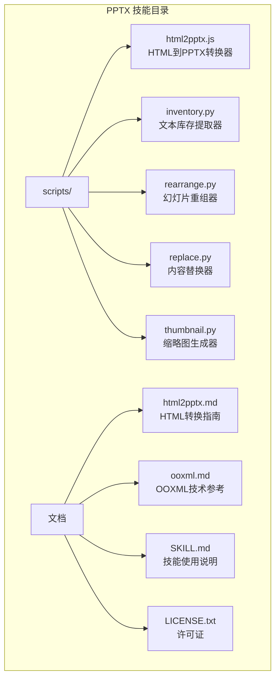
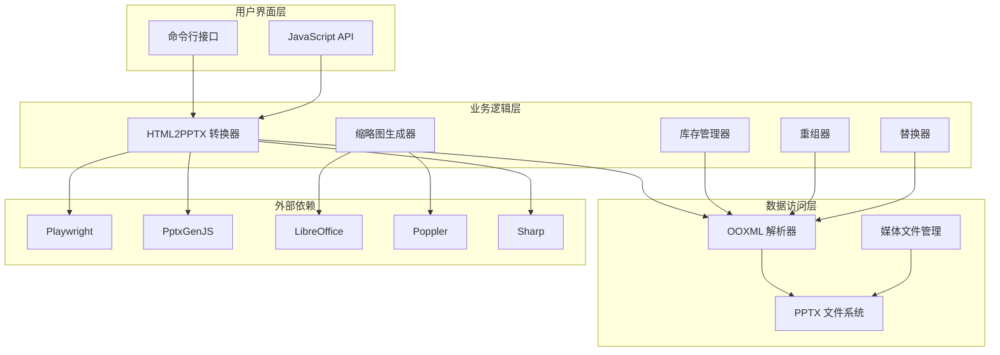
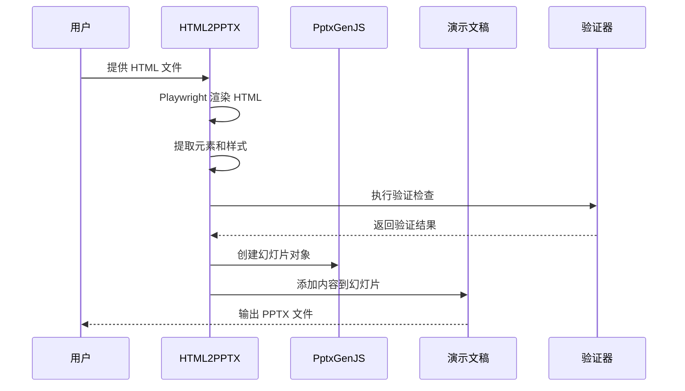
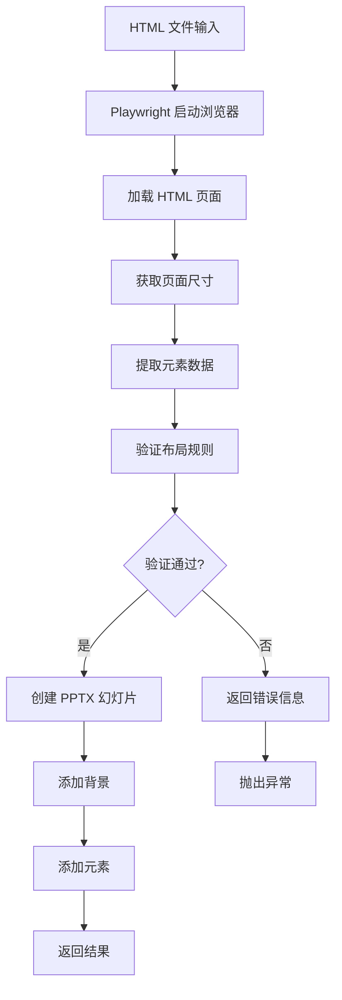
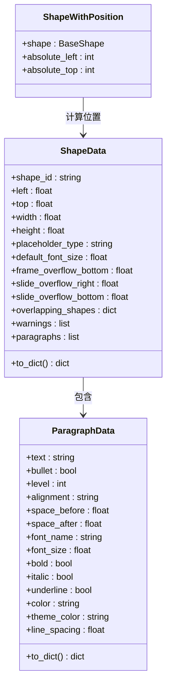
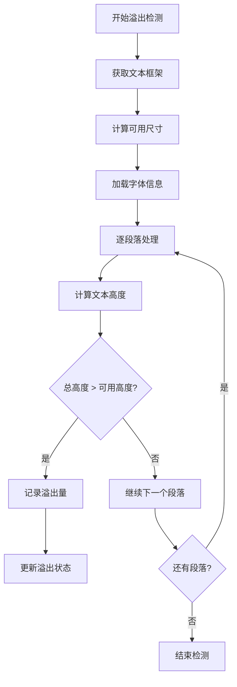
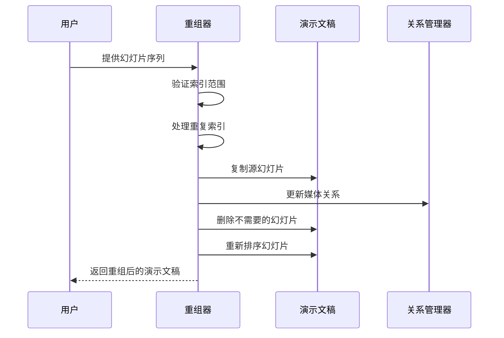
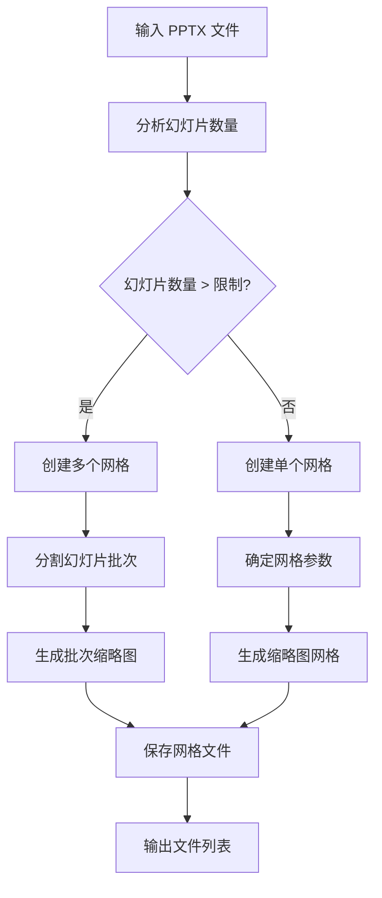
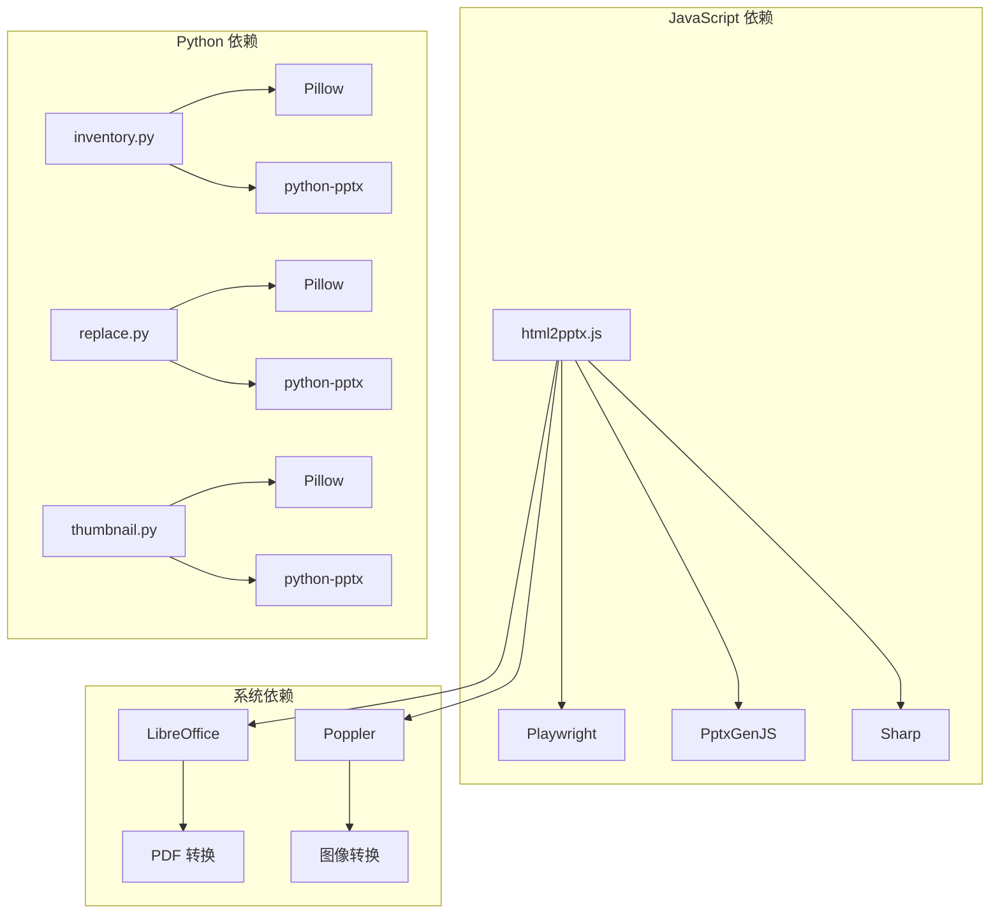
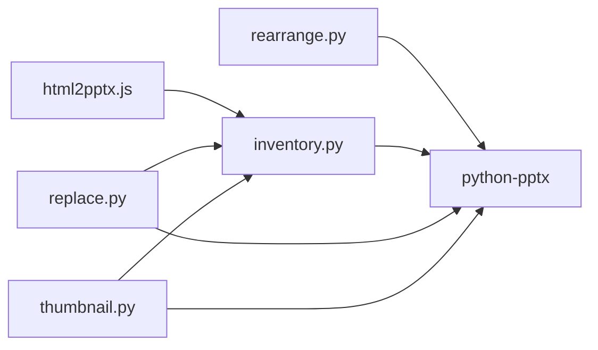

# PPTX 幻灯片处理

<cite>
**本文档引用的文件**
- [html2pptx.js](file://mini_agent/skills/document-skills/pptx/scripts/html2pptx.js)
- [inventory.py](file://mini_agent/skills/document-skills/pptx/scripts/inventory.py)
- [rearrange.py](file://mini_agent/skills/document-skills/pptx/scripts/rearrange.py)
- [replace.py](file://mini_agent/skills/document-skills/pptx/scripts/replace.py)
- [thumbnail.py](file://mini_agent/skills/document-skills/pptx/scripts/thumbnail.py)
- [html2pptx.md](file://mini_agent/skills/document-skills/pptx/html2pptx.md)
- [ooxml.md](file://mini_agent/skills/document-skills/pptx/ooxml.md)
- [SKILL.md](file://mini_agent/skills/document-skills/pptx/SKILL.md)
- [LICENSE.txt](file://mini_agent/skills/document-skills/pptx/LICENSE.txt)
</cite>

## 目录
1. [简介](#简介)
2. [项目结构](#项目结构)
3. [核心组件](#核心组件)
4. [架构概览](#架构概览)
5. [详细组件分析](#详细组件分析)
6. [依赖关系分析](#依赖关系分析)
7. [性能考虑](#性能考虑)
8. [故障排除指南](#故障排除指南)
9. [结论](#结论)
10. [附录](#附录)

## 简介

本项目提供了完整的 PowerPoint 幻灯片处理解决方案，涵盖了从 HTML 到 PPTX 的转换、幻灯片库存管理、缩略图生成、幻灯片重组等多个方面。该系统基于 Office Open XML (OOXML) 标准，提供了专业级的演示文稿处理能力。

系统的核心优势包括：
- **HTML 到 PPTX 的精确转换**：通过 Playwright 渲染引擎确保布局和样式的一致性
- **完整的文本库存管理**：支持复杂的文本格式化、列表、占位符检测
- **智能幻灯片重组**：支持重复、删除和重新排序操作
- **批量缩略图生成**：提供可视化的内容审查和导航功能
- **模板驱动的编辑工作流**：基于现有模板创建新演示文稿

## 项目结构

该项目位于 `mini_agent/skills/document-skills/pptx/` 目录下，采用模块化的文件组织方式：



**图表来源**
- [SKILL.md:1-484](file://mini_agent/skills/document-skills/pptx/SKILL.md#L1-L484)

**章节来源**
- [SKILL.md:1-484](file://mini_agent/skills/document-skills/pptx/SKILL.md#L1-L484)

## 核心组件

### HTML 到 PowerPoint 转换器 (html2pptx.js)

这是系统的核心转换引擎，负责将 HTML 内容精确转换为 PowerPoint 幻灯片。该组件具有以下关键特性：

- **精确的尺寸映射**：将像素转换为 PowerPoint 的英寸单位
- **样式继承**：支持从 CSS 继承字体、颜色、对齐等属性
- **内联格式化**：处理 `<b>`、`<i>`、`<u>`、`<span>` 等标签
- **占位符系统**：识别 `class="placeholder"` 元素用于图表区域
- **验证机制**：自动检测并报告布局和样式问题

### 文本库存提取器 (inventory.py)

提供全面的文本内容分析功能：

- **形状位置计算**：递归处理嵌套形状组，计算绝对位置
- **溢出检测**：使用 PIL 进行精确的文本测量，检测溢出问题
- **重叠分析**：识别形状之间的重叠区域
- **格式化保留**：保持段落格式、列表、字体属性等
- **JSON 导出**：输出结构化的库存数据

### 幻灯片重组器 (rearrange.py)

支持复杂的幻灯片操作：

- **重复滑块**：自动复制重复使用的幻灯片
- **删除操作**：清理不需要的幻灯片
- **重新排序**：按指定顺序重新排列幻灯片
- **关系维护**：正确处理媒体文件和图像关系

### 内容替换器 (replace.py)

提供智能的内容替换功能：

- **批量替换**：基于库存数据进行批量文本替换
- **格式保持**：保留原始格式设置，包括字体、颜色、对齐等
- **验证系统**：确保替换操作不会产生新的问题
- **冲突检测**：检测并报告可能的格式冲突

### 缩略图生成器 (thumbnail.py)

创建高质量的幻灯片缩略图网格：

- **多列布局**：支持 3-6 列的灵活布局
- **占位符标注**：可选地在缩略图上标注文本占位符
- **隐藏幻灯片处理**：自动检测并处理隐藏的幻灯片
- **批量生成**：支持大型演示文稿的分页缩略图生成

**章节来源**
- [html2pptx.js:1-979](file://mini_agent/skills/document-skills/pptx/scripts/html2pptx.js#L1-L979)
- [inventory.py:1-1021](file://mini_agent/skills/document-skills/pptx/scripts/inventory.py#L1-L1021)
- [rearrange.py:1-232](file://mini_agent/skills/document-skills/pptx/scripts/rearrange.py#L1-L232)
- [replace.py:1-386](file://mini_agent/skills/document-skills/pptx/scripts/replace.py#L1-L386)
- [thumbnail.py:1-451](file://mini_agent/skills/document-skills/pptx/scripts/thumbnail.py#L1-L451)

## 架构概览

系统采用分层架构设计，每层都有明确的职责分工：



**图表来源**
- [html2pptx.js:896-979](file://mini_agent/skills/document-skills/pptx/scripts/html2pptx.js#L896-L979)
- [inventory.py:914-975](file://mini_agent/skills/document-skills/pptx/scripts/inventory.py#L914-L975)

### 数据流架构



**图表来源**
- [html2pptx.js:896-979](file://mini_agent/skills/document-skills/pptx/scripts/html2pptx.js#L896-L979)

**章节来源**
- [SKILL.md:150-170](file://mini_agent/skills/document-skills/pptx/SKILL.md#L150-L170)

## 详细组件分析

### HTML 到 PPTX 转换器深度分析

#### 核心转换流程



**图表来源**
- [html2pptx.js:896-979](file://mini_agent/skills/document-skills/pptx/scripts/html2pptx.js#L896-L979)

#### 支持的元素类型

| 元素类型 | 支持的样式 | 特殊属性 |
|---------|-----------|----------|
| `<p>`, `<h1>`-`<h6>` | 字体、颜色、对齐、间距 | 文本变换、旋转 |
| `<ul>`, `<ol>` | 列表样式、缩进 | 嵌套级别、项目符号 |
| `<b>`, `<i>`, `<u>`, `<span>` | 内联格式化 | 颜色、透明度 |
| `<div>` | 背景、边框、圆角 | 阴影、不规则边框 |
| `` | 图像显示 | 宽高比、定位 |

#### 验证机制

系统实现了多层次的验证机制：

1. **尺寸验证**：确保 HTML 尺寸与演示文稿布局匹配
2. **溢出检测**：检查内容是否超出容器边界
3. **样式验证**：验证不支持的 CSS 属性
4. **占位符验证**：确保占位符元素具有有效尺寸

**章节来源**
- [html2pptx.js:36-118](file://mini_agent/skills/document-skills/pptx/scripts/html2pptx.js#L36-L118)
- [html2pptx.js:800-894](file://mini_agent/skills/document-skills/pptx/scripts/html2pptx.js#L800-L894)

### 文本库存管理系统

#### 形状数据结构



**图表来源**
- [inventory.py:128-264](file://mini_agent/skills/document-skills/pptx/scripts/inventory.py#L128-L264)
- [inventory.py:266-467](file://mini_agent/skills/document-skills/pptx/scripts/inventory.py#L266-L467)

#### 溢出检测算法



**图表来源**
- [inventory.py:562-638](file://mini_agent/skills/document-skills/pptx/scripts/inventory.py#L562-L638)

**章节来源**
- [inventory.py:128-740](file://mini_agent/skills/document-skills/pptx/scripts/inventory.py#L128-L740)

### 幻灯片重组器工作流程

#### 重组算法



**图表来源**
- [rearrange.py:149-227](file://mini_agent/skills/document-skills/pptx/scripts/rearrange.py#L149-L227)

#### 关系处理机制

重组过程中需要维护复杂的文件关系：

- **图像关系**：确保每个幻灯片的图像资源正确关联
- **媒体关系**：处理音频、视频等多媒体文件
- **占位符关系**：维护幻灯片布局中的占位符定义
- **主题关系**：保持主题和样式的一致性

**章节来源**
- [rearrange.py:75-127](file://mini_agent/skills/document-skills/pptx/scripts/rearrange.py#L75-L127)

### 缩略图生成系统

#### 多分辨率处理



**图表来源**
- [thumbnail.py:274-318](file://mini_agent/skills/document-skills/pptx/scripts/thumbnail.py#L274-L318)

#### 占位符标注功能

缩略图生成器支持可选的占位符标注功能：

- **文本区域检测**：自动识别所有文本占位符
- **比例转换**：将英寸坐标转换为像素坐标
- **轮廓绘制**：使用红色粗线突出显示占位符区域
- **透明度处理**：支持半透明覆盖层以避免遮挡内容

**章节来源**
- [thumbnail.py:159-195](file://mini_agent/skills/document-skills/pptx/scripts/thumbnail.py#L159-L195)
- [thumbnail.py:321-446](file://mini_agent/skills/document-skills/pptx/scripts/thumbnail.py#L321-L446)

## 依赖关系分析

### 外部依赖关系



**图表来源**
- [html2pptx.js:28-31](file://mini_agent/skills/document-skills/pptx/scripts/html2pptx.js#L28-L31)
- [thumbnail.py:44-51](file://mini_agent/skills/document-skills/pptx/scripts/thumbnail.py#L44-L51)

### 内部模块依赖



**图表来源**
- [replace.py:17-24](file://mini_agent/skills/document-skills/pptx/scripts/replace.py#L17-L24)

**章节来源**
- [SKILL.md:473-484](file://mini_agent/skills/document-skills/pptx/SKILL.md#L473-L484)

## 性能考虑

### 内存优化策略

1. **渐进式处理**：所有脚本都采用渐进式处理模式，避免一次性加载大量数据
2. **临时文件管理**：合理使用临时目录，及时清理不需要的中间文件
3. **图像缓存**：缩略图生成器使用适当的缓存策略避免重复处理

### 处理速度优化

1. **并行处理**：对于独立的幻灯片，可以并行处理以提高效率
2. **增量更新**：只处理发生变化的部分，避免全量重建
3. **批处理模式**：支持批量操作以减少启动开销

### 存储空间管理

1. **压缩输出**：生成的 PPTX 文件经过优化压缩
2. **媒体文件优化**：自动优化图像质量和尺寸
3. **临时文件清理**：确保所有临时文件都被正确清理

## 故障排除指南

### 常见问题及解决方案

#### HTML 转换问题

| 问题描述 | 可能原因 | 解决方案 |
|---------|---------|---------|
| HTML 尺寸不匹配 | body 尺寸与布局不一致 | 确保 HTML body 尺寸与 PPTX 布局匹配 |
| 文本不显示 | 文本不在受支持的标签内 | 将文本放入 `<p>`, `<h1>`-`<h6>`, `<ul>`, `<ol>` 标签 |
| 图像不显示 | 图像路径无效或格式不受支持 | 使用支持的图像格式并提供正确的相对路径 |
| 占位符无效 | 占位符尺寸为 0 | 检查 CSS 样式确保占位符有有效尺寸 |

#### 验证错误

系统会收集所有验证错误并在最后统一报告：

```javascript
// 示例错误消息格式
const errorMessage = `
Multiple validation errors found:
  1. HTML dimensions (720.0" × 405.0") don't match presentation layout (10.0" × 5.625")
  2. HTML content overflows body by 10.0pt horizontally
  3. CSS gradients are not supported. Use Sharp to rasterize gradients as PNG images first
`;
```

#### 性能问题

如果遇到性能问题，建议：

1. **检查系统资源**：确保有足够的内存和磁盘空间
2. **优化 HTML 结构**：减少不必要的嵌套和复杂样式
3. **分批处理**：对于大型演示文稿，考虑分批处理
4. **清理临时文件**：定期清理系统临时目录

**章节来源**
- [html2pptx.js:958-976](file://mini_agent/skills/document-skills/pptx/scripts/html2pptx.js#L958-L976)
- [replace.py:330-343](file://mini_agent/skills/document-skills/pptx/scripts/replace.py#L330-L343)

## 结论

本 PPTX 幻灯片处理系统提供了完整而强大的演示文稿自动化解决方案。通过模块化的设计和严格的验证机制，系统能够：

- **确保质量**：通过多层次验证确保输出的演示文稿质量
- **提高效率**：提供批量处理和自动化功能，显著提高工作效率
- **保持一致性**：通过模板驱动的工作流确保设计和格式的一致性
- **扩展性强**：模块化架构便于功能扩展和定制

该系统特别适合需要批量处理演示文稿、模板驱动的创建流程、以及需要精确控制内容格式的专业用户。

## 附录

### 使用场景示例

#### 场景一：批量 HTML 转换
```bash
# 创建 HTML 模板
mkdir slides
echo "<!DOCTYPE html><html><body style='width:720pt;height:405pt;'>
<h1>标题</h1>
<p>内容</p>
</body></html>" > slides/template.html

# 转换为 PPTX
node html2pptx.js slides/template.html
```

#### 场景二：模板驱动的演示文稿创建
```bash
# 分析模板
python scripts/thumbnail.py template.pptx
python scripts/inventory.py template.pptx inventory.json

# 创建新演示文稿
python scripts/rearrange.py template.pptx working.pptx 0,34,34,50,52
python scripts/replace.py working.pptx replacement.json output.pptx
```

#### 场景三：内容审查和质量检查
```bash
# 生成缩略图网格
python scripts/thumbnail.py presentation.pptx --cols 4

# 分析库存问题
python scripts/inventory.py presentation.pptx inventory.json --issues-only
```

### 最佳实践建议

1. **设计优先**：在开始编码前先分析内容和设计需求
2. **验证先行**：始终运行验证检查确保输出质量
3. **版本控制**：对重要的模板和配置文件进行版本管理
4. **测试驱动**：为关键功能编写测试用例
5. **文档记录**：详细记录配置和自定义选项

### 许可证信息

本项目受 Anthropic 的许可协议约束，禁止未经授权的复制、修改或分发。使用前请仔细阅读完整的许可条款。

**章节来源**
- [LICENSE.txt:1-31](file://mini_agent/skills/document-skills/pptx/LICENSE.txt#L1-L31)