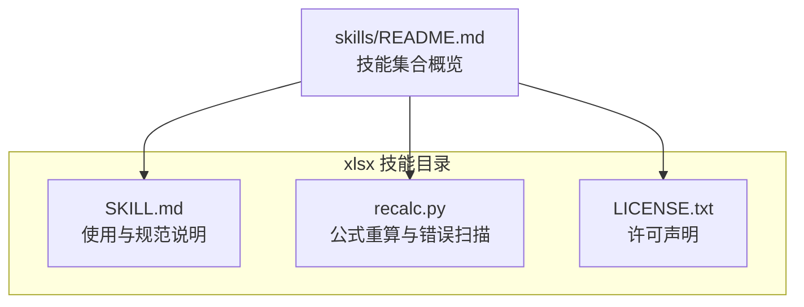
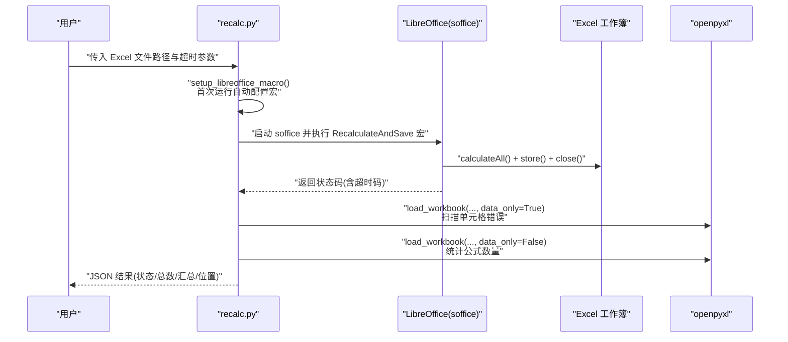
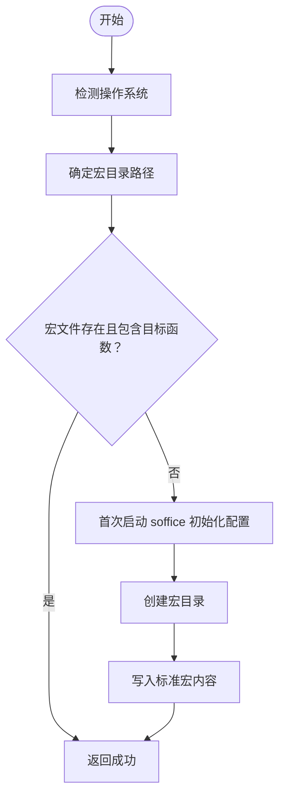
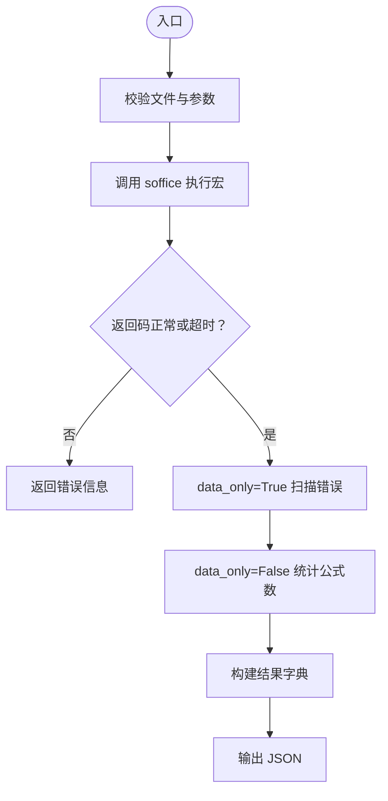
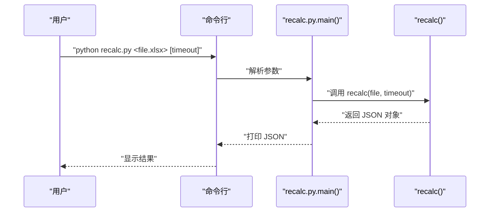
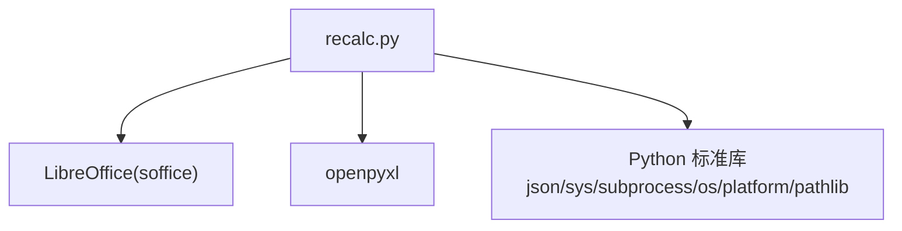

# XLSX 电子表格处理

<cite>
**本文引用的文件**
- [recalc.py](file://mini_agent/skills/document-skills/xlsx/recalc.py)
- [SKILL.md](file://mini_agent/skills/document-skills/xlsx/SKILL.md)
- [LICENSE.txt](file://mini_agent/skills/document-skills/xlsx/LICENSE.txt)
- [skills/README.md](file://mini_agent/skills/README.md)
</cite>

## 目录
1. [简介](#简介)
2. [项目结构](#项目结构)
3. [核心组件](#核心组件)
4. [架构总览](#架构总览)
5. [详细组件分析](#详细组件分析)
6. [依赖关系分析](#依赖关系分析)
7. [性能考虑](#性能考虑)
8. [故障排除指南](#故障排除指南)
9. [结论](#结论)
10. [附录](#附录)

## 简介
本文件面向使用 XLSX 电子表格的用户与开发者，聚焦于 Excel 工作簿的处理能力，特别是公式重新计算功能的实现原理与使用方法。XLSX 文件结构相对简单，主要通过 recalc.py 脚本提供“公式重新计算”这一核心能力：借助 LibreOffice 将 openpyxl 写入的公式字符串实际计算为数值，并扫描单元格中的 Excel 错误（如 #REF!、#DIV/0! 等），返回结构化结果，便于定位与修复问题。

本指南同时给出常见使用场景、最佳实践与排错建议，帮助你在以下情形中正确使用该工具：
- 使用 openpyxl 编写公式后，需要生成可直接打开查看计算结果的文件
- 需要批量检查工作簿中的公式错误并定位具体位置
- 在自动化流程中集成公式重算与错误报告

## 项目结构
XLSX 技能位于文档技能集合中，包含一个独立的脚本与技能说明文档：
- recalc.py：公式重新计算与错误扫描的核心脚本
- SKILL.md：使用指南、工作流、最佳实践与注意事项
- LICENSE.txt：许可声明

**图表来源**
- [SKILL.md:1-289](file://mini_agent/skills/document-skills/xlsx/SKILL.md#L1-L289)
- [recalc.py:1-178](file://mini_agent/skills/document-skills/xlsx/recalc.py#L1-L178)
- [LICENSE.txt:1-31](file://mini_agent/skills/document-skills/xlsx/LICENSE.txt#L1-L31)
- [skills/README.md:47-56](file://mini_agent/skills/README.md#L47-L56)

**章节来源**
- [SKILL.md:1-289](file://mini_agent/skills/document-skills/xlsx/SKILL.md#L1-L289)
- [recalc.py:1-178](file://mini_agent/skills/document-skills/xlsx/recalc.py#L1-L178)
- [LICENSE.txt:1-31](file://mini_agent/skills/document-skills/xlsx/LICENSE.txt#L1-L31)
- [skills/README.md:47-56](file://mini_agent/skills/README.md#L47-L56)

## 核心组件
- recalc.py
  - 功能：调用 LibreOffice 计算并保存工作簿；扫描所有单元格中的 Excel 错误；统计公式数量与错误分布；输出 JSON 结果
  - 关键步骤：设置 LibreOffice 宏 → 启动 soffice 执行宏 → 加载文件读取错误 → 统计公式数量 → 返回结果
- SKILL.md
  - 规范：强调必须使用公式而非硬编码值；提供创建/编辑工作簿的示例；明确“公式重算”为必经步骤
  - 检查清单：样本引用测试、列映射、行偏移、空值处理、跨表引用等

**章节来源**
- [recalc.py:53-156](file://mini_agent/skills/document-skills/xlsx/recalc.py#L53-L156)
- [SKILL.md:94-289](file://mini_agent/skills/document-skills/xlsx/SKILL.md#L94-L289)

## 架构总览
下图展示了从调用 recalc.py 到最终输出错误报告的整体流程：

**图表来源**
- [recalc.py:16-50](file://mini_agent/skills/document-skills/xlsx/recalc.py#L16-L50)
- [recalc.py:72-100](file://mini_agent/skills/document-skills/xlsx/recalc.py#L72-L100)
- [recalc.py:102-156](file://mini_agent/skills/document-skills/xlsx/recalc.py#L102-L156)

## 详细组件分析

### 组件一：LibreOffice 宏配置与调用
- 目标：确保首次运行时在用户配置目录创建标准宏模块，以便后续通过 soffice 调用
- 行为要点：
  - 根据平台选择宏目录（macOS 与 Linux 路径不同）
  - 若宏文件不存在则初始化，内容包含一个名为 RecalculateAndSave 的子程序
  - 子程序依次执行 calculateAll()、store()、close(True)
- 平台差异：
  - Linux 使用 timeout 命令限制进程时间
  - macOS 优先尝试 gtimeout（若安装了 coreutils）

**图表来源**
- [recalc.py:16-50](file://mini_agent/skills/document-skills/xlsx/recalc.py#L16-L50)

**章节来源**
- [recalc.py:16-50](file://mini_agent/skills/document-skills/xlsx/recalc.py#L16-L50)

### 组件二：公式重算与错误扫描
- 目标：对工作簿执行全表重算，扫描所有单元格中的 Excel 错误类型，统计公式数量，并输出结构化 JSON
- 处理逻辑：
  - 参数校验与绝对路径转换
  - 调用 soffice 执行宏，支持超时控制
  - 成功后使用 data_only=True 读取已计算值，遍历所有单元格，匹配预定义错误标记
  - 使用 data_only=False 遍历统计公式数量（以以“=”开头的字符串为依据）
  - 输出包含状态、错误总数、公式总数与按类型分组的位置列表
- 错误类型覆盖：#VALUE!、#DIV/0!、#REF!、#NAME?、#NULL!、#NUM!、#N/A

**图表来源**
- [recalc.py:64-100](file://mini_agent/skills/document-skills/xlsx/recalc.py#L64-L100)
- [recalc.py:102-156](file://mini_agent/skills/document-skills/xlsx/recalc.py#L102-L156)

**章节来源**
- [recalc.py:53-156](file://mini_agent/skills/document-skills/xlsx/recalc.py#L53-L156)

### 组件三：命令行接口与输出格式
- CLI 行为：
  - 必需参数：Excel 文件路径
  - 可选参数：超时秒数（默认 30）
  - 输出：JSON 字符串，包含状态、错误总数、公式总数与错误摘要
- 输出字段解释：
  - status：success 或 errors_found
  - total_errors：错误总数
  - total_formulas：公式总数
  - error_summary：按错误类型分组，每类包含计数与最多 20 个位置示例

**图表来源**
- [recalc.py:158-178](file://mini_agent/skills/document-skills/xlsx/recalc.py#L158-L178)

**章节来源**
- [recalc.py:158-178](file://mini_agent/skills/document-skills/xlsx/recalc.py#L158-L178)

### 使用场景与最佳实践
- 场景一：使用 openpyxl 创建/修改工作簿后，需要导出可直接打开查看计算结果的文件
  - 步骤：创建/修改 → 保存 → 运行 recalc.py → 查看 JSON 中的错误摘要 → 修正后重复重算
- 场景二：批量检查多个工作簿中的公式错误
  - 步骤：循环对每个文件运行 recalc.py → 收集 JSON → 统计各类型错误占比
- 最佳实践：
  - 始终使用公式而非硬编码值，保持动态更新能力
  - 测试关键引用与边缘情况（零值、负值、极大值）
  - 注意列映射与行偏移（Excel 行索引为 1 基）
  - 跨表引用使用 SheetName!A1 格式
  - 使用 data_only=True 仅读取计算值，避免永久丢失公式

**章节来源**
- [SKILL.md:94-289](file://mini_agent/skills/document-skills/xlsx/SKILL.md#L94-L289)

## 依赖关系分析
- 外部依赖
  - LibreOffice：通过 soffice 提供宏执行环境，执行 calculateAll()/store()/close()
  - 平台工具：Linux 使用 timeout，macOS 优先 gtimeout（若安装）
- 内部依赖
  - openpyxl：用于加载工作簿，分别以 data_only=True/False 扫描错误与统计公式
  - Python 标准库：json、sys、subprocess、os、platform、pathlib

**图表来源**
- [recalc.py:7-13](file://mini_agent/skills/document-skills/xlsx/recalc.py#L7-L13)

**章节来源**
- [recalc.py:7-13](file://mini_agent/skills/document-skills/xlsx/recalc.py#L7-L13)

## 性能考虑
- 全量扫描策略：对所有工作表、所有行与列进行遍历，适合中小规模文件；对于超大文件，建议：
  - 仅扫描关键区域或使用更细粒度的范围
  - 分批处理多个文件，避免单次长时间占用资源
- 超时控制：通过平台特定的 timeout/gtimeout 限制进程时间，防止长时间阻塞
- I/O 优化：尽量减少重复打开/关闭工作簿次数，当前实现已按需两次加载

[本节为通用建议，不直接分析具体文件]

## 故障排除指南
- LibreOffice 宏未正确配置
  - 现象：返回“宏未正确配置”的错误提示
  - 排查：确认首次运行是否成功创建宏文件；检查平台路径是否正确；确认 soffice 可执行
- soffice 执行失败或超时
  - 现象：返回未知错误或超时退出码
  - 排查：调整超时参数；确认 LibreOffice 安装完整；在 macOS 上确认 gtimeout 是否可用
- 重算后仍存在 Excel 错误
  - 现象：status 为 errors_found，error_summary 包含具体类型与位置
  - 排查：根据位置逐项修正引用、除零、类型不匹配等问题；修正后再次重算
- data_only=True 导致公式丢失
  - 现象：以 data_only=True 打开并保存后，原公式被替换为值
  - 预防：仅在读取计算值时使用 data_only=True；重算后以普通模式打开并保存

**章节来源**
- [recalc.py:94-99](file://mini_agent/skills/document-skills/xlsx/recalc.py#L94-L99)
- [recalc.py:102-156](file://mini_agent/skills/document-skills/xlsx/recalc.py#L102-L156)
- [SKILL.md:268-273](file://mini_agent/skills/document-skills/xlsx/SKILL.md#L268-L273)

## 结论
XLSX 技能通过 recalc.py 将 openpyxl 与 LibreOffice 有机结合，实现了对 Excel 公式的可靠重算与错误扫描。其设计简洁高效：首次运行自动配置宏，随后以统一接口完成重算、扫描与统计，并输出结构化结果。配合 SKILL.md 中的工作流与最佳实践，用户可在多种场景中稳定地创建、编辑与验证动态电子表格。

[本节为总结性内容，不直接分析具体文件]

## 附录

### A. 常见错误类型与含义
- #VALUE!：公式中出现错误的数据类型
- #DIV/0!：除数为零
- #REF!：单元格引用无效
- #NAME?：公式中使用了无法识别的名称
- #NULL!：交集运算符使用不当
- #NUM!：数值错误（如溢出）
- #N/A：无可用数据或查找失败

**章节来源**
- [recalc.py:105-106](file://mini_agent/skills/document-skills/xlsx/recalc.py#L105-L106)

### B. 使用示例与参考路径
- 使用 openpyxl 创建/编辑工作簿并保存
  - 参考路径：[SKILL.md 示例段落:148-202](file://mini_agent/skills/document-skills/xlsx/SKILL.md#L148-L202)
- 运行 recalc.py 进行公式重算
  - 命令格式：python recalc.py <excel_file> [timeout_seconds]
  - 参考路径：[SKILL.md 重算说明:204-223](file://mini_agent/skills/document-skills/xlsx/SKILL.md#L204-L223)
- 解释 recalc.py 输出 JSON
  - 参考路径：[SKILL.md 输出示例与说明:246-260](file://mini_agent/skills/document-skills/xlsx/SKILL.md#L246-L260)

**章节来源**
- [SKILL.md:148-223](file://mini_agent/skills/document-skills/xlsx/SKILL.md#L148-L223)
- [SKILL.md:246-260](file://mini_agent/skills/document-skills/xlsx/SKILL.md#L246-L260)