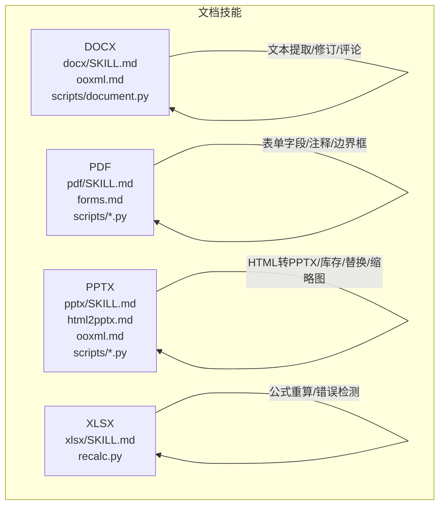
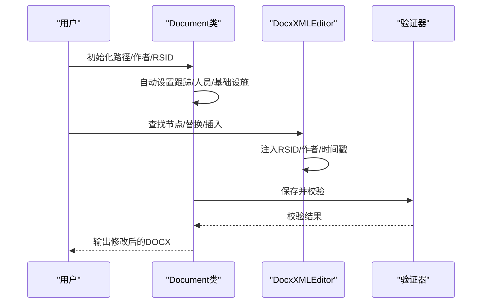
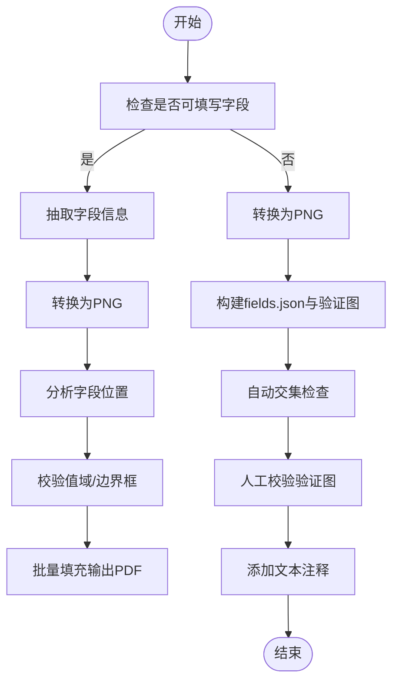
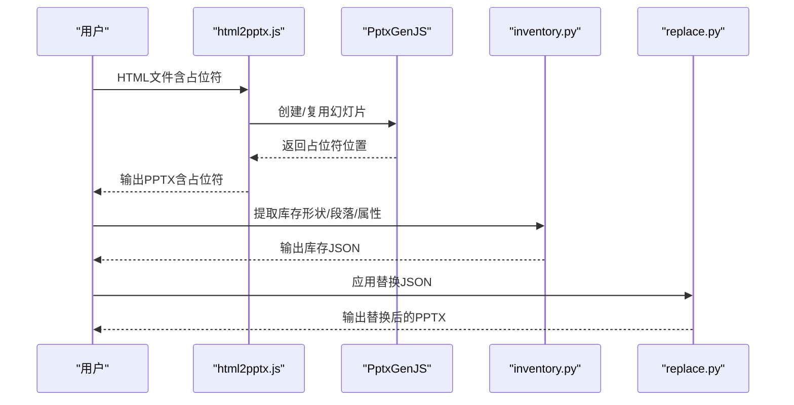
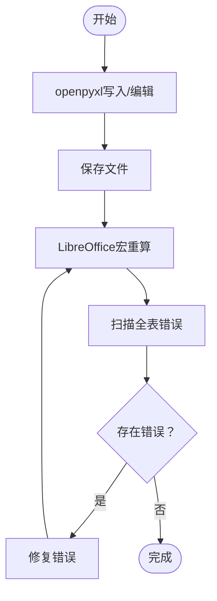
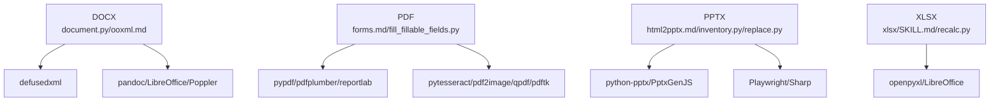

# 文档处理技能

<cite>
**本文引用的文件**
- [docx/SKILL.md](file://mini_agent/skills/document-skills/docx/SKILL.md)
- [ooxml.md](file://mini_agent/skills/document-skills/docx/ooxml.md)
- [document.py](file://mini_agent/skills/document-skills/docx/scripts/document.py)
- [pdf/SKILL.md](file://mini_agent/skills/document-skills/pdf/SKILL.md)
- [forms.md](file://mini_agent/skills/document-skills/pdf/forms.md)
- [fill_fillable_fields.py](file://mini_agent/skills/document-skills/pdf/scripts/fill_fillable_fields.py)
- [pptx/SKILL.md](file://mini_agent/skills/document-skills/pptx/SKILL.md)
- [html2pptx.md](file://mini_agent/skills/document-skills/pptx/html2pptx.md)
- [ooxml.md](file://mini_agent/skills/document-skills/pptx/ooxml.md)
- [inventory.py](file://mini_agent/skills/document-skills/pptx/scripts/inventory.py)
- [replace.py](file://mini_agent/skills/document-skills/pptx/scripts/replace.py)
- [xlsx/SKILL.md](file://mini_agent/skills/document-skills/xlsx/SKILL.md)
- [recalc.py](file://mini_agent/skills/document-skills/xlsx/recalc.py)
</cite>

## 目录
1. [简介](#简介)
2. [项目结构](#项目结构)
3. [核心组件](#核心组件)
4. [架构总览](#架构总览)
5. [详细组件分析](#详细组件分析)
6. [依赖关系分析](#依赖关系分析)
7. [性能考虑](#性能考虑)
8. [故障排查指南](#故障排查指南)
9. [结论](#结论)
10. [附录](#附录)

## 简介
本文件系统性梳理 MiniAgent 项目中“文档处理技能”套件，覆盖以下能力：
- DOCX 文档处理：解析与文本提取、样式保留、评论与修订追踪、图片插入、打包与校验
- PDF 处理：可填写表单字段填充、注释标注、边界框校验、命令行与脚本化批量处理
- PPTX 幻灯片处理：HTML 转 PPTX、模板库存与布局选择、文本替换与格式保持、缩略图生成与可视化校验
- XLSX 电子表格处理：公式重算、错误检测、数据验证与格式规范

文档以“技能说明 + 技术实现 + 使用流程 + 工具脚本 + 可视化图示”的方式组织，帮助读者快速理解并落地复杂文档操作任务。

## 项目结构
文档技能位于 skills/document-skills 下，按格式划分为 docx、pdf、pptx、xlsx 四个子目录，每个子目录包含：
- 技能说明文档（SKILL.md）
- 技术参考文档（如 ooxml.md）
- 脚本工具（scripts/），用于自动化处理
- 示例与模板（部分目录包含）

图表来源
- [docx/SKILL.md:1-197](file://mini_agent/skills/document-skills/docx/SKILL.md#L1-L197)
- [pdf/SKILL.md:1-295](file://mini_agent/skills/document-skills/pdf/SKILL.md#L1-L295)
- [pptx/SKILL.md:1-484](file://mini_agent/skills/document-skills/pptx/SKILL.md#L1-L484)
- [xlsx/SKILL.md:1-289](file://mini_agent/skills/document-skills/xlsx/SKILL.md#L1-L289)

章节来源
- [docx/SKILL.md:1-197](file://mini_agent/skills/document-skills/docx/SKILL.md#L1-L197)
- [pdf/SKILL.md:1-295](file://mini_agent/skills/document-skills/pdf/SKILL.md#L1-L295)
- [pptx/SKILL.md:1-484](file://mini_agent/skills/document-skills/pptx/SKILL.md#L1-L484)
- [xlsx/SKILL.md:1-289](file://mini_agent/skills/document-skills/xlsx/SKILL.md#L1-L289)

## 核心组件
- DOCX：基于 Office Open XML 的 Python 库封装，支持修订追踪、评论、图片插入、DOM 直接编辑与自动校验
- PDF：pypdf、pdfplumber、reportlab 等库组合，支持表单字段识别与填充、OCR、水印、拆分合并等
- PPTX：HTML 到 PPTX 的转换链路（html2pptx.js + PptxGenJS），配合 inventory/replace 缩略图与文本替换工具
- XLSX：openpyxl + LibreOffice 宏，实现公式重算与全表扫描错误检测

章节来源
- [docx/SKILL.md:63-154](file://mini_agent/skills/document-skills/docx/SKILL.md#L63-L154)
- [pdf/SKILL.md:28-295](file://mini_agent/skills/document-skills/pdf/SKILL.md#L28-L295)
- [pptx/SKILL.md:47-484](file://mini_agent/skills/document-skills/pptx/SKILL.md#L47-L484)
- [xlsx/SKILL.md:63-289](file://mini_agent/skills/document-skills/xlsx/SKILL.md#L63-L289)

## 架构总览
下图展示各格式处理的总体流程与关键交互点：

图表来源
- [docx/SKILL.md:31-154](file://mini_agent/skills/document-skills/docx/SKILL.md#L31-L154)
- [pdf/SKILL.md:9-295](file://mini_agent/skills/document-skills/pdf/SKILL.md#L9-L295)
- [pptx/SKILL.md:13-484](file://mini_agent/skills/document-skills/pptx/SKILL.md#L13-L484)
- [xlsx/SKILL.md:63-289](file://mini_agent/skills/document-skills/xlsx/SKILL.md#L63-L289)

## 详细组件分析

### DOCX 组件分析
- 关键特性
  - 文本提取：推荐使用 pandoc 保留修订状态
  - 原始 XML 访问：通过解包（unpack）读取 word/document.xml、comments.xml 等
  - 修订追踪：最小化精确编辑，避免重复未变更文本；支持嵌套删除与恢复插入/删除
  - 图片插入：自动维护媒体关系与尺寸，防止溢出
  - 打包与校验：自动更新关系与类型声明，保存时进行 schema 校验
- 技术要点
  - 使用 Document 类与 DocxXMLEditor 封装 RSID、作者、时间戳注入与节点替换
  - 支持 suggest_deletion、revert_insertion、revert_deletion 等高级操作
  - ooxml.md 提供完整 XML 模式与结构示例（段落、列表、表格、链接、图片等）
- 使用流程（修订追踪）
  - 文档解包 → 生成 RSID → 逐批实现变更（建议3-10处为一批）→ 验证与保存 → 再次提取对比确认

图表来源
- [document.py:612-800](file://mini_agent/skills/document-skills/docx/scripts/document.py#L612-L800)
- [ooxml.md:266-552](file://mini_agent/skills/document-skills/docx/ooxml.md#L266-L552)

章节来源
- [docx/SKILL.md:31-154](file://mini_agent/skills/document-skills/docx/SKILL.md#L31-L154)
- [ooxml.md:1-610](file://mini_agent/skills/document-skills/docx/ooxml.md#L1-L610)
- [document.py:1-800](file://mini_agent/skills/document-skills/docx/scripts/document.py#L1-L800)

### PDF 组件分析
- 关键特性
  - 可填写表单字段：识别字段类型（文本/复选框/单选组/选择框），抽取字段信息，校验值域后批量填充
  - 非可填写表单：通过图像与边界框定位，生成验证图，再以文本注释方式填入
  - 文本与表格提取：pdfplumber 提取布局文本与表格，结合 pandas 导出
  - 命令行工具：pdftotext、qpdf、pdftk 等实现合并、拆分、旋转、加水印、提取图片、加密/解密等
- 使用流程（可填写表单）
  - 检查是否可填写字段 → 抽取字段信息 → 转换为PNG → 分析并确定字段位置 → 校验值域 → 填充输出
- 使用流程（非可填写表单）
  - 转换为PNG → 分析标签与输入区域 → 生成fields.json与验证图 → 自动/手动校验边界框 → 添加注释并输出

图表来源
- [forms.md:1-206](file://mini_agent/skills/document-skills/pdf/forms.md#L1-L206)
- [fill_fillable_fields.py:1-115](file://mini_agent/skills/document-skills/pdf/scripts/fill_fillable_fields.py#L1-L115)

章节来源
- [pdf/SKILL.md:9-295](file://mini_agent/skills/document-skills/pdf/SKILL.md#L9-L295)
- [forms.md:1-206](file://mini_agent/skills/document-skills/pdf/forms.md#L1-L206)
- [fill_fillable_fields.py:1-115](file://mini_agent/skills/document-skills/pdf/scripts/fill_fillable_fields.py#L1-L115)

### PPTX 组件分析
- 关键特性
  - HTML 转 PPTX：通过 html2pptx.js 将 HTML 幻灯片转换为 PPTX，并用 PptxGenJS 添加图表/表格/图片
  - 模板库存与布局选择：生成缩略图网格，导出库存清单，映射到目标模板索引
  - 文本替换：基于 inventory.py 提取形状与段落属性，replace.py 应用替换并校验溢出与警告
  - 缩略图生成：统一生成幻灯片缩略图，便于视觉校验
- 使用流程（模板驱动）
  - 提取模板文本与缩略图 → 生成库存清单 → 基于库存选择布局 → 重排/复制幻灯片 → 提取工作稿库存 → 生成替换JSON → 应用替换并校验

图表来源
- [html2pptx.md:183-300](file://mini_agent/skills/document-skills/pptx/html2pptx.md#L183-L300)
- [pptx/SKILL.md:171-395](file://mini_agent/skills/document-skills/pptx/SKILL.md#L171-L395)
- [inventory.py:1-200](file://mini_agent/skills/document-skills/pptx/scripts/inventory.py#L1-L200)
- [replace.py:214-354](file://mini_agent/skills/document-skills/pptx/scripts/replace.py#L214-L354)

章节来源
- [pptx/SKILL.md:13-484](file://mini_agent/skills/document-skills/pptx/SKILL.md#L13-L484)
- [html2pptx.md:1-625](file://mini_agent/skills/document-skills/pptx/html2pptx.md#L1-L625)
- [ooxml.md:1-427](file://mini_agent/skills/document-skills/pptx/ooxml.md#L1-L427)
- [inventory.py:1-200](file://mini_agent/skills/document-skills/pptx/scripts/inventory.py#L1-L200)
- [replace.py:1-386](file://mini_agent/skills/document-skills/pptx/scripts/replace.py#L1-L386)

### XLSX 组件分析
- 关键特性
  - 公式重算：通过 LibreOffice 宏自动配置并调用 calculateAll/store/close，随后以 openpyxl 读取 data_only=True 扫描错误
  - 数据分析：pandas 读取 Excel 进行统计与可视化
  - 格式规范：颜色编码、数字格式、公式构造规则、注释与硬编码来源标注
- 使用流程
  - openpyxl 写入/编辑 → 保存 → recalc.py 重算 → 扫描错误并返回 JSON → 修复后重算直至无误

图表来源
- [xlsx/SKILL.md:63-289](file://mini_agent/skills/document-skills/xlsx/SKILL.md#L63-L289)
- [recalc.py:53-178](file://mini_agent/skills/document-skills/xlsx/recalc.py#L53-L178)

章节来源
- [xlsx/SKILL.md:63-289](file://mini_agent/skills/document-skills/xlsx/SKILL.md#L63-L289)
- [recalc.py:1-178](file://mini_agent/skills/document-skills/xlsx/recalc.py#L1-L178)

## 依赖关系分析
- DOCX
  - 依赖：defusedxml、ooxml 脚本（pack/validate）、外部工具（pandoc、LibreOffice、Poppler）
  - 关键模块：document.py（Document/DocxXMLEditor）、ooxml.md（XML模式）
- PDF
  - 依赖：pypdf、pdfplumber、reportlab、pytesseract（OCR）、pdf2image、qpdf、pdftk
  - 关键模块：forms.md（流程）、fill_fillable_fields.py（字段填充）
- PPTX
  - 依赖：pptx（python-pptx）、PptxGenJS（JavaScript）、Playwright、Sharp
  - 关键模块：html2pptx.md（转换）、inventory.py/replace.py（库存与替换）
- XLSX
  - 依赖：openpyxl、LibreOffice（宏）
  - 关键模块：xlsx/SKILL.md（规范）、recalc.py（重算与错误扫描）

图表来源
- [docx/SKILL.md:183-197](file://mini_agent/skills/document-skills/docx/SKILL.md#L183-L197)
- [pdf/SKILL.md:28-295](file://mini_agent/skills/document-skills/pdf/SKILL.md#L28-L295)
- [pptx/SKILL.md:467-484](file://mini_agent/skills/document-skills/pptx/SKILL.md#L467-L484)
- [xlsx/SKILL.md:69-72](file://mini_agent/skills/document-skills/xlsx/SKILL.md#L69-L72)

章节来源
- [docx/SKILL.md:183-197](file://mini_agent/skills/document-skills/docx/SKILL.md#L183-L197)
- [pdf/SKILL.md:28-295](file://mini_agent/skills/document-skills/pdf/SKILL.md#L28-L295)
- [pptx/SKILL.md:467-484](file://mini_agent/skills/document-skills/pptx/SKILL.md#L467-L484)
- [xlsx/SKILL.md:69-72](file://mini_agent/skills/document-skills/xlsx/SKILL.md#L69-L72)

## 性能考虑
- DOCX
  - 批量修订：建议每批3-10处变更，便于调试与增量验证
  - 图片插入：先计算宽高比与EMUs，避免溢出导致多次重排
- PDF
  - OCR：扫描版PDF需先转图像再OCR，注意分辨率与页数范围控制
  - 合并与拆分：优先使用 qpdf 或 pypdf 的批量接口，减少内存占用
- PPTX
  - HTML转PPTX：预渲染渐变与图标为PNG，避免PowerPoint不支持的CSS效果
  - 缩略图：网格列数控制在3-6列，避免生成过多文件
- XLSX
  - 公式重算：首次配置宏可能耗时，后续重算较快；超时参数按实际文件规模调整

## 故障排查指南
- DOCX
  - 修订冲突：确保仅标记实际变更文本，避免在他人插入/删除内直接修改
  - 校验失败：检查 RSID、关系文件与内容类型声明是否齐全
- PDF
  - 字段值错误：复核 checked_value/unchecked_value、radio选项值、choice选项值
  - 边界框冲突：红框仅覆盖输入区，蓝框仅覆盖标签；checkbox目标矩形应居中于方框
- PPTX
  - 文本溢出：替换后重新提取库存，若溢出增加则回退或调整布局
  - 占位符缺失：确保HTML中占位符id与PptxGenJS传入一致
- XLSX
  - 公式错误：关注 #REF!/#DIV/0!/#VALUE!/#NAME? 等，逐项修正并重算

章节来源
- [ooxml.md:554-610](file://mini_agent/skills/document-skills/docx/ooxml.md#L554-L610)
- [forms.md:184-201](file://mini_agent/skills/document-skills/pdf/forms.md#L184-L201)
- [replace.py:306-344](file://mini_agent/skills/document-skills/pptx/scripts/replace.py#L306-L344)
- [recalc.py:101-156](file://mini_agent/skills/document-skills/xlsx/recalc.py#L101-L156)

## 结论
该技能套件围绕 Office Open XML、PowerPoint、Excel 与 PDF 的标准格式，提供了从“解析/提取/编辑”到“自动化脚本/批量处理”的完整闭环。通过明确的流程、严格的校验与丰富的工具脚本，能够高效、稳健地完成复杂文档操作任务。建议在生产环境中：
- 严格遵循各格式的技术参考与最佳实践
- 使用批处理与增量验证策略
- 建立标准化的模板与库存体系
- 在关键环节引入自动化校验与回滚机制

## 附录
- 快速参考
  - DOCX：pandoc 文本提取、unpack/validate/pack 流程、修订追踪最小化原则
  - PDF：可填写字段识别与填充、非可填写表单注释标注、命令行工具
  - PPTX：HTML设计与占位符、库存与替换、缩略图网格
  - XLSX：公式重算与错误扫描、颜色与格式规范