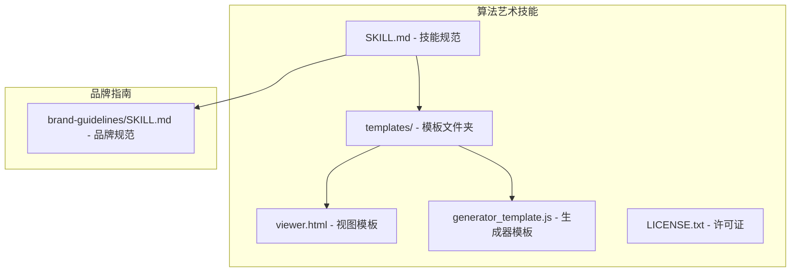
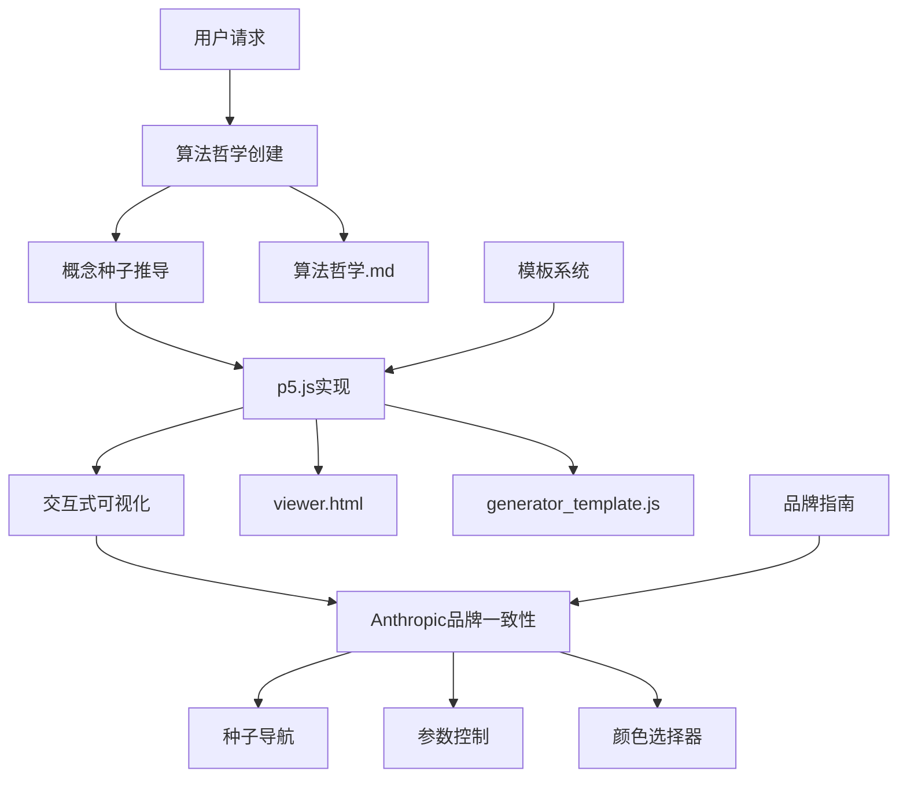
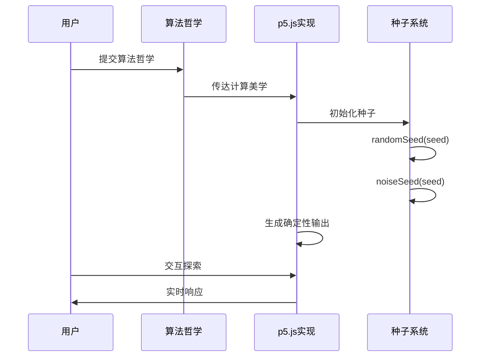
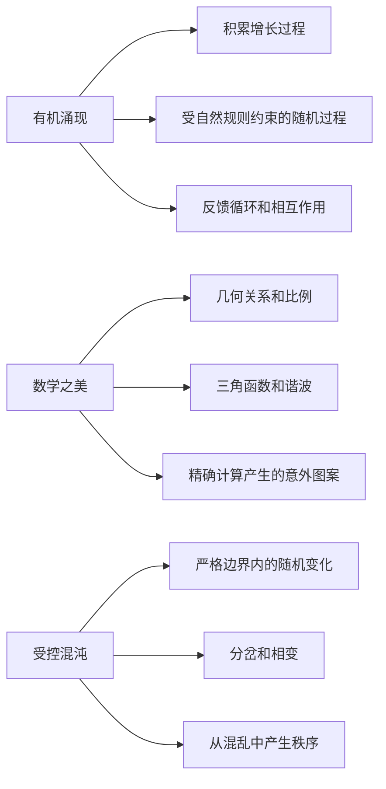
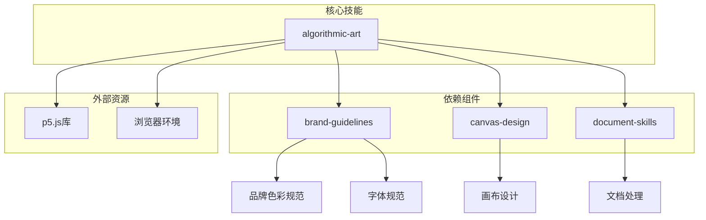

# 艺术创作技能

<cite>
**本文档引用的文件**
- [SKILL.md](file://mini_agent/skills/algorithmic-art/SKILL.md)
- [viewer.html](file://mini_agent/skills/algorithmic-art/templates/viewer.html)
- [generator_template.js](file://mini_agent/skills/algorithmic-art/templates/generator_template.js)
- [LICENSE.txt](file://mini_agent/skills/algorithmic-art/LICENSE.txt)
- [brand-guidelines/SKILL.md](file://mini_agent/skills/brand-guidelines/SKILL.md)
</cite>

## 目录
1. [简介](#简介)
2. [项目结构](#项目结构)
3. [核心组件](#核心组件)
4. [架构概览](#架构概览)
5. [详细组件分析](#详细组件分析)
6. [依赖关系分析](#依赖关系分析)
7. [性能考虑](#性能考虑)
8. [故障排除指南](#故障排除指南)
9. [结论](#结论)
10. [附录](#附录)

## 简介

艺术创作技能是一个专门设计用于创建算法艺术（Algorithmic Art）的工具集。该技能基于p5.js框架，结合种子随机性和交互式参数探索，为用户提供创造性的算法艺术体验。算法艺术是一种通过计算机程序生成的艺术形式，强调计算过程的美学价值，而非静态图像本身。

本技能的核心理念是"过程胜于产物"——真正的美来自于算法执行的过程，每次运行都会产生独特的结果。通过算法哲学宣言，用户可以定义计算美学的世界观，然后将其转化为可交互的p5.js可视化作品。

## 项目结构

算法艺术技能采用模块化设计，主要包含以下核心组件：

**图表来源**
- [SKILL.md:1-405](file://mini_agent/skills/algorithmic-art/SKILL.md#L1-L405)
- [viewer.html:1-599](file://mini_agent/skills/algorithmic-art/templates/viewer.html#L1-L599)

**章节来源**
- [SKILL.md:1-405](file://mini_agent/skills/algorithmic-art/SKILL.md#L1-L405)

## 核心组件

### 算法哲学创建器

算法哲学是整个创作过程的起点，它定义了计算美学的哲学基础。每个算法哲学都包含以下要素：

- **运动名称**：简洁的1-2个词描述
- **哲学阐述**：4-6段完整的论述
- **算法表达**：如何将哲学转化为计算过程
- **关键指导原则**：避免冗余、强调工艺、留有创意空间

### p5.js 实现引擎

基于算法哲学，创建交互式的p5.js可视化作品。实现要求包括：

- 种子随机性（Art Blocks模式）
- 参数化结构
- 标准画布设置
- 工艺品质要求

### 模板系统

提供标准化的HTML模板和JavaScript最佳实践，确保所有作品具有一致的品牌风格和用户体验。

**章节来源**
- [SKILL.md:15-86](file://mini_agent/skills/algorithmic-art/SKILL.md#L15-L86)
- [SKILL.md:101-218](file://mini_agent/skills/algorithmic-art/SKILL.md#L101-L218)

## 架构概览

算法艺术技能遵循"哲学驱动实现"的架构模式：

**图表来源**
- [SKILL.md:359-382](file://mini_agent/skills/algorithmic-art/SKILL.md#L359-L382)

## 详细组件分析

### 算法哲学创建流程

算法哲学创建是整个技能的核心，包含以下关键步骤：

#### 1. 运动命名
选择简洁而富有诗意的1-2词名称，如"有机湍流"、"量子和谐"、"递归低语"等。

#### 2. 哲学阐述
撰写4-6段完整的论述，涵盖：
- 计算过程和数学关系
- 噪声函数和随机模式
- 粒子行为和场动力学
- 时间演进和系统状态
- 参数变化和涌现复杂性

#### 3. 关键指导原则
- 避免重复：每个算法方面只提及一次
- 强调工艺：最终算法必须显得经过精心打磨
- 留有创意空间：提供足够自由度让实现者发挥

### p5.js 实现最佳实践

#### 种子随机性（Art Blocks模式）

**图表来源**
- [SKILL.md:135-141](file://mini_agent/skills/algorithmic-art/SKILL.md#L135-L141)

#### 参数化结构设计

参数应该自然地从算法哲学中产生，考虑以下类型：

- **数量**：元素个数（粒子、圆圈、分支等）
- **尺度**：大小、速度、间距
- **概率**：事件发生的可能性
- **比例**：各部分之间的比例关系
- **角度**：旋转、方向
- **阈值**：行为改变的临界值

#### 核心算法表达

根据不同的哲学主题，采用相应的算法策略：

**图表来源**
- [SKILL.md:169-184](file://mini_agent/skills/algorithmic-art/SKILL.md#L169-L184)

### 模板系统详解

#### HTML模板结构

viewer.html提供了完整的交互式界面模板，包含：

- **固定部分**：布局结构、Anthropic品牌、种子导航、操作按钮
- **可变部分**：p5.js算法、参数控制、颜色选择器

#### JavaScript最佳实践

generator_template.js展示了p5.js生成艺术的最佳实践：

- 参数组织：将所有可调参数放在一个对象中
- 种子随机性：使用Art Blocks模式确保可重现性
- 生命周期管理：标准的p5.js生命周期函数
- 类结构：当需要多个实体时使用类
- 性能考虑：优化大量元素的处理
- 实用函数：颜色转换、映射、缓动等工具函数

**章节来源**
- [viewer.html:1-599](file://mini_agent/skills/algorithmic-art/templates/viewer.html#L1-L599)
- [generator_template.js:1-223](file://mini_agent/skills/algorithmic-art/templates/generator_template.js#L1-L223)

## 依赖关系分析

算法艺术技能与其他组件的依赖关系如下：

**图表来源**
- [SKILL.md:386-405](file://mini_agent/skills/algorithmic-art/SKILL.md#L386-L405)

**章节来源**
- [SKILL.md:386-405](file://mini_agent/skills/algorithmic-art/SKILL.md#L386-L405)

## 性能考虑

### 执行效率优化

为了确保算法艺术作品的流畅运行，需要考虑以下性能因素：

- **大数量元素处理**：预计算可计算的内容，使用简单碰撞检测
- **动画性能**：目标60fps，必要时进行性能分析和优化
- **内存管理**：合理管理粒子数组和网格结构
- **渲染优化**：使用透明度创建轨迹/淡出效果

### 可重现性保证

通过种子随机性确保相同输入产生相同输出：

- 使用`randomSeed(seed)`和`noiseSeed(seed)`
- 在每次初始化时重新播种
- 确保所有随机数生成都是确定性的

## 故障排除指南

### 常见问题及解决方案

#### 1. 种子不生效
**问题**：更改种子后输出没有变化
**解决方案**：确保在`initializeSystem()`中正确调用`randomSeed()`和`noiseSeed()`

#### 2. 参数控制无响应
**问题**：滑块调整后画面不更新
**解决方案**：检查`updateParam()`函数是否正确更新参数并触发重绘

#### 3. 性能问题
**问题**：大量粒子导致卡顿
**解决方案**：减少粒子数量、简化计算逻辑、使用空间哈希等优化技术

#### 4. 品牌风格不一致
**问题**：作品缺乏Anthropic品牌特色
**解决方案**：严格使用模板中的颜色、字体和布局规范

**章节来源**
- [SKILL.md:201-210](file://mini_agent/skills/algorithmic-art/SKILL.md#L201-L210)

## 结论

算法艺术技能提供了一个完整的创作框架，将计算美学理论与实际编程实现相结合。通过算法哲学的深度思考和p5.js的技术实现，用户可以创造出既具有艺术价值又具备交互性的算法艺术作品。

该技能的核心优势在于：
- **哲学驱动**：从概念层面定义艺术风格
- **技术可靠**：基于成熟的p5.js生态系统
- **品牌一致**：严格遵循Anthropic的设计规范
- **交互友好**：提供丰富的参数控制和种子导航

通过遵循这些指导原则和最佳实践，用户可以创建出真正意义上的算法艺术作品，展现计算美学的独特魅力。

## 附录

### 使用示例

#### 有机湍流风格
- **哲学核心**：自然法则约束下的混沌，从无序中产生有序
- **算法特征**：基于分层Perlin噪声的流场，数千粒子跟随向量力
- **视觉表现**：有机密度图，快粒子明亮，慢粒子渐隐

#### 量子和谐风格  
- **哲学核心**：离散实体表现出波状干涉图案
- **算法特征**：网格初始化的粒子，相位值随正弦波演化
- **视觉表现**：简单的简谐运动产生复杂的涌现曼陀罗

#### 递归低语风格
- **哲学核心**：尺度间的自相似性，在有限空间内无限深度
- **算法特征**：分形结构递归细分，轻微噪声打破完美对称
- **视觉表现**：树状形式的分支结构，线条权重随层级递减

### 最佳实践清单

- **哲学深度**：确保算法哲学有4-6段完整论述
- **参数合理性**：参数应直接反映算法哲学的核心要素
- **品牌一致性**：严格使用Anthropic的颜色、字体和布局
- **性能优化**：确保作品在浏览器中流畅运行
- **可重现性**：相同种子始终产生相同输出
- **交互性**：提供有意义的参数控制和种子导航

**章节来源**
- [SKILL.md:54-76](file://mini_agent/skills/algorithmic-art/SKILL.md#L54-L76)