# GIF 创建器技能

<cite>
**本文档引用的文件**
- [SKILL.md](file://mini_agent/skills/slack-gif-creator/SKILL.md)
- [gif_builder.py](file://mini_agent/skills/slack-gif-creator/core/gif_builder.py)
- [easing.py](file://mini_agent/skills/slack-gif-creator/core/easing.py)
- [validators.py](file://mini_agent/skills/slack-gif-creator/core/validators.py)
- [color_palettes.py](file://mini_agent/skills/slack-gif-creator/core/color_palettes.py)
- [typography.py](file://mini_agent/skills/slack-gif-creator/core/typography.py)
- [bounce.py](file://mini_agent/skills/slack-gif-creator/templates/bounce.py)
- [explode.py](file://mini_agent/skills/slack-gif-creator/templates/explode.py)
- [fade.py](file://mini_agent/skills/slack-gif-creator/templates/fade.py)
- [pulse.py](file://mini_agent/skills/slack-gif-creator/templates/pulse.py)
- [spin.py](file://mini_agent/skills/slack-gif-creator/templates/spin.py)
- [kaleidoscope.py](file://mini_agent/skills/slack-gif-creator/templates/kaleidoscope.py)
- [move.py](file://mini_agent/skills/slack-gif-creator/templates/move.py)
- [zoom.py](file://mini_agent/skills/slack-gif-creator/templates/zoom.py)
- [wiggle.py](file://mini_agent/skills/slack-gif-creator/templates/wiggle.py)
- [shake.py](file://mini_agent/skills/slack-gif-creator/templates/shake.py)
</cite>

## 目录
1. [简介](#简介)
2. [项目结构](#项目结构)
3. [核心组件](#核心组件)
4. [架构总览](#架构总览)
5. [详细组件分析](#详细组件分析)
6. [依赖关系分析](#依赖关系分析)
7. [性能考量](#性能考量)
8. [故障排除指南](#故障排除指南)
9. [结论](#结论)
10. [附录](#附录)

## 简介
本技能为 Slack 优化的 GIF 创建工具包，提供验证器、可组合的动画原语以及辅助工具，帮助在 Slack 的尺寸、帧率、颜色和时长限制内创作高质量的动态 GIF。技能支持多种动画模板（弹跳、爆炸、淡入淡出、翻转、万花筒、变形、移动、脉动、摇摆、滑动、旋转、扭动、缩放），并提供参数化配置、帧率控制、颜色调色板选择和字体使用建议。文档将深入解析动画生成流程、参数配置要点、最佳实践与常见问题排查方法。

## 项目结构
该技能位于 `mini_agent/skills/slack-gif-creator` 目录下，采用“核心模块 + 模板”的分层组织：
- 核心模块：负责 GIF 组装、优化、校验、缓动函数、颜色管理、排版与可视化效果
- 模板：按动画类型划分的独立模块，提供可复用的动画生成函数
- 技能说明：完整的使用指南、约束条件、示例与优化策略

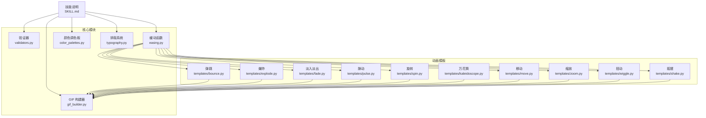

**图表来源**
- [SKILL.md](file://mini_agent/skills/slack-gif-creator/SKILL.md)
- [gif_builder.py](file://mini_agent/skills/slack-gif-creator/core/gif_builder.py)
- [easing.py](file://mini_agent/skills/slack-gif-creator/core/easing.py)
- [validators.py](file://mini_agent/skills/slack-gif-creator/core/validators.py)
- [color_palettes.py](file://mini_agent/skills/slack-gif-creator/core/color_palettes.py)
- [typography.py](file://mini_agent/skills/slack-gif-creator/core/typography.py)
- [bounce.py](file://mini_agent/skills/slack-gif-creator/templates/bounce.py)
- [explode.py](file://mini_agent/skills/slack-gif-creator/templates/explode.py)
- [fade.py](file://mini_agent/skills/slack-gif-creator/templates/fade.py)
- [pulse.py](file://mini_agent/skills/slack-gif-creator/templates/pulse.py)
- [spin.py](file://mini_agent/skills/slack-gif-creator/templates/spin.py)
- [kaleidoscope.py](file://mini_agent/skills/slack-gif-creator/templates/kaleidoscope.py)
- [move.py](file://mini_agent/skills/slack-gif-creator/templates/move.py)
- [zoom.py](file://mini_agent/skills/slack-gif-creator/templates/zoom.py)
- [wiggle.py](file://mini_agent/skills/slack-gif-creator/templates/wiggle.py)
- [shake.py](file://mini_agent/skills/slack-gif-creator/templates/shake.py)

**章节来源**
- [SKILL.md](file://mini_agent/skills/slack-gif-creator/SKILL.md)

## 核心组件
- GIF 构建器（GIFBuilder）
  - 负责接收帧数组，进行尺寸归一化、去重、颜色量化与保存输出
  - 支持 Emoji 模式下的更严格优化（尺寸、颜色数、帧数）
  - 输出文件信息（路径、大小、维度、帧数、FPS、时长、颜色数）
- 验证器（Validators）
  - 文件大小检查（消息 GIF 2MB，Emoji GIF 64KB）
  - 尺寸与比例检查（Emoji 推荐 128x128，消息 GIF 建议方形或近似方形）
  - 全量验证与优化建议生成
- 缓动函数（Easing）
  - 提供线性、二次、弹性、回弹等多种缓动曲线
  - 支持计算弧形运动轨迹
- 颜色调色板（Color Palettes）
  - 内置多套专业配色方案（活力、粉彩、暗系、霓虹、专业、暖色、冷色、单色）
  - 提供互补色、明暗调整、渐变色与 Emoji 安全配色
- 排版系统（Typography）
  - 字体获取与跨平台兼容
  - 文本描边、阴影、辉光、文字框等渲染能力
  - 文本尺寸测量与自适应缩放
- 可选可视化效果（Visual Effects）
  - 粒子系统、冲击闪光、波纹扩散等增强效果

**章节来源**
- [gif_builder.py](file://mini_agent/skills/slack-gif-creator/core/gif_builder.py)
- [validators.py](file://mini_agent/skills/slack-gif-creator/core/validators.py)
- [easing.py](file://mini_agent/skills/slack-gif-creator/core/easing.py)
- [color_palettes.py](file://mini_agent/skills/slack-gif-creator/core/color_palettes.py)
- [typography.py](file://mini_agent/skills/slack-gif-creator/core/typography.py)

## 架构总览
GIF 创建流程遵循“模板生成帧 → 核心模块组装与优化 → 验证与导出”的模式。模板通过缓动函数与几何变换生成逐帧图像，GIF 构建器统一处理尺寸、颜色与重复帧去除，验证器确保符合 Slack 限制，最终输出优化后的 GIF。

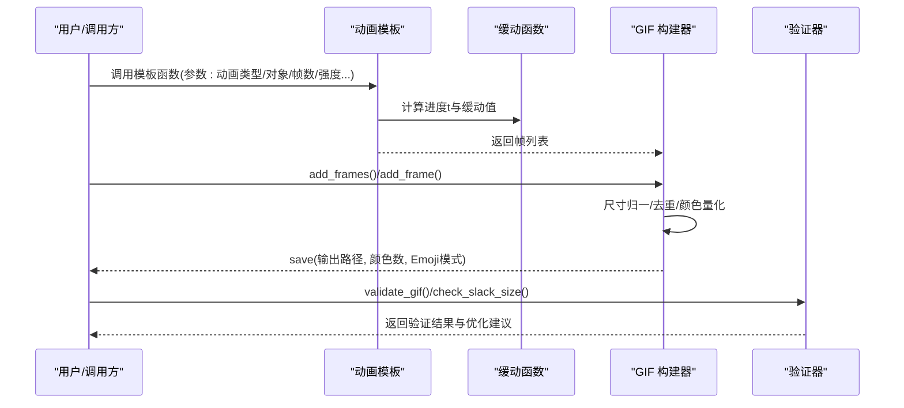

**图表来源**
- [bounce.py](file://mini_agent/skills/slack-gif-creator/templates/bounce.py)
- [easing.py](file://mini_agent/skills/slack-gif-creator/core/easing.py)
- [gif_builder.py](file://mini_agent/skills/slack-gif-creator/core/gif_builder.py)
- [validators.py](file://mini_agent/skills/slack-gif-creator/core/validators.py)

## 详细组件分析

### 弹跳（bounce）
- 特点：基于回弹缓动函数，模拟真实重力落地与弹跳过程
- 参数要点：弹跳高度、地面位置、帧数、对象类型与尺寸
- 适用场景：强调动感、落地冲击、球类运动
- 实现思路：按帧计算 Y 坐标，X 保持居中；落地瞬间叠加轻微抖动可增强真实感

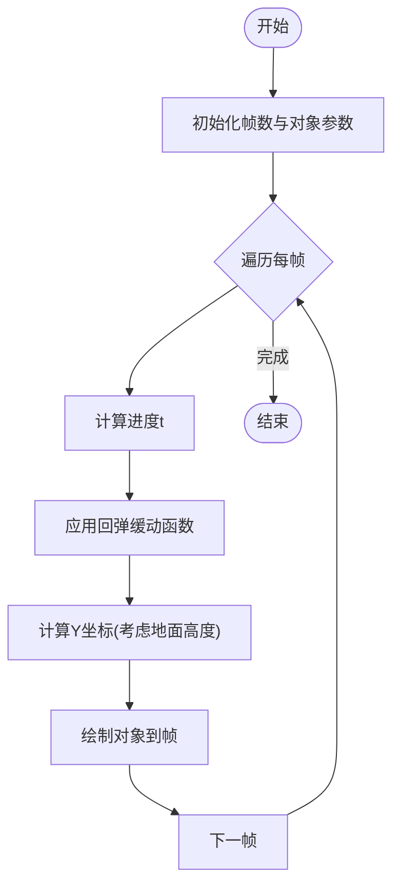

**图表来源**
- [bounce.py](file://mini_agent/skills/slack-gif-creator/templates/bounce.py)
- [easing.py](file://mini_agent/skills/slack-gif-creator/core/easing.py)

**章节来源**
- [bounce.py](file://mini_agent/skills/slack-gif-creator/templates/bounce.py)

### 爆炸（explode）
- 特点：将对象分解为粒子或几何碎片，向外飞散并渐隐；支持“implode”逆向重组
- 参数要点：碎片数量、初始速度、引力、类型（burst/shatter/dissolve/implode）、中心位置
- 适用场景：强调破坏、冲击、消失、重生
- 实现思路：预设碎片属性（速度、旋转、颜色），按时间更新位置与透明度；可结合粒子系统

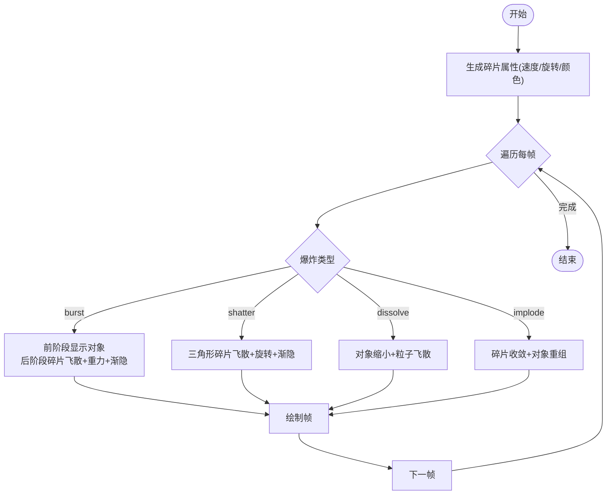

**图表来源**
- [explode.py](file://mini_agent/skills/slack-gif-creator/templates/explode.py)

**章节来源**
- [explode.py](file://mini_agent/skills/slack-gif-creator/templates/explode.py)

### 淡入淡出（fade）
- 特点：平滑透明度变化，支持交叉淡化与闪烁
- 参数要点：淡入/淡出/往返/闪烁、缓动曲线、对象类型（emoji/文本/图像）
- 适用场景：页面切换、提示出现/消失、情绪转折
- 实现思路：为对象创建透明图层，按透明度合成背景帧

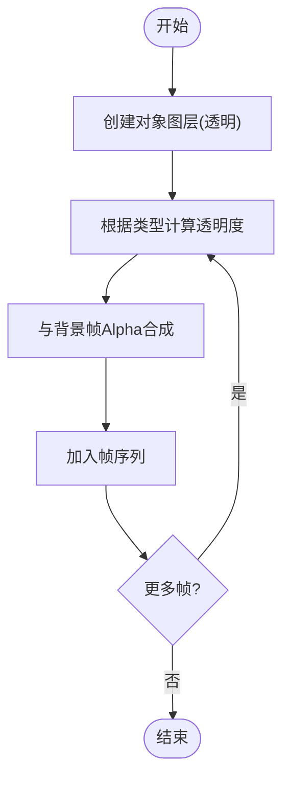

**图表来源**
- [fade.py](file://mini_agent/skills/slack-gif-creator/templates/fade.py)

**章节来源**
- [fade.py](file://mini_agent/skills/slack-gif-creator/templates/fade.py)

### 脉动（pulse）
- 特点：周期性缩放，支持平滑、心跳、收缩、爆发等形态
- 参数要点：缩放范围、脉冲次数、缓动类型、对象类型
- 适用场景：强调重要元素、心跳节拍、呼吸节奏
- 实现思路：正弦波或分段缓动控制缩放幅度，保持体积守恒可配合反向缩放

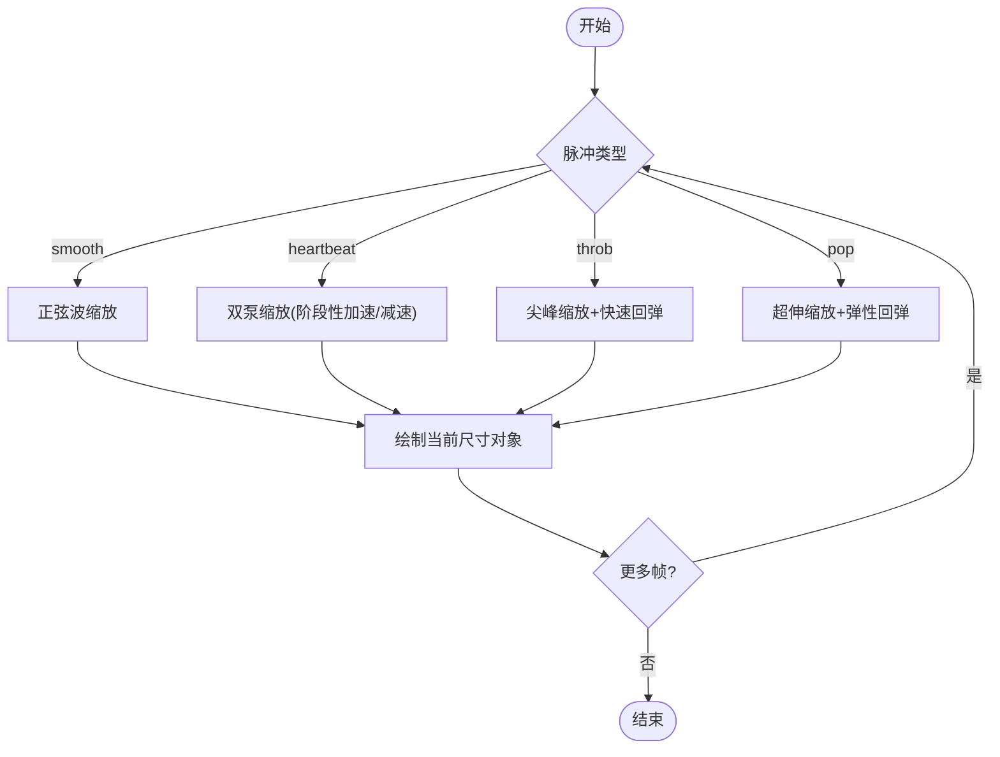

**图表来源**
- [pulse.py](file://mini_agent/skills/slack-gif-creator/templates/pulse.py)

**章节来源**
- [pulse.py](file://mini_agent/skills/slack-gif-creator/templates/pulse.py)

### 旋转（spin）
- 特点：连续旋转、摆锤、抖动旋转；可生成加载指示器
- 参数要点：旋转方向、圈数、缓动、中心点、对象类型
- 适用场景：加载动画、焦点引导、装饰性旋转
- 实现思路：为对象创建透明画布，旋转后粘贴到背景帧

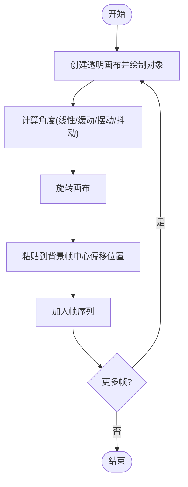

**图表来源**
- [spin.py](file://mini_agent/skills/slack-gif-creator/templates/spin.py)

**章节来源**
- [spin.py](file://mini_agent/skills/slack-gif-creator/templates/spin.py)

### 万花筒（kaleidoscope）
- 特点：镜像/旋转对称效果；提供简单镜像与完整万花筒两种实现
- 参数要点：分割段数、中心点、旋转速度
- 适用场景：装饰性图案、抽象视觉、艺术化背景
- 实现思路：按像素角度与距离映射源位置，奇偶段镜像以形成对称

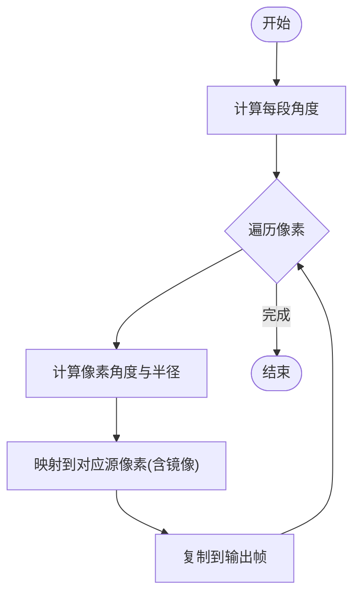

**图表来源**
- [kaleidoscope.py](file://mini_agent/skills/slack-gif-creator/templates/kaleidoscope.py)

**章节来源**
- [kaleidoscope.py](file://mini_agent/skills/slack-gif-creator/templates/kaleidoscope.py)

### 移动（move）
- 特点：直线、抛物线、圆周、波浪、贝塞尔等多种路径
- 参数要点：起点/终点、路径类型、缓动、附加参数（弧高、圆心/半径/角度范围、波幅/频率、控制点）
- 适用场景：物体飞行、轨迹引导、复杂运动
- 实现思路：按类型计算当前位置，绘制对象于该坐标

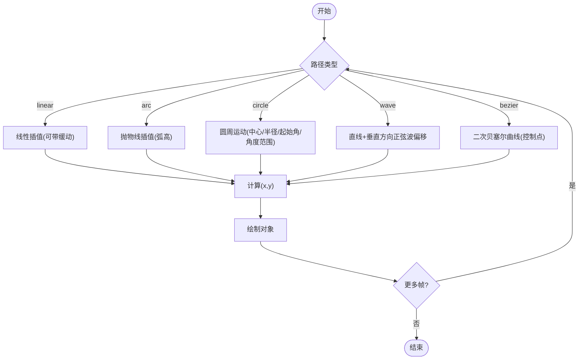

**图表来源**
- [move.py](file://mini_agent/skills/slack-gif-creator/templates/move.py)

**章节来源**
- [move.py](file://mini_agent/skills/slack-gif-creator/templates/move.py)

### 缩放（zoom）
- 特点：大幅缩放、爆炸缩放、心灵震颤（缩放+抖动）
- 参数要点：缩放范围、缓动、是否添加运动模糊、中心点
- 适用场景：强调放大细节、冲击感、戏剧性
- 实现思路：创建超大画布，绘制放大对象后裁剪至帧尺寸；可叠加旋转与模糊

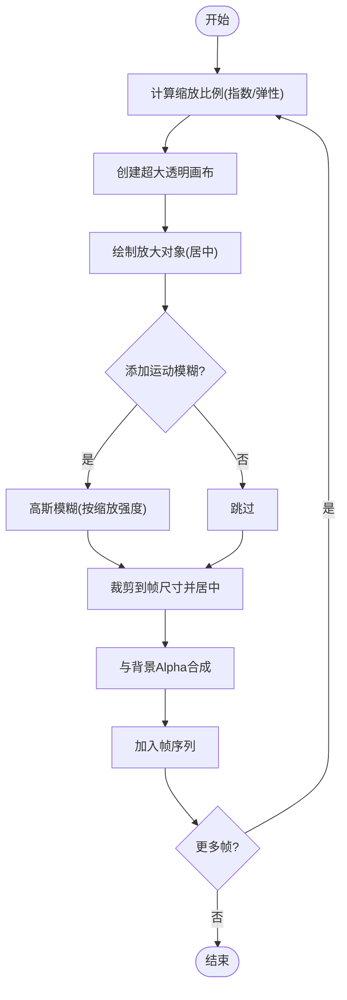

**图表来源**
- [zoom.py](file://mini_agent/skills/slack-gif-creator/templates/zoom.py)

**章节来源**
- [zoom.py](file://mini_agent/skills/slack-gif-creator/templates/zoom.py)

### 扭动（wiggle）
- 特点：果冻抖动、波浪、弹跳、摇摆、尾部摆动等有机运动
- 参数要点：强度、循环次数、类型、非均匀缩放与旋转
- 适用场景：拟物动画、活泼角色、自然摆动
- 实现思路：多频正余弦叠加产生复杂形变；必要时使用透明画布进行缩放/旋转再粘贴

**章节来源**
- [wiggle.py](file://mini_agent/skills/slack-gif-creator/templates/wiggle.py)

### 摇摆（shake）
- 特点：水平/垂直/双向抖动，强度随时间衰减
- 参数要点：强度、方向、频率、帧数
- 适用场景：惊吓、震动、强调冲击
- 实现思路：正余弦相位差产生交错抖动，末尾衰减提升真实感

**章节来源**
- [shake.py](file://mini_agent/skills/slack-gif-creator/templates/shake.py)

## 依赖关系分析
- 模板依赖核心模块
  - 缓动函数：所有模板均依赖 easing.interpolate 与轨迹函数
  - GIF 构建器：作为统一帧收集与输出入口
  - 颜色调色板：提供配色与 Emoji 安全色表
  - 排版系统：文本渲染与描边/阴影/辉光
  - 验证器：输出后进行尺寸/帧数/颜色数校验
- 模块耦合与内聚
  - 模板内部逻辑相对独立，仅依赖核心模块接口，便于扩展新模板
  - 核心模块职责清晰，构建器专注帧处理，验证器专注约束检查

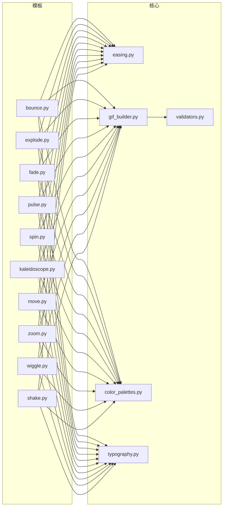

**图表来源**
- [bounce.py](file://mini_agent/skills/slack-gif-creator/templates/bounce.py)
- [explode.py](file://mini_agent/skills/slack-gif-creator/templates/explode.py)
- [fade.py](file://mini_agent/skills/slack-gif-creator/templates/fade.py)
- [pulse.py](file://mini_agent/skills/slack-gif-creator/templates/pulse.py)
- [spin.py](file://mini_agent/skills/slack-gif-creator/templates/spin.py)
- [kaleidoscope.py](file://mini_agent/skills/slack-gif-creator/templates/kaleidoscope.py)
- [move.py](file://mini_agent/skills/slack-gif-creator/templates/move.py)
- [zoom.py](file://mini_agent/skills/slack-gif-creator/templates/zoom.py)
- [wiggle.py](file://mini_agent/skills/slack-gif-creator/templates/wiggle.py)
- [shake.py](file://mini_agent/skills/slack-gif-creator/templates/shake.py)
- [easing.py](file://mini_agent/skills/slack-gif-creator/core/easing.py)
- [gif_builder.py](file://mini_agent/skills/slack-gif-creator/core/gif_builder.py)
- [color_palettes.py](file://mini_agent/skills/slack-gif-creator/core/color_palettes.py)
- [typography.py](file://mini_agent/skills/slack-gif-creator/core/typography.py)
- [validators.py](file://mini_agent/skills/slack-gif-creator/core/validators.py)

## 性能考量
- 文件大小控制
  - 降低帧数/缩短时长、减少颜色数、降低分辨率、启用重复帧去重
  - Emoji 模式下自动限制尺寸至 128x128、颜色数不超过 48、帧数不超过 12
- 压缩与质量
  - 使用全局调色板量化，显著降低文件体积
  - 去除相邻重复帧，避免冗余
- 渲染效率
  - 复杂旋转/缩放优先使用透明画布一次性变换再粘贴
  - 文本描边/辉光采用多层绘制，尽量减少重复计算
- 动画节奏
  - 合理设置 FPS（消息 GIF 15-20，Emoji GIF 10-12），避免过高导致体积膨胀
  - 使用缓动函数替代线性插值，提升自然度与感知流畅度

[本节为通用指导，无需特定文件引用]

## 故障排除指南
- 文件过大
  - 使用验证器检查尺寸与颜色数，按建议减少帧数/颜色/尺寸
  - 开启 Emoji 模式自动优化
- 尺寸不合规
  - Emoji 推荐 128x128，消息 GIF 建议方形或近似方形
- 颜色过多
  - 使用内置调色板或限制颜色数至 64/128
- 文本可读性差
  - 为文本添加描边或使用文字框；避免纯白背景上浅色文本
- 动画卡顿
  - 降低 FPS 或帧数；简化路径与特效；减少粒子数量

**章节来源**
- [validators.py](file://mini_agent/skills/slack-gif-creator/core/validators.py)
- [gif_builder.py](file://mini_agent/skills/slack-gif-creator/core/gif_builder.py)
- [typography.py](file://mini_agent/skills/slack-gif-creator/core/typography.py)

## 结论
该 GIF 创建器技能以“可组合动画原语 + 核心优化管线 + 约束验证”为核心设计，既保证了创作自由度，又确保输出符合 Slack 的技术限制。通过合理选择动画模板、参数化配置与颜色/字体策略，可在不同场景下实现动感、冲击、平滑过渡与艺术化效果。建议在创作初期明确节奏与主题，中期利用模板与缓动函数构建关键动作，后期通过验证器与优化策略控制体积与质量。

[本节为总结性内容，无需特定文件引用]

## 附录

### 动画模板与适用场景速览
- 弹跳（bounce）：强调动感、落地冲击
- 爆炸（explode）：强调破坏/消失/重生
- 淡入淡出（fade）：平滑过渡、提示出现/消失
- 翻转（flip）：双态切换、表情互换
- 万花筒（kaleidoscope）：装饰性图案、抽象视觉
- 变形（morph）：跨对象形态转换
- 移动（move）：路径运动、轨迹引导
- 脉动（pulse）：强调重要元素、心跳节拍
- 摇摆（shake）：惊吓/震动/强调冲击
- 旋转（spin）：加载/焦点引导/装饰
- 扭动（wiggle）：拟物/活泼/自然摆动
- 缩放（zoom）：放大细节/冲击/戏剧性

**章节来源**
- [SKILL.md](file://mini_agent/skills/slack-gif-creator/SKILL.md)