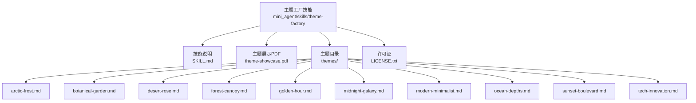
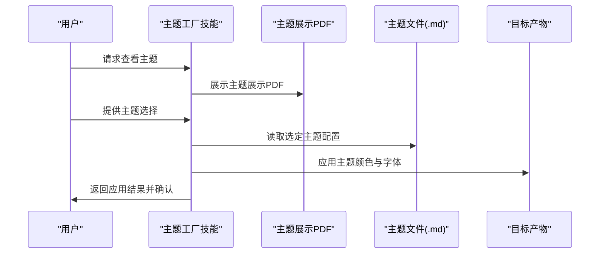
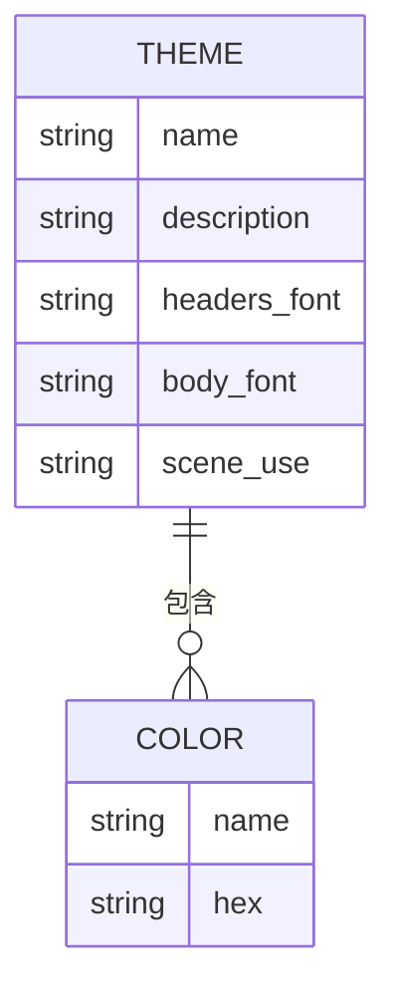
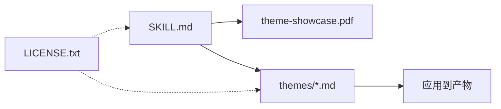

# 主题工厂技能

<cite>
**本文引用的文件**
- [SKILL.md](file://mini_agent/skills/theme-factory/SKILL.md)
- [arctic-frost.md](file://mini_agent/skills/theme-factory/themes/arctic-frost.md)
- [botanical-garden.md](file://mini_agent/skills/theme-factory/themes/botanical-garden.md)
- [desert-rose.md](file://mini_agent/skills/theme-factory/themes/desert-rose.md)
- [forest-canopy.md](file://mini_agent/skills/theme-factory/themes/forest-canopy.md)
- [golden-hour.md](file://mini_agent/skills/theme-factory/themes/golden-hour.md)
- [midnight-galaxy.md](file://mini_agent/skills/theme-factory/themes/midnight-galaxy.md)
- [modern-minimalist.md](file://mini_agent/skills/theme-factory/themes/modern-minimalist.md)
- [ocean-depths.md](file://mini_agent/skills/theme-factory/themes/ocean-depths.md)
- [sunset-boulevard.md](file://mini_agent/skills/theme-factory/themes/sunset-boulevard.md)
- [tech-innovation.md](file://mini_agent/skills/theme-factory/themes/tech-innovation.md)
- [theme-showcase.pdf](file://mini_agent/skills/theme-factory/theme-showcase.pdf)
- [LICENSE.txt](file://mini_agent/skills/theme-factory/LICENSE.txt)
</cite>

## 目录
1. [简介](#简介)
2. [项目结构](#项目结构)
3. [核心组件](#核心组件)
4. [架构总览](#架构总览)
5. [详细组件分析](#详细组件分析)
6. [依赖关系分析](#依赖关系分析)
7. [性能考虑](#性能考虑)
8. [故障排除指南](#故障排除指南)
9. [结论](#结论)
10. [附录](#附录)

## 简介
主题工厂技能是一个面向演示文稿与文档等“产物”的样式化工具包，提供专业级字体与色彩主题集合，并支持将主题应用到任意可编辑的产物中。该技能包含10个预设主题，覆盖从自然有机到科技前卫的不同风格；同时支持基于用户输入生成自定义主题，帮助在不同场景下实现一致、专业的视觉呈现。

## 项目结构
主题工厂技能位于技能目录下的独立子模块中，核心由以下部分组成：
- 技能说明文档：定义用途、使用流程与可用主题清单
- 主题展示PDF：用于直观浏览所有主题
- 预设主题文件：每个主题以Markdown形式描述配色、字体与适用场景
- 许可证文件：Apache 2.0许可条款

图表来源
- [SKILL.md:1-60](file://mini_agent/skills/theme-factory/SKILL.md#L1-L60)
- [arctic-frost.md:1-20](file://mini_agent/skills/theme-factory/themes/arctic-frost.md#L1-L20)
- [botanical-garden.md:1-20](file://mini_agent/skills/theme-factory/themes/botanical-garden.md#L1-L20)
- [desert-rose.md:1-20](file://mini_agent/skills/theme-factory/themes/desert-rose.md#L1-L20)
- [forest-canopy.md:1-20](file://mini_agent/skills/theme-factory/themes/forest-canopy.md#L1-L20)
- [golden-hour.md:1-20](file://mini_agent/skills/theme-factory/themes/golden-hour.md#L1-L20)
- [midnight-galaxy.md:1-20](file://mini_agent/skills/theme-factory/themes/midnight-galaxy.md#L1-L20)
- [modern-minimalist.md:1-20](file://mini_agent/skills/theme-factory/themes/modern-minimalist.md#L1-L20)
- [ocean-depths.md:1-20](file://mini_agent/skills/theme-factory/themes/ocean-depths.md#L1-L20)
- [sunset-boulevard.md:1-20](file://mini_agent/skills/theme-factory/themes/sunset-boulevard.md#L1-L20)
- [tech-innovation.md:1-20](file://mini_agent/skills/theme-factory/themes/tech-innovation.md#L1-L20)

章节来源
- [SKILL.md:1-60](file://mini_agent/skills/theme-factory/SKILL.md#L1-L60)

## 核心组件
- 技能说明文档：明确主题工厂的目的、使用步骤、可用主题列表与自定义主题创建流程
- 主题展示PDF：提供所有主题的可视化概览，便于用户快速选择
- 预设主题文件：每个主题包含颜色调色板、字体搭配与适用场景三部分，确保风格一致性与可复用性
- 许可证：采用Apache 2.0许可，允许自由使用、修改与分发

章节来源
- [SKILL.md:1-60](file://mini_agent/skills/theme-factory/SKILL.md#L1-L60)
- [LICENSE.txt:1-202](file://mini_agent/skills/theme-factory/LICENSE.txt#L1-L202)

## 架构总览
主题工厂技能的运行流程围绕“展示—选择—应用—校验”展开，整体交互如下：

图表来源
- [SKILL.md:19-60](file://mini_agent/skills/theme-factory/SKILL.md#L19-L60)

## 详细组件分析

### 预设主题概览与风格特征
以下为10个预设主题的名称、风格定位与典型适用场景（按技能说明文档中的清单整理）：
- 海洋深度：专业且宁静的海洋主题，适合企业/金融类内容
- 夕阳大道：温暖而充满活力的日落主题，适合创意/营销类内容
- 森林树冠：自然且稳重的地色系主题，适合环境/可持续发展类内容
- 现代极简：干净且现代的灰阶主题，适合科技/数据可视化类内容
- 黄金时刻：温暖且成熟的秋色主题，适合餐饮/生活方式类内容
- 北极之霜：冷静且清新的冬日主题，适合医疗/科技/清洁技术类内容
- 沙漠玫瑰：柔和且优雅的粉尘色调主题，适合时尚/美容/室内设计类内容
- 科技创新：高对比度的科技感主题，适合初创/人工智能/数字化转型类内容
- 植物花园：新鲜且有机的花园主题，适合园艺/天然产品类内容
- 银河午夜：深邃且神秘的宇宙主题，适合娱乐/游戏/高端品牌类内容

章节来源
- [SKILL.md:28-42](file://mini_agent/skills/theme-factory/SKILL.md#L28-L42)

### 主题设计原则与应用流程
- 设计原则
  - 色彩体系：每个主题提供主色、强调色、背景与文本色四类色值，确保对比度与可读性
  - 字体搭配：提供标题与正文的字体对，保持视觉层级清晰
  - 场景适配：明确主题的最佳使用场景，提升表达效果与受众契合度
- 应用流程
  - 展示主题：通过主题展示PDF让用户直观了解各主题风格
  - 明确选择：获取用户对主题的明确确认
  - 应用主题：读取对应主题文件，统一应用颜色与字体
  - 校验一致性：检查对比度、一致性与跨页面统一性

章节来源
- [SKILL.md:12-60](file://mini_agent/skills/theme-factory/SKILL.md#L12-L60)

### 自定义主题创建流程
当现有主题无法满足需求时，可基于用户提供描述生成新主题：
- 输入收集：获取主题风格关键词（如“冷色调”“自然”“科技感”等）
- 主题生成：依据关键词选择合适的色彩与字体组合，形成新的主题文件
- 审核与验证：将新主题展示给用户确认，确保风格与意图一致
- 应用执行：按照标准流程将新主题应用到目标产物

章节来源
- [SKILL.md:58-60](file://mini_agent/skills/theme-factory/SKILL.md#L58-L60)

### 主题文件结构与字段说明
每个预设主题文件均包含以下结构：
- 主题名称：用于标识与展示
- 颜色调色板：包含主色、强调色、背景与文本色的命名与十六进制值
- 字体搭配：分别给出标题与正文使用的字体名称
- 最佳使用场景：列出适合的主题应用场景

章节来源
- [arctic-frost.md:1-20](file://mini_agent/skills/theme-factory/themes/arctic-frost.md#L1-L20)
- [botanical-garden.md:1-20](file://mini_agent/skills/theme-factory/themes/botanical-garden.md#L1-L20)
- [desert-rose.md:1-20](file://mini_agent/skills/theme-factory/themes/desert-rose.md#L1-L20)
- [forest-canopy.md:1-20](file://mini_agent/skills/theme-factory/themes/forest-canopy.md#L1-L20)
- [golden-hour.md:1-20](file://mini_agent/skills/theme-factory/themes/golden-hour.md#L1-L20)
- [midnight-galaxy.md:1-20](file://mini_agent/skills/theme-factory/themes/midnight-galaxy.md#L1-L20)
- [modern-minimalist.md:1-20](file://mini_agent/skills/theme-factory/themes/modern-minimalist.md#L1-L20)
- [ocean-depths.md:1-20](file://mini_agent/skills/theme-factory/themes/ocean-depths.md#L1-L20)
- [sunset-boulevard.md:1-20](file://mini_agent/skills/theme-factory/themes/sunset-boulevard.md#L1-L20)
- [tech-innovation.md:1-20](file://mini_agent/skills/theme-factory/themes/tech-innovation.md#L1-L20)

### 主题文件字段映射图

图表来源
- [arctic-frost.md:1-20](file://mini_agent/skills/theme-factory/themes/arctic-frost.md#L1-L20)
- [botanical-garden.md:1-20](file://mini_agent/skills/theme-factory/themes/botanical-garden.md#L1-L20)
- [desert-rose.md:1-20](file://mini_agent/skills/theme-factory/themes/desert-rose.md#L1-L20)
- [forest-canopy.md:1-20](file://mini_agent/skills/theme-factory/themes/forest-canopy.md#L1-L20)
- [golden-hour.md:1-20](file://mini_agent/skills/theme-factory/themes/golden-hour.md#L1-L20)
- [midnight-galaxy.md:1-20](file://mini_agent/skills/theme-factory/themes/midnight-galaxy.md#L1-L20)
- [modern-minimalist.md:1-20](file://mini_agent/skills/theme-factory/themes/modern-minimalist.md#L1-L20)
- [ocean-depths.md:1-20](file://mini_agent/skills/theme-factory/themes/ocean-depths.md#L1-L20)
- [sunset-boulevard.md:1-20](file://mini_agent/skills/theme-factory/themes/sunset-boulevard.md#L1-L20)
- [tech-innovation.md:1-20](file://mini_agent/skills/theme-factory/themes/tech-innovation.md#L1-L20)

## 依赖关系分析
- 组件耦合
  - 技能说明文档与主题展示PDF共同构成用户选择入口，二者强相关
  - 主题文件作为数据源被技能读取并应用到目标产物，存在直接依赖
- 外部依赖
  - 主题展示PDF为外部资源，技能通过展示其内容辅助用户决策
- 许可协议
  - 所有主题文件与技能代码遵循Apache 2.0许可，允许二次开发与商用集成

图表来源
- [SKILL.md:1-60](file://mini_agent/skills/theme-factory/SKILL.md#L1-L60)
- [LICENSE.txt:1-202](file://mini_agent/skills/theme-factory/LICENSE.txt#L1-L202)

章节来源
- [SKILL.md:1-60](file://mini_agent/skills/theme-factory/SKILL.md#L1-L60)
- [LICENSE.txt:1-202](file://mini_agent/skills/theme-factory/LICENSE.txt#L1-L202)

## 性能考虑
- 主题加载：主题文件为纯文本，读取开销极低，适用于频繁切换场景
- 应用效率：颜色与字体的应用为静态替换，不涉及复杂计算，性能稳定
- 可扩展性：新增主题仅需添加新的主题文件，无需修改核心逻辑

## 故障排除指南
- 无法找到主题展示PDF
  - 确认主题展示PDF存在于技能目录中，若缺失请重新安装或从仓库获取
- 主题应用后对比度不足
  - 检查主题文件中的文本色与背景色是否匹配，必要时调整或更换主题
- 自定义主题未生效
  - 确保自定义主题文件格式正确，包含颜色与字体字段，并已通过审核流程

章节来源
- [SKILL.md:19-60](file://mini_agent/skills/theme-factory/SKILL.md#L19-L60)

## 结论
主题工厂技能通过标准化的主题文件与清晰的应用流程，为演示文稿与文档提供了即插即用的专业样式解决方案。其10个预设主题覆盖广泛场景，自定义主题能力进一步增强了灵活性。结合主题展示PDF与严格的字段规范，用户可以高效地完成从选择到应用再到校验的全流程操作。

## 附录

### 主题选择指南
- 企业/金融：海洋深度、现代极简
- 创意/营销：夕阳大道、植物花园
- 环境/可持续：森林树冠
- 餐饮/生活方式：黄金时刻
- 医疗/科技/清洁技术：北极之霜
- 时尚/美容/室内设计：沙漠玫瑰
- 科技/人工智能/数字化转型：科技创新
- 娱乐/游戏/高端品牌：银河午夜

章节来源
- [SKILL.md:28-42](file://mini_agent/skills/theme-factory/SKILL.md#L28-L42)