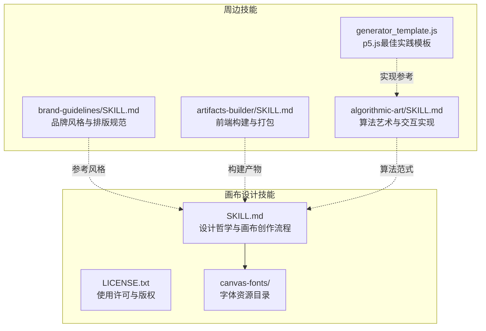
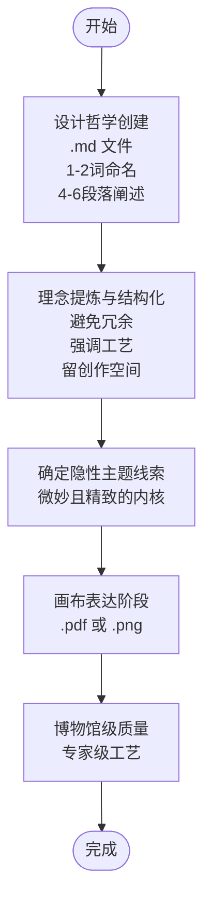
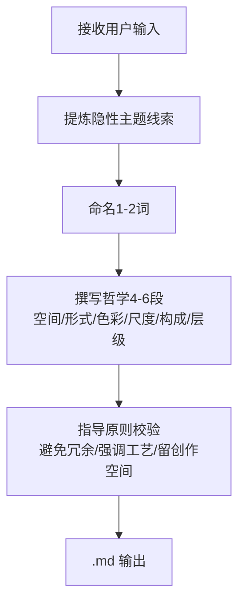
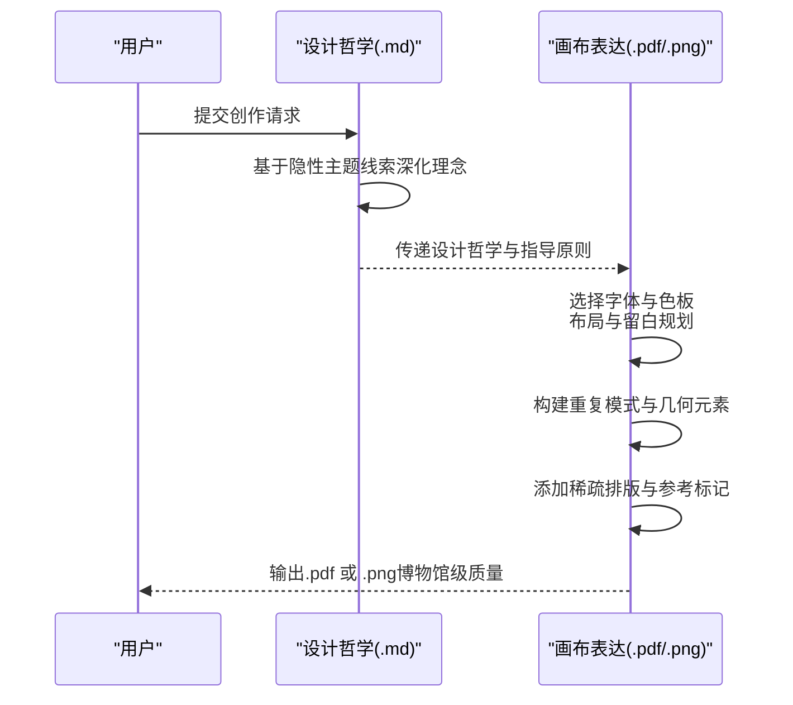
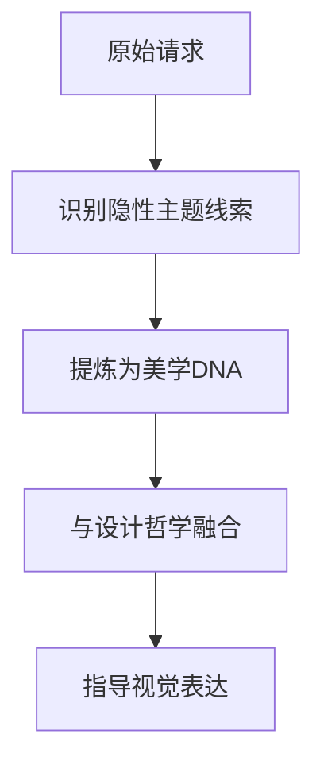
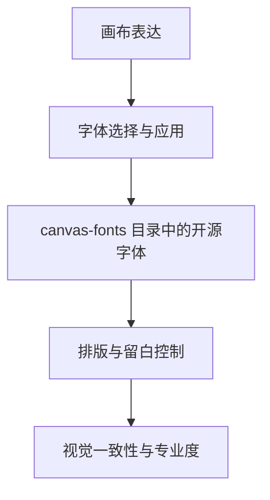
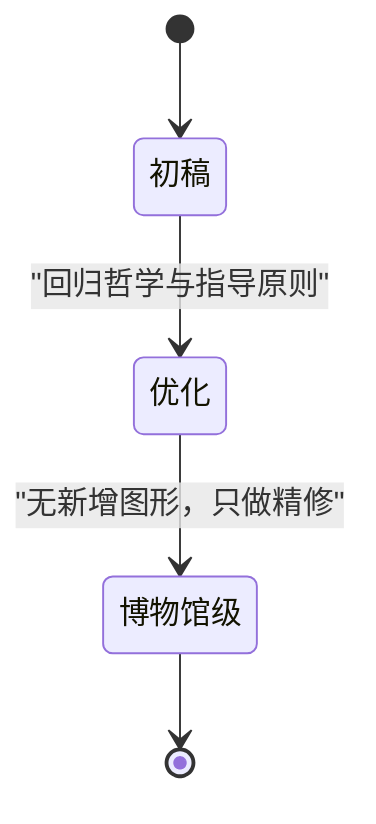
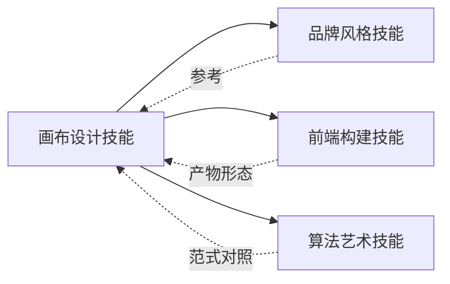

# 画布设计技能

<cite>
**本文引用的文件**
- [SKILL.md](file://mini_agent/skills/canvas-design/SKILL.md)
- [LICENSE.txt](file://mini_agent/skills/canvas-design/LICENSE.txt)
- [canvas-fonts 目录](file://mini_agent/skills/canvas-design/canvas-fonts)
- [brand-guidelines/SKILL.md](file://mini_agent/skills/brand-guidelines/SKILL.md)
- [artifacts-builder/SKILL.md](file://mini_agent/skills/artifacts-builder/SKILL.md)
- [algorithmic-art/SKILL.md](file://mini_agent/skills/algorithmic-art/SKILL.md)
- [algorithmic-art/templates/generator_template.js](file://mini_agent/skills/algorithmic-art/templates/generator_template.js)
</cite>

## 目录
1. [简介](#简介)
2. [项目结构](#项目结构)
3. [核心组件](#核心组件)
4. [架构总览](#架构总览)
5. [详细组件分析](#详细组件分析)
6. [依赖关系分析](#依赖关系分析)
7. [性能考量](#性能考量)
8. [故障排查指南](#故障排查指南)
9. [结论](#结论)
10. [附录](#附录)

## 简介
本技能文档围绕“画布设计技能”展开，系统性阐述如何通过“设计哲学创建（Design Philosophy Creation）”与“在画布上进行视觉表达（Express by creating it on a canvas）”两大阶段，完成从理念到作品的完整创作流程。该技能强调：
- 设计哲学的结构要求：1-2个词命名、4-6段落阐述；
- 关键指导原则：避免冗余、强调工艺、留创作空间；
- 必备要素：视觉哲学、最少文字、空间表达；
- 输出格式：.md（设计哲学）、.pdf/.png（视觉作品）；
- 最终作品质量标准：博物馆级质量、专家级工艺。

此外，文档还提供了“混凝土诗歌”“色彩语言”“模拟沉思”等具体创作示例，并对字体资源、品牌风格、交互式生成艺术等周边能力进行关联说明，帮助读者建立从理念到实现的全链路理解。

## 项目结构
画布设计技能位于技能目录中，包含技能说明文件与字体资源目录。其核心文件与组织方式如下：
- 技能说明：SKILL.md，定义两阶段创作流程、结构要求、指导原则与输出规范；
- 许可证：LICENSE.txt，明确使用条款与版权信息；
- 字体资源：canvas-fonts 目录，提供多种开源字体以支持高质量排版；
- 周边技能：brand-guidelines、artifacts-builder、algorithmic-art，分别提供品牌风格、前端构建与算法艺术的参考与对比。

图表来源
- [SKILL.md:1-130](file://mini_agent/skills/canvas-design/SKILL.md#L1-L130)
- [LICENSE.txt:1-202](file://mini_agent/skills/canvas-design/LICENSE.txt#L1-L202)
- [canvas-fonts 目录](file://mini_agent/skills/canvas-design/canvas-fonts)
- [brand-guidelines/SKILL.md:1-74](file://mini_agent/skills/brand-guidelines/SKILL.md#L1-L74)
- [artifacts-builder/SKILL.md:1-74](file://mini_agent/skills/artifacts-builder/SKILL.md#L1-L74)
- [algorithmic-art/SKILL.md:1-405](file://mini_agent/skills/algorithmic-art/SKILL.md#L1-L405)
- [algorithmic-art/templates/generator_template.js:1-223](file://mini_agent/skills/algorithmic-art/templates/generator_template.js#L1-L223)

章节来源
- [SKILL.md:1-130](file://mini_agent/skills/canvas-design/SKILL.md#L1-L130)
- [LICENSE.txt:1-202](file://mini_agent/skills/canvas-design/LICENSE.txt#L1-L202)

## 核心组件
- 设计哲学创建阶段（.md 输出）
  - 结构要求：1-2个词命名；4-6段落阐述；
  - 内容维度：形式、空间、色彩、构成；图像、图形、形状、图案；最少文字作为视觉点缀；
  - 指导原则：避免冗余、强调工艺、留创作空间；
  - 能力边界：强调视觉表达、空间传达、艺术解读、最少文字；
  - 示例参考：混凝土诗歌、色彩语言、模拟沉思等。
- 画布表达阶段（.pdf/.png 输出）
  - 质量标准：博物馆/杂志级质量；
  - 视觉策略：重复模式、完美几何、稀疏临床排版、系统化参考标记；
  - 文字策略：极简、视觉优先、不重叠、不越界、留白清晰；
  - 工艺标准：专家级手工质感、无瑕疵、完美细节、可展示于博物馆。

章节来源
- [SKILL.md:7-130](file://mini_agent/skills/canvas-design/SKILL.md#L7-L130)

## 架构总览
画布设计技能采用“理念先行、视觉落地”的两阶段架构。第一阶段产出设计哲学（.md），第二阶段基于哲学在画布上进行视觉表达（.pdf/.png）。两者共同确保作品具备“理念深度+视觉精度”的双重标准。

图表来源
- [SKILL.md:9-130](file://mini_agent/skills/canvas-design/SKILL.md#L9-L130)

## 详细组件分析

### 组件A：设计哲学创建（.md）
- 目标：产出一个可被后续版本解读为视觉作品的设计哲学文本；
- 结构与内容：
  - 命名：1-2个词，如“混凝土诗歌”“色彩语言”“模拟沉思”；
  - 阐述：4-6段，覆盖空间与形式、色彩与材质、尺度与节奏、构成与平衡、视觉层级；
  - 指导原则：避免重复、强调工艺、留创作空间；
  - 输出：.md 文件，用于指导后续画布表达。
- 示例参考：
  - “混凝土诗歌”：通过巨大色块、雕塑感排版、粗犷空间划分传达思想；
  - “色彩语言”：以色域编码信息，极简标签承载语义；
  - “模拟沉思”：纸纹、墨晕、留白营造静谧氛围，摄影与插画主导，短句点缀。

图表来源
- [SKILL.md:33-86](file://mini_agent/skills/canvas-design/SKILL.md#L33-L86)
- [SKILL.md:53-75](file://mini_agent/skills/canvas-design/SKILL.md#L53-L75)

章节来源
- [SKILL.md:33-86](file://mini_agent/skills/canvas-design/SKILL.md#L33-L86)
- [SKILL.md:53-75](file://mini_agent/skills/canvas-design/SKILL.md#L53-L75)

### 组件B：画布表达（.pdf/.png）
- 目标：将设计哲学转化为高精度视觉作品；
- 视觉策略：
  - 使用重复模式与完美几何；
  - 添加稀疏、临床的排版与系统化参考标记；
  - 将不可见的主题以可感知的形式呈现；
  - 限定色板，保持意图明确与协调一致；
  - 文字作为情境元素，极简、视觉优先、不重叠、不越界。
- 工艺标准：
  - 博物馆级质量、专家级工艺；
  - 无重叠、无错位、无瑕疵；
  - 每个细节都体现顶级匠作水准；
  - 可直接展示于博物馆或高端出版物。

图表来源
- [SKILL.md:100-117](file://mini_agent/skills/canvas-design/SKILL.md#L100-L117)
- [SKILL.md:108](file://mini_agent/skills/canvas-design/SKILL.md#L108)

章节来源
- [SKILL.md:100-117](file://mini_agent/skills/canvas-design/SKILL.md#L100-L117)
- [SKILL.md:108](file://mini_agent/skills/canvas-design/SKILL.md#L108)

### 组件C：隐性主题线索的提取（关键步骤）
- 目标：在用户请求中识别“微妙、精致且内嵌于作品本身”的概念线索；
- 方法：
  - 不求直白，但求精深；
  - 使熟悉该主题的人能意会，不熟悉的人也能感受到高级抽象；
  - 设计哲学提供美学语言，隐性线索提供灵魂——将二者融合于形、色、构之中。
- 重要性：这一线索决定作品的深度与辨识度，需“润物细无声”。

图表来源
- [SKILL.md:89-98](file://mini_agent/skills/canvas-design/SKILL.md#L89-L98)

章节来源
- [SKILL.md:89-98](file://mini_agent/skills/canvas-design/SKILL.md#L89-L98)

### 组件D：字体与排版资源（canvas-fonts）
- 用途：为画布表达阶段提供高质量字体资源，确保排版与视觉语言一致；
- 要点：
  - 文字必须是视觉元素的一部分；
  - 不重叠、不越界、留白清晰；
  - 在需要时使用不同字体以增强层次；
  - 保持排版的“非谈判性专业度”。

图表来源
- [SKILL.md:108](file://mini_agent/skills/canvas-design/SKILL.md#L108)
- [canvas-fonts 目录](file://mini_agent/skills/canvas-design/canvas-fonts)

章节来源
- [SKILL.md:108](file://mini_agent/skills/canvas-design/SKILL.md#L108)
- [canvas-fonts 目录](file://mini_agent/skills/canvas-design/canvas-fonts)

### 组件E：质量与工艺标准（博物馆级/专家级）
- 要求：
  - 作品应如同经过无数小时精心打磨，由顶级专家倾注心血；
  - 每个细节都体现极致工艺；
  - 可直接进入博物馆或高端出版物展示。
- 行动建议：
  - 第二次审视时，避免增加新图形，而应优化已有元素的统一性与精致度；
  - 回归哲学，思考“如何让已有的东西更像一件艺术品”。

图表来源
- [SKILL.md:120-127](file://mini_agent/skills/canvas-design/SKILL.md#L120-L127)

章节来源
- [SKILL.md:120-127](file://mini_agent/skills/canvas-design/SKILL.md#L120-L127)

### 组件F：创作示例解析
- 混凝土诗歌
  - 视觉特征：巨大色块、雕塑感排版、粗犷空间划分；
  - 表达方式：通过体量与空间张力传达思想，文字作为罕见而有力的视觉手势；
  - 工艺强调：每个元素都以大师级精度放置。
- 色彩语言
  - 视觉特征：几何精确性，色域承载意义；
  - 表达方式：极简标签让色域自述，信息以空间与色彩编码；
  - 工艺强调：经反复校准的色彩体系。
- 模拟沉思
  - 视觉特征：纸纹、墨晕、大量留白；
  - 表达方式：摄影与插画主导，短句轻声点缀，构图如冥想般平衡；
  - 工艺强调：每一幅都如同冥想般精心安排。

章节来源
- [SKILL.md:53-75](file://mini_agent/skills/canvas-design/SKILL.md#L53-L75)

## 依赖关系分析
- 与品牌风格技能的关系
  - 品牌风格技能提供颜色与字体的系统化规范，可作为画布表达的参考基线，但画布设计技能更强调“理念驱动的视觉对象”，而非“品牌装饰”。
- 与前端构建技能的关系
  - artifacts-builder 提供复杂前端产物的打包思路，而画布设计技能聚焦静态视觉对象（.pdf/.png），两者在“产物形态”上互补。
- 与算法艺术技能的关系
  - algorithmic-art 展示了“算法哲学—交互实现”的范式，而画布设计技能则强调“设计哲学—静态视觉表达”的范式，二者在“创作范式”上形成对照。

图表来源
- [brand-guidelines/SKILL.md:1-74](file://mini_agent/skills/brand-guidelines/SKILL.md#L1-L74)
- [artifacts-builder/SKILL.md:1-74](file://mini_agent/skills/artifacts-builder/SKILL.md#L1-L74)
- [algorithmic-art/SKILL.md:1-405](file://mini_agent/skills/algorithmic-art/SKILL.md#L1-L405)

章节来源
- [brand-guidelines/SKILL.md:1-74](file://mini_agent/skills/brand-guidelines/SKILL.md#L1-L74)
- [artifacts-builder/SKILL.md:1-74](file://mini_agent/skills/artifacts-builder/SKILL.md#L1-L74)
- [algorithmic-art/SKILL.md:1-405](file://mini_agent/skills/algorithmic-art/SKILL.md#L1-L405)

## 性能考量
- 画布设计技能面向静态视觉对象，无需实时渲染或大规模计算，因此性能关注点主要集中在：
  - 设计与排版的一致性与可读性；
  - 字体与色板的合理搭配；
  - 元素布局的留白与分离，避免视觉拥挤；
  - 输出格式的稳定性与兼容性（.pdf/.png）。
- 对比参考：算法艺术技能强调“参数化探索与交互体验”，而画布设计技能强调“一次性高精度视觉呈现”，两者在“执行路径”上存在差异。

## 故障排查指南
- 常见问题与对策
  - 文字过多或过于显眼：调整为“情境元素”，保持稀疏与视觉优先；
  - 元素重叠或越界：严格检查边界与留白，确保所有元素均在画布内；
  - 缺乏工艺感：回归设计哲学与指导原则，追求“专家级手工质感”；
  - 主题不明确：回到隐性主题线索，将其内化为形、色、构的有机组成部分。
- 复查要点
  - 第二次审视时，避免添加新图形，专注于优化现有元素；
  - 确保作品达到“博物馆级质量、专家级工艺”的标准。

章节来源
- [SKILL.md:108](file://mini_agent/skills/canvas-design/SKILL.md#L108)
- [SKILL.md:120-127](file://mini_agent/skills/canvas-design/SKILL.md#L120-L127)

## 结论
画布设计技能通过“设计哲学创建—画布表达”两阶段，将抽象理念转化为具有博物馆级质量与专家级工艺的视觉对象。其关键在于：
- 明确的结构要求（1-2词命名、4-6段阐述）；
- 清晰的指导原则（避免冗余、强调工艺、留创作空间）；
- 强调视觉哲学、最少文字与空间表达；
- 严谨的质量标准与复查流程。

配合字体资源与周边技能的参考，该技能能够稳定地产出兼具深度与美感的静态视觉作品。

## 附录
- 输出格式与质量标准
  - 设计哲学：.md 文件；
  - 视觉作品：.pdf 或 .png；
  - 质量标准：博物馆级质量、专家级工艺。
- 字体资源
  - canvas-fonts 目录提供多种开源字体，支持高质量排版与视觉表达。

章节来源
- [SKILL.md:7](file://mini_agent/skills/canvas-design/SKILL.md#L7)
- [SKILL.md:108](file://mini_agent/skills/canvas-design/SKILL.md#L108)
- [canvas-fonts 目录](file://mini_agent/skills/canvas-design/canvas-fonts)