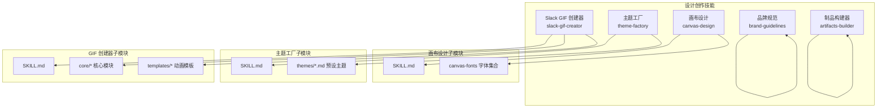
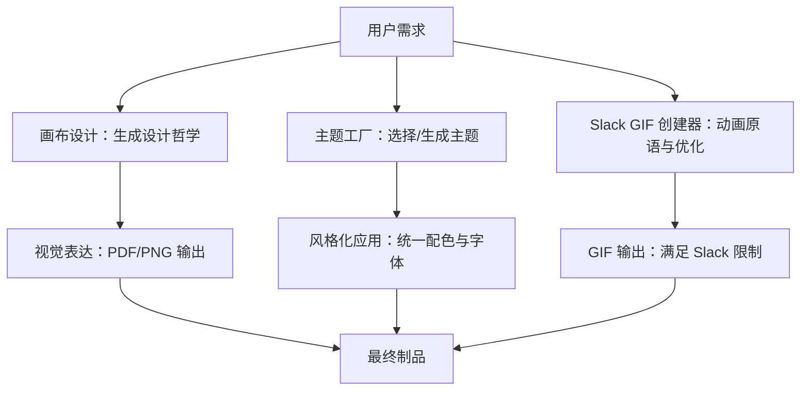
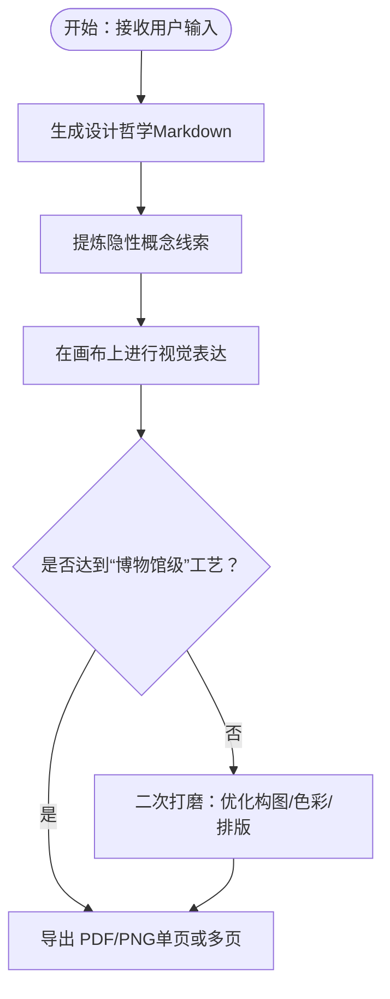
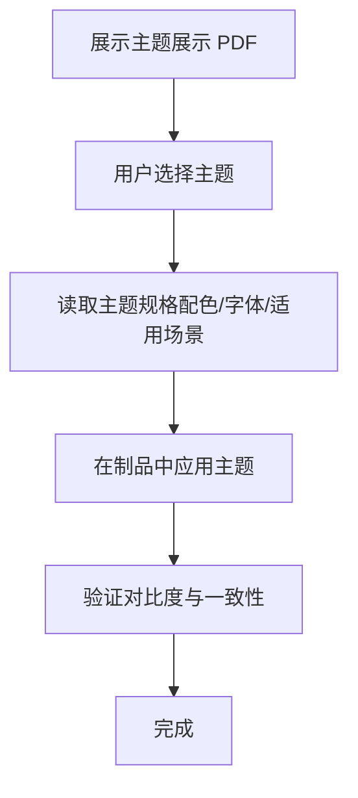
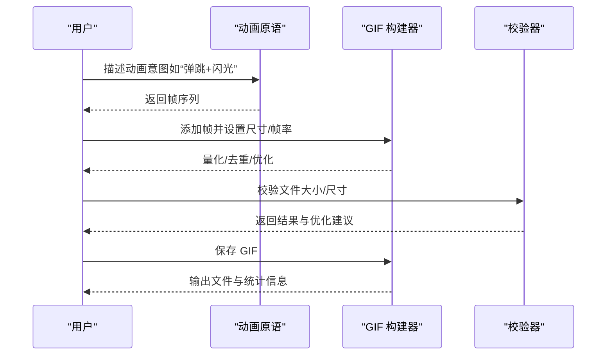
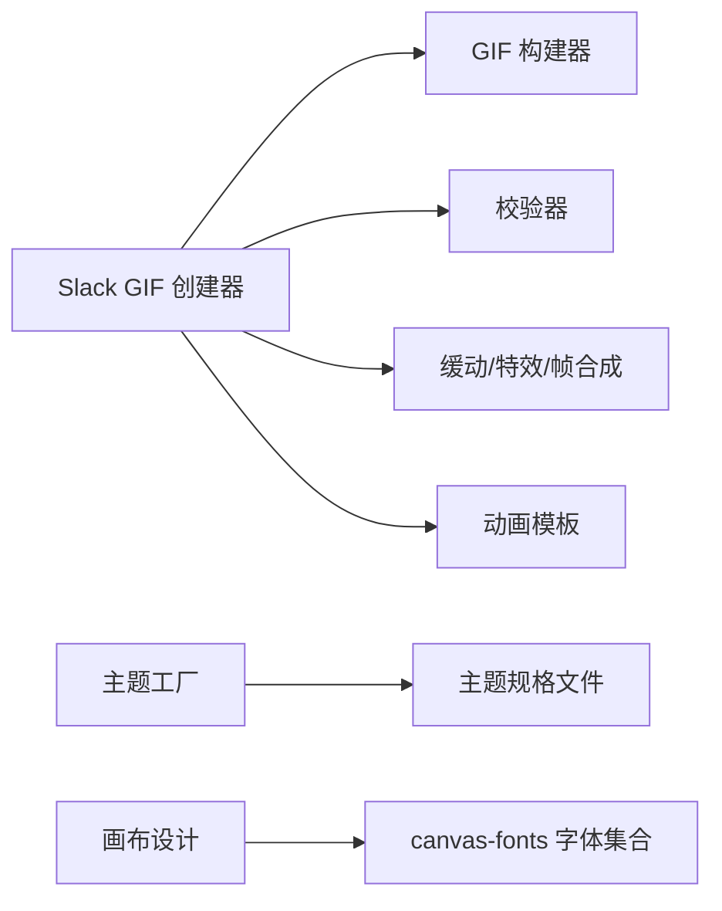

# 设计创作技能

<cite>
**本文引用的文件**
- [canvas-design/SKILL.md](file://mini_agent/skills/canvas-design/SKILL.md)
- [slack-gif-creator/SKILL.md](file://mini_agent/skills/slack-gif-creator/SKILL.md)
- [theme-factory/SKILL.md](file://mini_agent/skills/theme-factory/SKILL.md)
- [brand-guidelines/SKILL.md](file://mini_agent/skills/brand-guidelines/SKILL.md)
- [artifacts-builder/SKILL.md](file://mini_agent/skills/artifacts-builder/SKILL.md)
- [slack-gif-creator/core/gif_builder.py](file://mini_agent/skills/slack-gif-creator/core/gif_builder.py)
- [slack-gif-creator/core/validators.py](file://mini_agent/skills/slack-gif-creator/core/validators.py)
- [slack-gif-creator/templates/bounce.py](file://mini_agent/skills/slack-gif-creator/templates/bounce.py)
- [theme-factory/themes/ocean-depths.md](file://mini_agent/skills/theme-factory/themes/ocean-depths.md)
- [theme-factory/themes/modern-minimalist.md](file://mini_agent/skills/theme-factory/themes/modern-minimalist.md)
- [canvas-design/canvas-fonts/JetBrainsMono-OFL.txt](file://mini_agent/skills/canvas-design/canvas-fonts/JetBrainsMono-OFL.txt)
</cite>

## 目录
1. [简介](#简介)
2. [项目结构](#项目结构)
3. [核心组件](#核心组件)
4. [架构总览](#架构总览)
5. [详细组件分析](#详细组件分析)
6. [依赖关系分析](#依赖关系分析)
7. [性能考量](#性能考量)
8. [故障排查指南](#故障排查指南)
9. [结论](#结论)
10. [附录](#附录)

## 简介
本文件系统性梳理 MiniAgent 仓库中的设计创作技能，重点覆盖以下三大能力：
- 画布设计（Canvas Design）：以“设计哲学”为起点，通过视觉语言表达理念，最终产出高质量的 PDF 或 PNG 视觉作品。
- 主题工厂（Theme Factory）：提供专业级配色与字体主题，支持对演示文稿、报告等各类制品进行风格化应用。
- Slack GIF 创建器：面向 Slack 的动画 GIF 制作工具包，包含尺寸与色彩约束校验、可组合的动画原语与优化策略。

文档将从系统架构、组件关系、数据流与处理逻辑、集成点与错误处理、性能特征等方面进行深入解析，并结合实际应用场景给出使用示例与最佳实践。

## 项目结构
设计创作技能位于 mini_agent/skills 目录下，每个技能以独立子目录组织，包含技能说明文档与实现模块。整体采用按功能域划分的目录结构，便于扩展与维护。

图示来源
- [canvas-design/SKILL.md](file://mini_agent/skills/canvas-design/SKILL.md)
- [theme-factory/SKILL.md](file://mini_agent/skills/theme-factory/SKILL.md)
- [slack-gif-creator/SKILL.md](file://mini_agent/skills/slack-gif-creator/SKILL.md)

章节来源
- [canvas-design/SKILL.md](file://mini_agent/skills/canvas-design/SKILL.md)
- [theme-factory/SKILL.md](file://mini_agent/skills/theme-factory/SKILL.md)
- [slack-gif-creator/SKILL.md](file://mini_agent/skills/slack-gif-creator/SKILL.md)

## 核心组件
- 画布设计（Canvas Design）
  - 以“设计哲学”为创作起点，强调空间表达、视觉层次与极简文本，最终产出 PDF 或 PNG。
  - 支持在 canvas-fonts 中选择字体，确保排版与设计语言一致。
- 主题工厂（Theme Factory）
  - 提供 10 套预设主题，包含配色与字体组合；支持自定义主题生成与应用。
  - 应用过程包括展示主题、选择主题、读取主题规格并统一应用。
- Slack GIF 创建器
  - 提供尺寸与色彩校验、动画原语（抖动、弹跳、旋转、脉冲、缩放、爆炸、摆动、滑动、翻转、变形、移动、万花筒等）、辅助工具（文字、颜色、特效、缓动函数、帧合成）。
  - 内置 GIF 构建器与去重、量化、尺寸优化等压缩策略，满足 Slack 的消息 GIF 与表情 GIF 限制。

章节来源
- [canvas-design/SKILL.md](file://mini_agent/skills/canvas-design/SKILL.md)
- [theme-factory/SKILL.md](file://mini_agent/skills/theme-factory/SKILL.md)
- [slack-gif-creator/SKILL.md](file://mini_agent/skills/slack-gif-creator/SKILL.md)

## 架构总览
三类设计技能围绕“创意—执行—交付”的闭环协作：
- 创意阶段：由画布设计产出“设计哲学”，作为后续视觉表达的指导原则。
- 执行阶段：主题工厂将统一风格应用于各类制品；Slack GIF 创建器负责动态内容的生成与优化。
- 交付阶段：输出 PDF/PNG/GIF 等符合平台要求的成品，满足用户体验设计、品牌视觉传达与社交媒体内容创作需求。

图示来源
- [canvas-design/SKILL.md](file://mini_agent/skills/canvas-design/SKILL.md)
- [theme-factory/SKILL.md](file://mini_agent/skills/theme-factory/SKILL.md)
- [slack-gif-creator/SKILL.md](file://mini_agent/skills/slack-gif-creator/SKILL.md)

## 详细组件分析

### 画布设计（Canvas Design）技能
- 创作流程
  - 第一步：生成“设计哲学”（Markdown），聚焦形式、空间、色彩、构图与图形元素，强调极简文本与艺术性。
  - 第二步：基于哲学在画布上进行视觉表达，产出单页或多页 PDF 或 PNG，遵循“90% 视觉、10% 必要文本”的原则。
  - 第三步：根据反馈进行二次打磨，追求“如博物馆展示般”的工艺品质。
- 参数与配置
  - 输出格式：PDF 或 PNG（单页或多页打包）。
  - 字体选择：可在 canvas-fonts 目录中挑选，确保与设计哲学一致。
  - 文本策略：极简、视觉优先、不重叠、留白充足。
- 应用场景
  - 用户体验设计：海报、信息图表、产品展示页。
  - 品牌视觉传达：品牌手册中的视觉范式、视觉识别元素。
  - 社交媒体内容：适合分享的高质感静态图像。
- 最佳实践
  - 先定调性再落笔，确保设计哲学贯穿始终。
  - 控制元素密度，避免信息过载。
  - 使用重复图案与完美几何增强“系统性观察”的感觉。

图示来源
- [canvas-design/SKILL.md](file://mini_agent/skills/canvas-design/SKILL.md)

章节来源
- [canvas-design/SKILL.md](file://mini_agent/skills/canvas-design/SKILL.md)

### 主题工厂（Theme Factory）技能
- 能力概述
  - 提供 10 套专业主题，涵盖海洋、日落、森林、现代极简、黄金时刻、北极薄霜、沙漠玫瑰、科技、植物花园、午夜银河等风格。
  - 每个主题包含：配色方案（含十六进制值）、标题与正文字体搭配、适用场景建议。
- 应用流程
  - 展示主题展示 PDF，让用户直观选择。
  - 明确主题名称后，读取对应主题文件，统一应用到制品（幻灯片、报告、HTML 页面等）。
  - 保持对比度与可读性，维持主题视觉一致性。
- 自定义主题
  - 当现有主题不满足需求时，可根据输入描述生成新主题，经审核后再应用。
- 应用场景
  - 商务汇报：海洋深邃、现代极简等主题适合不同行业与受众。
  - 教育/研究：自然系主题（森林、植物花园）提升亲和力与专业感。
  - 科技/创新：科技、午夜银河主题强化未来感与专业度。

图示来源
- [theme-factory/SKILL.md](file://mini_agent/skills/theme-factory/SKILL.md)
- [theme-factory/themes/ocean-depths.md](file://mini_agent/skills/theme-factory/themes/ocean-depths.md)
- [theme-factory/themes/modern-minimalist.md](file://mini_agent/skills/theme-factory/themes/modern-minimalist.md)

章节来源
- [theme-factory/SKILL.md](file://mini_agent/skills/theme-factory/SKILL.md)
- [theme-factory/themes/ocean-depths.md](file://mini_agent/skills/theme-factory/themes/ocean-depths.md)
- [theme-factory/themes/modern-minimalist.md](file://mini_agent/skills/theme-factory/themes/modern-minimalist.md)

### Slack GIF 创建器技能
- Slack 平台要求
  - 消息 GIF：约 2MB 以内，最优尺寸 480x480，典型帧率 15-20fps，颜色数 128-256，时长 2-5 秒。
  - 表情 GIF：严格 64KB 以内，最优尺寸 128x128，典型帧率 10-12fps，颜色数 32-48，时长 1-2 秒。
- 工具包组成
  - 校验器：文件大小、尺寸、帧数与时长快速检查。
  - 动画原语：抖动、弹跳、旋转/加载、脉冲/心跳、淡入淡出、缩放/爆炸、摆动/波浪、滑动、翻转、形态变化、移动、万花筒等。
  - 辅助工具：GIF 构建器（自动量化、去重、尺寸优化）、文字渲染（带描边）、颜色管理、视觉特效、缓动函数、帧合成。
- GIF 构建与优化
  - 构建器支持全局调色板、重复帧去重、emoji 模式下的更激进优化（降维、降色、限帧）。
  - 保存时输出文件大小、维度、帧数、FPS、时长与颜色数，并在超限时给出警告与建议。
- 动画原语示例
  - 弹跳：利用弹性缓动函数模拟真实落地与回弹。
  - 组合：将多个原语按阶段组合，形成“预期—动作—反应”的完整节奏。

图示来源
- [slack-gif-creator/core/gif_builder.py](file://mini_agent/skills/slack-gif-creator/core/gif_builder.py)
- [slack-gif-creator/core/validators.py](file://mini_agent/skills/slack-gif-creator/core/validators.py)
- [slack-gif-creator/templates/bounce.py](file://mini_agent/skills/slack-gif-creator/templates/bounce.py)
- [slack-gif-creator/SKILL.md](file://mini_agent/skills/slack-gif-creator/SKILL.md)

章节来源
- [slack-gif-creator/SKILL.md](file://mini_agent/skills/slack-gif-creator/SKILL.md)
- [slack-gif-creator/core/gif_builder.py](file://mini_agent/skills/slack-gif-creator/core/gif_builder.py)
- [slack-gif-creator/core/validators.py](file://mini_agent/skills/slack-gif-creator/core/validators.py)
- [slack-gif-creator/templates/bounce.py](file://mini_agent/skills/slack-gif-creator/templates/bounce.py)

## 依赖关系分析
- 画布设计
  - 依赖 canvas-fonts 字体集合，确保排版与设计哲学一致。
- 主题工厂
  - 依赖 themes 目录下的主题规格文件，统一应用配色与字体。
- Slack GIF 创建器
  - 依赖核心模块（GIF 构建器、校验器、缓动函数、帧合成、颜色与文字工具）与动画模板（templates/*）。
  - 运行时依赖 Pillow、imageio、numpy 等库。

图示来源
- [slack-gif-creator/core/gif_builder.py](file://mini_agent/skills/slack-gif-creator/core/gif_builder.py)
- [slack-gif-creator/core/validators.py](file://mini_agent/skills/slack-gif-creator/core/validators.py)
- [theme-factory/SKILL.md](file://mini_agent/skills/theme-factory/SKILL.md)
- [canvas-design/SKILL.md](file://mini_agent/skills/canvas-design/SKILL.md)

章节来源
- [slack-gif-creator/SKILL.md](file://mini_agent/skills/slack-gif-creator/SKILL.md)
- [theme-factory/SKILL.md](file://mini_agent/skills/theme-factory/SKILL.md)
- [canvas-design/SKILL.md](file://mini_agent/skills/canvas-design/SKILL.md)

## 性能考量
- Slack GIF 创建器
  - 通过全局调色板减少颜色数、去除重复帧、在 emoji 模式下强制降维与限帧，显著降低文件体积。
  - 保存时输出文件大小与统计信息，便于快速判断是否需要进一步优化。
- 画布设计
  - 建议在保证视觉质量的前提下控制元素数量与复杂度，避免过度渲染导致输出体积增大。
- 主题工厂
  - 在应用主题时注意对比度与可读性，避免因颜色选择不当影响阅读体验。

## 故障排查指南
- Slack GIF 文件过大
  - 减少帧数或降低帧率；减少颜色数；缩小尺寸；在保存时启用 emoji 模式以获得更激进的优化。
  - 参考校验器返回的优化建议逐项调整。
- 尺寸不符合要求
  - 消息 GIF 建议 480x480，表情 GIF 建议 128x128；确保宽高比合理。
- 动画效果不流畅
  - 调整帧率与缓动函数；避免在同一帧内叠加过多复杂特效。
- 字体与排版问题
  - 画布设计中确保字体与设计哲学一致，避免重叠与溢出；必要时更换字体或调整字号。

章节来源
- [slack-gif-creator/core/validators.py](file://mini_agent/skills/slack-gif-creator/core/validators.py)
- [slack-gif-creator/core/gif_builder.py](file://mini_agent/skills/slack-gif-creator/core/gif_builder.py)
- [canvas-design/SKILL.md](file://mini_agent/skills/canvas-design/SKILL.md)

## 结论
本设计创作技能体系以“哲学—风格—执行—交付”为主线，覆盖静态视觉创作、主题风格化与动态内容生成三大关键环节。通过严格的参数配置、可视化校验与优化策略，能够在满足平台限制的同时，输出具备专业质感与品牌一致性的设计制品，适用于用户体验设计、品牌视觉传达与社交媒体内容创作等多种场景。

## 附录
- 使用示例与最佳实践
  - 画布设计：先撰写设计哲学，再进行视觉表达；注重留白与极简文本；最终导出 PDF/PNG。
  - 主题工厂：先查看主题展示 PDF，明确风格定位；读取主题规格并统一应用；关注对比度与一致性。
  - Slack GIF：明确动画节奏与平台限制；优先使用可组合原语；保存前务必校验尺寸与大小；必要时进行二次优化。
- 字体与版权
  - 画布设计使用的字体遵循各自开源协议；在使用前请确认环境许可与合规要求。

章节来源
- [canvas-design/SKILL.md](file://mini_agent/skills/canvas-design/SKILL.md)
- [theme-factory/SKILL.md](file://mini_agent/skills/theme-factory/SKILL.md)
- [slack-gif-creator/SKILL.md](file://mini_agent/skills/slack-gif-creator/SKILL.md)
- [canvas-design/canvas-fonts/JetBrainsMono-OFL.txt](file://mini_agent/skills/canvas-design/canvas-fonts/JetBrainsMono-OFL.txt)