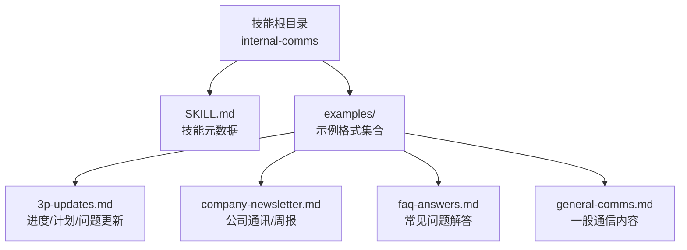
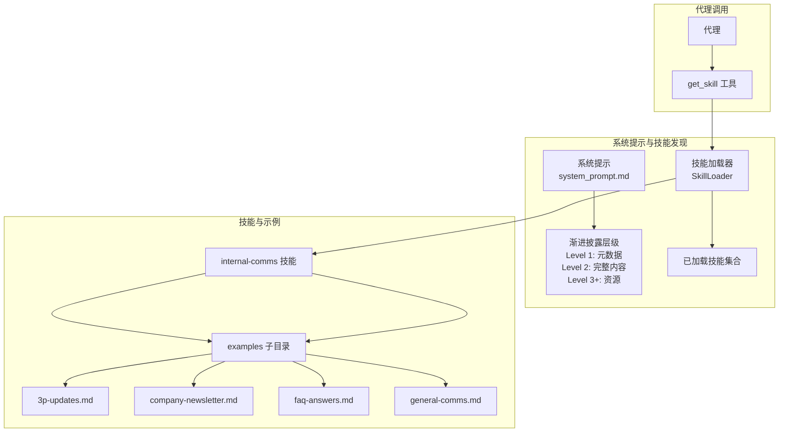
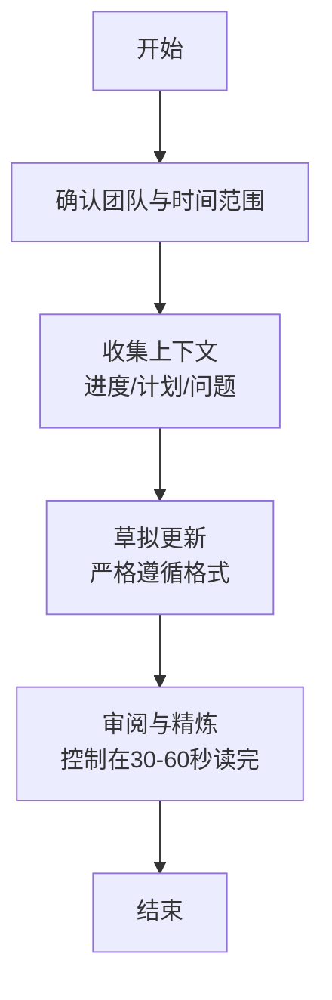
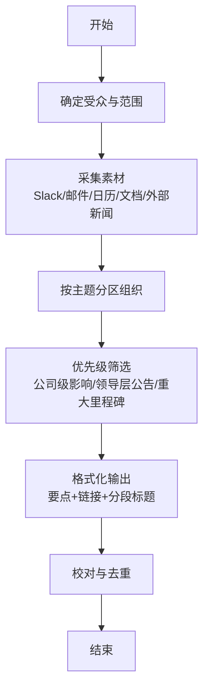
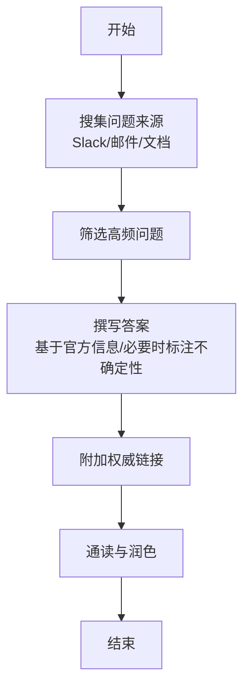
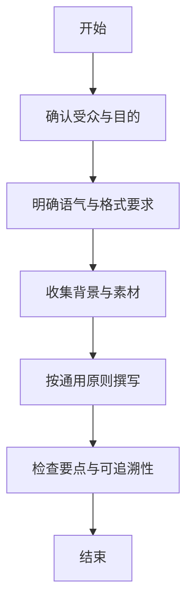
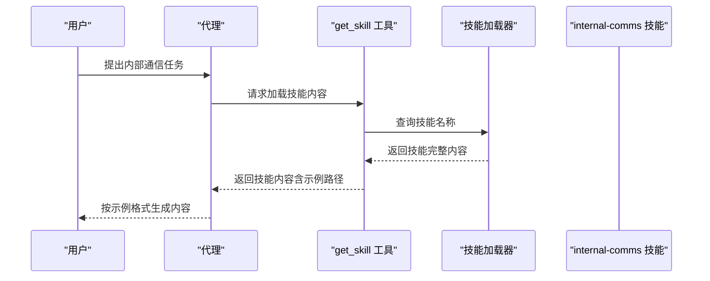

# 通信技能

<cite>
**本文引用的文件**
- [mini_agent/skills/internal-comms/SKILL.md](file://mini_agent/skills/internal-comms/SKILL.md)
- [mini_agent/skills/internal-comms/examples/3p-updates.md](file://mini_agent/skills/internal-comms/examples/3p-updates.md)
- [mini_agent/skills/internal-comms/examples/company-newsletter.md](file://mini_agent/skills/internal-comms/examples/company-newsletter.md)
- [mini_agent/skills/internal-comms/examples/faq-answers.md](file://mini_agent/skills/internal-comms/examples/faq-answers.md)
- [mini_agent/skills/internal-comms/examples/general-comms.md](file://mini_agent/skills/internal-comms/examples/general-comms.md)
- [mini_agent/tools/skill_loader.py](file://mini_agent/tools/skill_loader.py)
- [mini_agent/tools/skill_tool.py](file://mini_agent/tools/skill_tool.py)
- [mini_agent/config/system_prompt.md](file://mini_agent/config/system_prompt.md)
- [mini_agent/skills/README.md](file://mini_agent/skills/README.md)
</cite>

## 目录
1. [简介](#简介)
2. [项目结构](#项目结构)
3. [核心组件](#核心组件)
4. [架构总览](#架构总览)
5. [详细组件分析](#详细组件分析)
6. [依赖关系分析](#依赖关系分析)
7. [性能考量](#性能考量)
8. [故障排查指南](#故障排查指南)
9. [结论](#结论)
10. [附录](#附录)

## 简介
本文件系统化梳理“内部通信”（Internal Comms）技能，覆盖企业内部新闻通讯、FAQ 回答、一般通信内容的生成能力与使用方法。文档从技能定位、使用场景、内容组织结构、语言风格与准确性保障等方面进行深入说明，并提供可复用的创作流程与示例路径，帮助读者在不同场景下高效产出高质量的内部沟通内容。

## 项目结构
内部通信技能位于独立的技能目录中，包含技能元数据与多类示例格式指引：
- 技能元数据：用于声明技能名称、描述、关键词及使用建议
- 示例格式：针对三类典型场景（3P 更新、公司通讯、FAQ）与一类通用场景（一般通信）提供标准化模板与写作规范

图表来源
- [mini_agent/skills/internal-comms/SKILL.md:1-33](file://mini_agent/skills/internal-comms/SKILL.md#L1-L33)
- [mini_agent/skills/internal-comms/examples/3p-updates.md:1-47](file://mini_agent/skills/internal-comms/examples/3p-updates.md#L1-L47)
- [mini_agent/skills/internal-comms/examples/company-newsletter.md:1-66](file://mini_agent/skills/internal-comms/examples/company-newsletter.md#L1-L66)
- [mini_agent/skills/internal-comms/examples/faq-answers.md:1-30](file://mini_agent/skills/internal-comms/examples/faq-answers.md#L1-L30)
- [mini_agent/skills/internal-comms/examples/general-comms.md:1-16](file://mini_agent/skills/internal-comms/examples/general-comms.md#L1-L16)

章节来源
- [mini_agent/skills/internal-comms/SKILL.md:1-33](file://mini_agent/skills/internal-comms/SKILL.md#L1-L33)
- [mini_agent/skills/internal-comms/examples/3p-updates.md:1-47](file://mini_agent/skills/internal-comms/examples/3p-updates.md#L1-L47)
- [mini_agent/skills/internal-comms/examples/company-newsletter.md:1-66](file://mini_agent/skills/internal-comms/examples/company-newsletter.md#L1-L66)
- [mini_agent/skills/internal-comms/examples/faq-answers.md:1-30](file://mini_agent/skills/internal-comms/examples/faq-answers.md#L1-L30)
- [mini_agent/skills/internal-comms/examples/general-comms.md:1-16](file://mini_agent/skills/internal-comms/examples/general-comms.md#L1-L16)

## 核心组件
- 技能元数据（SKILL.md）
  - 明确技能用途：为企业内部各类沟通内容提供标准化指导
  - 使用场景清单：3P 更新、公司通讯、FAQ、状态报告、领导层更新、项目更新、事件报告等
  - 使用步骤：识别类型 → 加载对应示例 → 按示例执行格式、语气与素材收集
- 示例格式（examples/*）
  - 3P 更新：面向管理层与团队的“进度/计划/问题”短报，强调简洁、数据驱动
  - 公司通讯：面向全员的周报/月报摘要，强调链接、要点、分段与“我们”的口吻
  - FAQ 解答：汇总高频困惑并给出权威、清晰、可追溯的答案
  - 一般通信：当不匹配上述标准格式时的通用创作指南

章节来源
- [mini_agent/skills/internal-comms/SKILL.md:7-32](file://mini_agent/skills/internal-comms/SKILL.md#L7-L32)
- [mini_agent/skills/internal-comms/examples/3p-updates.md:1-47](file://mini_agent/skills/internal-comms/examples/3p-updates.md#L1-L47)
- [mini_agent/skills/internal-comms/examples/company-newsletter.md:1-66](file://mini_agent/skills/internal-comms/examples/company-newsletter.md#L1-L66)
- [mini_agent/skills/internal-comms/examples/faq-answers.md:1-30](file://mini_agent/skills/internal-comms/examples/faq-answers.md#L1-L30)
- [mini_agent/skills/internal-comms/examples/general-comms.md:1-16](file://mini_agent/skills/internal-comms/examples/general-comms.md#L1-L16)

## 架构总览
内部通信技能通过“元数据 + 示例格式 + 动态加载”的模式工作，结合系统提示词中的“渐进披露”机制，使代理仅在需要时加载完整技能内容，从而兼顾灵活性与性能。

图表来源
- [mini_agent/config/system_prompt.md:10-31](file://mini_agent/config/system_prompt.md#L10-L31)
- [mini_agent/tools/skill_loader.py:47-257](file://mini_agent/tools/skill_loader.py#L47-L257)
- [mini_agent/tools/skill_tool.py:13-85](file://mini_agent/tools/skill_tool.py#L13-L85)
- [mini_agent/skills/internal-comms/SKILL.md:1-33](file://mini_agent/skills/internal-comms/SKILL.md#L1-L33)

## 详细组件分析

### 组件一：3P 更新（进度/计划/问题）
适用对象：管理层、领导者、跨团队成员  
目标：在极短时间内传递关键进展、后续计划与阻碍因素  
关键要素
- 结构严格：进度/计划/问题三段式，每段1-3句，数据驱动
- 时间范围：进度/问题通常覆盖过去一周；计划覆盖未来一周
- 工具建议：Slack、Google Drive、邮件、日历等渠道获取上下文
- 语气与风格：客观、简洁、事实性，避免冗长修辞

图表来源
- [mini_agent/skills/internal-comms/examples/3p-updates.md:1-47](file://mini_agent/skills/internal-comms/examples/3p-updates.md#L1-L47)

章节来源
- [mini_agent/skills/internal-comms/examples/3p-updates.md:1-47](file://mini_agent/skills/internal-comms/examples/3p-updates.md#L1-L47)

### 组件二：公司通讯（新闻通讯/周报）
适用对象：全体或大范围受众  
目标：在有限篇幅内传达公司级动态、里程碑与高层信息  
关键要素
- 内容密度：约20-25条要点，每条1-2句
- 链接优先：链接到文档、公告、邮件、外部报道等权威来源
- 分段组织：按“公司公告/优先事项/领导更新/社交动态”等主题分区
- 语言风格：使用“我们”口吻，体现归属感与一致性

图表来源
- [mini_agent/skills/internal-comms/examples/company-newsletter.md:1-66](file://mini_agent/skills/internal-comms/examples/company-newsletter.md#L1-L66)

章节来源
- [mini_agent/skills/internal-comms/examples/company-newsletter.md:1-66](file://mini_agent/skills/internal-comms/examples/company-newsletter.md#L1-L66)

### 组件三：FAQ 解答
适用对象：全公司员工  
目标：统一口径，减少误解，提升信息透明度  
关键要素
- 选题原则：聚焦影响面广的高频问题
- 回答质量：基于官方信息；不确定时明确标注；提供权威链接
- 格式规范：问题与答案一一对应，语言专业且亲和

图表来源
- [mini_agent/skills/internal-comms/examples/faq-answers.md:1-30](file://mini_agent/skills/internal-comms/examples/faq-answers.md#L1-L30)

章节来源
- [mini_agent/skills/internal-comms/examples/faq-answers.md:1-30](file://mini_agent/skills/internal-comms/examples/faq-answers.md#L1-L30)

### 组件四：一般通信（通用场景）
适用对象：未落入标准格式的内部沟通需求  
目标：在缺乏既定模板时仍保持清晰、一致、高效的表达  
关键要素
- 前置澄清：受众、目的、语气（正式/随意/紧急/信息性）、格式要求
- 通用原则：清晰简洁、主动语态、先说重点、附带链接与参考

图表来源
- [mini_agent/skills/internal-comms/examples/general-comms.md:1-16](file://mini_agent/skills/internal-comms/examples/general-comms.md#L1-L16)

章节来源
- [mini_agent/skills/internal-comms/examples/general-comms.md:1-16](file://mini_agent/skills/internal-comms/examples/general-comms.md#L1-L16)

### 组件五：技能加载与使用（系统集成）
内部通信技能通过“渐进披露”机制被系统加载与使用：
- 层级一：系统提示中展示可用技能列表与简要描述
- 层级二：代理调用 get_skill 获取完整技能内容
- 层级三：技能可引用其子资源（如示例文件），代理通过文件工具读取

图表来源
- [mini_agent/config/system_prompt.md:10-31](file://mini_agent/config/system_prompt.md#L10-L31)
- [mini_agent/tools/skill_tool.py:40-54](file://mini_agent/tools/skill_tool.py#L40-L54)
- [mini_agent/tools/skill_loader.py:60-118](file://mini_agent/tools/skill_loader.py#L60-L118)

章节来源
- [mini_agent/config/system_prompt.md:10-31](file://mini_agent/config/system_prompt.md#L10-L31)
- [mini_agent/tools/skill_tool.py:13-85](file://mini_agent/tools/skill_tool.py#L13-L85)
- [mini_agent/tools/skill_loader.py:47-257](file://mini_agent/tools/skill_loader.py#L47-L257)

## 依赖关系分析
- 技能与系统提示的耦合
  - 系统提示定义了技能的渐进披露层级与使用方式，代理据此决定何时加载技能
- 技能与示例文件的耦合
  - 技能内容通过示例文件提供具体格式与写作规范，代理在生成过程中直接引用
- 工具链的协作
  - get_skill 工具负责按名称检索并返回技能内容
  - SkillLoader 负责解析 SKILL.md、处理相对路径、构建技能对象

图表来源
- [mini_agent/config/system_prompt.md:10-31](file://mini_agent/config/system_prompt.md#L10-L31)
- [mini_agent/tools/skill_tool.py:13-85](file://mini_agent/tools/skill_tool.py#L13-L85)
- [mini_agent/tools/skill_loader.py:47-257](file://mini_agent/tools/skill_loader.py#L47-L257)
- [mini_agent/skills/internal-comms/SKILL.md:1-33](file://mini_agent/skills/internal-comms/SKILL.md#L1-L33)

章节来源
- [mini_agent/config/system_prompt.md:10-31](file://mini_agent/config/system_prompt.md#L10-L31)
- [mini_agent/tools/skill_tool.py:13-85](file://mini_agent/tools/skill_tool.py#L13-L85)
- [mini_agent/tools/skill_loader.py:47-257](file://mini_agent/tools/skill_loader.py#L47-L257)
- [mini_agent/skills/internal-comms/SKILL.md:1-33](file://mini_agent/skills/internal-comms/SKILL.md#L1-L33)

## 性能考量
- 渐进披露降低初始负载：仅在需要时加载技能完整内容，避免一次性注入大量文本
- 示例文件体积可控：每个示例聚焦单一场景，便于代理快速定位与复用
- 工具链轻量：技能加载与内容拼装逻辑简单，适合在资源受限环境中运行

## 故障排查指南
- 技能未找到
  - 现象：get_skill 返回技能不存在
  - 排查：确认技能名称是否正确；检查系统提示中列出的可用技能
  - 参考
    - [mini_agent/tools/skill_tool.py:44-50](file://mini_agent/tools/skill_tool.py#L44-L50)
    - [mini_agent/config/system_prompt.md:10-31](file://mini_agent/config/system_prompt.md#L10-L31)
- 示例路径无法读取
  - 现象：技能内容中引用的示例文件路径无效
  - 排查：确认示例文件存在；检查相对路径是否相对于技能根目录
  - 参考
    - [mini_agent/tools/skill_loader.py:119-192](file://mini_agent/tools/skill_loader.py#L119-L192)
- 生成内容不符合格式
  - 现象：输出缺少结构化段落或语气不当
  - 排查：重新加载对应示例格式；对照“优先级/规避项/格式化”要求进行修正
  - 参考
    - [mini_agent/skills/internal-comms/examples/3p-updates.md:30-47](file://mini_agent/skills/internal-comms/examples/3p-updates.md#L30-L47)
    - [mini_agent/skills/internal-comms/examples/company-newsletter.md:23-35](file://mini_agent/skills/internal-comms/examples/company-newsletter.md#L23-L35)
    - [mini_agent/skills/internal-comms/examples/faq-answers.md:16-30](file://mini_agent/skills/internal-comms/examples/faq-answers.md#L16-L30)
    - [mini_agent/skills/internal-comms/examples/general-comms.md:11-16](file://mini_agent/skills/internal-comms/examples/general-comms.md#L11-L16)

## 结论
内部通信技能通过“元数据 + 示例格式 + 动态加载”的组合，为代理提供了可复用、可扩展的内部沟通生成框架。在不同场景下，只需识别类型、加载相应示例并遵循其格式与风格要求，即可稳定产出高质量的内部内容。配合系统提示中的渐进披露机制，该技能体系在保证灵活性的同时兼顾性能与可维护性。

## 附录
- 使用示例与创作指南（路径）
  - 3P 更新：[mini_agent/skills/internal-comms/examples/3p-updates.md:1-47](file://mini_agent/skills/internal-comms/examples/3p-updates.md#L1-L47)
  - 公司通讯：[mini_agent/skills/internal-comms/examples/company-newsletter.md:1-66](file://mini_agent/skills/internal-comms/examples/company-newsletter.md#L1-L66)
  - FAQ 解答：[mini_agent/skills/internal-comms/examples/faq-answers.md:1-30](file://mini_agent/skills/internal-comms/examples/faq-answers.md#L1-L30)
  - 一般通信：[mini_agent/skills/internal-comms/examples/general-comms.md:1-16](file://mini_agent/skills/internal-comms/examples/general-comms.md#L1-L16)
- 技能与系统集成
  - 技能元数据：[mini_agent/skills/internal-comms/SKILL.md:1-33](file://mini_agent/skills/internal-comms/SKILL.md#L1-L33)
  - 系统提示与渐进披露：[mini_agent/config/system_prompt.md:10-31](file://mini_agent/config/system_prompt.md#L10-L31)
  - 技能加载器与工具：[mini_agent/tools/skill_loader.py:47-257](file://mini_agent/tools/skill_loader.py#L47-L257), [mini_agent/tools/skill_tool.py:13-85](file://mini_agent/tools/skill_tool.py#L13-L85)
- 相关说明
  - 技能总览与分类：[mini_agent/skills/README.md:38-41](file://mini_agent/skills/README.md#L38-L41)