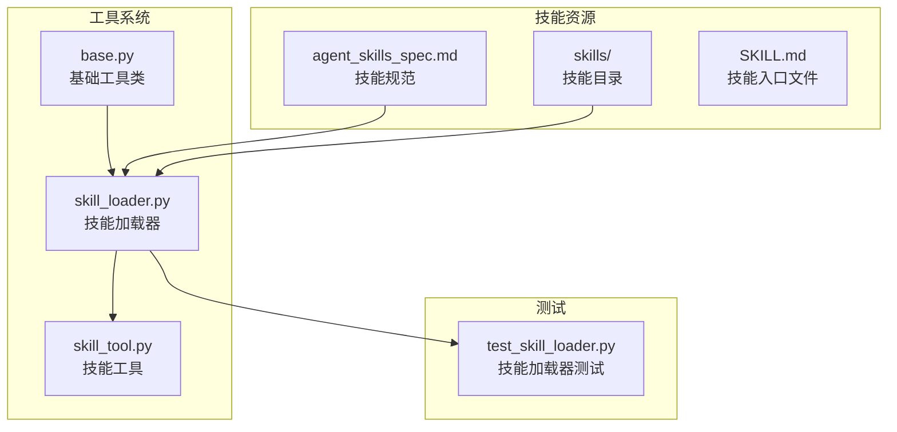
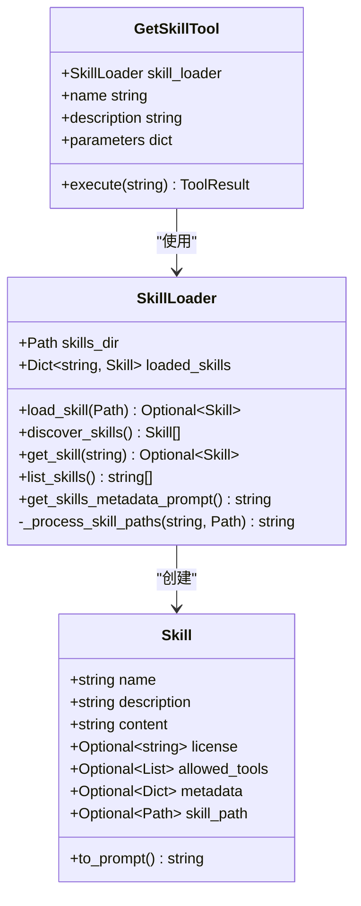
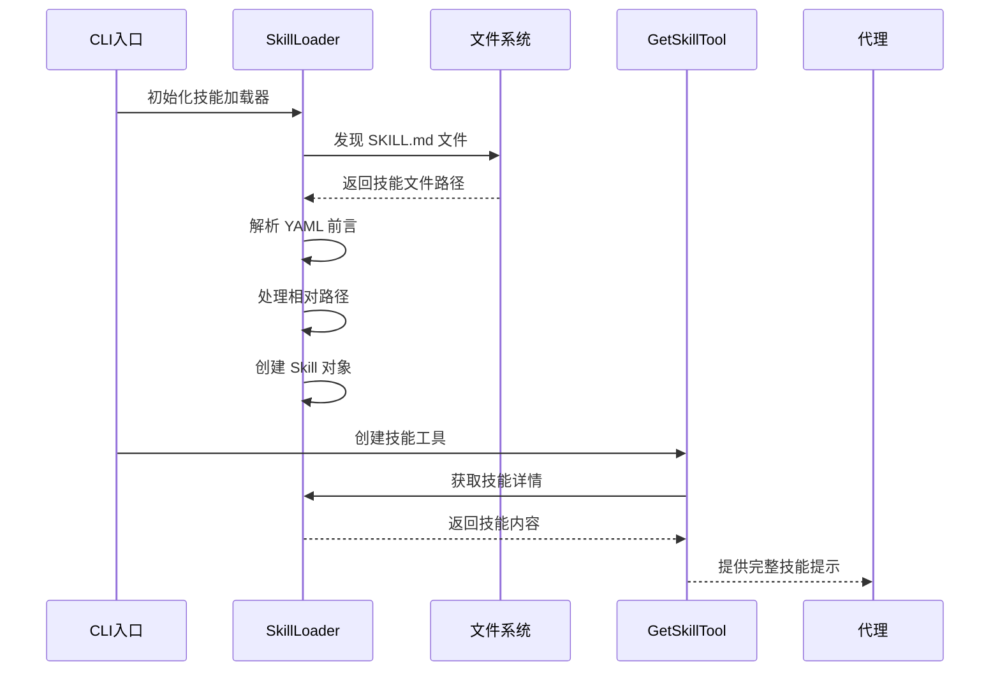
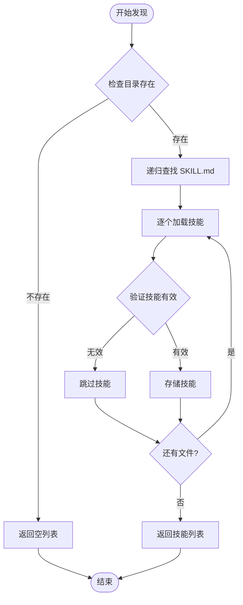
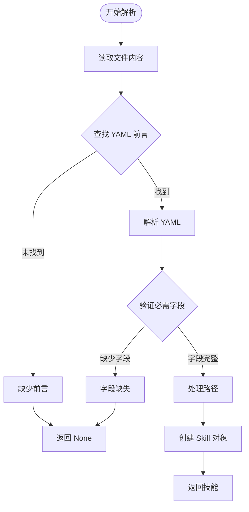
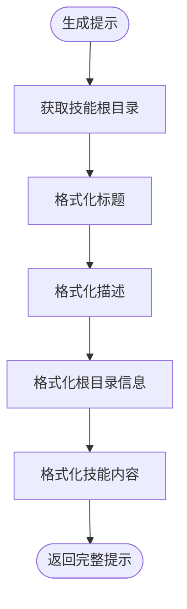
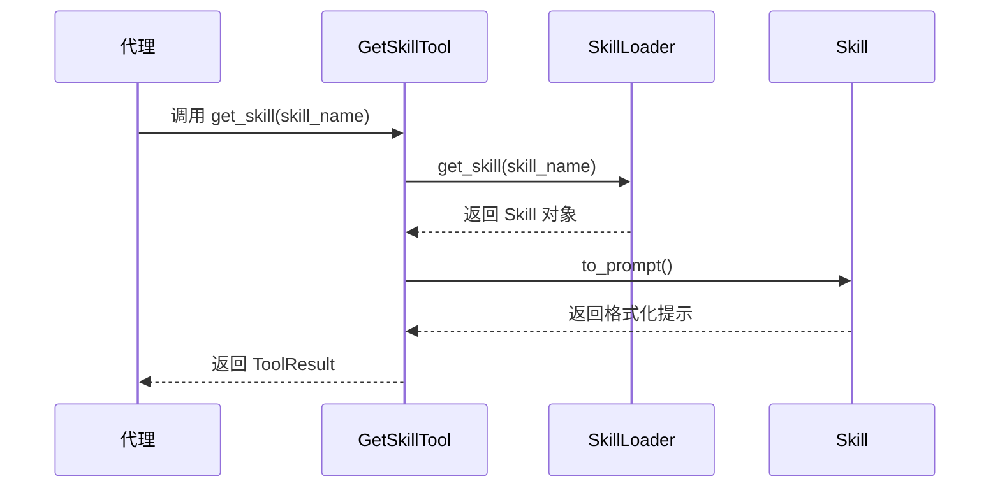
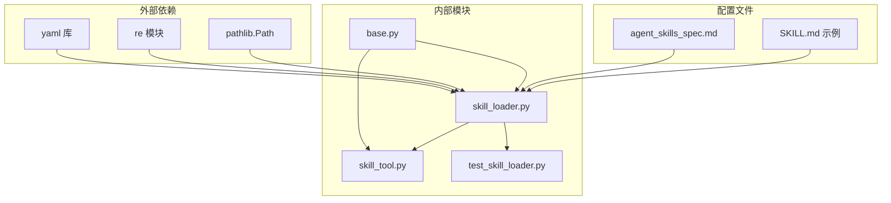

# 技能加载器

<cite>
**本文档引用的文件**
- [skill_loader.py](file://mini_agent/tools/skill_loader.py)
- [skill_tool.py](file://mini_agent/tools/skill_tool.py)
- [base.py](file://mini_agent/tools/base.py)
- [__init__.py](file://mini_agent/tools/__init__.py)
- [test_skill_loader.py](file://tests/test_skill_loader.py)
- [SKILL.md](file://mini_agent/skills/algorithmic-art/SKILL.md)
- [SKILL.md](file://mini_agent/skills/document-skills/docx/SKILL.md)
- [SKILL.md](file://mini_agent/skills/mcp-builder/SKILL.md)
- [agent_skills_spec.md](file://mini_agent/skills/agent_skills_spec.md)
- [cli.py](file://mini_agent/cli.py)
</cite>

## 目录
1. [简介](#简介)
2. [项目结构](#项目结构)
3. [核心组件](#核心组件)
4. [架构概览](#架构概览)
5. [详细组件分析](#详细组件分析)
6. [依赖分析](#依赖分析)
7. [性能考虑](#性能考虑)
8. [故障排除指南](#故障排除指南)
9. [结论](#结论)
10. [附录](#附录)

## 简介
技能加载器是 MiniAgent 框架中的核心组件，负责动态发现、加载和管理技能资源。它实现了 Claude Skills 规范，支持从 SKILL.md 文件中提取技能元数据，解析 YAML 前言，处理相对路径转换，并为代理提供按需加载的技能内容。

技能加载器采用渐进式披露（Progressive Disclosure）设计，通过多级策略控制技能信息的暴露程度：
- Level 1：仅显示技能元数据（名称和描述）
- Level 2：按需加载完整技能内容
- Level 3+：自动转换相对路径为绝对路径，支持嵌套资源访问

## 项目结构
技能加载器位于 `mini_agent/tools/` 目录下，与工具系统紧密集成：

**图表来源**
- [skill_loader.py:1-257](file://mini_agent/tools/skill_loader.py#L1-L257)
- [skill_tool.py:1-85](file://mini_agent/tools/skill_tool.py#L1-L85)
- [agent_skills_spec.md:1-56](file://mini_agent/skills/agent_skills_spec.md#L1-L56)

**章节来源**
- [skill_loader.py:1-257](file://mini_agent/tools/skill_loader.py#L1-L257)
- [skill_tool.py:1-85](file://mini_agent/tools/skill_tool.py#L1-L85)
- [agent_skills_spec.md:1-56](file://mini_agent/skills/agent_skills_spec.md#L1-L56)

## 核心组件
技能加载器系统由三个主要组件构成：

### Skill 数据模型
Skill 类定义了技能的基本数据结构，包含必需字段和可选字段：

**图表来源**
- [skill_loader.py:15-45](file://mini_agent/tools/skill_loader.py#L15-L45)
- [skill_loader.py:47-257](file://mini_agent/tools/skill_loader.py#L47-L257)
- [skill_tool.py:13-85](file://mini_agent/tools/skill_tool.py#L13-L85)

### 技能文件格式规范
根据 Agent Skills 规范，技能文件必须遵循以下结构：

#### 必需字段
- `name`：技能名称，必须与包含 SKILL.md 的目录名匹配
- `description`：技能描述，说明技能的功能和使用场景

#### 可选字段
- `license`：技能许可证信息
- `allowed-tools`：预批准运行的工具列表
- `metadata`：键值对形式的额外元数据

**章节来源**
- [agent_skills_spec.md:21-47](file://mini_agent/skills/agent_skills_spec.md#L21-L47)
- [skill_loader.py:103-111](file://mini_agent/tools/skill_loader.py#L103-L111)

## 架构概览
技能加载器采用分层架构设计，实现从文件系统到代理可用技能的完整转换流程：

**图表来源**
- [cli.py:589-615](file://mini_agent/cli.py#L589-L615)
- [skill_loader.py:194-214](file://mini_agent/tools/skill_loader.py#L194-L214)
- [skill_tool.py:40-54](file://mini_agent/tools/skill_tool.py#L40-L54)

## 详细组件分析

### SkillLoader 类分析
SkillLoader 是技能加载器的核心类，负责技能的发现、加载和管理。

#### 技能发现机制
Loader 使用递归搜索策略在指定目录中查找所有 SKILL.md 文件：

**图表来源**
- [skill_loader.py:194-214](file://mini_agent/tools/skill_loader.py#L194-L214)

#### YAML 前言解析
Loader 实现了严格的 YAML 前言解析逻辑：

**图表来源**
- [skill_loader.py:60-117](file://mini_agent/tools/skill_loader.py#L60-L117)

#### 路径处理算法
Loader 实现了三种模式的相对路径转换：

##### 模式一：目录路径转换
支持 `scripts/`、`references/`、`assets/` 目录下的直接路径引用：
- 匹配模式：`(python\s+|`)((?:scripts|references|assets)/[^\s`\)]+)`
- 功能：将相对路径转换为绝对路径，确保脚本和资源可被正确访问

##### 模式二：文档引用处理
识别自然语言中的文档引用：
- 匹配模式：`(see|read|refer to|check)\s+([a-zA-Z0-9_-]+\.(?:md|txt|json|yaml))([.,;\s])`
- 功能：将文档引用转换为绝对路径，并添加 `use read_file` 指令

##### 模式三：Markdown 链接转换
处理各种格式的 Markdown 链接：
- 匹配模式：`(?:(Read|See|Check|Refer to|Load|View)\s+)?\[(`?[^`\]]+`?)\]\(((?:\./)?[^)]+\.(?:md|txt|json|yaml|js|py|html))\)`
- 功能：保留链接文本样式，转换为绝对路径，并添加访问指令

**章节来源**
- [skill_loader.py:119-192](file://mini_agent/tools/skill_loader.py#L119-L192)

### Skill 类分析
Skill 类封装了技能的所有相关信息，并提供了友好的提示格式化功能。

#### 提示格式化
to_prompt() 方法生成标准的技能提示模板：

**图表来源**
- [skill_loader.py:27-44](file://mini_agent/tools/skill_loader.py#L27-L44)

**章节来源**
- [skill_loader.py:15-45](file://mini_agent/tools/skill_loader.py#L15-L45)

### GetSkillTool 分析
GetSkillTool 实现了代理的技能获取功能，采用渐进式披露 Level 2 设计：

**图表来源**
- [skill_tool.py:40-54](file://mini_agent/tools/skill_tool.py#L40-L54)

**章节来源**
- [skill_tool.py:13-85](file://mini_agent/tools/skill_tool.py#L13-L85)

## 依赖分析
技能加载器系统具有清晰的依赖关系：

**图表来源**
- [skill_loader.py:7-12](file://mini_agent/tools/skill_loader.py#L7-L12)
- [skill_tool.py:7-10](file://mini_agent/tools/skill_tool.py#L7-L10)

**章节来源**
- [skill_loader.py:1-257](file://mini_agent/tools/skill_loader.py#L1-L257)
- [skill_tool.py:1-85](file://mini_agent/tools/skill_tool.py#L1-L85)

## 性能考虑
技能加载器在设计时充分考虑了性能优化：

### 内存管理
- 使用懒加载策略，仅在需要时加载技能内容
- 缓存已加载的技能对象，避免重复解析
- 限制技能数量，防止内存泄漏

### I/O 优化
- 批量发现技能文件，减少文件系统调用次数
- 使用正则表达式进行高效路径匹配
- 避免不必要的文件读取操作

### 错误处理
- 实现健壮的异常处理机制
- 提供详细的错误信息和调试线索
- 支持部分失败的容错处理

## 故障排除指南

### 常见问题及解决方案

#### 技能加载失败
**症状**：技能无法被发现或加载
**原因**：
- 缺少 YAML 前言
- 必需字段缺失
- 文件编码问题

**解决方案**：
- 确保 SKILL.md 文件以 `---` 开始和结束的 YAML 前言
- 验证 `name` 和 `description` 字段存在且格式正确
- 检查文件编码为 UTF-8

#### 路径解析错误
**症状**：技能中的相对路径无法正确解析
**原因**：
- 相对路径不正确
- 文件不存在
- 路径大小写问题

**解决方案**：
- 使用绝对路径或相对于技能根目录的相对路径
- 确保目标文件存在于指定位置
- 注意文件系统的大小写敏感性

#### 性能问题
**症状**：技能加载缓慢
**原因**：
- 技能数量过多
- 路径处理复杂度高
- 文件系统 I/O 瓶颈

**解决方案**：
- 限制技能目录深度
- 优化正则表达式模式
- 使用缓存机制

**章节来源**
- [test_skill_loader.py:82-131](file://tests/test_skill_loader.py#L82-L131)
- [skill_loader.py:115-117](file://mini_agent/tools/skill_loader.py#L115-L117)

## 结论
技能加载器是一个设计精良的组件，成功实现了 Claude Skills 规范的各项要求。其核心优势包括：

1. **标准化的技能格式**：严格遵循 Agent Skills 规范，确保兼容性和一致性
2. **智能的路径处理**：支持多种路径格式，提升技能的可移植性
3. **渐进式披露设计**：通过多级策略平衡信息暴露和性能考虑
4. **健壮的错误处理**：提供详细的错误信息和容错机制
5. **良好的扩展性**：模块化设计便于功能扩展和维护

该组件为 MiniAgent 框架提供了强大的技能管理能力，是构建智能代理系统的重要基础设施。

## 附录

### 最佳实践指南

#### 技能开发最佳实践
- 使用清晰的技能命名和描述
- 合理组织技能目录结构
- 提供完整的文档和示例
- 遵循许可证要求

#### 性能优化建议
- 控制技能文件大小
- 避免复杂的嵌套路径
- 使用高效的正则表达式
- 实施适当的缓存策略

#### 调试技巧
- 启用详细的日志记录
- 使用单元测试验证功能
- 定期检查路径解析结果
- 监控内存使用情况

### 相关文件参考
- 技能规范文档：[agent_skills_spec.md](file://mini_agent/skills/agent_skills_spec.md)
- 示例技能文件：[algorithmic-art/SKILL.md](file://mini_agent/skills/algorithmic-art/SKILL.md)
- 测试用例：[test_skill_loader.py](file://tests/test_skill_loader.py)