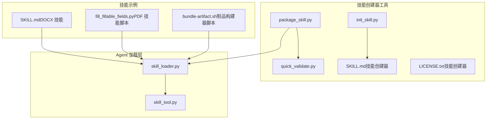
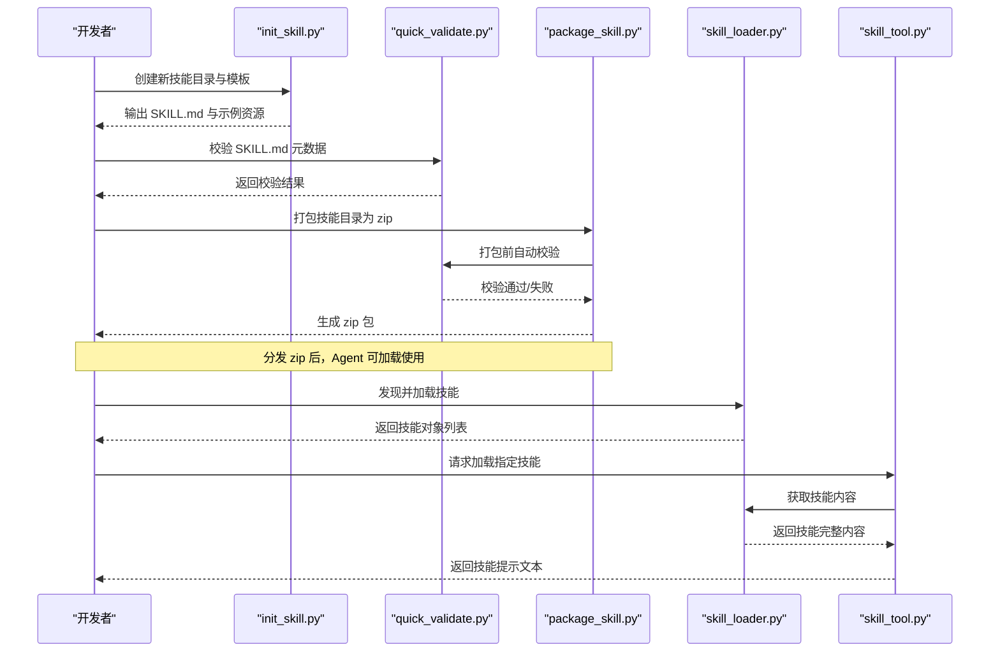
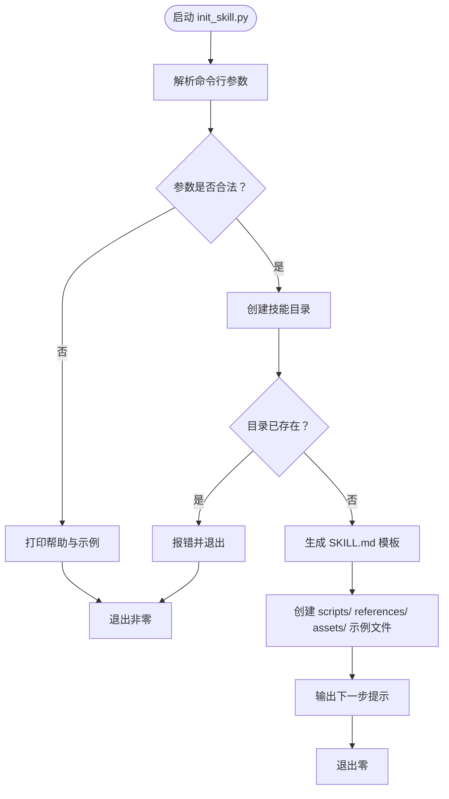
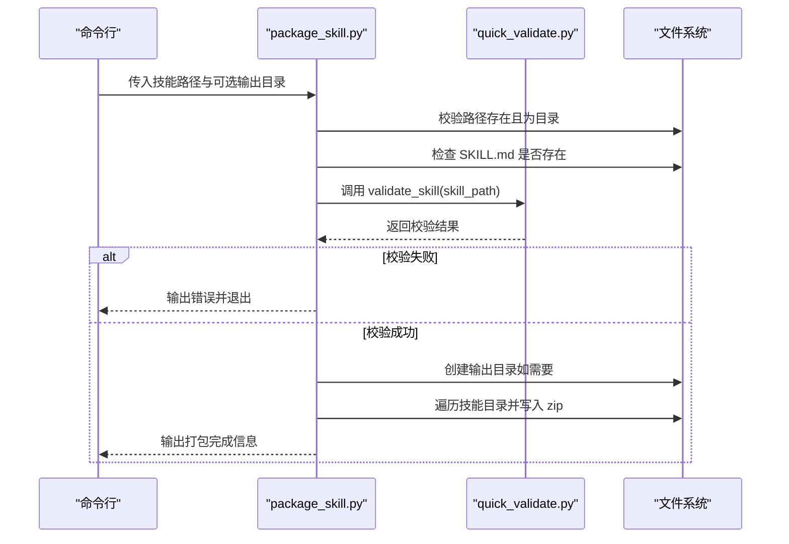
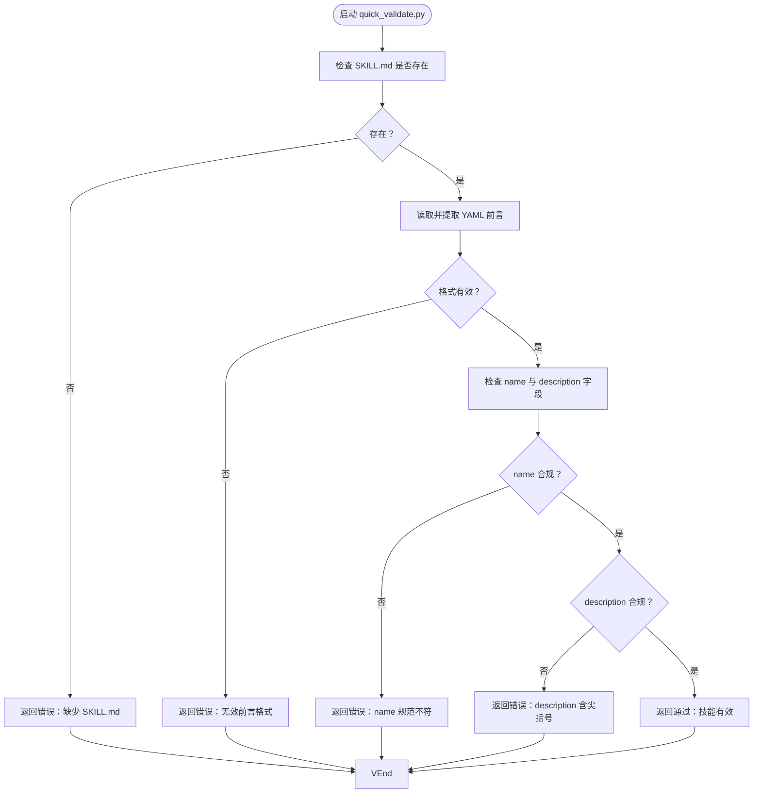
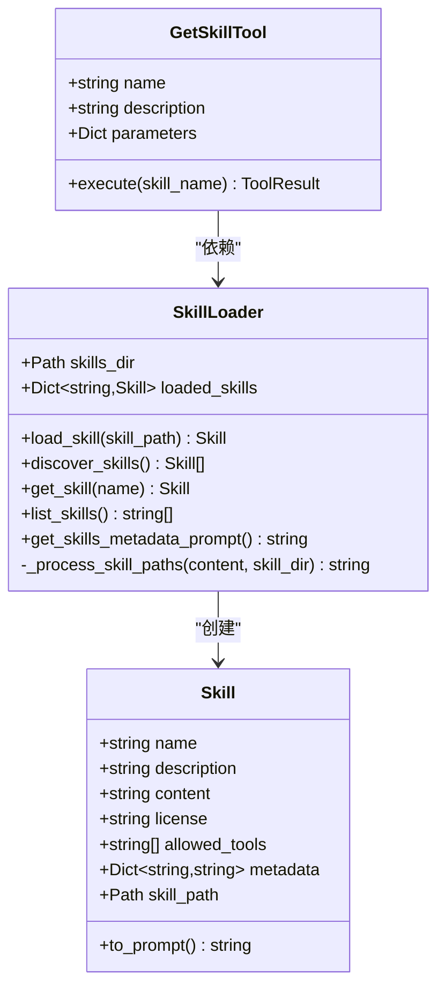
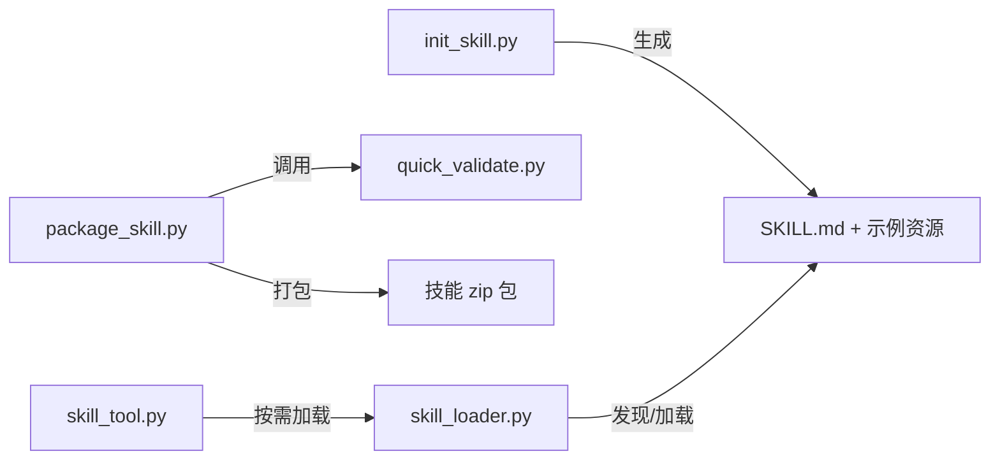

# 开发工具

<cite>
**本文引用的文件**
- [init_skill.py](file://mini_agent/skills/skill-creator/scripts/init_skill.py)
- [package_skill.py](file://mini_agent/skills/skill-creator/scripts/package_skill.py)
- [quick_validate.py](file://mini_agent/skills/skill-creator/scripts/quick_validate.py)
- [SKILL.md（技能创建器）](file://mini_agent/skills/skill-creator/SKILL.md)
- [LICENSE.txt（技能创建器）](file://mini_agent/skills/skill-creator/LICENSE.txt)
- [skill_loader.py](file://mini_agent/tools/skill_loader.py)
- [skill_tool.py](file://mini_agent/tools/skill_tool.py)
- [SKILL.md（DOCX 技能）](file://mini_agent/skills/document-skills/docx/SKILL.md)
- [fill_fillable_fields.py（PDF 技能脚本）](file://mini_agent/skills/document-skills/pdf/scripts/fill_fillable_fields.py)
- [bundle-artifact.sh（制品构建器脚本）](file://mini_agent/skills/artifacts-builder/scripts/bundle-artifact.sh)
</cite>

## 目录
1. [简介](#简介)
2. [项目结构](#项目结构)
3. [核心组件](#核心组件)
4. [架构总览](#架构总览)
5. [详细组件分析](#详细组件分析)
6. [依赖关系分析](#依赖关系分析)
7. [性能与可扩展性](#性能与可扩展性)
8. [故障排查指南](#故障排查指南)
9. [结论](#结论)
10. [附录：使用示例与最佳实践](#附录使用示例与最佳实践)

## 简介
本指南面向希望基于 Mini Agent 框架开发“技能”的开发者，系统讲解 skill-creator 工具集的三大脚本：init_skill.py（项目初始化）、package_skill.py（打包分发）与 quick_validate.py（快速校验）。文档不仅覆盖每个脚本的使用方法、参数说明与工作原理，还结合实际技能示例（如 DOCX、PDF、制品构建器）帮助你理解技能的组织方式、资源目录结构与加载机制，并提供常见使用场景与最佳实践建议。

## 项目结构
skill-creator 工具位于 skills/skill-creator/scripts 下，配套有 SKILL.md 与 LICENSE.txt；技能在 skills/ 目录下按领域划分，每个技能以 SKILL.md 为核心元数据文件，可选包含 scripts/、references/、assets/ 三类资源目录。Agent 通过 skill_loader.py 与 skill_tool.py 实现对技能的发现、加载与按需调用。

图表来源
- [init_skill.py:1-304](file://mini_agent/skills/skill-creator/scripts/init_skill.py#L1-L304)
- [package_skill.py:1-111](file://mini_agent/skills/skill-creator/scripts/package_skill.py#L1-L111)
- [quick_validate.py:1-65](file://mini_agent/skills/skill-creator/scripts/quick_validate.py#L1-L65)
- [SKILL.md（技能创建器）:1-210](file://mini_agent/skills/skill-creator/SKILL.md#L1-L210)
- [LICENSE.txt（技能创建器）:1-202](file://mini_agent/skills/skill-creator/LICENSE.txt#L1-L202)
- [skill_loader.py:1-257](file://mini_agent/tools/skill_loader.py#L1-L257)
- [skill_tool.py:1-85](file://mini_agent/tools/skill_tool.py#L1-L85)
- [SKILL.md（DOCX 技能）:1-197](file://mini_agent/skills/document-skills/docx/SKILL.md#L1-L197)
- [fill_fillable_fields.py（PDF 技能脚本）:1-115](file://mini_agent/skills/document-skills/pdf/scripts/fill_fillable_fields.py#L1-L115)
- [bundle-artifact.sh（制品构建器脚本）:1-54](file://mini_agent/skills/artifacts-builder/scripts/bundle-artifact.sh#L1-L54)

章节来源
- [init_skill.py:1-304](file://mini_agent/skills/skill-creator/scripts/init_skill.py#L1-L304)
- [package_skill.py:1-111](file://mini_agent/skills/skill-creator/scripts/package_skill.py#L1-L111)
- [quick_validate.py:1-65](file://mini_agent/skills/skill-creator/scripts/quick_validate.py#L1-L65)
- [SKILL.md（技能创建器）:1-210](file://mini_agent/skills/skill-creator/SKILL.md#L1-L210)
- [skill_loader.py:1-257](file://mini_agent/tools/skill_loader.py#L1-L257)
- [skill_tool.py:1-85](file://mini_agent/tools/skill_tool.py#L1-L85)

## 核心组件
- init_skill.py：根据模板生成新的技能目录结构，包含 SKILL.md 与示例资源（scripts/、references/、assets/），并打印后续步骤提示。
- package_skill.py：在打包前自动运行 quick_validate.py 进行基础校验，然后将技能目录压缩为 zip 文件用于分发。
- quick_validate.py：对 SKILL.md 的 YAML 前言元数据进行最小化校验（存在性、格式、字段完整性、命名规范等）。
- skill_loader.py：从 skills 目录递归发现 SKILL.md，解析 YAML 前言元数据，处理相对路径到绝对路径映射，支持“渐进披露”加载。
- skill_tool.py：提供 get_skill 工具，按需加载指定技能的完整内容，配合 skill_loader 使用。

章节来源
- [init_skill.py:189-271](file://mini_agent/skills/skill-creator/scripts/init_skill.py#L189-L271)
- [package_skill.py:19-83](file://mini_agent/skills/skill-creator/scripts/package_skill.py#L19-L83)
- [quick_validate.py:11-57](file://mini_agent/skills/skill-creator/scripts/quick_validate.py#L11-L57)
- [skill_loader.py:47-193](file://mini_agent/tools/skill_loader.py#L47-L193)
- [skill_tool.py:13-84](file://mini_agent/tools/skill_tool.py#L13-L84)

## 架构总览
技能创建器工具与 Agent 加载层协同工作：开发者使用 init_skill.py 初始化技能骨架，使用 quick_validate.py 自检，再由 package_skill.py 打包；Agent 在运行时通过 skill_loader.py 发现并加载技能，按需通过 skill_tool.py 获取完整技能内容。

图表来源
- [init_skill.py:273-304](file://mini_agent/skills/skill-creator/scripts/init_skill.py#L273-L304)
- [quick_validate.py:58-65](file://mini_agent/skills/skill-creator/scripts/quick_validate.py#L58-L65)
- [package_skill.py:85-111](file://mini_agent/skills/skill-creator/scripts/package_skill.py#L85-L111)
- [skill_loader.py:194-257](file://mini_agent/tools/skill_loader.py#L194-L257)
- [skill_tool.py:57-85](file://mini_agent/tools/skill_tool.py#L57-L85)

## 详细组件分析

### init_skill.py：项目初始化流程
- 功能要点
  - 接收 skill-name 与 --path 参数，创建技能目录与 SKILL.md 模板。
  - 自动生成 scripts/、references/、assets/ 三个资源目录及示例文件，便于快速开始。
  - 对目录已存在、创建失败等情况进行错误提示与退出码控制。
- 关键流程
  - 解析命令行参数，校验格式。
  - 创建目录树与示例文件，设置脚本可执行权限。
  - 输出下一步操作指引（编辑 SKILL.md、自定义示例文件、运行验证器）。
- 使用示例
  - 新建公共技能：python scripts/init_skill.py my-new-skill --path skills/public
  - 新建私有技能：python scripts/init_skill.py my-api-helper --path skills/private
  - 指定自定义路径：python scripts/init_skill.py custom-skill --path /custom/location

图表来源
- [init_skill.py:273-304](file://mini_agent/skills/skill-creator/scripts/init_skill.py#L273-L304)
- [init_skill.py:194-271](file://mini_agent/skills/skill-creator/scripts/init_skill.py#L194-L271)

章节来源
- [init_skill.py:1-304](file://mini_agent/skills/skill-creator/scripts/init_skill.py#L1-L304)

### package_skill.py：打包机制
- 功能要点
  - 校验目标路径存在且为目录，确保 SKILL.md 存在。
  - 调用 quick_validate.py 进行前置校验，失败则终止并提示修复。
  - 遍历技能根目录，将所有文件写入 zip，保持目录层级。
  - 支持指定输出目录，默认当前目录。
- 关键流程
  - 参数解析与路径合法性检查。
  - 调用 validate_skill 并处理返回值。
  - 计算输出 zip 名称与路径，逐文件写入。
  - 异常捕获与错误输出，返回 zip 路径或 None。
- 使用示例
  - 默认输出：python scripts/package_skill.py skills/public/my-skill
  - 指定输出目录：python scripts/package_skill.py skills/public/my-skill ./dist

图表来源
- [package_skill.py:19-83](file://mini_agent/skills/skill-creator/scripts/package_skill.py#L19-L83)
- [quick_validate.py:11-57](file://mini_agent/skills/skill-creator/scripts/quick_validate.py#L11-L57)

章节来源
- [package_skill.py:1-111](file://mini_agent/skills/skill-creator/scripts/package_skill.py#L1-L111)

### quick_validate.py：验证工具
- 功能要点
  - 检查 SKILL.md 是否存在。
  - 提取并解析 YAML 前言元数据，要求包含 name 与 description。
  - 校验 name 的命名规范（仅小写字母、数字、连字符，不以连字符开头或结尾，不包含连续连字符）。
  - 校验 description 不得包含尖括号字符。
- 使用示例
  - 单独校验：python scripts/quick_validate.py ./skills/public/my-skill

图表来源
- [quick_validate.py:11-57](file://mini_agent/skills/skill-creator/scripts/quick_validate.py#L11-L57)

章节来源
- [quick_validate.py:1-65](file://mini_agent/skills/skill-creator/scripts/quick_validate.py#L1-L65)

### Agent 技能加载与按需调用
- skill_loader.py
  - 递归发现 skills 目录下的 SKILL.md，解析 YAML 前言元数据，构造 Skill 对象。
  - 处理内容中的相对路径（scripts/、references/、assets/ 以及文档内链接），转换为绝对路径，便于 Agent 读取嵌套资源。
  - 提供 get_skills_metadata_prompt 生成“渐进披露 Level 1”元数据提示，仅包含 name 与 description。
- skill_tool.py
  - 提供 get_skill 工具，按技能名返回完整内容（含技能根目录路径提示与内容）。
  - 与 skill_loader 协作，实现“渐进披露 Level 2”按需加载。

图表来源
- [skill_loader.py:15-193](file://mini_agent/tools/skill_loader.py#L15-L193)
- [skill_tool.py:13-84](file://mini_agent/tools/skill_tool.py#L13-L84)

章节来源
- [skill_loader.py:1-257](file://mini_agent/tools/skill_loader.py#L1-L257)
- [skill_tool.py:1-85](file://mini_agent/tools/skill_tool.py#L1-L85)

## 依赖关系分析
- init_skill.py 与 package_skill.py、quick_validate.py 的关系
  - package_skill.py 内部直接导入并调用 quick_validate.validate_skill，形成“先校验后打包”的流水线。
  - init_skill.py 与 package_skill.py 之间无直接依赖，但共同遵循相同的技能目录结构与元数据规范。
- Agent 加载层与技能的关系
  - skill_loader.py 依赖 YAML 解析与正则替换，将相对路径转换为绝对路径，确保 Agent 能正确访问 scripts/、references/、assets/ 中的资源。
  - skill_tool.py 仅提供 get_skill 工具，Agent 通过系统提示词了解可用技能，再按需加载。

图表来源
- [package_skill.py:16-49](file://mini_agent/skills/skill-creator/scripts/package_skill.py#L16-L49)
- [quick_validate.py:11-57](file://mini_agent/skills/skill-creator/scripts/quick_validate.py#L11-L57)
- [skill_loader.py:47-193](file://mini_agent/tools/skill_loader.py#L47-L193)
- [skill_tool.py:57-84](file://mini_agent/tools/skill_tool.py#L57-L84)

章节来源
- [package_skill.py:1-111](file://mini_agent/skills/skill-creator/scripts/package_skill.py#L1-L111)
- [quick_validate.py:1-65](file://mini_agent/skills/skill-creator/scripts/quick_validate.py#L1-L65)
- [skill_loader.py:1-257](file://mini_agent/tools/skill_loader.py#L1-L257)
- [skill_tool.py:1-85](file://mini_agent/tools/skill_tool.py#L1-L85)

## 性能与可扩展性
- 渐进披露设计
  - Level 1（元数据）：仅 name 与 description，占用极少上下文。
  - Level 2（技能主体）：按需加载 SKILL.md 主体内容。
  - Level 3（资源）：按需读取 scripts/、references/、assets/ 中的文件，避免一次性加载全部资源。
- 路径处理优化
  - skill_loader.py 将相对路径统一转换为绝对路径，减少 Agent 在不同工作目录下的路径查找成本。
- 打包与分发
  - package_skill.py 采用 ZIP_DEFLATED 压缩，保持目录结构，便于跨环境分发与部署。

[本节为通用指导，无需特定文件来源]

## 故障排查指南
- init_skill.py 常见问题
  - 参数格式错误：确保使用“<skill-name> --path <path>”格式。
  - 目录已存在：删除已有目录或更换路径。
  - 权限不足：确保对目标路径具有写入权限。
- package_skill.py 常见问题
  - 技能目录不存在或不是目录：确认路径正确。
  - 缺少 SKILL.md：在技能根目录添加该文件。
  - 校验失败：根据 quick_validate.py 的错误提示修复元数据。
  - 打包异常：检查磁盘空间与权限，重试命令。
- quick_validate.py 常见问题
  - 前言格式不正确：确保 YAML 前言以 "---" 开始与结束，且包含 name 与 description。
  - name 不合规：仅允许小写字母、数字与连字符，且不能以连字符开头或结尾，不得出现连续连字符。
  - description 含尖括号：移除 "<" 或 ">"。
- Agent 加载问题
  - 技能未被发现：确认 skills 目录存在且包含 SKILL.md。
  - 路径解析异常：检查 SKILL.md 中的相对路径是否指向真实存在的文件。
  - get_skill 失败：确认技能名称拼写正确，或使用 list_skills 查看可用技能。

章节来源
- [init_skill.py:273-304](file://mini_agent/skills/skill-creator/scripts/init_skill.py#L273-L304)
- [package_skill.py:85-111](file://mini_agent/skills/skill-creator/scripts/package_skill.py#L85-L111)
- [quick_validate.py:58-65](file://mini_agent/skills/skill-creator/scripts/quick_validate.py#L58-L65)
- [skill_loader.py:194-257](file://mini_agent/tools/skill_loader.py#L194-L257)
- [skill_tool.py:40-54](file://mini_agent/tools/skill_tool.py#L40-L54)

## 结论
skill-creator 工具集提供了从“初始化—校验—打包—分发”的完整闭环，配合 Agent 的渐进披露加载机制，能够高效地管理与交付技能。通过遵循统一的目录结构与元数据规范，开发者可以快速构建高质量、可复用的技能模块，并在生产环境中稳定运行。

[本节为总结，无需特定文件来源]

## 附录：使用示例与最佳实践

### 使用示例
- 初始化新技能
  - python scripts/init_skill.py my-new-skill --path skills/public
  - 初始化后编辑 SKILL.md，完善元数据与内容，随后运行验证器。
- 快速校验
  - python scripts/quick_validate.py ./skills/public/my-skill
- 打包分发
  - python scripts/package_skill.py skills/public/my-skill ./dist
  - 生成 my-skill.zip，可用于分享或集成到 Agent。

### 最佳实践
- 元数据质量优先
  - name 使用 hyphen-case（小写、数字、连字符），描述清晰具体，明确触发条件与适用场景。
- 内容组织
  - 将核心流程与步骤写入 SKILL.md，将详细参考文档放入 references/，将输出所需的资产放入 assets/，将可重复执行的脚本放入 scripts/。
- 资源路径
  - 在 SKILL.md 中使用相对路径（scripts/、references/、assets/），让 skill_loader.py 自动转换为绝对路径。
- 版本与许可证
  - 在 SKILL.md 中声明 license，遵循技能创建器的 LICENSE.txt 规定。
- 测试与迭代
  - 打包前务必运行 quick_validate.py，确保元数据与结构符合规范。
  - 在 Agent 中测试技能效果，收集反馈并持续迭代。

### 实际技能参考
- DOCX 技能
  - SKILL.md 展示了如何组织复杂工作流与多步骤操作，适合学习“工作流决策树”与“红lining 工作流”等模式。
  - 参考：[SKILL.md（DOCX 技能）:1-197](file://mini_agent/skills/document-skills/docx/SKILL.md#L1-L197)
- PDF 技能脚本
  - 示例脚本演示了表单字段填充、类型校验与错误处理，适合学习脚本化处理与依赖管理。
  - 参考：[fill_fillable_fields.py（PDF 技能脚本）:1-115](file://mini_agent/skills/document-skills/pdf/scripts/fill_fillable_fields.py#L1-L115)
- 制品构建器脚本
  - 通过打包工具将前端应用打包为单文件 HTML，展示 assets/ 的典型用途与自动化流程。
  - 参考：[bundle-artifact.sh（制品构建器脚本）:1-54](file://mini_agent/skills/artifacts-builder/scripts/bundle-artifact.sh#L1-L54)

章节来源
- [SKILL.md（技能创建器）:140-210](file://mini_agent/skills/skill-creator/SKILL.md#L140-L210)
- [SKILL.md（DOCX 技能）:1-197](file://mini_agent/skills/document-skills/docx/SKILL.md#L1-L197)
- [fill_fillable_fields.py（PDF 技能脚本）:1-115](file://mini_agent/skills/document-skills/pdf/scripts/fill_fillable_fields.py#L1-L115)
- [bundle-artifact.sh（制品构建器脚本）:1-54](file://mini_agent/skills/artifacts-builder/scripts/bundle-artifact.sh#L1-L54)