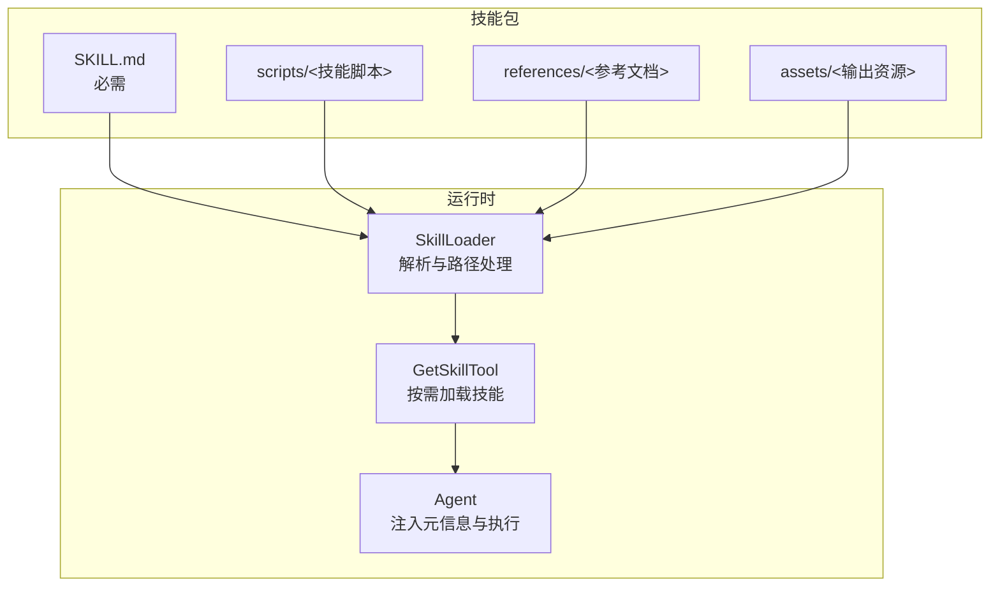
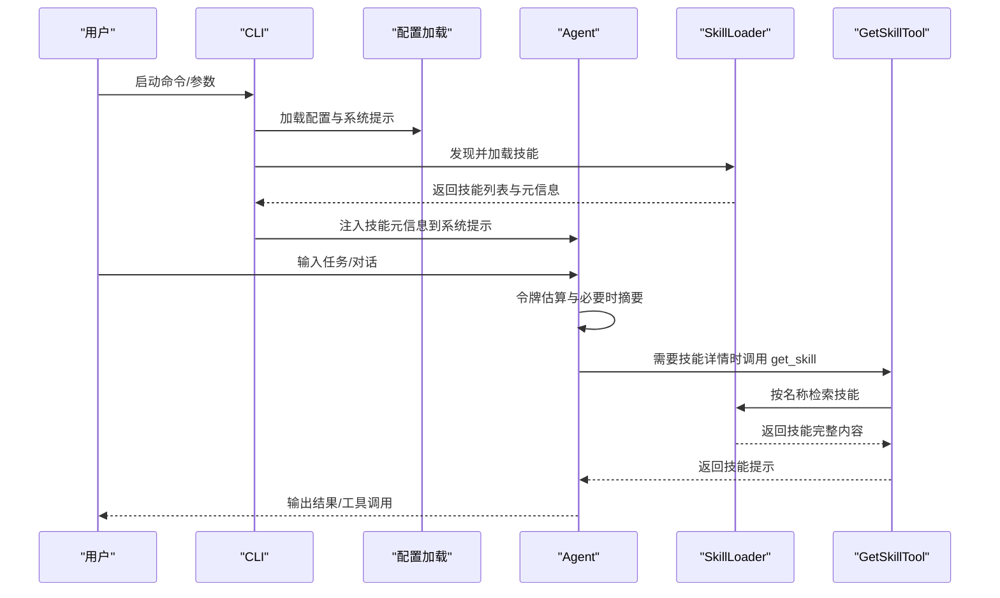
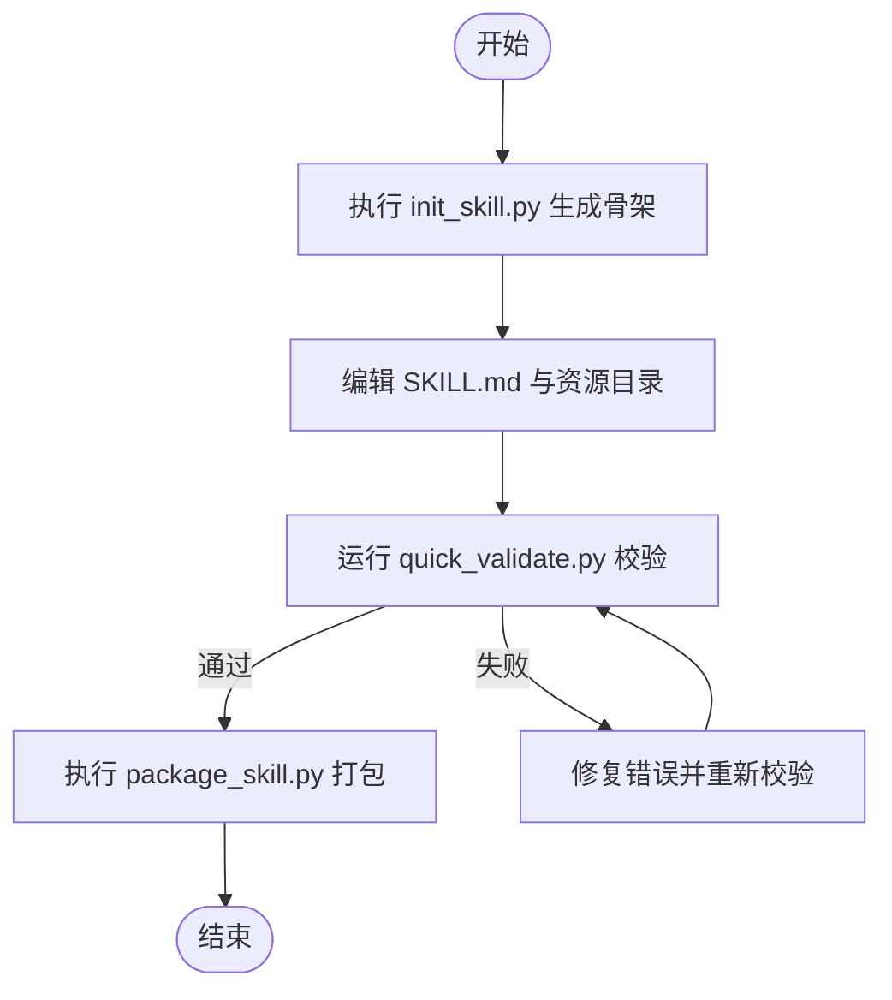
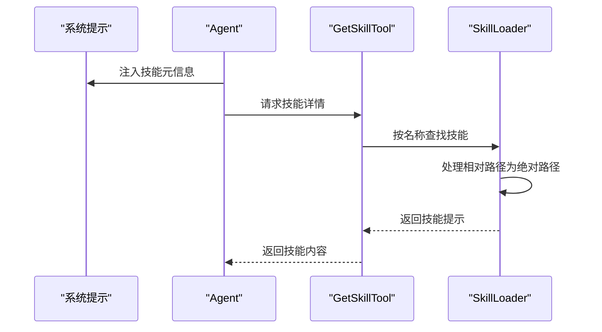
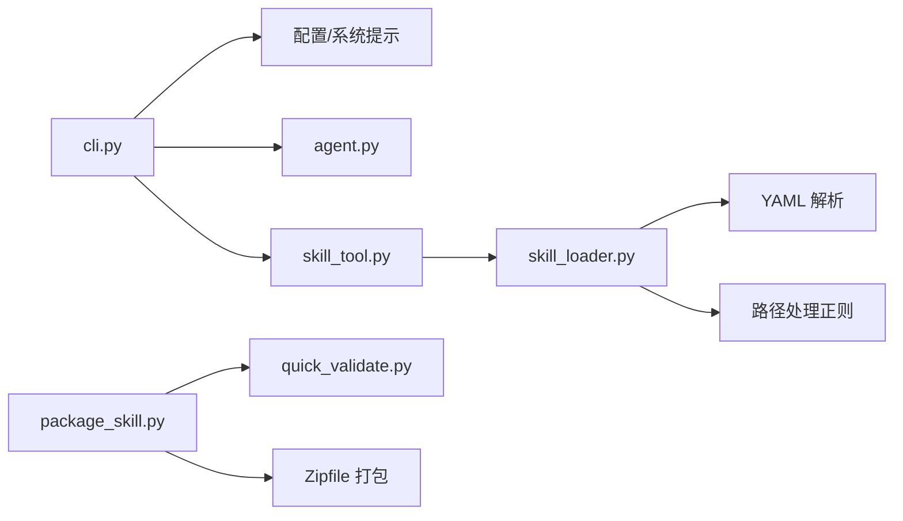

# 开发流程

<cite>
**本文引用的文件**
- [README.md](file://README.md)
- [DEVELOPMENT_GUIDE.md](file://docs/DEVELOPMENT_GUIDE.md)
- [PRODUCTION_GUIDE.md](file://docs/PRODUCTION_GUIDE.md)
- [cli.py](file://mini_agent/cli.py)
- [agent.py](file://mini_agent/agent.py)
- [skill_loader.py](file://mini_agent/tools/skill_loader.py)
- [skill_tool.py](file://mini_agent/tools/skill_tool.py)
- [init_skill.py](file://mini_agent/skills/skill-creator/scripts/init_skill.py)
- [package_skill.py](file://mini_agent/skills/skill-creator/scripts/package_skill.py)
- [quick_validate.py](file://mini_agent/skills/skill-creator/scripts/quick_validate.py)
- [SKILL.md（模板）](file://mini_agent/skills/template-skill/SKILL.md)
- [SKILL.md（技能创建器）](file://mini_agent/skills/skill-creator/SKILL.md)
- [SKILL.md（工件构建器）](file://mini_agent/skills/artifacts-builder/SKILL.md)
- [SKILL.md（品牌规范）](file://mini_agent/skills/brand-guidelines/SKILL.md)
- [SKILL.md（画布设计）](file://mini_agent/skills/canvas-design/SKILL.md)
- [SKILL.md（DOCX 技能）](file://mini_agent/skills/document-skills/docx/SKILL.md)
- [SKILL.md（主题工厂）](file://mini_agent/skills/theme-factory/SKILL.md)
- [THIRD_PARTY_NOTICES.md](file://mini_agent/skills/THIRD_PARTY_NOTICES.md)
</cite>

## 目录
1. [简介](#简介)
2. [项目结构](#项目结构)
3. [核心组件](#核心组件)
4. [架构总览](#架构总览)
5. [详细组件分析](#详细组件分析)
6. [依赖关系分析](#依赖关系分析)
7. [性能考量](#性能考量)
8. [故障排查指南](#故障排查指南)
9. [结论](#结论)
10. [附录](#附录)

## 简介
本指南面向希望在 MiniAgent 基础上进行“技能开发”的开发者，系统化地给出从项目初始化、结构设计、内容编写、测试验证到打包发布的全流程方法论与实践路径。文档同时提供模板技能的使用方式、定制建议、注意事项与常见陷阱，并结合仓库内现有技能示例讲解如何高效组织 SKILL.md 与资源目录（scripts、references、assets），以及如何通过工具链完成技能的快速迭代与发布。

## 项目结构
MiniAgent 的技能体系以“技能包”为单位组织，每个技能包包含：
- 必需文件：SKILL.md（含 YAML 前言元数据）
- 可选资源：scripts/（可执行脚本）、references/（参考文档）、assets/（输出资源）

技能加载器负责解析 SKILL.md 并注入到系统提示词中，实现“渐进披露”（Progressive Disclosure）：先暴露元信息，再按需加载全文与资源。

图示来源
- [skill_loader.py:15-257](file://mini_agent/tools/skill_loader.py#L15-L257)
- [skill_tool.py:13-85](file://mini_agent/tools/skill_tool.py#L13-L85)
- [agent.py:45-524](file://mini_agent/agent.py#L45-L524)

章节来源
- [skill_loader.py:15-257](file://mini_agent/tools/skill_loader.py#L15-L257)
- [skill_tool.py:13-85](file://mini_agent/tools/skill_tool.py#L13-L85)
- [agent.py:45-524](file://mini_agent/agent.py#L45-L524)

## 核心组件
- CLI 启动与会话管理：负责加载配置、初始化工具集（含技能工具）、注入系统提示词、进入交互循环或非交互任务执行。
- Agent 执行引擎：负责消息历史管理、令牌估算与摘要、工具调用、日志记录与取消控制。
- 技能加载器：解析 SKILL.md、提取元数据、处理相对路径、生成技能提示。
- 技能工具：提供按需加载技能的能力，配合系统提示词实现“元信息优先”的渐进披露。

章节来源
- [cli.py:486-800](file://mini_agent/cli.py#L486-L800)
- [agent.py:45-524](file://mini_agent/agent.py#L45-L524)
- [skill_loader.py:47-257](file://mini_agent/tools/skill_loader.py#L47-L257)
- [skill_tool.py:13-85](file://mini_agent/tools/skill_tool.py#L13-L85)

## 架构总览
下图展示了从启动到技能加载的关键调用序列：

图示来源
- [cli.py:574-630](file://mini_agent/cli.py#L574-L630)
- [agent.py:180-320](file://mini_agent/agent.py#L180-L320)
- [skill_loader.py:194-257](file://mini_agent/tools/skill_loader.py#L194-L257)
- [skill_tool.py:40-55](file://mini_agent/tools/skill_tool.py#L40-L55)

## 详细组件分析

### 技能创建与模板使用
- 使用初始化脚本快速生成新技能骨架，包含 SKILL.md 模板与示例资源目录，便于后续定制。
- 初始化后应完成元数据填写（name/description），并根据需要保留或删除示例资源。
- 完成内容后，使用快速校验脚本检查元数据格式与命名规范；通过后再进行打包分发。

图示来源
- [init_skill.py:194-304](file://mini_agent/skills/skill-creator/scripts/init_skill.py#L194-L304)
- [quick_validate.py:11-65](file://mini_agent/skills/skill-creator/scripts/quick_validate.py#L11-L65)
- [package_skill.py:19-111](file://mini_agent/skills/skill-creator/scripts/package_skill.py#L19-L111)

章节来源
- [SKILL.md（模板）:1-7](file://mini_agent/skills/template-skill/SKILL.md#L1-L7)
- [SKILL.md（技能创建器）:1-210](file://mini_agent/skills/skill-creator/SKILL.md#L1-L210)
- [init_skill.py:194-304](file://mini_agent/skills/skill-creator/scripts/init_skill.py#L194-L304)
- [quick_validate.py:11-65](file://mini_agent/skills/skill-creator/scripts/quick_validate.py#L11-L65)
- [package_skill.py:19-111](file://mini_agent/skills/skill-creator/scripts/package_skill.py#L19-L111)

### 渐进式披露与技能加载机制
- 元信息级披露（Level 1）：系统提示词中列出可用技能名称与描述，不加载正文。
- 按需披露（Level 2）：Agent 通过工具请求具体技能内容，SkillLoader 将技能正文转为提示格式返回。
- 资源路径处理（Level 3+）：SkillLoader 将相对路径转换为绝对路径，支持脚本、参考文档与资产的直接访问。

图示来源
- [skill_loader.py:119-193](file://mini_agent/tools/skill_loader.py#L119-L193)
- [skill_tool.py:40-54](file://mini_agent/tools/skill_tool.py#L40-L54)
- [agent.py:589-602](file://mini_agent/agent.py#L589-L602)

章节来源
- [skill_loader.py:119-193](file://mini_agent/tools/skill_loader.py#L119-L193)
- [skill_tool.py:40-54](file://mini_agent/tools/skill_tool.py#L40-L54)
- [agent.py:589-602](file://mini_agent/agent.py#L589-L602)

### 实际技能示例与最佳实践
- 工件构建器：提供前端工件的初始化、开发、打包与展示流程，强调“多组件复杂工件”的场景。
- 品牌规范：提供官方品牌色彩与字体规范，强调视觉一致性与可读性。
- 画布设计：指导如何从“设计哲学”到“画布表达”，强调极简文本与空间表达。
- DOCX 技能：提供阅读、创建、编辑、跟踪修订与图像转换等完整工作流。
- 主题工厂：提供预设主题与自定义主题能力，强调一致性与可复用性。

章节来源
- [SKILL.md（工件构建器）:1-74](file://mini_agent/skills/artifacts-builder/SKILL.md#L1-L74)
- [SKILL.md（品牌规范）:1-74](file://mini_agent/skills/brand-guidelines/SKILL.md#L1-L74)
- [SKILL.md（画布设计）:1-130](file://mini_agent/skills/canvas-design/SKILL.md#L1-L130)
- [SKILL.md（DOCX 技能）:1-197](file://mini_agent/skills/document-skills/docx/SKILL.md#L1-L197)
- [SKILL.md（主题工厂）:1-60](file://mini_agent/skills/theme-factory/SKILL.md#L1-L60)

### 开发流程与步骤清单
- 项目初始化
  - 使用初始化脚本生成技能骨架
  - 编写 SKILL.md 元数据与正文
  - 组织 scripts/references/assets 资源
- 内容编写
  - 明确技能用途与触发条件
  - 采用“指令式/动词开头”的写作风格
  - 将重复性逻辑放入 scripts，细节知识放入 references，输出资源放入 assets
- 测试验证
  - 使用快速校验脚本确保元数据与命名规范
  - 在本地 Agent 中加载技能进行功能验证
- 打包发布
  - 使用打包脚本生成可分发 zip 包
  - 分发前再次校验，确保目录结构与文件完整性

章节来源
- [SKILL.md（技能创建器）:87-210](file://mini_agent/skills/skill-creator/SKILL.md#L87-L210)
- [quick_validate.py:11-65](file://mini_agent/skills/skill-creator/scripts/quick_validate.py#L11-L65)
- [package_skill.py:19-111](file://mini_agent/skills/skill-creator/scripts/package_skill.py#L19-L111)

### 第三方组件与许可证管理
- 技能包内可包含第三方组件（如前端构建工具、字体、模板等），需在相应技能的 LICENSE.txt 或 THIRD_PARTY_NOTICES.md 中明确标注。
- 在 SKILL.md 中声明许可条款，确保使用者了解使用范围与限制。
- 发布前核对所有外部依赖的许可证兼容性，避免法律风险。

章节来源
- [THIRD_PARTY_NOTICES.md](file://mini_agent/skills/THIRD_PARTY_NOTICES.md)
- [SKILL.md（工件构建器）:1-74](file://mini_agent/skills/artifacts-builder/SKILL.md#L1-L74)
- [SKILL.md（主题工厂）:1-60](file://mini_agent/skills/theme-factory/SKILL.md#L1-L60)

## 依赖关系分析
- CLI 依赖配置加载、工具初始化与 MCP/技能加载模块。
- Agent 依赖 LLM 客户端、工具集合与日志记录。
- 技能工具依赖 SkillLoader；SkillLoader 依赖 YAML 解析与路径处理正则。
- 打包脚本依赖快速校验脚本与 Python Zipfile。

图示来源
- [cli.py:338-431](file://mini_agent/cli.py#L338-L431)
- [agent.py:45-120](file://mini_agent/agent.py#L45-L120)
- [skill_tool.py:57-85](file://mini_agent/tools/skill_tool.py#L57-L85)
- [skill_loader.py:119-193](file://mini_agent/tools/skill_loader.py#L119-L193)
- [package_skill.py:19-83](file://mini_agent/skills/skill-creator/scripts/package_skill.py#L19-L83)
- [quick_validate.py:11-65](file://mini_agent/skills/skill-creator/scripts/quick_validate.py#L11-L65)

章节来源
- [cli.py:338-431](file://mini_agent/cli.py#L338-L431)
- [agent.py:45-120](file://mini_agent/agent.py#L45-L120)
- [skill_tool.py:57-85](file://mini_agent/tools/skill_tool.py#L57-L85)
- [skill_loader.py:119-193](file://mini_agent/tools/skill_loader.py#L119-L193)
- [package_skill.py:19-83](file://mini_agent/skills/skill-creator/scripts/package_skill.py#L19-L83)
- [quick_validate.py:11-65](file://mini_agent/skills/skill-creator/scripts/quick_validate.py#L11-L65)

## 性能考量
- 令牌估算与摘要：当消息历史接近阈值时自动摘要，减少上下文开销，提升长对话稳定性。
- 渐进披露：仅在需要时加载技能正文与资源，降低初始上下文占用。
- 日志与统计：提供详细的会话统计与日志查看能力，便于定位性能瓶颈。

章节来源
- [agent.py:180-320](file://mini_agent/agent.py#L180-L320)
- [cli.py:261-283](file://mini_agent/cli.py#L261-L283)

## 故障排查指南
- SSL 证书问题：开发阶段可临时关闭校验，生产环境请更新证书或配置代理。
- 模块导入错误：确保在项目根目录运行，避免相对导入导致的模块解析失败。
- 技能加载失败：检查 SKILL.md 是否存在 YAML 前言、字段是否完整、命名是否符合规范。
- 打包失败：确认技能目录结构正确、资源文件存在且未被忽略。

章节来源
- [README.md:284-311](file://README.md#L284-L311)
- [quick_validate.py:11-65](file://mini_agent/skills/skill-creator/scripts/quick_validate.py#L11-L65)
- [package_skill.py:32-54](file://mini_agent/skills/skill-creator/scripts/package_skill.py#L32-L54)

## 结论
通过标准化的技能开发流程与工具链，开发者可以高效地创建、验证与发布高质量技能。遵循渐进披露原则、合理组织资源目录、严格进行元数据与命名校验，是保证技能质量与可维护性的关键。结合仓库内的示例技能，可快速上手并扩展到更复杂的业务场景。

## 附录
- 快速开始与开发模式说明参见项目根 README。
- 更多开发与生产部署指南参见 docs 目录下的开发与生产指南文档。

章节来源
- [README.md:43-211](file://README.md#L43-L211)
- [DEVELOPMENT_GUIDE.md](file://docs/DEVELOPMENT_GUIDE.md)
- [PRODUCTION_GUIDE.md](file://docs/PRODUCTION_GUIDE.md)