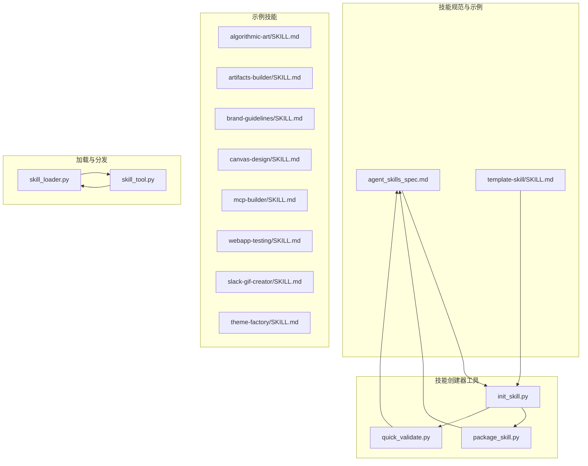
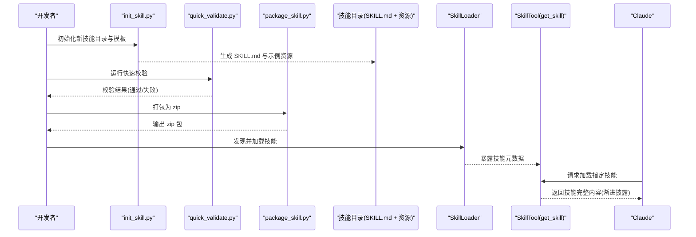
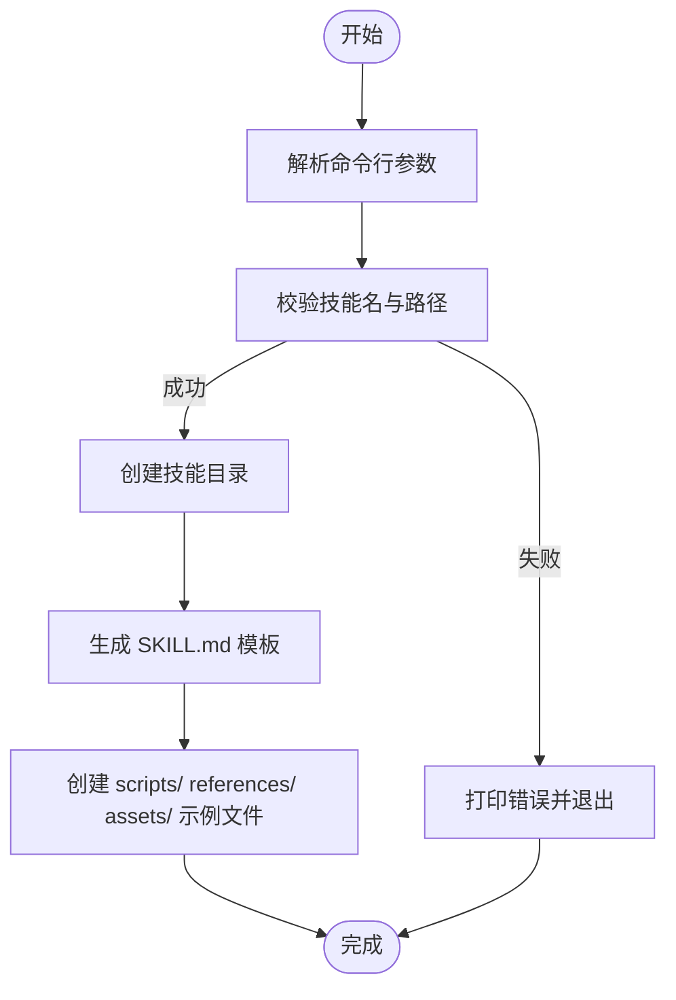
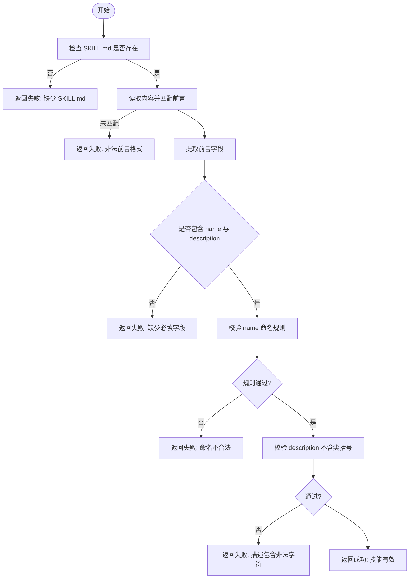
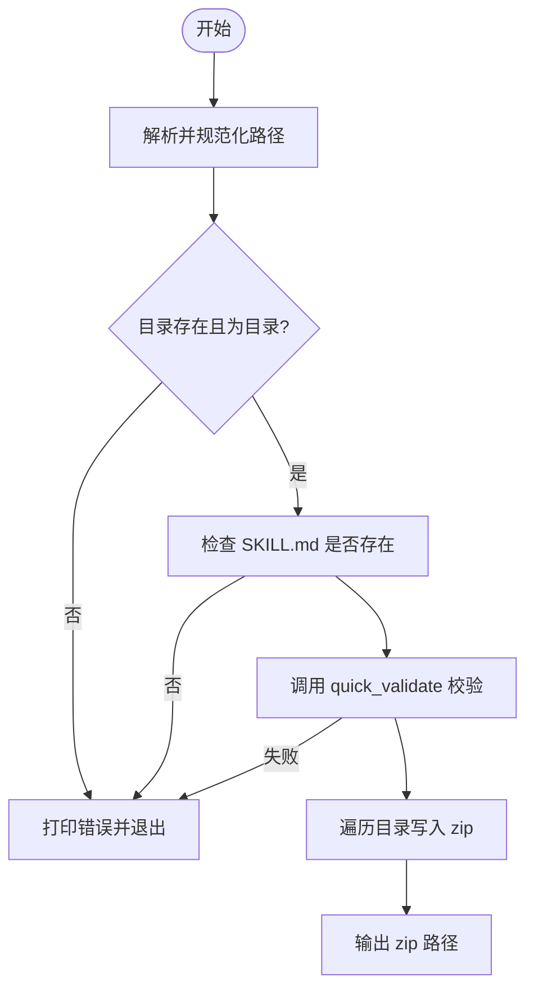
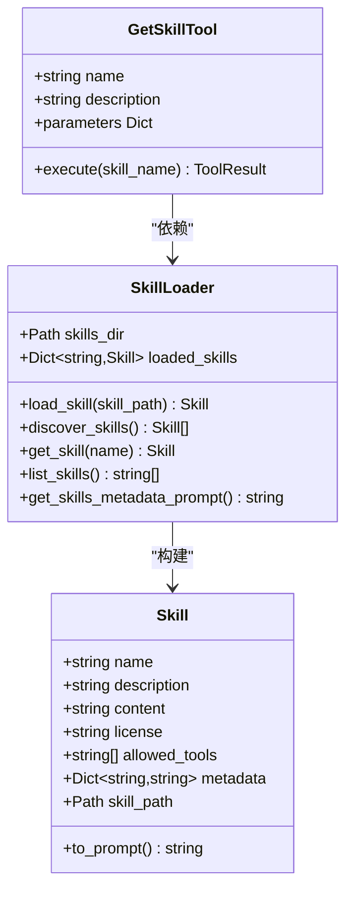
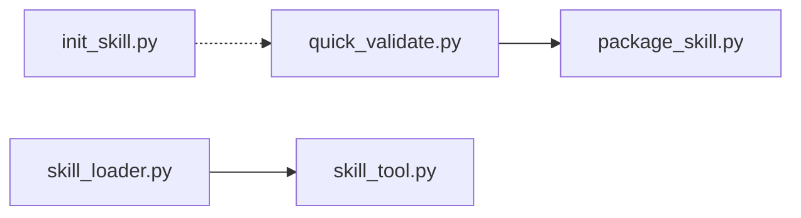

# 技能开发

<cite>
**本文引用的文件**
- [agent_skills_spec.md](file://mini_agent/skills/agent_skills_spec.md)
- [init_skill.py](file://mini_agent/skills/skill-creator/scripts/init_skill.py)
- [package_skill.py](file://mini_agent/skills/skill-creator/scripts/package_skill.py)
- [quick_validate.py](file://mini_agent/skills/skill-creator/scripts/quick_validate.py)
- [template-skill/SKILL.md](file://mini_agent/skills/template-skill/SKILL.md)
- [algorithmic-art/SKILL.md](file://mini_agent/skills/algorithmic-art/SKILL.md)
- [artifacts-builder/SKILL.md](file://mini_agent/skills/artifacts-builder/SKILL.md)
- [brand-guidelines/SKILL.md](file://mini_agent/skills/brand-guidelines/SKILL.md)
- [canvas-design/SKILL.md](file://mini_agent/skills/canvas-design/SKILL.md)
- [mcp-builder/SKILL.md](file://mini_agent/skills/mcp-builder/SKILL.md)
- [webapp-testing/SKILL.md](file://mini_agent/skills/webapp-testing/SKILL.md)
- [slack-gif-creator/SKILL.md](file://mini_agent/skills/slack-gif-creator/SKILL.md)
- [theme-factory/SKILL.md](file://mini_agent/skills/theme-factory/SKILL.md)
- [skill_loader.py](file://mini_agent/tools/skill_loader.py)
- [skill_tool.py](file://mini_agent/tools/skill_tool.py)
</cite>

## 目录
1. [简介](#简介)
2. [项目结构](#项目结构)
3. [核心组件](#核心组件)
4. [架构总览](#架构总览)
5. [详细组件分析](#详细组件分析)
6. [依赖分析](#依赖分析)
7. [性能考虑](#性能考虑)
8. [故障排查指南](#故障排查指南)
9. [结论](#结论)
10. [附录](#附录)

## 简介
本指南面向希望基于 MiniAgent 与 Claude Skills 规范进行“技能”开发的工程师与内容创作者。技能是包含指令、脚本与资源的目录，Claude 可动态发现并加载以完成特定任务。本指南系统讲解：
- SKILL.md 文件格式与 YAML 前言结构
- 内容组织与元数据定义
- 技能开发流程（初始化、模板使用、内容编写、质量验证）
- 技能创建器工具链（init_skill.py、package_skill.py、quick_validate.py）
- 最佳实践（代码组织、文档编写、测试策略、发布流程）
- 完整开发示例与调试技巧

## 项目结构
技能相关能力主要分布在以下位置：
- 规范与示例：mini_agent/skills/agent_skills_spec.md、template-skill/SKILL.md
- 示例技能：algorithmic-art、artifacts-builder、brand-guidelines、canvas-design、mcp-builder、webapp-testing、slack-gif-creator、theme-factory
- 工具链：skill-creator/scripts 下的 init_skill.py、package_skill.py、quick_validate.py
- 加载与分发：tools/skill_loader.py、tools/skill_tool.py

图表来源
- [agent_skills_spec.md:1-56](file://mini_agent/skills/agent_skills_spec.md#L1-L56)
- [init_skill.py:1-304](file://mini_agent/skills/skill-creator/scripts/init_skill.py#L1-L304)
- [package_skill.py:1-111](file://mini_agent/skills/skill-creator/scripts/package_skill.py#L1-L111)
- [quick_validate.py:1-65](file://mini_agent/skills/skill-creator/scripts/quick_validate.py#L1-L65)
- [skill_loader.py:1-257](file://mini_agent/tools/skill_loader.py#L1-L257)
- [skill_tool.py:1-85](file://mini_agent/tools/skill_tool.py#L1-L85)

章节来源
- [agent_skills_spec.md:1-56](file://mini_agent/skills/agent_skills_spec.md#L1-L56)
- [init_skill.py:1-304](file://mini_agent/skills/skill-creator/scripts/init_skill.py#L1-L304)
- [package_skill.py:1-111](file://mini_agent/skills/skill-creator/scripts/package_skill.py#L1-L111)
- [quick_validate.py:1-65](file://mini_agent/skills/skill-creator/scripts/quick_validate.py#L1-L65)
- [skill_loader.py:1-257](file://mini_agent/tools/skill_loader.py#L1-L257)
- [skill_tool.py:1-85](file://mini_agent/tools/skill_tool.py#L1-L85)

## 核心组件
- SKILL.md 规范与 YAML 前言
  - 必填字段：name（连字符命名）、description（说明用途与触发场景）
  - 可选字段：license、allowed-tools（Claude Code 支持）、metadata（客户端扩展键值）
  - 正文无限制，可包含多级标题、列表、代码块、链接等
- 技能目录布局
  - 至少包含 SKILL.md；可选 scripts/、references/、assets/ 等资源目录
- 技能加载器
  - 解析 SKILL.md YAML 前言，提取元数据与正文
  - 对相对路径进行绝对化处理，支持目录与文档引用
  - 提供“渐进披露”式加载（仅在需要时加载完整内容）

章节来源
- [agent_skills_spec.md:17-47](file://mini_agent/skills/agent_skills_spec.md#L17-L47)
- [skill_loader.py:15-118](file://mini_agent/tools/skill_loader.py#L15-L118)
- [skill_loader.py:119-192](file://mini_agent/tools/skill_loader.py#L119-L192)

## 架构总览
技能从“创建-验证-打包-加载-执行”的闭环流程如下：

图表来源
- [init_skill.py:194-270](file://mini_agent/skills/skill-creator/scripts/init_skill.py#L194-L270)
- [quick_validate.py:11-56](file://mini_agent/skills/skill-creator/scripts/quick_validate.py#L11-L56)
- [package_skill.py:19-83](file://mini_agent/skills/skill-creator/scripts/package_skill.py#L19-L83)
- [skill_loader.py:47-118](file://mini_agent/tools/skill_loader.py#L47-L118)
- [skill_tool.py:13-54](file://mini_agent/tools/skill_tool.py#L13-L54)

## 详细组件分析

### 组件一：SKILL.md 规范与 YAML 前言
- 必填项
  - name：连字符命名、小写英数字+短横线、与目录名一致
  - description：说明技能做什么以及何时使用
- 可选项
  - license：许可证标识或捆绑许可证文件名
  - allowed-tools：预批准工具清单（Claude Code 支持）
  - metadata：字符串键值对，用于客户端扩展属性
- 正文建议结构
  - 概述、工作流/任务/参考/能力结构化章节、资源说明、示例与最佳实践

章节来源
- [agent_skills_spec.md:21-47](file://mini_agent/skills/agent_skills_spec.md#L21-L47)
- [template-skill/SKILL.md:1-7](file://mini_agent/skills/template-skill/SKILL.md#L1-L7)

### 组件二：技能创建器 init_skill.py
- 功能
  - 创建技能目录与 SKILL.md 模板
  - 自动创建 scripts/、references/、assets/ 示例子目录与文件
  - 校验输入参数与目录存在性
- 使用方式
  - init_skill.py <技能名> --path <输出路径>
  - 要求：连字符命名、小写+短横线、最大长度限制、与目录名一致
- 输出
  - 成功后提示下一步：编辑 SKILL.md、自定义示例文件、运行验证器

图表来源
- [init_skill.py:273-304](file://mini_agent/skills/skill-creator/scripts/init_skill.py#L273-L304)
- [init_skill.py:194-270](file://mini_agent/skills/skill-creator/scripts/init_skill.py#L194-L270)

章节来源
- [init_skill.py:1-304](file://mini_agent/skills/skill-creator/scripts/init_skill.py#L1-L304)

### 组件三：快速验证 quick_validate.py
- 校验要点
  - 存在 SKILL.md
  - 存在 YAML 前言定界符
  - 提取前言并检查必填字段 name 与 description
  - 校验 name 命名规则（连字符、小写、无连续短横线）
  - 校验 description 不含尖括号
- 输出
  - 返回布尔值与消息，供其他流程调用

图表来源
- [quick_validate.py:11-56](file://mini_agent/skills/skill-creator/scripts/quick_validate.py#L11-L56)

章节来源
- [quick_validate.py:1-65](file://mini_agent/skills/skill-creator/scripts/quick_validate.py#L1-L65)

### 组件四：打包工具 package_skill.py
- 功能
  - 校验技能目录存在且包含 SKILL.md
  - 调用 quick_validate 进行前置校验
  - 将技能目录压缩为 zip 文件（按相对路径写入）
- 使用方式
  - package_skill.py <技能目录> [输出目录]
- 输出
  - 成功时返回 zip 文件路径，失败时打印错误信息

图表来源
- [package_skill.py:19-83](file://mini_agent/skills/skill-creator/scripts/package_skill.py#L19-L83)

章节来源
- [package_skill.py:1-111](file://mini_agent/skills/skill-creator/scripts/package_skill.py#L1-L111)

### 组件五：技能加载器 skill_loader.py 与工具 skill_tool.py
- SkillLoader
  - 递归发现 skills 目录下的所有 SKILL.md
  - 解析 YAML 前言，构建 Skill 数据类
  - 处理相对路径（scripts/、references/、assets/ 与文档引用），统一为绝对路径
  - 提供“渐进披露”式元数据提示（仅列出名称与描述）
- SkillTool(get_skill)
  - 仅暴露 get_skill 工具，按需加载完整技能内容
  - 通过系统提示中的元数据引导 Claude 选择合适技能

图表来源
- [skill_loader.py:15-118](file://mini_agent/tools/skill_loader.py#L15-L118)
- [skill_loader.py:194-257](file://mini_agent/tools/skill_loader.py#L194-L257)
- [skill_tool.py:13-54](file://mini_agent/tools/skill_tool.py#L13-L54)

章节来源
- [skill_loader.py:1-257](file://mini_agent/tools/skill_loader.py#L1-L257)
- [skill_tool.py:1-85](file://mini_agent/tools/skill_tool.py#L1-L85)

### 组件六：示例技能与最佳实践
- algorithmic-art：强调“算法哲学”到“p5.js 实现”的两阶段创作流程，模板复用与参数化控制
- artifacts-builder：前端复杂 artifact 的初始化、打包与单文件内联策略
- brand-guidelines：品牌色与字体应用指南，确保一致性
- canvas-design：视觉设计哲学到 PDF/PNG 的表达流程
- mcp-builder：MCP 服务器开发的全流程（研究-规划-实现-评审-评估）
- webapp-testing：Playwright 测试与服务器生命周期管理
- slack-gif-creator：GIF 尺寸约束下的动画原语组合与验证
- theme-factory：主题展示与应用流程

章节来源
- [algorithmic-art/SKILL.md:1-405](file://mini_agent/skills/algorithmic-art/SKILL.md#L1-L405)
- [artifacts-builder/SKILL.md:1-74](file://mini_agent/skills/artifacts-builder/SKILL.md#L1-L74)
- [brand-guidelines/SKILL.md:1-74](file://mini_agent/skills/brand-guidelines/SKILL.md#L1-L74)
- [canvas-design/SKILL.md:1-130](file://mini_agent/skills/canvas-design/SKILL.md#L1-L130)
- [mcp-builder/SKILL.md:1-329](file://mini_agent/skills/mcp-builder/SKILL.md#L1-L329)
- [webapp-testing/SKILL.md:1-96](file://mini_agent/skills/webapp-testing/SKILL.md#L1-L96)
- [slack-gif-creator/SKILL.md:1-647](file://mini_agent/skills/slack-gif-creator/SKILL.md#L1-L647)
- [theme-factory/SKILL.md:1-60](file://mini_agent/skills/theme-factory/SKILL.md#L1-L60)

## 依赖分析
- 工具链内部依赖
  - package_skill.py 依赖 quick_validate.py 进行前置校验
  - init_skill.py 与 quick_validate.py 独立运行，分别负责“创建模板”和“快速校验”
- 运行时依赖
  - SkillLoader 依赖 YAML 解析与正则替换，处理相对路径与文档引用
  - SkillTool 仅在 Claude 请求时加载完整技能内容，避免上下文污染

图表来源
- [package_skill.py:16-49](file://mini_agent/skills/skill-creator/scripts/package_skill.py#L16-L49)
- [quick_validate.py:1-65](file://mini_agent/skills/skill-creator/scripts/quick_validate.py#L1-L65)
- [skill_loader.py:1-257](file://mini_agent/tools/skill_loader.py#L1-L257)
- [skill_tool.py:1-85](file://mini_agent/tools/skill_tool.py#L1-L85)

章节来源
- [package_skill.py:1-111](file://mini_agent/skills/skill-creator/scripts/package_skill.py#L1-L111)
- [quick_validate.py:1-65](file://mini_agent/skills/skill-creator/scripts/quick_validate.py#L1-L65)
- [skill_loader.py:1-257](file://mini_agent/tools/skill_loader.py#L1-L257)
- [skill_tool.py:1-85](file://mini_agent/tools/skill_tool.py#L1-L85)

## 性能考虑
- 渐进披露（Progressive Disclosure）
  - 元数据提示仅列出名称与描述，避免过早加载完整内容
  - 按需加载完整技能内容，减少 Claude 上下文占用
- 路径处理
  - 将相对路径转换为绝对路径，便于脚本与资源定位，降低运行时查找成本
- 打包与分发
  - 打包时仅包含必要文件，避免冗余资源进入分发包

[本节为通用指导，无需特定文件分析]

## 故障排查指南
- 常见问题与修复
  - 缺少 SKILL.md：确保技能根目录包含该文件
  - 前言缺失或格式错误：确认 YAML 前言使用定界符，字段齐全
  - name 命名不合法：仅允许小写字母、数字与短横线，不可开头/结尾为短横线或包含连续短横线
  - description 含尖括号：移除 < 或 >
  - 资源路径无法解析：使用 scripts/、references/、assets/ 目录或文档引用语法
- 调试步骤
  - 使用 quick_validate.py 对技能目录进行快速校验
  - 使用 package_skill.py 打包前先本地校验，避免打包后才发现问题
  - 在 Claude 中通过 get_skill 工具按需加载技能，观察上下文窗口占用与响应质量

章节来源
- [quick_validate.py:11-56](file://mini_agent/skills/skill-creator/scripts/quick_validate.py#L11-L56)
- [package_skill.py:47-54](file://mini_agent/skills/skill-creator/scripts/package_skill.py#L47-L54)
- [skill_loader.py:119-192](file://mini_agent/tools/skill_loader.py#L119-L192)
- [skill_tool.py:40-54](file://mini_agent/tools/skill_tool.py#L40-L54)

## 结论
通过遵循 Claude Skills 规范与使用技能创建器工具链，开发者可以高效地初始化、验证、打包并分发高质量技能。结合示例技能的最佳实践，可在不同领域（如算法艺术、前端 artifact、品牌风格、MCP 服务、Web 应用测试、GIF 制作、主题工厂）中快速落地。建议在开发过程中坚持“最小可用 + 渐进披露 + 质量优先”的原则，确保技能既易用又可靠。

[本节为总结，无需特定文件分析]

## 附录

### 开发流程速查
- 初始化
  - 使用 init_skill.py 生成模板目录与 SKILL.md
- 编写与组织
  - 完成 YAML 前言与正文结构，合理划分 scripts/、references/、assets/
- 质量验证
  - 使用 quick_validate.py 进行快速校验
- 打包与分发
  - 使用 package_skill.py 生成 zip 包
- 加载与执行
  - 通过 SkillLoader 与 SkillTool 在 Claude 中按需加载技能

章节来源
- [init_skill.py:273-304](file://mini_agent/skills/skill-creator/scripts/init_skill.py#L273-L304)
- [quick_validate.py:58-65](file://mini_agent/skills/skill-creator/scripts/quick_validate.py#L58-L65)
- [package_skill.py:85-111](file://mini_agent/skills/skill-creator/scripts/package_skill.py#L85-L111)
- [skill_loader.py:194-257](file://mini_agent/tools/skill_loader.py#L194-L257)
- [skill_tool.py:57-85](file://mini_agent/tools/skill_tool.py#L57-L85)