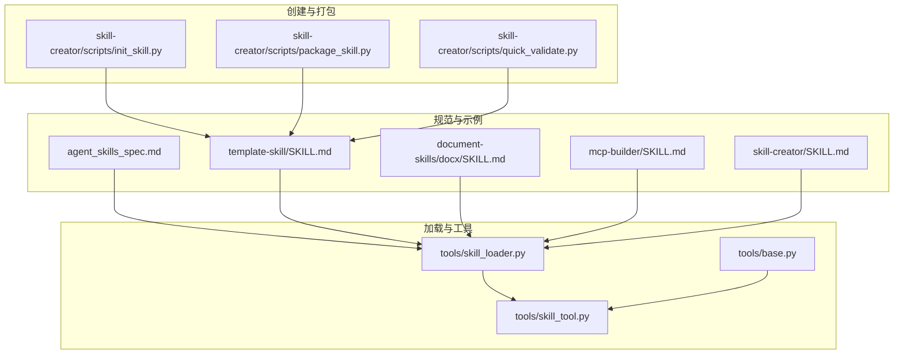
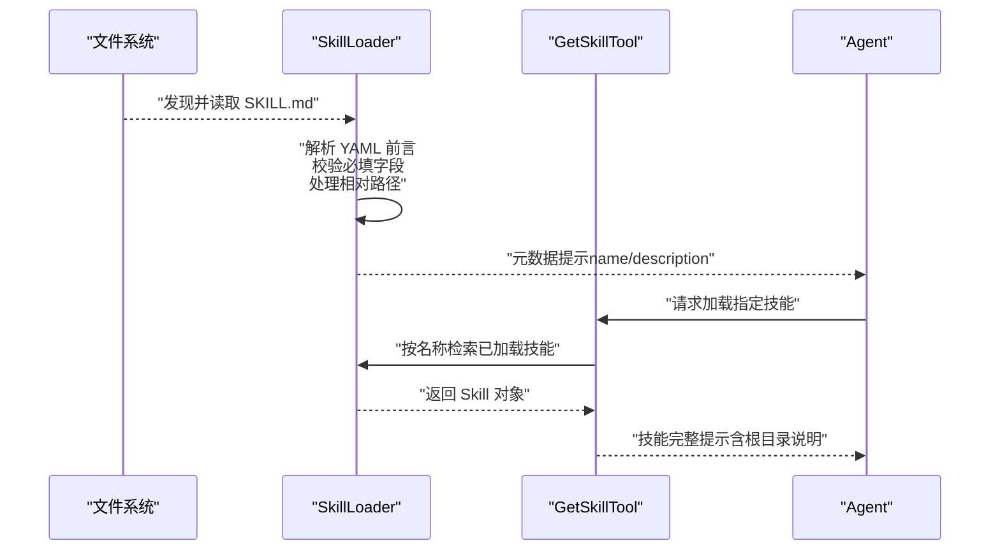
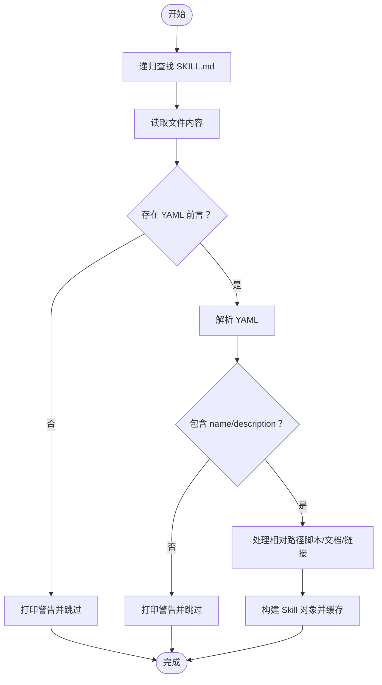
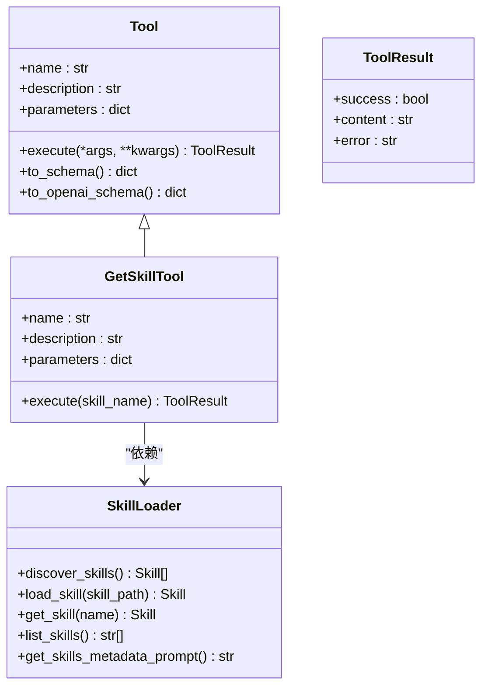

# 技能规范

<cite>
**本文引用的文件**
- [agent_skills_spec.md](file://mini_agent/agent_skills_spec.md)
- [skill_loader.py](file://mini_agent/tools/skill_loader.py)
- [skill_tool.py](file://mini_agent/tools/skill_tool.py)
- [base.py](file://mini_agent/tools/base.py)
- [SKILL.md（模板技能）](file://mini_agent/skills/template-skill/SKILL.md)
- [SKILL.md（DOCX 技能）](file://mini_agent/skills/document-skills/docx/SKILL.md)
- [SKILL.md（MCP 构建器）](file://mini_agent/skills/mcp-builder/SKILL.md)
- [SKILL.md（技能创建器）](file://mini_agent/skills/skill-creator/SKILL.md)
- [init_skill.py](file://mini_agent/skills/skill-creator/scripts/init_skill.py)
- [package_skill.py](file://mini_agent/skills/skill-creator/scripts/package_skill.py)
- [quick_validate.py](file://mini_agent/skills/skill-creator/scripts/quick_validate.py)
- [test_skill_loader.py](file://tests/test_skill_loader.py)
</cite>

## 目录
1. [简介](#简介)
2. [项目结构](#项目结构)
3. [核心组件](#核心组件)
4. [架构总览](#架构总览)
5. [详细组件分析](#详细组件分析)
6. [依赖分析](#依赖分析)
7. [性能考虑](#性能考虑)
8. [故障排查指南](#故障排查指南)
9. [结论](#结论)
10. [附录](#附录)

## 简介
本文件系统化阐述 Claude Skills 的规范与实现，覆盖技能的概念、目录布局、SKILL.md 前言结构、YAML 字段语义、发现与加载机制、与工具系统的集成方式，以及最佳实践与示例路径。目标是帮助开发者正确创建、打包与分发技能，并确保其在运行时被 Agent 正确识别与按需加载。

## 项目结构
- 技能规范与实现主要分布在以下位置：
  - 规范说明：mini_agent/agent_skills_spec.md
  - 技能加载器：mini_agent/tools/skill_loader.py
  - 技能工具（按需加载）：mini_agent/tools/skill_tool.py
  - 工具基类：mini_agent/tools/base.py
  - 示例技能：mini_agent/skills/*/SKILL.md
  - 技能创建与打包工具：mini_agent/skills/skill-creator/scripts/*

图表来源
- [agent_skills_spec.md:1-56](file://mini_agent/agent_skills_spec.md#L1-L56)
- [skill_loader.py:1-257](file://mini_agent/tools/skill_loader.py#L1-L257)
- [skill_tool.py:1-85](file://mini_agent/tools/skill_tool.py#L1-L85)
- [base.py:1-56](file://mini_agent/tools/base.py#L1-L56)
- [init_skill.py:1-304](file://mini_agent/skills/skill-creator/scripts/init_skill.py#L1-L304)
- [package_skill.py:1-111](file://mini_agent/skills/skill-creator/scripts/package_skill.py#L1-L111)
- [quick_validate.py:1-65](file://mini_agent/skills/skill-creator/scripts/quick_validate.py#L1-L65)

章节来源
- [agent_skills_spec.md:1-56](file://mini_agent/agent_skills_spec.md#L1-L56)
- [skill_loader.py:1-257](file://mini_agent/tools/skill_loader.py#L1-L257)
- [skill_tool.py:1-85](file://mini_agent/tools/skill_tool.py#L1-L85)
- [base.py:1-56](file://mini_agent/tools/base.py#L1-L56)
- [init_skill.py:1-304](file://mini_agent/skills/skill-creator/scripts/init_skill.py#L1-L304)
- [package_skill.py:1-111](file://mini_agent/skills/skill-creator/scripts/package_skill.py#L1-L111)
- [quick_validate.py:1-65](file://mini_agent/skills/skill-creator/scripts/quick_validate.py#L1-L65)

## 核心组件
- 技能数据结构（Skill）
  - 字段：name、description、content、license（可选）、allowed-tools（可选）、metadata（可选）、skill_path（可选）
  - 转换为提示格式：to_prompt() 输出包含技能根目录路径与相对路径说明
- 技能加载器（SkillLoader）
  - 发现与加载：递归扫描 skills 目录下的所有 SKILL.md
  - 解析：提取 YAML 前言与正文；校验必填字段；处理相对路径（脚本、文档、链接等）
  - 缓存：按名称索引已加载技能
  - 元数据提示：生成仅含 name/description 的“渐进披露 Level 1”提示
- 技能工具（GetSkillTool）
  - 按需加载：通过工具调用获取完整技能内容（渐进披露 Level 2）

章节来源
- [skill_loader.py:15-45](file://mini_agent/tools/skill_loader.py#L15-L45)
- [skill_loader.py:47-257](file://mini_agent/tools/skill_loader.py#L47-L257)
- [skill_tool.py:13-85](file://mini_agent/tools/skill_tool.py#L13-L85)
- [base.py:8-56](file://mini_agent/tools/base.py#L8-L56)

## 架构总览
技能从磁盘文件到 Agent 可用的流程如下：

图表来源
- [skill_loader.py:60-118](file://mini_agent/tools/skill_loader.py#L60-L118)
- [skill_loader.py:194-214](file://mini_agent/tools/skill_loader.py#L194-L214)
- [skill_tool.py:40-54](file://mini_agent/tools/skill_tool.py#L40-L54)

## 详细组件分析

### 技能文件夹布局与必需文件
- 必需文件
  - SKILL.md：技能入口，必须以 YAML 前言开头，随后为 Markdown 正文
- 可选资源
  - scripts/：可执行脚本（Python/Bash 等），适合重复性或需要确定性的任务
  - references/：参考文档，按需加载入上下文
  - assets/：输出使用的资源（模板、图标、字体等），不直接加载到上下文
- 示例路径
  - 最小示例：template-skill/SKILL.md
  - 复杂示例：document-skills/docx/SKILL.md、mcp-builder/SKILL.md、skill-creator/SKILL.md

章节来源
- [agent_skills_spec.md:5-14](file://mini_agent/agent_skills_spec.md#L5-L14)
- [SKILL.md（模板技能）:1-7](file://mini_agent/skills/template-skill/SKILL.md#L1-L7)
- [SKILL.md（DOCX 技能）:1-197](file://mini_agent/skills/document-skills/docx/SKILL.md#L1-L197)
- [SKILL.md（MCP 构建器）:1-329](file://mini_agent/skills/mcp-builder/SKILL.md#L1-L329)
- [SKILL.md（技能创建器）:25-40](file://mini_agent/skills/skill-creator/SKILL.md#L25-L40)

### YAML 前言结构与字段语义
- 必需字段
  - name：短横线命名法（小写字母、数字、短横线），且与所在目录名一致
  - description：描述技能用途与触发场景
- 可选字段
  - license：技能采用的许可证标识或指向许可证文件
  - allowed-tools：在特定客户端中允许执行的工具列表（当前仅支持部分客户端）
  - metadata：键值对映射，用于存储未在规范中定义的扩展属性（建议键名具备唯一性）
- 示例路径
  - 基础前言：template-skill/SKILL.md
  - 包含可选字段：document-skills/docx/SKILL.md、mcp-builder/SKILL.md、skill-creator/SKILL.md

章节来源
- [agent_skills_spec.md:21-47](file://mini_agent/agent_skills_spec.md#L21-L47)
- [SKILL.md（模板技能）:1-7](file://mini_agent/skills/template-skill/SKILL.md#L1-L7)
- [SKILL.md（DOCX 技能）:1-5](file://mini_agent/skills/document-skills/docx/SKILL.md#L1-L5)
- [SKILL.md（MCP 构建器）:1-5](file://mini_agent/skills/mcp-builder/SKILL.md#L1-L5)
- [SKILL.md（技能创建器）:1-5](file://mini_agent/skills/skill-creator/SKILL.md#L1-L5)

### 渐进式披露（Progressive Disclosure）
- Level 1：仅暴露技能元数据（name/description），避免占用上下文窗口
- Level 2：按需加载完整技能内容（通过工具调用）
- Level 3+：对技能内相对路径进行绝对化处理，便于 Agent 在任意工作目录下访问脚本与资源

章节来源
- [skill_loader.py:237-257](file://mini_agent/tools/skill_loader.py#L237-L257)
- [skill_loader.py:194-214](file://mini_agent/tools/skill_loader.py#L194-L214)
- [skill_loader.py:119-193](file://mini_agent/tools/skill_loader.py#L119-L193)

### 技能发现与加载机制
- 发现策略：递归扫描 skills 目录下的所有 SKILL.md
- 加载流程：读取文件 → 提取 YAML 前言 → 校验必填字段 → 处理相对路径 → 构造 Skill 对象 → 缓存
- 错误处理：缺失前言、YAML 解析失败、缺少必填字段时打印警告并跳过

图表来源
- [skill_loader.py:60-118](file://mini_agent/tools/skill_loader.py#L60-L118)
- [skill_loader.py:194-214](file://mini_agent/tools/skill_loader.py#L194-L214)

章节来源
- [skill_loader.py:60-118](file://mini_agent/tools/skill_loader.py#L60-L118)
- [skill_loader.py:194-214](file://mini_agent/tools/skill_loader.py#L194-L214)
- [test_skill_loader.py:82-95](file://tests/test_skill_loader.py#L82-L95)

### 与工具系统的集成
- 工具基类：Tool/ToolResult 定义统一的工具接口与结果模型
- 技能工具：GetSkillTool 提供按名称获取技能的工具能力
- 创建流程：初始化加载器 → 自动发现技能 → 仅注册 get_skill 工具（实现 Level 2 渐进披露）

图表来源
- [base.py:16-56](file://mini_agent/tools/base.py#L16-L56)
- [skill_loader.py:47-257](file://mini_agent/tools/skill_loader.py#L47-L257)
- [skill_tool.py:13-85](file://mini_agent/tools/skill_tool.py#L13-L85)

章节来源
- [base.py:16-56](file://mini_agent/tools/base.py#L16-L56)
- [skill_tool.py:13-85](file://mini_agent/tools/skill_tool.py#L13-L85)
- [skill_loader.py:47-257](file://mini_agent/tools/skill_loader.py#L47-L257)

### 路径处理与资源引用（Level 3+）
- 支持的路径类型
  - 目录路径：scripts/、references/、assets/ 下的文件
  - 文档引用：正文中出现的文档名（如 forms.md、reference.md）
  - Markdown 链接：多种格式的链接，支持带前缀词与反引号包裹
- 处理逻辑
  - 将相对路径转换为绝对路径
  - 对文档引用添加“使用 read_file 打开”的提示
  - 保留链接文本风格，便于 Agent 理解与执行

章节来源
- [skill_loader.py:119-193](file://mini_agent/tools/skill_loader.py#L119-L193)
- [test_skill_loader.py:187-247](file://tests/test_skill_loader.py#L187-L247)

### 技能创建、验证与打包
- 初始化
  - 使用 init_skill.py 生成标准技能目录结构与模板 SKILL.md
  - 自动生成 scripts/、references/、assets/ 示例文件
- 验证
  - quick_validate.py 进行最小化校验：检查前言、必填字段、命名规范、描述合法性
- 打包
  - package_skill.py 在验证通过后将技能目录打包为 zip，便于分发

章节来源
- [init_skill.py:1-304](file://mini_agent/skills/skill-creator/scripts/init_skill.py#L1-L304)
- [quick_validate.py:1-65](file://mini_agent/skills/skill-creator/scripts/quick_validate.py#L1-L65)
- [package_skill.py:1-111](file://mini_agent/skills/skill-creator/scripts/package_skill.py#L1-L111)

## 依赖分析
- 组件耦合
  - SkillLoader 与 Skill：强关联（构造与缓存）
  - GetSkillTool 与 SkillLoader：依赖注入（按名称检索）
  - Base.Tool 与 GetSkillTool：继承关系（统一工具接口）
- 外部依赖
  - YAML 解析：用于解析 SKILL.md 前言
  - 正则表达式：用于路径匹配与替换
- 循环依赖
  - 未发现循环依赖

图表来源
- [base.py:16-56](file://mini_agent/tools/base.py#L16-L56)
- [skill_tool.py:13-85](file://mini_agent/tools/skill_tool.py#L13-L85)
- [skill_loader.py:15-45](file://mini_agent/tools/skill_loader.py#L15-L45)

章节来源
- [base.py:16-56](file://mini_agent/tools/base.py#L16-L56)
- [skill_tool.py:13-85](file://mini_agent/tools/skill_tool.py#L13-L85)
- [skill_loader.py:15-45](file://mini_agent/tools/skill_loader.py#L15-L45)

## 性能考虑
- 上下文控制
  - 仅在 Level 1 暴露元数据，避免大体量内容进入系统提示
  - 通过工具按需加载完整内容（Level 2）
- 路径处理
  - 将相对路径转为绝对路径，减少 Agent 在不同工作目录下的查找成本
- 扫描范围
  - 递归扫描 skills 目录，建议合理组织目录层级，避免过多嵌套导致扫描开销增大

## 故障排查指南
- 常见问题与定位
  - 缺少 YAML 前言：加载器会打印警告并跳过该技能
  - YAML 解析错误：检查前言格式与缩进
  - 缺少必填字段（name 或 description）：请补齐并确保 name 与目录名一致
  - 相对路径无法解析：确认资源文件是否存在，或调整引用路径
- 单元测试参考
  - 测试覆盖了无效前言、多技能发现、元数据提示生成、嵌套文档路径处理、脚本路径处理、提示中包含根目录等场景

章节来源
- [skill_loader.py:70-118](file://mini_agent/tools/skill_loader.py#L70-L118)
- [test_skill_loader.py:82-95](file://tests/test_skill_loader.py#L82-L95)
- [test_skill_loader.py:97-113](file://tests/test_skill_loader.py#L97-L113)
- [test_skill_loader.py:134-185](file://tests/test_skill_loader.py#L134-L185)
- [test_skill_loader.py:187-247](file://tests/test_skill_loader.py#L187-L247)
- [test_skill_loader.py:249-275](file://tests/test_skill_loader.py#L249-L275)

## 结论
Claude Skills 通过标准化的 SKILL.md 前言与目录结构，结合渐进式披露与路径处理机制，实现了高效、可维护且可扩展的技能体系。借助 SkillLoader 与 GetSkillTool，Agent 可在保持上下文效率的同时按需加载技能内容。配合 init_skill、quick_validate 与 package_skill，开发者可以快速创建、验证与分发高质量技能。

## 附录

### SKILL.md 前言字段清单
- 必填
  - name：短横线命名法，与目录名一致
  - description：描述技能用途与触发时机
- 可选
  - license：许可证标识或指向许可证文件
  - allowed-tools：允许执行的工具列表（特定客户端支持）
  - metadata：扩展键值对

章节来源
- [agent_skills_spec.md:21-47](file://mini_agent/agent_skills_spec.md#L21-L47)

### 示例与最佳实践
- 示例路径
  - 最小示例：template-skill/SKILL.md
  - 复杂示例：document-skills/docx/SKILL.md、mcp-builder/SKILL.md、skill-creator/SKILL.md
- 最佳实践
  - 保持 name 与目录名一致，使用 hyphen-case
  - 在 description 中明确触发场景与适用任务
  - 使用 scripts/ 存放可复用脚本，references/ 存放参考文档，assets/ 存放输出资源
  - 使用渐进披露：在 SKILL.md 中只保留核心流程与必要信息，细节放入 references
  - 使用 init_skill.py 生成模板，再逐步完善

章节来源
- [SKILL.md（模板技能）:1-7](file://mini_agent/skills/template-skill/SKILL.md#L1-L7)
- [SKILL.md（DOCX 技能）:1-197](file://mini_agent/skills/document-skills/docx/SKILL.md#L1-L197)
- [SKILL.md（MCP 构建器）:1-329](file://mini_agent/skills/mcp-builder/SKILL.md#L1-L329)
- [SKILL.md（技能创建器）:25-40](file://mini_agent/skills/skill-creator/SKILL.md#L25-L40)
- [init_skill.py:1-304](file://mini_agent/skills/skill-creator/scripts/init_skill.py#L1-L304)