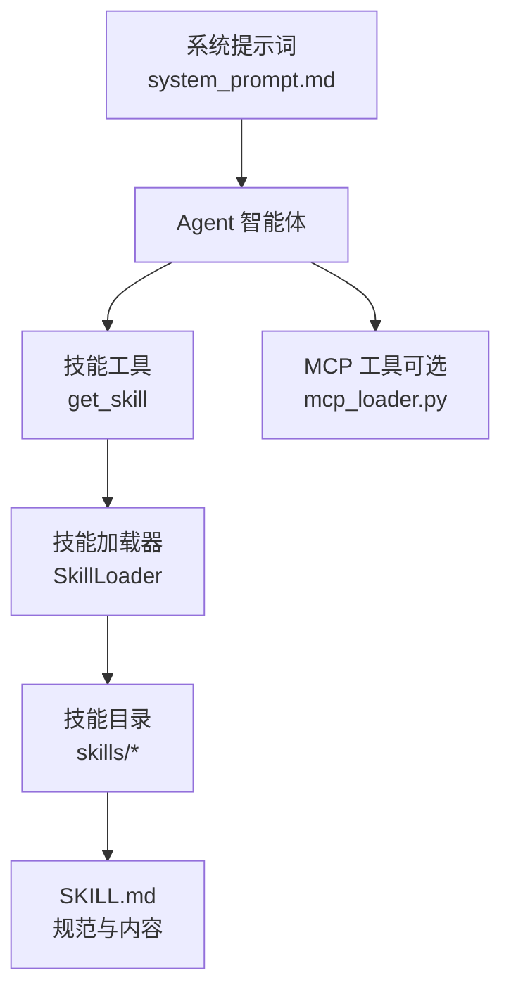
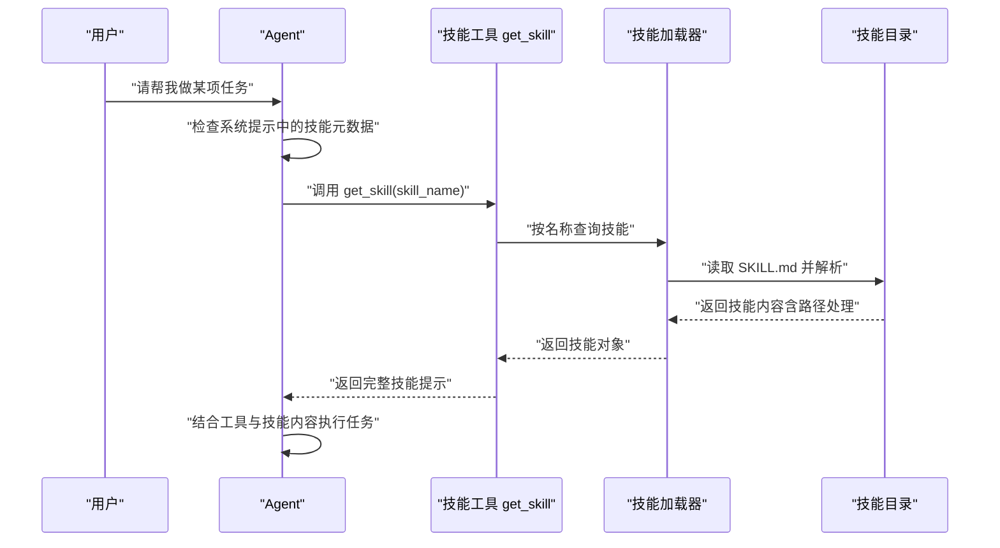
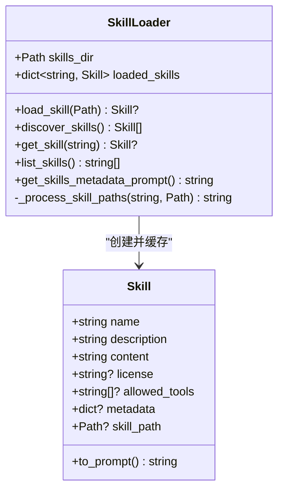
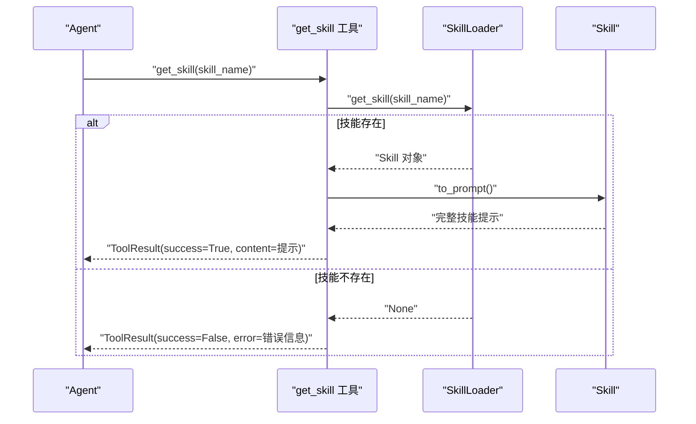
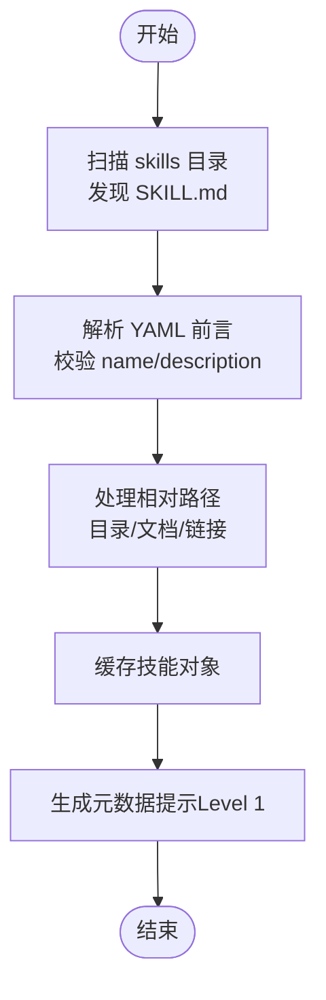
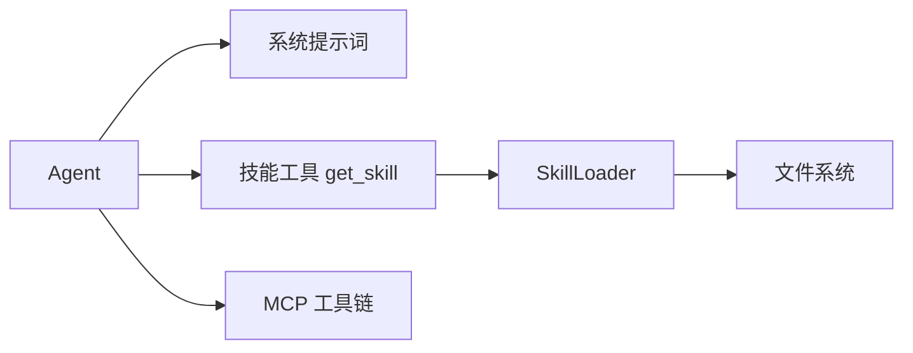

# 技能系统

<cite>
**本文引用的文件**
- [技能系统说明](file://mini_agent/skills/README.md)
- [技能规范](file://mini_agent/skills/agent_skills_spec.md)
- [系统提示词](file://mini_agent/config/system_prompt.md)
- [技能加载器](file://mini_agent/tools/skill_loader.py)
- [技能工具](file://mini_agent/tools/skill_tool.py)
- [基础工具类](file://mini_agent/tools/base.py)
- [算法艺术 SKILL.md](file://mini_agent/skills/algorithmic-art/SKILL.md)
- [画布设计 SKILL.md](file://mini_agent/skills/canvas-design/SKILL.md)
- [品牌指南 SKILL.md](file://mini_agent/skills/brand-guidelines/SKILL.md)
- [文档技能（docx）SKILL.md](file://mini_agent/skills/document-skills/docx/SKILL.md)
- [内部通信 SKILL.md](file://mini_agent/skills/internal-comms/SKILL.md)
- [MCP 加载器](file://mini_agent/tools/mcp_loader.py)
</cite>

## 目录
1. [简介](#简介)
2. [项目结构](#项目结构)
3. [核心组件](#核心组件)
4. [架构总览](#架构总览)
5. [详细组件分析](#详细组件分析)
6. [依赖关系分析](#依赖关系分析)
7. [性能考量](#性能考量)
8. [故障排查指南](#故障排查指南)
9. [结论](#结论)
10. [附录](#附录)

## 简介
本文件系统性阐述 Claude Skills 系统在本仓库中的实现与使用方式，覆盖技能发现、加载与执行机制；内置技能的分类与功能；技能开发规范与最佳实践；以及技能与智能体的交互流程（参数传递、结果处理、错误管理）。读者可据此完成本地技能开发、打包与分发，并将技能与智能体顺畅集成。

## 项目结构
技能系统围绕“技能目录 + 规范 + 加载器 + 工具 + 智能体”展开：
- 技能目录：skills 子目录下按技能名组织，每个技能以 SKILL.md 为入口
- 规范文件：agent_skills_spec.md 定义技能元数据、路径替换规则与资源访问约定
- 加载器：SkillLoader 负责扫描、解析、路径处理与缓存
- 工具：SkillTool 提供按需加载技能内容的能力
- 智能体：Agent 在系统提示中注入技能元数据，按需调用工具加载完整技能

图表来源
- [系统提示词:1-76](file://mini_agent/config/system_prompt.md#L1-L76)
- [技能工具:1-85](file://mini_agent/tools/skill_tool.py#L1-L85)
- [技能加载器:1-257](file://mini_agent/tools/skill_loader.py#L1-L257)
- [MCP 加载器:1-434](file://mini_agent/tools/mcp_loader.py#L1-L434)

章节来源
- [技能系统说明:1-123](file://mini_agent/skills/README.md#L1-L123)
- [技能规范:1-56](file://mini_agent/skills/agent_skills_spec.md#L1-L56)
- [系统提示词:1-76](file://mini_agent/config/system_prompt.md#L1-L76)

## 核心组件
- 技能加载器（SkillLoader）
  - 发现与加载：递归查找 SKILL.md，解析 YAML 前言与正文
  - 路径处理：将相对路径转换为绝对路径，支持目录与文档链接的自动修正
  - 元数据提示：生成仅含名称与描述的元数据提示，实现“渐进披露 Level 1”
  - 缓存与查询：按名称缓存已加载技能，支持按名检索
- 技能工具（GetSkillTool）
  - 名称：get_skill
  - 参数：skill_name（必填）
  - 行为：按需返回技能完整提示（含根目录上下文），实现“渐进披露 Level 2”
- 基础工具类（Tool/ToolResult）
  - 统一工具接口与结果模型，便于 Agent 执行与日志记录
- MCP 工具链（可选）
  - 支持 STDIO/SSE/HTTP/Streamable HTTP 连接，自动列举工具并封装为 Tool
  - 提供连接超时与执行超时配置，确保稳定性

章节来源
- [技能加载器:1-257](file://mini_agent/tools/skill_loader.py#L1-L257)
- [技能工具:1-85](file://mini_agent/tools/skill_tool.py#L1-L85)
- [基础工具类:1-56](file://mini_agent/tools/base.py#L1-L56)
- [MCP 加载器:1-434](file://mini_agent/tools/mcp_loader.py#L1-L434)

## 架构总览
技能系统采用“渐进披露”策略：
- Level 1：系统提示中仅列出可用技能的名称与描述
- Level 2：当需要具体指导时，通过 get_skill 动态加载完整技能内容
- Level 3+：技能内容可引用脚本与资源文件，Agent 可使用 bash 或 read_file 访问

图表来源
- [系统提示词:10-31](file://mini_agent/config/system_prompt.md#L10-L31)
- [技能工具:40-54](file://mini_agent/tools/skill_tool.py#L40-L54)
- [技能加载器:60-118](file://mini_agent/tools/skill_loader.py#L60-L118)

## 详细组件分析

### 技能加载器（SkillLoader）
- 关键职责
  - 发现：递归扫描 skills 目录下的所有 SKILL.md
  - 解析：提取 YAML 前言（name/description 必填，license/allowed-tools/metadata 可选）
  - 路径处理：对内容中的相对路径进行替换，确保从任意工作目录都能正确访问
  - 缓存：以名称为键缓存技能对象，便于快速查询
  - 元数据提示：生成仅含名称与描述的提示文本，用于系统提示
- 复杂度与性能
  - 发现阶段为 O(N)（N 为 SKILL.md 数量）
  - 路径处理基于正则替换，整体线性于内容长度
  - 建议：保持 SKILL.md 结构清晰，避免过长的路径引用列表

图表来源
- [技能加载器:15-118](file://mini_agent/tools/skill_loader.py#L15-L118)
- [技能加载器:194-257](file://mini_agent/tools/skill_loader.py#L194-L257)

章节来源
- [技能加载器:47-257](file://mini_agent/tools/skill_loader.py#L47-L257)

### 技能工具（GetSkillTool）
- 接口
  - 名称：get_skill
  - 参数：skill_name（必填）
  - 返回：ToolResult（success/content/error）
- 行为
  - 若技能不存在，返回错误信息并列出可用技能
  - 若存在，调用 Skill.to_prompt() 返回完整技能提示（包含根目录上下文）

图表来源
- [技能工具:40-54](file://mini_agent/tools/skill_tool.py#L40-L54)
- [技能加载器:216-226](file://mini_agent/tools/skill_loader.py#L216-L226)

章节来源
- [技能工具:13-85](file://mini_agent/tools/skill_tool.py#L13-L85)

### 渐进披露与路径处理
- 渐进披露（Progressive Disclosure）
  - Level 1：系统提示中仅列出技能元数据
  - Level 2：按需加载完整技能内容
  - Level 3+：技能可引用脚本与资源，Agent 使用 bash/read_file 访问
- 路径处理规则
  - 目录引用：scripts/、references/、assets/ 前缀自动转为绝对路径
  - 文档引用：如 reference.md、forms.md 等，自动添加 read_file 指南
  - 链接引用：Markdown 链接与带前缀的链接会被识别并转换为绝对路径

图表来源
- [技能加载器:194-257](file://mini_agent/tools/skill_loader.py#L194-L257)
- [技能加载器:119-193](file://mini_agent/tools/skill_loader.py#L119-L193)

章节来源
- [技能加载器:119-193](file://mini_agent/tools/skill_loader.py#L119-L193)

### 内置技能一览与功能要点
以下技能均以 SKILL.md 为入口，遵循统一规范。使用时先查看系统提示中的元数据，再按需调用 get_skill 获取完整指导。

- 算法艺术（algorithmic-art）
  - 场景：使用 p5.js 创作算法艺术，强调“过程优于产物”，通过哲学到代码的表达
  - 关键点：模板使用（templates/viewer.html）、参数控制、种子导航、单文件自包含产物
  - 参考：[算法艺术 SKILL.md:1-405](file://mini_agent/skills/algorithmic-art/SKILL.md#L1-L405)

- 画布设计（canvas-design）
  - 场景：创作海报、视觉作品，强调“最小文字、空间表达”
  - 关键点：设计哲学 → 可视化表达；PDF/PNG 输出；字体与色彩规范
  - 参考：[画布设计 SKILL.md:1-130](file://mini_agent/skills/canvas-design/SKILL.md#L1-L130)

- 品牌指南（brand-guidelines）
  - 场景：为各类制品应用官方品牌色与排版
  - 关键点：主色/辅色、Poppins/Lora 字体、颜色应用与可读性
  - 参考：[品牌指南 SKILL.md:1-74](file://mini_agent/skills/brand-guidelines/SKILL.md#L1-L74)

- 文档技能（docx）
  - 场景：Word 文档创建、编辑、分析，支持修订、批注、格式保留
  - 关键点：文本抽取（pandoc）、原始 XML 访问、OOXML 编辑、红线条文（redlining）
  - 参考：[文档技能（docx）SKILL.md:1-197](file://mini_agent/skills/document-skills/docx/SKILL.md#L1-L197)

- 内部通信（internal-comms）
  - 场景：撰写内部通讯（3P 更新、公司简报、FAQ、状态报告等）
  - 关键点：按类型加载示例指南，遵循格式与语气
  - 参考：[内部通信 SKILL.md:1-33](file://mini_agent/skills/internal-comms/SKILL.md#L1-L33)

- 艺术品构建器（artifacts-builder）
  - 场景：复杂前端制品（React/Tailwind/shadcn/ui），多组件、路由或状态管理
  - 关键点：初始化 → 开发 → 打包为单文件 HTML → 分享
  - 参考：[artifacts-builder SKILL.md:1-74](file://mini_agent/skills/artifacts-builder/SKILL.md#L1-L74)

- 主题工厂（theme-factory）
  - 场景：为制品应用预设主题或动态生成主题
  - 关键点：主题集合与生成逻辑（参考主题目录与技能说明）

- 文档技能（pdf/pptx/xlsx）
  - 场景：PDF 文本/表格抽取、合并拆分、表单处理；PPTX 布局/图表/自动化；Excel 公式/可视化
  - 关键点：脚本化操作、验证与回检、依赖安装（参见各技能说明）

- MCP 构建器（mcp-builder）
  - 场景：创建高质量 MCP 服务器以集成外部 API/服务
  - 关键点：参考文档与最佳实践（参考 reference 与 scripts）

- 技能创建器（skill-creator）
  - 场景：创建有效扩展 Claude 能力的技能
  - 关键点：初始化模板、快速验证、打包发布

- Slack GIF 创建器（slack-gif-creator）
  - 场景：创建适配 Slack 尺寸约束的动画 GIF
  - 关键点：色彩、缓动、帧合成、模板与验证

- Web 应用测试（webapp-testing）
  - 场景：使用 Playwright 测试本地 Web 应用
  - 关键点：元素发现、静态页面自动化、日志输出

章节来源
- [技能系统说明:24-123](file://mini_agent/skills/README.md#L24-L123)
- [算法艺术 SKILL.md:1-405](file://mini_agent/skills/algorithmic-art/SKILL.md#L1-L405)
- [画布设计 SKILL.md:1-130](file://mini_agent/skills/canvas-design/SKILL.md#L1-L130)
- [品牌指南 SKILL.md:1-74](file://mini_agent/skills/brand-guidelines/SKILL.md#L1-L74)
- [文档技能（docx）SKILL.md:1-197](file://mini_agent/skills/document-skills/docx/SKILL.md#L1-L197)
- [内部通信 SKILL.md:1-33](file://mini_agent/skills/internal-comms/SKILL.md#L1-L33)

### 技能开发规范与最佳实践
- 规范来源
  - 必备文件：SKILL.md（YAML 前言 + Markdown 正文）
  - 前言字段：name（必需）、description（必需）、license（可选）、allowed-tools（可选）、metadata（可选）
  - 资源访问：遵循路径处理规则，使用绝对路径或相对路径转换
- 最佳实践
  - 明确任务边界：在 description 中清晰说明适用场景与触发条件
  - 模板化与复用：提供模板与示例，降低使用者上手成本
  - 质量保证：提供验证步骤、示例输出与常见问题解答
  - 版本与许可证：在 LICENSE.txt 中明确授权条款，必要时在 SKILL.md 中引用
- 参考
  - [技能规范:17-47](file://mini_agent/skills/agent_skills_spec.md#L17-L47)

章节来源
- [技能规范:17-47](file://mini_agent/skills/agent_skills_spec.md#L17-L47)

### 技能集成指南（本地开发、打包与分发）
- 本地开发
  - 新建技能目录并创建 SKILL.md，按规范填写前言与正文
  - 如需脚本/资源，放置于 scripts/ 或 assets/ 等目录，Agent 会自动转换为绝对路径
  - 使用系统提示中的元数据了解可用技能，按需调用 get_skill
- 打包与分发
  - 保持目录结构与文件命名规范
  - 提供 LICENSE.txt 与 SKILL.md，必要时附带 README 或示例
  - 可参考“技能系统说明”中的插件市场与安装指引
- 参考
  - [技能系统说明:58-88](file://mini_agent/skills/README.md#L58-L88)

章节来源
- [技能系统说明:58-88](file://mini_agent/skills/README.md#L58-L88)

### 与智能体的交互方式
- 参数传递
  - get_skill 的参数为 skill_name（字符串）
  - 工具参数遵循 JSON Schema 描述，便于 LLM 推理与调用
- 结果处理
  - 成功：返回技能完整提示（含根目录上下文）
  - 失败：返回错误信息（包含可用技能列表）
- 错误管理
  - 技能缺失：提示可用技能清单
  - 路径异常：由路径处理逻辑保障，必要时建议使用 read_file 访问
  - 工具执行异常：捕获异常并返回 ToolResult，包含错误详情与堆栈摘要
- 参考
  - [技能工具:40-54](file://mini_agent/tools/skill_tool.py#L40-L54)
  - [基础工具类:8-14](file://mini_agent/tools/base.py#L8-L14)

章节来源
- [技能工具:40-54](file://mini_agent/tools/skill_tool.py#L40-L54)
- [基础工具类:8-14](file://mini_agent/tools/base.py#L8-L14)

## 依赖关系分析
- 组件耦合
  - Agent 依赖系统提示中的技能元数据，通过工具调用加载完整技能
  - SkillLoader 与技能目录强耦合，负责路径处理与缓存
  - SkillTool 仅依赖 SkillLoader 的查询能力
  - MCP 工具链独立于技能系统，但可作为 Agent 的额外工具来源
- 外部依赖
  - YAML 解析、正则匹配、文件系统访问
  - MCP 连接依赖 mcp 客户端库（stdio/sse/http/streamable_http）
- 循环依赖
  - 未发现循环依赖，模块职责清晰

图表来源
- [系统提示词:10-31](file://mini_agent/config/system_prompt.md#L10-L31)
- [技能工具:57-84](file://mini_agent/tools/skill_tool.py#L57-L84)
- [技能加载器:47-60](file://mini_agent/tools/skill_loader.py#L47-L60)
- [MCP 加载器:330-434](file://mini_agent/tools/mcp_loader.py#L330-L434)

章节来源
- [系统提示词:10-31](file://mini_agent/config/system_prompt.md#L10-L31)
- [技能工具:57-84](file://mini_agent/tools/skill_tool.py#L57-L84)
- [技能加载器:47-60](file://mini_agent/tools/skill_loader.py#L47-L60)
- [MCP 加载器:330-434](file://mini_agent/tools/mcp_loader.py#L330-L434)

## 性能考量
- 发现与解析
  - 发现阶段为 O(N)，N 为 SKILL.md 数量；解析为 O(M)，M 为内容长度
- 路径处理
  - 正则替换线性于内容长度；建议减少冗余路径引用
- 缓存命中
  - 已加载技能按名称缓存，后续查询为 O(1)
- MCP 工具链
  - 连接与执行超时可配置，避免阻塞；建议根据网络环境调整超时参数

## 故障排查指南
- 技能未被发现
  - 检查 skills 目录是否存在，SKILL.md 是否位于技能根目录
  - 确认 YAML 前言是否包含 name 与 description
- 路径无法访问
  - 使用 read_file 访问文档引用；确认路径已被自动转换为绝对路径
- 工具调用失败
  - 查看 ToolResult.error 与 Traceback 摘要，定位具体异常
  - 对于 MCP 工具，检查连接类型、URL/命令与超时设置
- 参考
  - [技能工具:44-50](file://mini_agent/tools/skill_tool.py#L44-L50)
  - [MCP 加载器:217-232](file://mini_agent/tools/mcp_loader.py#L217-L232)

章节来源
- [技能工具:44-50](file://mini_agent/tools/skill_tool.py#L44-L50)
- [MCP 加载器:217-232](file://mini_agent/tools/mcp_loader.py#L217-L232)

## 结论
本技能系统通过“渐进披露”与“规范化的技能入口”，实现了从元数据到完整指导再到资源访问的完整闭环。SkillLoader 与 SkillTool 提供了稳定的发现与加载机制，MCP 工具链进一步扩展了外部能力接入。遵循 agent_skills_spec 的规范，开发者可以快速创建高质量技能，并将其无缝集成到智能体工作流中。

## 附录
- 快速参考
  - 技能目录：skills/*
  - 规范文件：agent_skills_spec.md
  - 系统提示：system_prompt.md（包含技能元数据占位符）
  - 工具：get_skill（按需加载）
  - MCP：mcp.json（配置与连接）