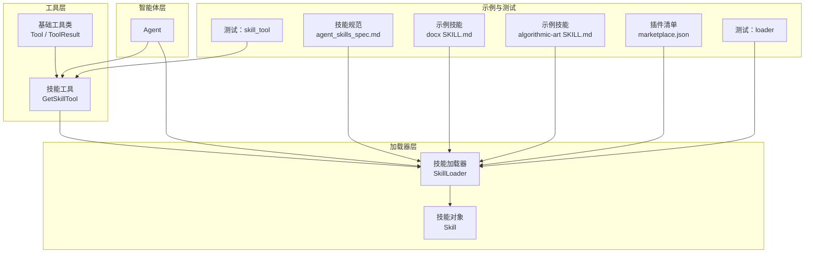
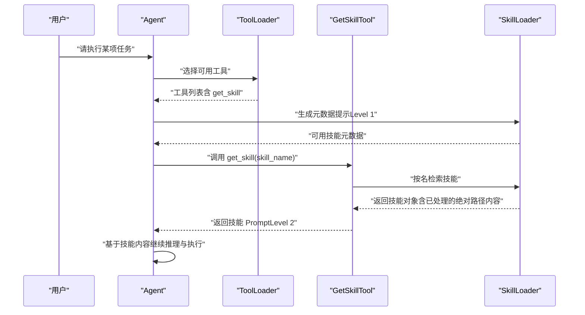
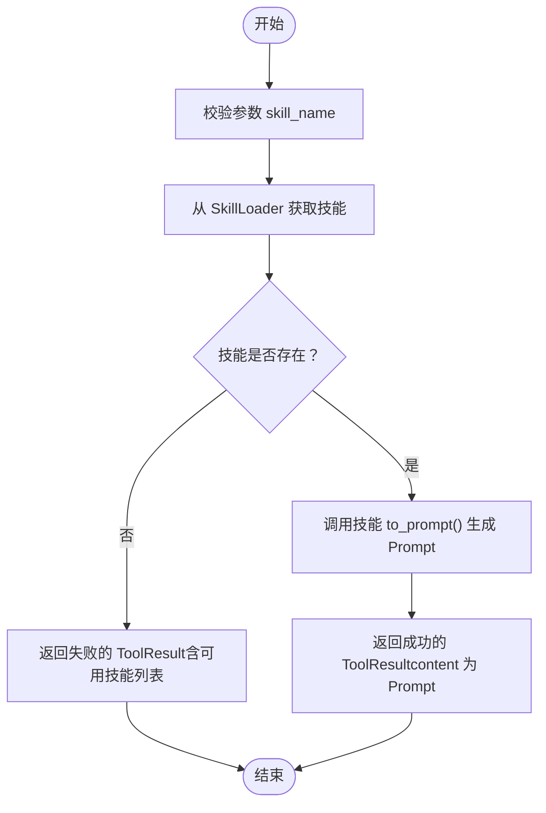
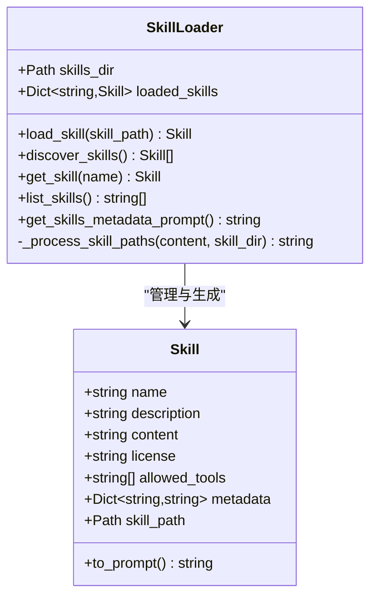
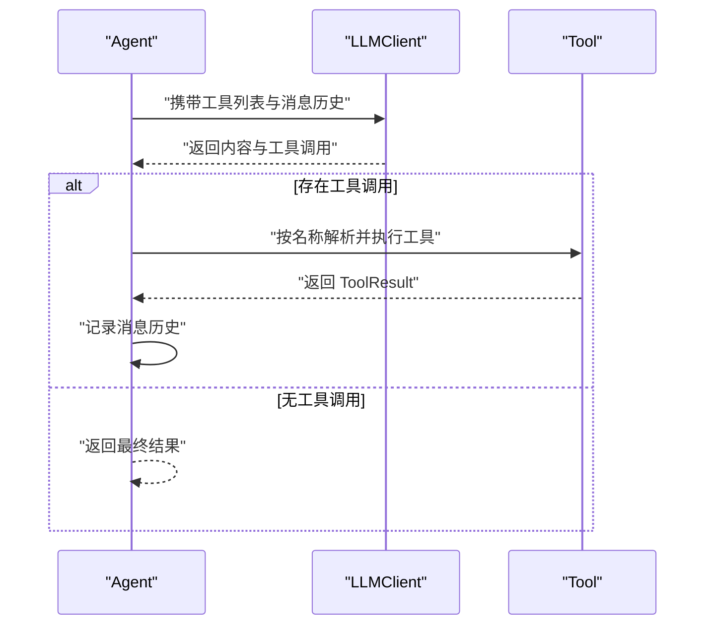
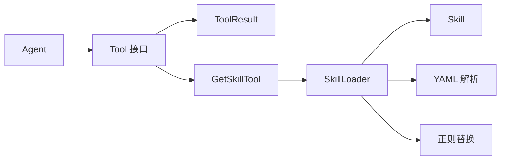

# 技能集成

<cite>
**本文引用的文件**
- [skill_tool.py](file://mini_agent/tools/skill_tool.py)
- [skill_loader.py](file://mini_agent/tools/skill_loader.py)
- [base.py](file://mini_agent/tools/base.py)
- [agent.py](file://mini_agent/agent.py)
- [agent_skills_spec.md](file://mini_agent/skills/agent_skills_spec.md)
- [SKILL.md（算法艺术）](file://mini_agent/skills/algorithmic-art/SKILL.md)
- [SKILL.md（文档技能：docx）](file://mini_agent/skills/document-skills/docx/SKILL.md)
- [marketplace.json（Claude 插件清单）](file://mini_agent/skills/.claude-plugin/marketplace.json)
- [test_skill_loader.py](file://tests/test_skill_loader.py)
- [test_skill_tool.py](file://tests/test_skill_tool.py)
- [__init__.py（工具模块）](file://mini_agent/tools/__init__.py)
</cite>

## 目录
1. [简介](#简介)
2. [项目结构](#项目结构)
3. [核心组件](#核心组件)
4. [架构总览](#架构总览)
5. [组件详解](#组件详解)
6. [依赖关系分析](#依赖关系分析)
7. [性能考量](#性能考量)
8. [故障排除指南](#故障排除指南)
9. [结论](#结论)
10. [附录](#附录)

## 简介
本文件面向希望在智能体系统中集成“技能”（Skill）的开发者与使用者，系统化阐述技能工具（SkillTool）的工作原理、调用接口、参数传递与结果处理；说明技能与智能体系统的集成方式（注册、权限管理、执行流程）；介绍第三方技能的集成方法（许可证处理、依赖管理、兼容性检查）；并提供最佳实践（性能优化、错误处理、监控策略），以及具体集成示例与故障排除指南。

## 项目结构
技能集成主要由以下模块构成：
- 工具层：定义统一的工具抽象与结果模型，并提供技能工具（仅提供按需加载能力）
- 加载器层：负责扫描、解析、规范化技能内容（SKILL.md 前言与正文），并为智能体生成元数据提示
- 智能体层：接收工具列表与系统提示，驱动多轮对话与工具调用
- 示例与测试：验证技能发现、路径处理、元数据提示生成等行为
- 第三方技能：通过插件清单集中声明可加载的技能集合

图表来源
- [skill_tool.py:13-54](file://mini_agent/tools/skill_tool.py#L13-L54)
- [skill_loader.py:47-256](file://mini_agent/tools/skill_loader.py#L47-L256)
- [base.py:8-56](file://mini_agent/tools/base.py#L8-L56)
- [agent.py:45-524](file://mini_agent/agent.py#L45-L524)
- [agent_skills_spec.md:1-56](file://mini_agent/skills/agent_skills_spec.md#L1-L56)
- [SKILL.md（文档技能：docx）:1-197](file://mini_agent/skills/document-skills/docx/SKILL.md#L1-L197)
- [SKILL.md（算法艺术）:1-405](file://mini_agent/skills/algorithmic-art/SKILL.md#L1-L405)
- [marketplace.json（Claude 插件清单）:1-44](file://mini_agent/skills/.claude-plugin/marketplace.json#L1-L44)
- [test_skill_loader.py:1-275](file://tests/test_skill_loader.py#L1-L275)
- [test_skill_tool.py:1-112](file://tests/test_skill_tool.py#L1-L112)

章节来源
- [skill_tool.py:1-85](file://mini_agent/tools/skill_tool.py#L1-L85)
- [skill_loader.py:1-257](file://mini_agent/tools/skill_loader.py#L1-L257)
- [base.py:1-56](file://mini_agent/tools/base.py#L1-L56)
- [agent.py:1-524](file://mini_agent/agent.py#L1-L524)
- [agent_skills_spec.md:1-56](file://mini_agent/skills/agent_skills_spec.md#L1-L56)
- [SKILL.md（文档技能：docx）:1-197](file://mini_agent/skills/document-skills/docx/SKILL.md#L1-L197)
- [SKILL.md（算法艺术）:1-405](file://mini_agent/skills/algorithmic-art/SKILL.md#L1-L405)
- [marketplace.json（Claude 插件清单）:1-44](file://mini_agent/skills/.claude-plugin/marketplace.json#L1-L44)
- [test_skill_loader.py:1-275](file://tests/test_skill_loader.py#L1-L275)
- [test_skill_tool.py:1-112](file://tests/test_skill_tool.py#L1-L112)

## 核心组件
- 工具抽象与结果模型
  - Tool：定义工具名称、描述、参数模式（JSON Schema）、异步执行接口与平台 Schema 转换
  - ToolResult：封装执行成功与否、返回内容与错误信息
- 技能工具（GetSkillTool）
  - 提供按需加载指定技能的完整内容的能力
  - 参数：skill_name（必填）
  - 返回：ToolResult（成功时返回技能 Prompt 文本，失败时返回错误信息）
- 技能加载器（SkillLoader）
  - 发现并加载 skills 目录下的所有 SKILL.md
  - 解析 YAML 前言（name、description、license、allowed-tools、metadata）
  - 处理相对路径到绝对路径的转换，支持脚本、文档与链接的路径规范化
  - 生成元数据提示（仅列出技能名与描述，实现“渐进披露 Level 1”）
  - 提供按名检索与枚举已加载技能的能力
- 智能体（Agent）
  - 维护工具字典、消息历史、令牌估算与摘要机制
  - 在每轮推理中根据工具列表决定是否调用工具
  - 执行工具调用并将结果回写消息历史

章节来源
- [base.py:8-56](file://mini_agent/tools/base.py#L8-L56)
- [skill_tool.py:13-54](file://mini_agent/tools/skill_tool.py#L13-L54)
- [skill_loader.py:47-256](file://mini_agent/tools/skill_loader.py#L47-L256)
- [agent.py:45-524](file://mini_agent/agent.py#L45-L524)

## 架构总览
技能集成采用“渐进披露”设计：
- Level 1：系统提示仅提供可用技能的元数据（名称与描述），避免一次性加载全部内容
- Level 2：当智能体需要执行某项任务时，通过 GetSkillTool 按需加载该技能的完整内容
- Level 3+：加载器会将技能内的相对路径转换为绝对路径，便于智能体在任意工作目录下读取嵌套资源

图表来源
- [agent.py:361-524](file://mini_agent/agent.py#L361-L524)
- [skill_tool.py:40-54](file://mini_agent/tools/skill_tool.py#L40-L54)
- [skill_loader.py:237-256](file://mini_agent/tools/skill_loader.py#L237-L256)

## 组件详解

### 技能工具（GetSkillTool）
- 角色定位：仅提供“按需加载技能”的能力，不直接执行技能逻辑
- 接口定义
  - 名称：get_skill
  - 描述：获取指定技能的完整内容与指导
  - 参数：skill_name（字符串，必填）
- 执行流程
  - 从 SkillLoader 获取技能对象
  - 若技能不存在：返回失败的 ToolResult，并给出可用技能列表
  - 若存在：调用技能对象的 to_prompt 方法，返回技能 Prompt 文本
- 结果处理
  - 成功：content 为技能 Prompt
  - 失败：error 包含未找到技能及可用技能列表

图表来源
- [skill_tool.py:40-54](file://mini_agent/tools/skill_tool.py#L40-L54)

章节来源
- [skill_tool.py:13-54](file://mini_agent/tools/skill_tool.py#L13-L54)

### 技能加载器（SkillLoader）
- 发现与加载
  - 遍历 skills 目录，递归查找 SKILL.md
  - 读取并解析 YAML 前言，构造 Skill 对象（包含 name、description、license、allowed-tools、metadata、content、skill_path）
- 内容处理（路径规范化）
  - 将 scripts/、references/、assets/ 等目录中的相对路径转换为绝对路径
  - 将文档引用（如 forms.md、reference.md）转换为绝对路径，并添加“使用 read_file 访问”的提示
  - 将 Markdown 链接转换为绝对路径，并保留链接文本风格
- 元数据提示生成（Level 1）
  - 仅输出技能名与描述，帮助智能体在不加载全文的情况下做出选择
- 查询与枚举
  - 支持按名查询与列出已加载技能名

图表来源
- [skill_loader.py:15-45](file://mini_agent/tools/skill_loader.py#L15-L45)
- [skill_loader.py:47-256](file://mini_agent/tools/skill_loader.py#L47-L256)

章节来源
- [skill_loader.py:47-256](file://mini_agent/tools/skill_loader.py#L47-L256)

### 智能体（Agent）与工具集成
- 工具注册
  - Agent 初始化时以字典形式维护工具映射（按名称索引）
  - 工具需实现 Tool 接口（name、description、parameters、execute）
- 权限管理
  - 当前实现未内置工具白名单控制；若需限制允许运行的工具，可在外部构建工具集合时过滤
- 执行流程
  - 每轮推理：生成系统提示与工具列表，调用 LLM 得到响应
  - 若响应包含工具调用：按顺序执行每个工具调用，记录结果到消息历史
  - 若无工具调用：结束本轮并返回最终结果
- 错误处理
  - 未知工具：返回失败的 ToolResult
  - 工具执行异常：捕获异常并转换为失败的 ToolResult，包含错误详情与堆栈
- 性能与可观测性
  - 使用令牌估算与摘要机制控制上下文长度
  - 日志记录请求、响应、工具调用与结果

图表来源
- [agent.py:361-524](file://mini_agent/agent.py#L361-L524)
- [base.py:16-56](file://mini_agent/tools/base.py#L16-L56)

章节来源
- [agent.py:45-524](file://mini_agent/agent.py#L45-L524)
- [base.py:16-56](file://mini_agent/tools/base.py#L16-L56)

### 第三方技能集成（Claude 插件）
- 插件清单（marketplace.json）
  - 定义插件集合与技能路径映射，支持相对路径指向各技能目录
  - 便于统一打包与分发示例技能集合
- 许可证与依赖
  - 各技能目录内包含 LICENSE.txt 或自有许可说明
  - 示例技能可能声明外部依赖（如 pandoc、libreoffice、poppler、docx 等）
- 兼容性检查
  - 通过 agent_skills_spec.md 约束 SKILL.md 的前言字段与目录布局
  - 测试覆盖了路径处理、元数据提示生成、脚本路径转换等关键行为

章节来源
- [marketplace.json（Claude 插件清单）:1-44](file://mini_agent/skills/.claude-plugin/marketplace.json#L1-L44)
- [agent_skills_spec.md:1-56](file://mini_agent/skills/agent_skills_spec.md#L1-L56)
- [test_skill_loader.py:134-275](file://tests/test_skill_loader.py#L134-L275)
- [test_skill_tool.py:51-112](file://tests/test_skill_tool.py#L51-L112)

## 依赖关系分析
- 组件耦合
  - GetSkillTool 依赖 SkillLoader 进行技能检索与内容生成
  - SkillLoader 依赖 YAML 解析与正则替换进行内容处理
  - Agent 依赖 Tool 接口与 ToolResult 结果模型
- 外部依赖
  - YAML 解析（用于 SKILL.md 前言）
  - 正则表达式（用于路径与文档引用的识别与替换）
  - 文件系统（读取 SKILL.md 与嵌套资源）

图表来源
- [agent.py:45-524](file://mini_agent/agent.py#L45-L524)
- [base.py:8-56](file://mini_agent/tools/base.py#L8-L56)
- [skill_tool.py:13-54](file://mini_agent/tools/skill_tool.py#L13-L54)
- [skill_loader.py:47-256](file://mini_agent/tools/skill_loader.py#L47-L256)

章节来源
- [agent.py:45-524](file://mini_agent/agent.py#L45-L524)
- [base.py:8-56](file://mini_agent/tools/base.py#L8-L56)
- [skill_tool.py:13-54](file://mini_agent/tools/skill_tool.py#L13-L54)
- [skill_loader.py:47-256](file://mini_agent/tools/skill_loader.py#L47-L256)

## 性能考量
- 渐进披露（Progressive Disclosure）
  - Level 1：仅提供元数据提示，降低初始上下文开销
  - Level 2：按需加载技能全文，避免不必要的 IO 与内存占用
  - Level 3+：路径规范化减少后续读取失败与重试
- 上下文控制
  - 令牌估算与摘要机制防止上下文溢出，提升长对话稳定性
- I/O 优化
  - 技能内容缓存于内存字典，避免重复磁盘访问
  - 相对路径转绝对路径，减少后续文件查找成本

## 故障排除指南
- 无法找到技能
  - 现象：调用 get_skill 返回失败，错误信息包含可用技能列表
  - 排查：确认 skill_name 是否正确；检查 skills 目录结构与 SKILL.md 是否存在
  - 参考
    - [skill_tool.py:44-50](file://mini_agent/tools/skill_tool.py#L44-L50)
    - [test_skill_tool.py:64-73](file://tests/test_skill_tool.py#L64-L73)
- YAML 前言缺失或格式错误
  - 现象：技能未被发现或加载失败
  - 排查：确保 SKILL.md 以 YAML 前言开头，且包含 name 与 description
  - 参考
    - [agent_skills_spec.md:17-47](file://mini_agent/skills/agent_skills_spec.md#L17-L47)
    - [test_skill_loader.py:82-95](file://tests/test_skill_loader.py#L82-L95)
- 路径引用不生效
  - 现象：技能内文档或脚本引用无法被智能体读取
  - 排查：确认相对路径存在于技能根目录；加载器会自动转换为绝对路径
  - 参考
    - [skill_loader.py:119-192](file://mini_agent/tools/skill_loader.py#L119-L192)
    - [test_skill_loader.py:187-247](file://tests/test_skill_loader.py#L187-L247)
- 工具执行异常
  - 现象：ToolResult.success 为 False，error 包含异常详情
  - 排查：查看日志与堆栈，定位工具内部错误；必要时在工具层增加健壮性
  - 参考
    - [agent.py:461-474](file://mini_agent/agent.py#L461-L474)
- 第三方技能依赖缺失
  - 现象：示例技能提示需要外部工具（如 pandoc、libreoffice）
  - 排查：安装对应依赖后重试
  - 参考
    - [SKILL.md（文档技能：docx）:189-197](file://mini_agent/skills/document-skills/docx/SKILL.md#L189-L197)

章节来源
- [skill_tool.py:44-50](file://mini_agent/tools/skill_tool.py#L44-L50)
- [test_skill_tool.py:64-73](file://tests/test_skill_tool.py#L64-L73)
- [agent_skills_spec.md:17-47](file://mini_agent/skills/agent_skills_spec.md#L17-L47)
- [test_skill_loader.py:82-95](file://tests/test_skill_loader.py#L82-L95)
- [skill_loader.py:119-192](file://mini_agent/tools/skill_loader.py#L119-L192)
- [agent.py:461-474](file://mini_agent/agent.py#L461-L474)
- [SKILL.md（文档技能：docx）:189-197](file://mini_agent/skills/document-skills/docx/SKILL.md#L189-L197)

## 结论
通过“渐进披露”与“按需加载”，技能集成在保持系统轻量的同时，提供了强大的领域知识扩展能力。SkillLoader 负责标准化技能内容与路径，GetSkillTool 提供安全可控的加载入口，Agent 则在工具层面完成决策与执行。配合第三方插件清单与规范约束，可以高效地引入与维护大量示例技能，满足多样化任务场景。

## 附录

### 技能调用接口与参数
- 工具名称：get_skill
- 参数 schema
  - skill_name：字符串，必填
- 返回
  - 成功：content 为技能 Prompt 文本
  - 失败：error 为错误信息，包含可用技能列表

章节来源
- [skill_tool.py:28-54](file://mini_agent/tools/skill_tool.py#L28-L54)

### 技能与智能体集成步骤
- 注册
  - 使用 create_skill_tools(skills_dir) 创建工具与加载器实例
  - 将工具注入 Agent 的工具字典
- 权限管理
  - 在构建工具集合时过滤允许使用的工具
- 执行流程
  - Agent 生成元数据提示（Level 1）
  - 用户或智能体选择技能后，调用 get_skill 加载完整内容（Level 2）
  - 基于技能内容继续推理与执行

章节来源
- [skill_tool.py:57-84](file://mini_agent/tools/skill_tool.py#L57-L84)
- [skill_loader.py:237-256](file://mini_agent/tools/skill_loader.py#L237-L256)
- [agent.py:361-524](file://mini_agent/agent.py#L361-L524)

### 第三方技能集成清单
- 插件清单位置：skills/.claude-plugin/marketplace.json
- 内容要点：插件名、描述、技能路径数组（相对路径）
- 使用建议：将 marketplace.json 中的 skills 目录作为根，统一管理示例技能

章节来源
- [marketplace.json（Claude 插件清单）:1-44](file://mini_agent/skills/.claude-plugin/marketplace.json#L1-L44)

### 示例技能参考
- 算法艺术（algorithmic-art）
  - 功能：基于 p5.js 的交互式生成艺术
  - 资源：模板与参考文件位于 templates/ 与 scripts/
- 文档技能（docx）
  - 功能：Word 文档创建、编辑、分析与图片转换
  - 依赖：pandoc、libreoffice、poppler、docx 等

章节来源
- [SKILL.md（算法艺术）:1-405](file://mini_agent/skills/algorithmic-art/SKILL.md#L1-L405)
- [SKILL.md（文档技能：docx）:1-197](file://mini_agent/skills/document-skills/docx/SKILL.md#L1-L197)