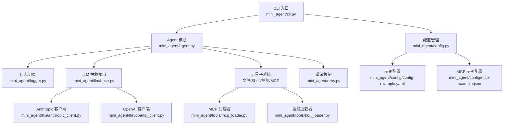
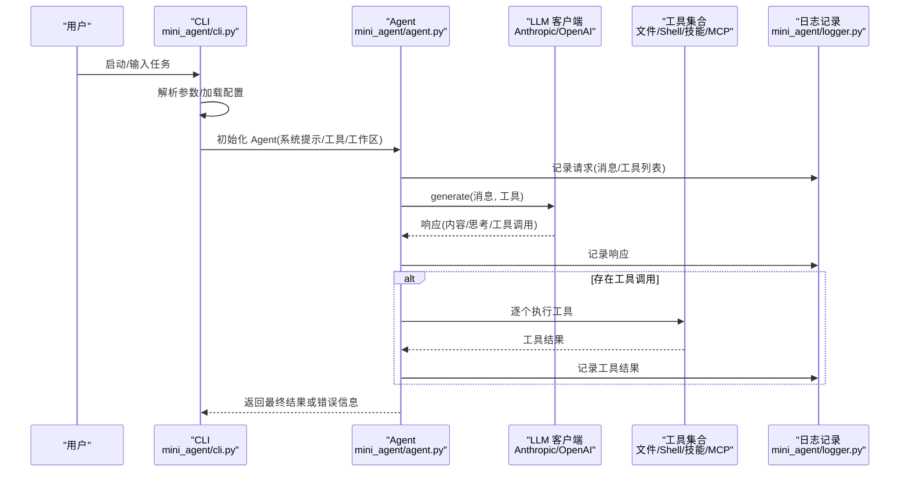
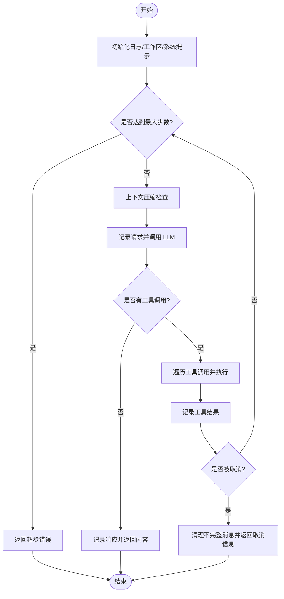
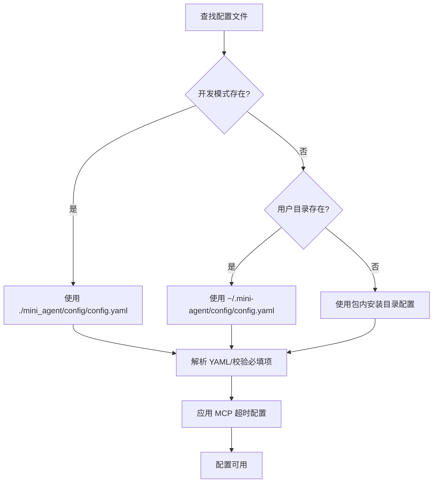
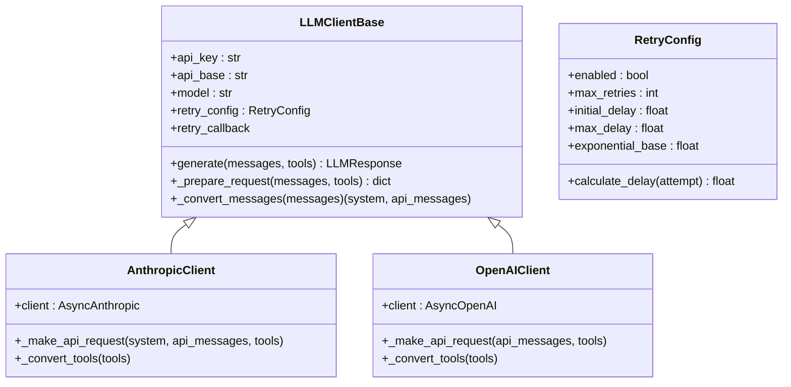
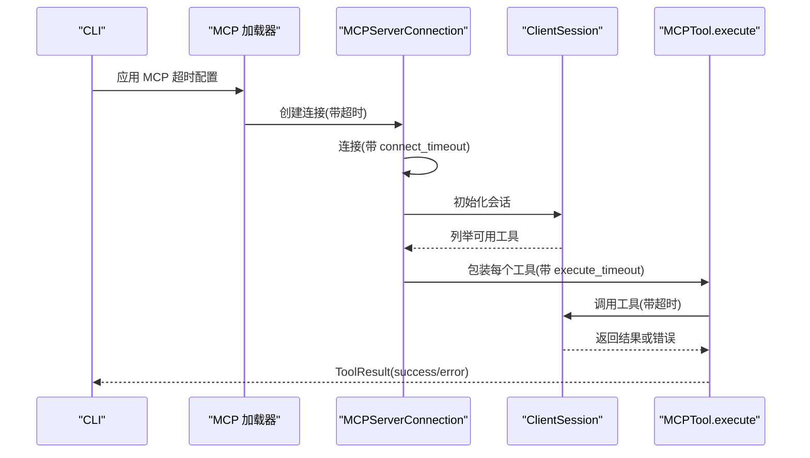
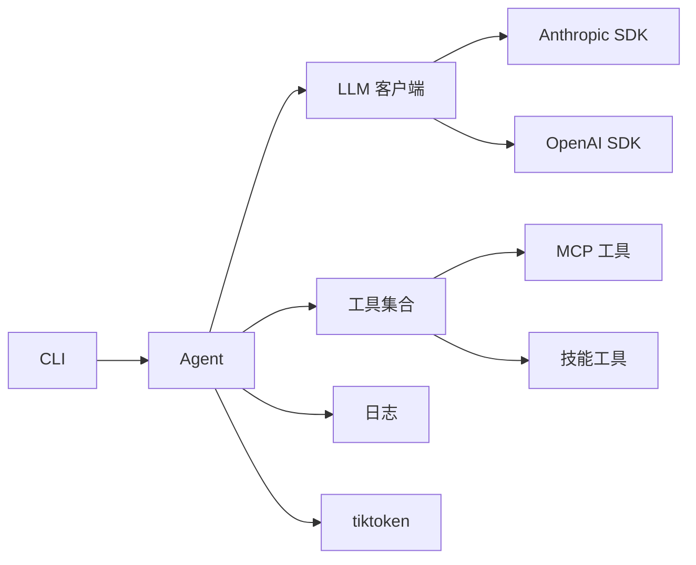

# 故障排除

<cite>
**本文引用的文件**
- [README.md](file://README.md)
- [cli.py](file://mini_agent/cli.py)
- [agent.py](file://mini_agent/agent.py)
- [logger.py](file://mini_agent/logger.py)
- [config.py](file://mini_agent/config.py)
- [config-example.yaml](file://mini_agent/config/config-example.yaml)
- [mcp-example.json](file://mini_agent/config/mcp-example.json)
- [anthropic_client.py](file://mini_agent/llm/anthropic_client.py)
- [openai_client.py](file://mini_agent/llm/openai_client.py)
- [base.py](file://mini_agent/llm/base.py)
- [retry.py](file://mini_agent/retry.py)
- [mcp_loader.py](file://mini_agent/tools/mcp_loader.py)
- [skill_loader.py](file://mini_agent/tools/skill_loader.py)
- [test_agent.py](file://tests/test_agent.py)
</cite>

## 目录
1. [简介](#简介)
2. [项目结构](#项目结构)
3. [核心组件](#核心组件)
4. [架构总览](#架构总览)
5. [详细组件分析](#详细组件分析)
6. [依赖分析](#依赖分析)
7. [性能考虑](#性能考虑)
8. [故障排除指南](#故障排除指南)
9. [结论](#结论)
10. [附录](#附录)

## 简介
本指南面向使用 Mini Agent 的开发者与运维人员，聚焦于常见问题的系统化诊断与解决。内容覆盖 SSL 证书错误、模块未找到、API 连接失败、性能问题（内存、CPU、延迟）、配置问题（文件、环境变量、权限）、网络问题（代理、防火墙、DNS），以及调试工具与社区支持渠道。文档以仓库现有实现为依据，结合日志记录、重试机制、配置加载与工具链，提供可操作的排障步骤。

## 项目结构
Mini Agent 采用分层设计：CLI 入口负责参数解析与交互；Agent 核心负责对话循环、消息历史与工具调用；LLM 客户端抽象统一 Anthropic/OpenAI 接口；工具子系统提供文件、Shell、技能与 MCP 工具；配置模块集中管理 YAML 配置与优先级搜索；日志模块记录请求/响应/工具执行全过程；重试模块提供指数退避与回调。

**图表来源**
- [cli.py:486-630](file://mini_agent/cli.py#L486-L630)
- [agent.py:321-520](file://mini_agent/agent.py#L321-L520)
- [logger.py:11-179](file://mini_agent/logger.py#L11-L179)
- [config.py:66-221](file://mini_agent/config.py#L66-L221)
- [anthropic_client.py:15-200](file://mini_agent/llm/anthropic_client.py#L15-L200)
- [openai_client.py:16-200](file://mini_agent/llm/openai_client.py#L16-L200)
- [retry.py:23-139](file://mini_agent/retry.py#L23-L139)
- [mcp_loader.py:1-200](file://mini_agent/tools/mcp_loader.py#L1-L200)
- [skill_loader.py:1-200](file://mini_agent/tools/skill_loader.py#L1-L200)
- [config-example.yaml:1-61](file://mini_agent/config/config-example.yaml#L1-L61)
- [mcp-example.json:1-29](file://mini_agent/config/mcp-example.json#L1-L29)

**章节来源**
- [cli.py:486-630](file://mini_agent/cli.py#L486-L630)
- [agent.py:321-520](file://mini_agent/agent.py#L321-L520)
- [config.py:66-221](file://mini_agent/config.py#L66-L221)

## 核心组件
- CLI 交互与初始化：解析命令行参数、加载配置、初始化 LLM 客户端、工具集与系统提示，支持非交互任务执行与日志目录查看。
- Agent 执行循环：维护消息历史、触发上下文压缩、调用 LLM、执行工具、记录日志、支持取消与统计输出。
- 日志记录：按运行会话生成独立日志文件，记录请求、响应与工具结果，便于回溯。
- 配置管理：优先级搜索配置文件路径，校验必填字段，解析 LLM/工具/MCP 超时等配置。
- LLM 客户端：抽象统一接口，具体实现支持工具调用与推理内容分离，集成重试。
- 工具链：文件/Shell/技能/MCP 工具，MCP 支持多连接类型与超时控制。
- 重试机制：指数退避、最大重试次数、异常类型过滤、回调通知。

**章节来源**
- [cli.py:285-336](file://mini_agent/cli.py#L285-L336)
- [agent.py:45-120](file://mini_agent/agent.py#L45-L120)
- [logger.py:11-179](file://mini_agent/logger.py#L11-L179)
- [config.py:66-221](file://mini_agent/config.py#L66-L221)
- [anthropic_client.py:15-200](file://mini_agent/llm/anthropic_client.py#L15-L200)
- [openai_client.py:16-200](file://mini_agent/llm/openai_client.py#L16-L200)
- [retry.py:23-139](file://mini_agent/retry.py#L23-L139)
- [mcp_loader.py:1-200](file://mini_agent/tools/mcp_loader.py#L1-L200)
- [skill_loader.py:1-200](file://mini_agent/tools/skill_loader.py#L1-L200)

## 架构总览
下图展示一次典型交互从 CLI 到 Agent 再到 LLM 与工具的调用链，并标注关键错误点与可观测性位置。

**图表来源**
- [cli.py:486-630](file://mini_agent/cli.py#L486-L630)
- [agent.py:321-520](file://mini_agent/agent.py#L321-L520)
- [anthropic_client.py:48-82](file://mini_agent/llm/anthropic_client.py#L48-L82)
- [openai_client.py:48-79](file://mini_agent/llm/openai_client.py#L48-L79)
- [logger.py:43-157](file://mini_agent/logger.py#L43-L157)

## 详细组件分析

### 组件：Agent 执行循环与日志
- 关键职责：维护消息历史、触发上下文压缩、调用 LLM、执行工具、记录日志、支持取消与统计。
- 错误处理：捕获 LLM 调用异常（含重试耗尽），工具执行异常转为 ToolResult 并记录详细错误与堆栈。
- 可观测性：每步打印耗时；日志文件按运行时间命名；支持通过 CLI 查看日志目录与读取指定日志。

**图表来源**
- [agent.py:321-520](file://mini_agent/agent.py#L321-L520)
- [logger.py:43-157](file://mini_agent/logger.py#L43-L157)

**章节来源**
- [agent.py:321-520](file://mini_agent/agent.py#L321-L520)
- [logger.py:11-179](file://mini_agent/logger.py#L11-L179)
- [cli.py:83-170](file://mini_agent/cli.py#L83-L170)

### 组件：配置加载与优先级
- 配置文件优先级：当前目录 mini_agent/config/config.yaml > 用户目录 ~/.mini-agent/config/config.yaml > 包内安装目录。
- 必填校验：api_key 缺失或占位符将抛出错误；空文件或格式错误也会报错。
- MCP 超时：connect_timeout、execute_timeout、sse_read_timeout 可在配置中设置并应用到 MCP 连接。

**图表来源**
- [config.py:177-221](file://mini_agent/config.py#L177-L221)
- [config.py:82-164](file://mini_agent/config.py#L82-L164)
- [mcp-loader.py:34-57](file://mini_agent/tools/mcp_loader.py#L34-L57)

**章节来源**
- [config.py:66-221](file://mini_agent/config.py#L66-L221)
- [config-example.yaml:1-61](file://mini_agent/config/config-example.yaml#L1-L61)
- [mcp-example.json:1-29](file://mini_agent/config/mcp-example.json#L1-L29)

### 组件：LLM 客户端与重试
- 抽象接口：统一 prepare_request、convert_messages、generate。
- 具体实现：Anthropic 与 OpenAI 客户端分别适配其消息与工具格式；OpenAI 支持推理内容分离。
- 重试策略：指数退避、最大重试次数、异常类型过滤、回调通知；Agent 捕获“重试耗尽”异常并友好提示。

**图表来源**
- [base.py:10-85](file://mini_agent/llm/base.py#L10-L85)
- [anthropic_client.py:15-200](file://mini_agent/llm/anthropic_client.py#L15-L200)
- [openai_client.py:16-200](file://mini_agent/llm/openai_client.py#L16-L200)
- [retry.py:23-71](file://mini_agent/retry.py#L23-L71)

**章节来源**
- [base.py:10-85](file://mini_agent/llm/base.py#L10-L85)
- [anthropic_client.py:15-200](file://mini_agent/llm/anthropic_client.py#L15-L200)
- [openai_client.py:16-200](file://mini_agent/llm/openai_client.py#L16-L200)
- [retry.py:73-139](file://mini_agent/retry.py#L73-L139)
- [agent.py:371-384](file://mini_agent/agent.py#L371-L384)

### 组件：MCP 工具加载与超时
- 连接类型：stdio、sse、http、streamable_http。
- 超时控制：全局默认与服务器级覆盖；连接、执行、SSE 读取分别有超时保护。
- 异常处理：超时与异常转换为 ToolResult，避免阻塞主流程。

**图表来源**
- [mcp_loader.py:34-120](file://mini_agent/tools/mcp_loader.py#L34-L120)
- [mcp_loader.py:171-200](file://mini_agent/tools/mcp_loader.py#L171-L200)

**章节来源**
- [mcp_loader.py:1-200](file://mini_agent/tools/mcp_loader.py#L1-L200)
- [config.py:40-64](file://mini_agent/config.py#L40-L64)

### 组件：技能加载与路径处理
- 前言解析：从 SKILL.md 提取 YAML frontmatter，缺失或字段不全则跳过。
- 路径处理：将相对路径转换为绝对路径，增强跨工作区可访问性。
- 注入系统提示：将技能元数据注入系统提示，提升模型对工具能力的认知。

**章节来源**
- [skill_loader.py:1-200](file://mini_agent/tools/skill_loader.py#L1-L200)
- [cli.py:589-602](file://mini_agent/cli.py#L589-L602)

## 依赖分析
- 组件耦合：Agent 依赖 LLM 客户端与工具集合；CLI 负责装配与调度；配置与日志贯穿各层。
- 外部依赖：Anthropic SDK、OpenAI SDK、MCP 客户端、tiktoken（令牌估算）。
- 潜在环依赖：未见直接环依赖；MCP 工具包装器通过会话调用，避免深层耦合。

**图表来源**
- [cli.py:486-630](file://mini_agent/cli.py#L486-L630)
- [agent.py:45-120](file://mini_agent/agent.py#L45-L120)
- [anthropic_client.py:4-12](file://mini_agent/llm/anthropic_client.py#L4-L12)
- [openai_client.py:7-11](file://mini_agent/llm/openai_client.py#L7-L11)
- [mcp_loader.py:10-15](file://mini_agent/tools/mcp_loader.py#L10-L15)

**章节来源**
- [cli.py:486-630](file://mini_agent/cli.py#L486-L630)
- [agent.py:45-120](file://mini_agent/agent.py#L45-L120)

## 性能考虑
- 上下文压缩：当本地估算或 API 报告的 token 超限时，自动进行回合间摘要，降低上下文长度，缓解长对话延迟与成本。
- 令牌估算：优先使用 cl100k_base 编码器精确估算；失败时降级为字符计数估算，保证稳定性。
- 工具执行：MCP 工具执行与连接均设置超时，避免阻塞；工具结果截断输出，减少日志体积。
- 统计输出：每步与总耗时打印，便于定位慢步骤。

**章节来源**
- [agent.py:180-261](file://mini_agent/agent.py#L180-L261)
- [agent.py:123-179](file://mini_agent/agent.py#L123-L179)
- [agent.py:417-513](file://mini_agent/agent.py#L417-L513)
- [mcp_loader.py:89-120](file://mini_agent/tools/mcp_loader.py#L89-L120)

## 故障排除指南

### SSL 证书错误
- 现象：出现证书验证失败类错误。
- 快速测试方案：在 LLM 客户端初始化处关闭证书校验（仅用于测试，不建议生产使用）。
- 生产解决方案：升级证书包；在企业环境中配置系统代理与受信 CA。
- 参考路径：
  - [README.md:286-303](file://README.md#L286-L303)
  - [anthropic_client.py:42-46](file://mini_agent/llm/anthropic_client.py#L42-L46)
  - [openai_client.py:43-46](file://mini_agent/llm/openai_client.py#L43-L46)

**章节来源**
- [README.md:286-303](file://README.md#L286-L303)
- [anthropic_client.py:42-46](file://mini_agent/llm/anthropic_client.py#L42-L46)
- [openai_client.py:43-46](file://mini_agent/llm/openai_client.py#L43-L46)

### 模块未找到错误
- 现象：运行时导入失败或找不到模块。
- 排查步骤：
  - 确认在项目根目录执行，确保 Python 能正确解析包路径。
  - 使用 uv 或 pip 安装依赖，或以可编辑模式安装项目以便修改即时生效。
- 参考路径：
  - [README.md:304-311](file://README.md#L304-L311)
  - [cli.py:486-524](file://mini_agent/cli.py#L486-L524)

**章节来源**
- [README.md:304-311](file://README.md#L304-L311)
- [cli.py:486-524](file://mini_agent/cli.py#L486-L524)

### API 连接失败
- 现象：LLM 调用失败、超时或返回错误。
- 诊断要点：
  - 检查配置文件中的 api_key、api_base、provider 是否正确。
  - 开启重试并观察回调提示，确认是否为瞬时网络波动。
  - 若使用 MCP，检查 mcp.json 中服务器命令、参数与环境变量是否正确。
- 参考路径：
  - [config.py:106-130](file://mini_agent/config.py#L106-L130)
  - [cli.py:538-573](file://mini_agent/cli.py#L538-L573)
  - [mcp-example.json:1-29](file://mini_agent/config/mcp-example.json#L1-L29)

**章节来源**
- [config.py:106-130](file://mini_agent/config.py#L106-L130)
- [cli.py:538-573](file://mini_agent/cli.py#L538-L573)
- [mcp-example.json:1-29](file://mini_agent/config/mcp-example.json#L1-L29)

### 工具执行失败
- 现象：工具调用后返回错误或异常。
- 诊断要点：
  - 查看日志文件中对应工具调用与结果条目，确认参数与错误信息。
  - 对于 MCP 工具，检查连接超时与执行超时设置；必要时提高超时阈值。
  - 对于 Shell/文件工具，确认工作区路径与权限。
- 参考路径：
  - [agent.py:454-475](file://mini_agent/agent.py#L454-L475)
  - [logger.py:122-157](file://mini_agent/logger.py#L122-L157)
  - [mcp_loader.py:89-120](file://mini_agent/tools/mcp_loader.py#L89-L120)

**章节来源**
- [agent.py:454-475](file://mini_agent/agent.py#L454-L475)
- [logger.py:122-157](file://mini_agent/logger.py#L122-L157)
- [mcp_loader.py:89-120](file://mini_agent/tools/mcp_loader.py#L89-L120)

### 配置问题排查
- 配置文件验证：
  - 使用优先级顺序检查配置文件是否存在与可读。
  - 校验 api_key、api_base、model、provider 等字段。
- 环境变量检查：
  - MCP 服务器环境变量（如 JINA_API_KEY、SERPER_API_KEY、MINIMAX_API_KEY）需按需配置。
- 权限问题诊断：
  - 工作区目录需具备读写权限；工具执行可能需要 Shell/文件系统权限。
- 参考路径：
  - [config.py:177-221](file://mini_agent/config.py#L177-L221)
  - [config-example.yaml:19-26](file://mini_agent/config/config-example.yaml#L19-L26)
  - [mcp-example.json:12-16](file://mini_agent/config/mcp-example.json#L12-L16)
  - [cli.py:444-468](file://mini_agent/cli.py#L444-L468)

**章节来源**
- [config.py:177-221](file://mini_agent/config.py#L177-L221)
- [config-example.yaml:19-26](file://mini_agent/config/config-example.yaml#L19-L26)
- [mcp-example.json:12-16](file://mini_agent/config/mcp-example.json#L12-L16)
- [cli.py:444-468](file://mini_agent/cli.py#L444-L468)

### 网络连接问题
- 代理与防火墙：
  - 在企业网络中，确保 SDK 客户端可访问 api_base 指向的服务地址。
  - 如需代理，配置系统或 SDK 层代理参数。
- DNS 解析：
  - 使用 nslookup/dig 检查域名解析；若解析异常，检查本地 DNS 或更换 DNS 服务器。
- MCP 连接：
  - 检查 mcp.json 中命令与参数；stdio 服务是否可执行；URL 类型服务器可达性。
- 参考路径：
  - [mcp-example.json:6-11](file://mini_agent/config/mcp-example.json#L6-L11)
  - [mcp_loader.py:171-195](file://mini_agent/tools/mcp_loader.py#L171-L195)

**章节来源**
- [mcp-example.json:6-11](file://mini_agent/config/mcp-example.json#L6-L11)
- [mcp_loader.py:171-195](file://mini_agent/tools/mcp_loader.py#L171-L195)

### 调试工具与技术
- 日志级别与输出：
  - 使用 CLI 的 /log 命令查看日志目录与最近日志文件；读取指定日志文件定位问题。
  - 日志文件按运行时间命名，包含请求、响应与工具执行详情。
- 调试模式与统计：
  - 每步打印耗时与总耗时，辅助定位慢环节。
  - 使用 /stats 查看会话统计（消息数量、工具调用次数、令牌用量）。
- 重试与回调：
  - 启用重试后，终端会显示每次重试尝试与等待时间，便于判断网络抖动。
- 参考路径：
  - [cli.py:83-170](file://mini_agent/cli.py#L83-L170)
  - [agent.py:417-513](file://mini_agent/agent.py#L417-L513)
  - [cli.py:552-557](file://mini_agent/cli.py#L552-L557)

**章节来源**
- [cli.py:83-170](file://mini_agent/cli.py#L83-L170)
- [agent.py:417-513](file://mini_agent/agent.py#L417-L513)
- [cli.py:552-557](file://mini_agent/cli.py#L552-L557)

### 社区支持与问题报告
- 社区渠道：微信交流群（详见 README 中“联系页面”二维码入口）。
- 问题报告：在仓库提交 Issue，附带：
  - 版本信息（mini-agent 版本）
  - 配置文件片段（脱敏敏感信息）
  - 最近日志文件内容
  - 复现步骤与期望结果
- 参考路径：
  - [README.md:317-329](file://README.md#L317-L329)

**章节来源**
- [README.md:317-329](file://README.md#L317-L329)

## 结论
本指南基于 Mini Agent 的实际实现，提供了从配置、网络、API、工具到日志与重试的系统化排障思路。建议在复现问题前先核对配置与网络连通性，再利用日志与统计信息定位瓶颈，最后根据场景选择合适的超时与重试策略。对于复杂问题，配合社区渠道与问题模板可快速获得支持。

## 附录
- 测试参考：集成测试展示了 Agent 与 LLM 的端到端行为，可用于验证环境与配置是否正确。
- 参考路径：
  - [test_agent.py:15-95](file://tests/test_agent.py#L15-L95)
  - [test_agent.py:97-162](file://tests/test_agent.py#L97-L162)