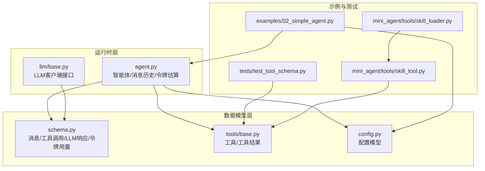
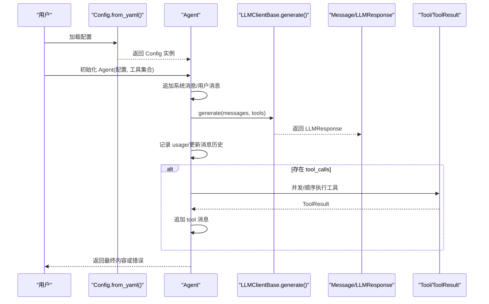
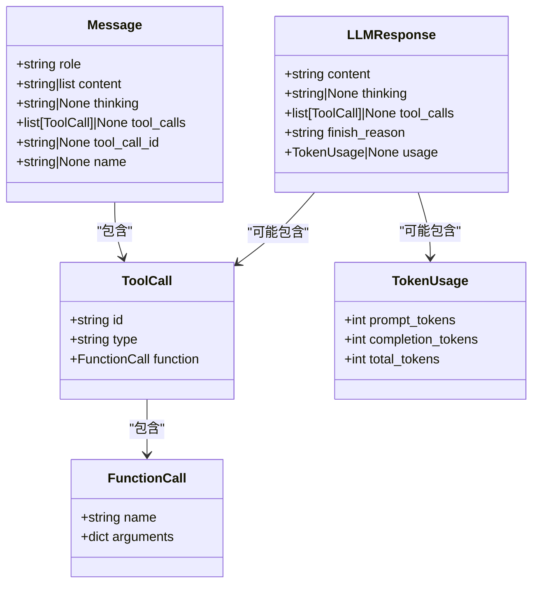
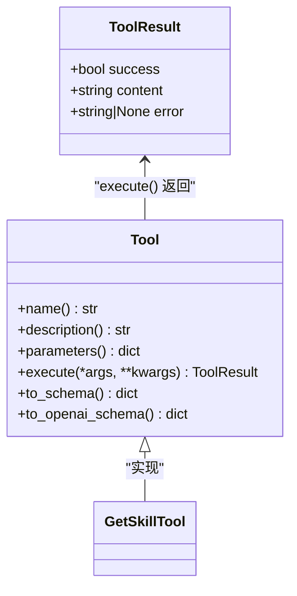
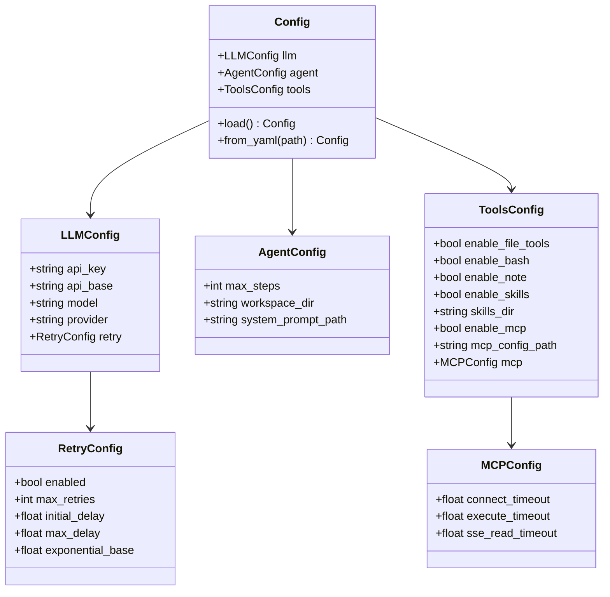
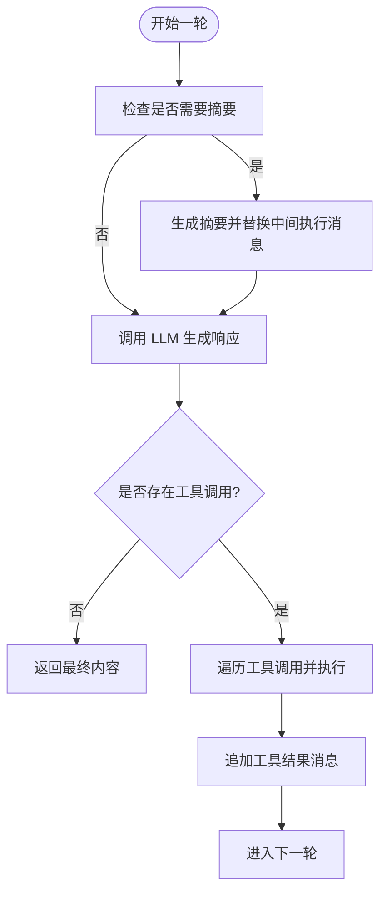
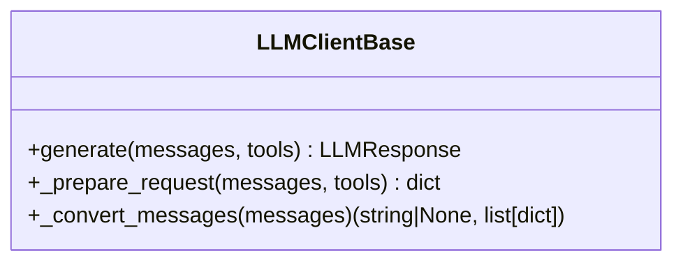
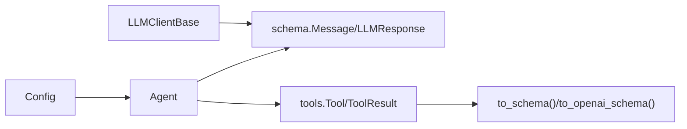

# 数据模型

<cite>
**本文引用的文件**
- [schema.py](file://mini_agent/schema/schema.py)
- [base.py（工具基类）](file://mini_agent/tools/base.py)
- [config.py](file://mini_agent/config.py)
- [agent.py](file://mini_agent/agent.py)
- [base.py（LLM客户端基类）](file://mini_agent/llm/base.py)
- [config-example.yaml](file://mini_agent/config/config-example.yaml)
- [02_simple_agent.py](file://examples/02_simple_agent.py)
- [test_tool_schema.py](file://tests/test_tool_schema.py)
- [skill_tool.py](file://mini_agent/tools/skill_tool.py)
- [skill_loader.py](file://mini_agent/tools/skill_loader.py)
</cite>

## 目录
1. [简介](#简介)
2. [项目结构与数据模型定位](#项目结构与数据模型定位)
3. [核心数据结构总览](#核心数据结构总览)
4. [架构概览与数据流](#架构概览与数据流)
5. [详细组件分析](#详细组件分析)
6. [依赖关系分析](#依赖关系分析)
7. [性能与内存考量](#性能与内存考量)
8. [故障排查指南](#故障排查指南)
9. [结论](#结论)
10. [附录：使用示例与最佳实践](#附录使用示例与最佳实践)

## 简介
本文件系统性梳理 MiniAgent 的数据模型设计与实现，重点覆盖以下方面：
- 核心数据结构：消息模型、工具调用与结果模型、LLM 响应模型、配置模型等
- Pydantic 模型的验证、序列化与反序列化机制
- 模型间的关系与依赖（继承、组合）
- 在智能体执行过程中的使用方式与传递路径
- 扩展方法（新增字段、自定义校验规则）
- 性能优化建议（内存占用、序列化效率）

## 项目结构与数据模型定位
数据模型主要分布在如下模块：
- schema 层：消息、工具调用、LLM 响应、令牌用量等
- tools 层：工具抽象与工具执行结果
- config 层：配置模型（含重试、LLM、Agent、Tools、MCP 等）
- agent 层：智能体运行时状态与消息历史管理
- llm 层：LLM 客户端接口定义，约束消息与响应格式
- 示例与测试：演示数据模型在真实流程中的使用

图表来源
- [schema.py:1-56](file://mini_agent/schema/schema.py#L1-L56)
- [base.py（工具基类）:1-56](file://mini_agent/tools/base.py#L1-L56)
- [config.py:1-221](file://mini_agent/config.py#L1-L221)
- [agent.py:1-524](file://mini_agent/agent.py#L1-L524)
- [base.py（LLM客户端基类）:1-85](file://mini_agent/llm/base.py#L1-L85)
- [02_simple_agent.py:1-213](file://examples/02_simple_agent.py#L1-L213)
- [test_tool_schema.py:1-258](file://tests/test_tool_schema.py#L1-L258)
- [skill_tool.py:1-85](file://mini_agent/tools/skill_tool.py#L1-L85)
- [skill_loader.py:1-257](file://mini_agent/tools/skill_loader.py#L1-L257)

章节来源
- [schema.py:1-56](file://mini_agent/schema/schema.py#L1-L56)
- [base.py（工具基类）:1-56](file://mini_agent/tools/base.py#L1-L56)
- [config.py:1-221](file://mini_agent/config.py#L1-L221)
- [agent.py:1-524](file://mini_agent/agent.py#L1-L524)
- [base.py（LLM客户端基类）:1-85](file://mini_agent/llm/base.py#L1-L85)

## 核心数据结构总览
- 消息模型（Message）：承载对话角色、内容、思考、工具调用等
- 工具调用模型（ToolCall/FunctionCall）：描述函数名与参数
- 工具结果模型（ToolResult）：封装执行成功与否、返回内容与错误信息
- LLM 响应模型（LLMResponse/TokenUsage）：封装生成内容、思考、工具调用、结束原因与令牌用量
- 配置模型（Config/LLMConfig/AgentConfig/ToolsConfig/MCPConfig/RetryConfig）：统一加载与校验配置

章节来源
- [schema.py:14-56](file://mini_agent/schema/schema.py#L14-L56)
- [base.py（工具基类）:8-14](file://mini_agent/tools/base.py#L8-L14)
- [config.py:12-72](file://mini_agent/config.py#L12-L72)

## 架构概览与数据流
下图展示了从配置加载到智能体运行、再到 LLM 调用与工具执行的数据流，以及各数据模型在其中的角色与传递路径。

图表来源
- [config.py:82-164](file://mini_agent/config.py#L82-L164)
- [agent.py:321-524](file://mini_agent/agent.py#L321-L524)
- [base.py（LLM客户端基类）:40-84](file://mini_agent/llm/base.py#L40-L84)
- [schema.py:29-56](file://mini_agent/schema/schema.py#L29-L56)
- [base.py（工具基类）:34-56](file://mini_agent/tools/base.py#L34-L56)

## 详细组件分析

### 消息模型与工具调用模型
- Message：支持字符串或内容块列表；可携带 thinking、tool_calls、tool_call_id、name 等字段
- ToolCall/FunctionCall：描述工具调用的标识、类型与函数签名
- TokenUsage/LLMResponse：封装令牌统计与 LLM 输出（含思考、工具调用、结束原因）

图表来源
- [schema.py:14-56](file://mini_agent/schema/schema.py#L14-L56)

章节来源
- [schema.py:14-56](file://mini_agent/schema/schema.py#L14-L56)

### 工具与工具结果模型
- Tool：抽象工具接口，提供名称、描述、参数模式（JSON Schema）、执行方法与两种平台的 Schema 转换
- ToolResult：统一的工具执行结果载体，包含 success/content/error

图表来源
- [base.py（工具基类）:16-56](file://mini_agent/tools/base.py#L16-L56)
- [skill_tool.py:13-55](file://mini_agent/tools/skill_tool.py#L13-L55)

章节来源
- [base.py（工具基类）:16-56](file://mini_agent/tools/base.py#L16-L56)
- [skill_tool.py:13-55](file://mini_agent/tools/skill_tool.py#L13-L55)

### 配置模型
- Config：聚合 LLMConfig、AgentConfig、ToolsConfig
- LLMConfig：API Key、基础地址、模型、提供商、重试配置
- AgentConfig：最大步数、工作目录、系统提示路径
- ToolsConfig：基础工具开关、技能目录、MCP 开关与超时配置
- MCPConfig：连接、执行、SSE 读取超时
- RetryConfig：重试开关、最大次数、初始延迟、最大延迟、指数退避底数

图表来源
- [config.py:12-72](file://mini_agent/config.py#L12-L72)

章节来源
- [config.py:12-72](file://mini_agent/config.py#L12-L72)
- [config-example.yaml:1-61](file://mini_agent/config/config-example.yaml#L1-L61)

### 智能体运行时与消息历史
- Agent：维护系统提示、消息历史、令牌估算与摘要策略；在每轮中调用 LLM 生成内容与工具调用，执行工具并将结果以 Message 形式写回历史
- 令牌估算：基于编码器估算消息长度，支持降级策略
- 摘要策略：当本地估算或 API 报告的令牌超过阈值时，对用户消息之间的执行过程进行摘要

图表来源
- [agent.py:180-320](file://mini_agent/agent.py#L180-L320)

章节来源
- [agent.py:45-524](file://mini_agent/agent.py#L45-L524)

### LLM 客户端接口
- LLMClientBase：定义 generate、请求准备与消息转换的抽象接口，确保不同提供商的实现遵循统一的消息与响应契约

图表来源
- [base.py（LLM客户端基类）:10-85](file://mini_agent/llm/base.py#L10-L85)

章节来源
- [base.py（LLM客户端基类）:10-85](file://mini_agent/llm/base.py#L10-L85)

## 依赖关系分析
- Agent 依赖 schema.Message 与 tools.Tool/ToolResult，用于构建消息历史与处理工具执行结果
- LLM 客户端接口依赖 schema.Message/LLMResponse，保证输入输出格式一致
- Config 提供统一配置入口，被 Agent 初始化与 LLM 客户端初始化使用
- 工具 Schema 转换（Anthropic/OpenAI）依赖工具参数模式（JSON Schema），由工具自身提供

图表来源
- [agent.py:48-80](file://mini_agent/agent.py#L48-L80)
- [base.py（LLM客户端基类）:10-85](file://mini_agent/llm/base.py#L10-L85)
- [config.py:66-72](file://mini_agent/config.py#L66-L72)
- [base.py（工具基类）:38-56](file://mini_agent/tools/base.py#L38-L56)

章节来源
- [agent.py:48-80](file://mini_agent/agent.py#L48-L80)
- [base.py（LLM客户端基类）:10-85](file://mini_agent/llm/base.py#L10-L85)
- [config.py:66-72](file://mini_agent/config.py#L66-L72)
- [base.py（工具基类）:38-56](file://mini_agent/tools/base.py#L38-L56)

## 性能与内存考量
- 令牌估算
  - 使用编码器估算消息长度，避免上下文溢出
  - 当编码器不可用时采用字符计数降级策略
- 消息历史压缩
  - 超限时进行摘要，减少上下文长度
- 序列化与反序列化
  - Pydantic 模型默认高效，建议保持字段类型明确，避免过深嵌套
  - 对大对象（如工具返回内容）优先使用分页或流式处理
- 工具执行
  - 将工具结果以 ToolResult 统一承载，便于快速判断与日志记录
- 配置加载
  - 使用 from_yaml 一次性解析并校验，避免重复 IO 与解析

章节来源
- [agent.py:123-178](file://mini_agent/agent.py#L123-L178)
- [config.py:82-164](file://mini_agent/config.py#L82-L164)

## 故障排查指南
- 配置文件缺失或无效
  - 现象：加载配置时报错或空配置
  - 排查：确认配置文件存在且包含必要字段（如 API Key），参考示例配置
- LLM 调用失败
  - 现象：抛出重试耗尽异常或一般异常
  - 排查：查看重试配置与网络状况，检查 API Key 与基础地址
- 工具执行异常
  - 现象：ToolResult.success=False，包含错误详情
  - 排查：捕获异常并记录堆栈，确保工具参数符合 JSON Schema
- 消息历史过长
  - 现象：上下文溢出或性能下降
  - 排查：启用摘要策略，调整最大步数与令牌阈值

章节来源
- [config.py:74-94](file://mini_agent/config.py#L74-L94)
- [agent.py:371-383](file://mini_agent/agent.py#L371-L383)
- [base.py（工具基类）:34-56](file://mini_agent/tools/base.py#L34-L56)

## 结论
本数据模型体系以 Pydantic 为核心，围绕消息、工具、LLM 响应与配置四类模型构建了清晰、可扩展的数据契约。通过统一的接口与严格的类型约束，确保了智能体在多轮对话与工具执行过程中的稳定性与可维护性。配合令牌估算与摘要策略，有效控制了上下文开销；通过配置模型集中管理参数，提升了部署灵活性。

## 附录：使用示例与最佳实践

### 使用示例：在智能体执行中使用数据模型
- 配置加载与初始化
  - 参考示例：[02_simple_agent.py:25-72](file://examples/02_simple_agent.py#L25-L72)
  - 关键点：从 YAML 加载配置，传入 Agent 构造函数，设置系统提示与工具集合
- 消息历史与工具调用
  - 参考实现：[agent.py:361-524](file://mini_agent/agent.py#L361-L524)
  - 关键点：每轮生成后追加 Message，若存在 tool_calls 则执行工具并追加 tool 消息
- 工具 Schema 转换
  - 参考测试：[test_tool_schema.py:137-243](file://tests/test_tool_schema.py#L137-L243)
  - 关键点：工具需提供 JSON Schema 参数，支持 Anthropic 与 OpenAI 两种格式

章节来源
- [02_simple_agent.py:25-72](file://examples/02_simple_agent.py#L25-L72)
- [agent.py:361-524](file://mini_agent/agent.py#L361-L524)
- [test_tool_schema.py:137-243](file://tests/test_tool_schema.py#L137-L243)

### 扩展方法与最佳实践
- 新增字段
  - 在现有 Pydantic 模型中添加字段时，建议提供默认值或显式校验，避免破坏向后兼容
  - 若涉及 LLM 输入/输出，同步更新 Schema 与转换逻辑
- 自定义校验规则
  - 使用 Pydantic 的字段校验与模型级 validator，确保数据一致性
  - 对复杂字段（如工具参数）建议提供示例与约束说明
- 传递与转换
  - 在 Agent 与 LLM 客户端之间传递时，尽量保持 Message/LLMResponse 的结构不变
  - 工具 Schema 转换需保持名称与描述一致，仅在嵌套结构上适配不同提供商
- 性能优化
  - 控制消息长度：限制单条消息大小，避免超长内容直接进入上下文
  - 合理使用摘要：在用户消息之间插入摘要，降低整体上下文
  - 减少不必要的序列化：对临时对象避免频繁序列化，复用已有的模型实例

章节来源
- [schema.py:14-56](file://mini_agent/schema/schema.py#L14-L56)
- [base.py（工具基类）:38-56](file://mini_agent/tools/base.py#L38-L56)
- [agent.py:180-320](file://mini_agent/agent.py#L180-L320)