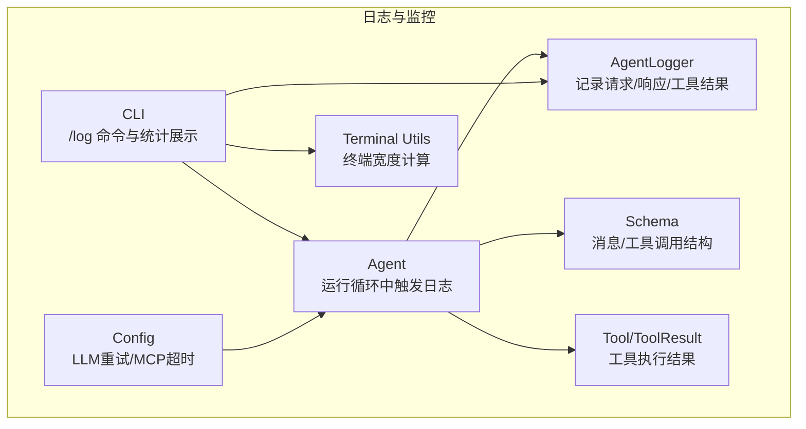
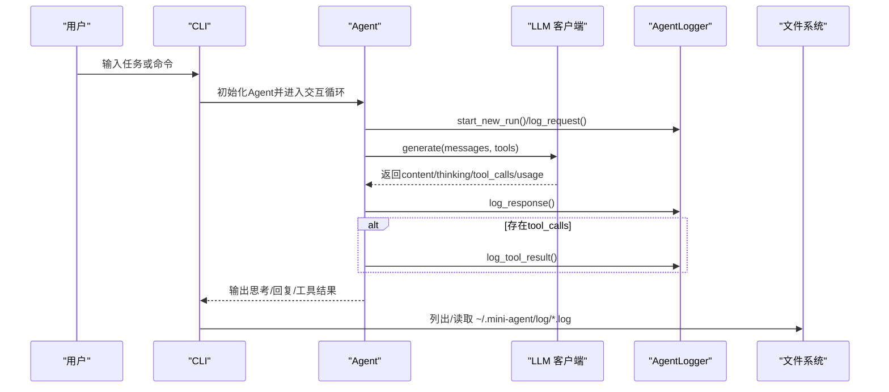
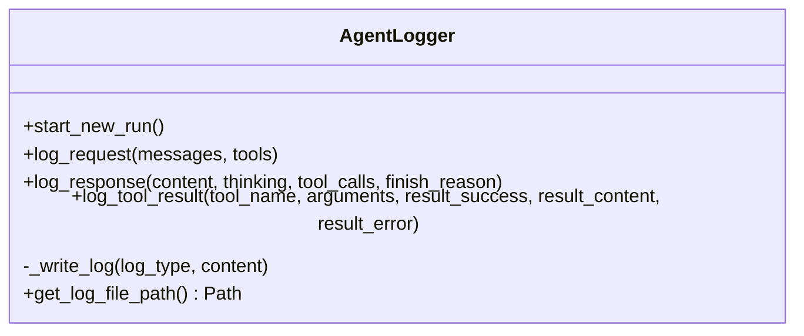
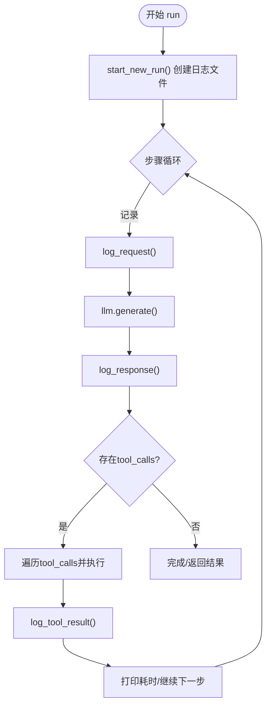
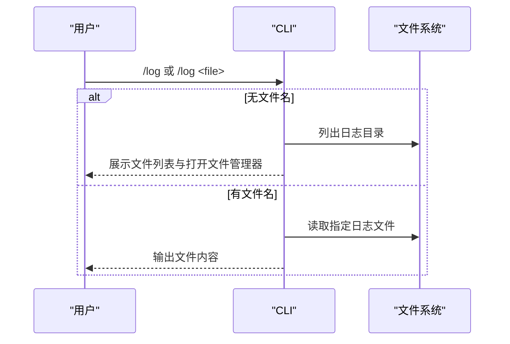
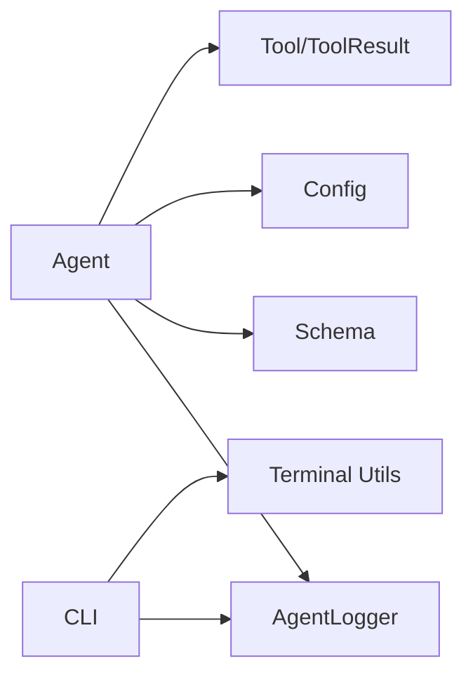

# 日志和监控

<cite>
**本文引用的文件**
- [logger.py](file://mini_agent/logger.py)
- [agent.py](file://mini_agent/agent.py)
- [cli.py](file://mini_agent/cli.py)
- [terminal_utils.py](file://mini_agent/utils/terminal_utils.py)
- [config.py](file://mini_agent/config.py)
- [schema.py](file://mini_agent/schema/schema.py)
- [config-example.yaml](file://mini_agent/config/config-example.yaml)
- [system_prompt.md](file://mini_agent/config/system_prompt.md)
- [base.py](file://mini_agent/tools/base.py)
- [test_agent.py](file://tests/test_agent.py)
</cite>

## 目录
1. [简介](#简介)
2. [项目结构](#项目结构)
3. [核心组件](#核心组件)
4. [架构总览](#架构总览)
5. [详细组件分析](#详细组件分析)
6. [依赖关系分析](#依赖关系分析)
7. [性能考量](#性能考量)
8. [故障排除指南](#故障排除指南)
9. [结论](#结论)
10. [附录](#附录)

## 简介
本文件面向“日志与监控”主题，系统化梳理 Mini Agent 的日志设计与实现、终端工具与用户反馈机制、性能监控与指标采集、以及生产环境的最佳实践。内容覆盖：
- 日志系统：请求/响应日志、工具执行日志、调试信息的记录策略与格式
- 日志级别与输出目标：当前实现为纯文本文件，建议扩展为多通道输出
- 终端工具：交互式界面、命令与快捷键、用户反馈与统计展示
- 性能监控：执行时间统计、资源使用（令牌用量）、错误率监控
- 分析与排障：日志过滤、搜索与可视化建议
- 生产实践：日志轮转、存储与安全

## 项目结构
围绕日志与监控的关键模块与文件如下：
- 日志记录器：AgentLogger 负责写入 ~/.mini-agent/log/ 下的 agent_run_*.log 文件
- Agent 执行流程：在每步运行中记录 LLM 请求/响应与工具调用结果
- CLI 与终端：提供 /log 子命令、会话统计、帮助与交互体验
- 配置系统：提供 LLM 重试、MCP 超时等影响日志与监控的参数
- 工具基类：统一的 ToolResult 结构便于记录工具执行结果

**图表来源**
- [logger.py:11-179](file://mini_agent/logger.py#L11-L179)
- [agent.py:321-524](file://mini_agent/agent.py#L321-L524)
- [cli.py:78-179](file://mini_agent/cli.py#L78-L179)
- [config.py:66-221](file://mini_agent/config.py#L66-L221)
- [schema.py:29-56](file://mini_agent/schema/schema.py#L29-L56)
- [terminal_utils.py:18-68](file://mini_agent/utils/terminal_utils.py#L18-L68)
- [base.py:8-56](file://mini_agent/tools/base.py#L8-L56)

**章节来源**
- [logger.py:11-179](file://mini_agent/logger.py#L11-L179)
- [agent.py:321-524](file://mini_agent/agent.py#L321-L524)
- [cli.py:78-179](file://mini_agent/cli.py#L78-L179)
- [config.py:66-221](file://mini_agent/config.py#L66-L221)
- [schema.py:29-56](file://mini_agent/schema/schema.py#L29-L56)
- [terminal_utils.py:18-68](file://mini_agent/utils/terminal_utils.py#L18-L68)
- [base.py:8-56](file://mini_agent/tools/base.py#L8-L56)

## 核心组件
- AgentLogger：负责按会话生成日志文件，记录 LLM 请求、响应与工具执行结果；采用纯文本 JSON 化结构，带索引与时间戳
- Agent：在每次 LLM 调用前后记录请求/响应，并在工具调用后记录执行结果；同时统计会话耗时与消息数
- CLI：提供 /log 子命令列出最近日志、打开文件管理器、读取指定日志文件；显示会话统计与帮助信息
- 配置系统：提供 LLM 重试与 MCP 超时配置，间接影响日志质量与稳定性
- 工具基类：ToolResult 统一返回结构，便于日志记录成功/失败与错误详情

**章节来源**
- [logger.py:11-179](file://mini_agent/logger.py#L11-L179)
- [agent.py:321-524](file://mini_agent/agent.py#L321-L524)
- [cli.py:78-179](file://mini_agent/cli.py#L78-L179)
- [config.py:66-221](file://mini_agent/config.py#L66-L221)
- [base.py:8-56](file://mini_agent/tools/base.py#L8-L56)

## 架构总览
下图展示了从用户输入到日志落盘的整体流程，以及 CLI 对日志的查看与统计功能。

**图表来源**
- [agent.py:336-421](file://mini_agent/agent.py#L336-L421)
- [logger.py:30-121](file://mini_agent/logger.py#L30-L121)
- [cli.py:78-179](file://mini_agent/cli.py#L78-L179)

## 详细组件分析

### AgentLogger：日志记录器
- 会话管理：每个 run 启动时创建新的日志文件，文件名包含时间戳
- 记录类型：
  - REQUEST：消息列表与可用工具名称（仅记录名称）
  - RESPONSE：内容、思维片段、工具调用、结束原因
  - TOOL_RESULT：工具名、参数、成功标志、结果或错误
- 写入格式：每条日志带自增索引与毫秒级时间戳，内容为 JSON 字符串
- 输出位置：~/.mini-agent/log/ 下的 agent_run_*.log

**图表来源**
- [logger.py:11-179](file://mini_agent/logger.py#L11-L179)

**章节来源**
- [logger.py:11-179](file://mini_agent/logger.py#L11-L179)

### Agent：运行与日志触发点
- 在 run 开始时启动新会话并记录日志头
- 每步运行前记录 LLM 请求（含工具清单）
- 接收 LLM 响应后记录响应内容、思维、工具调用与结束原因
- 工具调用后记录工具执行结果（成功/失败、内容/错误）
- 统计每步与总耗时，用于 CLI 的会话统计展示

**图表来源**
- [agent.py:336-421](file://mini_agent/agent.py#L336-L421)
- [logger.py:43-157](file://mini_agent/logger.py#L43-L157)

**章节来源**
- [agent.py:321-524](file://mini_agent/agent.py#L321-L524)
- [logger.py:43-157](file://mini_agent/logger.py#L43-L157)

### CLI：终端工具与用户反馈
- /log 子命令
  - 不带参数：列出 ~/.mini-agent/log/ 下最近修改的若干日志文件，并尝试打开文件管理器
  - 带文件名：读取并展示该日志文件内容
- 会话统计：显示会话时长、消息总数、各类消息数量、可用工具数、API 总令牌用量
- 交互体验：提供帮助、清屏、历史、退出等命令与快捷键；支持 Esc 取消当前执行

**图表来源**
- [cli.py:78-179](file://mini_agent/cli.py#L78-L179)

**章节来源**
- [cli.py:78-179](file://mini_agent/cli.py#L78-L179)
- [terminal_utils.py:18-68](file://mini_agent/utils/terminal_utils.py#L18-L68)

### 配置与监控参数
- LLM 重试：控制最大重试次数、初始延迟、最大延迟与指数回退底数，影响日志中的异常与重试提示
- MCP 超时：连接、执行与 SSE 读取超时，避免长时间挂起导致日志堆积与资源占用
- 工作空间与系统提示：影响工具行为与日志上下文

**章节来源**
- [config.py:12-221](file://mini_agent/config.py#L12-L221)
- [config-example.yaml:28-61](file://mini_agent/config/config-example.yaml#L28-L61)
- [system_prompt.md:1-76](file://mini_agent/config/system_prompt.md#L1-L76)

### 工具执行与结果记录
- ToolResult：统一的成功/失败标志与内容/错误字段，便于日志记录与后续分析
- Agent 在工具执行后记录工具名、参数、结果或错误，支持快速定位问题

**章节来源**
- [base.py:8-56](file://mini_agent/tools/base.py#L8-L56)
- [agent.py:476-493](file://mini_agent/agent.py#L476-L493)

## 依赖关系分析
- Agent 依赖 AgentLogger 进行日志记录
- Agent 使用 Schema 中的消息与工具调用结构
- CLI 依赖 AgentLogger 获取日志路径与文件列表
- CLI 依赖 Terminal Utils 进行终端宽度计算与布局
- 配置系统为 Agent 提供 LLM 重试与 MCP 超时参数

**图表来源**
- [agent.py:78-84](file://mini_agent/agent.py#L78-L84)
- [logger.py:11-29](file://mini_agent/logger.py#L11-L29)
- [cli.py:78-126](file://mini_agent/cli.py#L78-L126)
- [terminal_utils.py:18-68](file://mini_agent/utils/terminal_utils.py#L18-L68)
- [config.py:66-221](file://mini_agent/config.py#L66-L221)
- [base.py:8-56](file://mini_agent/tools/base.py#L8-L56)
- [schema.py:29-56](file://mini_agent/schema/schema.py#L29-L56)

**章节来源**
- [agent.py:78-84](file://mini_agent/agent.py#L78-L84)
- [logger.py:11-29](file://mini_agent/logger.py#L11-L29)
- [cli.py:78-126](file://mini_agent/cli.py#L78-L126)
- [terminal_utils.py:18-68](file://mini_agent/utils/terminal_utils.py#L18-L68)
- [config.py:66-221](file://mini_agent/config.py#L66-L221)
- [base.py:8-56](file://mini_agent/tools/base.py#L8-L56)
- [schema.py:29-56](file://mini_agent/schema/schema.py#L29-L56)

## 性能考量
- 执行时间统计
  - 步级耗时：每步开始与结束分别记录时间，计算该步耗时
  - 总耗时：会话开始到结束累计耗时，CLI 统计展示
- 令牌用量
  - API 报告的 total_tokens 累积，CLI 统计展示
  - 本地估算：基于 cl100k_base 编码估算消息总 token，超过阈值触发摘要
- 错误率监控
  - LLM 重试机制：可配置最大重试次数与回退策略，CLI 回调打印重试信息
  - 工具执行异常：捕获异常并以 ToolResult.error 记录，便于日志分析
- 资源使用
  - 当前未直接采集 CPU/内存等指标，建议结合外部监控系统（如进程级采样）进行补充

**章节来源**
- [agent.py:418-421](file://mini_agent/agent.py#L418-L421)
- [agent.py:385-388](file://mini_agent/agent.py#L385-L388)
- [agent.py:123-178](file://mini_agent/agent.py#L123-L178)
- [config.py:12-21](file://mini_agent/config.py#L12-L21)
- [cli.py:261-282](file://mini_agent/cli.py#L261-L282)

## 故障排除指南
- 日志目录与文件
  - 使用 /log 查看 ~/.mini-agent/log/ 下的日志文件列表，必要时自动打开文件管理器
  - 使用 /log <file> 读取指定日志文件，核对 REQUEST/RESPONSE/TOOL_RESULT 的顺序与完整性
- 会话统计
  - 使用 /stats 查看会话时长、消息数、工具调用数与 API 令牌用量，辅助定位异常耗时或高用量场景
- 重试与取消
  - 若 LLM 多次重试仍失败，检查网络与 API Key 配置；可通过 /stats 观察重试次数
  - 使用 Esc 取消当前执行，Agent 会在安全点清理不完整消息，避免状态不一致
- 工具执行失败
  - 查看 TOOL_RESULT 的 error 字段，结合工具参数与返回内容定位问题
- 配置校验
  - 确认 config.yaml 的 api_key、provider、api_base、tools 开关与 MCP 超时设置合理

**章节来源**
- [cli.py:78-179](file://mini_agent/cli.py#L78-L179)
- [cli.py:261-282](file://mini_agent/cli.py#L261-L282)
- [agent.py:344-349](file://mini_agent/agent.py#L344-L349)
- [agent.py:464-474](file://mini_agent/agent.py#L464-L474)
- [config-example.yaml:14-61](file://mini_agent/config/config-example.yaml#L14-L61)

## 结论
本项目通过 AgentLogger 将 LLM 请求/响应与工具执行过程完整记录到本地文件，配合 CLI 的日志浏览与会话统计，形成从“可观测性”到“可诊断”的闭环。建议在现有基础上扩展：
- 多通道日志输出（控制台、文件、远程日志服务）
- 结构化日志（JSON/Protobuf）与标签化字段
- 指标采集（令牌用量、执行耗时、错误率）与可视化面板
- 日志轮转与归档策略，保障生产环境稳定性与合规性

## 附录

### 日志记录策略与格式
- 记录内容
  - REQUEST：消息列表（含 thinking、tool_calls、tool_call_id、name 等），工具名称列表
  - RESPONSE：content、thinking、tool_calls、finish_reason
  - TOOL_RESULT：tool_name、arguments、success、result 或 error
- 格式与输出
  - 文本文件，每条日志带索引与时间戳
  - 内容为 JSON 字符串，便于解析与检索

**章节来源**
- [logger.py:43-157](file://mini_agent/logger.py#L43-L157)

### 终端工具与用户反馈
- 命令与快捷键
  - /help、/clear、/history、/stats、/log、/exit
  - Esc 取消、Ctrl+C 退出、Ctrl+U 清空行、Ctrl+L 清屏、Tab 自动补全
- 统计信息
  - 会话时长、消息总数、各类消息数量、可用工具数、API 令牌用量

**章节来源**
- [cli.py:191-221](file://mini_agent/cli.py#L191-L221)
- [cli.py:261-282](file://mini_agent/cli.py#L261-L282)

### 性能监控与指标采集建议
- 指标
  - 每步耗时、总耗时、API 令牌用量、工具调用次数与成功率
- 采集方式
  - 在 Agent.run 中记录时间戳与 usage；在 CLI 中展示统计
- 可视化
  - 建议使用外部监控系统（如 Prometheus/Grafana）采集与展示

**章节来源**
- [agent.py:418-421](file://mini_agent/agent.py#L418-L421)
- [agent.py:385-388](file://mini_agent/agent.py#L385-L388)
- [cli.py:261-282](file://mini_agent/cli.py#L261-L282)

### 生产环境日志管理最佳实践
- 日志轮转
  - 基于大小或时间的轮转，保留近期 N 份日志
- 存储
  - 异地备份与归档，压缩与加密传输
- 安全
  - 敏感信息脱敏（如 API Key、路径、内容），最小权限访问
- 可观测性
  - 结构化日志与标签化字段，便于检索与聚合
  - 指标采集与告警（错误率、P95/P99 耗时）

[本节为通用实践建议，无需特定文件引用]

### 示例与参考
- 测试用例展示了 Agent 的基本运行流程与日志输出位置，可用于验证日志是否正常生成

**章节来源**
- [test_agent.py:16-94](file://tests/test_agent.py#L16-L94)