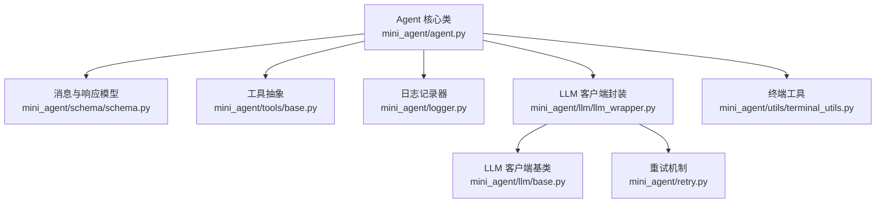
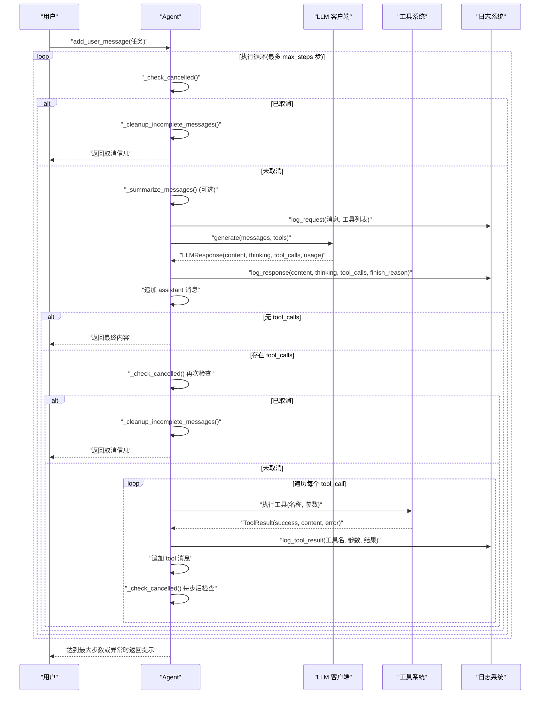
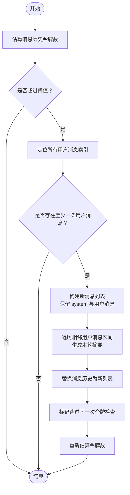
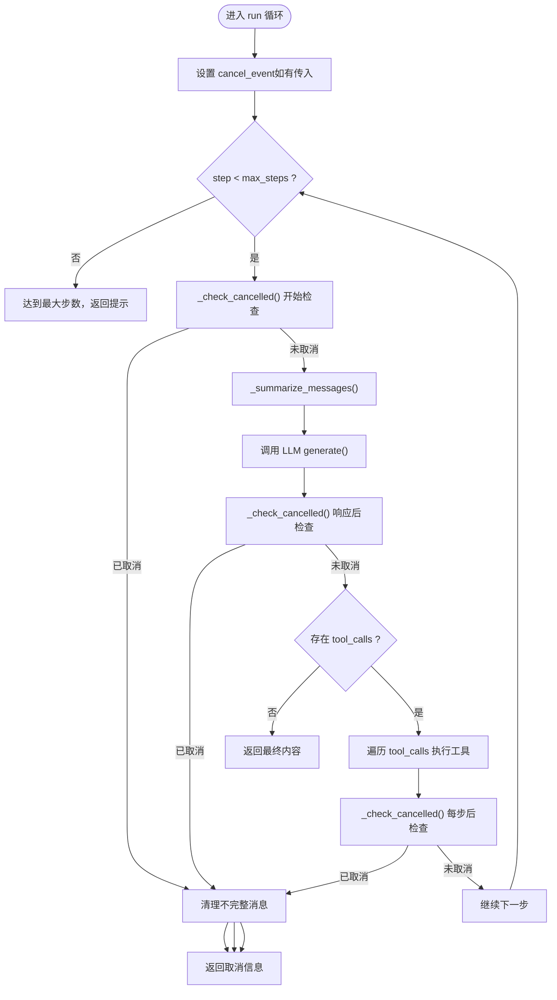
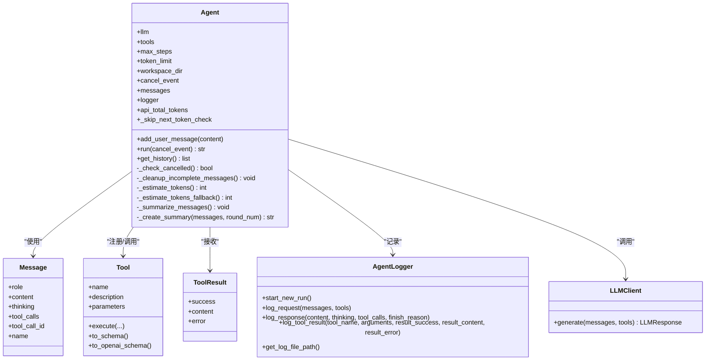

# Agent 核心类

<cite>
**本文档引用的文件**
- [agent.py](file://mini_agent/agent.py)
- [schema.py](file://mini_agent/schema/schema.py)
- [base.py](file://mini_agent/tools/base.py)
- [logger.py](file://mini_agent/logger.py)
- [llm_wrapper.py](file://mini_agent/llm/llm_wrapper.py)
- [base.py](file://mini_agent/llm/base.py)
- [retry.py](file://mini_agent/retry.py)
- [terminal_utils.py](file://mini_agent/utils/terminal_utils.py)
- [02_simple_agent.py](file://examples/02_simple_agent.py)
- [04_full_agent.py](file://examples/04_full_agent.py)
- [test_agent.py](file://tests/test_agent.py)
</cite>

## 目录
1. [简介](#简介)
2. [项目结构](#项目结构)
3. [核心组件](#核心组件)
4. [架构总览](#架构总览)
5. [详细组件分析](#详细组件分析)
6. [依赖关系分析](#依赖关系分析)
7. [性能考虑](#性能考虑)
8. [故障排除指南](#故障排除指南)
9. [结论](#结论)
10. [附录](#附录)

## 简介
本文件面向希望深入理解并使用 Agent 核心类的开发者，系统性阐述 Agent 的完整实现，包括：
- 初始化流程与关键属性配置
- 消息历史管理策略（含令牌估算与自动摘要）
- 智能体核心功能：消息添加、工具注册与调用、执行循环控制
- 取消与中断机制：cancel_event 的使用与 _check_cancelled 的工作原理
- 与其他组件的关系：LLM 客户端、工具系统、日志系统
- 实战示例：如何创建与配置 Agent 实例，包含 LLM 客户端集成、工具集合管理、工作空间设置等

## 项目结构
Agent 核心类位于 mini_agent/agent.py，围绕其的关键依赖包括：
- 数据模型与消息结构：schema.py 中的 Message、LLMResponse 等
- 工具系统：tools/base.py 中的 Tool、ToolResult 抽象
- 日志系统：logger.py 中的 AgentLogger
- LLM 客户端：llm/llm_wrapper.py 提供统一接口，内部委托具体提供商客户端
- 终端显示工具：utils/terminal_utils.py 提供终端宽度计算等
- 示例与测试：examples 与 tests 下的脚本演示典型用法

图表来源
- [agent.py:45-524](file://mini_agent/agent.py#L45-L524)
- [schema.py:29-56](file://mini_agent/schema/schema.py#L29-L56)
- [base.py:16-56](file://mini_agent/tools/base.py#L16-L56)
- [logger.py:11-179](file://mini_agent/logger.py#L11-L179)
- [llm_wrapper.py:18-128](file://mini_agent/llm/llm_wrapper.py#L18-L128)
- [base.py:10-85](file://mini_agent/llm/base.py#L10-L85)
- [retry.py:23-139](file://mini_agent/retry.py#L23-L139)
- [terminal_utils.py:18-157](file://mini_agent/utils/terminal_utils.py#L18-L157)

章节来源
- [agent.py:45-524](file://mini_agent/agent.py#L45-L524)
- [schema.py:29-56](file://mini_agent/schema/schema.py#L29-L56)
- [base.py:16-56](file://mini_agent/tools/base.py#L16-L56)
- [logger.py:11-179](file://mini_agent/logger.py#L11-L179)
- [llm_wrapper.py:18-128](file://mini_agent/llm/llm_wrapper.py#L18-L128)
- [base.py:10-85](file://mini_agent/llm/base.py#L10-L85)
- [retry.py:23-139](file://mini_agent/retry.py#L23-L139)
- [terminal_utils.py:18-157](file://mini_agent/utils/terminal_utils.py#L18-L157)

## 核心组件
- Agent 类：负责智能体生命周期管理、消息历史维护、工具调度、LLM 调用、日志记录、令牌估算与摘要、取消与中断处理。
- Message/LLMResponse：标准化消息与 LLM 响应的数据结构，支持 thinking、tool_calls 等扩展字段。
- Tool/ToolResult：工具抽象与结果封装，统一工具参数模式与错误处理。
- AgentLogger：按回合记录请求、响应与工具执行结果，便于调试与审计。
- LLMClient：多提供商统一入口，内部委派具体提供商客户端，并集成重试机制。
- 终端工具：计算显示宽度，确保在不同终端字符宽度下输出框线对齐。

章节来源
- [agent.py:45-524](file://mini_agent/agent.py#L45-L524)
- [schema.py:29-56](file://mini_agent/schema/schema.py#L29-L56)
- [base.py:16-56](file://mini_agent/tools/base.py#L16-L56)
- [logger.py:11-179](file://mini_agent/logger.py#L11-L179)
- [llm_wrapper.py:18-128](file://mini_agent/llm/llm_wrapper.py#L18-L128)

## 架构总览
Agent 的运行时架构如下：用户通过 add_user_message 添加任务描述；Agent 在每步中调用 LLM 生成内容与工具调用计划；根据工具调用执行相应工具，将结果作为“tool”消息加入历史；当令牌超限时触发摘要压缩；支持取消事件中断当前步骤并清理不完整消息。

图表来源
- [agent.py:321-520](file://mini_agent/agent.py#L321-L520)
- [logger.py:43-157](file://mini_agent/logger.py#L43-L157)
- [llm_wrapper.py:113-127](file://mini_agent/llm/llm_wrapper.py#L113-L127)
- [base.py:34-36](file://mini_agent/tools/base.py#L34-L36)

章节来源
- [agent.py:321-520](file://mini_agent/agent.py#L321-L520)
- [logger.py:43-157](file://mini_agent/logger.py#L43-L157)
- [llm_wrapper.py:113-127](file://mini_agent/llm/llm_wrapper.py#L113-L127)
- [base.py:34-36](file://mini_agent/tools/base.py#L34-L36)

## 详细组件分析

### 初始化与属性配置
- 关键参数
  - llm_client: LLM 客户端实例，统一接入不同提供商
  - system_prompt: 系统提示词，Agent 会自动注入工作空间信息（若未包含）
  - tools: 工具列表，内部转换为字典以名称索引
  - max_steps: 最大执行步数，默认 50
  - workspace_dir: 工作空间目录，自动创建
  - token_limit: 令牌上限，超过时触发消息摘要
- 初始化要点
  - 创建工作空间目录
  - 注入工作空间信息到 system_prompt
  - 初始化消息历史（首条为 system 消息）
  - 初始化日志器
  - 记录 API 总令牌数与跳过下一次令牌检查标志（避免摘要后连续触发）

章节来源
- [agent.py:48-85](file://mini_agent/agent.py#L48-L85)

### 消息历史管理与令牌估算
- 消息结构
  - 支持 role、content、thinking、tool_calls、tool_call_id、name 等字段
  - LLMResponse 包含 content、thinking、tool_calls、finish_reason、usage
- 令牌估算
  - 使用 cl100k_base 编码器进行精确估算，回退到字符计数估算
  - 对文本内容、thinking、tool_calls 分别统计，并附加消息元数据开销
- 自动摘要
  - 当本地估算或 API 报告的令牌数超过阈值时，对用户消息之间的执行过程进行摘要
  - 保留用户消息与摘要消息，形成“system -> user -> summary -> user -> summary ...”结构
  - 摘要完成后跳过下一次令牌检查，等待下一次 LLM 调用更新 API 令牌数

图表来源
- [agent.py:180-261](file://mini_agent/agent.py#L180-L261)
- [agent.py:123-178](file://mini_agent/agent.py#L123-L178)
- [schema.py:29-56](file://mini_agent/schema/schema.py#L29-L56)

章节来源
- [agent.py:123-261](file://mini_agent/agent.py#L123-L261)
- [schema.py:29-56](file://mini_agent/schema/schema.py#L29-L56)

### 智能体核心功能
- 消息添加
  - add_user_message：向历史末尾追加用户消息
- 工具注册与调用
  - 工具集合以名称索引存储，便于 LLM 识别与调用
  - 工具执行结果封装为 ToolResult，支持成功与失败两种状态
- 执行循环控制
  - run：主循环，每步检查取消、摘要、调用 LLM、记录响应、处理工具调用、打印输出、统计耗时
  - 循环终止条件：无工具调用（任务完成）、达到最大步数、被取消

章节来源
- [agent.py:86-520](file://mini_agent/agent.py#L86-L520)
- [base.py:8-36](file://mini_agent/tools/base.py#L8-L36)

### 取消与中断机制
- cancel_event：外部可设置的 asyncio.Event，用于请求中断当前执行
- _check_cancelled：在关键安全点检查取消状态
- _cleanup_incomplete_messages：移除最后一条 assistant 消息及其后续工具结果，保持消息一致性
- run 中在以下位置检查取消：
  - 每步开始
  - LLM 响应后（防止在工具执行前中断）
  - 工具执行后（保证每步结束后再检查）

图表来源
- [agent.py:321-520](file://mini_agent/agent.py#L321-L520)
- [agent.py:90-122](file://mini_agent/agent.py#L90-L122)

章节来源
- [agent.py:90-122](file://mini_agent/agent.py#L90-L122)
- [agent.py:321-520](file://mini_agent/agent.py#L321-L520)

### 与其他组件的关系
- LLM 客户端集成
  - LLMClient 封装 Anthropic/OpenAI 等提供商，统一 generate 接口
  - Agent 将消息与工具列表直接传递给 LLM.generate，由 LLM 客户端负责序列化与请求准备
  - LLMResponse.usage 用于更新 API 总令牌数，参与令牌检查
- 工具系统
  - 工具必须实现 Tool.execute 并返回 ToolResult
  - Agent 将工具调用参数解包后异步执行，捕获异常并转换为失败结果
- 日志系统
  - AgentLogger 记录每轮请求、响应与工具执行结果，包含时间戳与序号
  - 日志文件保存在用户主目录下的 .mini-agent/log/ 目录

章节来源
- [llm_wrapper.py:18-128](file://mini_agent/llm/llm_wrapper.py#L18-L128)
- [base.py:10-85](file://mini_agent/llm/base.py#L10-L85)
- [schema.py:48-56](file://mini_agent/schema/schema.py#L48-L56)
- [base.py:16-56](file://mini_agent/tools/base.py#L16-L56)
- [logger.py:11-179](file://mini_agent/logger.py#L11-L179)

### 具体使用示例与最佳实践
- 基础示例：创建 Agent 并执行简单文件操作
  - 加载配置、初始化 LLMClient、准备工具集合（读写、编辑、Bash）
  - 创建 Agent 实例，设置 system_prompt 与 workspace_dir
  - 调用 add_user_message 添加任务，await agent.run() 获取结果
- 完整示例：启用会话记忆、MCP 工具与技能
  - 在基础工具基础上增加 SessionNoteTool/RecallNoteTool
  - 异步加载 MCP 工具并合并到工具集合
  - 多轮对话与复杂任务编排

章节来源
- [02_simple_agent.py:19-113](file://examples/02_simple_agent.py#L19-L113)
- [04_full_agent.py:24-184](file://examples/04_full_agent.py#L24-L184)
- [test_agent.py:15-94](file://tests/test_agent.py#L15-L94)

## 依赖关系分析
- Agent 与消息模型
  - 依赖 Message、LLMResponse、ToolCall、FunctionCall 等结构
- Agent 与工具系统
  - 依赖 Tool、ToolResult 抽象，工具需实现 execute 并返回 ToolResult
- Agent 与 LLM 客户端
  - 依赖 LLMClient.generate 返回 LLMResponse，使用 usage.total_tokens 更新令牌统计
- Agent 与日志系统
  - 依赖 AgentLogger 的 log_request/log_response/log_tool_result
- Agent 与终端工具
  - 依赖 calculate_display_width 进行输出框线宽度计算

图表来源
- [agent.py:45-524](file://mini_agent/agent.py#L45-L524)
- [schema.py:29-56](file://mini_agent/schema/schema.py#L29-L56)
- [base.py:16-56](file://mini_agent/tools/base.py#L16-L56)
- [logger.py:11-179](file://mini_agent/logger.py#L11-L179)
- [llm_wrapper.py:18-128](file://mini_agent/llm/llm_wrapper.py#L18-L128)

章节来源
- [agent.py:45-524](file://mini_agent/agent.py#L45-L524)
- [schema.py:29-56](file://mini_agent/schema/schema.py#L29-L56)
- [base.py:16-56](file://mini_agent/tools/base.py#L16-L56)
- [logger.py:11-179](file://mini_agent/logger.py#L11-L179)
- [llm_wrapper.py:18-128](file://mini_agent/llm/llm_wrapper.py#L18-L128)

## 性能考虑
- 令牌估算与摘要
  - 使用 tiktoken 进行精确估算，必要时回退到字符计数估算，平衡准确性与性能
  - 摘要策略仅压缩用户消息之间的执行过程，保留用户意图与摘要结构，减少上下文长度
- 工具执行
  - 工具执行为异步，避免阻塞主循环；对异常进行捕获并转为 ToolResult，保证流程稳定
- 输出渲染
  - 使用终端宽度计算函数确保跨平台显示一致，避免布局错位导致的额外重算成本

## 故障排除指南
- LLM 调用失败
  - 若出现重试耗尽异常，Agent 会捕获 RetryExhaustedError 并返回包含尝试次数与最后一次错误的提示
  - 建议检查网络连接、API 密钥、模型名称与提供商配置
- 工具执行异常
  - 工具抛出的异常会被捕获并封装为失败的 ToolResult，同时记录详细错误与堆栈
  - 建议在工具内部做好输入校验与边界处理
- 取消无效
  - 确保在调用 run 前设置 cancel_event，或在外部通过事件对象 set() 触发
  - 取消仅在安全点生效，可能需要等待当前工具执行完毕后再清理不完整消息
- 令牌溢出
  - 若频繁触发摘要，建议优化 system_prompt 或减少中间执行消息长度
  - 可适当提高 token_limit，但需权衡上下文窗口限制

章节来源
- [agent.py:371-383](file://mini_agent/agent.py#L371-L383)
- [retry.py:64-71](file://mini_agent/retry.py#L64-L71)
- [agent.py:461-474](file://mini_agent/agent.py#L461-L474)
- [agent.py:90-122](file://mini_agent/agent.py#L90-L122)
- [agent.py:180-261](file://mini_agent/agent.py#L180-L261)

## 结论
Agent 核心类通过清晰的消息历史管理、可靠的工具调度与 LLM 集成、完善的日志记录与取消机制，提供了可扩展、可观测且易中断的智能体执行框架。结合示例与测试用例，开发者可以快速搭建从简单文件操作到复杂多工具协作的智能体应用。

## 附录
- 快速上手步骤
  - 准备配置文件与 API 密钥
  - 初始化 LLMClient
  - 准备工具集合（基础工具、会话记忆、MCP 工具等）
  - 创建 Agent 实例，设置 system_prompt 与 workspace_dir
  - 添加用户消息，调用 run 获取结果
- 相关参考
  - 示例脚本：examples/02_simple_agent.py、examples/04_full_agent.py
  - 测试脚本：tests/test_agent.py