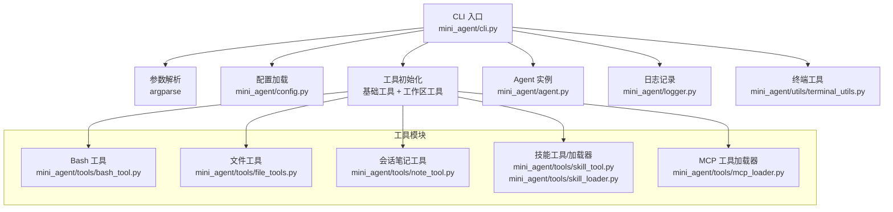
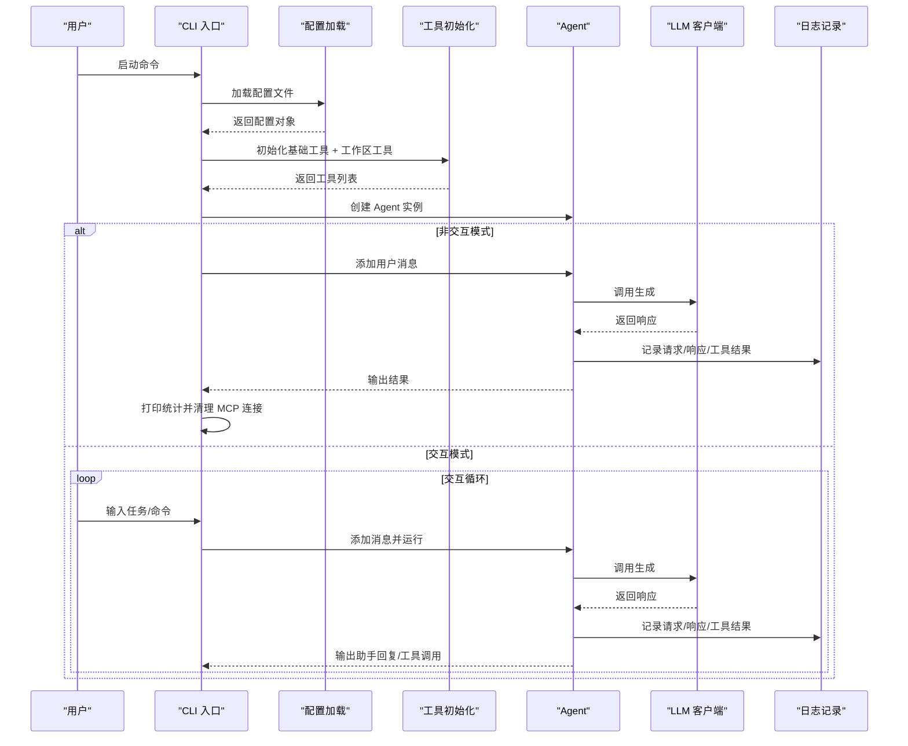
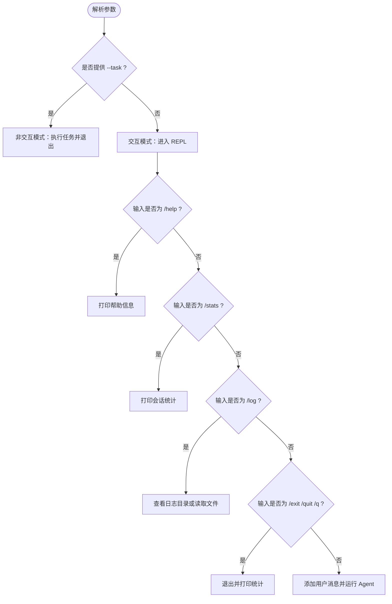
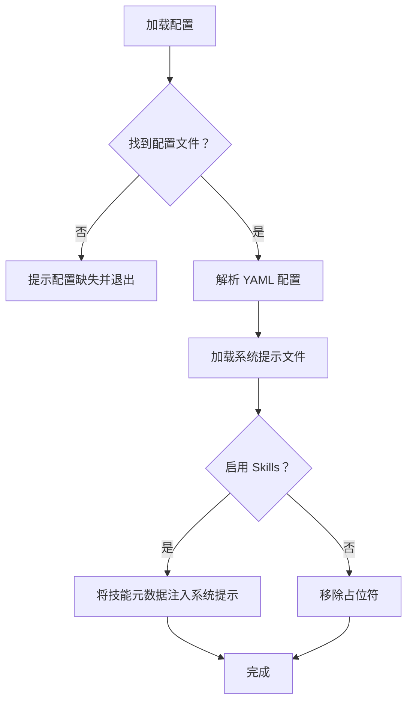
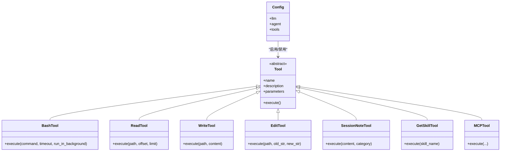
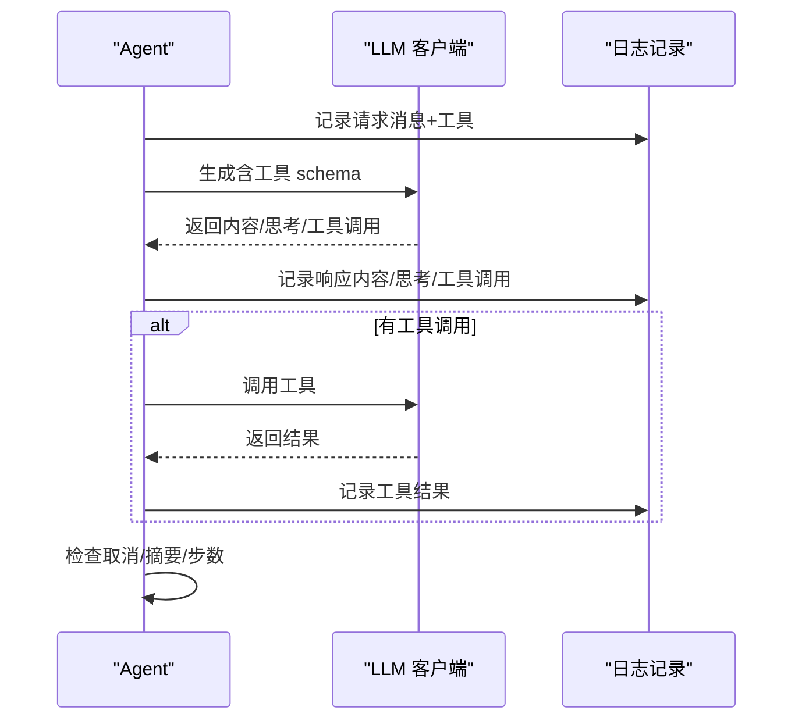
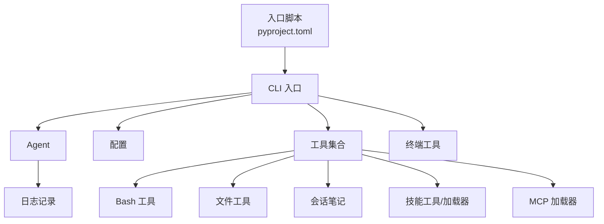

# CLI 接口

<cite>
**本文档引用的文件**
- [cli.py](file://mini_agent/cli.py)
- [agent.py](file://mini_agent/agent.py)
- [config.py](file://mini_agent/config.py)
- [bash_tool.py](file://mini_agent/tools/bash_tool.py)
- [file_tools.py](file://mini_agent/tools/file_tools.py)
- [note_tool.py](file://mini_agent/tools/note_tool.py)
- [skill_tool.py](file://mini_agent/tools/skill_tool.py)
- [skill_loader.py](file://mini_agent/tools/skill_loader.py)
- [mcp_loader.py](file://mini_agent/tools/mcp_loader.py)
- [terminal_utils.py](file://mini_agent/utils/terminal_utils.py)
- [logger.py](file://mini_agent/logger.py)
- [pyproject.toml](file://pyproject.toml)
</cite>

## 目录
1. [简介](#简介)
2. [项目结构](#项目结构)
3. [核心组件](#核心组件)
4. [架构总览](#架构总览)
5. [详细组件分析](#详细组件分析)
6. [依赖分析](#依赖分析)
7. [性能考虑](#性能考虑)
8. [故障排除指南](#故障排除指南)
9. [结论](#结论)
10. [附录](#附录)

## 简介
本文件面向使用者与开发者，全面阐述 MiniAgent 的命令行接口（CLI）设计与实现，涵盖命令解析、参数处理、用户交互、与 Agent 核心系统的集成流程、日志与统计输出、以及错误处理与帮助系统。文档同时提供命令使用示例与最佳实践，帮助在不同场景下高效使用 CLI。

## 项目结构
CLI 入口位于 mini_agent/cli.py，负责：
- 解析命令行参数与子命令
- 初始化配置与工具集
- 创建 Agent 实例并进入交互或非交互执行模式
- 提供日志查看、会话统计、帮助信息等辅助功能

**图表来源**
- [cli.py:285-335](file://mini_agent/cli.py#L285-L335)
- [config.py:66-221](file://mini_agent/config.py#L66-L221)
- [agent.py:45-85](file://mini_agent/agent.py#L45-L85)
- [logger.py:11-30](file://mini_agent/logger.py#L11-L30)
- [terminal_utils.py:18-68](file://mini_agent/utils/terminal_utils.py#L18-L68)

**章节来源**
- [cli.py:1-800](file://mini_agent/cli.py#L1-L800)
- [pyproject.toml:27-29](file://pyproject.toml#L27-L29)

## 核心组件
- 命令行参数解析：支持工作区目录、任务执行、版本号、日志子命令等。
- 配置管理：统一加载 YAML 配置，支持多级优先查找路径。
- 工具初始化：按配置启用 Bash、文件操作、会话笔记、Claude Skills、MCP 工具。
- Agent 执行：交互式或多轮对话，支持取消、令牌上限摘要、日志记录。
- 用户交互：基于 prompt_toolkit 的输入会话，支持自动补全、历史、建议、快捷键。
- 日志与统计：会话统计、日志目录浏览、单文件读取。
- 终端显示：宽度计算、对齐与截断，确保跨平台显示一致。

**章节来源**
- [cli.py:285-335](file://mini_agent/cli.py#L285-L335)
- [config.py:66-221](file://mini_agent/config.py#L66-L221)
- [agent.py:45-85](file://mini_agent/agent.py#L45-L85)
- [terminal_utils.py:18-68](file://mini_agent/utils/terminal_utils.py#L18-L68)

## 架构总览
CLI 通过命令行入口启动，按需加载配置与工具，构建 Agent 并驱动其执行循环；在交互模式下，提供命令与快捷键以增强用户体验；在非交互模式下直接执行指定任务并退出。

**图表来源**
- [cli.py:486-630](file://mini_agent/cli.py#L486-L630)
- [agent.py:321-520](file://mini_agent/agent.py#L321-L520)
- [logger.py:43-157](file://mini_agent/logger.py#L43-L157)

## 详细组件分析

### 命令行参数与子命令
- 支持的选项
  - --workspace/-w：工作区目录，默认当前目录
  - --task/-t：非交互执行的任务字符串，执行后退出
  - --version/-v：打印版本号
- 子命令
  - log：查看日志目录或读取指定日志文件

**图表来源**
- [cli.py:285-335](file://mini_agent/cli.py#L285-L335)
- [cli.py:678-744](file://mini_agent/cli.py#L678-L744)

**章节来源**
- [cli.py:285-335](file://mini_agent/cli.py#L285-L335)
- [cli.py:678-744](file://mini_agent/cli.py#L678-L744)

### 配置加载与系统提示注入
- 配置优先级搜索：开发模式、用户目录、包内默认
- 系统提示注入：从文件加载，若启用 Skills，则将技能元数据注入到系统提示中

**图表来源**
- [config.py:176-221](file://mini_agent/config.py#L176-L221)
- [cli.py:580-602](file://mini_agent/cli.py#L580-L602)

**章节来源**
- [config.py:176-221](file://mini_agent/config.py#L176-L221)
- [cli.py:580-602](file://mini_agent/cli.py#L580-L602)

### 工具初始化与工作区绑定
- 基础工具：Bash 输出/终止工具、Claude Skills、MCP 工具
- 工作区工具：Bash、文件读写编辑、会话笔记
- 工具加载顺序与错误处理：逐项尝试并输出状态

**图表来源**
- [cli.py:338-431](file://mini_agent/cli.py#L338-L431)
- [cli.py:434-468](file://mini_agent/cli.py#L434-L468)
- [bash_tool.py:217-439](file://mini_agent/tools/bash_tool.py#L217-L439)
- [file_tools.py:63-286](file://mini_agent/tools/file_tools.py#L63-L286)
- [note_tool.py:17-214](file://mini_agent/tools/note_tool.py#L17-L214)
- [skill_tool.py:13-85](file://mini_agent/tools/skill_tool.py#L13-L85)
- [mcp_loader.py:60-120](file://mini_agent/tools/mcp_loader.py#L60-L120)

**章节来源**
- [cli.py:338-431](file://mini_agent/cli.py#L338-L431)
- [cli.py:434-468](file://mini_agent/cli.py#L434-L468)
- [bash_tool.py:217-439](file://mini_agent/tools/bash_tool.py#L217-L439)
- [file_tools.py:63-286](file://mini_agent/tools/file_tools.py#L63-L286)
- [note_tool.py:17-214](file://mini_agent/tools/note_tool.py#L17-L214)
- [skill_tool.py:13-85](file://mini_agent/tools/skill_tool.py#L13-L85)
- [mcp_loader.py:60-120](file://mini_agent/tools/mcp_loader.py#L60-L120)

### Agent 执行循环与取消机制
- 步骤上限与令牌摘要：超过阈值时进行摘要，避免上下文溢出
- 取消机制：通过事件对象在安全点中断执行
- 日志记录：请求、响应、工具结果均写入日志文件

**图表来源**
- [agent.py:321-520](file://mini_agent/agent.py#L321-L520)
- [logger.py:43-157](file://mini_agent/logger.py#L43-L157)

**章节来源**
- [agent.py:321-520](file://mini_agent/agent.py#L321-L520)
- [logger.py:43-157](file://mini_agent/logger.py#L43-L157)

### 用户交互与快捷键
- prompt_toolkit 会话：历史、自动建议、自动补全、自定义样式
- 快捷键：Esc 取消、Ctrl+C 退出、Ctrl+U 清空行、Ctrl+L 清屏、Ctrl+J 插入换行
- 内置命令：/help、/clear、/history、/stats、/log、/exit、/quit、/q

**章节来源**
- [cli.py:632-676](file://mini_agent/cli.py#L632-L676)
- [cli.py:695-738](file://mini_agent/cli.py#L695-L738)

### 日志与统计
- 日志目录：~/.mini-agent/log/，按时间命名
- 统计信息：会话时长、消息数量、工具调用次数、令牌用量
- 日志子命令：列出最近日志、读取指定日志文件

**章节来源**
- [cli.py:78-169](file://mini_agent/cli.py#L78-L169)
- [cli.py:261-282](file://mini_agent/cli.py#L261-L282)
- [logger.py:11-30](file://mini_agent/logger.py#L11-L30)

## 依赖分析
- CLI 作为入口脚本注册于 pyproject.toml，命令名为 mini-agent
- CLI 依赖 Agent、配置、工具模块与终端工具
- 工具模块之间低耦合，通过 Tool 抽象统一接口
- MCP 工具加载器独立封装连接与超时配置

**图表来源**
- [pyproject.toml:27-29](file://pyproject.toml#L27-L29)
- [cli.py:30-41](file://mini_agent/cli.py#L30-L41)
- [agent.py:11-16](file://mini_agent/agent.py#L11-L16)
- [logger.py:8-9](file://mini_agent/logger.py#L8-L9)

**章节来源**
- [pyproject.toml:27-29](file://pyproject.toml#L27-L29)
- [cli.py:30-41](file://mini_agent/cli.py#L30-L41)

## 性能考虑
- 令牌估算与摘要：当本地估算或 API 报告的令牌数超过阈值时触发摘要，减少上下文长度
- 工具执行超时：MCP 工具与连接均设置可配置超时，避免阻塞
- 日志落盘：异步写入，避免阻塞主执行流
- 终端宽度计算：预编译正则与缓存宽度，提升布局渲染效率

[本节为通用指导，无需特定文件来源]

## 故障排除指南
- 配置文件缺失
  - 现象：提示未找到配置文件
  - 处理：参考安装脚本或手动复制模板配置
- API Key 未配置或无效
  - 现象：配置校验失败
  - 处理：在配置文件中填写有效 API Key
- MCP 工具加载失败
  - 现象：MCP 工具未加载或连接超时
  - 处理：检查 mcp.json 配置与网络连通性，必要时调整超时参数
- 任务被取消
  - 现象：执行中途显示取消信息
  - 处理：重新发起任务或调整超时设置
- 日志无法打开文件管理器
  - 现象：提示无法打开文件管理器
  - 处理：手动导航至日志目录查看

**章节来源**
- [cli.py:495-536](file://mini_agent/cli.py#L495-L536)
- [config.py:107-121](file://mini_agent/config.py#L107-L121)
- [mcp_loader.py:34-57](file://mini_agent/tools/mcp_loader.py#L34-L57)
- [mcp_loader.py:217-232](file://mini_agent/tools/mcp_loader.py#L217-L232)
- [cli.py:740-777](file://mini_agent/cli.py#L740-L777)

## 结论
CLI 接口以清晰的命令结构、完善的工具链与用户交互体验，实现了从配置加载到 Agent 执行的完整闭环。通过可插拔的工具体系与稳健的日志统计机制，CLI 既适合快速上手，也便于在生产环境中扩展与维护。

[本节为总结性内容，无需特定文件来源]

## 附录

### 命令使用示例与最佳实践
- 基本交互模式
  - 在当前目录开启交互会话，输入自然语言任务即可执行
  - 使用 /help 查看可用命令，/stats 查看会话统计
- 指定工作区
  - 使用 --workspace 指定工作区目录，所有文件操作与 Bash 执行均以此为相对根
- 非交互执行
  - 使用 --task 提交一次性任务，执行完成后退出
- 日志管理
  - 使用 /log 查看日志目录，/log <文件名> 读取具体日志
- 最佳实践
  - 在复杂任务前先 /clear 清空历史，避免上下文污染
  - 对长时间运行的 Bash 命令使用后台执行，并定期 /log 查看进度
  - 合理设置 MCP 超时，避免网络波动导致的长时间等待

**章节来源**
- [cli.py:613-630](file://mini_agent/cli.py#L613-L630)
- [cli.py:723-733](file://mini_agent/cli.py#L723-L733)