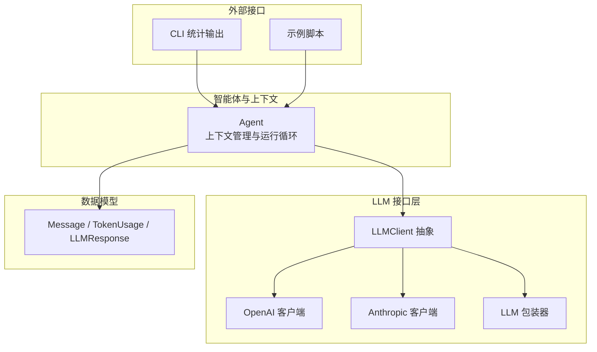
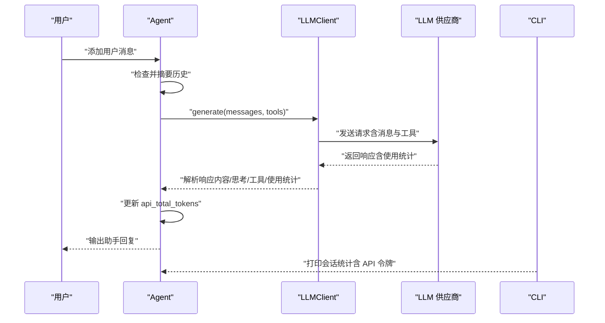
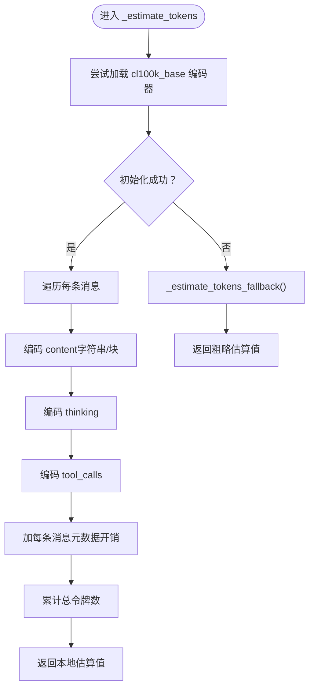
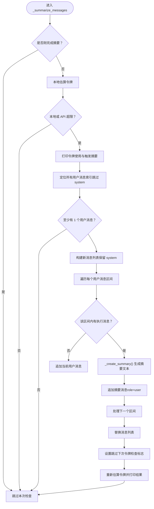
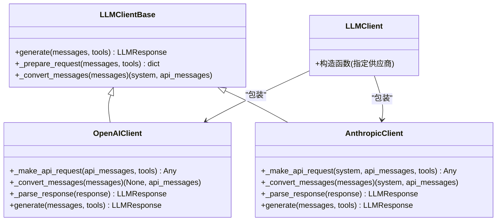
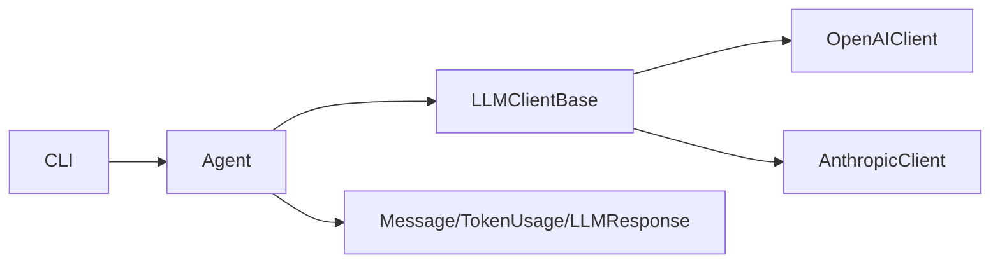

# 上下文管理

<cite>
**本文引用的文件列表**
- [agent.py](file://mini_agent/agent.py)
- [schema.py](file://mini_agent/schema/schema.py)
- [base.py](file://mini_agent/llm/base.py)
- [openai_client.py](file://mini_agent/llm/openai_client.py)
- [anthropic_client.py](file://mini_agent/llm/anthropic_client.py)
- [llm_wrapper.py](file://mini_agent/llm/llm_wrapper.py)
- [cli.py](file://mini_agent/cli.py)
- [02_simple_agent.py](file://examples/02_simple_agent.py)
- [04_full_agent.py](file://examples/04_full_agent.py)
- [PRODUCTION_GUIDE_CN.md](file://docs/PRODUCTION_GUIDE_CN.md)
</cite>

## 目录
1. [简介](#简介)
2. [项目结构](#项目结构)
3. [核心组件](#核心组件)
4. [架构总览](#架构总览)
5. [详细组件分析](#详细组件分析)
6. [依赖关系分析](#依赖关系分析)
7. [性能考量](#性能考量)
8. [故障排查指南](#故障排查指南)
9. [结论](#结论)
10. [附录](#附录)

## 简介
本文件聚焦于智能体的“上下文管理”能力，围绕以下主题展开：
- 令牌估算机制：_estimate_tokens() 与 _estimate_tokens_fallback() 的实现原理与差异
- 消息历史摘要：_summarize_messages() 与 _create_summary() 的算法与触发策略
- 上下文窗口管理：令牌限制、摘要触发条件、消息结构优化
- LLM 客户端集成：API 使用统计、上下文长度控制、跨供应商适配
- 使用示例：如何配置令牌限制、处理大消息、优化上下文效率

## 项目结构
与上下文管理直接相关的模块与文件如下：
- 核心智能体：mini_agent/agent.py（包含令牌估算、摘要、运行循环）
- 数据模型：mini_agent/schema/schema.py（Message、TokenUsage、LLMResponse）
- LLM 抽象与客户端：mini_agent/llm/base.py、mini_agent/llm/openai_client.py、mini_agent/llm/anthropic_client.py、mini_agent/llm/llm_wrapper.py
- CLI 统计输出：mini_agent/cli.py
- 示例：examples/02_simple_agent.py、examples/04_full_agent.py
- 生产建议：docs/PRODUCTION_GUIDE_CN.md

图表来源
- [agent.py](file://mini_agent/agent.py)
- [base.py](file://mini_agent/llm/base.py)
- [openai_client.py](file://mini_agent/llm/openai_client.py)
- [anthropic_client.py](file://mini_agent/llm/anthropic_client.py)
- [llm_wrapper.py](file://mini_agent/llm/llm_wrapper.py)
- [schema.py](file://mini_agent/schema/schema.py)
- [cli.py](file://mini_agent/cli.py)
- [02_simple_agent.py](file://examples/02_simple_agent.py)
- [04_full_agent.py](file://examples/04_full_agent.py)

章节来源
- [agent.py](file://mini_agent/agent.py)
- [schema.py](file://mini_agent/schema/schema.py)
- [base.py](file://mini_agent/llm/base.py)
- [openai_client.py](file://mini_agent/llm/openai_client.py)
- [anthropic_client.py](file://mini_agent/llm/anthropic_client.py)
- [llm_wrapper.py](file://mini_agent/llm/llm_wrapper.py)
- [cli.py](file://mini_agent/cli.py)
- [02_simple_agent.py](file://examples/02_simple_agent.py)
- [04_full_agent.py](file://examples/04_full_agent.py)
- [PRODUCTION_GUIDE_CN.md](file://docs/PRODUCTION_GUIDE_CN.md)

## 核心组件
- Agent：负责消息历史维护、令牌估算、摘要生成与运行循环，包含令牌限制与 API 使用统计字段
- LLMClient 抽象：定义统一的 generate 接口与请求转换方法
- OpenAI/Anthropic 客户端：实现具体的消息格式转换、工具调用、思考内容处理与使用统计解析
- 数据模型：Message、TokenUsage、LLMResponse，承载消息结构与使用统计
- CLI：输出会话统计，包括 API 总令牌数

章节来源
- [agent.py](file://mini_agent/agent.py)
- [base.py](file://mini_agent/llm/base.py)
- [openai_client.py](file://mini_agent/llm/openai_client.py)
- [anthropic_client.py](file://mini_agent/llm/anthropic_client.py)
- [schema.py](file://mini_agent/schema/schema.py)
- [cli.py](file://mini_agent/cli.py)

## 架构总览
智能体在每次 LLM 调用前后，都会检查当前上下文是否接近或超过令牌限制。若需要，会触发摘要流程，将中间执行过程压缩为用户消息形式的摘要，从而降低上下文长度。LLM 客户端负责将内部消息格式转换为各供应商协议，并解析返回的使用统计。

图表来源
- [agent.py](file://mini_agent/agent.py)
- [openai_client.py](file://mini_agent/llm/openai_client.py)
- [anthropic_client.py](file://mini_agent/llm/anthropic_client.py)
- [cli.py](file://mini_agent/cli.py)

## 详细组件分析

### 令牌估算机制
- _estimate_tokens()：使用 cl100k_base 编码器对消息内容、思考内容、工具调用进行编码，累加字符数并加上每条消息的元数据开销，得到本地估算值
- _estimate_tokens_fallback()：当无法初始化编码器时，按字符数粗略估算（平均约 2.5 字符 ≈ 1 令牌），作为降级方案
- 触发条件：当本地估算或 API 返回的 total_tokens 超过 token_limit 时，触发摘要

图表来源
- [agent.py](file://mini_agent/agent.py)

章节来源
- [agent.py](file://mini_agent/agent.py)

### 消息历史摘要
- _summarize_messages()：在每次 LLM 步骤前检查令牌，若超过阈值则执行摘要
  - 策略：保留所有用户消息（用户意图），对相邻用户之间的执行过程进行摘要
  - 结构：system → user1 → summary1 → user2 → summary2 → ...（若最后轮次仍在执行，也会对最后一段摘要）
  - 触发条件：本地估算或 API reported total_tokens 超限
  - 防抖：摘要完成后设置标志位，跳过下一次令牌检查，等待下一次 LLM 调用更新 API 使用统计
- _create_summary()：对一轮执行过程（assistant 与 tool 消息）构建摘要内容，构造提示词并调用 LLM 生成摘要文本；失败时回退为简单拼接

图表来源
- [agent.py](file://mini_agent/agent.py)

章节来源
- [agent.py](file://mini_agent/agent.py)

### 上下文窗口管理策略
- 令牌限制：构造函数参数 token_limit，默认较大值，用于控制摘要触发时机
- 触发条件：本地估算与 API reported total_tokens 双重校验，避免误判
- 消息结构优化：
  - 保留用户消息（用户意图）
  - 将执行过程压缩为摘要（assistant 执行与 tool 结果）
  - 保持 system 在首位，维持上下文一致性
- 防抖策略：摘要后跳过一次令牌检查，等待下一次 LLM 调用更新 API 使用统计，避免连续触发

章节来源
- [agent.py](file://mini_agent/agent.py)

### LLM 客户端集成与上下文长度控制
- LLMClient 抽象：定义 generate、_prepare_request、_convert_messages 接口，屏蔽供应商差异
- OpenAI 客户端：
  - 支持 reasoning_split 分离思考内容
  - 解析 reasoning_details 并合并到 assistant 的 thinking 字段
  - 解析 usage 中的 prompt_tokens/completion_tokens/total_tokens
- Anthropic 客户端：
  - 支持 thinking 内容块与 tool_use 块
  - 解析 usage 并综合缓存读取/创建的输入令牌
- LLM 包装器：统一多供应商客户端实例化与调用

图表来源
- [base.py](file://mini_agent/llm/base.py)
- [openai_client.py](file://mini_agent/llm/openai_client.py)
- [anthropic_client.py](file://mini_agent/llm/anthropic_client.py)
- [llm_wrapper.py](file://mini_agent/llm/llm_wrapper.py)

章节来源
- [base.py](file://mini_agent/llm/base.py)
- [openai_client.py](file://mini_agent/llm/openai_client.py)
- [anthropic_client.py](file://mini_agent/llm/anthropic_client.py)
- [llm_wrapper.py](file://mini_agent/llm/llm_wrapper.py)

### 数据模型与使用统计
- Message：支持 role/content/thinking/tool_calls/tool_call_id/name 等字段
- TokenUsage：prompt_tokens/completion_tokens/total_tokens
- LLMResponse：content/thinking/tool_calls/finish_reason/usage
- Agent 在每次 LLM 调用后，将响应中的 usage.total_tokens 写入 api_total_tokens，用于后续摘要判断

章节来源
- [schema.py](file://mini_agent/schema/schema.py)
- [openai_client.py](file://mini_agent/llm/openai_client.py)
- [anthropic_client.py](file://mini_agent/llm/anthropic_client.py)
- [agent.py](file://mini_agent/agent.py)

### CLI 统计输出
- 输出会话时长、消息总数、各类消息数量、可用工具数、API 总令牌数等
- API 令牌数来自上一次 LLM 调用的 usage.total_tokens

章节来源
- [cli.py](file://mini_agent/cli.py)
- [agent.py](file://mini_agent/agent.py)

## 依赖关系分析
- Agent 依赖 LLMClient 抽象与具体实现（OpenAI/Anthropic），并通过 LLMResponse 的 usage 更新 api_total_tokens
- LLMClient 各实现负责消息格式转换与使用统计解析
- CLI 仅消费 Agent 的统计数据，不直接参与上下文管理

图表来源
- [agent.py](file://mini_agent/agent.py)
- [base.py](file://mini_agent/llm/base.py)
- [openai_client.py](file://mini_agent/llm/openai_client.py)
- [anthropic_client.py](file://mini_agent/llm/anthropic_client.py)
- [schema.py](file://mini_agent/schema/schema.py)
- [cli.py](file://mini_agent/cli.py)

章节来源
- [agent.py](file://mini_agent/agent.py)
- [base.py](file://mini_agent/llm/base.py)
- [openai_client.py](file://mini_agent/llm/openai_client.py)
- [anthropic_client.py](file://mini_agent/llm/anthropic_client.py)
- [schema.py](file://mini_agent/schema/schema.py)
- [cli.py](file://mini_agent/cli.py)

## 性能考量
- 令牌估算成本：tiktoken 编码在消息较多时会有一定开销，但远小于 LLM 调用成本
- 摘要频率：合理设置 token_limit，避免频繁摘要导致上下文碎片化
- 使用统计延迟：api_total_tokens 在下一次 LLM 调用后才更新，摘要后跳过一次检查，减少重复触发
- 大消息处理：摘要阶段会将长执行过程压缩为摘要文本，显著降低上下文长度

[本节为通用指导，无需列出章节来源]

## 故障排查指南
- tiktoken 初始化失败：_estimate_tokens() 会自动降级到 _estimate_tokens_fallback()，确保功能可用
- 摘要未生效：确认是否处于“刚完成摘要”的防抖状态；等待下一次 LLM 调用后再次检查
- API 使用统计异常：确认 LLM 客户端实现正确解析 usage；不同供应商的 usage 字段可能不同（OpenAI/Anthropic 已分别处理）
- 上下文仍超限：适当提高 token_limit 或优化消息结构（减少冗余内容）

章节来源
- [agent.py](file://mini_agent/agent.py)
- [openai_client.py](file://mini_agent/llm/openai_client.py)
- [anthropic_client.py](file://mini_agent/llm/anthropic_client.py)

## 结论
本上下文管理方案通过“本地令牌估算 + API 使用统计”的双重校验，在保证稳定性的同时有效控制上下文长度。摘要机制在保留用户意图的前提下，将执行过程压缩为摘要，兼顾了上下文效率与可读性。结合 LLM 客户端的统一抽象与使用统计解析，能够稳定地支撑多供应商场景下的上下文管理需求。

[本节为总结性内容，无需列出章节来源]

## 附录

### 使用示例与最佳实践
- 配置令牌限制
  - 在 Agent 构造函数中传入 token_limit 参数，根据模型上下文窗口与任务复杂度调整
  - 参考路径：[agent.py](file://mini_agent/agent.py)
- 处理大消息
  - 依赖 _summarize_messages() 自动触发摘要，将长执行过程压缩为摘要文本
  - 参考路径：[agent.py](file://mini_agent/agent.py)
- 优化上下文效率
  - 保持用户消息完整，仅对执行过程进行摘要
  - 合理设置最大步数，避免无限增长的历史
  - 参考路径：[agent.py](file://mini_agent/agent.py)
- LLM 客户端集成
  - 通过 LLMClient 统一调用 OpenAI/Anthropic，自动解析使用统计
  - 参考路径：[llm_wrapper.py](file://mini_agent/llm/llm_wrapper.py)、[openai_client.py](file://mini_agent/llm/openai_client.py)、[anthropic_client.py](file://mini_agent/llm/anthropic_client.py)
- 示例脚本
  - 简单代理示例：[02_simple_agent.py](file://examples/02_simple_agent.py)
  - 全功能代理示例：[04_full_agent.py](file://examples/04_full_agent.py)
- 生产建议
  - 引入分布式文件系统进行上下文持久化与备份
  - 使用更精确的令牌计算方法
  - 丰富消息压缩策略（最近 N 条、核心元信息、摘要 Prompt 优化、召回系统等）
  - 参考路径：[PRODUCTION_GUIDE_CN.md](file://docs/PRODUCTION_GUIDE_CN.md)

章节来源
- [agent.py](file://mini_agent/agent.py)
- [llm_wrapper.py](file://mini_agent/llm/llm_wrapper.py)
- [openai_client.py](file://mini_agent/llm/openai_client.py)
- [anthropic_client.py](file://mini_agent/llm/anthropic_client.py)
- [02_simple_agent.py](file://examples/02_simple_agent.py)
- [04_full_agent.py](file://examples/04_full_agent.py)
- [PRODUCTION_GUIDE_CN.md](file://docs/PRODUCTION_GUIDE_CN.md)