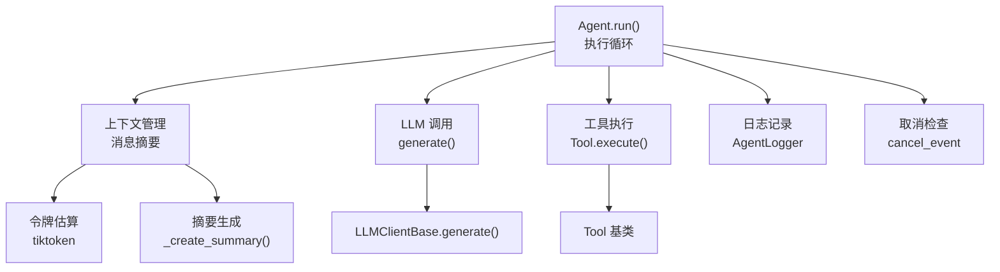
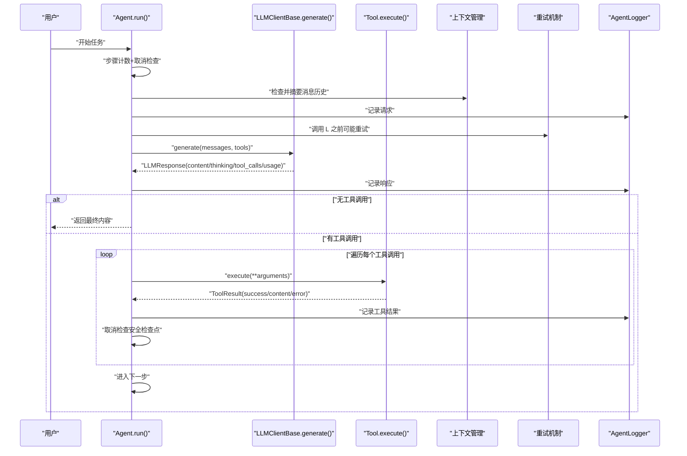
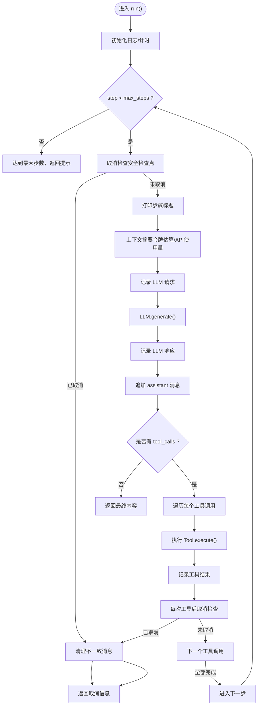
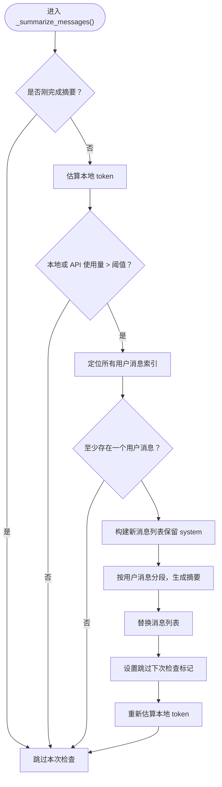
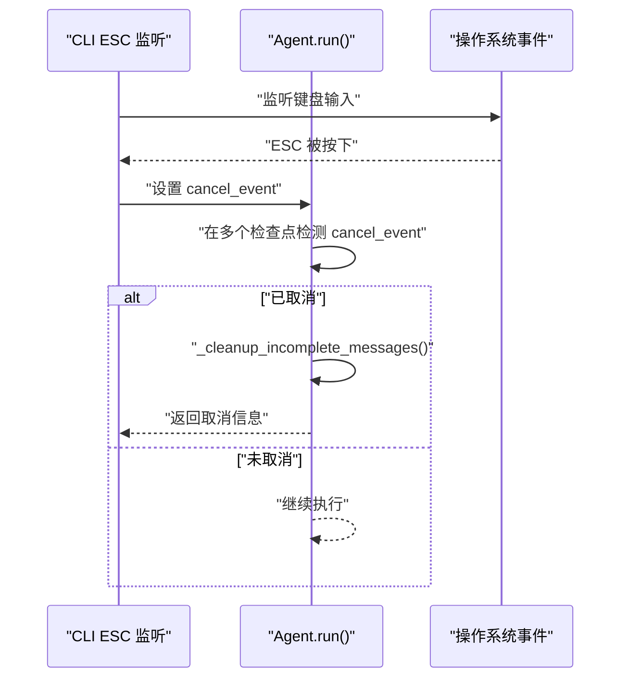
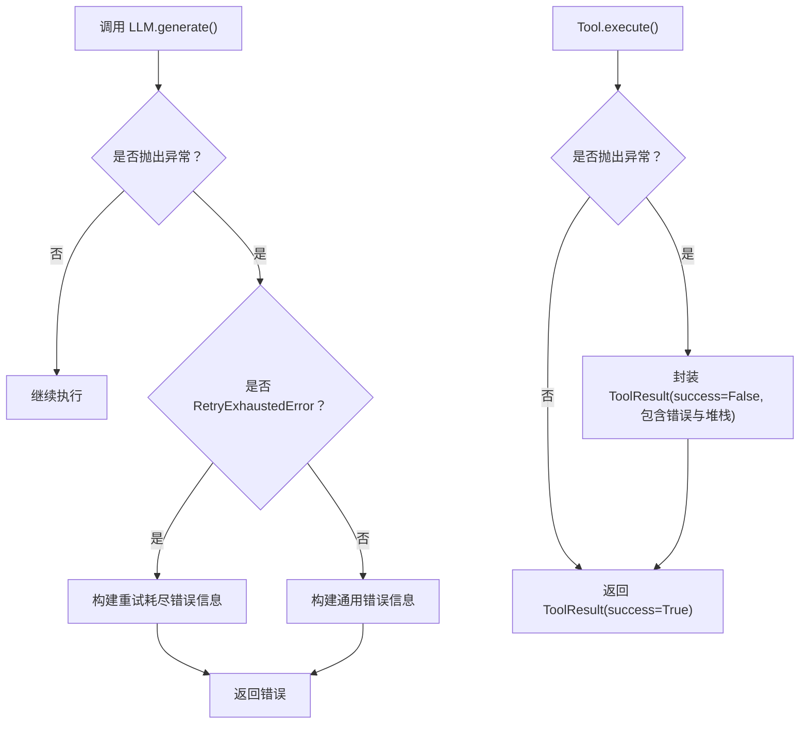
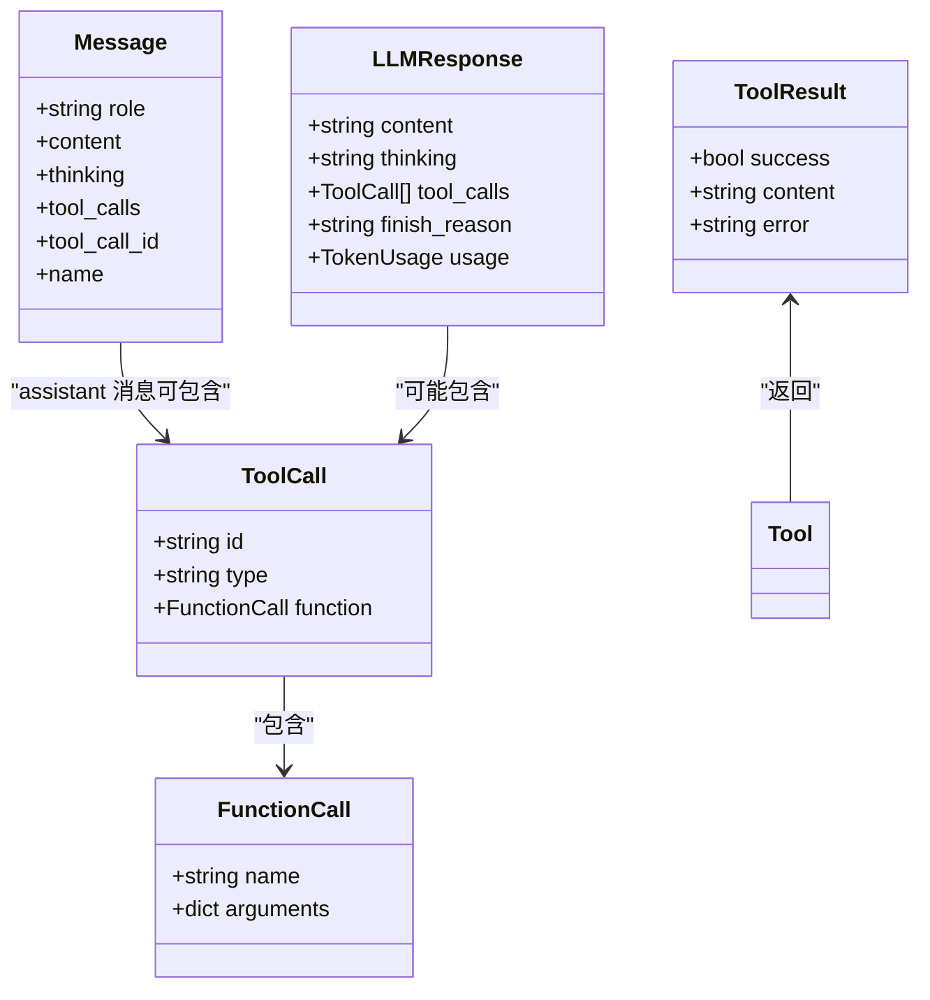
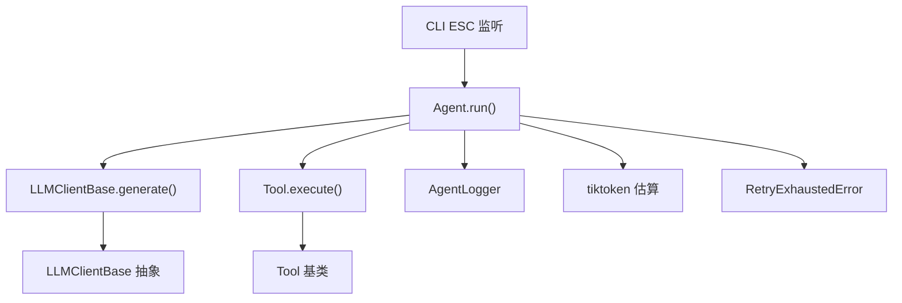

# 执行循环机制

<cite>
**本文引用的文件**
- [agent.py](file://mini_agent/agent.py)
- [base.py](file://mini_agent/tools/base.py)
- [base.py](file://mini_agent/llm/base.py)
- [schema.py](file://mini_agent/schema/schema.py)
- [retry.py](file://mini_agent/retry.py)
- [logger.py](file://mini_agent/logger.py)
- [cli.py](file://mini_agent/cli.py)
- [02_simple_agent.py](file://examples/02_simple_agent.py)
- [04_full_agent.py](file://examples/04_full_agent.py)
- [test_agent.py](file://tests/test_agent.py)
</cite>

## 目录
1. [简介](#简介)
2. [项目结构](#项目结构)
3. [核心组件](#核心组件)
4. [架构总览](#架构总览)
5. [详细组件分析](#详细组件分析)
6. [依赖分析](#依赖分析)
7. [性能考量](#性能考量)
8. [故障排查指南](#故障排查指南)
9. [结论](#结论)
10. [附录](#附录)

## 简介
本文件聚焦于智能体执行循环机制，系统性阐述 Agent.run() 的完整执行流程，包括步骤计数、消息历史检查、LLM 调用、工具执行、上下文管理（令牌估算、消息摘要、上下文窗口控制）、错误处理策略（异常捕获、重试机制、清理逻辑），以及取消机制在执行循环中的应用与安全检查点。文档同时提供流程图与代码路径引用，帮助读者快速定位实现细节。

## 项目结构
围绕执行循环的关键文件与职责如下：
- 执行循环主体：mini_agent/agent.py 中的 Agent 类及其 run() 方法
- 上下文与消息模型：mini_agent/schema/schema.py
- 工具抽象与结果：mini_agent/tools/base.py
- LLM 客户端接口：mini_agent/llm/base.py
- 重试机制：mini_agent/retry.py
- 日志记录：mini_agent/logger.py
- CLI 取消与交互：mini_agent/cli.py
- 示例与测试：examples/* 与 tests/*

图表来源
- [agent.py:321-520](file://mini_agent/agent.py#L321-L520)
- [schema.py:29-56](file://mini_agent/schema/schema.py#L29-L56)
- [base.py:16-56](file://mini_agent/tools/base.py#L16-L56)
- [base.py:10-85](file://mini_agent/llm/base.py#L10-L85)
- [retry.py:64-138](file://mini_agent/retry.py#L64-L138)
- [logger.py:11-179](file://mini_agent/logger.py#L11-L179)

章节来源
- [agent.py:45-524](file://mini_agent/agent.py#L45-L524)
- [schema.py:1-56](file://mini_agent/schema/schema.py#L1-L56)
- [base.py:1-56](file://mini_agent/tools/base.py#L1-L56)
- [base.py:1-85](file://mini_agent/llm/base.py#L1-L85)
- [retry.py:1-138](file://mini_agent/retry.py#L1-L138)
- [logger.py:1-179](file://mini_agent/logger.py#L1-L179)

## 核心组件
- Agent.run(): 主执行循环，负责步骤推进、取消检查、上下文摘要、LLM 调用、工具执行与结果记录
- 上下文管理：_estimate_tokens()、_summarize_messages()、_create_summary()
- 工具体系：Tool 抽象类与 ToolResult 结果封装
- LLM 接口：LLMClientBase.generate() 统一生成接口
- 错误与重试：RetryConfig/RetryExhaustedError
- 日志：AgentLogger 记录请求、响应与工具结果
- 取消机制：asyncio.Event 作为外部触发信号，配合安全检查点清理不一致状态

章节来源
- [agent.py:321-520](file://mini_agent/agent.py#L321-L520)
- [agent.py:123-261](file://mini_agent/agent.py#L123-L261)
- [base.py:8-56](file://mini_agent/tools/base.py#L8-L56)
- [base.py:10-85](file://mini_agent/llm/base.py#L10-L85)
- [retry.py:23-138](file://mini_agent/retry.py#L23-L138)
- [logger.py:11-179](file://mini_agent/logger.py#L11-L179)

## 架构总览
执行循环以“步骤”为单位迭代，每步包含以下关键动作：
- 取消检查（安全检查点）
- 上下文摘要（避免上下文窗口溢出）
- LLM 请求与响应（记录请求/响应）
- 若无工具调用则结束并返回；否则逐个执行工具调用
- 每次工具执行后进行取消检查
- 步骤计数与时间统计

图表来源
- [agent.py:321-520](file://mini_agent/agent.py#L321-L520)
- [base.py:40-55](file://mini_agent/llm/base.py#L40-L55)
- [base.py:34-36](file://mini_agent/tools/base.py#L34-L36)
- [retry.py:73-138](file://mini_agent/retry.py#L73-L138)
- [logger.py:43-157](file://mini_agent/logger.py#L43-L157)

## 详细组件分析

### Agent.run() 执行流程
- 入口参数：可选 cancel_event（外部设置 ESC 取消）
- 初始化：启动新运行日志、记录日志文件路径
- 循环条件：step < max_steps
- 每步流程：
  - 取消检查（安全检查点）：若已取消，清理不一致消息并返回取消信息
  - 记录步骤标题（宽度自适应）
  - 上下文摘要：当本地估算或 API 报告的 token 超过阈值时触发
  - 记录 LLM 请求
  - LLM 调用：捕获 RetryExhaustedError 并转换为错误信息返回
  - 更新 API 总 token 使用量
  - 记录 LLM 响应
  - 追加 assistant 消息（含 thinking、tool_calls）
  - 若无 tool_calls，直接返回最终内容
  - 否则：逐个工具调用，记录工具结果，每次工具执行后进行取消检查
  - 步骤耗时与总耗时统计
- 达到 max_steps：返回超时未完成信息

图表来源
- [agent.py:321-520](file://mini_agent/agent.py#L321-L520)

章节来源
- [agent.py:321-520](file://mini_agent/agent.py#L321-L520)

### 上下文管理机制
- 令牌估算：优先使用 tiktoken 的 cl100k_base 编码器估算消息历史 token；失败时回退字符估算
- 触发摘要：本地估算超过阈值 或 API 报告 total_tokens 超过阈值
- 摘要策略：保留用户消息，对相邻用户之间的执行过程进行摘要，最后仍在执行的回合也参与摘要
- 摘要生成：构造执行过程文本，调用 LLM 生成简洁摘要；失败时回退为原始文本
- 跳过标记：摘要完成后跳过一次后续的本地估算检查，等待下一次 LLM 调用更新 API 使用量

图表来源
- [agent.py:180-261](file://mini_agent/agent.py#L180-L261)
- [agent.py:123-179](file://mini_agent/agent.py#L123-L179)

章节来源
- [agent.py:123-261](file://mini_agent/agent.py#L123-L261)

### LLM 调用与工具执行
- LLM 调用：统一通过 LLMClientBase.generate() 接口，支持工具 schema 注入
- 工具执行：Tool.execute() 异步执行，返回 ToolResult；异常被捕获并包装为失败结果
- 工具参数显示：对参数进行截断式展示，避免过长输出影响可读性
- 工具结果记录：成功/失败分别记录内容或错误信息

```mermaid
sequenceDiagram
participant A as "Agent.run()"
participant L as "LLMClientBase.generate()"
participant T as "Tool.execute()"
participant Log as "AgentLogger"
A->>L : "generate(messages, tools)"
L-->>A : "LLMResponse"
A->>Log : "log_response()"
alt "存在 tool_calls"
loop "遍历 tool_calls"
A->>T : "execute(**arguments)"
T-->>A : "ToolResult"
A->>Log : "log_tool_result()"
end
else "无 tool_calls"
A-->>A : "直接返回最终内容"
end
```

图表来源
- [agent.py:368-501](file://mini_agent/agent.py#L368-L501)
- [base.py:40-55](file://mini_agent/llm/base.py#L40-L55)
- [base.py:34-36](file://mini_agent/tools/base.py#L34-L36)
- [logger.py:85-157](file://mini_agent/logger.py#L85-L157)

章节来源
- [agent.py:368-501](file://mini_agent/agent.py#L368-L501)
- [base.py:40-55](file://mini_agent/llm/base.py#L40-L55)
- [base.py:34-36](file://mini_agent/tools/base.py#L34-L36)
- [logger.py:85-157](file://mini_agent/logger.py#L85-L157)

### 取消机制与安全检查点
- 外部触发：CLI 通过线程监听 ESC 键，设置 asyncio.Event
- Agent 内部：run() 在多个安全检查点检查 cancel_event，若已设置则清理不一致消息并返回
- 清理逻辑：删除最后一次 assistant 消息及之后的所有工具结果，确保消息一致性

图表来源
- [agent.py:90-122](file://mini_agent/agent.py#L90-L122)
- [agent.py:343-349](file://mini_agent/agent.py#L343-L349)
- [agent.py:423-428](file://mini_agent/agent.py#L423-L428)
- [agent.py:503-508](file://mini_agent/agent.py#L503-L508)
- [cli.py:752-827](file://mini_agent/cli.py#L752-L827)

章节来源
- [agent.py:90-122](file://mini_agent/agent.py#L90-L122)
- [agent.py:343-349](file://mini_agent/agent.py#L343-L349)
- [agent.py:423-428](file://mini_agent/agent.py#L423-L428)
- [agent.py:503-508](file://mini_agent/agent.py#L503-L508)
- [cli.py:752-827](file://mini_agent/cli.py#L752-L827)

### 错误处理与重试机制
- LLM 调用异常：捕获 RetryExhaustedError 并转换为带尝试次数与最后异常的错误信息
- 工具执行异常：捕获所有异常，封装为 ToolResult(success=False)，包含错误详情与堆栈
- 重试配置：RetryConfig 支持指数退避、最大重试次数、可重试异常类型等

图表来源
- [agent.py:371-383](file://mini_agent/agent.py#L371-L383)
- [agent.py:461-474](file://mini_agent/agent.py#L461-L474)
- [retry.py:64-138](file://mini_agent/retry.py#L64-L138)

章节来源
- [agent.py:371-383](file://mini_agent/agent.py#L371-L383)
- [agent.py:461-474](file://mini_agent/agent.py#L461-L474)
- [retry.py:64-138](file://mini_agent/retry.py#L64-L138)

### 数据模型与消息结构
- Message：支持 role、content、thinking、tool_calls、tool_call_id、name
- ToolCall/FunctionCall：描述函数调用名称与参数
- LLMResponse：包含 content、thinking、tool_calls、finish_reason、usage
- ToolResult：封装工具执行的成功/失败、内容与错误

图表来源
- [schema.py:29-56](file://mini_agent/schema/schema.py#L29-L56)
- [base.py:8-14](file://mini_agent/tools/base.py#L8-L14)

章节来源
- [schema.py:29-56](file://mini_agent/schema/schema.py#L29-L56)
- [base.py:8-14](file://mini_agent/tools/base.py#L8-L14)

## 依赖分析
- Agent.run() 依赖：
  - LLMClientBase.generate() 统一接口
  - Tool.execute() 异步工具执行
  - AgentLogger 日志记录
  - tiktoken 用于上下文令牌估算
  - asyncio.Event 用于取消
  - RetryExhaustedError 用于重试耗尽错误
- 上下文管理依赖：
  - _estimate_tokens() 依赖 tiktoken 编码器
  - _create_summary() 依赖 LLM 生成摘要
- CLI 与 Agent 的耦合：
  - CLI 创建 cancel_event 并在 ESC 时设置
  - Agent 将 cancel_event 保存并在 run() 中轮询检查

图表来源
- [agent.py:321-520](file://mini_agent/agent.py#L321-L520)
- [base.py:10-85](file://mini_agent/llm/base.py#L10-L85)
- [base.py:16-56](file://mini_agent/tools/base.py#L16-L56)
- [retry.py:64-138](file://mini_agent/retry.py#L64-L138)
- [logger.py:11-179](file://mini_agent/logger.py#L11-L179)
- [cli.py:752-827](file://mini_agent/cli.py#L752-L827)

章节来源
- [agent.py:321-520](file://mini_agent/agent.py#L321-L520)
- [base.py:10-85](file://mini_agent/llm/base.py#L10-L85)
- [base.py:16-56](file://mini_agent/tools/base.py#L16-L56)
- [retry.py:64-138](file://mini_agent/retry.py#L64-L138)
- [logger.py:11-179](file://mini_agent/logger.py#L11-L179)
- [cli.py:752-827](file://mini_agent/cli.py#L752-L827)

## 性能考量
- 令牌估算成本：tiktoken 编码与字符串编码开销随消息长度增长；建议在摘要后减少消息体量
- LLM 调用频率：每步一次 LLM 调用，工具执行可能多次；可通过批量工具调用与合并工具结果降低往返
- 日志写入：每次请求/响应/工具结果均写入磁盘，建议在高并发场景考虑异步写入或缓冲
- 取消延迟：取消信号由 CLI 线程设置，Agent 采用轮询检查，可在工具执行阶段增加更细粒度的中断点

## 故障排查指南
- LLM 调用失败：
  - 若为 RetryExhaustedError：检查网络与配额，调整重试配置
  - 其他异常：查看错误信息与堆栈，确认请求格式与工具可用性
- 工具执行失败：
  - 捕获到的异常会被封装为 ToolResult.error，检查参数与权限
- 上下文溢出：
  - 确认 token_limit 设置合理；关注摘要触发频率与效果
- 取消无效：
  - 确认 CLI ESC 监听线程正常运行，cancel_event 是否被正确设置
- 日志缺失：
  - 检查日志目录权限与路径，确认 start_new_run() 已调用

章节来源
- [agent.py:371-383](file://mini_agent/agent.py#L371-L383)
- [agent.py:461-474](file://mini_agent/agent.py#L461-L474)
- [agent.py:198-201](file://mini_agent/agent.py#L198-L201)
- [cli.py:752-827](file://mini_agent/cli.py#L752-L827)
- [logger.py:30-42](file://mini_agent/logger.py#L30-L42)

## 结论
该执行循环机制以 Agent.run() 为核心，结合上下文管理、LLM 调用、工具执行与日志记录，形成稳定的多步迭代框架。通过取消检查点与消息清理保障一致性，借助重试机制提升鲁棒性。建议在生产环境中进一步完善令牌估算精度、日志异步化与工具执行中断能力，并根据业务场景优化摘要策略与工具批量化执行。

## 附录
- 示例与测试参考：
  - 简单代理示例：examples/02_simple_agent.py
  - 完整代理示例：examples/04_full_agent.py
  - 集成测试：tests/test_agent.py

章节来源
- [02_simple_agent.py:19-113](file://examples/02_simple_agent.py#L19-L113)
- [04_full_agent.py:24-184](file://examples/04_full_agent.py#L24-L184)
- [test_agent.py:15-94](file://tests/test_agent.py#L15-L94)