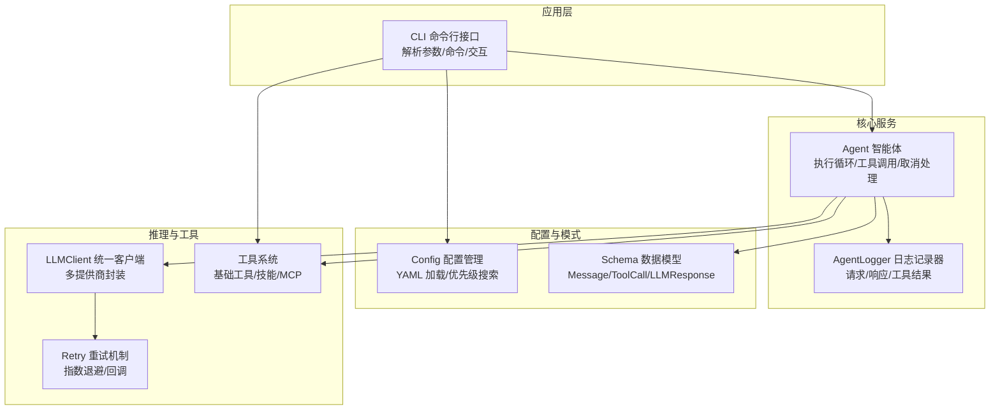
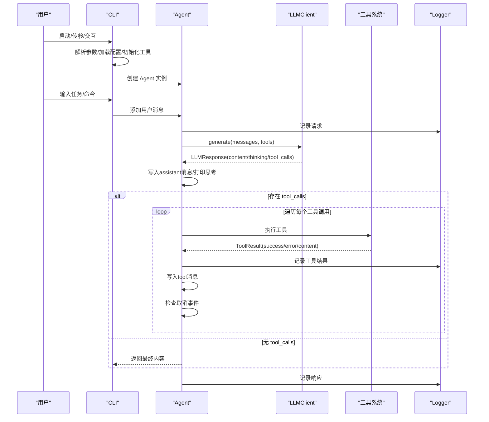
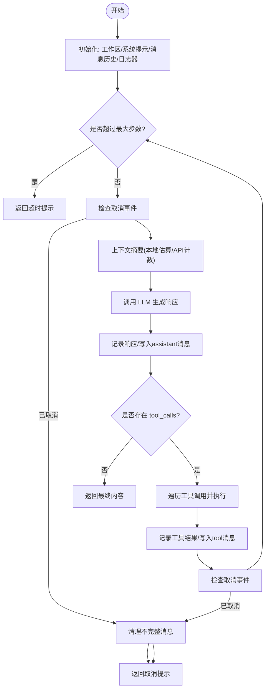
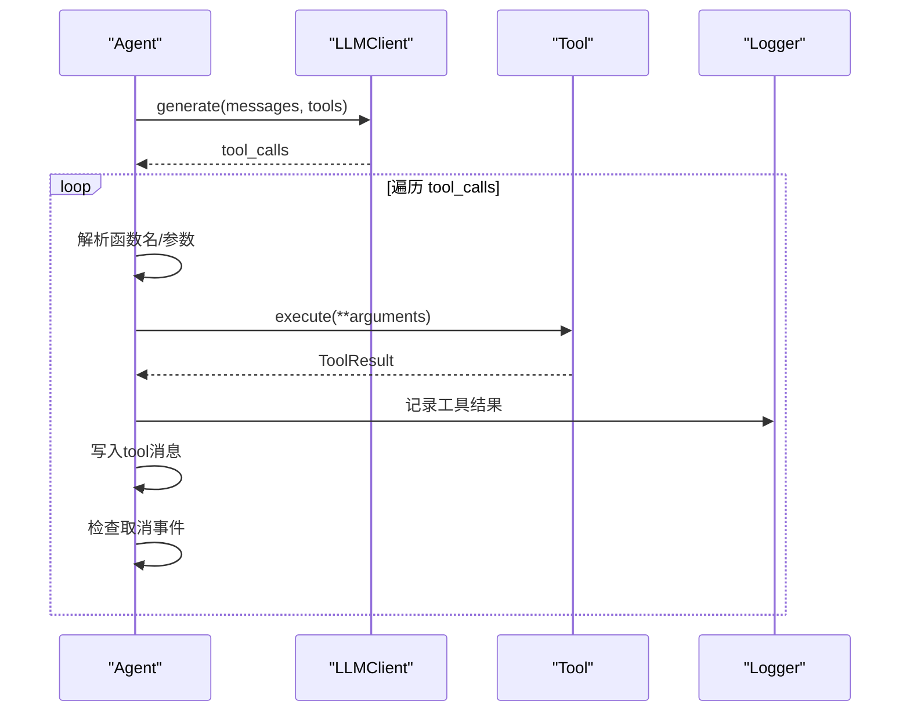
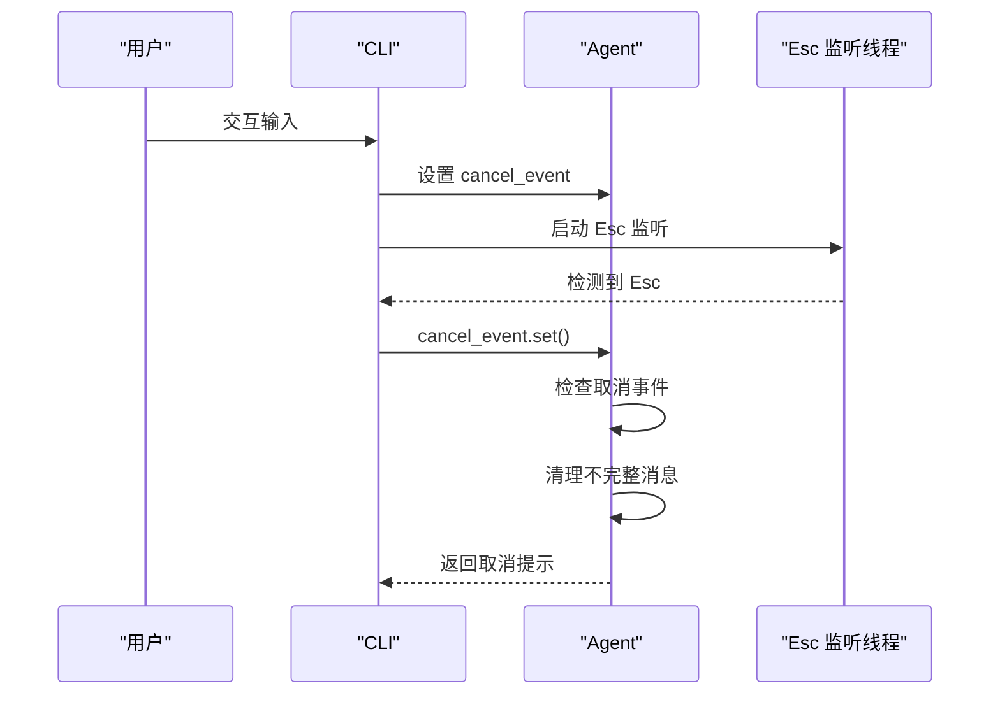
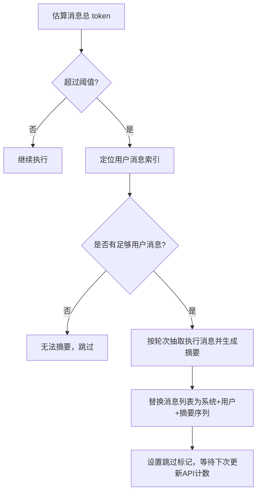
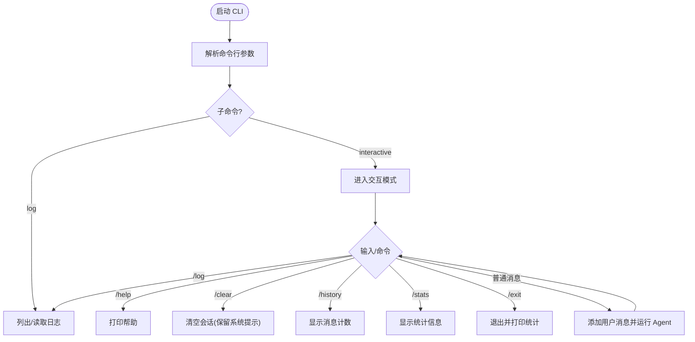
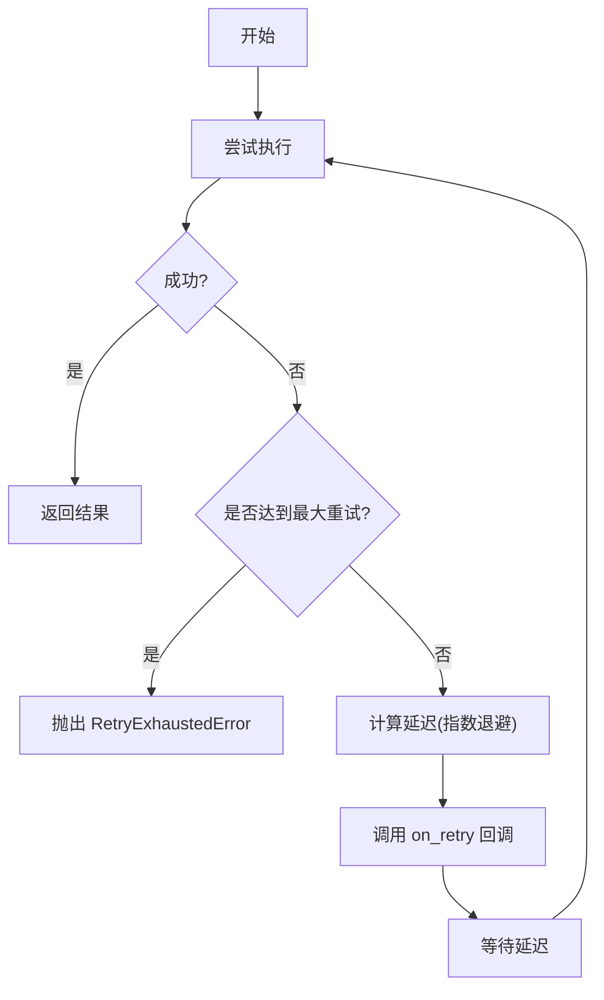
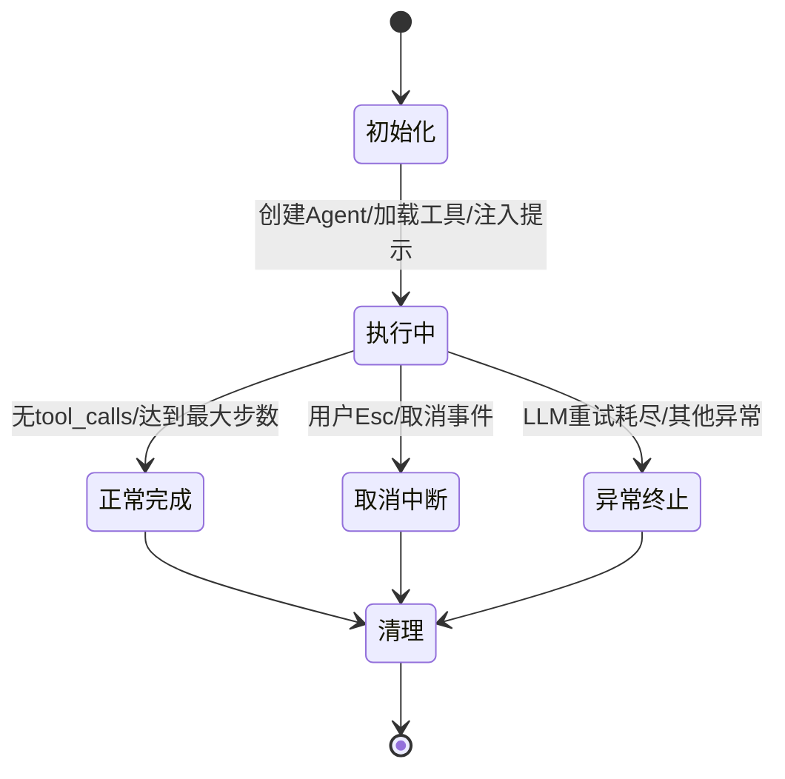
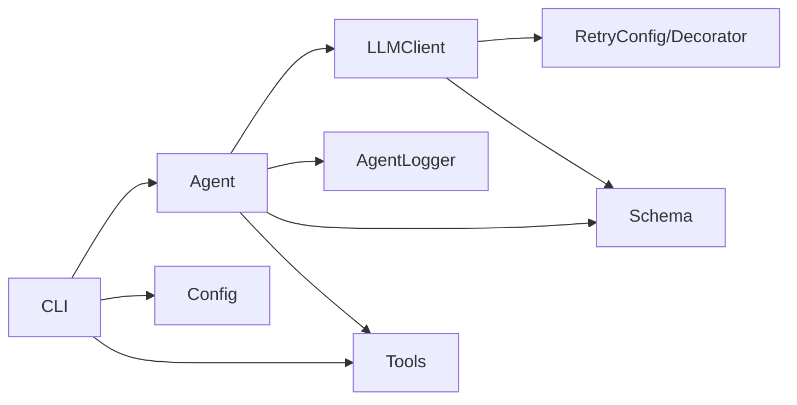

# 智能体系统

<cite>
**本文引用的文件列表**
- [agent.py](file://mini_agent/agent.py)
- [cli.py](file://mini_agent/cli.py)
- [retry.py](file://mini_agent/retry.py)
- [config.py](file://mini_agent/config.py)
- [base.py](file://mini_agent/tools/base.py)
- [base.py](file://mini_agent/llm/base.py)
- [llm_wrapper.py](file://mini_agent/llm/llm_wrapper.py)
- [schema.py](file://mini_agent/schema/schema.py)
- [logger.py](file://mini_agent/logger.py)
- [01_basic_tools.py](file://examples/01_basic_tools.py)
- [02_simple_agent.py](file://examples/02_simple_agent.py)
- [04_full_agent.py](file://examples/04_full_agent.py)
- [README.md](file://README.md)
</cite>

## 目录
1. [简介](#简介)
2. [项目结构](#项目结构)
3. [核心组件](#核心组件)
4. [架构总览](#架构总览)
5. [详细组件分析](#详细组件分析)
6. [依赖关系分析](#依赖关系分析)
7. [性能考量](#性能考量)
8. [故障排查指南](#故障排查指南)
9. [结论](#结论)
10. [附录](#附录)

## 简介
本文件面向“智能体系统”的使用者与开发者，系统性阐述 Agent 类的完整实现，包括执行循环机制、工具调用流程、取消与中断处理；CLI 接口的设计与命令解析逻辑；重试机制的实现策略（含超时处理、错误分类与重试策略）；智能体生命周期管理（初始化、执行、清理）；以及与其他组件（LLM 客户端、工具系统、配置管理）的集成方式。文末提供使用示例与最佳实践，帮助在不同场景下高效使用该智能体系统。

## 项目结构
该项目采用模块化设计，围绕 Agent 核心能力构建，提供 CLI 交互入口、可插拔工具系统、统一的 LLM 客户端封装、可配置的重试机制与日志记录器，并通过配置文件集中管理 LLM、Agent、工具与 MCP 的参数。

图表来源
- [cli.py:486-630](file://mini_agent/cli.py#L486-L630)
- [agent.py:45-120](file://mini_agent/agent.py#L45-L120)
- [llm_wrapper.py:18-102](file://mini_agent/llm/llm_wrapper.py#L18-L102)
- [retry.py:23-139](file://mini_agent/retry.py#L23-L139)
- [config.py:66-221](file://mini_agent/config.py#L66-L221)
- [schema.py:7-56](file://mini_agent/schema/schema.py#L7-L56)
- [logger.py:11-179](file://mini_agent/logger.py#L11-L179)

章节来源
- [README.md:1-345](file://README.md#L1-L345)
- [cli.py:285-336](file://mini_agent/cli.py#L285-L336)
- [config.py:66-221](file://mini_agent/config.py#L66-L221)

## 核心组件
- Agent：负责执行循环、消息历史管理、工具调用、取消与中断、上下文压缩（分段摘要）、日志记录与统计输出。
- CLI：命令行入口，负责参数解析、配置加载、工具初始化、交互会话、Esc 取消监听、日志查看与统计展示。
- LLMClient：统一的 LLM 客户端封装，支持 Anthropic/OpenAI 多提供商，内置重试配置与回调。
- Retry：通用异步重试装饰器与配置类，支持指数退避、最大重试次数、可配置异常类型与回调。
- Config：配置管理，支持多路径优先级查找 config.yaml，解析 LLM、Agent、Tools、MCP 等配置。
- Schema：数据模型定义，包括 Message、ToolCall、FunctionCall、LLMResponse、TokenUsage、LLMProvider。
- Logger：运行日志记录器，按回合记录请求、响应与工具执行结果，便于调试与审计。
- Tools：工具基类与工具结果模型，提供统一的工具接口与 JSON Schema 转换。

章节来源
- [agent.py:45-120](file://mini_agent/agent.py#L45-L120)
- [cli.py:486-630](file://mini_agent/cli.py#L486-L630)
- [llm_wrapper.py:18-102](file://mini_agent/llm/llm_wrapper.py#L18-L102)
- [retry.py:23-139](file://mini_agent/retry.py#L23-L139)
- [config.py:66-221](file://mini_agent/config.py#L66-L221)
- [schema.py:7-56](file://mini_agent/schema/schema.py#L7-L56)
- [logger.py:11-179](file://mini_agent/logger.py#L11-L179)
- [base.py:8-56](file://mini_agent/tools/base.py#L8-L56)

## 架构总览
智能体系统以 Agent 为核心，围绕其构建“对话-推理-工具调用-结果反馈”的闭环。CLI 负责初始化配置与工具集合，LLMClient 提供统一的推理接口，Retry 提供稳健的重试策略，Logger 记录全过程，Schema 规范数据结构，Tools 提供可扩展的能力边界。

图表来源
- [cli.py:486-630](file://mini_agent/cli.py#L486-L630)
- [agent.py:321-520](file://mini_agent/agent.py#L321-L520)
- [llm_wrapper.py:113-128](file://mini_agent/llm/llm_wrapper.py#L113-L128)
- [logger.py:43-121](file://mini_agent/logger.py#L43-L121)

## 详细组件分析

### Agent 执行循环与生命周期
- 初始化阶段
  - 注入工作区信息到系统提示词，确保工具调用的相对路径解析正确。
  - 初始化消息历史为系统提示词，准备后续对话。
  - 初始化日志器，准备记录本次运行。
- 执行阶段
  - 步骤循环：每步检查取消事件、触发上下文摘要、调用 LLM 生成响应、记录响应、追加 assistant 消息。
  - 工具调用：若存在 tool_calls，则逐个执行工具，记录工具结果，追加 tool 消息，并在每次工具后检查取消事件。
  - 最终返回：当无 tool_calls 或达到最大步数时，返回最终内容或超时/取消提示。
- 清理阶段
  - 取消时清理当前步骤不完整的消息，保证历史一致性。
  - 运行结束后输出统计信息（会话时长、消息数量、工具调用次数、API 总 token 数）。

图表来源
- [agent.py:321-520](file://mini_agent/agent.py#L321-L520)
- [agent.py:180-261](file://mini_agent/agent.py#L180-L261)
- [agent.py:90-122](file://mini_agent/agent.py#L90-L122)

章节来源
- [agent.py:45-120](file://mini_agent/agent.py#L45-L120)
- [agent.py:180-261](file://mini_agent/agent.py#L180-L261)
- [agent.py:321-520](file://mini_agent/agent.py#L321-L520)

### 工具调用流程与错误处理
- 工具选择与执行
  - LLM 返回 tool_calls，Agent 逐个解析并调用对应工具，参数来自函数 arguments。
  - 若工具名不存在，返回失败的 ToolResult。
  - 工具执行异常被捕获并转换为失败的 ToolResult，包含错误详情与堆栈摘要。
- 结果记录与消息注入
  - 成功：截断过长结果并打印；写入 tool 消息。
  - 失败：打印错误并写入 tool 消息。
- 取消点
  - 工具调用前后均检查取消事件，确保在安全点中断。

图表来源
- [agent.py:430-510](file://mini_agent/agent.py#L430-L510)
- [base.py:8-56](file://mini_agent/tools/base.py#L8-L56)

章节来源
- [agent.py:430-510](file://mini_agent/agent.py#L430-L510)
- [base.py:8-56](file://mini_agent/tools/base.py#L8-L56)

### 取消与中断处理
- 取消事件
  - Agent 持有 asyncio.Event，外部可通过设置该事件触发取消。
  - 在每步开始、工具调用前/后均检查取消事件，避免破坏消息一致性。
- CLI 中断
  - CLI 使用线程监听 Esc 键（跨平台），按下后设置取消事件并提示“正在取消”。

图表来源
- [cli.py:756-800](file://mini_agent/cli.py#L756-L800)
- [agent.py:90-122](file://mini_agent/agent.py#L90-L122)

章节来源
- [cli.py:756-800](file://mini_agent/cli.py#L756-L800)
- [agent.py:90-122](file://mini_agent/agent.py#L90-L122)

### 上下文压缩与令牌估算
- 令牌估算
  - 使用 cl100k_base 编码器估算消息历史总 token；失败时回退到字符数估算。
- 触发条件
  - 本地估算超过阈值，或 API 返回 total_tokens 超过阈值。
- 分段摘要策略
  - 保留所有用户消息，对相邻用户之间的执行过程进行摘要，形成“用户-摘要-用户”结构，减少上下文长度。
- 跳过标记
  - 摘要完成后跳过一次检查，等待下一次 API token 更新后再评估。

图表来源
- [agent.py:180-261](file://mini_agent/agent.py#L180-L261)
- [agent.py:123-179](file://mini_agent/agent.py#L123-L179)

章节来源
- [agent.py:123-179](file://mini_agent/agent.py#L123-L179)
- [agent.py:180-261](file://mini_agent/agent.py#L180-L261)

### CLI 接口设计与命令解析
- 参数解析
  - 支持 --workspace、--task、--version、子命令 log 等。
- 子命令 log
  - 无参数：列出最近日志文件并尝试打开文件管理器。
  - 有参数：读取指定日志文件内容。
- 交互式会话
  - 使用 prompt_toolkit 提供历史、自动补全、自动建议与自定义快捷键。
  - 支持 /help、/clear、/history、/stats、/log、/exit 等命令。
- 会话统计
  - 显示会话时长、消息总数、各类消息占比、可用工具数、API 总 token。

图表来源
- [cli.py:285-336](file://mini_agent/cli.py#L285-L336)
- [cli.py:191-221](file://mini_agent/cli.py#L191-L221)
- [cli.py:678-745](file://mini_agent/cli.py#L678-L745)

章节来源
- [cli.py:285-336](file://mini_agent/cli.py#L285-L336)
- [cli.py:191-221](file://mini_agent/cli.py#L191-L221)
- [cli.py:678-745](file://mini_agent/cli.py#L678-L745)

### 重试机制实现策略
- 配置项
  - enabled、max_retries、initial_delay、max_delay、exponential_base、retryable_exceptions。
- 指数退避
  - 延迟 = initial_delay * (exponential_base ^ attempt)，上限为 max_delay。
- 回调通知
  - 每次重试前调用 on_retry(exception, attempt)，用于终端可视化提示。
- 异常捕获
  - 当达到最大重试次数仍未成功，抛出 RetryExhaustedError，包含最后异常与尝试次数。
- LLM 集成
  - CLI 将配置转换为 RetryConfig 并注入 LLMClient，启用回调以在终端显示重试信息。

图表来源
- [retry.py:73-139](file://mini_agent/retry.py#L73-L139)
- [cli.py:542-572](file://mini_agent/cli.py#L542-L572)

章节来源
- [retry.py:23-139](file://mini_agent/retry.py#L23-L139)
- [cli.py:542-572](file://mini_agent/cli.py#L542-L572)

### 生命周期管理
- 初始化
  - 加载配置、创建 LLMClient（可选启用重试）、加载工具（基础/技能/MCP/工作区相关）、注入系统提示词、创建 Agent。
- 执行
  - 添加用户消息、运行 Agent 循环、记录日志、输出统计。
- 清理
  - 会话结束或异常时输出统计；MCP 连接静默清理，避免异步生成器关闭噪声。

图表来源
- [cli.py:486-630](file://mini_agent/cli.py#L486-L630)
- [agent.py:321-520](file://mini_agent/agent.py#L321-L520)
- [cli.py:470-484](file://mini_agent/cli.py#L470-L484)

章节来源
- [cli.py:486-630](file://mini_agent/cli.py#L486-L630)
- [agent.py:321-520](file://mini_agent/agent.py#L321-L520)
- [cli.py:470-484](file://mini_agent/cli.py#L470-L484)

### 与其他组件的集成
- LLM 客户端
  - LLMClient 统一封装 Anthropic/OpenAI，自动根据 provider 与 api_base 选择正确的端点后缀；支持重试配置与回调。
- 工具系统
  - Tool/ToolResult 提供统一接口；工具可导出 JSON Schema 适配不同提供商；工作区工具需要注入工作目录。
- 配置管理
  - Config 支持开发/用户/包内三级优先级查找 config.yaml；解析 LLM、Agent、Tools、MCP 等配置项。
- 日志记录
  - AgentLogger 按回合记录请求、响应与工具结果，便于问题定位与审计。

章节来源
- [llm_wrapper.py:18-102](file://mini_agent/llm/llm_wrapper.py#L18-L102)
- [base.py:8-56](file://mini_agent/tools/base.py#L8-L56)
- [config.py:66-221](file://mini_agent/config.py#L66-L221)
- [logger.py:11-179](file://mini_agent/logger.py#L11-L179)

## 依赖关系分析
- Agent 依赖 LLMClient、Logger、Schema、Tools、tiktoken（令牌估算）、asyncio（取消事件）。
- CLI 依赖 Config、LLMClient、Agent、Tools、prompt_toolkit（交互）、threading（Esc 监听）。
- LLMClient 依赖 Retry 配置与具体提供商实现（AnthropicClient/OpenAIClient）。
- Schema 为各模块共享的数据契约。

图表来源
- [agent.py:11-16](file://mini_agent/agent.py#L11-L16)
- [cli.py:30-41](file://mini_agent/cli.py#L30-L41)
- [llm_wrapper.py:18-102](file://mini_agent/llm/llm_wrapper.py#L18-L102)
- [retry.py:23-139](file://mini_agent/retry.py#L23-L139)
- [schema.py:7-56](file://mini_agent/schema/schema.py#L7-L56)

章节来源
- [agent.py:11-16](file://mini_agent/agent.py#L11-L16)
- [cli.py:30-41](file://mini_agent/cli.py#L30-L41)
- [llm_wrapper.py:18-102](file://mini_agent/llm/llm_wrapper.py#L18-L102)
- [retry.py:23-139](file://mini_agent/retry.py#L23-L139)
- [schema.py:7-56](file://mini_agent/schema/schema.py#L7-L56)

## 性能考量
- 令牌估算与上下文压缩
  - 使用 cl100k_base 编码器估算消息总 token，避免超出模型上下文限制；当估算或 API 报告超过阈值时触发摘要，显著降低 token 使用。
- 工具调用与 I/O
  - 工具执行可能涉及磁盘/网络操作，建议在工具内部实现超时控制与结果截断，避免阻塞主循环。
- 重试策略
  - 指数退避可缓解瞬时错误，但需合理设置最大重试次数与最大延迟，防止长时间占用资源。
- 日志开销
  - 日志按回合写入，建议在生产环境控制日志级别与保留周期，避免磁盘压力。

## 故障排查指南
- SSL 证书错误
  - 临时测试可禁用校验（仅限测试环境），生产建议升级证书或配置代理。
- 配置文件缺失或格式错误
  - CLI 会在找不到配置时给出优先级搜索路径与快速设置指引；检查 api_key、api_base、model 等字段。
- MCP 工具加载失败
  - 检查 mcp.json 是否存在且有效；确认连接/执行超时配置；必要时调整超时时间。
- 工具执行异常
  - Agent 将异常包装为 ToolResult.error，可在日志中查看详细堆栈；检查工具参数与工作区权限。

章节来源
- [README.md:284-303](file://README.md#L284-L303)
- [cli.py:495-537](file://mini_agent/cli.py#L495-L537)
- [cli.py:400-431](file://mini_agent/cli.py#L400-L431)
- [agent.py:460-475](file://mini_agent/agent.py#L460-L475)

## 结论
该智能体系统以 Agent 为核心，结合统一的 LLM 客户端、可插拔工具体系、完善的重试与日志机制，提供了从 CLI 到工具调用的完整链路。通过上下文摘要与取消机制，系统能够在复杂任务中保持稳定与可控；通过配置驱动与模块化设计，易于扩展与维护。建议在生产环境中合理配置重试策略、MCP 超时与日志保留策略，并在工具层面增加超时与结果截断，以提升整体鲁棒性与用户体验。

## 附录

### 使用示例与最佳实践
- 基础工具使用
  - 示例展示了文件读写、编辑与 Bash 命令执行的基本用法，适合验证工具链路与工作区权限。
- 简单智能体
  - 展示了如何创建 Agent 并执行文件创建与 Bash 任务，适合入门与快速验证。
- 全功能智能体
  - 展示了 Session Note、MCP 工具与多轮对话的综合使用，适合复杂任务与长期记忆场景。
- 最佳实践
  - 合理设置 max_steps 与 token_limit，避免无限循环与上下文溢出。
  - 在工具执行前进行参数校验与权限检查，避免无效调用。
  - 使用 /stats 查看会话统计，监控 token 使用与工具调用频率。
  - 在生产环境启用合理的重试策略与日志级别，避免过度 IO 与噪声。

章节来源
- [01_basic_tools.py:1-138](file://examples/01_basic_tools.py#L1-L138)
- [02_simple_agent.py:1-213](file://examples/02_simple_agent.py#L1-L213)
- [04_full_agent.py:1-277](file://examples/04_full_agent.py#L1-L277)