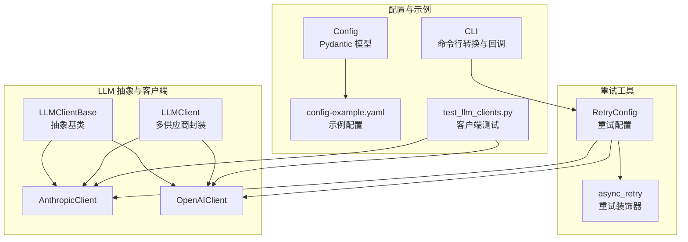
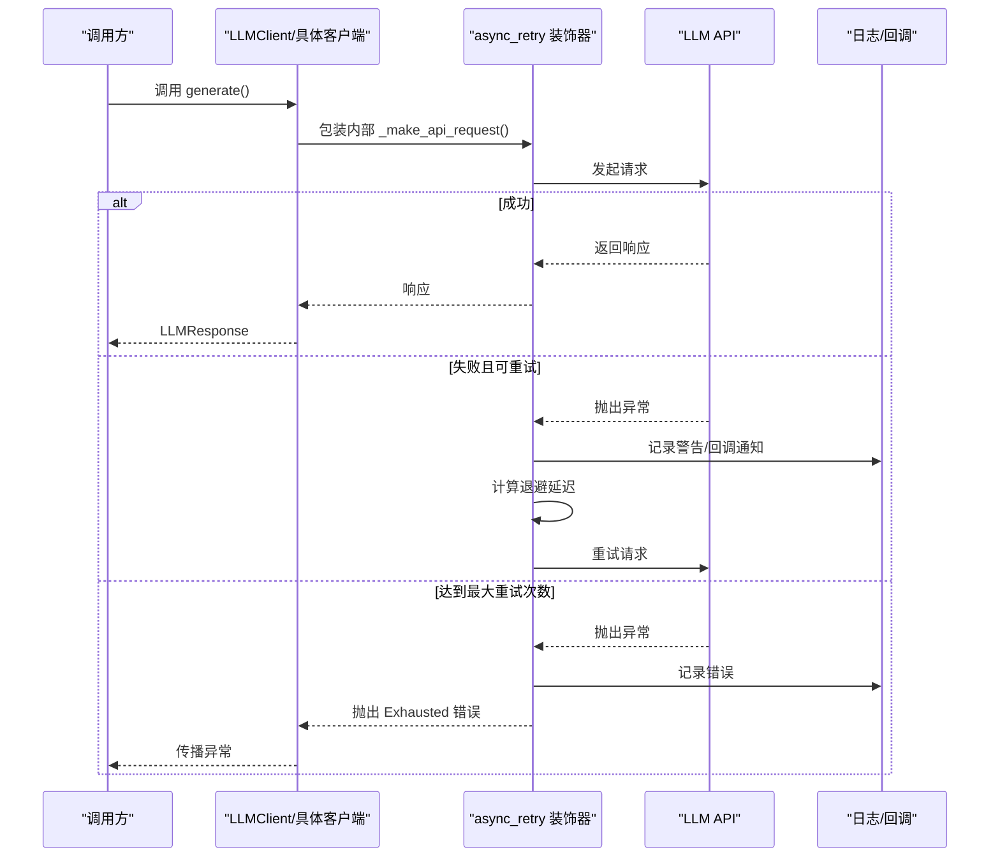
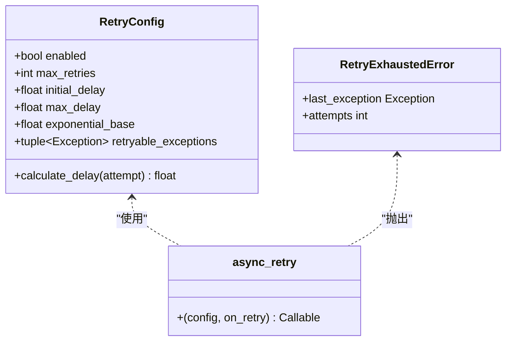
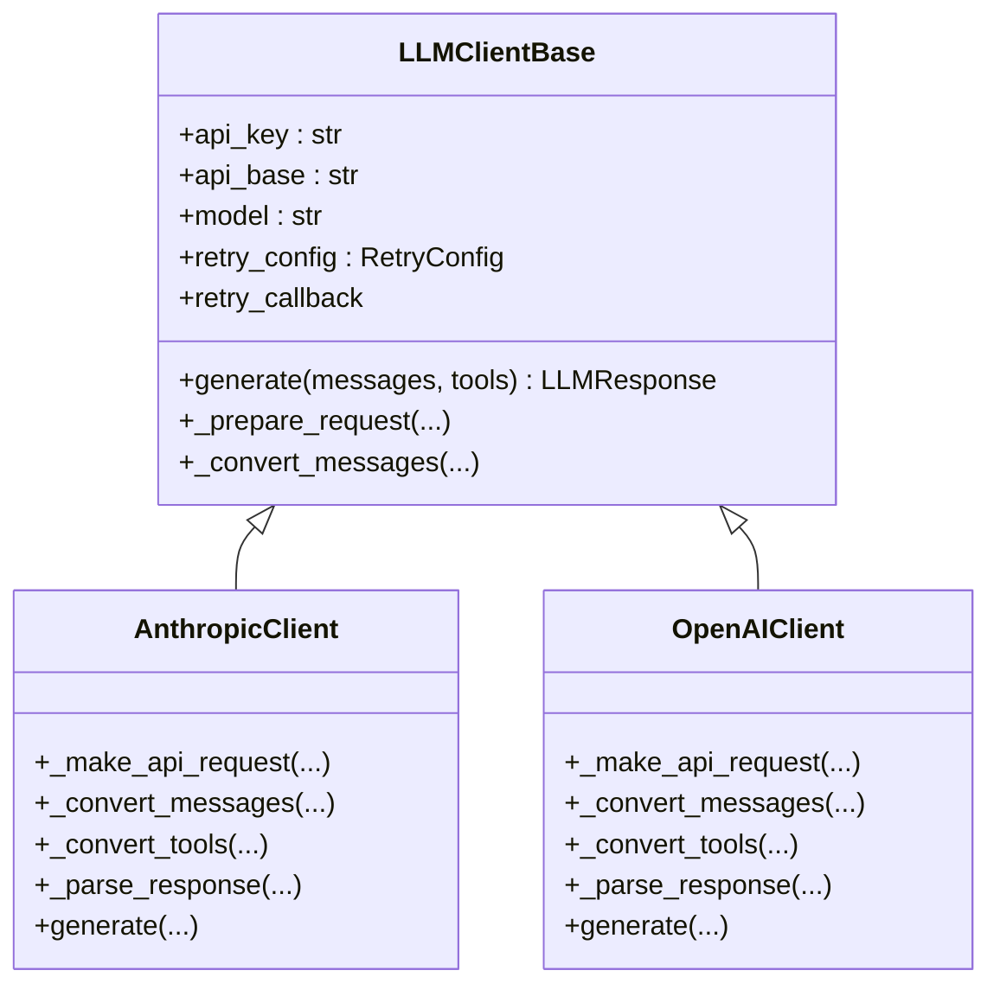
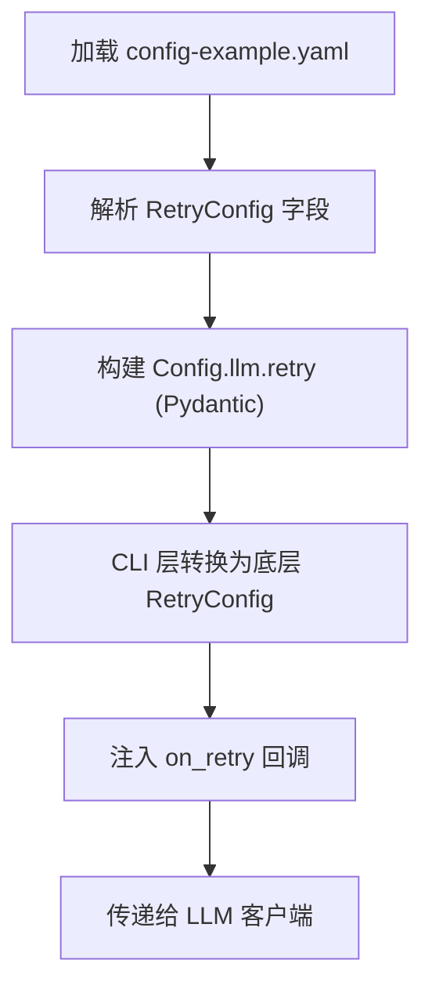
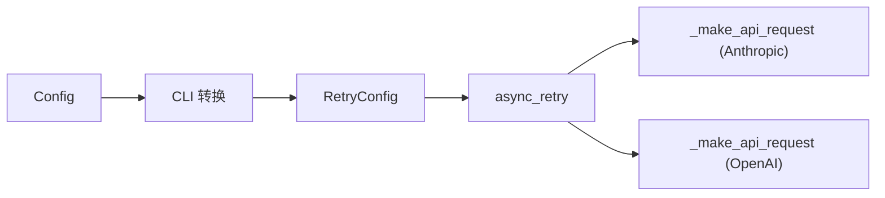

# 重试机制

<cite>
**本文引用的文件列表**
- [retry.py](file://mini_agent/retry.py)
- [base.py](file://mini_agent/llm/base.py)
- [llm_wrapper.py](file://mini_agent/llm/llm_wrapper.py)
- [anthropic_client.py](file://mini_agent/llm/anthropic_client.py)
- [openai_client.py](file://mini_agent/llm/openai_client.py)
- [config.py](file://mini_agent/config.py)
- [config-example.yaml](file://mini_agent/config/config-example.yaml)
- [cli.py](file://mini_agent/cli.py)
- [test_llm_clients.py](file://tests/test_llm_clients.py)
</cite>

## 目录
1. [简介](#简介)
2. [项目结构](#项目结构)
3. [核心组件](#核心组件)
4. [架构总览](#架构总览)
5. [详细组件分析](#详细组件分析)
6. [依赖关系分析](#依赖关系分析)
7. [性能考量](#性能考量)
8. [故障排查指南](#故障排查指南)
9. [结论](#结论)
10. [附录](#附录)

## 简介
本文件系统性阐述 MiniAgent 中的重试机制，覆盖架构设计、策略参数、超时与错误分类、与 LLM 客户端的集成方式（网络错误处理、API 限流应对、连接恢复）、配置示例与使用方法、以及日志与监控实践。目标是帮助开发者在不同环境下灵活调整重试策略，并确保在不稳定网络或上游服务波动时仍能稳定运行。

## 项目结构
重试机制主要由以下模块组成：
- 通用重试工具：提供可复用的异步重试装饰器与配置类
- LLM 抽象层：定义统一接口，承载重试配置注入点
- 具体 LLM 客户端：Anthropic 与 OpenAI 实现，均通过装饰器应用重试逻辑
- 配置系统：支持从 YAML 加载重试参数，CLI 层可转换为底层重试配置
- 测试与示例：验证重试行为与集成效果

图表来源
- [retry.py:23-138](file://mini_agent/retry.py#L23-L138)
- [base.py:10-85](file://mini_agent/llm/base.py#L10-L85)
- [llm_wrapper.py:18-128](file://mini_agent/llm/llm_wrapper.py#L18-L128)
- [anthropic_client.py:15-294](file://mini_agent/llm/anthropic_client.py#L15-L294)
- [openai_client.py:16-296](file://mini_agent/llm/openai_client.py#L16-L296)
- [config.py:12-164](file://mini_agent/config.py#L12-L164)
- [config-example.yaml:28-35](file://mini_agent/config/config-example.yaml#L28-L35)
- [cli.py:539-556](file://mini_agent/cli.py#L539-L556)
- [test_llm_clients.py:25-104](file://tests/test_llm_clients.py#L25-L104)

章节来源
- [retry.py:1-139](file://mini_agent/retry.py#L1-L139)
- [base.py:1-85](file://mini_agent/llm/base.py#L1-L85)
- [llm_wrapper.py:1-128](file://mini_agent/llm/llm_wrapper.py#L1-L128)
- [anthropic_client.py:1-294](file://mini_agent/llm/anthropic_client.py#L1-L294)
- [openai_client.py:1-296](file://mini_agent/llm/openai_client.py#L1-L296)
- [config.py:1-221](file://mini_agent/config.py#L1-L221)
- [config-example.yaml:1-61](file://mini_agent/config/config-example.yaml#L1-L61)
- [cli.py:525-556](file://mini_agent/cli.py#L525-L556)
- [test_llm_clients.py:1-337](file://tests/test_llm_clients.py#L1-L337)

## 核心组件
- 重试配置类：定义启用开关、最大重试次数、初始延迟、最大延迟、指数基数、可重试异常类型集合
- 异步重试装饰器：对任意异步函数进行带指数退避的自动重试，支持回调与日志
- LLM 抽象基类：在构造时接收重试配置，并暴露回调钩子供上层设置
- 具体 LLM 客户端：在生成响应的关键路径上应用装饰器，实现对网络错误、临时性异常的自愈
- 配置系统：从 YAML 文件加载重试参数，CLI 层将其转换为底层重试配置对象
- CLI 回调：在终端中实时显示重试信息，便于调试与观测

章节来源
- [retry.py:23-138](file://mini_agent/retry.py#L23-L138)
- [base.py:17-39](file://mini_agent/llm/base.py#L17-L39)
- [anthropic_client.py:275-293](file://mini_agent/llm/anthropic_client.py#L275-L293)
- [openai_client.py:278-295](file://mini_agent/llm/openai_client.py#L278-L295)
- [config.py:12-164](file://mini_agent/config.py#L12-L164)
- [config-example.yaml:28-35](file://mini_agent/config/config-example.yaml#L28-L35)
- [cli.py:542-556](file://mini_agent/cli.py#L542-L556)

## 架构总览
重试机制以“配置驱动 + 装饰器注入”的方式贯穿 LLM 客户端层，既保证了业务代码的非侵入性，又提供了细粒度的控制能力。

图表来源
- [anthropic_client.py:275-293](file://mini_agent/llm/anthropic_client.py#L275-L293)
- [openai_client.py:278-295](file://mini_agent/llm/openai_client.py#L278-L295)
- [retry.py:73-138](file://mini_agent/retry.py#L73-L138)

## 详细组件分析

### 重试配置与装饰器
- 配置项
  - 启用开关：是否启用重试
  - 最大重试次数：超过该次数后直接失败
  - 初始延迟：首次重试等待秒数
  - 最大延迟：延迟上限，避免无限增长
  - 指数基数：延迟按 base^attempt 增长
  - 可重试异常类型：仅对指定异常触发重试
- 装饰器行为
  - 对异常捕获并判断是否在可重试范围内
  - 计算延迟并等待
  - 支持 on_retry 回调，用于日志或 UI 提示
  - 达到最大次数后抛出 Exhausted 错误

图表来源
- [retry.py:23-71](file://mini_agent/retry.py#L23-L71)

章节来源
- [retry.py:23-138](file://mini_agent/retry.py#L23-L138)

### LLM 抽象与客户端集成
- 抽象基类
  - 接收 RetryConfig 并保存为实例属性
  - 暴露 retry_callback 设置器，供上层注入回调
- 具体客户端
  - 在 generate() 中根据配置决定是否应用装饰器
  - 将 _make_api_request 包装为可重试函数
  - 解析响应并返回统一的 LLMResponse

图表来源
- [base.py:10-85](file://mini_agent/llm/base.py#L10-L85)
- [anthropic_client.py:15-294](file://mini_agent/llm/anthropic_client.py#L15-L294)
- [openai_client.py:16-296](file://mini_agent/llm/openai_client.py#L16-L296)

章节来源
- [base.py:17-39](file://mini_agent/llm/base.py#L17-L39)
- [anthropic_client.py:275-293](file://mini_agent/llm/anthropic_client.py#L275-L293)
- [openai_client.py:278-295](file://mini_agent/llm/openai_client.py#L278-L295)

### 配置系统与 CLI 集成
- 配置模型
  - RetryConfig：从 YAML 读取并映射为 Pydantic 模型
  - LLMConfig：包含 api_key、api_base、model、provider、retry
- CLI 转换
  - 将 Config.llm.retry 映射为底层 RetryConfig
  - 注入 on_retry 回调，用于终端可视化重试过程

图表来源
- [config.py:113-121](file://mini_agent/config.py#L113-L121)
- [config-example.yaml:28-35](file://mini_agent/config/config-example.yaml#L28-L35)
- [cli.py:542-556](file://mini_agent/cli.py#L542-L556)

章节来源
- [config.py:12-164](file://mini_agent/config.py#L12-L164)
- [config-example.yaml:28-35](file://mini_agent/config/config-example.yaml#L28-L35)
- [cli.py:542-556](file://mini_agent/cli.py#L542-L556)

### 使用示例与测试验证
- 测试用例展示了在启用重试的情况下，客户端仍能成功完成简单对话与工具调用
- 示例中通过 RetryConfig 控制最大重试次数，验证重试流程与结果一致性

章节来源
- [test_llm_clients.py:25-104](file://tests/test_llm_clients.py#L25-L104)
- [test_llm_clients.py:108-224](file://tests/test_llm_clients.py#L108-L224)

## 依赖关系分析
- 低耦合高内聚
  - 重试工具独立于 LLM 客户端，通过装饰器模式注入
  - LLM 抽象层仅负责协议适配与消息格式转换
- 关键依赖链
  - RetryConfig → async_retry → 具体客户端的 _make_api_request
  - Config → CLI → 底层 RetryConfig
- 潜在风险
  - 若 on_retry 回调未正确设置，可能无法及时感知重试事件
  - 过高的指数基数或过大的最大延迟可能导致整体耗时过长

图表来源
- [retry.py:73-138](file://mini_agent/retry.py#L73-L138)
- [anthropic_client.py:48-81](file://mini_agent/llm/anthropic_client.py#L48-L81)
- [openai_client.py:48-78](file://mini_agent/llm/openai_client.py#L48-L78)
- [config.py:113-121](file://mini_agent/config.py#L113-L121)
- [cli.py:542-556](file://mini_agent/cli.py#L542-L556)

章节来源
- [retry.py:73-138](file://mini_agent/retry.py#L73-L138)
- [anthropic_client.py:48-81](file://mini_agent/llm/anthropic_client.py#L48-L81)
- [openai_client.py:48-78](file://mini_agent/llm/openai_client.py#L48-L78)
- [config.py:113-121](file://mini_agent/config.py#L113-L121)
- [cli.py:542-556](file://mini_agent/cli.py#L542-L556)

## 性能考量
- 指数退避的收益与成本
  - 降低集中重试导致的级联拥塞，提升整体稳定性
  - 延迟随尝试次数增长，需结合最大延迟限制避免过长等待
- 资源占用
  - 每次重试都会产生一次网络往返与日志开销
  - 在高并发场景下建议合理设置最大重试次数与最大延迟
- 与上游限流配合
  - 当上游出现 429/5xx 等可重试错误时，指数退避可有效缓解瞬时压力
  - 结合业务侧限速策略，避免重试放大流量

[本节为通用性能讨论，不直接分析特定文件]

## 故障排查指南
- 常见问题定位
  - 重试未生效：检查 RetryConfig.enabled 是否开启；确认异常类型是否在 retryable_exceptions 中
  - 重试次数不足：核对 max_retries 与实际异常发生次数
  - 延迟过大：调整 initial_delay、max_delay 或 exponential_base
- 日志与回调
  - 装饰器会在每次重试前输出警告日志，并调用 on_retry 回调
  - CLI 层会将异常与下次延迟信息打印到终端，便于快速诊断
- 失败分析
  - Exhausted 错误包含最后一次异常与尝试次数，可用于统计与告警
  - 结合上游服务状态码与响应体，区分网络错误、认证失败、限流等场景

章节来源
- [retry.py:118-130](file://mini_agent/retry.py#L118-L130)
- [retry.py:64-71](file://mini_agent/retry.py#L64-L71)
- [cli.py:552-556](file://mini_agent/cli.py#L552-L556)

## 结论
MiniAgent 的重试机制通过“配置 + 装饰器”的组合，实现了对 LLM 客户端关键路径的非侵入式增强。它具备指数退避、可配置上限、异常类型筛选、回调与日志等能力，能够有效应对网络抖动、上游限流与瞬时故障。结合 CLI 回调与测试用例，用户可在不同环境与负载条件下灵活调优，获得稳定可靠的推理体验。

[本节为总结性内容，不直接分析特定文件]

## 附录

### 重试策略参数详解
- enabled：是否启用重试
- max_retries：最大重试次数
- initial_delay：首次重试等待秒数
- max_delay：延迟上限
- exponential_base：指数退避基数
- retryable_exceptions：可重试异常类型集合

章节来源
- [retry.py:26-49](file://mini_agent/retry.py#L26-L49)
- [config-example.yaml:28-35](file://mini_agent/config/config-example.yaml#L28-L35)

### 配置示例与使用方法
- YAML 配置示例
  - 在配置文件中设置 retry 字段，即可影响 LLM 客户端的默认重试行为
- CLI 使用
  - CLI 会将 YAML 中的 retry 配置转换为底层 RetryConfig，并注入 on_retry 回调
- 客户端使用
  - AnthropicClient 与 OpenAIClient 在 generate() 中根据配置决定是否应用装饰器
  - 可在调用前设置 retry_callback，以便在终端中看到重试提示

章节来源
- [config-example.yaml:28-35](file://mini_agent/config/config-example.yaml#L28-L35)
- [cli.py:542-556](file://mini_agent/cli.py#L542-L556)
- [anthropic_client.py:275-293](file://mini_agent/llm/anthropic_client.py#L275-L293)
- [openai_client.py:278-295](file://mini_agent/llm/openai_client.py#L278-L295)

### 与 LLM 客户端的集成要点
- 在 LLMClientBase 中注入 RetryConfig，并暴露 retry_callback 设置器
- 在具体客户端的 generate() 中，将核心请求方法包装为可重试函数
- 通过 on_retry 回调实现日志与 UI 提示，便于运维观测

章节来源
- [base.py:17-39](file://mini_agent/llm/base.py#L17-L39)
- [anthropic_client.py:275-293](file://mini_agent/llm/anthropic_client.py#L275-L293)
- [openai_client.py:278-295](file://mini_agent/llm/openai_client.py#L278-L295)