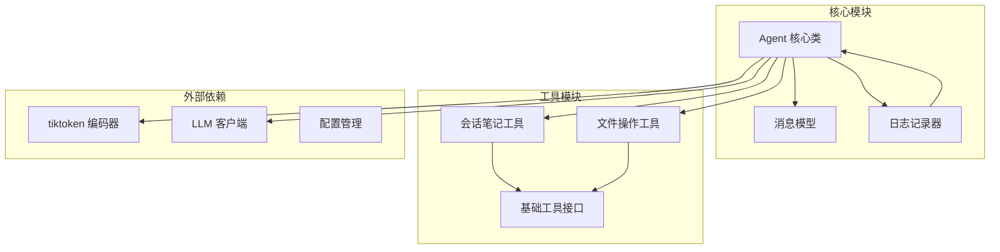
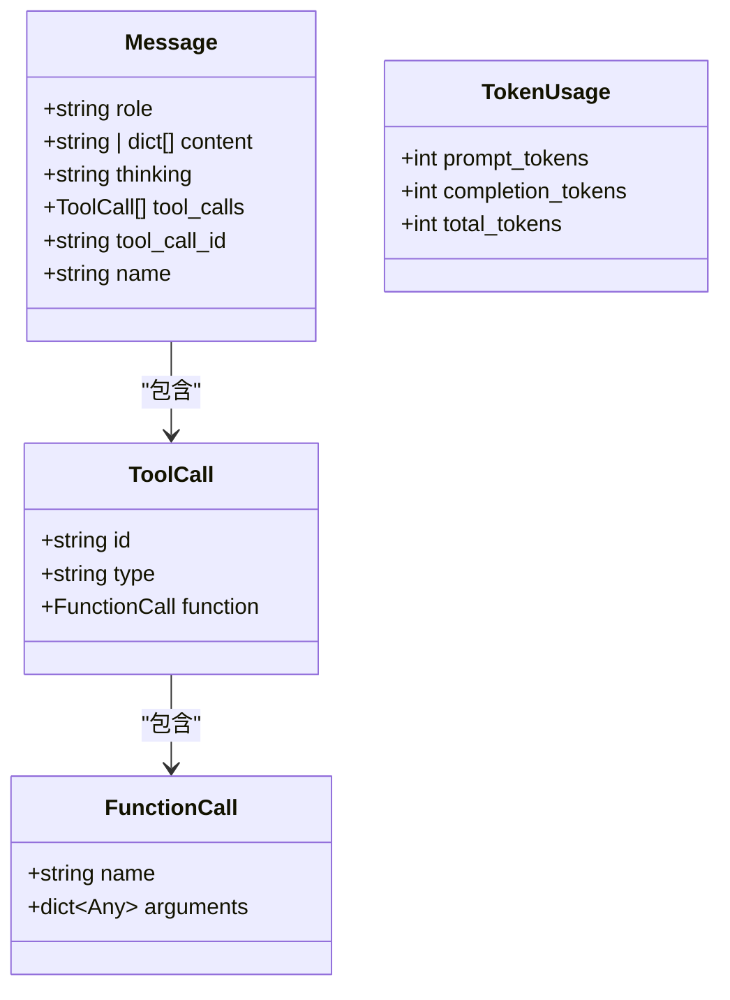
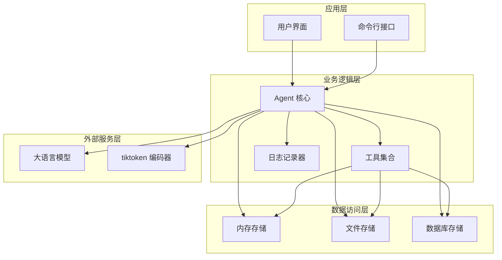
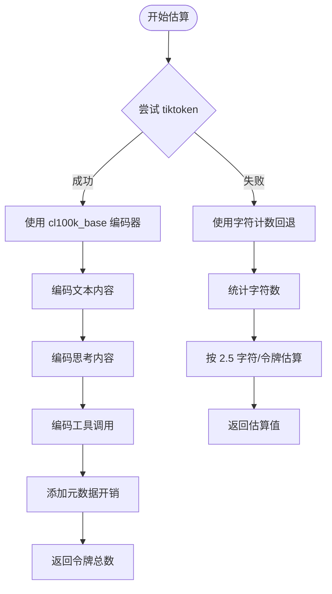
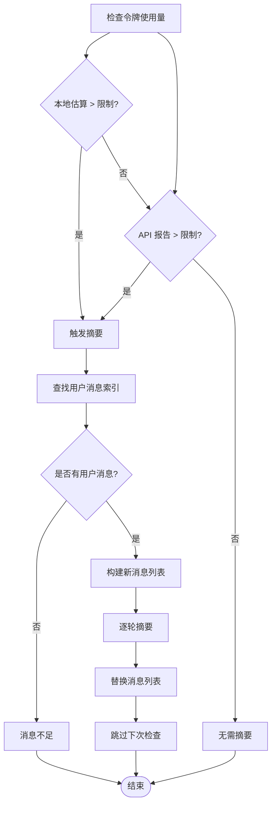
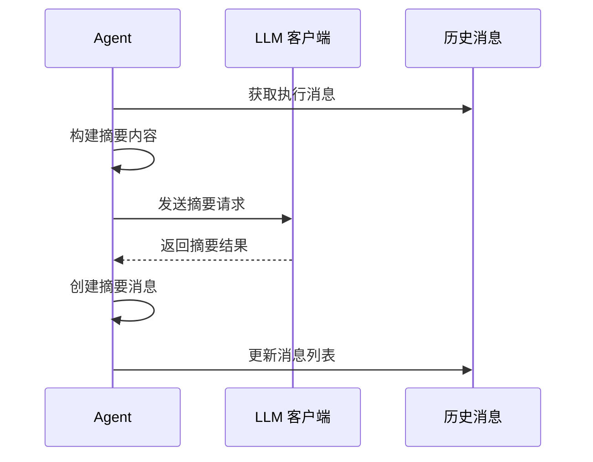
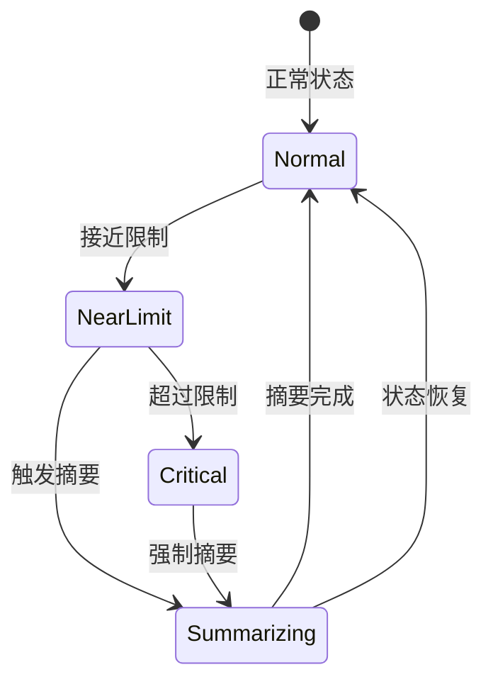
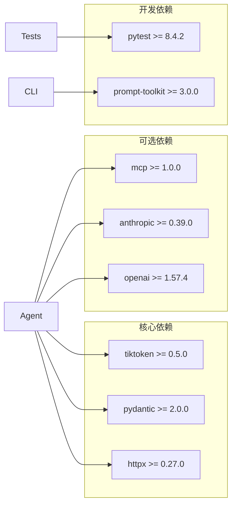
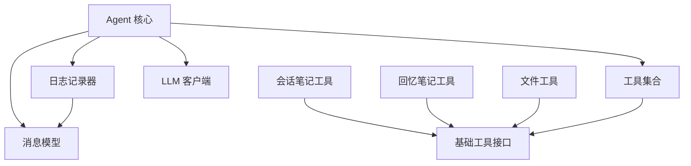

# 上下文管理系统

<cite>
**本文档引用的文件**
- [agent.py](file://mini_agent/agent.py)
- [schema.py](file://mini_agent/schema/schema.py)
- [note_tool.py](file://mini_agent/tools/note_tool.py)
- [file_tools.py](file://mini_agent/tools/file_tools.py)
- [logger.py](file://mini_agent/logger.py)
- [pyproject.toml](file://pyproject.toml)
- [uv.lock](file://uv.lock)
- [03_session_notes.py](file://examples/03_session_notes.py)
- [test_session_integration.py](file://tests/test_session_integration.py)
- [PRODUCTION_GUIDE.md](file://docs/PRODUCTION_GUIDE.md)
- [PRODUCTION_GUIDE_CN.md](file://docs/PRODUCTION_GUIDE_CN.md)
</cite>

## 目录
1. [简介](#简介)
2. [项目结构](#项目结构)
3. [核心组件](#核心组件)
4. [架构概览](#架构概览)
5. [详细组件分析](#详细组件分析)
6. [依赖关系分析](#依赖关系分析)
7. [性能考虑](#性能考虑)
8. [故障排除指南](#故障排除指南)
9. [结论](#结论)

## 简介

MiniAgent 的上下文管理系统是其核心功能之一，负责管理智能对话的历史记录、令牌估算、消息摘要生成以及跨会话的持久化存储。该系统采用多层保护机制，确保在各种环境下都能稳定运行，同时提供灵活的扩展能力。

系统的主要特点包括：
- 基于 tiktoken 的精确令牌估算
- 智能消息摘要生成策略
- 分布式文件系统支持的持久化存储
- 多种回退机制确保系统稳定性
- 支持复杂的对话历史管理

## 项目结构

上下文管理系统主要分布在以下模块中：

**图表来源**
- [agent.py:45-524](file://mini_agent/agent.py#L45-L524)
- [schema.py:29-56](file://mini_agent/schema/schema.py#L29-L56)
- [note_tool.py:17-214](file://mini_agent/tools/note_tool.py#L17-L214)

**章节来源**
- [agent.py:1-524](file://mini_agent/agent.py#L1-L524)
- [pyproject.toml:11-25](file://pyproject.toml#L11-L25)

## 核心组件

### Agent 核心类

Agent 类是上下文管理系统的核心，负责协调所有上下文管理功能。它包含以下关键组件：

- **消息历史管理**：维护完整的对话历史记录
- **令牌估算系统**：精确计算消息的令牌数量
- **消息摘要引擎**：自动压缩长对话历史
- **持久化接口**：提供跨会话的数据保存能力

### 消息数据模型

系统使用 Pydantic 模型定义消息结构，支持多种内容类型：

**图表来源**
- [schema.py:29-56](file://mini_agent/schema/schema.py#L29-L56)

**章节来源**
- [schema.py:14-56](file://mini_agent/schema/schema.py#L14-L56)

## 架构概览

上下文管理系统采用分层架构设计，确保各组件之间的松耦合和高内聚：

**图表来源**
- [agent.py:45-524](file://mini_agent/agent.py#L45-L524)
- [note_tool.py:17-214](file://mini_agent/tools/note_tool.py#L17-L214)

## 详细组件分析

### 令牌估算算法

系统实现了双重令牌估算机制，确保在各种环境下的准确性：

#### 主要估算方法

**图表来源**
- [agent.py:123-178](file://mini_agent/agent.py#L123-L178)

#### tiktoken 编码器使用

系统使用 cl100k_base 编码器，这是大多数现代模型的标准编码器：

- **编码器选择**：优先使用 cl100k_base（GPT-4、Claude、M2 兼容）
- **内容处理**：支持字符串和字典列表两种内容格式
- **元数据开销**：每条消息约 4 个令牌的元数据开销

#### 回退机制

当 tiktoken 不可用时，系统自动切换到字符计数估算：

- **字符统计**：累加所有文本内容的字符数
- **估算比例**：平均 2.5 字符 = 1 令牌
- **适用场景**：离线环境或依赖缺失时

**章节来源**
- [agent.py:123-178](file://mini_agent/agent.py#L123-L178)
- [uv.lock:1310-1369](file://uv.lock#L1310-L1369)

### 对话历史总结策略

系统实现了智能的消息摘要生成机制，有效管理长对话历史：

#### 总结触发条件

**图表来源**
- [agent.py:180-261](file://mini_agent/agent.py#L180-L261)

#### 摘要生成策略

系统采用分组摘要策略，确保关键信息不丢失：

- **保留用户意图**：所有用户消息保持不变
- **压缩执行过程**：将每个用户间的执行过程压缩为摘要
- **结构化输出**：生成清晰的摘要格式，包含工具调用信息

#### 摘要内容提取

**图表来源**
- [agent.py:262-320](file://mini_agent/agent.py#L262-L320)

**章节来源**
- [agent.py:180-320](file://mini_agent/agent.py#L180-L320)

### 消息历史的结构化存储

系统提供了多种存储方式，满足不同的使用场景：

#### 内存存储

- **实时访问**：最快的存储方式
- **临时数据**：适合单次会话内的数据
- **自动清理**：会话结束后自动释放

#### 文件存储

- **持久化**：跨会话数据持久保存
- **JSON 格式**：结构化的数据存储
- **时间戳**：自动记录数据创建时间

#### 分布式存储

- **统一管理**：支持多节点数据同步
- **备份机制**：提供数据冗余保护
- **扩展性**：支持大规模数据存储

**章节来源**
- [note_tool.py:69-89](file://mini_agent/tools/note_tool.py#L69-L89)
- [note_tool.py:128-214](file://mini_agent/tools/note_tool.py#L128-L214)

### 上下文窗口管理策略

系统实现了多层次的上下文窗口管理：

#### 窗口监控

#### 触发机制

- **本地估算**：实时计算当前消息的令牌使用量
- **API 报告**：使用 LLM API 返回的令牌统计
- **双重验证**：确保估算的准确性

#### 保护措施

- **连续触发防护**：摘要后跳过一次检查，避免连续触发
- **智能清理**：取消任务时自动清理不完整的消息
- **内存管理**：定期清理不需要的历史数据

**章节来源**
- [agent.py:193-261](file://mini_agent/agent.py#L193-L261)

## 依赖关系分析

### 外部依赖

系统依赖以下关键库：

**图表来源**
- [pyproject.toml:11-25](file://pyproject.toml#L11-L25)

### 内部依赖关系

**图表来源**
- [agent.py:11-15](file://mini_agent/agent.py#L11-L15)
- [note_tool.py:14](file://mini_agent/tools/note_tool.py#L14)

**章节来源**
- [pyproject.toml:11-25](file://pyproject.toml#L11-L25)

## 性能考虑

### 令牌估算优化

- **批量编码**：tiktoken 支持批量编码，减少函数调用开销
- **缓存机制**：对常用文本进行编码结果缓存
- **增量更新**：只重新估算变化的消息

### 内存管理最佳实践

#### 数据结构优化

- **消息池**：复用消息对象，减少垃圾回收压力
- **延迟加载**：仅在需要时加载历史数据
- **分页机制**：大数据集采用分页加载策略

#### 存储优化

- **压缩存储**：对历史数据进行压缩存储
- **索引优化**：建立高效的查询索引
- **清理策略**：定期清理过期的历史数据

### 并发处理

系统支持异步并发处理：

- **非阻塞 I/O**：文件操作采用异步方式
- **连接池**：LLM API 连接复用
- **任务调度**：智能的任务调度机制

## 故障排除指南

### 常见问题及解决方案

#### tiktoken 初始化失败

**症状**：令牌估算功能异常，显示字符计数估算

**原因**：
- 网络环境限制
- Python 版本不兼容
- 依赖包损坏

**解决方案**：
- 检查网络连接
- 更新 Python 环境
- 重新安装 tiktoken 包

#### 摘要功能异常

**症状**：消息摘要生成失败，系统无法继续运行

**原因**：
- LLM API 调用失败
- 摘要提示词格式错误
- 内存不足

**解决方案**：
- 检查 LLM API 配置
- 验证网络连接
- 增加系统内存

#### 存储权限问题

**症状**：无法读写笔记文件

**原因**：
- 文件权限不足
- 磁盘空间不足
- 路径不存在

**解决方案**：
- 检查文件权限设置
- 清理磁盘空间
- 创建必要的目录结构

**章节来源**
- [agent.py:131-133](file://mini_agent/agent.py#L131-L133)
- [note_tool.py:74-80](file://mini_agent/tools/note_tool.py#L74-L80)

### 调试技巧

#### 日志分析

系统提供了详细的日志记录功能：

- **请求日志**：记录每次 LLM 请求的详细信息
- **响应日志**：保存 LLM 的完整响应
- **工具日志**：跟踪工具执行过程
- **错误日志**：记录系统异常信息

#### 性能监控

- **令牌使用统计**：实时监控令牌使用情况
- **内存使用监控**：跟踪内存占用变化
- **执行时间统计**：分析各阶段耗时

## 结论

MiniAgent 的上下文管理系统展现了现代 AI 应用的最佳实践：

### 核心优势

1. **可靠性**：多重回退机制确保系统在各种环境下稳定运行
2. **智能化**：自动令牌估算和消息摘要减少人工干预
3. **可扩展性**：模块化设计支持功能扩展和定制
4. **易用性**：简洁的 API 设计降低使用门槛

### 发展方向

根据生产指南，系统还有以下改进空间：

- **分布式存储**：引入统一的分布式文件系统
- **精确估算**：使用更精确的令牌计算方法
- **压缩策略**：丰富消息压缩策略，如保留最近 N 条消息
- **召回系统**：集成更强大的知识召回机制

### 最佳实践建议

1. **合理配置令牌限制**：根据具体应用场景调整上下文窗口大小
2. **定期清理历史数据**：避免历史数据无限增长
3. **监控系统性能**：建立完善的监控和告警机制
4. **备份重要数据**：确保关键信息的安全存储

通过这些设计和实践，MiniAgent 的上下文管理系统为构建生产级别的 AI 应用奠定了坚实的基础。